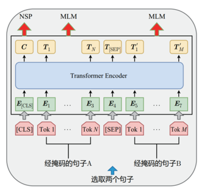
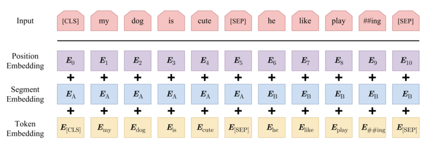
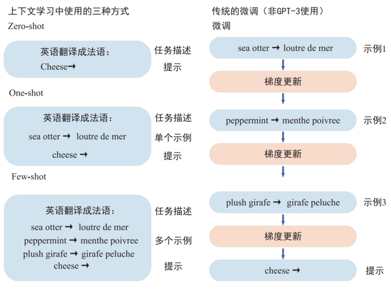
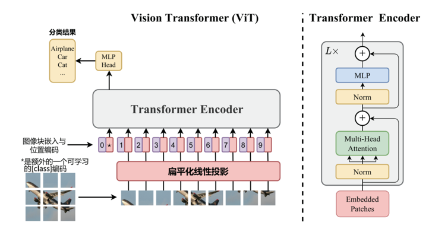
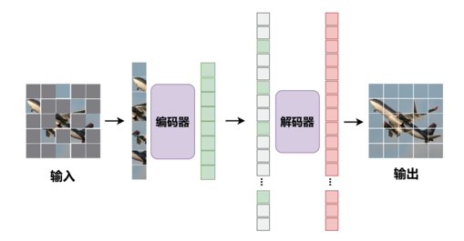

## 目录

- [1.说一下多模态的定义?](#1.说一下多模态的定义?)
- [2.多模态的常用方法有哪些?](#2.多模态的常用方法有哪些?)
- [3.多模态技术主要在哪些AI领域得到了广泛的应用?](#3.多模态技术主要在哪些AI领域得到了广泛的应用?)
- [4.多模态技术有哪些挑战?](#4.多模态技术有哪些挑战?)
- [5.什么是词嵌入?](#5.什么是词嵌入?)
- [6.描述预训练(Pre-training)‌和微调(Fine-tuning)‌的区别?](#6.描述预训练(Pre-training)‌和微调(Fine-tuning)‌的区别?)
- [7.Transformer模型有哪些优势，以及如何使用Transformer进行多模态学习?](#7.Transformer模型有哪些优势，以及如何使用Transformer进行多模态学习?)
- [8.请描述多模态大模型的一般架构?](#8.请描述多模态大模型的一般架构?)
- [9.请描述多模态大模型中的连接器?](#9.请描述多模态大模型中的连接器?)
- [10.随着多模态大模型技术的发展，AI范式正经历着深刻变革，主要体现在哪几个方面?](#10.随着多模态大模型技术的发展，AI范式正经历着深刻变革，主要体现在哪几个方面?)
- [11.多模态基础模型旨在解决哪三个代表性问题?](#11.多模态基础模型旨在解决哪三个代表性问题?)
- [12.BLIP的原理?](#12.BLIP的原理?)
- [13.CLIP的原理?](#13.CLIP的原理?)
- [14.为什么StableDiffusion使用CLIP而不使用BLIP?](#14.为什么StableDiffusion使用CLIP而不使用BLIP?)
- [15.CLIP的textEncoder能输入多少个单词?](#15.CLIP的textEncoder能输入多少个单词?)
- [16.比较BERT和GPT-3的模型结构，并分析它们在语言理解和生成任务上的差异?](#16.比较BERT和GPT-3的模型结构，并分析它们在语言理解和生成任务上的差异?)
- [17.解释ViT和MAE的区别，并说明它们在图像特征提取方面的优势?](#17.解释ViT和MAE的区别，并说明它们在图像特征提取方面的优势?)
- [18.简述预训练基础模型的四种主要学习机制，并分析它们各自的优缺点](#18.简述预训练基础模型的四种主要学习机制，并分析它们各自的优缺点)
- [19.比较提示学习和微调两种方法，并分析它们在下游任务中的适用场景](#19.比较提示学习和微调两种方法，并分析它们在下游任务中的适用场景)
- [20.解释什么是思维链?](#20.解释什么是思维链?)
- [21.分析RLHF基于人类反馈的强化学习方法的原理，并阐述其优缺点?](#21.分析RLHF基于人类反馈的强化学习方法的原理，并阐述其优缺点?)
- [22.BLIP2的工作有哪些创新点?](#22.BLIP2的工作有哪些创新点?)
- [23.解释自监督学习中对比学习的原理，并举例说明其在图像特征提取中的应用?](#23.解释自监督学习中对比学习的原理，并举例说明其在图像特征提取中的应用?)
- [24.说明BLIP-2的查询Transformer如何解决模态差距问题?](#24.说明BLIP-2的查询Transformer如何解决模态差距问题?)
- [25.LLaMA-AdapterV2如何通过早期融合策略提高视觉指令跟随能力?](#25.LLaMA-AdapterV2如何通过早期融合策略提高视觉指令跟随能力?)
- [26.SAM如何通过可提示的分割任务实现强大的泛化能力?](#26.SAM如何通过可提示的分割任务实现强大的泛化能力?)
- [27.PaLM-E如何将连续传感器模态直接融入语言模型中，实现具身智能?](#27.PaLM-E如何将连续传感器模态直接融入语言模型中，实现具身智能?)
- [28.解释上下文学习在多模态大模型中的原理，并举例说明其在数学推理任务中的应用?](#28.解释上下文学习在多模态大模型中的原理，并举例说明其在数学推理任务中的应用?)
- [29.思维树如何通过图结构实现更强大的提示?](#29.思维树如何通过图结构实现更强大的提示?)

<h2 id="1.说一下多模态的定义?">1.说一下多模态的定义?</h2>

多模态是指使用多种不同类型的媒体和数据输入，例如文本、图像、音频、视频等，它们之间存在关联或者对应关系。
这些不同类型的媒体和数据输入可以在不同的层面上传达信息并表达意义。多模态数据的处理需要融合不同类型的信息， 
从而实现更加全面和准确的分析、理解和推断。


<h2 id="2.多模态的常用方法有哪些?">2.多模态的常用方法有哪些?</h2>

**多模态技术**是一种融合多种不同类型的媒体和数据输入，从而实现更加全面和准确的分析、理解和推断的技术。
多模态的常用方法包括数据融合、‌多模态深度学习、‌多模态特征提取、‌多模态数据可视化和多模态信息检索。‌

- **数据融合**：‌将不同来源、‌不同类型的数据结合起来，‌以获得更全面、‌准确的信息。‌数据融合可以采用多种方法，‌如加权平均、‌贝叶斯估计、‌神经网络等。‌
- **多模态深度学习**：‌使用深度学习方法，‌结合多种不同类型的数据(如图像、‌文本、‌语音等)‌进行学习和分析。‌多模态深度学习可以采用多种架构，
‌如卷积神经网络(CNN)‌、‌循环神经网络(RNN)‌、‌自编码器(AE)‌等。‌
- **多模态特征提取**：‌从多种不同类型的数据中提取特征，‌以用于后续分析和处理。‌多模态特征提取可以采用多种方法， 
‌如主成分分析(PCA)‌、‌线性判别分析(LDA)‌、‌多维尺度分析(MDS)‌等。‌
- **多模态数据可视化**：‌将多种不同类型的数据以图形化的方式展示出来，‌以便于分析和理解。‌多模态数据可视化可以采用多种方法，
‌如热力图、‌散点图、‌折线图等。‌
- **多模态信息检索**：‌使用多种不同类型的数据(如文本、‌图像、‌音频等)‌进行信息检索。‌多模态信息检索可以采用多种方法，
‌如基于内容的检索(CBIR)‌、‌基于实例的检索(IBR)‌等。‌
这些多模态技术方法可以单独使用，‌也可以结合使用，‌以获得更好的性能和效果


<h2 id="3.多模态技术主要在哪些AI领域得到了广泛的应用?">3.多模态技术主要在哪些AI领域得到了广泛的应用?</h2>

多模态技术主要在以下领域得到了广泛的应用：‌

- **视觉问答(Visual Question Answering，VQA)‌**：利用图像和自然语言结合的方式来回答关于图像的问题。这需要将图像和问题融合，以便使用多模态模型来解决‌。‌
- **智能对话（Intelligent Dialog)‌**：在智能对话中，模型需要能够理解自然语言，同时在对话中可能涉及图像或其他类型信息。‌
- **图像描述（Image Captioning)‌**：将图像和自然语言结合在一起，为图像生成相应的文字描述。‌
- **图像生成(Image Generation)‌**：‌使用多模态数据(如图像和文本)‌进行图像生成任务。‌
- **情感分析(Sentiment Analysis)**：‌使用多模态数据(如文本和音频)‌进行情感分析任务。‌
- **语音识别(Speech Recognition)**：‌使用多模态数据(如音频和文本)‌进行语音识别任务‌。‌
- **视频生成(Video Generation)**：‌使用多模态数据(如图像和文本)‌进行视频生成任务‌。‌
- **视频理解(Video Understanding)‌**：‌使用多模态数据(如图像、‌文本和音频)‌进行视频理解任务‌。‌
- **图像检索(Image Retrieval)‌**：‌使用多模态数据(如图像和文本)‌进行图像检索任务‌。‌
- **语音检索(Speech Retrieval)**：‌使用多模态数据(如音频和文本)‌进行语音检索任务‌。‌
- **视频检索(Video Retrieval)**：‌使用多模态数据(如视频和文本)‌进行视频检索任务‌。‌


<h2 id="4.多模态技术有哪些挑战?">4.多模态技术有哪些挑战?</h2>

多模态技术面临的挑战包括‌：‌

- **数据稀疏性（Data Sparseness)**：‌由于不同模态的数据量差异巨大，‌导致在训练和推理过程中需要进行大量的数据预处理和数据增强‌。‌
- **模态间的不匹配（Modality Mismatch)**：‌不同模态的数据之间存在差异和差异性，‌这需要使用多模态模型来处理‌。‌
- **模态间的干扰（Modality Interference)**：‌不同模态的数据之间存在干扰和冲突，‌这需要使用多模态模型来处理‌。‌
- **模态间的转换（Modality Conversion)**：‌不同模态的数据之间需要进行转换和整合，‌这需要使用多模态模型来处理‌。‌
- **模态间的融合（Modality Fusion)**：‌不同模态的数据之间需要进行融合和整合，‌这需要使用多模态模型来处理‌。‌


<h2 id="5.什么是词嵌入?">5.什么是词嵌入?</h2>
词嵌入是将每个单词映射到一个固定长度的向量，‌使得在模型中能够进行数学运算。‌这种技术有助于模型理解和生成自然语言。‌


<h2 id="6.描述预训练(Pre-training)‌和微调(Fine-tuning)‌的区别?">6.描述预训练(Pre-training)‌和微调(Fine-tuning)‌的区别?</h2>

- **预训练**是对模型进行初步的训练，‌使其具备一般化的知识或能力。
- **‌微调**则是在预训练的基础上，‌对模型进行进一步的调整，‌以适应特定的任务或领域。‌这两种方法常用于提高模型的性能和适应性。‌


<h2 id="7.Transformer模型有哪些优势，以及如何使用Transformer进行多模态学习?">7.Transformer模型有哪些优势，以及如何使用Transformer进行多模态学习?</h2>

在多模态学习中，Transformer模型的主要优势包括：‌

- **并行计算**：‌自注意力机制允许模型在处理多模态数据时进行并行计算，‌大大提高了计算效率。‌
- **长程依赖**：‌与传统的RNN模型相比，‌Transformer模型通过自注意力机制能够捕捉不同位置之间的依赖关系，‌避免了长序列数据处理中的梯度消失或爆炸问题。‌
- **空间信息处理**：‌与CNN模型相比，‌Transformer模型能够考虑空间信息的关系，‌从而更好地处理多模态数据。‌

如何使用Transformer进行多模态学习?‌

- ‌使用Transformer作为编码器，‌将不同模态的数据进行编码和融合。‌
- ‌使用Transformer作为解码器，‌对融合后的数据进行解码和生成‌。‌
- ‌使用Transformer的注意力机制，‌建立不同模态之间的交互和依赖关系。‌

在多模态Transformer模型中，‌编码器和解码器都由多个Transformer层组成。‌对于纯视觉、‌纯文本和视觉文本混合的任务，‌编码器的输入会有所不同。
‌例如，‌对于视觉文本任务(如视觉问答)‌，‌编码器的输入可能是图像编码器和文本编码器的输出拼接，‌因为这类任务需要同时考虑图像和文本信息。
‌解码器的输入也会根据具体任务而变化，‌例如，‌对于检测任务，‌解码器产生的每个向量都会产生一个输出，‌包括类别和边界框。‌


<h2 id="8.请描述多模态大模型的一般架构?">8.请描述多模态大模型的一般架构?</h2>

多模态大模型的一般架构通常包括视觉编码器、‌连接器和语言模型(LLM)‌。‌连接器用于将视觉和文本模态的嵌入维度进行对齐，‌以便在序列长度维度上进行连接。
‌这种架构使得模型能够有效地处理和融合来自不同模态的信息。‌


<h2 id="9.请描述多模态大模型中的连接器?">9.请描述多模态大模型中的连接器?</h2>

连接器是用于将视觉和文本模态的嵌入维度进行对齐的模块。‌连接器的主要作用是将不同模态的嵌入维度进行对齐，‌以便在序列长度维度上进行连接。‌
连接器通常包括线性变换、‌非线性激活函数和归一化层等操作。‌连接器的设计和选择对多模态大模型的性能和效果有重要影响。‌


<h2 id="10.随着多模态大模型技术的发展，AI范式正经历着深刻变革，主要体现在哪几个方面?">10.随着多模态大模型技术的发展，AI范式正经历着深刻变革，主要体现在哪几个方面?</h2>

AI范式正经历着深刻变革，主要体现在以下几个方面：

- **从单模态到多模态的范式转变**：大模型通常要处理多种类型的数据输入，如图像、视频、文本、语音等，因此在模型结构和训练方法上更加复杂和灵活。
这种从单模态到多模态的范式转变使得AI系统能够更好地理解和处理多种数据类型，从而更好地完成多种任务。
- **从预测到生成的范式转变**：大模型通常基于生成模型构建，可以在没有明确标签或答案的情况下生成新的数据，例如文本、图像和音频等。
这种从预测到生成的范式转变使得AI系统具备了更强的创造力和想象力，能够更好地完成一些具有创新性和创造性的任务。
- **从单任务到多任务的范式转变**：大模型通常具有良好的泛化能力和可迁移性，能够同时处理多个任务。
这种从单任务到在务的范式转变使得AI系统能够更好地适应多变的应用场景，并具备更强的普适性和通用性.
- **从感知到认知的范式转变**：一些多模态大模型具备自我学习和改进的能力，能够不断提高其性能逐渐通近AGI目标。
- **从大模型到超级智能体的转变**：ChatGPT 诞生后，AI 具备了和人类进行多轮对话的能力，并且能针对相应问题给出具体回答与建议。
随后，各个领域推出“智能副驾驶(Copilot)”，如 Microsoft 365 Copilot、GitnmbCopilot、Adobe Fireny 等，
让AI成为办公、代码、设计等场景的“智能副驾驶”。如果说 Copilot 是“副驾驶”,那么 Agent 则可以算得上一个初级的“主驾驶”。
Agent可以通过和环境进行交互，感知信息并做出对应的思考和行动。Agent的最终发展目标就是实现 AGI。


<h2 id="11.多模态基础模型旨在解决哪三个代表性问题?">11.多模态基础模型旨在解决哪三个代表性问题?</h2>


多模态基础模型旨在解决以下三个代表性问题：

- **视觉理解**：学习通用的视觉表征对于构建视觉基础模型至关重要，其原因在于预训练一个强大的视觉骨干模型是所有计算机视觉下游任务的基础，
包括从图像级别(如图像分类、检索和字幕生成)到区域级别(如检测和定位)再到像素级别(如分割)的任务。
- **视觉生成**：由于大规模的图像文本数据的出现，基础图像生成模型得以构建。其中的关键技术包括矢量量化VAE、扩散模型和自回归模型。
- **语言理解和生成相结合的通用接口**：多模态基础模型是为特定目的设计的，用于解决一组特定的计算机视觉问题或任务。
通用模型的出现为AI智能体(AI Agent)奠定了基础。


<h2 id="12.BLIP的原理?">12.BLIP的原理?</h2>

BLIP是一种统一视觉语言理解和生成的预训练模型。BLIP的特点在于它采用了一种编码器-解码器混合架构（MED)，并且引入了CapFilt机制来提高数据质量和模型性能。BLIP的主要组成部分包括：

1. MED架构：包括单模态编码器、图像引导的文本编码器和图像引导的文本解码器，这使得BLIP能够同时处理理解和生成任务。
2. 预训练目标：BLIP在预训练期间联合优化了三个目标，包括图文对比学习、图文匹配和图像条件语言建模。
3. CapFilt机制：包括Captioner和Filter两个模块，Captioner用于生成图像的文本描述，而Filter用于从生成的描述中去除噪声，从而提高数据集的质量。


<h2 id="13.CLIP的原理?">13.CLIP的原理?</h2>

CLIP是由OpenAI提出的一种多模态预训练模型，它通过对比学习的方式，使用大规模的图像和文本数据对来进行预训练。CLIP模型包括两个主要部分：

Text Encoder：用于提取文本的特征，通常采用基于Transformer的模型。

Image Encoder：用于提取图像的特征，可以采用CNN或基于Transformer的Vision Transformer。

CLIP的训练过程涉及将文本特征和图像特征进行对比学习，使得模型能够学习到文本和图像之间的匹配关系。CLIP能够实现zero-shot分类，即在没有特定任务的训练数据的情况下，通过对图像进行分类预测其对应的文本描述。


<h2 id="14.为什么StableDiffusion使用CLIP而不使用BLIP?">14.为什么StableDiffusion使用CLIP而不使用BLIP? </h2>

CLIP是通过对比学习的方式训练图像和文本的编码器，使得图像和文本之间的语义空间能够对齐。CLIP的架构和训练方式可能更适合Stable Diffusion模型的目标，即生成与文本描述相匹配的高质量图像。

BLIP由于其图像特征受到了图文匹配（ITM)和图像条件语言建模(LM)的影响，可以理解为其图像特征和文本特征在语义空间不算对齐的。

最大区别：损失函数，CLIP和BLIP针对任务不同，不同任务不同损失函数。


<h2 id="15.CLIP的textEncoder能输入多少个单词?">15.CLIP的textEncoder能输入多少个单词?</h2>

**CLIP 模型中的 context_length 设置为 77**，表示每个输入句子会被 tokenized 成最多 77 个token。这个 77 并不是直接对应到 77 个单词，
因为一个单词可能会被拆分成多个 token，特别是对于较长的或不常见的单词。

在自然语言处理中，**token 通常指的是模型在处理文本时的最小单位**，可以是单个词，也可以是词的一部分或多个词的组合。
这是因为 CLIP 模型使用了 Byte-Pair Encoding (BPE) 分词器，这种方法会将常见的词作为单个 token，但会把不常见的词拆分成多个 token。

**实际例子**

为了更好地理解，我们来看一个具体的例子：

```Python
import clip

# 加载模型
device = "cuda" if torch.cuda.is_available() else "cpu"
model, preprocess = clip.load("ViT-B/32", device)

# 示例句子
text = "a quick brown fox jumps over the lazy dog."

# 对句子进行 tokenization
tokenized_text = clip.tokenize([text])

print(tokenized_text)
print(tokenized_text.shape)
```

在这个例子中，我们对句子 `"a quick brown fox jumps over the lazy dog."` 进行了 tokenization。让我们看看它的输出：

```Python
tensor([[49406,    320,  1125,  2387,   539,  1906,   315,   262,   682,  1377,
            269, 49407,      0,     0,     0,     0,     0,     0,     0,     0,
            0,     0,     0,     0,     0,     0,     0,     0,     0,     0,
            0,     0,     0,     0,     0,     0,     0,     0,     0,     0,
            0,     0,     0,     0,     0,     0,     0,     0,     0,     0,
            0,     0,     0,     0,     0,     0,     0,     0,     0,     0,
            0,     0,     0,     0,     0,     0,     0,     0,     0,     0,
            0,     0,     0,     0,     0,     0,     0,     0,     0,     0,
            0]])
torch.Size([1, 77])
```

在这个例子中，句子被转换成了 77 个 token ID，其中包含了句子的 token ID 和填充的零。句子的 token 包括起始和结束的特殊 token (49406 和 49407)，
剩余的空位用 0 进行填充。

可以看到，虽然句子有 9 个单词，但经过 tokenization 后得到了 11 个 token（包括起始和结束 token)，加上填充后的长度为 77。

**总结**

- context_length 设置为 77 表示模型的输入长度限制为 77 个 token。
- 77 个 token 不等同于 77 个单词，因为一个单词可能会被拆分成多个 token。
- 实际的单词数量会少于 77 个，具体取决于句子的复杂度和分词方式。
- 通常情况下，77 个 token 可以容纳大约 70 个左右的单词，这取决于句子的内容和复杂度。

为了在实际应用中得到精确的单词数量与 token 数量的关系，可以对输入文本进行 tokenization 并观察其输出。通过这种方式，可以更好地理解模型的输入限制。


<h2 id="16.比较BERT和GPT-3的模型结构，并分析它们在语言理解和生成任务上的差异?">16.比较BERT和GPT-3的模型结构，并分析它们在语言理解和生成任务上的差异?</h2>

**BERT模型结构：**

BERT（Bidirectional Encoder Representations from Transformers)是一种基于Transformer的预训练语言处理模型，它主要由多层Transformer编码器组成。这种结构使得BERT在编码过程中具有独特的优势，即每个位置都能获得所有位置的信息，包括历史位置的信息。这种双向编码的能力使得BERT在理解和处理自然语言方面表现出色。

BERT模型由输入层、编码层和输出层三部分组成。输入层负责将文本数据转换为模型可以理解的格式，编码层则由多层Transformer编码器组成，负责对输入的文本进行深层次的特征提取和编码。最后，输出层则根据不同的任务需求，输出相应的预测结果。

在预训练阶段，BERT模型的最后有两个输出层，分别是掩码语言模型（Masked Language Model, MLM)和下一句预测（Next Sentence Prediction, NSP)。掩码语言模型的目的是预测被掩码的单词，这迫使模型学习单词之间的关系和上下文信息。下一句预测则旨在预测两个句子是否在原始文本中是连续的，这有助于模型理解句子之间的逻辑关系。



BERT 模型的输入表示主要包括三个部分： Token Embedding、 Segment Embedding 和Position Embedding。其中， Token Embedding 用于表示每个单词的向量表示， Segment Embedding 用于区分不同句子的输入， Position Embedding 用于表明每个单词在句子中的位置。



**GPT3模型结构：**

GPT-3 是一个自回归语言模型，沿用了 GPT-2 的结构，在网络容量上有很大的提升，采用了96 层的多头 Transformer，词向量维度为 12,288，共有 1,750 亿个参数，是 GPT-2 的 100 多倍。在给出任务的描述和一些参考案例的情况下， GPT-3 模型能根据当前的任务描述、参数案例理解当前的语境，即使在下游任务和预训练的数据分布不一致的情况下，模型也能表现得很好。 GPT-3 并没有进行微调，在计算子任务的时候不需要计算梯度，而是让案例作为一种输入的指导，帮助模型更好地完成任务。

GPT-3 使用三种方式来评测所有的任务，包括 Few-shot、 One-shot 和 Zero-shot。这三种方式与原本的微调最大的不同，在于是否改变模型的参数。微调会在学习样本的过程中，不断调整自身模型的参数，而 GPT-3 的几种方式，则完全不会调整模型的参数，这也是一个模型能够处理所有任务的基础。




<h2 id="17.解释ViT和MAE的区别，并说明它们在图像特征提取方面的优势?">17.解释ViT和MAE的区别，并说明它们在图像特征提取方面的优势?</h2>

ViT 将图像分成一个个小的图像块 (Patch)，然后将每个图像块进行扁平化处理，得到一个序列。接着，将序列输入 Transformer 编码器中，通过多个 Transformer 编码器层学习图像中的特征表示。最后，使用一个全连接层将编码器的输出映射到类别标签。



MAE 是一个非对称的编码器-解码器 (Encoder-Decoder) 结构的模型，编码器结构采用了 ViT 提出的以 Transformer 为基础的骨干网络，解码器是一个轻量级的结构，在深度和宽度上都比编码器小很多。MAE 的解码器将整个图像的图像块（掩码标志和编码器编码后的未被掩码图像块的图像特征)作为输入。




<h2 id="18.简述预训练基础模型的四种主要学习机制，并分析它们各自的优缺点">18.简述预训练基础模型的四种主要学习机制，并分析它们各自的优缺点</h2>

预训练基础模型的四种主要学习机制包括：

有监督学习：使用标注数据进行训练，模型需要学习输入和输出之间的映射关系。

半监督学习：使用少量标注数据和大量未标注数据进行训练，模型需要学习输入和输出之间的潜在关系。

弱监督学习：使用少量标注数据和大量未标注数据进行训练，但标注数据仅提供部分信息，例如图像中的某些区域或文本中的某些单词。

自监督学习：使用未标注数据进行训练，模型需要学习数据中的内在结构，例如图像中的纹理或文本中的语法规则。

<h2 id="19.比较提示学习和微调两种方法，并分析它们在下游任务中的适用场景">19.比较提示学习和微调两种方法，并分析它们在下游任务中的适用场景</h2>

提示学习通过设计特定的输入提示来引导模型生成所需的输出，它适用于模型已经具备一定泛化能力且需要生成特定类型输出的任务。

提示方法试图通过学习一个语言模型来模拟文本 x自身的概率 P(x; θ)，并使用这个概率预测 y，从而减少对大量标记数据集的需求。提示方法最基本的数学描述包含许多关于提示的研究，并且可以扩展到其他方法。

微调则是通过在下游任务的数据集上调整模型的参数来优化模型在特定任务上的性能，适用于模型在特定任务上需要显著提升性能的情况。


（ 1) 适配器微调：这种方法使用神经适配器或模块化组件，以增强LLM 在特定领域任务上的性能，而不对 LLM 的内部参数进行大幅修改。这些适配器通常集成到现有的 LLM 结构中，允许进行特定任务的学习，同时保持原始模型基本完整。
（ 2) 任务导向微调：这种方法侧重于修改 LLM 的内部参数，以与特定任务对齐。然而，由于硬件限制和潜在的性能下降，完全更新 LLM 的所有参数是不现实的。因此，研究人员面临的挑战在于在广泛的参数空间内确定哪些参数需要被修改，或者如何高效地更新这些参数的子集。


<h2 id="20.解释什么是思维链?">20.解释什么是思维链?</h2>

传统大模型基于“预训练 + 微调”的模式始终没办法很好地完成多步骤推理任务。而 2022年 Jason Wei 提出的思维链提示（Chain-of-Thought Prompting， CoT Prompting）可以显著提高 LLM 的性能，思维链提示使 LLM 能够处理复杂的算术、常识和符号推理任务。

思维链探索了语言模型在推理任务上进行少量示范提示的能力，给定了一个由三元组组成的提示： h 输入，思维链，输出i。思维链是一系列中间的自然语言推理步骤。思维链关注 LLM 如何通过少量任务相关的自然语言数据示例进行学习。


<h2 id="21.分析RLHF基于人类反馈的强化学习方法的原理，并阐述其优缺点?">21.分析RLHF基于人类反馈的强化学习方法的原理，并阐述其优缺点?</h2>

OpenAI 推出的 ChatGPT 掀起了新的 AI 热潮,这一工作的背后是 LLM 生成领域的新训练范式 RLHF，即以强化学习方式依据人类反馈优化语言模型。RLHF 把训练过程分解为三个核心步骤。（1）预训练一个语言模型。（2）收集数据并训练奖励模型。（3）用强化学习的方式微调语言模型。


奖励函数的目的是将所有模型集成到一个 RLHF 流程中。给定数据集中的提示 x 和基于当前微调策略生成的文本 y，将该文本与原始提示连接，将其传递给偏好模型，该模型返回一个“可取性”的标量 rθ。此外，将来自强化学习策略的每个标记的概率分布与初始模型的概率分布进行比较，以计算它们之间差异的惩罚。


缺点：RLHF通过人类反馈来优化语言模型的输出，但需要大量高质量的人类标注数据。


<h2 id="22.BLIP2的工作有哪些创新点?">22.BLIP2的工作有哪些创新点?</h2>

BLIP-2 使用 Q-Former 作为可训练的模块，用于连接冻结的图像编码器和冻结的 LLM。它从图像编码器中提取固定数量的输出特征，这些特征与输入图像的分辨率无关。Q-Former 由两个 Transformer 子模块组成，它们共享相同的自注意力层。

- （1）图像 Transformer 与冻结的图像编码器进行交互，进行视觉特征提取。
- （2）文本 Transformer 既可以作为文本编码器，也可以作为文本解码器。

BLIP-2 创建了一组可学习的输入到图像 Transformer 的查询嵌入。查询通过自注意力层交互，并通过交叉注意力层（每隔一个 Transformer 块插入一个）与冻结的图像特征进行交互，还可以通过相同的自注意力层与文本进行交互。根据不同的预训练任务， BLIP-2 应用不同的自注意力掩码控制查询-文本交互。


在生成学习阶段， BLIP-2 将带有冻结的图像编码器的 Q-Former 连接到冻结的 LLM，以利用 LLM 的生成能力。BLIP-2 先使用全连接层将输出查询表示 Z 线性投影到与 LLM 的文本表示相同的维度。然后，在输入文本表示之前添加投影的查询表示。它们作为软性的视觉提示，将 LLM 置于由 Q-Former 提取的视觉特征上。由于 Q-Former 已经被预训练以提取语言信息的视觉特征，有效地充当了信息瓶颈，馈送最有用的信息给 LLM，同时删除不相关的视觉信息。这减轻了 LLM 学习视觉-语言对齐的负担，缓解了灾难性遗忘问题。

对于基于解码器的 LLM， BLIP-2 使用语言建模损失进行预训练，冻结 LLM 的任务是在Q-Former 提取的视觉特征的条件下生成文本。对于基于编码器-解码器的 LLM， BLIP-2 使用前缀语言建模损失进行预训练，将文本分为两部分：前缀文本与视觉特征连接在一起，作为 LLM编码器的输入；后缀文本作为 LLM 解码器的生成目标。


<h2 id="23.解释自监督学习中对比学习的原理，并举例说明其在图像特征提取中的应用?">23.解释自监督学习中对比学习的原理，并举例说明其在图像特征提取中的应用?</h2>

对比学习的原理，其核心在于通过优化一个目标函数，来促使模型学会区分数据中的相似与不同。具体来说，这一过程涉及两个关键步骤：首先是最大化正样本间的相似度，正样本通常指的是来自同一数据点的不同视角或变换，例如，在图像领域，可以通过对同一张图片进行不同的裁剪、旋转或颜色调整来生成正样本。这样做的好处是，模型能够学会忽略那些不重要的变化，专注于学习数据本质的特征。

接下来是最小化负样本间的相似度。负样本通常是指来自不同数据点的样本。在对比学习中，通过确保模型能够区分这些不同的数据点，模型能够学会为每个数据点生成独特的特征表示。这种方法的有效性在于，它迫使模型去关注数据中的关键差异，而不是表面的、无关紧要的变化。

以图像特征提取为例，对比学习特别有效。在这一领域，对比学习通过将图像与其经过增强的版本视为正样本，而将其他图像的增强版本视为负样本，来训练模型。这种方法使得模型能够学习到具有高度区分度的特征表示。例如，SimCLR（Simple Contrastive Learning of Representations）模型是一个典型的对比学习框架。它首先使用数据增强技术生成图像的多个副本，然后通过对比损失函数来训练模型，使模型能够学会区分不同的图像。


<h2 id="24.说明BLIP-2的查询Transformer如何解决模态差距问题?">24.说明解释BLIP-2的查询Transformer如何解决模态差距问题?</h2>

BLIP-2（Bridging the Language-Image Pre-training Gap）的查询Transformer是一种多模态预训练模型，旨在解决语言和图像之间的模态差距问题。该模型通过结合视觉和文本信息来提高跨模态的理解和生成能力。以下是BLIP-2的查询Transformer如何解决模态差距问题的详细解释：

(1). 多模态预训练
BLIP-2采用多模态预训练的方法，通过同时处理图像和文本数据来学习跨模态的表示。具体来说，模型在预训练阶段使用大规模的图像-文本对，通过对比学习和生成任务来学习通用的跨模态表示。

(2). 查询Transformer架构
BLIP-2的核心是一个查询Transformer模型，该模型结合了视觉和文本信息。查询Transformer的架构允许模型在处理图像和文本时动态地关注相关的信息。

(2.1) 视觉编码器
视觉编码器负责将图像转换为视觉特征向量。BLIP-2使用预训练的视觉模型（如ResNet或ViT）来提取图像特征。

(2.2) 文本编码器
文本编码器负责将文本转换为文本特征向量。BLIP-2使用BERT或RoBERTa等预训练的语言模型来提取文本特征。

(2.3) 查询Transformer
查询Transformer结合了视觉和文本特征，通过自注意力机制和跨模态注意力机制来动态地关注相关的信息。具体来说，模型在处理每个查询时，可以同时考虑图像和文本中的相关信息，从而减少模态之间的差距。

(3). 对比学习
BLIP-2使用对比学习来进一步减少模态差距。具体来说，模型通过比较正样本（匹配的图像-文本对）和负样本（不匹配的图像-文本对）来学习跨模态的表示。这种方法有助于模型学习到更鲁棒的跨模态特征。

(4). 生成任务
BLIP-2还包括生成任务，如图像描述生成和文本条件下的图像生成。这些生成任务有助于模型更好地理解图像和文本之间的关系，从而进一步减少模态差距。

(5). 解决模态差距的具体方法
- **跨模态注意力机制**：查询Transformer通过跨模态注意力机制，使得模型在处理图像和文本时可以动态地关注相关的信息，从而减少模态之间的差距。
- **对比学习**：通过比较正样本和负样本，模型学习到更鲁棒的跨模态特征，从而减少模态差距。
- **生成任务**：生成任务帮助模型更好地理解图像和文本之间的关系，从而进一步减少模态差距。


<h2 id="25.LLaMA-AdapterV2如何通过早期融合策略提高视觉指令跟随能力?">25.LLaMA-AdapterV2如何通过早期融合策略提高视觉指令跟随能力?</h2>

早期融合策略
●策略描述：早期融合策略指的是在模型的早期层就融合视觉信息，这样可以在模型的训练过程中充分利用视觉知识，提高对视觉指令的理解和响应能力。
●对视觉指令跟随能力的影响：通过在模型的早期层融合视觉信息，LLaMA-Adapter V2 能够更有效地处理视觉指令，从而提高其视觉指令跟随能力。
LLaMA-Adapter V2 的其他改进
●偏差调整：通过解锁更多可学习的参数，如范数、偏差和比例，来增强 LLaMA Adapter 的性能，这些参数将指令遵循能力分布到整个 LLaMA 模型中。
●联合训练范式：优化不相交的可学习参数组，引入图像-文本对和指令跟随数据的联合训练范式，缓解图文对齐和指令跟随任务之间的干扰。


<h2 id="26.SAM如何通过可提示的分割任务实现强大的泛化能力?">26.SAM如何通过可提示的分割任务实现强大的泛化能力?</h2>

SAM（Segment Anything Model） 是一种基于提示的可分割模型，它通过以下方式实现强大的泛化能力：
●通用掩码预测器：SAM 采用一个通用的掩码预测器，可以处理任何类别的分割任务，而不需要为每个类别单独训练模型。
●提示机制：SAM 允许用户通过简单的点击或框选来提供分割提示，这使得模型能够适应各种复杂的分割场景。
●大规模预训练：SAM 在大规模数据集上进行预训练，学习到丰富的视觉特征和上下文信息，从而提高了模型的泛化能力。
●微调能力：尽管 SAM 在预训练阶段已经具备了强大的泛化能力，但用户还可以根据特定任务对模型进行微调，以进一步提高性能。


<h2 id="27.PaLM-E如何将连续传感器模态直接融入语言模型中，实现具身智能?">27.PaLM-E如何将连续传感器模态直接融入语言模型中，实现具身智能?</h2>

PaLM-E（Pathways Language Model with Embodied） 是一种将连续传感器模态直接融入语言模型的具身智能模型，其实现方式如下：
●多模态表示：PaLM-E 将视觉、听觉等连续传感器模态的信息编码成向量表示，并与文本信息一起输入到模型中。
●统一编码空间：通过统一的编码空间，PaLME 能够在文本和传感器模态之间建立联系，使得模型能够理解和生成与传感器数据相关的文本。
●强化学习：PaLM-E 使用强化学习算法来优化模型在具身环境中的行为，从而实现更智能的交互和决策。


<h2 id="28.解释上下文学习在多模态大模型中的原理，并举例说明其在数学推理任务中的应用?">28.解释上下文学习在多模态大模型中的原理，并举例说明其在数学推理任务中的应用?</h2>

上下文学习 是指模型能够根据输入的上下文信息来调整其输出的能力。在多模态大模型中，上下文学习原理如下：
●多模态融合：模型能够同时处理文本、图像等多种模态的信息，并将这些信息融合在一起以形成更丰富的上下文表示。
●动态调整：根据输入的上下文信息，模型能够动态地调整其内部参数和输出策略，以适应不同的任务和场景。
数学推理任务中的应用：在数学推理任务中，上下文学习可以帮助模型理解问题的背景和已知条件，从而更准确地推导出答案。例如，当模型遇到一个涉及几何图形的问题时，它可以利用图像模态的信息来辅助理解问题，并结合文本模态的信息进行推理和解答。


<h2 id="29.思维树如何通过图结构实现更强大的提示?">29.思维树如何通过图结构实现更强大的提示?</h2>

思维树 是一种通过图结构来组织信息的提示方法，其实现方式如下：
●节点表示：思维树的每个节点代表一个概念、事实或想法，节点之间通过边相连以表示它们之间的关系。
●层次化结构：思维树采用层次化的结构来组织信息，使得用户可以从宏观到微观逐步深入地思考问题。
●动态更新：用户可以根据需要动态地添加、删除或修改思维树中的节点和边，以适应不同的思考过程和需求。
通过这种图结构，思维树能够提供更丰富、更灵活的提示信息，帮助用户更好地理解和解决问题。

