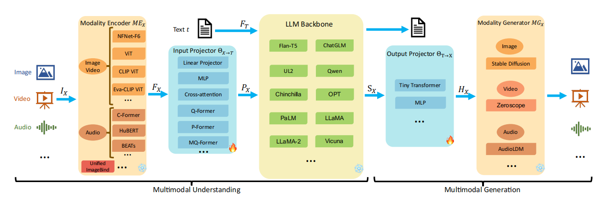

# 《三年面试五年模拟》之AI多模态基础知识高频考点

- :star: [多模态-理论知识](多模态-理论知识.md)
- :blue_book: [多模态-核心模型](多模态-核心模型.md)
- :green_book: [多模态-训练与微调](多模态-训练与微调.md)
- :orange_book: [多模态-模态编码器](多模态-模态编码器.md)
- :eyes: [多模态-输入映射器](多模态-输入映射器.md)
- :rocket: [多模态-大模型主干](多模态-大模型主干.md)
- :bulb: [多模态-输出映射器](多模态-输出映射器.md)
- :1234: [多模态-模态生成器](多模态-模态生成器.md)

