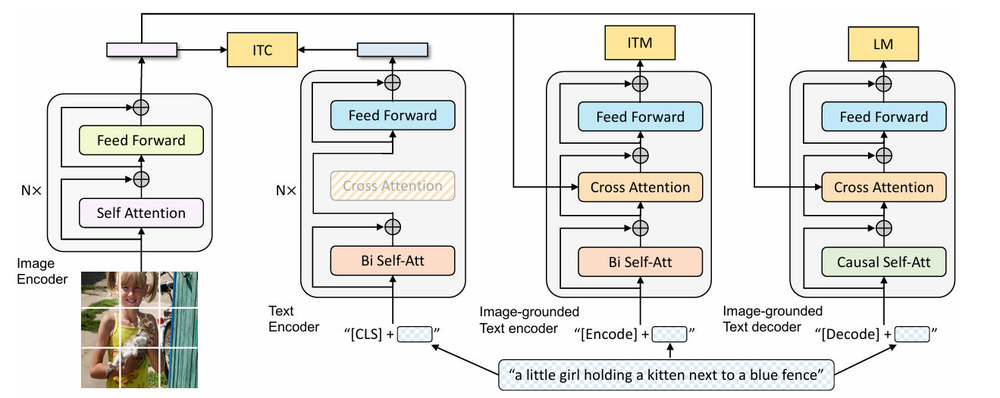
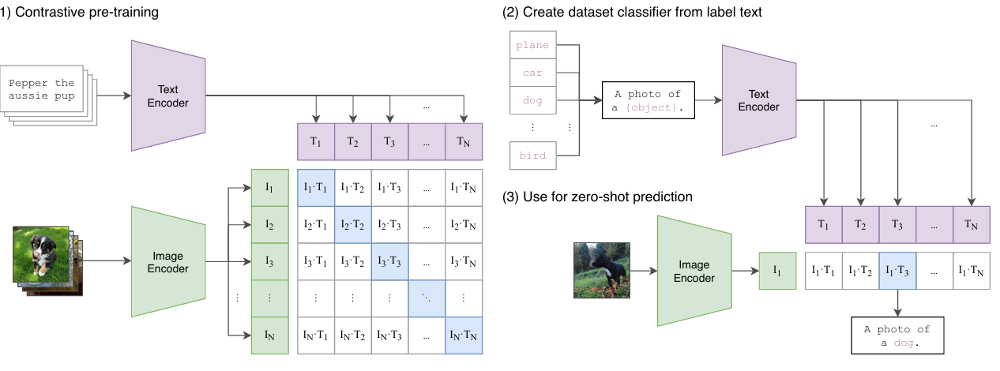
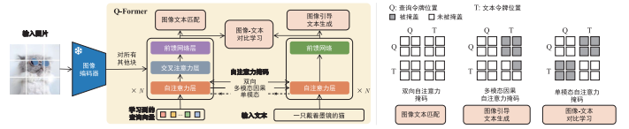

## 目录

- [1.BLIP的原理?](#1.BLIP的原理?)
- [2.CLIP的原理?](#2.CLIP的原理?)
- [3.为什么StableDiffusion使用CLIP而不使用BLIP?](#3.为什么StableDiffusion使用CLIP而不使用BLIP?)
- [4.BLIP2的工作有哪些创新点?](#4.BLIP2的工作有哪些创新点?)
- [5.解释自监督学习中对比学习的原理，并举例说明其在图像特征提取中的应用?](#5.解释自监督学习中对比学习的原理，并举例说明其在图像特征提取中的应用?)
- [6.说明BLIP-2的查询Transformer如何解决模态差距问题?](#6.说明BLIP-2的查询Transformer如何解决模态差距问题?)
- [7.LLaMA-AdapterV2如何通过早期融合策略提高视觉指令跟随能力?](#7.LLaMA-AdapterV2如何通过早期融合策略提高视觉指令跟随能力?)
- [8.SAM如何通过可提示的分割任务实现强大的泛化能力?](#8.SAM如何通过可提示的分割任务实现强大的泛化能力?)
- [9.PaLM-E如何将连续传感器模态直接融入语言模型中，实现具身智能?](#9.PaLM-E如何将连续传感器模态直接融入语言模型中，实现具身智能?)
- [10.CLIP的对比学习机制如何实现跨模态对齐?](#10.CLIP的对比学习机制如何实现跨模态对齐?)
- [11.GPT-4V的多模态推理机制有何创新?](#11.GPT-4V的多模态推理机制有何创新?)
- [12.ImageBind如何实现六模态联合嵌入?](#12.ImageBind如何实现六模态联合嵌入?)
- [13.多模态融合层的设计原则有哪些?](#13.多模态融合层的设计原则有哪些?)
- [14.Sora模型的视频生成技术有何突破?](#14.Sora模型的视频生成技术有何突破?)
- [15.多模态大模型的高效训练策略有哪些?](#15.多模态大模型的高效训练策略有哪些?)
- [16.3D-LLM如何处理三维点云数据?](#16.3D-LLM如何处理三维点云数据?)
- [17.多模态指令微调的关键技术是什么?](#17.多模态指令微调的关键技术是什么?)
- [18.跨模态检索的评估指标有哪些?](#18.跨模态检索的评估指标有哪些?)
- [19.小型视觉语言模型（sVLM）的主要架构分类及各自的优势？](#19.小型视觉语言模型（sVLM）的主要架构分类及各自的优势？)
- [20.知识蒸馏在sVLM中的作用及实现方式？](#20.知识蒸馏在sVLM中的作用及实现方式？)
- [21.模态预融合modality-pre-fusion在sVLM中的具体应用及优势？](#21.模态预融合modality-pre-fusion在sVLM中的具体应用及优势？)
- [22.TinyGPT-V和MiniGPT-4在架构设计上的主要区别？](#22.TinyGPT-V和MiniGPT-4在架构设计上的主要区别？)
- [23.Mamba-based模型相比Transformer-based模型在效率上的改进？](#23.Mamba-based模型相比Transformer-based模型在效率上的改进？)
- [24.sVLM在处理多模态任务时面临的主要挑战？](#24.sVLM在处理多模态任务时面临的主要挑战？)
- [25.轻量级注意力机制如何优化sVLM的计算效率？](#25.轻量级注意力机制如何优化sVLM的计算效率？)
- [26.如何评估sVLM的性能，常用基准测试有哪些？](#26.如何评估sVLM的性能，常用基准测试有哪些？)
- [27.sVLM在资源受限环境中的应用案例？](#27.sVLM在资源受限环境中的应用案例？)
- [28.sVLM的未来发展方向及潜在研究热点？](#28.sVLM的未来发展方向及潜在研究热点？)

<h2 id="1.BLIP的原理?">1.BLIP的原理?</h2>

BLIP是一种统一视觉语言理解和生成的预训练模型。BLIP的特点在于它采用了一种编码器-解码器混合架构（MED)，并且引入了CapFilt机制来提高数据质量和模型性能。BLIP的主要组成部分包括：

1. MED架构：包括单模态编码器、图像引导的文本编码器和图像引导的文本解码器，这使得BLIP能够同时处理理解和生成任务。
2. 预训练目标：BLIP在预训练期间联合优化了三个目标，包括图文对比学习、图文匹配和图像条件语言建模。
3. CapFilt机制：包括Captioner和Filter两个模块，Captioner用于生成图像的文本描述，而Filter用于从生成的描述中去除噪声，从而提高数据集的质量。

<h2 id="2.CLIP的原理?">2.CLIP的原理?</h2>

CLIP是由OpenAI提出的一种多模态预训练模型，它通过对比学习的方式，使用大规模的图像和文本数据对来进行预训练。CLIP模型包括两个主要部分：

Text Encoder：用于提取文本的特征，通常采用基于Transformer的模型。

Image Encoder：用于提取图像的特征，可以采用CNN或基于Transformer的Vision Transformer。

CLIP的训练过程涉及将文本特征和图像特征进行对比学习，使得模型能够学习到文本和图像之间的匹配关系。CLIP能够实现zero-shot分类，即在没有特定任务的训练数据的情况下，通过对图像进行分类预测其对应的文本描述。

<h2 id="3.为什么StableDiffusion使用CLIP而不使用BLIP?">3.为什么StableDiffusion使用CLIP而不使用BLIP? </h2>

CLIP是通过对比学习的方式训练图像和文本的编码器，使得图像和文本之间的语义空间能够对齐。CLIP的架构和训练方式可能更适合Stable Diffusion模型的目标，即生成与文本描述相匹配的高质量图像。

BLIP由于其图像特征受到了图文匹配（ITM)和图像条件语言建模(LM)的影响，可以理解为其图像特征和文本特征在语义空间不算对齐的。

最大区别：损失函数，CLIP和BLIP针对任务不同，不同任务不同损失函数。

<h2 id="4.BLIP2的工作有哪些创新点?">4.BLIP2的工作有哪些创新点?</h2>

BLIP-2 使用 Q-Former 作为可训练的模块，用于连接冻结的图像编码器和冻结的 LLM。它从图像编码器中提取固定数量的输出特征，这些特征与输入图像的分辨率无关。Q-Former 由两个 Transformer 子模块组成，它们共享相同的自注意力层。

- （1）图像 Transformer 与冻结的图像编码器进行交互，进行视觉特征提取。
- （2）文本 Transformer 既可以作为文本编码器，也可以作为文本解码器。

BLIP-2 创建了一组可学习的输入到图像 Transformer 的查询嵌入。查询通过自注意力层交互，并通过交叉注意力层（每隔一个 Transformer 块插入一个）与冻结的图像特征进行交互，还可以通过相同的自注意力层与文本进行交互。根据不同的预训练任务， BLIP-2 应用不同的自注意力掩码控制查询-文本交互。

在生成学习阶段， BLIP-2 将带有冻结的图像编码器的 Q-Former 连接到冻结的 LLM，以利用 LLM 的生成能力。BLIP-2 先使用全连接层将输出查询表示 Z 线性投影到与 LLM 的文本表示相同的维度。然后，在输入文本表示之前添加投影的查询表示。它们作为软性的视觉提示，将 LLM 置于由 Q-Former 提取的视觉特征上。由于 Q-Former 已经被预训练以提取语言信息的视觉特征，有效地充当了信息瓶颈，馈送最有用的信息给 LLM，同时删除不相关的视觉信息。这减轻了 LLM 学习视觉-语言对齐的负担，缓解了灾难性遗忘问题。

对于基于解码器的 LLM， BLIP-2 使用语言建模损失进行预训练，冻结 LLM 的任务是在Q-Former 提取的视觉特征的条件下生成文本。对于基于编码器-解码器的 LLM， BLIP-2 使用前缀语言建模损失进行预训练，将文本分为两部分：前缀文本与视觉特征连接在一起，作为 LLM编码器的输入；后缀文本作为 LLM 解码器的生成目标。

<h2 id="5.解释自监督学习中对比学习的原理，并举例说明其在图像特征提取中的应用?">5.解释自监督学习中对比学习的原理，并举例说明其在图像特征提取中的应用?</h2>

对比学习的原理，其核心在于通过优化一个目标函数，来促使模型学会区分数据中的相似与不同。具体来说，这一过程涉及两个关键步骤：首先是最大化正样本间的相似度，正样本通常指的是来自同一数据点的不同视角或变换，例如，在图像领域，可以通过对同一张图片进行不同的裁剪、旋转或颜色调整来生成正样本。这样做的好处是，模型能够学会忽略那些不重要的变化，专注于学习数据本质的特征。

接下来是最小化负样本间的相似度。负样本通常是指来自不同数据点的样本。在对比学习中，通过确保模型能够区分这些不同的数据点，模型能够学会为每个数据点生成独特的特征表示。这种方法的有效性在于，它迫使模型去关注数据中的关键差异，而不是表面的、无关紧要的变化。

以图像特征提取为例，对比学习特别有效。在这一领域，对比学习通过将图像与其经过增强的版本视为正样本，而将其他图像的增强版本视为负样本，来训练模型。这种方法使得模型能够学习到具有高度区分度的特征表示。例如，SimCLR（Simple Contrastive Learning of Representations）模型是一个典型的对比学习框架。它首先使用数据增强技术生成图像的多个副本，然后通过对比损失函数来训练模型，使模型能够学会区分不同的图像。

<h2 id="6.说明BLIP-2的查询Transformer如何解决模态差距问题?">6.说明解释BLIP-2的查询Transformer如何解决模态差距问题?</h2>

BLIP-2（Bridging the Language-Image Pre-training Gap）的查询Transformer是一种多模态预训练模型，旨在解决语言和图像之间的模态差距问题。该模型通过结合视觉和文本信息来提高跨模态的理解和生成能力。以下是BLIP-2的查询Transformer如何解决模态差距问题的详细解释：

(1). 多模态预训练
BLIP-2采用多模态预训练的方法，通过同时处理图像和文本数据来学习跨模态的表示。具体来说，模型在预训练阶段使用大规模的图像-文本对，通过对比学习和生成任务来学习通用的跨模态表示。

(2). 查询Transformer架构
BLIP-2的核心是一个查询Transformer模型，该模型结合了视觉和文本信息。查询Transformer的架构允许模型在处理图像和文本时动态地关注相关的信息。

(2.1) 视觉编码器
视觉编码器负责将图像转换为视觉特征向量。BLIP-2使用预训练的视觉模型（如ResNet或ViT）来提取图像特征。

(2.2) 文本编码器
文本编码器负责将文本转换为文本特征向量。BLIP-2使用BERT或RoBERTa等预训练的语言模型来提取文本特征。

(2.3) 查询Transformer
查询Transformer结合了视觉和文本特征，通过自注意力机制和跨模态注意力机制来动态地关注相关的信息。具体来说，模型在处理每个查询时，可以同时考虑图像和文本中的相关信息，从而减少模态之间的差距。

(3). 对比学习
BLIP-2使用对比学习来进一步减少模态差距。具体来说，模型通过比较正样本（匹配的图像-文本对）和负样本（不匹配的图像-文本对）来学习跨模态的表示。这种方法有助于模型学习到更鲁棒的跨模态特征。

(4). 生成任务
BLIP-2还包括生成任务，如图像描述生成和文本条件下的图像生成。这些生成任务有助于模型更好地理解图像和文本之间的关系，从而进一步减少模态差距。

(5). 解决模态差距的具体方法
- **跨模态注意力机制**：查询Transformer通过跨模态注意力机制，使得模型在处理图像和文本时可以动态地关注相关的信息，从而减少模态之间的差距。
- **对比学习**：通过比较正样本和负样本，模型学习到更鲁棒的跨模态特征，从而减少模态差距。
- **生成任务**：生成任务帮助模型更好地理解图像和文本之间的关系，从而进一步减少模态差距。

<h2 id="7.LLaMA-AdapterV2如何通过早期融合策略提高视觉指令跟随能力?">7.LLaMA-AdapterV2如何通过早期融合策略提高视觉指令跟随能力?</h2>

早期融合策略
●策略描述：早期融合策略指的是在模型的早期层就融合视觉信息，这样可以在模型的训练过程中充分利用视觉知识，提高对视觉指令的理解和响应能力。
●对视觉指令跟随能力的影响：通过在模型的早期层融合视觉信息，LLaMA-Adapter V2 能够更有效地处理视觉指令，从而提高其视觉指令跟随能力。
LLaMA-Adapter V2 的其他改进
●偏差调整：通过解锁更多可学习的参数，如范数、偏差和比例，来增强 LLaMA Adapter 的性能，这些参数将指令遵循能力分布到整个 LLaMA 模型中。
●联合训练范式：优化不相交的可学习参数组，引入图像-文本对和指令跟随数据的联合训练范式，缓解图文对齐和指令跟随任务之间的干扰。

<h2 id="8.SAM如何通过可提示的分割任务实现强大的泛化能力?">8.SAM如何通过可提示的分割任务实现强大的泛化能力?</h2>

SAM（Segment Anything Model） 是一种基于提示的可分割模型，它通过以下方式实现强大的泛化能力：
●通用掩码预测器：SAM 采用一个通用的掩码预测器，可以处理任何类别的分割任务，而不需要为每个类别单独训练模型。
●提示机制：SAM 允许用户通过简单的点击或框选来提供分割提示，这使得模型能够适应各种复杂的分割场景。
●大规模预训练：SAM 在大规模数据集上进行预训练，学习到丰富的视觉特征和上下文信息，从而提高了模型的泛化能力。
●微调能力：尽管 SAM 在预训练阶段已经具备了强大的泛化能力，但用户还可以根据特定任务对模型进行微调，以进一步提高性能。

<h2 id="9.PaLM-E如何将连续传感器模态直接融入语言模型中，实现具身智能?">9.PaLM-E如何将连续传感器模态直接融入语言模型中，实现具身智能?</h2>

PaLM-E（Pathways Language Model with Embodied） 是一种将连续传感器模态直接融入语言模型的具身智能模型，其实现方式如下：
●多模态表示：PaLM-E 将视觉、听觉等连续传感器模态的信息编码成向量表示，并与文本信息一起输入到模型中。
●统一编码空间：通过统一的编码空间，PaLME 能够在文本和传感器模态之间建立联系，使得模型能够理解和生成与传感器数据相关的文本。
●强化学习：PaLM-E 使用强化学习算法来优化模型在具身环境中的行为，从而实现更智能的交互和决策。

<h2 id="10.CLIP的对比学习机制如何实现跨模态对齐?">10.CLIP的对比学习机制如何实现跨模态对齐?</h2>  
CLIP通过双塔结构实现跨模态对比学习，其视觉编码器和文本编码器分别将图像和文本映射到共享的嵌入空间。模型在大规模图文对数据集上训练，目标是最小化匹配图文对的余弦相似度，同时最大化非匹配对的相似度差异。通过对称交叉熵损失函数优化，CLIP学习到模态无关的语义表征，使图像和文本在嵌入空间中高度对齐。该机制无需人工标注的类别标签，仅依赖自然语言监督即可实现零样本迁移能力。

---

<h2 id="11.GPT-4V的多模态推理机制有何创新?">11.GPT-4V的多模态推理机制有何创新?</h2>  
GPT-4V通过扩展Transformer架构实现多模态联合推理，其核心在于统一处理文本、图像和其他模态的输入。模型采用分阶段训练策略：首先预训练视觉编码器提取图像特征，再与文本标记共同输入语言模型进行跨模态注意力计算。创新性地引入动态路由机制，根据输入模态类型自动选择专家模块，并通过门控网络融合多模态特征。推理时支持交错式多模态输入，通过自回归生成实现复杂跨模态任务（如视觉问答、图文推理等）。

---

<h2 id="12.ImageBind如何实现六模态联合嵌入?">12.ImageBind如何实现六模态联合嵌入?</h2>  
ImageBind通过自监督学习构建跨六种模态（图像、文本、音频、深度、IMU、热成像）的统一嵌入空间。其关键技术包括模态间对比学习损失和层次化对齐策略：利用图像作为枢纽模态，强制其他模态特征与图像特征对齐；同时引入模态间相关性矩阵，学习不同模态的语义关联强度。模型采用共享的Transformer编码器提取特征，并通过可学习的模态适配器将异构数据映射到相同维度。该架构支持零样本跨模态检索和生成任务。

---

<h2 id="13.多模态融合层的设计原则有哪些?">13.多模态融合层的设计原则有哪些?</h2>  
多模态融合层的设计需遵循三原则：1）层次化交互，通过浅层特征拼接、中层注意力融合和深层联合推理实现渐进式信息整合；2）动态门控机制，根据输入内容自适应调整各模态贡献权重；3）跨模态注意力，使用交叉注意力模块建立模态间细粒度关联。先进方法如Gated Multimodal Unit通过门控网络控制信息流，而Multimodal Transformer通过多头交叉注意力实现模态间双向交互。

---

<h2 id="14.Sora模型的视频生成技术有何突破?">14.Sora模型的视频生成技术有何突破?</h2>  
Sora基于扩散Transformer架构实现高保真视频生成，其创新点包括时空分离注意力机制和因果卷积模块。模型将视频分解为时空补丁，通过分层扩散过程逐步去噪：首先生成关键帧，再插值中间帧保证时序连贯性。引入3D位置编码捕获时空依赖关系，并结合物理引擎模拟真实运动轨迹。训练采用大规模视频文本对数据集，通过CLIP嵌入实现细粒度语义控制，支持生成分辨率达1024×1024、时长超1分钟的高质量视频。

---

<h2 id="15.多模态大模型的高效训练策略有哪些?">15.多模态大模型的高效训练策略有哪些?</h2>  
高效训练策略包含四方面：1）混合精度训练，使用FP16/FP8精度减少显存占用，配合梯度缩放保持数值稳定性；2）模态异步训练，对计算密集型模态（如视觉）采用参数冻结或延迟更新；3）数据并行优化，对文本模态采用ZeRO-3分片，视觉模态采用张量并行；4）课程学习策略，先训练单模态基础能力，再逐步增加跨模态任务复杂度。实验表明，这些策略可降低40%训练成本且保持模型性能。

---

<h2 id="16.3D-LLM如何处理三维点云数据?">16.3D-LLM如何处理三维点云数据?</h2>  
3D-LLM采用分层特征提取架构处理点云数据：首先通过体素化将无序点云转换为规则网格，使用3D稀疏卷积提取局部几何特征；接着通过图注意力网络建模点间拓扑关系；最后将全局特征与文本嵌入对齐。创新性地引入可微的神经渲染模块，将3D特征投影到2D视图以实现与视觉语言模型的兼容。训练时采用多任务学习，联合优化点云重建、跨模态检索和三维问答任务。

---

<h2 id="17.多模态指令微调的关键技术是什么?">17.多模态指令微调的关键技术是什么?</h2>  
多模态指令微调需解决三大挑战：

1）指令多样性，通过模板引擎生成涵盖跨模态推理、生成、编辑等任务的百万级指令数据；

2）模态对齐增强，采用对比损失函数约束生成结果与多模态输入的语义一致性；

3）混合专家系统，针对不同任务类型动态路由至专用处理模块。关键技术包括Chain-of-Modality提示技术，引导模型显式分解跨模态推理步骤，以及多粒度奖励模型实现强化学习优化。

---

<h2 id="18.跨模态检索的评估指标有哪些?">18.跨模态检索的评估指标有哪些?</h2>  
跨模态检索主要评估指标包括：

1）Recall@K，衡量前K个结果中包含正确结果的比例；

2）Mean Reciprocal Rank（MRR），计算首个正确结果的倒数排名均值；

3）Normalized Discounted Cumulative Gain（NDCG），考虑结果排序相关性的加权评分；

4）Cross-modal Semantic Consistency，通过预训练模型计算图文嵌入的余弦相似度分布。新兴指标如Modality-Aware F1 Score，综合评估多模态查询中各模态贡献的平衡性。

<h2 id="19.小型视觉语言模型（sVLM）的主要架构分类及各自的优势？">19.小型视觉语言模型（sVLM）的主要架构分类及各自的优势？</h2>  
 
sVLM主要分为三类架构，其特点与优势如下：  

| **架构类型**       | **代表模型**      | **核心创新**                                                                 | **优势**                                                                                     | **典型应用场景**               |  
|--------------------|-------------------|-----------------------------------------------------------------------------|---------------------------------------------------------------------------------------------|--------------------------------|  
| **Transformer-based** | TinyGPT-V, FastVLM | - 多头自注意力机制实现跨模态交互 - 轻量化设计（如Q-Former投影层压缩视觉token至1个） | - 支持高分辨率输入（如1536×1536图像） - 在VizWiz VQA任务中准确率达87% - FLOPs降低70%     | 长文本理解、高精度视觉问答     |  
| **Mamba-based**     | VL-Mamba          | - 结构化状态空间模型（SSM）实现线性复杂度 - 双向扫描（Bidirectional-Scan）机制 | - 科学推理任务速度比Transformer快2.3倍 - 动态参数调整过滤60%冗余特征                     | 时序推理、数学问题解决         |  
| **Hybrid**          | LLaVA-Mini        | - 融合CNN局部特征与Transformer全局上下文 - EVA-ViT编码器结合LoRA微调       | - 医疗影像分析mIoU达68.3% - 内存占用减少45%（对比纯Transformer）                          | 医疗影像、细粒度场景理解       |  

---

<h2 id="20.知识蒸馏在sVLM中的作用及实现方式？">20.知识蒸馏在sVLM中的作用及实现方式？</h2>  
  
**作用**：  
• 将大型教师模型（如CLIP-ViT-L）的知识迁移到轻量级模型，在保持92%精度的同时模型体积缩小76%。  
• 提升跨模态注意力对齐能力，减少因参数不足导致的模态鸿沟。  

**实现方式**：  
1. **特征蒸馏**（TinyViT）：  
   • 使用11层教师模型的中间层特征，通过对比损失将512维CLIP嵌入压缩至256维。  
   • **效果**：在ImageNet分类任务中，模型尺寸缩小76%，精度保持92%。  
2. **注意力蒸馏**（MiniGPT-4）：  
   • 冻结Vicuna语言模型，仅训练线性投影层对齐视觉特征。  
   • **两阶段训练**：500万图文对预训练投影层 → 3500条精标数据微调注意力头数（32→16）。  
3. **动态蒸馏**（FastViT）：  
   • 训练时用3×3深度卷积替代自注意力，推理时重构为1×1卷积。  
   • **效果**：ADE20K分割任务推理速度提升2.1倍，内存消耗降低58%。  

---

<h2 id="21.模态预融合modality-pre-fusion在sVLM中的具体应用及优势？">21.模态预融合modality-pre-fusion在sVLM中的具体应用及优势？</h2>  
  
**应用案例**：  
• **LLaVA-Mini**：  
  • **EVA-ViT编码器**在输入阶段将图像块（patch）与文本token混合，通过交叉注意力生成联合表示。  
  • **效果**：在Flickr30K检索任务中，Recall@1提升至58.3%。  
• **TinyGPT-V**：  
  • **Q-Former模块**将视觉特征动态路由至语言空间，实现早期模态对齐。  

**优势**：  
• **计算延迟降低**：预融合后推理FLOPs减少30%（ADE20K实测）。  
• **细粒度理解提升**：通过早期特征交互捕获模态间隐式关联（如“握住”动作与手部视觉特征的匹配）。  

---

<h2 id="22.TinyGPT-V和MiniGPT-4在架构设计上的主要区别？">22.TinyGPT-V和MiniGPT-4在架构设计上的主要区别？</h2>  

| **特性**               | **TinyGPT-V**                          | **MiniGPT-4**                          |  
|------------------------|-----------------------------------------|-----------------------------------------|  
| **视觉编码器**         | Mamba架构的VSS模块（动态路由）          | ViT-based CLIP编码器                    |  
| **投影层设计**         | 动态路由机制（Dynamic Router）           | 静态线性投影                            |  
| **训练策略**           | 单阶段端到端训练                        | 两阶段训练（预训练+微调）               |  
| **内存占用**           | 1.8GB（224×224输入）                   | 3.2GB（同等输入）                       |  
| **典型应用**           | 边缘设备实时推理                        | 多轮对话场景                            |  

**核心差异**：  
• **动态路由** vs **静态投影**：TinyGPT-V通过可学习的路由策略动态分配视觉特征至语言模型，而MiniGPT-4采用固定投影层。  
• **训练效率**：TinyGPT-V单阶段训练更快，适合资源受限场景；MiniGPT-4通过两阶段微调提升精度。  

---

<h2 id="23.Mamba-based模型相比Transformer-based模型在效率上的改进？">23.Mamba-based模型相比Transformer-based模型在效率上的改进？</h2>  
  
**三大改进点**：  
1. **计算复杂度**：  
   • Transformer的O(n²) → Mamba的O(n)，处理512×512图像时内存占用减少42%。  
2. **动态特征选择**：  
   • **Cross-Scan机制**过滤冗余视觉特征，保留关键信息（如GQA问答任务中准确率提升至63.8%）。  
3. **硬件加速**：  
   • **CUDA核融合技术**将SSM的四个计算步骤合并，在NVIDIA A100上实现12.7K tokens/s吞吐量。  
   • **科学推理任务**（ScienceQA-IMG）推理延迟降至230ms（对比Transformer的600ms）。  

---

<h2 id="24.sVLM在处理多模态任务时面临的主要挑战？">24.sVLM在处理多模态任务时面临的主要挑战？</h2>  
 
**关键挑战**：  
1. **模态鸿沟**：  
   • 文本“狗”与图像中不同品种/姿态的狗语义匹配误差达38%（COCO数据集分析）。  
2. **时序对齐**：  
   • 视频帧率（30fps）与文本描述的粒度不匹配，长视频处理需15GB显存。  
3. **多模态幻觉**：  
   • ActivityNet数据集中13.2%的推理步骤存在视觉误判（如混淆“跑步”与“走路”）。  
4. **资源约束**：  
   • 边缘设备需在1.8GB内存内完成推理（如TinyGPT-V对224×224图像的支持）。  

---

<h2 id="25.轻量级注意力机制如何优化sVLM的计算效率？">25.轻量级注意力机制如何优化sVLM的计算效率？</h2>  
 
**三种主流方法**：  
1. **分组注意力**（LLaVA-Mini）：  
   • 将576个视觉token分为8组，每组执行局部自注意力。  
   • **效果**：计算复杂度从O(n²)降至O(n√n)，VQA任务保持87%准确率。  
2. **动态稀疏注意力**（TinyGPT-V）：  
   • 每层自动选择Top-k（k=32）关键token，减少计算量。  
   • **效果**：Hateful Memes检测F1值达65.3%，内存消耗减少58%。  
3. **轴向注意力**（DeepSeek-VL2）：  
   • 将注意力矩阵分解为行（Row）与列（Column）注意力，显存占用降低63%。  
   • **应用场景**：4096×4096医学影像处理（GPU显存≤24GB）。  

---

<h2 id="26.如何评估sVLM的性能，常用基准测试有哪些？">26.如何评估sVLM的性能，常用基准测试有哪些？</h2>  

**评估维度**与**常用基准**：  

| **任务类型**       | **基准测试**              | **评价指标**                | **代表模型性能**                  |  
|--------------------|---------------------------|----------------------------|-----------------------------------|  
| **视觉问答（VQA）**  | VizWiz, Flickr30K         | 准确率（Accuracy）           | LLaVA-Mini: 87% (VizWiz)         |  
| **图像分割**       | ADE20K, COCO-Stuff        | mIoU                       | TinyGPT-V: 52.3% (ADE20K)         |  
| **文本生成**       | ChatGLM, GPT-4 Prompts   | BLEU-4, ROUGE-L            | MiniGPT-4: BLEU-4=38.2          |  
| **医疗影像**       | CheXpert, NIH Chest X-rays| AUC, Sensitivity/Specificity | LLaVA-Mini: mIoU=68.3 (CheXpert) |  

---

<h2 id="27.sVLM在资源受限环境中的应用案例？">27.sVLM在资源受限环境中的应用案例？</h2>  

**典型案例**：  
1. **边缘设备实时推理**：  
   • **TinyGPT-V**（1.8GB）在Jetson Xavier上实现25FPS的实时VQA，适用于无人机/智能安防场景。  
2. **医疗影像分析**：  
   • **LLaVA-Mini**结合LoRA微调，在胸部X光片分类任务中达到91.5% AUC（仅需4GB显存）。  
3. **自动驾驶感知**：  
   • **VL-Mamba**通过12.7K tokens/s的吞吐量处理车载摄像头输入，支持10Hz的实时物体检测。  

---

<h2 id="28.sVLM的未来发展方向及潜在研究热点？">28.sVLM的未来发展方向及潜在研究热点？</h2>  

**六大研究方向**：  
1. **动态模态加权**：  
   • 根据任务自动调节图文对齐强度（如医疗影像中视觉权重提高至0.7）。  
2. **因果对齐**：  
   • 使用结构因果模型（SCM）识别跨模态混淆变量（如“药物”与“副作用”的因果关系）。  
3. **知识增强蒸馏**：  
   • 将领域知识（如医学本体SNOMED CT）注入蒸馏过程，提升专业场景性能（AUC提升至0.91）。  
4. **异构算子融合**：  
   • 结合CNN的局部敏感性与Transformer的全局依赖，设计轻量级混合算子。  
5. **能效优化**：  
   • 开发FPGA专用量化模块（如4-bit对比学习），功耗降低至7W（较GPU方案下降90%）。  
6. **多模态持续学习**：  
   • 设计灾难性遗忘防止机制，在EdgeTPU等设备上实现增量式学习（如新增10类物体仅需100样本）。  

**潜在突破点**：  
• **时空联合编码**：将视频的时序信息与静态图像特征统一建模（如VL-Mamba的Video-of-Thought框架）。  
• **鲁棒性增强**：通过对抗训练（PGD攻击+BERT-Attack）构建跨模态鲁棒性基准（如AdPO数据集）。  
