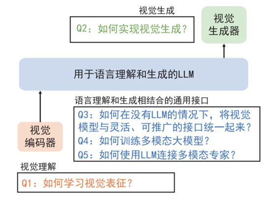

## 目录

- [1.说一下多模态的定义?](#1.说一下多模态的定义?)
- [2.多模态的常用方法有哪些?](#2.多模态的常用方法有哪些?)
- [3.多模态技术主要在哪些AI领域得到了广泛的应用?](#3.多模态技术主要在哪些AI领域得到了广泛的应用?)
- [4.多模态技术有哪些挑战?](#4.多模态技术有哪些挑战?)
- [5.什么是词嵌入?](#5.什么是词嵌入?)
- [6.描述预训练(Pre-training)‌和微调(Fine-tuning)‌的区别?](#6.描述预训练(Pre-training)‌和微调(Fine-tuning)‌的区别?)
- [7.Transformer模型有哪些优势，以及如何使用Transformer进行多模态学习?](#7.Transformer模型有哪些优势，以及如何使用Transformer进行多模态学习?)
- [8.请描述多模态大模型的一般架构?](#8.请描述多模态大模型的一般架构?)
- [9.请描述多模态大模型中的连接器?](#9.请描述多模态大模型中的连接器?)
- [10.随着多模态大模型技术的发展，AI范式正经历着深刻变革，主要体现在哪几个方面?](#10.随着多模态大模型技术的发展，AI范式正经历着深刻变革，主要体现在哪几个方面?)
- [11.多模态基础模型旨在解决哪三个代表性问题?](#11.多模态基础模型旨在解决哪三个代表性问题?)
- [12.从算法层面介绍DPO和PPO有什么区别？](#12.从算法层面介绍DPO和PPO有什么区别？)
- [13.介绍BatchNorm和LayerNorm，为什么transformer是LayerNorm？](#13.介绍BatchNorm和LayerNorm，为什么transformer是LayerNorm？)
- [14.PostNorm和PreNorm这两个技术有什么优缺点？](#14.PostNorm和PreNorm这两个技术有什么优缺点？)
- [15.详细描述一下sft过程的细节?](#15.详细描述一下sft过程的细节?)
- [16.Decoder-Only和Encoder-Decoder模型相比有什么优势？在训练和推理效率上有什么区别？](#16.Decoder-Only和Encoder-Decoder模型相比有什么优势？在训练和推理效率上有什么区别？)
- [17.介绍常见的位置编码，其特点是什么？](#17.介绍常见的位置编码，其特点是什么？)
- [18.多模态大模型微调过程中如何避免灾难性遗忘？](#18.多模态大模型微调过程中如何避免灾难性遗忘？)
- [19.如何有效地将不同模态的数据对齐或融合到同一维度？](#19.如何有效地将不同模态的数据对齐或融合到同一维度？)
- [20.在多模态大模型中，如何进行参数高效微调以提高模型性能？](#20.在多模态大模型中，如何进行参数高效微调以提高模型性能？)
- [21.多模态大模型中一般使用哪些损失函数？](#21.多模态大模型中一般使用哪些损失函数？)
- [22.均方误差在多模态大模型中的定义是什么？](#22.均方误差在多模态大模型中的定义是什么？)
- [23.CLIP模型的损失函数如何设计？](#23.CLIP模型的损失函数如何设计？)
- [24.多模态大语言模型（MLLMs）中幻觉现象的主要来源是什么？](#24.多模态大语言模型（MLLMs）中幻觉现象的主要来源是什么？)
- [25.目前评估MLLMs幻觉现象的基准有哪些？这些基准在评估不同类型幻觉时的侧重点是什么？](#25.目前评估MLLMs幻觉现象的基准有哪些？这些基准在评估不同类型幻觉时的侧重点是什么？)
- [26.缓解MLLMs幻觉现象的方法有哪些？](#26.缓解MLLMs幻觉现象的方法有哪些？)
- [27.多模态大语言模型（MLLMs）中幻觉现象的具体类型有哪些？](#27.多模态大语言模型（MLLMs）中幻觉现象的具体类型有哪些？)
- [28.数据集的质量和多样性对MLLMs的幻觉现象有何影响？](#28.数据集的质量和多样性对MLLMs的幻觉现象有何影响？)
- [29.如何通过改进模型架构来减少MLLMs中的幻觉现象？](#29.如何通过改进模型架构来减少MLLMs中的幻觉现象？)
- [30.在训练过程中，如何有效地利用辅助监督信号来减少幻觉？](#30.在训练过程中，如何有效地利用辅助监督信号来减少幻觉？)
- [31.在推理阶段，如何通过后处理校正来减少MLLMs中的幻觉？](#31.在推理阶段，如何通过后处理校正来减少MLLMs中的幻觉？)

<h2 id="1.说一下多模态的定义?">1.说一下多模态的定义?</h2>

多模态是指使用多种不同类型的媒体和数据输入，例如文本、图像、音频、视频等，它们之间存在关联或者对应关系。
这些不同类型的媒体和数据输入可以在不同的层面上传达信息并表达意义。多模态数据的处理需要融合不同类型的信息， 
从而实现更加全面和准确的分析、理解和推断。

<h2 id="2.多模态的常用方法有哪些?">2.多模态的常用方法有哪些?</h2>

**多模态技术**是一种融合多种不同类型的媒体和数据输入，从而实现更加全面和准确的分析、理解和推断的技术。
多模态的常用方法包括数据融合、‌多模态深度学习、‌多模态特征提取、‌多模态数据可视化和多模态信息检索。‌

- **数据融合**：‌将不同来源、‌不同类型的数据结合起来，‌以获得更全面、‌准确的信息。‌数据融合可以采用多种方法，‌如加权平均、‌贝叶斯估计、‌神经网络等。‌
- **多模态深度学习**：‌使用深度学习方法，‌结合多种不同类型的数据(如图像、‌文本、‌语音等)‌进行学习和分析。‌多模态深度学习可以采用多种架构，
‌如卷积神经网络(CNN)‌、‌循环神经网络(RNN)‌、‌自编码器(AE)‌等。‌
- **多模态特征提取**：‌从多种不同类型的数据中提取特征，‌以用于后续分析和处理。‌多模态特征提取可以采用多种方法， 
‌如主成分分析(PCA)‌、‌线性判别分析(LDA)‌、‌多维尺度分析(MDS)‌等。‌
- **多模态数据可视化**：‌将多种不同类型的数据以图形化的方式展示出来，‌以便于分析和理解。‌多模态数据可视化可以采用多种方法，
‌如热力图、‌散点图、‌折线图等。‌
- **多模态信息检索**：‌使用多种不同类型的数据(如文本、‌图像、‌音频等)‌进行信息检索。‌多模态信息检索可以采用多种方法，
‌如基于内容的检索(CBIR)‌、‌基于实例的检索(IBR)‌等。‌
这些多模态技术方法可以单独使用，‌也可以结合使用，‌以获得更好的性能和效果

<h2 id="3.多模态技术主要在哪些AI领域得到了广泛的应用?">3.多模态技术主要在哪些AI领域得到了广泛的应用?</h2>

多模态技术主要在以下领域得到了广泛的应用：‌

- **视觉问答(Visual Question Answering，VQA)‌**：利用图像和自然语言结合的方式来回答关于图像的问题。这需要将图像和问题融合，以便使用多模态模型来解决‌。‌
- **智能对话（Intelligent Dialog)‌**：在智能对话中，模型需要能够理解自然语言，同时在对话中可能涉及图像或其他类型信息。‌
- **图像描述（Image Captioning)‌**：将图像和自然语言结合在一起，为图像生成相应的文字描述。‌
- **图像生成(Image Generation)‌**：‌使用多模态数据(如图像和文本)‌进行图像生成任务。‌
- **情感分析(Sentiment Analysis)**：‌使用多模态数据(如文本和音频)‌进行情感分析任务。‌
- **语音识别(Speech Recognition)**：‌使用多模态数据(如音频和文本)‌进行语音识别任务‌。‌
- **视频生成(Video Generation)**：‌使用多模态数据(如图像和文本)‌进行视频生成任务‌。‌
- **视频理解(Video Understanding)‌**：‌使用多模态数据(如图像、‌文本和音频)‌进行视频理解任务‌。‌
- **图像检索(Image Retrieval)‌**：‌使用多模态数据(如图像和文本)‌进行图像检索任务‌。‌
- **语音检索(Speech Retrieval)**：‌使用多模态数据(如音频和文本)‌进行语音检索任务‌。‌
- **视频检索(Video Retrieval)**：‌使用多模态数据(如视频和文本)‌进行视频检索任务‌。‌

<h2 id="4.多模态技术有哪些挑战?">4.多模态技术有哪些挑战?</h2>

多模态技术面临的挑战包括‌：‌

- **数据稀疏性（Data Sparseness)**：‌由于不同模态的数据量差异巨大，‌导致在训练和推理过程中需要进行大量的数据预处理和数据增强‌。‌
- **模态间的不匹配（Modality Mismatch)**：‌不同模态的数据之间存在差异和差异性，‌这需要使用多模态模型来处理‌。‌
- **模态间的干扰（Modality Interference)**：‌不同模态的数据之间存在干扰和冲突，‌这需要使用多模态模型来处理‌。‌
- **模态间的转换（Modality Conversion)**：‌不同模态的数据之间需要进行转换和整合，‌这需要使用多模态模型来处理‌。‌
- **模态间的融合（Modality Fusion)**：‌不同模态的数据之间需要进行融合和整合，‌这需要使用多模态模型来处理‌。‌

<h2 id="5.什么是词嵌入?">5.什么是词嵌入?</h2>
词嵌入是将每个单词映射到一个固定长度的向量，‌使得在模型中能够进行数学运算。‌这种技术有助于模型理解和生成自然语言。

<h2 id="6.描述预训练(Pre-training)‌和微调(Fine-tuning)‌的区别?">6.描述预训练(Pre-training)‌和微调(Fine-tuning)‌的区别?</h2>

- **预训练**是对模型进行初步的训练，‌使其具备一般化的知识或能力。
- **‌微调**则是在预训练的基础上，‌对模型进行进一步的调整，‌以适应特定的任务或领域。‌这两种方法常用于提高模型的性能和适应性。

<h2 id="7.Transformer模型有哪些优势，以及如何使用Transformer进行多模态学习?">7.Transformer模型有哪些优势，以及如何使用Transformer进行多模态学习?</h2>

在多模态学习中，Transformer模型的主要优势包括：‌

- **并行计算**：‌自注意力机制允许模型在处理多模态数据时进行并行计算，‌大大提高了计算效率。‌
- **长程依赖**：‌与传统的RNN模型相比，‌Transformer模型通过自注意力机制能够捕捉不同位置之间的依赖关系，‌避免了长序列数据处理中的梯度消失或爆炸问题。‌
- **空间信息处理**：‌与CNN模型相比，‌Transformer模型能够考虑空间信息的关系，‌从而更好地处理多模态数据。‌

如何使用Transformer进行多模态学习?‌

- ‌使用Transformer作为编码器，‌将不同模态的数据进行编码和融合。‌
- ‌使用Transformer作为解码器，‌对融合后的数据进行解码和生成‌。‌
- ‌使用Transformer的注意力机制，‌建立不同模态之间的交互和依赖关系。‌

在多模态Transformer模型中，‌编码器和解码器都由多个Transformer层组成。‌对于纯视觉、‌纯文本和视觉文本混合的任务，‌编码器的输入会有所不同。
‌例如，‌对于视觉文本任务(如视觉问答)‌，‌编码器的输入可能是图像编码器和文本编码器的输出拼接，‌因为这类任务需要同时考虑图像和文本信息。
‌解码器的输入也会根据具体任务而变化，‌例如，‌对于检测任务，‌解码器产生的每个向量都会产生一个输出，‌包括类别和边界框。‌

<h2 id="8.请描述多模态大模型的一般架构?">8.请描述多模态大模型的一般架构?</h2>

多模态大模型的一般架构通常包括视觉编码器、‌连接器和语言模型(LLM)‌。‌连接器用于将视觉和文本模态的嵌入维度进行对齐，‌以便在序列长度维度上进行连接。
‌这种架构使得模型能够有效地处理和融合来自不同模态的信息。‌

<h2 id="9.请描述多模态大模型中的连接器?">9.请描述多模态大模型中的连接器?</h2>

连接器是用于将视觉和文本模态的嵌入维度进行对齐的模块。‌连接器的主要作用是将不同模态的嵌入维度进行对齐，‌以便在序列长度维度上进行连接。‌
连接器通常包括线性变换、‌非线性激活函数和归一化层等操作。‌连接器的设计和选择对多模态大模型的性能和效果有重要影响。‌

<h2 id="10.随着多模态大模型技术的发展，AI范式正经历着深刻变革，主要体现在哪几个方面?">10.随着多模态大模型技术的发展，AI范式正经历着深刻变革，主要体现在哪几个方面?</h2>

AI范式正经历着深刻变革，主要体现在以下几个方面：

- **从单模态到多模态的范式转变**：大模型通常要处理多种类型的数据输入，如图像、视频、文本、语音等，因此在模型结构和训练方法上更加复杂和灵活。
这种从单模态到多模态的范式转变使得AI系统能够更好地理解和处理多种数据类型，从而更好地完成多种任务。
- **从预测到生成的范式转变**：大模型通常基于生成模型构建，可以在没有明确标签或答案的情况下生成新的数据，例如文本、图像和音频等。
这种从预测到生成的范式转变使得AI系统具备了更强的创造力和想象力，能够更好地完成一些具有创新性和创造性的任务。
- **从单任务到多任务的范式转变**：大模型通常具有良好的泛化能力和可迁移性，能够同时处理多个任务。
这种从单任务到在务的范式转变使得AI系统能够更好地适应多变的应用场景，并具备更强的普适性和通用性.
- **从感知到认知的范式转变**：一些多模态大模型具备自我学习和改进的能力，能够不断提高其性能逐渐通近AGI目标。
- **从大模型到超级智能体的转变**：ChatGPT 诞生后，AI 具备了和人类进行多轮对话的能力，并且能针对相应问题给出具体回答与建议。
随后，各个领域推出“智能副驾驶(Copilot)”，如 Microsoft 365 Copilot、GitnmbCopilot、Adobe Fireny 等，
让AI成为办公、代码、设计等场景的“智能副驾驶”。如果说 Copilot 是“副驾驶”,那么 Agent 则可以算得上一个初级的“主驾驶”。
Agent可以通过和环境进行交互，感知信息并做出对应的思考和行动。Agent的最终发展目标就是实现 AGI。

<h2 id="11.多模态基础模型旨在解决哪三个代表性问题?">11.多模态基础模型旨在解决哪三个代表性问题?</h2>

多模态基础模型旨在解决以下三个代表性问题：

- **视觉理解**：学习通用的视觉表征对于构建视觉基础模型至关重要，其原因在于预训练一个强大的视觉骨干模型是所有计算机视觉下游任务的基础，
包括从图像级别(如图像分类、检索和字幕生成)到区域级别(如检测和定位)再到像素级别(如分割)的任务。
- **视觉生成**：由于大规模的图像文本数据的出现，基础图像生成模型得以构建。其中的关键技术包括矢量量化VAE、扩散模型和自回归模型。
- **语言理解和生成相结合的通用接口**：多模态基础模型是为特定目的设计的，用于解决一组特定的计算机视觉问题或任务。
通用模型的出现为AI智能体(AI Agent)奠定了基础。

<h2 id="12.从算法层面介绍DPO和PPO有什么区别？">11.DPO和PPO，DPO和PPO有什么区别？</h2>

**PPO (Proximal Policy Optimization)**: PPO 是一种强化学习算法，采用了策略优化方法。它的目标是通过限制策略更新的幅度来避免策略剧烈变化，减小策略崩溃的风险。具体做法是通过剪裁损失函数，确保策略变化在一个较小的范围内，从而提高训练的稳定性。PPO 的核心是引入了一种近端目标函数，利用优势函数更新策略，兼顾了策略的探索和收敛。

**DPO (Direct Policy Optimization)**: DPO 是一种最近提出的算法，旨在简化传统强化学习中的策略优化问题。它的主要思想是通过直接最小化目标函数来优化策略，而不是像 PPO 一样通过对数比率和剪裁损失函数来进行策略更新。DPO 采用了更直接的优化方式，简化了策略更新的过程。

**区别：**

策略更新: PPO 通过限制策略变化幅度（例如剪裁）来实现稳定训练，而 DPO 更倾向于直接优化目标函数。

稳定性和效率: PPO 通常能够保持较高的稳定性，但训练效率可能较低；DPO 则更高效，但可能在一定程度上牺牲了训练的稳定性。

<h2 id="13.介绍BatchNorm和LayerNorm，为什么transformer是LayerNorm？">13.介绍BatchNorm 和 LayerNorm，为什么transformer是LayerNorm？</h2>

**BatchNorm (Batch Normalization)**: 主要用于卷积神经网络中，通过对 mini-batch 的每个维度进行标准化，减少内部协变量偏移，提高训练的稳定性。

**LayerNorm (Layer Normalization)**: 主要用于 RNN 和 Transformer 等序列模型中，它对整个层进行标准化，独立于 mini-batch，确保在不同时间步和序列长度下具有一致的归一化效果。

Transformer 的输入是序列数据，不同的批次可能会有不同的长度和特征分布，使用 LayerNorm 可以更好地处理这些变化，同时适应不同时间步的归一化需求。

<h2 id="14.PostNorm和PreNorm这两个技术有什么优缺点？">14.PostNorm和PreNorm这两个技术有什么优缺点？</h2>

**PostNorm:** 在注意力层和前馈网络之后进行归一化。这种方式能让主干网络更强大，但归一化的影响在模型早期阶段相对较弱。

**PreNorm:** 在注意力层和前馈网络之前进行归一化，可以增强模型的稳定性，尤其是在训练初期。但随着网络深度增加，归一化可能会影响表示能力的提升。

优缺点：
PostNorm: 优点是后期训练效果较好，缺点是前期训练不够稳定。

PreNorm: 优点是前期训练更稳定，缺点是模型可能会陷入局部最优解。

<h2 id="15.详细描述一下sft过程的细节?">15.详细描述一下sft过程的细节?</h2>

SFT（Supervised Fine-Tuning）的过程通常包括以下几个步骤：

**数据准备**：收集高质量的标注数据集，确保数据能够代表目标任务的特征和分布。

**初始模型加载**：使用预训练的模型作为基础，这通常是一个大型的预训练语言模型。

**模型训练**：

输入输出对：将标注数据转化为输入和期望输出对，以便模型进行学习。

损失函数计算：使用交叉熵等损失函数评估模型输出与实际标注之间的差距。

反向传播：根据损失函数的反馈更新模型参数，以最小化输出与实际标注之间的误差。

**验证与评估**：在验证集上评估模型的性能，调整超参数以提高效果。

**迭代优化**：根据评估结果进行多轮迭代，直到模型在特定任务上达到预期效果。

<h2 id="16.Decoder-Only和Encoder-Decoder模型相比有什么优势？在训练和推理效率上有什么区别？">16.Decoder-Only和Encoder-Decoder模型相比有什么优势？在训练和推理效率上有什么区别？</h2>

**Decoder-Only模型**：结构较为简洁，通常只由一个解码器组成。模型参数较少，相比于Encoder-Decoder模型在训练和推理上可能更高效。在自回归生成任务中表现优异，比如语言模型生成文本。

**训练效率**：

Decoder-Only 模型：在训练过程中，由于模型仅处理解码器部分，参数较少，训练效率较高。

Encoder-Decoder 模型：由于需要同时训练编码器和解码器部分，模型的参数量通常较大，因此训练效率相对较低。

**推理效率**：
Decoder-Only 模型：推理过程中模型依赖先前生成的标记，因此推理时间较长，尤其在生成长文本时。

Encoder-Decoder 模型：推理时编码器只需处理一次输入，但解码器部分的推理仍然逐步进行，因此总的来说推理时间也较长，但对于复杂任务而言，效率可能更好。 

<h2 id="17.介绍常见的位置编码，其特点是什么？">17.介绍常见的位置编码，其特点是什么？</h2>

**绝对位置编码**：
固定正弦-余弦位置编码：最早由 Transformer 引入，使用不同频率的正弦和余弦函数将位置信息编码到每个标记中。
特点：固定不变，无需训练；能够保留序列顺序信息。

**相对位置编码**：
相对位置编码：相对于其他标记的位置信息，而不是绝对位置。常用于改进 Transformer 模型，如 Transformer-XL。
特点：在处理长序列时表现更好，能够捕捉到序列中不同位置之间的关系。

**Learnable Position Encoding（可学习位置编码）**：
特点：直接在模型中引入可训练的参数来表示位置编码，允许模型自己学习最优的位置信息表示。

<h2 id="18.多模态大模型微调过程中如何避免灾难性遗忘？">18.多模态大模型微调过程中如何避免灾难性遗忘？</h2>

在微调大模型的过程中，确实可能会遇到灾难性遗忘的问题，即模型在优化某一特定任务时，可能会忘记之前学到的其他重要信息或能力。为了缓解这种情况，可以采用以下几种策略：

**（1）重新训练**：通过使用所有已知数据重新训练模型，可以使其适应数据分布的变化，从而避免遗忘。

**（2）增量学习**：增量学习是一种在微调过程中逐步添加新数据的方法。通过增量学习，大模型可以在不忘记旧知识的情况下学习新数据。

**（3）知识蒸馏**：知识蒸馏是一种将老模型的知识传递给新模型的方法。通过训练一个教师模型来生成数据标注或权重，然后将标注或权重传递给新模型进行训练，可以避免灾难性遗忘。

**（4）正则化技术**：限制模型参数的变化范围，从而减少遗忘，使得大模型在微调过程中保持稳定性。

**（5）使用任务相关性数据**：如果可能的话，尽量使用与原始任务相关或相似的数据进行微调。这样，模型在优化新任务时，更容易与先前学到的知识建立联系。

<h2 id="19.如何有效地将不同模态的数据对齐或融合到同一维度？">19.如何有效地将不同模态的数据对齐或融合到同一维度？</h2>

多模态数据融合是指将来自不同传感器或来源的多种类型的数据（如图像、文本、语音等）结合起来进行分析和理解的过程。在多模态数据融合中，对齐问题是一个重要的挑战，因为不同模态的数据可能存在表示形式、尺度、时序等方面的差异。

以下是一些常见的方法来解决多模态数据融合中的对齐问题：

- 特征提取和对齐：对于每个模态的数据，可以通过特定的特征提取方法提取出高级语义特征。然后，可以使用对齐技术（如配准、对齐变换）来将不同模态的特征映射到一个共享的特征空间，从而实现模态之间的对齐。
- 时间对齐：对于时序模态数据（如视频、语音），时间对齐是十分重要的。可以使用时间对齐方法（如动态时间规整DTW）来将不同模态的时序数据进行对齐，确保它们在相同的时间尺度上进行融合。
- 基于图模型的方法：可以构建图模型来描述多模态数据之间的相互关系，然后使用图匹配和图割等技术来进行数据对齐和融合。图模型的节点可以表示不同的模态，边可以表示模态之间的相似性或相关性。
- 神经网络方法：深度学习的方法在多模态数据融合中也取得了很好的效果。可以使用神经网络架构，如多视图网络、多模态融合网络等，来学习模态间的对齐和表达，从而实现多模态数据的融合。

<h2 id="20.在多模态大模型中，如何进行参数高效微调以提高模型性能？">20.在多模态大模型中，如何进行参数高效微调以提高模型性能？</h2>

参数高效微调是一种通过少量参数调整来适应新任务的方法，旨在减少微调过程中的计算成本和过拟合风险。具体方法包括在每层网络中加入可训练的token，达到接近全量微调的效果。例如，Lora微调通过将权重矩阵分解成两个低值矩阵，使得微调时只需更新少量的参数。此外，还可以引入文本和图像的promot，通过三种chromes训练模型，效果显著提升。这种方法可以在保持大部分模型参数不变的情况下，显著提高模型在新任务上的性能。

<h2 id="21.多模态大模型中一般使用哪些损失函数？">21.多模态大模型中一般使用哪些损失函数？</h2>

多模态大模型中常用的损失函数包括均方误差（MSE）、交叉熵损失、均绝对误差（MAE）等。这些损失函数在多模态任务中发挥着重要作用，如图像-文本检索、图像描述生成等。以下是对这些损失函数的详细说明以及相关工作中的应用实例：

**常用损失函数**

- **均方误差（MSE）**：用于回归问题，计算预测值与实际值之间差值的平方和的平均值。对较大误差较为敏感，适用于需要精确预测的场景。
- **交叉熵损失**：广泛用于分类问题，衡量预测概率分布与实际标签之间的差异。特别适用于多类分类任务，能够提供清晰的梯度信号，有助于防止过拟合。
- **均绝对误差（MAE）**：对异常值的敏感度较低，适用于存在较多异常值的数据集。

**相关工作中的应用实例**

- **BLIP系列模型**：在BLIP系列模型中，使用了图像-文本对比损失（ITC）来对齐视觉和语言表示，以及图像-文本匹配损失（ITM）来区分正负图像-文本对。
- **MMPareto算法**：该算法在多模态学习中引入了帕累托积分，通过考虑梯度的方向和大小，确保最终梯度的方向对所有学习目标都是通用的，从而增强泛化能力。

<h2 id="22.均方误差在多模态大模型中的定义是什么？">22.均方误差在多模态大模型中的定义是什么？</h2>

均方误差（Mean Squared Error, MSE）在多模态大模型中是一种常用的损失函数，用于衡量模型预测值与实际值之间的差异。它的定义和计算方法如下：

**均方误差的定义**

均方误差是预测误差的平方和的平均值，用于评估模型的预测性能。

**均方误差的计算公式**

$$\text{MSE} = \frac{1}{n} \sum_{i=1}^{n} (y_i - \hat{y}_i)^2$$

其中，$n$ 是样本数量，$y_i$ 是实际值，$\hat{y}_i$ 是预测值。

**均方误差在多模态大模型中的应用**

在多模态大模型中，均方误差常用于回归任务，如图像重建、语音识别等，通过最小化均方误差来优化模型参数，提高模型的预测精度。

均方误差对大误差较为敏感，这使得它在需要精确预测的场景中非常有用，但也需要注意对异常值的处理。

<h2 id="23.CLIP模型的损失函数如何设计？">23.CLIP模型的损失函数如何设计？</h2>

CLIP（Contrastive Language-Image Pre-training）模型是一种基于对比学习的图像-文本预训练模型，其损失函数的设计旨在将图像和文本映射到同一个嵌入空间中，使得匹配的图像-文本对在嵌入空间中更接近，而不匹配的对更远离。以下是CLIP模型中常用的损失函数及其设计思路：

**一、图像-文本对比损失（Image-Text Contrastive Loss, ITC）**

**定义**：

ITC损失通过对比正样本（匹配的图像-文本对）和负样本（不匹配的图像-文本对）来拉近正样本之间的距离，并推远负样本之间的距离。

**公式**：

$$\mathcal{L}_{ITC} = -\log \frac{\exp(\mathbf{v}_i \cdot \mathbf{t}_i / \tau)}{\sum_{j=1}^N \exp(\mathbf{v}_i \cdot \mathbf{t}_j / \tau)}$$

其中，$\mathbf{v}_i$ 是图像 $i$ 的嵌入向量，$\mathbf{t}_i$ 是文本 $i$ 的嵌入向量，$\tau$ 是温度参数，$N$ 是负样本的数量。

**设计思路**：

- **对比学习**：通过对比正负样本，使得匹配的图像-文本对在嵌入空间中更接近，而不匹配的对更远离。
- **温度参数**：$\tau$ 控制对比学习的敏感度，较小的 $\tau$ 会使得模型更加关注于区分相似和不相似的样本。

**二、图像-文本匹配损失（Image-Text Matching Loss, ITM）**

**定义**：

ITM损失用于区分正样本和负样本，通常是一个二分类任务，判断一个图像-文本对是否匹配。

**公式**：

$$\mathcal{L}_{ITM} = \mathbb{1}(y_i = 1) \log p(y_i = 1) + \mathbb{1}(y_i = 0) \log p(y_i = 0)$$

其中，$y_i$ 是标签（1 表示匹配，0 表示不匹配），$p(y_i = 1)$ 是模型预测匹配的概率。

**设计思路**：

- **二分类任务**：通过训练一个二分类器来判断图像-文本对是否匹配，从而增强模型的判别能力。
- **辅助任务**：ITM损失作为一个辅助任务，可以帮助模型更好地学习图像和文本之间的对应关系。

**综合损失函数**

在实际应用中，CLIP模型通常会综合使用上述损失函数，以全面优化模型的性能：

$$\mathcal{L} = \mathcal{L}_{ITC} + \lambda_1 \mathcal{L}_{ITM} + \lambda_2 \mathcal{L}_{Rec}$$

其中，$\lambda_1$ 和 $\lambda_2$ 是超参数，用于平衡不同损失函数的贡献。

CLIP模型的损失函数设计通过对比学习和匹配损失，有效地将图像和文本映射到同一嵌入空间中，从而提高了模型在图像-文本检索和任务中的性能。

<h2 id="24.多模态大语言模型（MLLMs）中幻觉现象的主要来源是什么？">24.多模态大语言模型（MLLMs）中幻觉现象的主要来源是什么？</h2>

幻觉现象在多模态大语言模型（MLLMs）中的主要来源包括数据、模型、训练和推理四个方面。

- 数据：数据的质量、数量和统计偏差可能导致幻觉。例如，数据集的噪声、缺乏多样性以及对象共现偏差都会影响模型的表现。
- 模型：模型的架构和组件（如视觉模型、语言模型和对齐接口）的弱点可能导致幻觉。视觉模型的感知能力不足、语言模型的知识先验以及弱对齐接口都是潜在的原因。
- 训练：训练目标和方法的选择不当也可能导致幻觉。例如，仅使用自回归下一个标记预测损失可能不足以处理视觉内容的复杂空间结构。
- 推理：在生成过程中，随着序列长度的增加，模型可能会更多地关注先前生成的文本标记，而忽略视觉内容，从而导致幻觉。

<h2 id="25.目前评估MLLMs幻觉现象的基准有哪些？这些基准在评估不同类型幻觉时的侧重点是什么？">25.目前评估MLLMs幻觉现象的基准有哪些？这些基准在评估不同类型幻觉时的侧重点是什么？</h2>
目前用于评估多模态大语言模型（MLLMs）中幻觉的标准基准和指标包括：

- CHAIR：用于评估图像描述任务中的对象幻觉，通过计算生成文本中实际存在于图像中的单词比例。
- POPE：将幻觉评估转化为二元分类任务，通过简单的“是或否”问题来评估对象幻觉。
- MME：一个综合评估基准，涵盖感知和认知能力的多个子任务，包括对象存在、计数、位置和颜色等。
- CIEM：使用自动管道生成的数据进行幻觉评估，重点在于对象存在幻觉。
- AMBER：支持生成任务和判别任务的评估，结合CHAIR和F1分数形成综合评分。
- 
这些基准和指标各有侧重，评估维度也不同，提供了对MLLMs幻觉现象的多角度分析。

<h2 id="26.缓解MLLMs幻觉现象的方法有哪些？">26.缓解MLLMs幻觉现象的方法有哪些？</h2>

缓解MLLMs中幻觉现象的方法可以从数据、模型、训练和推理四个方面入手：

- 数据：引入负样本、反事实数据和减少现有数据集中的噪声和错误。例如，LRV-Instruction通过包含正负指令样本来增强视觉指令调优的鲁棒性。
- 模型：提升视觉编码器的分辨率和多样性，引入专用模块来控制参数知识的程度。例如，HallE-Switch通过对比学习增强视觉和文本表示的对齐。
- 训练：使用辅助监督信号、强化学习和无监督学习等方法。例如，MOCHa框架通过多目标奖励函数引导强化学习过程，减少幻觉。
- 推理：采用对比解码、引导解码和后处理校正等方法。例如，VCD通过对比原始和失真视觉输入的输出分布来抑制统计偏差和语言先验。

<h2 id="27.多模态大语言模型（MLLMs）中幻觉现象的具体类型有哪些？">27.多模态大语言模型（MLLMs）中幻觉现象的具体类型有哪些？</h2>

幻觉现象在多模态大语言模型（MLLMs）中主要表现为对象幻觉，具体可以分为以下三类：

- 类别幻觉：模型识别出图像中不存在的对象类别或错误的对象类别。例如，模型描述图像中存在“一些长椅和一个篱笆”，而实际上图像中没有这些对象。
- 属性幻觉：模型正确识别了对象类别，但对对象的属性描述错误。例如，模型描述图像中的花朵为“粉红色的花朵”，而实际上花朵的颜色并不准确。
- 关系幻觉：模型正确识别了对象及其属性，但对象之间的关系描述不准确。例如，模型描述图像中的人物“站在她周围观看”，而实际上人物在图像中的位置关系并不如此。

<h2 id="28.数据集的质量和多样性对MLLMs的幻觉现象有何影响？">28.数据集的质量和多样性对MLLMs的幻觉现象有何影响？</h2>
数据集的质量和多样性对MLLMs的幻觉现象有显著影响：

- 数据质量：低质量的数据集包含噪声、不准确的标注或不完整的图像，可能导致模型在训练过程中学习到错误的信息，从而在生成文本时产生幻觉。
- 数据多样性：缺乏多样性的数据集可能导致模型在处理未见过的场景或对象时表现不佳，容易产生幻觉。例如，训练数据中缺乏否定指令或拒绝回答的样本，可能导致模型在面对否定问题时倾向于回答“是”。

<h2 id="29.如何通过改进模型架构来减少MLLMs中的幻觉现象？">29.如何通过改进模型架构来减少MLLMs中的幻觉现象？</h2>

改进模型架构可以从以下几个方面入手：

- 增强视觉编码器：使用更高分辨率的视觉编码器或引入多种视觉编码器（如CLIP和DINO的混合特征）来提高模型的视觉感知能力。
- 引入专用模块：设计专门的“开关”模块（如HallE-Switch）来控制模型在生成详细描述时的参数知识程度，减少基于语言知识的幻觉。
- 多任务学习：通过多任务学习框架整合多种视觉和语言任务，增强模型的跨模态理解能力。

<h2 id="30.在训练过程中，如何有效地利用辅助监督信号来减少幻觉？">30.在训练过程中，如何有效地利用辅助监督信号来减少幻觉？</h2>

在训练过程中，可以通过以下方法利用辅助监督信号来减少幻觉：

- 关系关联指令（RAI-30k）：构建一个细粒度的视觉指令数据集，每个指令与关系标注相关联，使用掩码预测损失来引导模型关注图像中的关键实例。
- 对比学习：通过对比学习增强视觉和文本表示的对齐，使用幻觉样本作为负例，拉近非幻觉文本和视觉样本的距离。

<h2 id="31.在推理阶段，如何通过后处理校正来减少MLLMs中的幻觉？">31.在推理阶段，如何通过后处理校正来减少MLLMs中的幻觉？</h2>
在推理阶段，可以通过以下方法进行后处理校正来减少幻觉：

（1）Woodpecker：提取生成文本中的关键概念，通过视觉内容验证这些概念，检测并修正幻觉内容。
（2）LURE：使用一个专门的幻觉修正器模型，将潜在的幻觉描述转换为准确的描述。训练数据集包含图像和幻觉描述，目标是将幻觉描述修正为准确描述。
