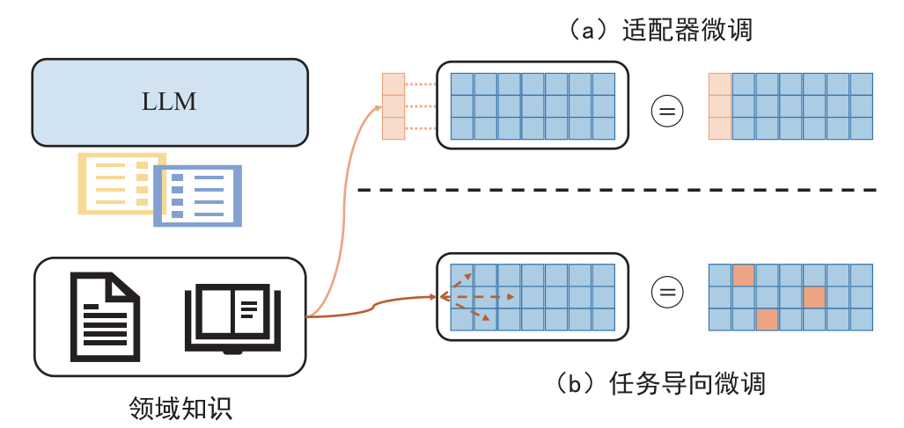
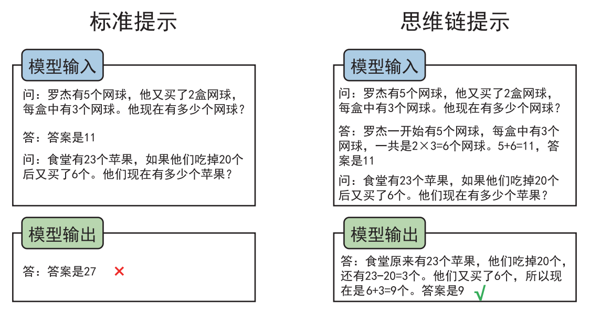
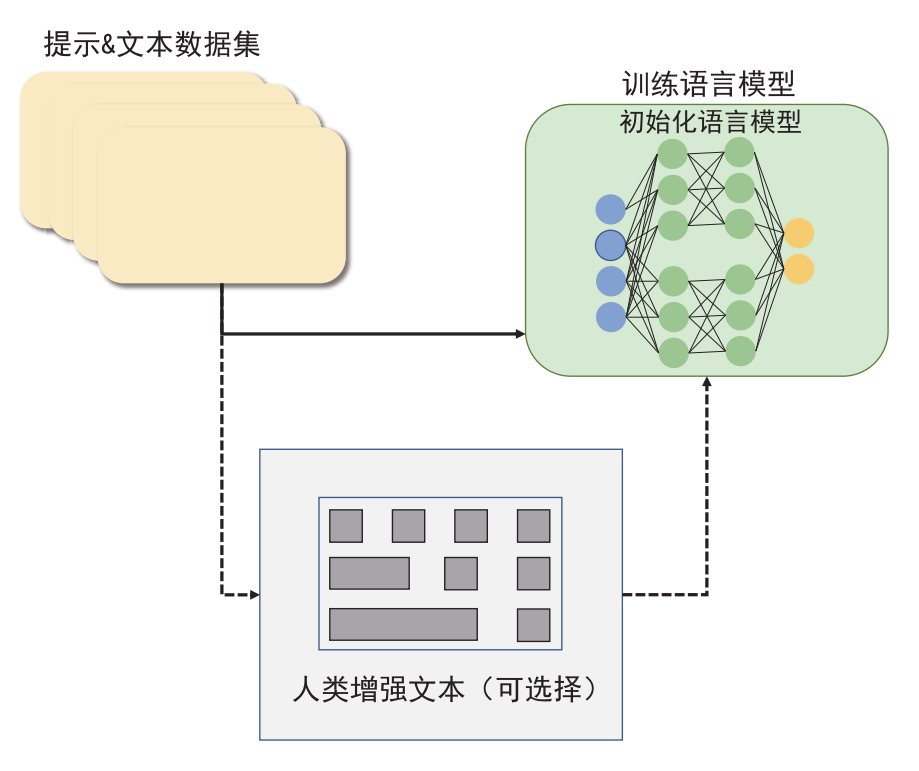
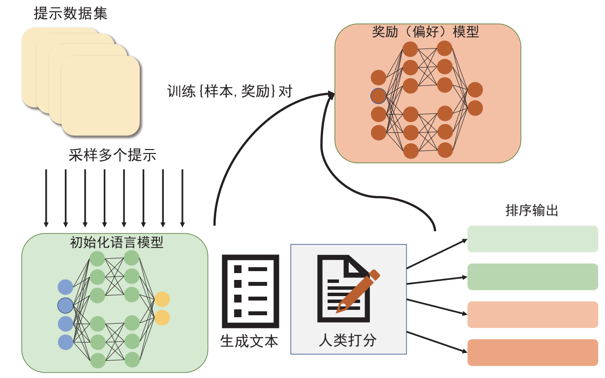

## 目录

- [1.为什么多模态模型需要大规模预训练？](#1.为什么多模态模型需要大规模预训练？)
- [2.简述预训练基础模型的四种主要学习机制，并分析它们各自的优缺点](#2.简述预训练基础模型的四种主要学习机制，并分析它们各自的优缺点)
- [3.比较提示学习和微调两种方法，并分析它们在下游任务中的适用场景](#3.比较提示学习和微调两种方法，并分析它们在下游任务中的适用场景)
- [4.解释什么是思维链?](#4.解释什么是思维链?)
- [5.分析RLHF基于人类反馈的强化学习方法的原理，并阐述其优缺点?](#5.分析RLHF基于人类反馈的强化学习方法的原理，并阐述其优缺点?)
- [6.解释上下文学习在多模态大模型中的原理，并举例说明其在数学推理任务中的应用?](#6.解释上下文学习在多模态大模型中的原理，并举例说明其在数学推理任务中的应用?)
- [7.思维树如何通过图结构实现更强大的提示?](#7.思维树如何通过图结构实现更强大的提示?)
- [8.为什么LoRA不会增加额外的推理延迟？](#8.为什么LoRA不会增加额外的推理延迟？)
- [9.多模态大模型常用微调方法LoRA和Ptuning的原理，与传统fine-tuning微调有何不同?](#9.多模态大模型常用微调方法LoRA和Ptuning的原理，与传统fine-tuning微调有何不同?)
- [10.多模态训练中，LoRA的矩阵怎么初始化？为什么要初始化为全0？](#10.多模态训练中，LoRA的矩阵怎么初始化？为什么要初始化为全0？)
- [11.详细说明多模态大模型中LoRA的推理过程？](#11.详细说明多模态大模型中LoRA的推理过程？)
- [12.LoRA微调方法为什么能加速训练？](#12.LoRA微调方法为什么能加速训练？)
- [13.LoRA应该作用于Transformer的哪个参数矩阵？](#13.LoRA应该作用于Transformer的哪个参数矩阵？)
- [14.LoRA中的Rank和Alpha参数如何选取？](#14.LoRA中的Rank和Alpha参数如何选取？)
- [15.多模态特征融合有哪些常用方法](#15.多模态特征融合有哪些常用方法)
- [16.多模态预训练模型中的掩码策略有哪些创新设计](#16.多模态预训练模型中的掩码策略有哪些创新设计)
- [17.详细分析多模态预训练模型中的视觉编码器选择对模型性能的影响](#17.详细分析多模态预训练模型中的视觉编码器选择对模型性能的影响)
- [18.请解释多模态预训练模型中的位置编码设计，特别是在处理图像和文本这两种不同性质数据时的考虑因素](#18.请解释多模态预训练模型中的位置编码设计，特别是在处理图像和文本这两种不同性质数据时的考虑因素)
- [19.多模态预训练模型的下游任务适配(Adaptation)有哪些技术难点](#19.多模态预训练模型的下游任务适配(Adaptation)有哪些技术难点)
- [20.请详细讨论多模态预训练模型中的数据增强策略，包括单模态和跨模态的增强方法及其效果](#20.请详细讨论多模态预训练模型中的数据增强策略，包括单模态和跨模态的增强方法及其效果)
- [21.在多模态预训练中，如何平衡不同预训练任务的优化目标？请分析几种多任务学习策略的优劣势](#21.在多模态预训练中，如何平衡不同预训练任务的优化目标？请分析几种多任务学习策略的优劣势)
- [22.请详细分析多模态预训练模型的推理优化方法，包括模型压缩、量化和加速等技术](#22.请详细分析多模态预训练模型的推理优化方法，包括模型压缩、量化和加速等技术)

<h2 id="1.为什么多模态模型需要大规模预训练？">1.为什么多模态模型需要大规模预训练？</h2>

多模态模型需要大规模预训练的原因包括：

(1)数据丰富性：大规模预训练可以暴露模型于丰富的数据，提升其泛化能力。

(2)特征提取：通过预训练，模型能够学习到有效的特征表示，提升后续任务的表现。

(3)知识积累：预训练过程使模型积累了大量的先验知识，有助于更好地理解和处理复杂任务。

<h2 id="2.简述预训练基础模型的四种主要学习机制，并分析它们各自的优缺点">2.简述预训练基础模型的四种主要学习机制，并分析它们各自的优缺点</h2>

预训练基础模型的四种主要学习机制包括：

有监督学习：使用标注数据进行训练，模型需要学习输入和输出之间的映射关系。

半监督学习：使用少量标注数据和大量未标注数据进行训练，模型需要学习输入和输出之间的潜在关系。

弱监督学习：使用少量标注数据和大量未标注数据进行训练，但标注数据仅提供部分信息，例如图像中的某些区域或文本中的某些单词。

自监督学习：使用未标注数据进行训练，模型需要学习数据中的内在结构，例如图像中的纹理或文本中的语法规则。

<h2 id="3.比较提示学习和微调两种方法，并分析它们在下游任务中的适用场景">3.比较提示学习和微调两种方法，并分析它们在下游任务中的适用场景</h2>

提示学习通过设计特定的输入提示来引导模型生成所需的输出，它适用于模型已经具备一定泛化能力且需要生成特定类型输出的任务。

提示方法试图通过学习一个语言模型来模拟文本 x自身的概率 P(x; θ)，并使用这个概率预测 y，从而减少对大量标记数据集的需求。提示方法最基本的数学描述包含许多关于提示的研究，并且可以扩展到其他方法。

微调则是通过在下游任务的数据集上调整模型的参数来优化模型在特定任务上的性能，适用于模型在特定任务上需要显著提升性能的情况。

（ 1) 适配器微调：这种方法使用神经适配器或模块化组件，以增强LLM 在特定领域任务上的性能，而不对 LLM 的内部参数进行大幅修改。这些适配器通常集成到现有的 LLM 结构中，允许进行特定任务的学习，同时保持原始模型基本完整。
（ 2) 任务导向微调：这种方法侧重于修改 LLM 的内部参数，以与特定任务对齐。然而，由于硬件限制和潜在的性能下降，完全更新 LLM 的所有参数是不现实的。因此，研究人员面临的挑战在于在广泛的参数空间内确定哪些参数需要被修改，或者如何高效地更新这些参数的子集。

<h2 id="4.解释什么是思维链?">4.解释什么是思维链?</h2>

传统大模型基于“预训练 + 微调”的模式始终没办法很好地完成多步骤推理任务。而 2022年 Jason Wei 提出的思维链提示（Chain-of-Thought Prompting， CoT Prompting）可以显著提高 LLM 的性能，思维链提示使 LLM 能够处理复杂的算术、常识和符号推理任务。

思维链探索了语言模型在推理任务上进行少量示范提示的能力，给定了一个由三元组组成的提示： h 输入，思维链，输出i。思维链是一系列中间的自然语言推理步骤。思维链关注 LLM 如何通过少量任务相关的自然语言数据示例进行学习。

<h2 id="5.分析RLHF基于人类反馈的强化学习方法的原理，并阐述其优缺点?">5.分析RLHF基于人类反馈的强化学习方法的原理，并阐述其优缺点?</h2>

OpenAI 推出的 ChatGPT 掀起了新的 AI 热潮,这一工作的背后是 LLM 生成领域的新训练范式 RLHF，即以强化学习方式依据人类反馈优化语言模型。RLHF 把训练过程分解为三个核心步骤。（1）预训练一个语言模型。（2）收集数据并训练奖励模型。（3）用强化学习的方式微调语言模型。

奖励函数的目的是将所有模型集成到一个 RLHF 流程中。给定数据集中的提示 x 和基于当前微调策略生成的文本 y，将该文本与原始提示连接，将其传递给偏好模型，该模型返回一个“可取性”的标量 rθ。此外，将来自强化学习策略的每个标记的概率分布与初始模型的概率分布进行比较，以计算它们之间差异的惩罚。

缺点：RLHF通过人类反馈来优化语言模型的输出，但需要大量高质量的人类标注数据。

<h2 id="6.解释上下文学习在多模态大模型中的原理，并举例说明其在数学推理任务中的应用?">6.解释上下文学习在多模态大模型中的原理，并举例说明其在数学推理任务中的应用?</h2>

上下文学习 是指模型能够根据输入的上下文信息来调整其输出的能力。在多模态大模型中，上下文学习原理如下：
●多模态融合：模型能够同时处理文本、图像等多种模态的信息，并将这些信息融合在一起以形成更丰富的上下文表示。
●动态调整：根据输入的上下文信息，模型能够动态地调整其内部参数和输出策略，以适应不同的任务和场景。
数学推理任务中的应用：在数学推理任务中，上下文学习可以帮助模型理解问题的背景和已知条件，从而更准确地推导出答案。例如，当模型遇到一个涉及几何图形的问题时，它可以利用图像模态的信息来辅助理解问题，并结合文本模态的信息进行推理和解答。

<h2 id="7.思维树如何通过图结构实现更强大的提示?">7.思维树如何通过图结构实现更强大的提示?</h2>

思维树 是一种通过图结构来组织信息的提示方法，其实现方式如下：
●节点表示：思维树的每个节点代表一个概念、事实或想法，节点之间通过边相连以表示它们之间的关系。
●层次化结构：思维树采用层次化的结构来组织信息，使得用户可以从宏观到微观逐步深入地思考问题。
●动态更新：用户可以根据需要动态地添加、删除或修改思维树中的节点和边，以适应不同的思考过程和需求。
通过这种图结构，思维树能够提供更丰富、更灵活的提示信息，帮助用户更好地理解和解决问题。

<h2 id="8.为什么LoRA不会增加额外的推理延迟？">8.为什么LoRA不会增加额外的推理延迟？</h2>

1、参数高效性: LoRA 不直接修改原始模型的参数，而是添加少量可训练的低秩矩阵 (通常只有几千个参数) 到目标模块中。这些新增的参数被称为 “LoRA 矩阵”。由于参数数量非常少，因此不会对模型的计算量造成显著影响。
2、推理时仅使用新增参数: 在推理过程中，LoRA 矩阵会与原始模型参数进行融合，然后进行计算。这意味着模型在推理时只需要使用原始模型参数和 LoRA 矩阵，而不需要加载和计算所有原始模型参数，从而提高了推理效率。
3、并行计算: LoRA 矩阵可以被并行地加载和计算，进一步提高了推理速度。
4、目标模块的选择: LoRA 通常只针对模型中的一些关键模块进行微调，例如注意力机制中的 query、key、value 投影矩阵。这些模块是模型中最为重要的部分，微调它们可以显著提高模型性能，而不会影响其他模块的性能。

<h2 id="9.多模态大模型常用微调方法LoRA和Ptuning的原理，与传统fine-tuning微调有何不同?">9.多模态大模型常用微调方法LoRA和Ptuning的原理，与传统fine-tuning微调有何不同?</h2>

在大模型微调领域，LoRA（Low-Rank Adaptation）和Ptuning（Prompt Tuning）是两种新兴的方法，它们旨在通过减少参数更新的数量来提高微调的效率和效果。这些方法与传统fine-tuning微调在原理和实现上有着显著的不同。

**LoRA微调原理**

LoRA通过低秩分解技术，仅更新模型参数的一个低秩近似，从而减少微调所需的计算资源和存储需求。具体来说，LoRA在预训练模型的某些层添加可训练的适配器，这些适配器是具有可学习参数的小型神经网络。在微调阶段，LoRA保持预训练模型的主要参数不变，只优化这些适配器的参数。

**Ptuning微调原理**

Ptuning，即Prompt Tuning，是一种通过修改输入提示（prompt）来微调大型预训练语言模型的方法。它不直接修改模型本身的参数，而是通过优化输入提示的嵌入向量，使模型能够生成与任务相关的输出。这种方法的优势在于其灵活性，可以快速适应不同的任务，而无需对模型架构进行任何修改。

**传统fine-tuning微调原理**

传统fine-tuning微调方法涉及全面调整模型的所有参数，以使其适应特定的下游任务。这种方法虽然能够充分利用预训练模型的通用特征，但通常需要大量的计算资源和时间，尤其是在处理大规模模型时。

**LoRA和Ptuning与传统fine-tuning的区别**

- **参数更新数量**：LoRA和Ptuning都旨在减少参数更新的数量。LoRA通过低秩分解技术更新少量参数，而Ptuning仅优化输入提示的嵌入向量。相比之下，传统fine-tuning需要更新模型中的大部分或全部参数。

- **计算资源和存储需求**：由于LoRA和Ptuning仅更新少量参数，它们通常需要更少的计算资源和存储空间。传统fine-tuning则需要更多的计算资源，尤其是在处理大规模模型时。

- **模型性能**：LoRA和Ptuning旨在在不牺牲模型性能的前提下，减少微调的计算负担。传统fine-tuning可能会导致模型过拟合，尤其是在训练数据有限的情况下。

LoRA和Ptuning通过其独特的微调策略，为大型模型的微调提供了新的解决方案，特别是在计算资源和时间有限的情况下。然而，选择哪种微调方法应根据具体任务需求、资源限制和期望的灵活性来决定。

<h2 id="10.多模态训练中，LoRA的矩阵怎么初始化？为什么要初始化为全0？">10.多模态训练中，LoRA的矩阵怎么初始化？为什么要初始化为全0？</h2>

在多模态训练中，LoRA（Low-Rank Adaptation）的矩阵初始化是一个关键步骤，它直接影响到微调的效果和收敛速度。以下是对LoRA矩阵初始化方法的详细解释，以及为什么选择初始化为全0的原因。

**LoRA矩阵初始化方法**
  
矩阵B被初始化为0，而矩阵A正常高斯初始化。 

如果B，A全都初始化为0，那么缺点与深度网络全0初始化一样，很容易导致梯度消失(因为此时初始所有神经元的功能都是等价的)。 

如果B，A全部高斯初始化，那么在网络训练刚开始就会有概率为得到一个过大的偏移值Δ W 从而引入太多噪声，导致难以收敛。 

因此，一部分初始为0，一部分正常初始化是为了在训练开始时维持网络的原有输出(初始偏移为0)，但同时也保证在真正开始学习后能够更好的收敛。

<h2 id="11.详细说明多模态大模型中LoRA的推理过程？">11.详细说明多模态大模型中LoRA的推理过程？</h2>

LoRA（Low-Rank Adaptation）是一种用于大型多模态模型的微调技术，它通过低秩分解来减少需要更新的参数数量，从而在保持模型性能的同时降低计算成本和存储需求。以下是LoRA在多模态大模型中的推理过程：

**LoRA的推理过程**

1. **冻结预训练模型参数**：
   - 在微调过程中，LoRA首先冻结预训练模型的所有参数，这些参数在微调过程中保持不变。这样做可以确保模型的基本结构和特征不受影响，同时减少需要更新的参数数量。

2. **引入低秩分解矩阵**：
   - 在Transformer架构的每一层中，LoRA注入两个可训练的低秩分解矩阵A和B。矩阵A使用随机高斯分布进行初始化，维度为r×k，负责将输入数据维度降至r维；矩阵B使用0进行初始化，维度为d×r，负责将数据维度升至d维。

3. **低秩矩阵的初始化和更新**：
   - 在微调过程中，仅训练低秩分解矩阵A和B。具体来说，待更新的参数矩阵ΔW表示为低秩分解BABA的形式，其中BB和AA是随机初始化并在微调过程中更新的。

4. **合并训练参数**：
   - 最后，将LoRA训练得到的参数与原始模型参数合并，并保存到新的模型中。这样，模型在保持原有性能的同时，获得了针对特定任务的微调效果。

**LoRA的优势**

- **减少计算资源和存储需求**：通过仅更新低秩矩阵，LoRA显著减少了微调所需的计算资源和存储空间。
- **保持模型性能**：LoRA通过低秩分解技术，能够在保持模型原始性能的基础上，实现有效的微调。
- **推理效率高**：LoRA在推理阶段不引入额外的计算量，保持了高效的推理性能。

LoRA通过其独特的低秩分解技术，为多模态大模型的微调提供了一种高效且有效的方法。它不仅减少了计算资源和存储需求，还能在保持模型性能的同时，实现快速的微调和推理。

<h2 id="12.LoRA微调方法为什么能加速训练？">12.LoRA微调方法为什么能加速训练？</h2>

1）只更新了部分参数：比如LoRA原论文就选择只更新Self Attention的参数，实际使用时我们还可以选择只更新部分层的参数；

2）减少了通信时间：由于更新的参数量变少了，所以（尤其是多卡训练时）要传输的数据量也变少了，从而减少了传输时间； 

3）采用了各种低精度加速技术，如FP16、FP8或者INT8量化等。

这三部分原因确实能加快训练速度，然而它们并不是LoRA所独有的，事实上几乎都有参数高效方法都具有这些特点。LoRA的优点是它的低秩分解很直观，在不少场景下跟全量微调的效果一致，以及在预测阶段不增加推理成本。

<h2 id="13.LoRA应该作用于Transformer的哪个参数矩阵？">13.LoRA应该作用于Transformer的哪个参数矩阵？</h2>

从上图我们可以看到： 

1）将所有微调参数都放到attention的某一个参数矩阵的效果并不好，将可微调参数平均分配到 Wq 和 Wk 的效果最好；

2）即使是秩仅取4也能在 ∆W 中获得足够的信息。

因此在实际操作中，应当将可微调参数分配到多种类型权重矩阵中，而不应该用更大的秩单独微调某种类型的权重矩阵。

<h2 id="14.LoRA中的Rank和Alpha参数如何选取？">14.LoRA中的Rank和Alpha参数如何选取？</h2>

Rank的取值比较常见的是8，理论上说Rank在4-8之间效果最好，再高并没有效果提升。不过论文的实验是面向下游单一监督任务的，因此在指令微调上根据指令分布的广度，Rank选择还是需要在8以上的取值进行测试。

alpha其实是个缩放参数，本质和learning rate相同，所以为了简化可以默认让alpha=rank，只调整lr，这样可以简化超参。

<h2 id="15.多模态特征融合有哪些常用方法">15.多模态特征融合有哪些常用方法</h2>

直接拼接不同模态的特征存在严重的局限性，这主要是因为不同模态数据具有不同的统计特性、特征维度和尺度。简单的特征拼接不仅忽视了模态间的复杂交互关系，还可能导致某个模态的特征主导最终的表示，使得模型无法充分利用多模态信息的互补性。此外，直接拼接也无法处理模态缺失或噪声等实际应用中常见的问题。

在实践中，研究者提出了多种高效的特征融合方法。注意力机制通过学习动态权重来选择性地关注不同模态的重要特征，虽然计算开销较大，但具有较强的可解释性和适应性。门控机制通过控制信息流动来处理模态间的交互，特别适合处理模态缺失的情况，但可能会损失一些细节信息。双线性池化则能够捕捉高阶的特征交互，但参数量大且优化困难。图神经网络通过构建模态间的关系图来实现特征融合，虽然灵活性强，但图的构建往往需要专门的领域知识。

选择合适的融合方法需要综合考虑多个因素，包括任务的特定需求、计算资源的可用性、数据的质量和规模，以及模态间的相关性程度等。在实际应用中，往往需要根据具体场景选择合适的融合方法，或将多种方法结合使用，以达到最佳的效果。此外，随着研究的深入，一些新的融合方法也在不断涌现，如基于神经架构搜索的自动化融合方法，以及考虑时序信息的动态融合策略等。

<h2 id="16.多模态预训练模型中的掩码策略有哪些创新设计">16.多模态预训练模型中的掩码策略有哪些创新设计</h2>

多模态预训练模型中的掩码策略是提升模型性能的关键技术之一。跨模态掩码通过同步掩盖对应的图像区域和文本token，强制模型学习模态间的细粒度对应关系。这种策略不仅要考虑掩码的位置和比例，还需要保持模态间的语义一致性。实践表明，合理的跨模态掩码可以显著提升模型对细节的理解能力和跨模态推理能力。

结构化掩码策略进一步考虑了视觉对象的空间关系和语义完整性。通过目标检测或语义分割的先验知识，模型可以更好地理解场景中的对象关系和层次结构。这种策略特别适合需要细粒度视觉理解的任务，如视觉问答和图像描述生成。同时，结构化掩码也帮助模型建立更稳定的视觉-语言对应关系。

自适应掩码则是一种动态调整策略，根据特征的重要性和学习难度来决定掩码的位置和比例。这种方法通过在线评估模型的学习状态，自动调整掩码的难度，使得模型能够逐步掌握从简单到复杂的跨模态关系。在实际应用中，这些掩码策略的创新极大地提升了模型在各类下游任务中的表现，尤其是在需要精确的跨模态对齐的任务中，如细粒度的图文检索和视觉问答。

<h2 id="17.详细分析多模态预训练模型中的视觉编码器选择对模型性能的影响">17.详细分析多模态预训练模型中的视觉编码器选择对模型性能的影响</h2>
视觉编码器的选择直接影响多模态预训练模型的性能和效率。传统的CNN架构凭借其强大的局部特征提取能力和计算效率，在许多视觉任务中表现出色。CNN的层次化特征表示特别适合处理需要细节感知的任务，如目标检测和图像分割。然而，CNN在处理长程依赖关系和全局上下文时存在天然的局限性。

Vision Transformer (ViT)的出现为视觉特征提取提供了新的范式。通过全局自注意力机制，ViT能够更好地捕捉图像中的长程依赖关系，并且其架构与文本处理的Transformer保持一致，有利于跨模态对齐。但ViT也面临着计算复杂度高、对数据量要求大的问题。为了平衡效率和性能，Swin Transformer等改进模型通过引入局部窗口注意力和层次化结构，在保持强大建模能力的同时提升了计算效率。

在实际应用中，视觉编码器的选择需要综合考虑任务需求、计算资源和数据规模等因素。对于需要实时处理的应用，轻量级CNN可能是更好的选择；而对于需要深度理解和推理的任务，基于Transformer的模型可能更有优势。此外，混合架构的设计也越来越受到关注，它们试图结合CNN的局部处理能力和Transformer的全局建模能力，为不同应用场景提供更优的解决方案。

<h2 id="18.请解释多模态预训练模型中的位置编码设计，特别是在处理图像和文本这两种不同性质数据时的考虑因素">18.请解释多模态预训练模型中的位置编码设计，特别是在处理图像和文本这两种不同性质数据时的考虑因素</h2>
位置编码在多模态预训练模型中扮演着关键角色，它需要同时处理文本的一维序列特性和图像的二维空间特性。对于文本模态，传统的位置编码主要关注词序信息，可以采用正弦位置编码或可学习的嵌入向量。而图像模态则需要考虑空间位置关系，不仅要编码像素或图像块的绝对位置，还要保持空间拓扑结构。

在实际设计中，研究者提出了多种创新方案来处理这种模态差异。一种常见的方法是为不同模态设计专门的位置编码方案，然后通过特征投影或注意力机制来实现跨模态对齐。例如，对于图像可以使用二维位置编码，而文本保持一维位置编码，通过多头注意力机制来学习它们之间的对应关系。

最新的研究还探索了相对位置编码和混合位置编码策略。相对位置编码能够更好地捕捉局部结构信息，特别适合处理变长序列和大尺寸图像。而混合策略则试图结合绝对位置和相对位置的优势，在保持全局位置感知的同时提升局部特征的学习能力。这些位置编码的设计直接影响着模型对空间关系的理解和跨模态对齐的质量。

<h2 id="19.多模态预训练模型的下游任务适配(Adaptation)有哪些技术难点">19.多模态预训练模型的下游任务适配(Adaptation)有哪些技术难点</h2>
多模态预训练模型向下游任务迁移时面临着多重挑战。首要问题是预训练目标与下游任务目标之间的差异，预训练阶段通常关注通用的跨模态表示学习，而下游任务可能需要更专门的特征表示。此外，不同下游任务对模态依赖程度不同，有些任务可能更依赖视觉信息，而有些则更依赖文本信息，这种不平衡给模型适配带来了额外的难度。

近年来，Prompt Tuning成为了一种流行的适配方法。通过设计任务相关的提示，将下游任务转化为与预训练任务相似的形式，从而减少任务形式的差异。这种方法不仅能够充分利用预训练模型的知识，还能显著减少微调所需的参数量。另一个重要方向是参数高效微调（Parameter-Efficient Fine-tuning），如LoRA和Adapter等方法，它们通过只更新少量关键参数来实现高效的任务适配。

特征对齐是另一个关键的技术方向。通过设计特定的对齐层或损失函数，将预训练特征空间映射到任务特征空间。这种方法特别适合处理领域迁移问题，能够有效缓解预训练数据与下游任务数据分布不一致的问题。实践中，这些适配方法往往需要根据具体任务特点和资源约束进行组合和调整，以达到最佳的效果。

<h2 id="20.请详细讨论多模态预训练模型中的数据增强策略，包括单模态和跨模态的增强方法及其效果">20.请详细讨论多模态预训练模型中的数据增强策略，包括单模态和跨模态的增强方法及其效果</h2>
数据增强在多模态预训练中扮演着重要角色，它不仅能够增加训练数据的多样性，还能提升模型的鲁棒性。对于视觉模态，传统的增强方法包括随机裁剪、颜色抖动、旋转等几何变换，这些方法能够帮助模型学习对视觉变化的不变性。而文本模态的增强则常用同义词替换、回译等方法，通过保持语义不变的情况下改变表达方式。

跨模态数据增强是一个更具挑战性的问题。一种常见的方法是基于知识的语义增强，通过利用外部知识库或预训练模型来生成语义相关的图文对。例如，可以使用图像生成模型基于文本描述生成新的图像，或使用文本生成模型基于图像内容生成新的描述。这种方法不仅能够扩充训练数据，还能帮助模型建立更丰富的跨模态语义联系。

最新的研究还探索了自动化的数据增强策略，如使用强化学习或神经架构搜索来自动发现有效的增强策略组合。这些方法能够根据具体任务和数据特点动态调整增强策略，避免人工设计的局限性。此外，对比学习框架的引入也为数据增强提供了新的视角，通过构造不同视角的正负样本对来提升特征学习的效果。在实践中，这些增强策略的选择需要权衡数据质量和计算开销，并考虑下游任务的特定需求。

<h2 id="21.在多模态预训练中，如何平衡不同预训练任务的优化目标？请分析几种多任务学习策略的优劣势">21.在多模态预训练中，如何平衡不同预训练任务的优化目标？请分析几种多任务学习策略的优劣势</h2>
多模态预训练中的多任务学习是一个复杂的优化问题，需要同时考虑多个预训练目标的平衡。最基础的方法是通过固定的权重组合不同任务的损失函数，但这种静态加权方法难以适应训练过程中各任务学习难度的动态变化。一些研究表明，不同预训练任务的学习速度和收敛特性可能存在显著差异，简单的固定权重可能导致某些任务的训练不充分或过度优化。

动态任务权重调整是一个更有前景的方向。通过监控各个任务的学习进度和梯度统计特征，可以自适应地调整任务权重。例如，基于梯度的不确定性来估计任务的学习难度，或使用多目标优化理论来寻找任务间的帕累托最优解。这种方法能够更好地平衡任务间的学习过程，但也带来了额外的计算开销和超参数调整难度。

课程学习策略提供了另一个有效的解决方案。通过设计合理的任务课程，从简单到复杂逐步增加训练任务的难度和复杂性。这种方法不仅能够提供更稳定的训练过程，还能帮助模型建立更好的特征层次结构。在实践中，研究者还发现引入辅助任务能够显著提升主要预训练目标的学习效果，但辅助任务的设计需要仔细考虑与主任务的相关性和计算开销。

<h2 id="22.请详细分析多模态预训练模型的推理优化方法，包括模型压缩、量化和加速等技术">22.请详细分析多模态预训练模型的推理优化方法，包括模型压缩、量化和加速等技术</h2>
多模态预训练模型的推理优化是实际部署中的关键挑战，需要在保持模型性能的同时提升推理效率。模型压缩是最基础的优化方向，包括知识蒸馏和模型剪枝等技术。知识蒸馏通过将大模型的知识转移到小模型中，既能保持较好的性能，又能显著减少模型大小。而模型剪枝则通过识别和移除冗余参数，实现模型的稀疏化，但需要仔细平衡压缩率和性能损失。

量化技术是另一个重要的优化手段。通过将模型参数从浮点数转换为低位整数表示，可以显著减少模型大小和计算开销。动态量化和静态量化各有优势，前者能够保持更好的精度但推理开销较大，后者则能提供更快的推理速度但可能带来更多的精度损失。混合精度量化是一个折中方案，通过对不同层使用不同的量化策略来平衡性能和效率。

推理加速还需要考虑计算架构的优化。注意力机制的优化是一个重要方向，如通过稀疏注意力或线性注意力来减少计算复杂度。此外，模型并行和流水线并行等分布式计算策略也能显著提升推理效率。在实际部署中，还需要考虑硬件特性和推理框架的选择，通过算子融合、内存优化等技术手段进一步提升性能。最新的研究还探索了神经架构搜索和自动化优化方法，试图找到更优的模型结构和推理策略。
