# 目录

- [1.目前主流的AI绘画大模型有哪些？](#1.目前主流的AI绘画大模型有哪些？)
- [2.SD模型训练时需要设置timesteps=1000，在推理时却只用几十步就可以生成图片？](#2.SD模型训练时需要设置timesteps=1000，在推理时却只用几十步就可以生成图片？)
- [3.SD模型中的CFGClassifier-Free-Guidance的原理？](#3.SD模型中的CFG(Classifier-Free-Guidance)的原理？)
- [4.SD模型中的（negative-prompt）反向提示词如何加入的？](#4.SD模型中的(negative-prompt)反向提示词如何加入的？)
- [5.SD中潜在一致性模型LCM、LCM-lora加速原理](#5.SD中潜在一致性模型LCM、LCM-lora加速原理)
- [6.Ip-adapter的模型结构与原理](#6.Ip-adapter原理)
- [7.Controlnet的模型结构与原理](#7.Controlnet原理)
- [8.人物一致性模型PhotoMaker原理](#8.人物一致性模型PhotoMaker原理)
- [9.人物一致性模型InstantID原理](#9.人物一致性模型InstantID原理)
- [10.单ID图像为什么InstantID人物一致性比Photomaker效果好](#10.单ID图像为什么InstantID人物一致性比Photomaker效果好)
- [11.大模型常见模型文件格式简介](#11.大模型常见模型文件格式简介)
- [12.safetensors模型文件的使用](#12.safetensors模型文件的使用)
- [13.GGUF模型文件的组成](#13.GGUF模型文件的组成)
- [14.diffusion和diffusers模型的相互转换](#14.diffusion和diffusers模型的相互转换)
<h2 id="1.目前主流的AI绘画大模型有哪些？">1.目前主流的AI绘画大模型有哪些？</h2>

目前，几个主流的文生图大模型包括：

1. Midjourney系列（V5-V6）
2. Stable Diffusion系列（1.x、2.x、XL、3）
3. DaLL·E系列（2-3）
4. PixArt系列（α、Σ）
5. Ideogram 1.0
6. Playground v2.5
7. Imagen系列（1、2）

<h2 id="2.SD模型训练时需要设置timesteps=1000，在推理时却只用几十步就可以生成图片？">2.SD模型训练时需要设置timesteps=1000，在推理时却只用几十步就可以生成图片？</h2>

目前扩散模型训练一般使用DDPM（Denoising Diffusion Probabilistic Models）采样方法，但推理时可以使用DDIM（Denoising Diffusion Implicit Models）采样方法，DDIM通过去马尔可夫化，大大减少了扩散模型在推理时的步数。

<h2 id="3.SD模型中的CFG(Classifier-Free-Guidance)的原理？">3.SD模型中的CFG(Classifier-Free-Guidance)的原理？ </h2>

### Classifier Guidance：
条件生成只需额外添加一个classifier的梯度来引导。Classifier Guidance 需要训练噪声数据版本的classifier网络，推理时每一步都需要额外计算classifier的梯度。
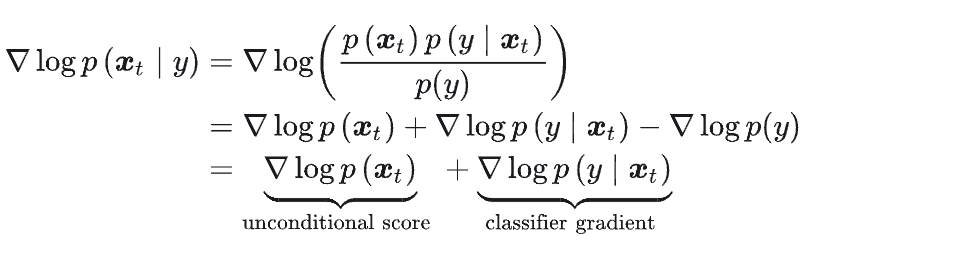
Classifier Guidance 使用显式的分类器引导条件生成有几个问题：①是需要额外训练一个噪声版本的图像分类器。②是该分类器的质量会影响按类别生成的效果。③是通过梯度更新图像会导致对抗攻击效应，生成图像可能会通过人眼不可察觉的细节欺骗分类器，实际上并没有按条件生成。

### Classifier-Free Guidance:
核心是通过一个隐式分类器来替代显示分类器，而无需直接计算显式分类器及其梯度。根据贝叶斯公式，分类器的梯度可以用条件生成概率和无条件生成概率表示.
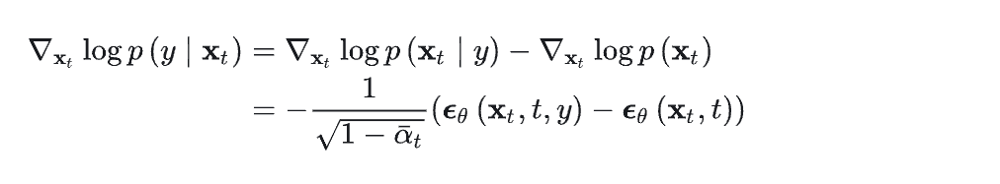
把上面的分类器梯度代入到classifier guidance的分类器梯度中可得：
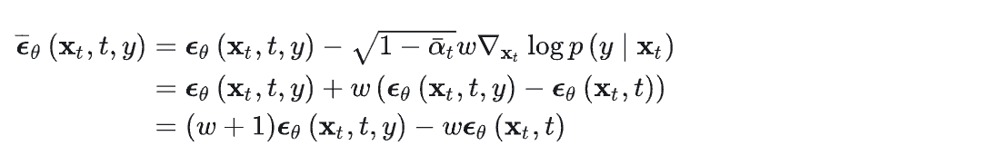
训练时，Classifier-Free Guidance需要训练两个模型，一个是无条件生成模型，另一个是条件生成模型。但这两个模型可以用同一个模型表示，训练时只需要以一定概率将条件置空即可。推理时，最终结果可以由条件生成和无条件生成的线性外推获得，生成效果可以引导系数可以调节，控制生成样本的逼真性和多样性的平衡。

<h2 id="4.SD模型中的(negative-prompt)反向提示词如何加入的？">4.SD模型中的(negative-prompt)反向提示词如何加入的？ </h2>

### 假想方案
容易想到的一个方案是 unet 输出 3 个噪声，分别对应无prompt，positive prompt 和 negative prompt 三种情况，那么最终的噪声就是

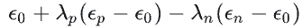

理由也很直接，因为 negative prompt 要反方向起作用，所以加个负的系数.

### 真正实现方法

 stable diffusion webui 文档中看到了 negative prompt 真正的[实现方法](https://github.com/AUTOMATIC1111/stable-diffusion-webui/wiki/Negative-prompt)。一句话概况：将无 prompt 的情形替换为 negative prompt，公式则是

 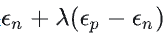

就是这么简单，其实也很说得通，虽说设计上预期是无 prompt 的，但是没有人拦着你加上 prompt（反向的），公式上可以看出在正向强化positive prompt的同时也反方向强化——也就是弱化了 negative prompt。同时这个方法相对于我想的那个方法还有一个优势就是只需预测 2 个而不是 3 个噪声。

<h2 id="5.SD中潜在一致性模型LCM、LCM-lora加速原理">5.SD中潜在一致性模型LCM、LCM-lora加速原理 </h2>

### CM模型：
OpenAI 的宋飏博士提出的一致性模型（Consistency Model，CM）为解决多步采样问题提供了一个思路。一致性模型并不依赖于预训练的扩散模型，是一种独立的新型生成模型。一致性函数f的核心为这样一个性质：对于任意一个输入xt，经过f输出后，其输出是一致的。

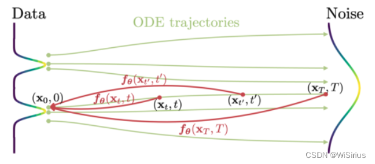

缺点：一致性模型局限于无条件图片生成，导致包括文生图、图生图等在内的许多实际应用还难以享受这一模型的潜在优势。

### LCM模型
关键技术点：

（1）使用预训练的自动编码器将原始图片编码到潜在空间，在压缩图片中冗余信息的同时让图片在语义上具有更好的一致性；

（2）将无分类器引导（CFG）作为模型的一个输入参数蒸馏进潜在一致性模型中，在享受无分类器引导带来的更好的图片 - 文本的一致性的同时，由于无分类器引导幅度被作为输入参数蒸馏进了潜在一致性模型，从而能够减少推理时的所需要的计算开销；

（3）使用跳步策略来计算一致性损失，大大加快了潜在一致性模型的蒸馏过程。
潜在一致性模型的蒸馏算法的伪代码见下图。


<h2 id="6.Ip-adapter模型结构与原理">6.Ip-adapter模型结构与原理 </h2>
IP-Adapter 采用了一种解耦的交叉注意力机制，将文本特征和图像特征分开处理，从而使得生成的图像能够更好地继承和保留输入图像的特征。

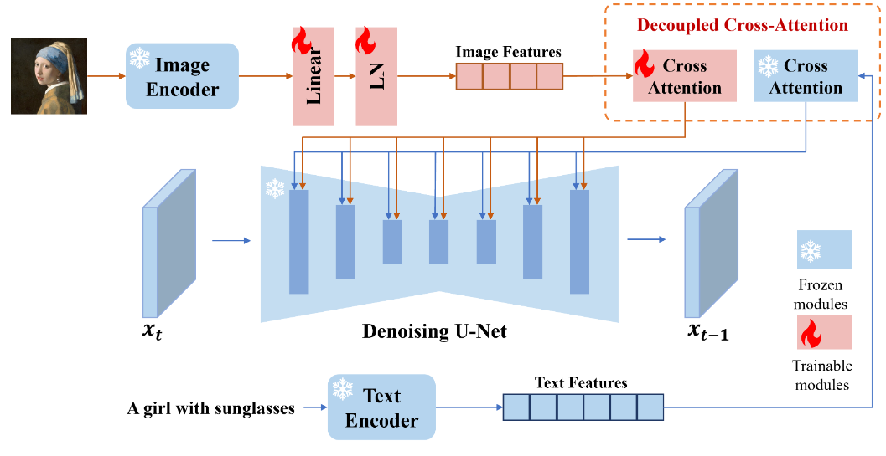
图像编码：IP-Adapter 使用预训练的 CLIP（Contrastive Language-Image Pre-training）图像编码器来提取图像提示的特征。

解耦交叉注意力机制：IP-Adapter 通过这种机制，将文本特征的 Cross-Attention 和图像特征的 Cross-Attention 分区开来。在Unet 的模块中新增了一路 Cross-Attention 模块，用于引入图像特征。

适配模块：IP-Adapter 包含一个图像编码器和包含解耦交叉注意力机制的适配器。这个适配器允许模型在生成图像时，同时考虑文本提示和图像提示，生成与文本描述相匹配的图像。

<h2 id="7.Controlnet的模型结构与原理">7.Controlnet的模型结构与原理 </h2>

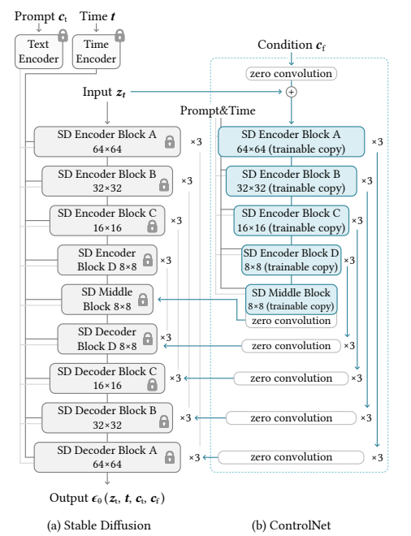

权重克隆：ControlNet 将大型扩散模型的权重克隆为两个副本，一个“可训练副本”和一个“锁定副本”。锁定副本保留了从大量图像中学习到的网络能力，而可训练副本则在特定任务的数据集上进行训练，以学习条件控制。

零卷积：ControlNet 引入了一种特殊类型的卷积层，称为“零卷积”。这是一个 1x1 的卷积层，其权值和偏差都初始化为零。零卷积层的权值会从零逐渐增长到优化参数，这样设计允许模型在训练过程中逐渐调整和学习条件控制，而不会对深度特征添加新的噪声。

特征融合：ControlNet 通过零卷积层将额外的条件信息融合到神经网络的深层特征中。这些条件可以是姿势、线条结构、颜色分布等，它们作为输入调节图像，引导图像生成过程。

灵活性和扩展性：ControlNet 允许用户根据需求选择不同的模型和预处理器进行组合使用，以实现更精准的图像控制和风格化。例如，可以结合线稿提取、颜色控制、背景替换等多种功能，创造出丰富的视觉效果。

<h2 id="8.人物一致性模型PhotoMaker原理">8.人物一致性模型PhotoMaker原理 </h2>

编码器（Encoders）：PhotoMaker使用CLIP图像编码器来提取图像嵌入（image embeddings），并通过微调部分Transformer层来优化模型对于屏蔽图像中ID特征的提取能力。

堆叠ID嵌入（Stacked ID Embedding）：通过将多个输入ID图像的编码堆叠起来，构建了一个统一的ID表示。这个表示能够保留每个输入ID图像的原始特征，并在推理阶段接受任意数量的ID图像作为输入，从而保持高生成效率。

融合（Merging）：利用扩散模型中的交叉注意力机制来自适应地合并堆叠的ID嵌入中包含的ID信息，从而在生成过程中实现对ID特征的有效控制。

ID导向的数据构建流程（ID-Oriented Human Data Construction）：为了支持PhotoMaker的训练，研究者设计了一个自动化流程来构建一个以ID为中心的人类数据集。这个数据集包含大量具有不同表情、属性、场景的图像，有助于训练过程中的ID信息学习。

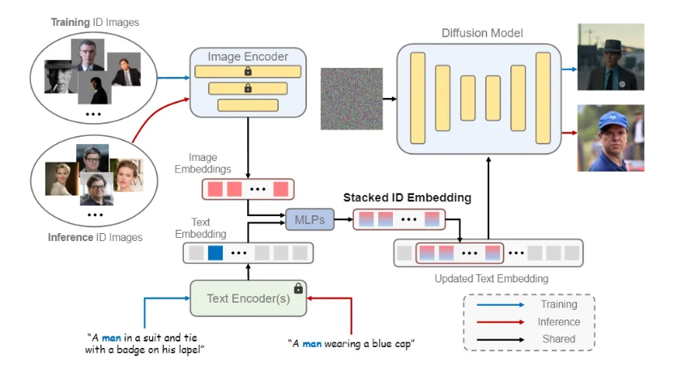

<h2 id="9.人物一致性模型InstantID原理">9.人物一致性模型InstantID原理 </h2>
ID Embedding：InstantID利用预训练的人脸模型（如insightface库中的模型）来提取面部特征的语义信息，这些特征被称为ID Embedding。与使用CLIP模型相比，这种方法能够更精准和丰富地捕获人物面部表情的特征。

Image Adapter：这是一个轻量级的自适应模块，它结合了文本提示信息和图像提示信息。该模块的设计思路与IP-Adapter相似，通过解耦交叉注意力机制来适应不同的生成任务。

IdentityNet：为了在粗粒度上改进图像生成并更精确地控制人物ID图像的生成，InstantID引入了IdentityNet模块。这个模块利用弱空间信息（如面部关键点）和强语义信息（从ID Embedding模块提取的面部表情特征）来引导图像的生成。

ControlNet：InstantID还使用了ControlNet来增强面部特征提取，进一步提高图像生成的质量和准确性。
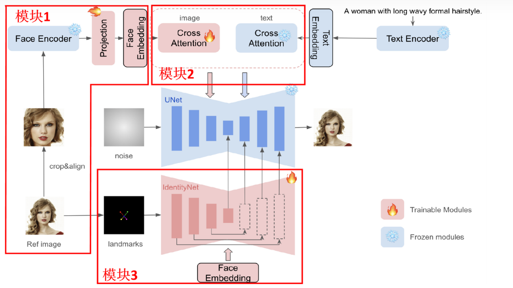
<h2 id="10.单ID图像为什么InstantID人物一致性比Photomaker效果好">10.单ID图像为什么InstantID人物一致性比Photomaker效果好</h2>

1.InstantID利用预训练的人脸模型（如insightface库中的模型）来提取面部特征的语义信息。与Photomaker所使用的CLIP模型相比，这种方法能够更精准和丰富地捕获人物面部表情的特征。

2.InstantID还使用ControlNet来增强面部特征提取，进一步提高图像生成的质量和准确性。

3.Photomaker是先将文本特征和图像特征通过MLPs融合，再做CrossAttention加入U-net.InstantID是图像特征和文本特征分开做CrossAttention,再融合。（可以认为是区别，不要一定是效果好的原因）

<h2 id="11.大模型常见模型文件格式简介">11.大模型常见模型文件格式简介 </h2>

### 1、safetensors模型
1) 这是由 Hugging Face 推出的一种新型安全模型存储格式，特别关注模型安全性、隐私保护和快速加载。
2) 它仅包含模型的权重参数，而不包括执行代码，这样可以减少模型文件大小，提高加载速度。
3) 加载方式：使用 Hugging Face 提供的相关API来加载 .safetensors 文件，例如 safetensors.torch.load_file() 函数。

### 2、ckpt模型
全称checkpoint，通过Dreambooth训练的模型，包含了模型参数，还包括优化器状态以及可能的训练元数据信息，使得用户可以无缝地恢复训练或执行推理
### 3、bin模型
1) 通常是一种通用的二进制格式文件，它可以用来存储任意类型的数据。
2) 在机器学习领域，.bin 文件有时用于存储模型权重或其他二进制数据，但并不特指PyTorch的官方标准格式。
3) 对于PyTorch而言，如果用户自己选择将模型权重以二进制格式保存，可能会使用 .bin 扩展名，加载时需要自定义逻辑读取和应用这些权重到模型结构中。
### 4、pth模型
1) 是 PyTorch 中用于保存模型状态的标准格式。
2) 主要用于保存模型的 state_dict，包含了模型的所有可学习参数，或者整个模型（包括结构和参数）。
3) 加载方式：使用 PyTorch 的 torch.load() 函数直接加载 .pth 文件，并通过调用 model.load_state_dict() 将加载的字典应用于模型实例。
### 5、gguf模型
GGUF文件全称是GPT-Generated Unified Format，是由Georgi Gerganov定义发布的一种大模型文件格式。Georgi Gerganov是著名开源项目[llama.cpp](https://github.com/ggerganov/llama.cpp)的创始人。  
GGUF是一种二进制格式文件的规范，原始的大模型预训练结果经过转换后变成GGUF格式可以更快地被载入使用，也会消耗更低的资源。原因在于GGUF采用了多种技术来保存大模型预训练结果，包括采用紧凑的二进制编码格式、优化的数据结构、内存映射等。  
#### 特性  
1) 二进制格式：GGUF作为一种二进制格式，相较于文本格式的文件，可以更快地被读取和解析。二进制文件通常更紧凑，减少了读取和解析时所需的I/O操作和处理时间。
2) 优化的数据结构：GGUF可能采用了特别优化的数据结构，这些结构为快速访问和加载模型数据提供了支持。例如，数据可能按照内存加载的需要进行组织，以减少加载时的处理。
3) 内存映射（mmap）兼容性：如果GGUF支持内存映射（mmap），这允许直接从磁盘映射数据到内存地址空间，从而加快了数据的加载速度。这样，数据可以在不实际加载整个文件的情况下被访问，特别是对于大型模型非常有效。
4) 高效的序列化和反序列化：GGUF可能使用高效的序列化和反序列化方法，这意味着模型数据可以快速转换为可用的格式。
5) 少量的依赖和外部引用：如果GGUF格式设计为自包含，即所有需要的信息都存储在单个文件中，这将减少解析和加载模型时所需的外部文件查找和读取操作。
6) 数据压缩：GGUF格式可能采用了有效的数据压缩技术，减少了文件大小，从而加速了读取过程。
7) 优化的索引和访问机制：文件中数据的索引和访问机制可能经过优化，使得查找和加载所需的特定数据片段更加迅速。

<h2 id="12.safetensors模型文件的使用">12.safetensors模型文件的使用 </h2>

Safetensors 是一种新的格式，用于安全地存储 Tensor（相比于 pickle），而且速度很快（零拷贝）。

安装
```
pip install safetensors
```
保存
```
import torch
from safetensors.torch import save_file

tensors = {
    "embedding": torch.zeros((1, 2)),
    "attention": torch.zeros((3, 4))
}
save_file(tensors, "model.safetensors")
```
加载
```
from safetensors import safe_open

tensors = {}
with safe_open("model.safetensors", framework="pt", device=0) as f:
    for k in f.keys():
        tensors[k] = f.get_tensor(k)
```

与ckpt的相互转换
```
import torch
import safetensors
from safetensors.torch import load_file, save_file
 
def ckpt2safetensors():
    loaded = torch.load('xxx.ckpt')
    if "state_dict" in loaded:
        loaded = loaded["state_dict"]
    safetensors.torch.save_file(loaded, 'xxx.safetensors')
 
def safetensors2ckpt():
    data = safetensors.torch.load_file('xxx.safetensors.bk')
    data["state_dict"] = data
    torch.save(data, os.path.splitext('xxx.safetensors')[0] + '.ckpt')
```
<h2 id="13.GGUF模型文件的组成">13.GGUF模型文件的组成 </h2>

#### 元数据和数据类型
GGUF支持多种数据类型，如整数、浮点数和字符串等。这些数据类型用于定义模型的不同方面，如结构、大小和参数。
#### 文件组成
一个GGUF文件包括文件头、元数据键值对和张量信息等。这些组成部分共同定义了模型的结构和行为。
#### 端序支持
GGUF支持小端和大端格式，确保了其在不同计算平台上的可用性。端序（Endianness）是指数据在计算机内存中的字节顺序排列方式，主要有两种类型：大端（Big-Endian）和小端（Little-Endian）。不同的计算平台可能采用不同的端序。例如，Intel的x86架构是小端的，而某些旧的IBM和网络协议通常是大端的。因此，文件格式如果能支持这两种端序，就可以确保数据在不同架构的计算机上正确读取和解释。

1. 文件头 (Header)

   - 作用：包含用于识别文件类型和版本的基本信息。
   - 内容：
     - `Magic Number`：一个特定的数字或字符序列，用于标识文件格式。
     - `Version`：文件格式的版本号，指明了文件遵循的具体规范或标准。

2. 元数据键值对 (Metadata Key-Value Pairs)

   - 作用：存储关于模型的额外信息，如作者、训练信息、模型描述等。
   - 内容：
     - `Key`：一个字符串，标识元数据的名称。
     - `Value Type`：数据类型，指明值的格式（如整数、浮点数、字符串等）。
     - `Value`：具体的元数据内容。

3. 张量计数 (Tensor Count)

   - 作用：标识文件中包含的张量（Tensor）数量。
   - 内容：
     - `Count`：一个整数，表示文件中张量的总数。

4. 张量信息 (Tensor Info)

   - 作用：描述每个张量的具体信息，包括形状、类型和数据位置。
   - 内容：
     - `Name`：张量的名称。
     - `Dimensions`：张量的维度信息。
     - `Type`：张量数据的类型（如浮点数、整数等）。
     - `Offset`：指明张量数据在文件中的位置。

5. 对齐填充 (Alignment Padding)

   - 作用：确保数据块在内存中正确对齐，有助于提高访问效率。
   - 内容：
     - 通常是一些填充字节，用于保证后续数据的内存对齐。

6. 张量数据 (Tensor Data)

   - 作用：存储模型的实际权重和参数。
   - 内容：
     - `Binary Data`：模型的权重和参数的二进制表示。

7. 端序标识 (Endianness)

   - 作用：指示文件中数值数据的字节顺序（大端或小端）。
   - 内容：
     - 通常是一个标记，表明文件遵循的端序。

8. 扩展信息 (Extension Information)

   - 作用：允许文件格式未来扩展，以包含新的数据类型或结构。
   - 内容：
     - 可以是新加入的任何额外信息，为将来的格式升级预留空间。

整体来看，GGUF文件格式通过这些结构化的组件提供了一种高效、灵活且可扩展的方式来存储和处理机器学习模型。这种设计不仅有助于快速加载和处理模型，而且还支持未来技术的发展和新功能的添加。

<h2 id="14.diffusion和diffusers模型的相互转换">14.diffusion和diffusers模型的相互转换 </h2>

diffusion模型：使用webui加载的safetensors模型，
路径：stable-diffusion-webui/models/Stable-diffusion
diffusers模型：使用stablediffuser pipeline加载的模型，目录结构如图：
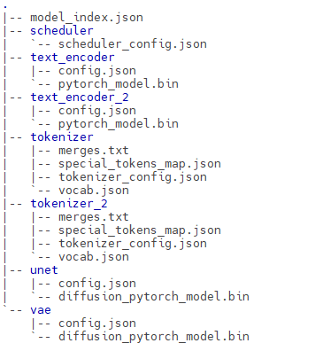<br>
[diffusers](https://github.com/huggingface/diffusers)
转换脚本路径：diffusers/scripts  
diffusers-->diffusion:
```
python convert_diffusers_to_original_stable_diffusion.py --model_path model_dir --checkpoint_path path_to_ckpt.ckpt
```
其他参数：
  --half：使用fp16数据格式
  --use_safetensors：使用safetensors保存
diffusion-->diffusers:
```
python convert_original_stable_diffusion_to_diffusers.py --checkpoint_path path_to_ckpt.ckpt --dump_path model_dir --image_size 512 --prediction_type epsilon
```