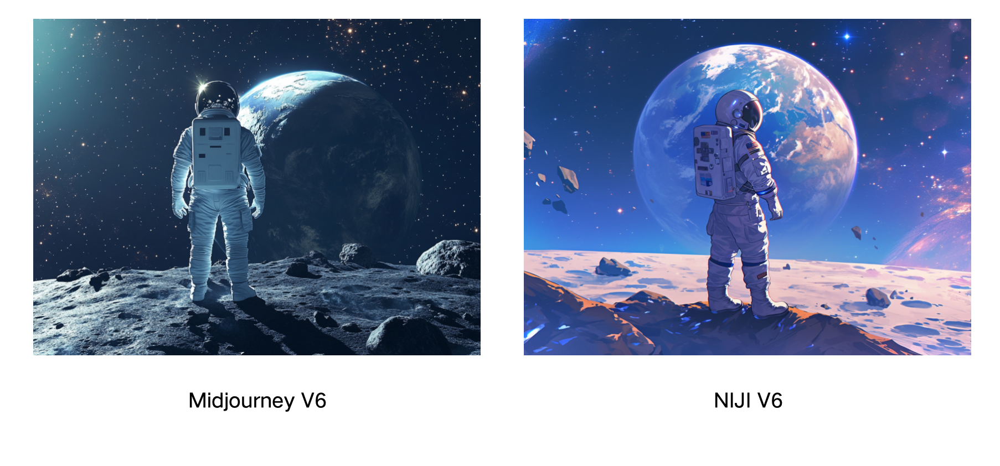

# 目录

- [1.Midjourney的提示词格式是什么样的？](#1.Midjourney的提示词格式是什么样的？)

<h2 id="1.Midjourney的提示词格式是什么样的？">1.Midjourney的提示词格式是什么样的？</h2>

Midjourney的整体提示词撰写逻辑可以遵循：**风格（Style）+ 主题（Subject）+ 布景（Setting）+ 构图（Composition）+ 灯光（Lighting）+ 附加信息（Additional Info）这几个维度**，我们可以从这几个维度入手，对提示词进行扩写、优化、完善：

1. 风格：赛博朋克风格的照片（Cyberpunk style photos）
2. 主题：一名穿着白色太空服的宇航员，头盔面罩反射着星星（An astronaut in a white space suit, helmet visor reflecting stars）
3. 背景：站在星空中可见地球的月球上（Standing on a moon with Earth visible in the starry sky）
4. 构图：以宇航员为中心，地球为背景（Astronaut centered, Earth in the background）
5. 照明：明亮的阳光和柔和的月光反射（Bright sunlight with soft moonlight reflections）
6. 附加信息：附近的月球岩石和小陨石坑（Moon rocks and small craters nearby）

下面是用上述提示词在Midjourney V6和NIJI V6生成的图像示例：

