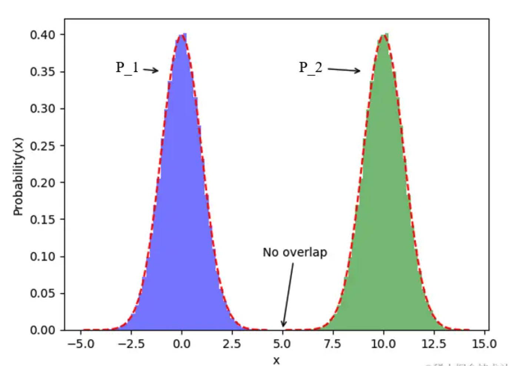
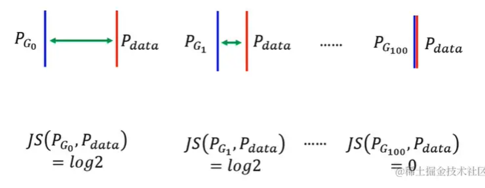
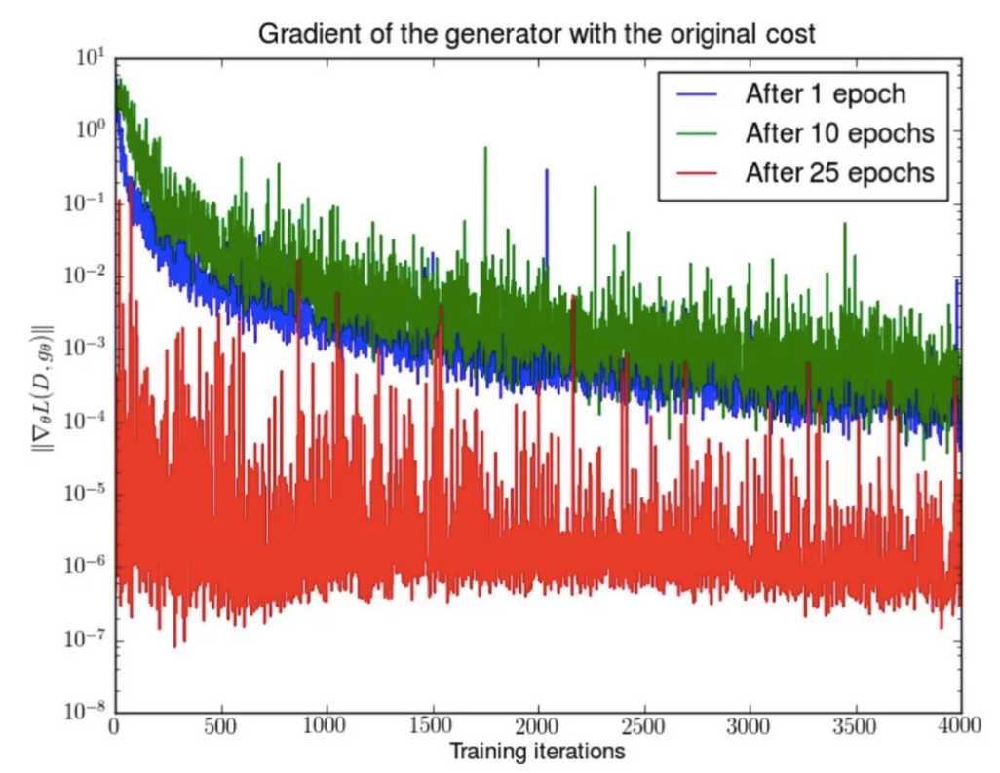

# 目录

- [1.哪些经典的GAN模型跨过了周期，在AIGC时代继续落地使用？](#1.哪些经典的GAN模型跨过了周期，在AIGC时代继续落地使用？)
- [2.GAN的损失函数推导](#2.GAN的损失函数推导)
- [3.GAN的收敛性分析](#3.GAN的收敛性分析)
- [4.GAN的缺陷](#4.GAN的缺陷)

<h2 id="1.哪些经典的GAN模型跨过了周期，在AIGC时代继续落地使用？">1.哪些经典的GAN模型跨过了周期，在AIGC时代继续落地使用？</h2>

GAN作为传统深度学习时代的主流生成式模型，在AIGC时代到来后，终于“退居二线”，成为Stable Diffusion模型的得力助手。**Rocky认为这是GAN最好也是最合适的落地方式，所以Rocky持续梳理总结了在AIGC时代继续繁荣的GAN模型，为大家指明GAN快速学习入门的新路线：**

1. GAN优化：原生GAN、DCGAN、CGAN、WGAN、LSGAN等
2. 图像生成：bigGAN、GigaGAN等
3. 图像风格迁移：CycleGAN、StyleGAN、StyleGAN2等
4. 图像编辑：Pix2Pix、GauGAN、GauGAN2、DragGAN等
5. 图像超分辨率重建：SRGAN、ESRGAN、Real-ESRGAN、AuraSR等
6. 图像修复/人脸修复：GFPGAN等

<h2 id="2.GAN的损失函数推导">2.GAN的损失函数推导</h2>

判别器用来识别数据是真实样本还是由生成器生成的模拟样本，使用交叉熵建立损失函数

$$
\begin{align}
H(p,q) &= -\mathbb{E}_{x\sim p\left(x\right)} \left[\log\left(q\left(x\right)\right)\right]= -\sum_{x}p\left(x\right)\log\left(q\left(x\right)\right)
= -\int\limits_{x}f\left(x\right)\log\left(q\left(x\right)\right) dx
\end{align}
$$
由于这是一个二分类问题，其中D(x)表示判别器认为x为真实样本的概率，有

$$
\begin{align}
L &= -\sum_{x} p\left(x\right)\log\left(q\left(x\right)\right)\\
& = -p(x)\log [q(x)] - (1-p(x))log[1-q(x)]\\
& = -p(x,data)\log [D(x)] - p(x,g)log[1-D(x)] \\
& = -p(data)p(x\vert data)\log [D(x)] - p(g)p(x\vert g)log[1-D(x)] \\
& = -\frac{1}{2}\left(p_{data}(x)\log [D(x)] + p_{g}(x)log[1-D(x)]\right) \\
& = -\frac{1}{2}\left(\mathbb{E}_{x\sim p(data)}\left[\log (D(x))\right] + \mathbb{E}_{x\sim p(g)}\left[\log [1-D(x)]\right]\right) \\
\end{align}
$$
在此基础上可以得到Gans的值函数

$$
V(G,D) = \mathbb{E}_{x\sim p(data)}\left[\log (D(x))\right] + \mathbb{E}_{x\sim p(g)}\left[\log (1-D(x))\right]
$$
训练判别器D时,最大化V，训练生成器时，最小化V，整个训练过程可以表示为

$$
\min_{G}\max_{D}V(G,D)
$$
给定生成器G，求当下最优判别器D，令V对D的导数等于零，即可求得最优判别器

$$
\max_{D}V(G,D) = \mathbb{E}_{x\sim p(data)}\left[\log (D(x))\right] + \mathbb{E}_{x\sim p(g)}\left[\log (1-D(x))\right]$
$D^{*}(x)=\frac{\mathrm{P}_{data}(x)}{\mathrm{P}_{data}(x)+\mathrm{P}_{g}(x)}
$$
如今我们已经找到了最大化的D，现要将其固定，寻找最小化的G，即求下式：
$$
\begin{align}
\min_{G}V(G,D) &= \mathbb{E}_{x\sim p(data)}\left[\log (D(x))\right] + \mathbb{E}_{x\sim p(g)}\left[\log (1-D(x))\right] \\
&= \mathbb{E}_{x\sim p(data)}\left[\log\frac{p_{data}(x)}{p_{data}(x)+p_{g}(x)}\right] + \mathbb{E}_{x\sim p(g)}\left[\log\frac{p_{g}(x)}{p_{data}(x)+p_{g}(x)}\right] \\
&= \mathbb{E}_{x\sim p(data)}\left[\log\frac{\frac{1}{2}p_{data}(x)}{\frac{1}{2}(p_{data}(x)+p_{g}(x))}\right] + \mathbb{E}_{x\sim p(g)}\left[\log\frac{\frac{1}{2}p_{g}(x)}{\frac{1}{2}(p_{data}(x)+p_{g}(x))}\right] \\
&= KL(p_{data}(x)\|\frac{p_{data}(x)+p_{g}(x)}{2}) + KL(p_{g}(x)\|\frac{p_{data}(x)+p_{g}(x)}{2}) -2\log2 \\
& = 2JS(p_{data}\|p_{g}) - 2\log2
\end{align}
$$

<h2 id="3.GAN的收敛性分析">3.GAN的收敛性分析</h2>

优化判别器是在度量生成样本分布与真实样本分布的JS距离，优化生成器G实际是在最小化这个JS距离，当 $p_{data} = p_{g}$ 时G达到最优，此时$JS = 0$，最优解 

$G^{*}(x)= x \sim p_{data}(x)$， $D^{*}(x)=\frac{1}{2}$， $V(G^{*},D^{*}) = -2\log2$

<h2 id="4.GAN的缺陷">4.GAN的缺陷</h2>

根据原始GAN定义的判别器loss，我们可以得到最优判别器的形式；而在最优判别器下，我们可以把原始GAN定义的生成器loss等价变换为最小化真实分布与生成分布之间的JS散度。训练判别器是在度量生成器分布和真实数据分布的JS距离，训练生成器是在减小这个JS距离。
两个分布之间越接近它们的JS散度越小，我们通过优化JS散度就能将$p_{data}$ 拉向 $p_{g}$ 最终以假乱真。
看似合理，但问题就出在这个JS散度上。JS散度只有当**两个分布有所重叠的时候才有意义**，如果两个分布完全没有重叠的部分，或者它们重叠的部分可忽略，则它们的JS散度为一个固定的常数！
$$
\begin{align}
J S\left(P_{1} \| P_{2}\right)&=\frac{1}{2} K L\left(P_{1} \| \frac{P_{1}+P_{2}}{2}\right)+\frac{1}{2} K L\left(P_{2} \| \frac{P_{1}+P_{2}}{2}\right) \\
&= \frac{1}{2} \mathbb{E}_{x \sim p_{1}(x)}\left[\log\frac{2p_{1}(x)}{p_{1}(x)+p_{2}(x)}\right] + \frac{1}{2} \mathbb{E}_{x\sim p_{2}(x)}\left[\log\frac{2p_{2}(x)}{p_{1}(x)+p_{2}(x)}\right] \\
&= \frac{1}{2} \mathbb{E}_{x \sim p_{1}(x)}\left[\log\frac{p_{1}(x)}{p_{1}(x)+p_{2}(x)}\right] + \frac{1}{2} \mathbb{E}_{x\sim p_{2}(x)}\left[\log\frac{p_{2}(x)}{p_{1}(x)+p_{2}(x)}\right] + \log 2\\
&= \frac{1}{2} \sum_{x}p_{1}(x)\left[\log\frac{p_{1}(x)}{p_{1}(x)+p_{2}(x)}\right] + \frac{1}{2} \sum_{x} p_{2}(x)\left[\log\frac{p_{2}(x)}{p_{1}(x)+p_{2}(x)}\right] + \log 2\\
\end{align}
$$

当两个分布不重合时，对于任意一点x，必有一分布在该点处概率为0，无论x取何值，最终计算出的JS始终等于log2

既然这样，那么是否两个分布有重叠，JS就可以正常计算了？

其实不然，**当 **$p_{data}$** 与 **$p_{g}$** 的支撑集（support）是高维空间中的低维流形（manifold）时， **$p_{data}$** 与 **$p_{g}$** 重叠部分测度（measure）为0的概率为1。**

也就是说，当两个分布有重叠时，大概率也是可以忽略不计的重叠，这时的JS值依然是log2

- 支撑集（support）其实就是函数的非零部分子集，比如ReLU函数的支撑集就是，一个概率分布的支撑集就是所有概率密度非零部分的集合。
- 流形（manifold）是高维空间中曲线、曲面概念的拓广，我们可以在低维上直观理解这个概念，比如我们说三维空间中的一个曲面是一个二维流形，因为它的本质维度（intrinsic dimension）只有2，一个点在这个二维流形上移动只有两个方向的自由度。同理，三维空间或者二维空间中的一条曲线都是一个一维流形。
- 测度（measure）是高维空间中长度、面积、体积概念的拓广，可以理解为“超体积”。

GAN中的生成器一般是从某个低维（比如100维）的随机分布中采样出一个编码向量，再经过一个神经网络生成出一个高维样本（比如64x64的图片就有4096维）。当生成器的参数固定时，生成样本的概率分布虽然是定义在4096维的空间上，但它本身所有可能产生的变化已经被那个100维的随机分布限定了，其本质维度就是100，再考虑到神经网络带来的映射降维，最终可能比100还小，所以生成样本分布的支撑集就在4096维空间中构成一个最多100维的低维流形，“撑不满”整个高维空间。

高维空间中不是每个点都能表达一个样本（图片），空间中大部份是多余的，真实数据蜷缩在低维子空间的流形上（高维曲面），因为维度比整个空间低，所占空间的体积几乎为零，像一张薄纸飘在三维空间，不仔细看很难发现。

“撑不满”就会导致真实分布与生成分布难以“碰到面”，这很容易在二维空间中理解：一方面，二维平面中随机取两条曲线，它们之间刚好存在重叠线段的概率为0；另一方面，虽然它们很大可能会存在交叉点，但是相比于重合的曲线而言，交叉点比曲线低一个维度，长度（测度）为0，可忽略。三维空间中也是类似的，随机取两个曲面，它们之间最多就是比较有可能存在交叉线，但是交叉线比曲面低一个维度，面积（测度）是0，可忽略。

从低维空间拓展到高维空间，就有了如下逻辑：因为一开始生成器随机初始化，所以两个分布之间几乎不可能有什么关联，所以它们的支撑集之间的重叠部分要么不存在，要么就比最小维度还要低至少一个维度，因此重叠部份测度为0，从而分布之间重叠的部分可以忽略

**在最优判别器下，求最优生成器即为最小化生成器的loss，等价于最小化 **$p_{data}$** 与 **$p_{g}$** 之间的JS散度，而由于 **$p_{data}$** 与 **$p_{g}$** 的要么没有重叠要么重叠部分测度为0，所以无论它们相距多远JS散度都是常数，最终导致生成器的梯度为0，导致梯度消失。**

