# 目录

- [1.Ip-adapter的模型结构与原理](#1.Ip-adapter的模型结构与原理)
- [2.Controlnet的模型结构与原理](#2.Controlnet的模型结构与原理)
- [3.人物一致性模型PhotoMaker原理](#3.人物一致性模型PhotoMaker原理)
- [4.人物一致性模型InstantID原理](#4.人物一致性模型InstantID原理)
- [5.单ID图像为什么InstantID人物一致性比Photomaker效果好](#5.单ID图像为什么InstantID人物一致性比Photomaker效果好)
- [6.Controlnet++的模型结构和原理](#6.Controlnet++的模型结构和原理)
- [7.Controlnext的模型结构和原理](#7.Controlnext的模型结构和原理)
- [8.ODGEN的模型结构和原理](#8.ODGEN的模型结构和原理)
- [9.Controlnet如何处理条件图的？](#9.Controlnet如何处理条件图的？)
- [10.加入Controlnet训练后，训练时间和显存的变化？](#10.加入Controlnet训练后，训练时间和显存的变化？)
- [11.T2I-Adapter的模型结构和原理](#11.T2I-Adapter的模型结构和原理)
- [12.T2I-Adapter和ControlNet的异同点是什么？](#12.T2I-Adapter和ControlNet的异同点是什么？)
- [13.InstanceDiffusion的模型结构和原理](#13.InstanceDiffusion的模型结构和原理)
- [14.BeyondScene的模型结构和原理](#14.BeyondScene的模型结构和原理)
- [15.HiCo的模型结构和原理](#15.HiCo的模型结构和原理)
- [16.LayoutDM的模型结构和原理](#16.LayoutDM的模型结构和原理)
- [17.LayoutDIffusion的模型结构和原理](#[17.LayoutDIffusion的模型结构和原理]())
- [18.LayoutDiffuse的模型结构和原理](#18.LayoutDiffuse的模型结构和原理)
- [19.LayoutDM的模型结构和原理](#19.LayoutDM的模型结构和原理)
- [20.AnyScene的模型结构和原理](#20.AnyScene的模型结构和原理)
- [21.MIGC的模型框架和原理](#21.MIGC的模型框架和原理)
- [22.介绍一下Training-free Composite Scene Generation for Layout-to-Image Synthesis](#22.介绍一下Training-free-Composite-Scene-Generation-for-Layout-to-Image-Synthesis)
- [23.Isolated Diffusion的框架和原理](#23.Isolated-Diffusion的框架和原理)
- [24.MIGC++的框架和原理](#24.MIGC++的框架和原理)
- [25.DynamicControl的框架和原理](#25.DynamicControl的框架和原理)
- [26.MaxFusion的框架和原理](#26.MaxFusion的框架和原理)
- [27.CreatiLayout的框架和原理](#27.CreatiLayout的框架和原理)
- [28.Ctrl-X的框架和原理](#28.Ctrl-X的框架和原理)
- [29.OMNIBOOTH的框架和原理](#29.OMNIBOOTH的框架和原理)
- [30.EasyPhoto的训练和推理流程是什么样的？](#30.EasyPhoto的训练和推理流程是什么样的？)
- [31.FaceChain的训练和推理流程是什么样的？](#31.FaceChain的训练和推理流程是什么样的？)
- [32.ReCo的框架和原理](#32.ReCo的框架和原理)
- [33.Be Yourself（Bounded Attention for Multi-Subject Text-to-Image Generation）的框架和原理](#33.BeYourself（Bounded-Attention-for-Multi-Subject-Text-to-Image-Generation）的框架和原理)
- [34.IFadapter的框架和原理](#34.IFadapter的框架和原理)
- [35.LAW-Diffusion的框架和原理](#35.LAW-Diffusion的框架和原理)
- [36.Check, Locate, Rectify（A Training-Free Layout Calibration System for Text-to-Image Generation）的框架和原理](#36.Check,Locate,Rectify（A-Training-Free-Layout-Calibration-System-for-Text-to-Image-Generation）的框架和原理)

<h2 id="1.Ip-adapter的模型结构与原理">1.Ip-adapter的模型结构与原理 </h2>
IP-Adapter 采用了一种解耦的交叉注意力机制，将文本特征和图像特征分开处理，从而使得生成的图像能够更好地继承和保留输入图像的特征。

图像编码：IP-Adapter 使用预训练的 CLIP（Contrastive Language-Image Pre-training）图像编码器来提取图像提示的特征。

解耦交叉注意力机制：IP-Adapter 通过这种机制，将文本特征的 Cross-Attention 和图像特征的 Cross-Attention 分区开来。在Unet 的模块中新增了一路 Cross-Attention 模块，用于引入图像特征。

适配模块：IP-Adapter 包含一个图像编码器和包含解耦交叉注意力机制的适配器。这个适配器允许模型在生成图像时，同时考虑文本提示和图像提示，生成与文本描述相匹配的图像。

<h2 id="2.Controlnet的模型结构与原理">2.Controlnet的模型结构与原理 </h2>

权重克隆：ControlNet 将大型扩散模型的权重克隆为两个副本，一个“可训练副本”和一个“锁定副本”。锁定副本保留了从大量图像中学习到的网络能力，而可训练副本则在特定任务的数据集上进行训练，以学习条件控制。

零卷积：ControlNet 引入了一种特殊类型的卷积层，称为“零卷积”。这是一个 1x1 的卷积层，其权值和偏差都初始化为零。零卷积层的权值会从零逐渐增长到优化参数，这样设计允许模型在训练过程中逐渐调整和学习条件控制，而不会对深度特征添加新的噪声。

特征融合：ControlNet 通过零卷积层将额外的条件信息融合到神经网络的深层特征中。这些条件可以是姿势、线条结构、颜色分布等，它们作为输入调节图像，引导图像生成过程。

灵活性和扩展性：ControlNet 允许用户根据需求选择不同的模型和预处理器进行组合使用，以实现更精准的图像控制和风格化。例如，可以结合线稿提取、颜色控制、背景替换等多种功能，创造出丰富的视觉效果。

<h2 id="3.人物一致性模型PhotoMaker原理">3.人物一致性模型PhotoMaker原理 </h2>

编码器（Encoders）：PhotoMaker使用CLIP图像编码器来提取图像嵌入（image embeddings），并通过微调部分Transformer层来优化模型对于屏蔽图像中ID特征的提取能力。

堆叠ID嵌入（Stacked ID Embedding）：通过将多个输入ID图像的编码堆叠起来，构建了一个统一的ID表示。这个表示能够保留每个输入ID图像的原始特征，并在推理阶段接受任意数量的ID图像作为输入，从而保持高生成效率。

融合（Merging）：利用扩散模型中的交叉注意力机制来自适应地合并堆叠的ID嵌入中包含的ID信息，从而在生成过程中实现对ID特征的有效控制。

ID导向的数据构建流程（ID-Oriented Human Data Construction）：为了支持PhotoMaker的训练，研究者设计了一个自动化流程来构建一个以ID为中心的人类数据集。这个数据集包含大量具有不同表情、属性、场景的图像，有助于训练过程中的ID信息学习。

<h2 id="4.人物一致性模型InstantID原理">4.人物一致性模型InstantID原理 </h2>
ID Embedding：InstantID利用预训练的人脸模型（如insightface库中的模型）来提取面部特征的语义信息，这些特征被称为ID Embedding。与使用CLIP模型相比，这种方法能够更精准和丰富地捕获人物面部表情的特征。

Image Adapter：这是一个轻量级的自适应模块，它结合了文本提示信息和图像提示信息。该模块的设计思路与IP-Adapter相似，通过解耦交叉注意力机制来适应不同的生成任务。

IdentityNet：为了在粗粒度上改进图像生成并更精确地控制人物ID图像的生成，InstantID引入了IdentityNet模块。这个模块利用弱空间信息（如面部关键点）和强语义信息（从ID Embedding模块提取的面部表情特征）来引导图像的生成。

ControlNet：InstantID还使用了ControlNet来增强面部特征提取，进一步提高图像生成的质量和准确性。

<h2 id="5.单ID图像为什么InstantID人物一致性比Photomaker效果好">5.单ID图像为什么InstantID人物一致性比Photomaker效果好</h2>

1.InstantID利用预训练的人脸模型（如insightface库中的模型）来提取面部特征的语义信息。与Photomaker所使用的CLIP模型相比，这种方法能够更精准和丰富地捕获人物面部表情的特征。

2.InstantID还使用ControlNet来增强面部特征提取，进一步提高图像生成的质量和准确性。

3.Photomaker是先将文本特征和图像特征通过MLPs融合，再做CrossAttention加入U-net.InstantID是图像特征和文本特征分开做CrossAttention,再融合。（可以认为是区别，不要一定是效果好的原因）

<h2 id="6.Controlnet++的模型结构和原理">6.Controlnet++的模型结构和原理</h2>

论文链接：https://arxiv.org/pdf/2404.07987.pdf

参照cyclegan，采用预先训练的判别优化循环一致性损失。

输入的条件信息与从生成的图像中提取出来的条件信息做损失，如mask。

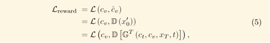

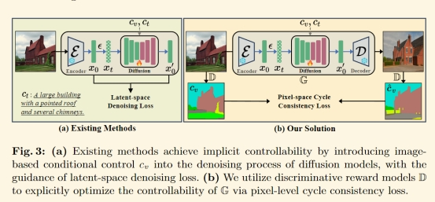 

同时提出了一种通过添加噪声扰乱训练图像的一致性，并使用单步去噪图像进行奖励微调的新策略。相比从随机噪声开始多步采样，此方法显著减少了时间和内存成本，同时保持了高效的奖励微调,最终提高了生成图像与输入条件的一致性。

<h2 id="7.Controlnext的模型结构和原理">7.Controlnext的模型结构和原理</h2>

论文链接：https://arxiv.org/pdf/2408.06070

该论文提出了一种名为ControlNeXt的新方法，用于高效且可控的图像和视频生成。作者指出，现有的可控生成方法通常需要大量的额外计算资源，尤其是在视频生成方面。此外，这些方法在训练时也面临挑战，如控制能力弱或收敛缓慢。为了解决这些问题，作者设计了一种更为简单且高效的架构，并提出了新的技术，如跨归一化（Cross Normalization），以替代传统的零卷积（Zero Convolution），从而实现更快更稳定的训练收敛。

### 主要内容：

1. **ControlNeXt架构**：该架构减少了与基础模型相比的额外成本，提供了一种轻量级的结构，能够无缝整合其他权重（如LoRA权重），无需额外训练即可实现风格转换。
2. **跨归一化技术**：作者提出了一种新的归一化方法，用于大规模预训练模型的微调，使得训练更加高效和稳定。
3. **参数效率**：ControlNeXt减少了多达90%的可学习参数，并在多个基于扩散模型的图像和视频生成任务中展示了其鲁棒性和兼容性。

整体训练框架如下图所示：

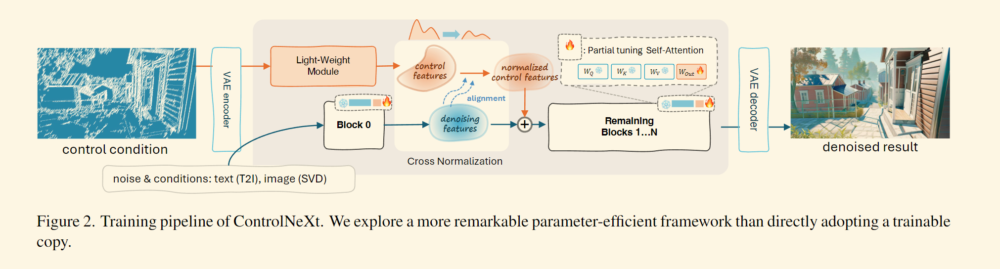

ControlNeXt 采用精简的架构，消除了繁重的辅助组件，从而最大限度地减少延迟开销并减少可训练参数。这种轻量级设计使其能够充当具有强大鲁棒性和兼容性的即插即用模块，进一步允许与其他 LoRA 权重集成以改变生成样式，而无需额外训练。提出的交叉归一化，用新引入的参数对预训练的大型模型进行微调，从而促进更快、更稳定的训练收敛。

<h2 id="8.ODGEN的模型结构和原理">8.ODGEN的模型结构和原理 </h2>

论文链接：https://arxiv.org/pdf/2405.15199

ODGEN（**O**bject **D**etection **GEN**eration）是一个基于扩散模型（Diffusion Model）的图像生成方法，专门用于生成领域特定的物体检测数据。其核心目标是通过控制扩散模型，生成具有多类物体、复杂场景和重叠物体的高质量图像，以此扩展训练数据，提高物体检测任务的性能。

模型框架如下：

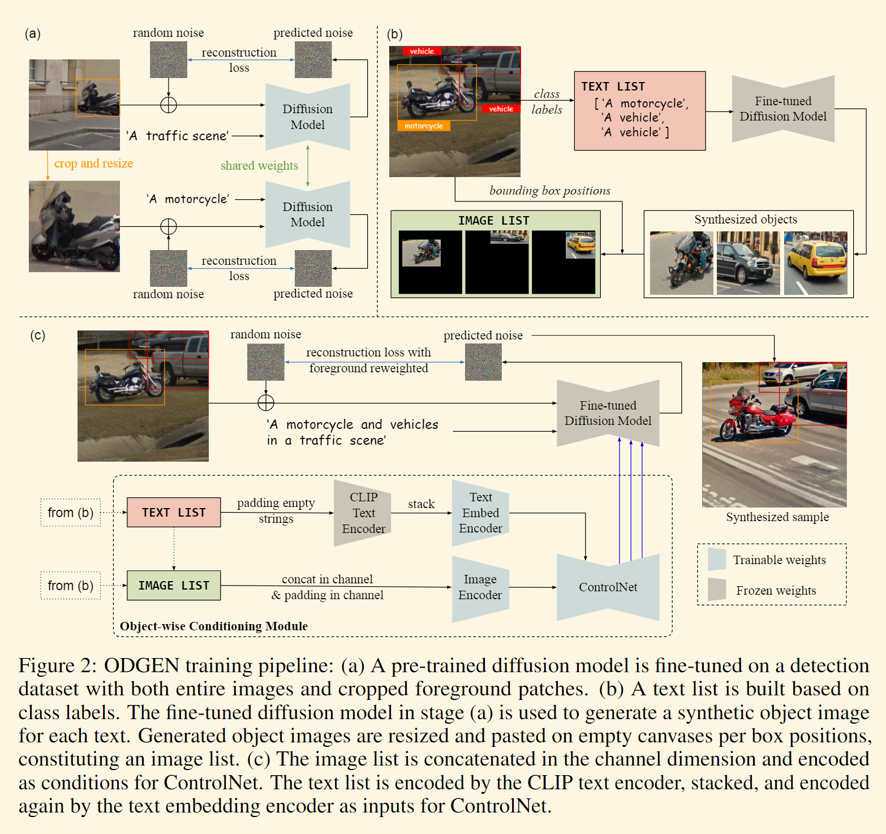

该方法的关键技术包括：

1. **扩散模型的微调**：在领域特定的数据集上微调扩散模型，以便适应目标场景的分布。
2. **对象级别的控制策略**：通过文本提示和视觉条件，确保生成的图像准确地包含指定类别的物体，并符合空间约束（如边界框位置）。

### 1. 领域特定的扩散模型微调

#### 基本思路

扩散模型（如Stable Diffusion）通常是在大规模网络数据上进行预训练的，但这些数据的分布与实际的特定领域数据（如医疗图像、游戏场景）存在很大差异。因此，ODGEN首先在领域特定的数据集上微调扩散模型。

微调的过程中，模型不仅会使用整个图像，还会使用裁剪后的前景物体来优化生成效果。这有助于模型更好地学习前景物体的细节，同时保留生成完整背景场景的能力。

#### 具体步骤

- 首先，从数据集中裁剪前景物体，并将其调整为512×512大小的图像。
- 然后，使用基于边界框和类别的文本提示，生成整个场景和前景物体。对于场景使用模板“a <场景名称>”，对于物体使用模板“a <类别名称>”。
- 最后，通过一个重建损失函数对扩散模型进行优化，确保生成图像的质量。

### 2. 对象级别的控制策略

#### 背景问题

现有的生成方法在处理多类别物体和复杂场景时，往往会出现“概念混叠”现象，即多个类别的物体会在生成的图像中相互干扰。同时，物体重叠时，部分对象可能会丢失。因此，ODGEN引入了对象级别的控制策略，确保生成的图像严格符合指定的物体类别和位置。

#### 控制策略

ODGEN使用了两种主要的控制条件：

1. **文本列表编码**：将每个物体的类别和边界框信息转化为一个文本列表。每个物体的描述采用固定模板“a <类别名称>”，然后通过预训练的CLIP文本编码器编码为文本嵌入。嵌入结果通过卷积网络进行处理，确保每个类别的物体不会相互干扰。
2. **图像列表编码**：对于每个类别的物体，生成对应的前景图像，然后将这些图像根据边界框的位置粘贴到一个空白画布上，形成图像列表。这个图像列表可以有效避免物体之间的遮挡问题，确保每个物体都能正确生成。

#### 最终生成

生成过程通过将文本嵌入和图像嵌入同时输入到ControlNet中，实现对生成图像的精准控制。ControlNet能够处理边界框信息，确保生成的图像在空间和类别上都满足要求。

### 3. 数据集生成流程

ODGEN不仅是一个生成模型，还设计了一套完整的数据集生成流程。该流程包括以下步骤：

1. **对象分布估计**：根据训练数据集中的边界框属性，估计每个类别的物体数量、位置、面积和宽高比等统计分布。
2. **伪标签生成**：从估计的分布中随机采样生成边界框和类别信息，作为生成图像的条件。
3. **图像合成**：使用ODGEN生成带有伪标签的新图像。
4. **标签过滤**：使用训练好的分类器对生成的图像进行过滤，剔除那些未能生成前景物体的图像，确保生成数据的高质量。

流程图如下：

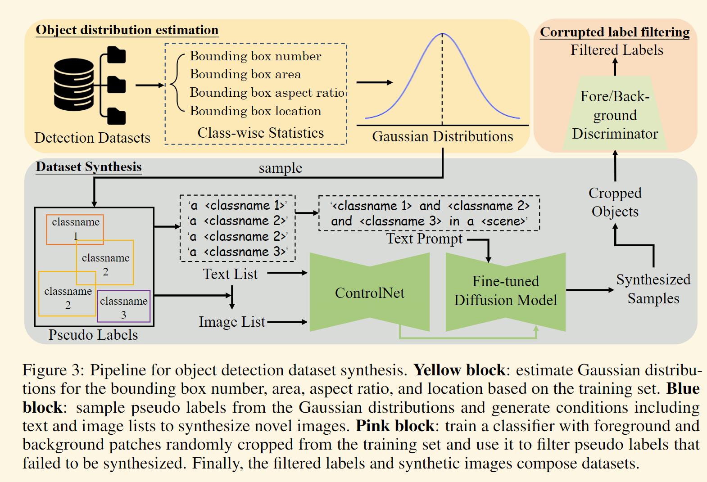

<h2 id="9.Controlnet如何处理条件图的？">9.Controlnet如何处理条件图的？</h2>

我们知道在 sd 中，模型会使用 VAE-encoder 将图像映射到隐空间，512×512 的像素空间图像转换为更小的 64×64 的潜在图像。而 controlnet 为了将条件图与 VAE 解码过的特征向量进行相加，controlnet 使用了一个小型的卷积网络，其中包括一些普通的卷积层，搭配着 ReLU 激活函数来完成降维的功能。

<h2 id="10.加入Controlnet训练后，训练时间和显存的变化？">10.加入Controlnet训练后，训练时间和显存的变化？</h2>

在论文中，作者提到，与直接优化 sd 相比，优化 controlnet 只需要 23% 的显存，但是每一个 epoch 需要额外的 34% 的时间。可以方便理解的是，因为 controlnet 其实相当于只优化了unet-encoder，所以需要的显存较少，但是 controlnet 需要走两个网络，一个是原 sd 的 unet，另一个是复制的 unet-encoder，所以需要的时间会多一些。

<h2 id="11.T2I-Adapter的模型结构和原理">11.T2I-Adapter的模型结构和原理</h2>

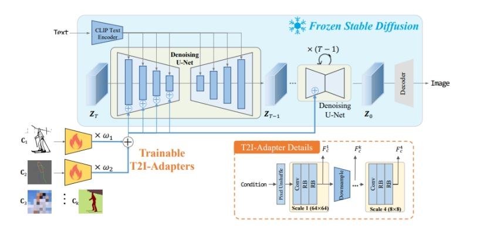

如图所示为 T2I-Adapter 模型结构，它包含了四个特征提取模块和三个下采样模块。模型首
先利用了 Pixel Unshuffle 来将 512x512 的图片下采样到 64x64，然后经过 Adapter 模块，他会输出四个不同尺寸的特征图 
$$F_c = \{F^1_c, F^2_c, F^3_c, F^4_c\}$$
注意Adapter 输出的特征图的大小是和 Unet-encoder 输出的特征图
$$F_enc = \{F^1_enc, F^2_enc, F^3_enc, F^4_enc\}$$
大小一致，然后再通过按位相加的方式来完成特征融合：
$$F^i_enc=F^i_enc+F^i_c, i∈\{1,2,3,4\}$$

<h2 id="12.T2I-Adapter和ControlNet的异同点是什么？">12.T2I-Adapter和ControlNet的异同点是什么？</h2>

- 如何将图片转化为隐变量：controlnet 和 T2I-Adapter 采用了不同的方法来将图片转化为隐向量。在 controlnet 中，作者是设计了一个小型的卷积网络，这其中包括了不同的卷积和激活函数，其中由 4x4 和 2x2 的卷积，来完成下采样的功能，而在 T2I-Adapter 中，作者是使用了Pixel-Unshuffle 的操作来完成该功能。

- Condition Encoder：controlnet 和 T2I-Adapter 采用了不同的方式来对条件控制信息进行编码。在 controlnet 中，作者是直接将 sd-encoder 将复制了一份，当作可训练模块，因为作者认为，sd 是在 10 亿级别上进行训练的，它的 encoder 足够强大和鲁棒，因此作者并没有专门设计针对条件信息的编码器。而在 T2I-Adapter 的作者是设计了一个小型的卷积网络，来完成下采样的功能，让下采样倍数和 sd-encoder 的下采样倍数一样，然后通过按位相加的方式来完成特征融合。

- 参数量和训练时间：前面我们提到了，controlnet 的 condition encoder 是 sd-encoder，这其中的参数数目比 T2I-Adapter 的参数要多的多，因此，controlnet 的训练时间也比 T2I-Adapter要长。

<h2 id="13.InstanceDiffusion的模型结构和原理">13.InstanceDiffusion的模型结构和原理</h2>

论文链接：[2402.03290](https://arxiv.org/pdf/2402.03290)

### 模型结构和原理

**InstanceDiffusion** 是一种用于文本到图像生成的扩散模型，旨在实现对图像中个体实例的精确控制。该模型允许用户通过文本描述和多种空间条件（如点、框、涂鸦、掩码）来指定每个实例的位置和属性，实现对图像生成的灵活控制。

### 关键技术

**多实例处理**：对每个实例进行单独的条件编码，使得不同实例之间的信息隔离，减少特征互相干扰。

**跳跃连接的通道缩放**：通过傅里叶变换对低频特征进行精确缩放，提升模型对实例的响应能力，特别是位置和姿态的控制。

**实例融合去噪**：在生成过程中，模型通过对每个实例的独立去噪与全局特征的融合，提升生成图像的质量和一致性。

- 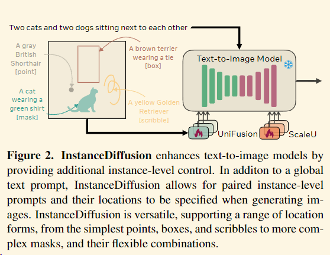

### 关键组件

#### UniFusion Block

- **功能**：将实例级别的条件（包括文本描述和位置条件）融入到扩散模型的视觉特征中。

- **工作方式**：
  
  - 不同位置条件（如框、掩码、点、涂鸦）被转化为二维点集，通过傅里叶映射进行特征化。
  
  - 文本描述则通过 CLIP 文本编码器编码。
  
  - UniFusion Block 将这些特征与模型主干的视觉特征融合，从而在生成过程中提供实例级别的控制。
  
    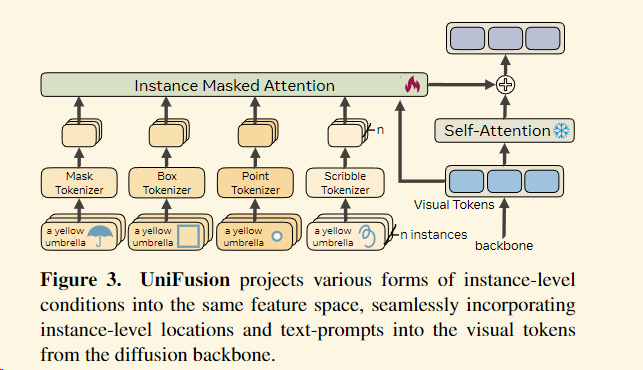

#### ScaleU Block

- **功能**：重新校准 UNet 模型中的主干特征和跳跃连接特征，以更好地遵循输入的布局条件。
- **工作方式**：
  - 对于主干特征和跳跃连接特征，使用可学习的通道缩放向量进行重新校准。
  - 通过傅里叶变换，仅对跳跃连接特征的低频成分进行缩放，从而提升模型对实例位置的精准响应。

#### Multi-instance Sampler

- **功能**：在生成图像时降低不同实例条件之间的信息泄漏，提升生成图像的质量和一致性。

- **工作方式**：
  
  - 对每个实例进行独立的去噪操作，生成实例特征。
  
  - 将这些特征与全局特征进行融合，再对融合后的特征进行进一步去噪。
  
    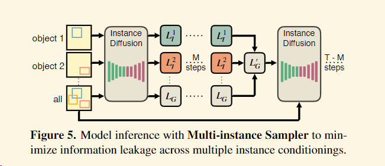
  

<h2 id="14.BeyondScene的模型结构和原理">14.BeyondScene的模型结构和原理</h2>

### 模型结构和原理

**BeyondScene**是一个基于预训练扩散模型的创新框架，旨在生成高分辨率、以人为中心的场景。该方法解决了现有扩散模型在生成高分辨率复杂场景中的局限性，尤其是涉及多个人物时的场景生成。以下是该模型的主要结构和工作原理。

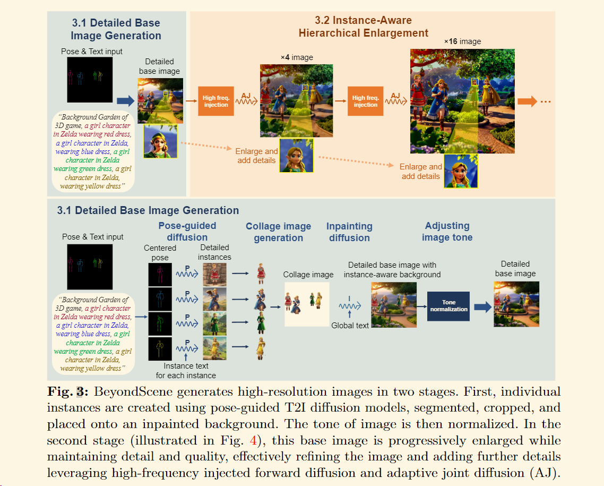

#### 关键技术
**分阶段生成**：模型首先生成基础图像，然后逐步细化场景细节，尤其是人物的姿态和外观。初始生成阶段关注场景的大致布局，后续阶段增加细节，提升图像分辨率和细节表现。

**实例感知放大**：在放大过程中，BeyondScene通过高频细节注入技术（如基于Canny边缘检测）提高图像清晰度，确保生成图像在放大时不会失去关键细节。

**自适应联合扩散**：动态调整扩散步幅，确保关键区域（如人物）的精细度和视觉一致性，避免多个视图中出现重复的对象或模糊区域。

#### **关键组件**
- **姿势引导的T2I扩散模型**：在生成基础图像时，利用现有的姿势引导T2I扩散模型生成多个人物实例。通过对实例的分割、裁剪和调整大小，BeyondScene确保了每个人物实例的细节精确。
- **自适应步幅和视图条件**：在联合扩散过程中，BeyondScene根据每个视图中的实例情况动态调整扩散的步幅和文本条件，确保场景中的每个部分都能精确控制，尤其是人物的姿势和外观。

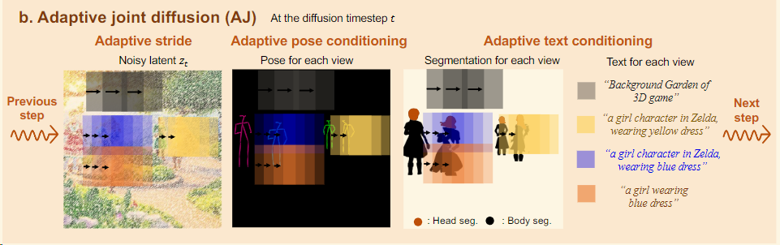

- **高频细节注入**：在图像放大过程中，通过边缘检测和像素扰动技术注入高频细节，避免模糊效果，提升最终图像的清晰度。

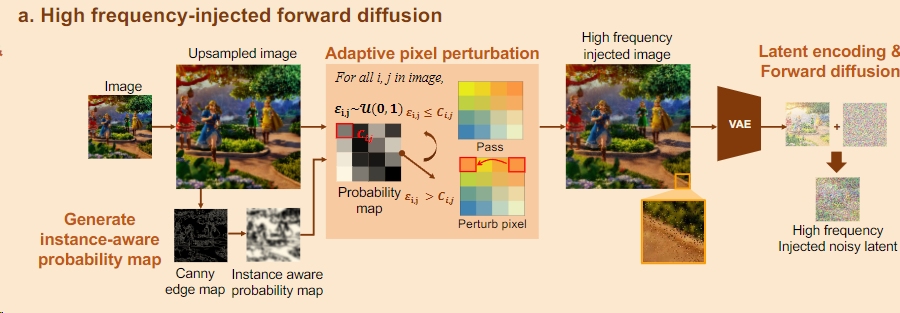

<h2 id="15.HiCo的模型结构和原理">15.HiCo的模型结构和原理</h2>

论文链接：[2410.14324](https://arxiv.org/pdf/2410.14324)

### 模型结构和原理

HiCo模型采用了**层次化可控扩散模型**（Hierarchical Controllable Diffusion Model），其中核心是多分支的网络结构。这个结构的主要模块和组件如下：

- **多分支结构**：HiCo模型设计了多个分支，每个分支负责特定的布局区域的生成，包括背景和多个前景对象。通过权重共享，HiCo能够在不同分支间实现一致的特征表示，同时又能分别建模不同区域的细节。
- **控制条件的引入**：HiCo受到ControlNet和IP-Adapter的启发，在分支中引入了外部条件，通过**边路结构**来引导生成过程。这些条件包括文本描述（caption）和边界框（bounding box）等。
- **融合模块（Fuse Net）**：多分支网络生成的各区域特征最终在Fuse Net中融合。Fuse Net支持多种融合方式，包括加和、平均、掩码（mask）等。默认使用的是掩码方式，通过在生成过程中对不同区域进行掩码处理，实现不同前景和背景区域的解耦。

HiCo的工作原理基于以下步骤：

### （1）布局建模

HiCo首先将输入的布局信息（如文本和位置）解耦成不同的区域，由每个分支独立处理。每个分支在生成过程中会提取该区域的局部特征，并利用权重共享机制确保全局一致性。

### （2）扩散过程

HiCo基于扩散模型（Diffusion Model）的原理，从随机噪声逐步生成图像。在每个扩散步骤中，模型会使用特定的控制条件（如文本描述和位置信息）来指导图像生成。HiCo在扩散的不同阶段引入了多个层次的控制条件，从而确保图像生成符合设定的布局。

### （3）特征融合

在完成每个区域的特征提取后，HiCo将这些特征在Fuse Net中进行融合。Fuse Net通过掩码操作或加权方式，将不同区域的特征整合在一起，生成和谐的全局图像。这种方式不仅能够保持每个区域的独立性，还能保证整个图像在风格、光照和结构上的一致性。

### （4）支持多概念扩展

HiCo支持多种概念扩展，允许在生成过程中加入多个LoRA插件，用于实现个性化、多语言生成等功能。此外，HiCo还支持快速生成插件（如LCM-LoRA），能够加速分辨率512x512和1024x1024的图像生成。

<h2 id="16.LayoutDM的模型结构和原理">16.LayoutDM的模型结构和原理</h2>

论文链接：[[2305.02567\] LayoutDM: Transformer-based Diffusion Model for Layout Generation](https://arxiv.org/abs/2305.02567)

基于条件布局去噪器（cLayoutDenoiser）逐步去噪，生成符合给定属性的布局。

**条件布局去噪器（cLayoutDenoiser）**：

- 完全基于 Transformer 架构，包含以下模块：
  - **几何嵌入（Geometric Embedding）**：将布局元素的几何参数（中心坐标与尺寸）嵌入到特定维度。
  - **属性嵌入（Attributes Embedding）**：将元素的类别标签或文本特征嵌入到特定维度。
  - **时间步嵌入（Timestep Embedding）**：引入正弦时间步嵌入，使模型感知时间步 ttt。
  - **元素嵌入（Element Embedding）**：融合几何、属性和时间信息，为 Transformer 提供输入。

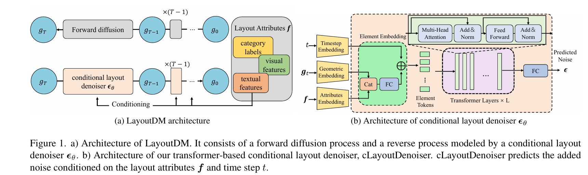

<h2 id="17.LayoutDIffusion的模型结构和原理">17.LayoutDIffusion的模型结构和原理</h2>

论文链接：[[2303.17189\] LayoutDiffusion: Controllable Diffusion Model for Layout-to-image Generation](https://arxiv.org/abs/2303.17189)

#### 模型结构

LayoutDiffusion是一种用于布局到图像生成的扩散模型，旨在通过高质量生成和精确控制来处理复杂的多对象场景。其主要结构包括以下几个部分：

1. **布局嵌入（Layout Embedding）**：
   - 将布局表示为对象集合，每个对象通过其边界框（bounding box）和类别ID来定义。
   - 通过投影矩阵将边界框和类别嵌入映射到高维空间，并对布局序列进行固定长度填充。
2. **布局融合模块（Layout Fusion Module, LFM）**：
   - 基于自注意力机制的Transformer编码器，促进布局中多个对象之间的交互，生成融合后的布局嵌入。
   - 提升对复杂场景的理解能力。
3. **图像-布局融合模块（Image-Layout Fusion Module）**：
   - 通过构建包含位置和尺寸信息的结构化图像补丁，将图像补丁视为特殊对象，以实现图像和布局在统一空间中的融合。
   - 包含两种融合方式：
     - **全局条件（Global Conditioning）**：直接加和全局布局嵌入。
     - **基于对象的交叉注意力（Object-aware Cross Attention, OaCA）**：同时关注对象的类别、位置和尺寸信息，实现对局部布局的精细控制。

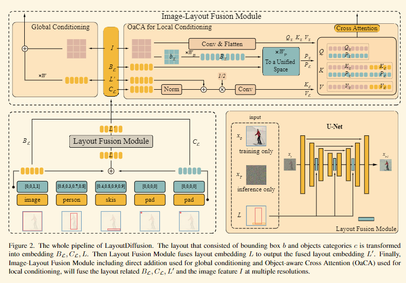

<h2 id="18.LayoutDiffuse的模型结构和原理">18.LayoutDiffuse的模型结构和原理</h2>

论文链接：[[2302.08908\] LayoutDiffuse: Adapting Foundational Diffusion Models for Layout-to-Image Generation](https://arxiv.org/abs/2302.08908)

#### 模型结构

LayoutDiffuse 基于 Latent Diffusion Model (LDM)，通过以下两个关键组件对预训练的扩散模型进行适配：

1. **布局注意力层（Layout Attention）**：

   - 在扩散模型的自注意力机制中加入实例感知的区域注意力，使模型更专注于布局中的实例特征。

   - 每个实例通过可学习的类别嵌入（Instance Prompt）进行标记，以增强实例感知。

   - 背景区域使用 Null Embedding，并结合前景-背景掩码进行特征融合。

     

2. **任务自适应提示（Task-Adaptive Prompts）**：

   - 向 QKV 注意力层添加任务提示，帮助模型从预训练任务（如文本到图像生成）适配到布局到图像生成任务。
   - 通过在注意力层的键值（Key 和 Value）中加入可学习嵌入，提供布局生成任务的额外上下文信息。

   整体结构：

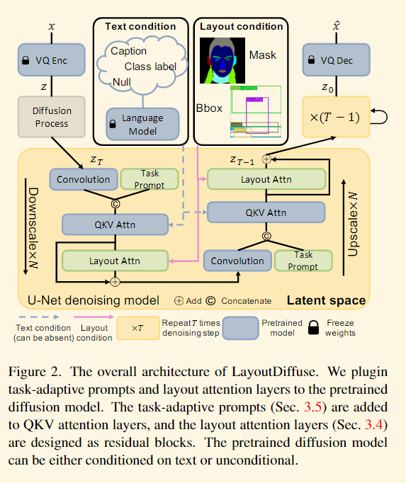

<h2 id="19.LayoutDM的模型结构和原理<">19.LayoutDM的模型结构和原理</h2>

论文链接：[LayoutDM: Precision Multi-Scale Diffusion for Layout-to-Image](https://www.computer.org/csdl/proceedings-article/icme/2024/10688052/20F0CkVbfHy)

#### 模型结构

LayoutDM 的主要结构如下：

1. **并行采样模块 (Parallel Sampling Module, PSM)**：
   - 提供局部精细控制，通过并行处理不同掩膜区域的梯度指导生成，改进了区域细节的生成质量。
   - 通过基于扩散的自适应方法生成非掩膜区域。
2. **语义一致性模块 (Semantic Coherence Module, SCM)**：
   - 提供全局语义一致性支持，通过全局梯度引导保证生成的各区域在语义上的连贯性。
3. **区域融合方法 (Region Fusion Method, RFM)**：
   - 针对前景与背景区域的重叠问题，通过梯度融合与区域均值计算实现平滑过渡。

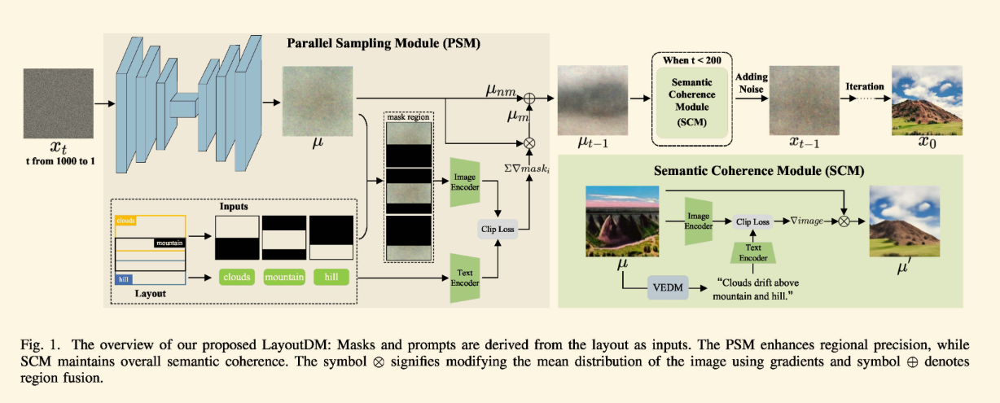

**生成流程**：

- 从布局中提取掩膜和文本提示作为输入。
- 以随机噪声初始化图像，通过逆扩散过程逐步生成图像。
- 采用以下机制在生成中逐步细化：
  - 掩膜区域：PSM 对掩膜区域进行局部引导，优化每个区域与文本提示的对齐程度。
  - 非掩膜区域：基于当前生成状态加入噪声，保留全局背景信息。
  - 全局一致性：SCM 在生成后期（t < 200 时）通过语义信息调整图像整体质量。

<h2 id="20.AnyScene的模型结构和原理">20.AnyScene的模型结构和原理</h2>

论文链接:[AnyScene: Customized Image Synthesis with Composited Foreground | IEEE Conference Publication | IEEE Xplore](https://ieeexplore.ieee.org/document/10657089)

### 1、获取合成前景

在框架的第一阶段，系统需要处理用户提供的元素图像和场景描述文本。首先对原始图像进行背景移除处理，获取纯净的前景元素，然后通过复制粘贴的方式将多个前景元素组合在一起，同时配合用户提供的文本描述，为后续的场景生成做好准备工作。

### 2、生成整体场景

这是框架的核心阶段，它采用了三个关键组件共同工作：前景注入模块将前景信息有效地注入到预训练的扩散模型中；布局控制策略通过前景蒙版来确保生成过程中前景元素的位置和形状得到准确保持；预训练扩散模型则基于这些输入信息生成完整的场景。这个阶段将合成前景、文本提示和随机噪声作为输入，通过复杂的生成过程创建出符合要求的场景图像。

### 3、恢复前景细节

在最后的阶段，框架致力于确保生成图像的视觉质量和细节准确性。系统采用专门的图像融合技术，将原始前景元素的精细细节巧妙地融合到生成的场景中。这个过程不仅确保了前景元素的细节保真度，还能够创造出自然的过渡效果，最终输出一张视觉上和谐统一的合成图像，既保留了前景的准确性，又实现了与背景的完美融合。

示例如下：

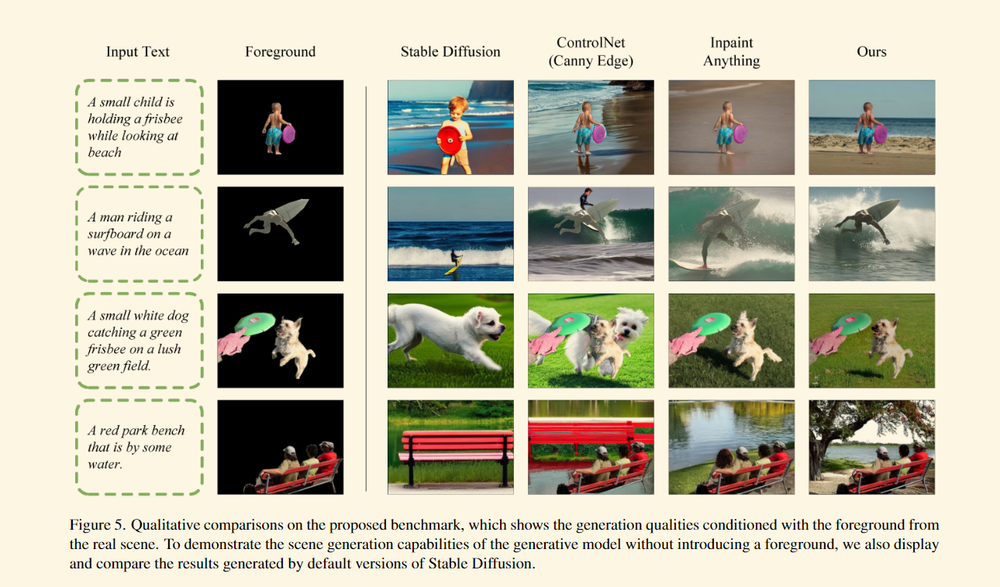

这个框架的优势在于能够保持前景细节的准确性，同时生成与之和谐的背景场景，实现自然的视觉效果。

<h2 id="21.MIGC的模型框架和原理">21.MIGC的模型框架和原理</h2>

论文链接：[2402.05408](https://arxiv.org/pdf/2402.05408)

MIGC的总体框架遵循"分而治之"的方法论，将复杂的多实例生成任务分解为若干个简单的单实例特征渲染子任务。这一框架包含三个核心部分：分解（Divide）、处理（Conquer）和组合（Combine），每个部分都针对特定的技术挑战提供了创新的解决方案。

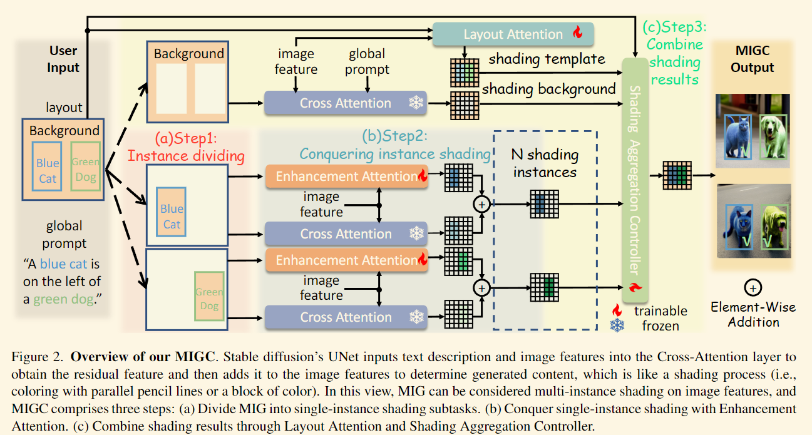

分解（Divide）部分专注于任务的合理拆分。模型在Cross-Attention层将多实例生成任务分解为多个单实例特征渲染子任务，每个子任务负责在指定区域生成具有特定属性的实例。这种分解方式不仅提高了处理效率，还能确保最终生成结果的整体和谐性。

处理（Conquer）部分着重解决单实例生成的质量问题。该部分引入了Enhancement Attention Layer来增强每个实例的特征渲染效果，通过两阶段的处理方式（预训练Cross-Attention的初步结果和Enhancement Attention的增强结果）来确保生成质量。同时，通过引入位置感知tokens来解决相同描述但不同位置实例的混淆问题。

组合（Combine）部分负责将各个部分的结果有效整合。这一过程首先通过Layout Attention获取整体着色模板，然后使用Shading Aggregation Controller动态融合所有结果。该控制器包含实例内部注意力和实例间注意力两个层次，通过softmax机制确保每个像素位置的权重分配合理，最终生成高质量的整体结果。

### 主要模块

**Enhancement Attention Layer**（增强注意力层）是第一个关键模块。这个模块首先接收实例的位置信息（如"Blue Cat"的边界框坐标[0.10, 0.28, 0.48, 0.88]），通过Fourier编码和MLP进行位置特征提取。同时，将文本描述"Blue Cat"通过CLIP编码器处理。这两部分信息结合后进入Cross-Attention层，与图像特征进行交互。最后，该模块还使用实例mask来确保特征处理仅在指定区域进行。这样的设计有效地增强了每个实例的特征表示。

**Layout Attention Layer**（布局注意力层）是第二个重要模块。该模块首先构建注意力掩码，将输入的布局信息转换为细粒度的attention masks。然后通过查询(Q)、键(K)、值(V)三个矩阵的交互生成注意力图，这个过程考虑了不同实例之间的空间关系。通过matmul（矩阵乘法）运算后，生成一个shading template（特征模板），为后续的特征融合提供指导。

**Shading Aggregation Controller**（特征聚合控制器）是最后一个核心模块。它采用层次化的设计：首先进行Instance Intra Attention（实例内部注意力），然后是Instance Inter Attention（实例间注意力）。这两个阶段都通过softmax操作来调整特征权重。最后，通过加权求和（Sum dim=0）将所有特征整合，得到最终的特征结果。这个模块保证了多个实例特征的合理融合。

这三个模块通过精心设计的联动机制共同工作，实现了对多实例生成任务的精确控制。它们的配合不仅确保了每个实例的特征质量，也保证了实例间的合理关系，最终生成高质量的整体结果。

示例如下：

<h2 id="22.介绍一下Training-free-Composite-Scene-Generation-for-Layout-to-Image-Synthesis">22.介绍一下Training-free Composite Scene Generation for Layout-to-Image Synthesis</h2>

论文链接：[2407.13609](https://arxiv.org/pdf/2407.13609)

这篇文章提出的CSG(Composite Scene Generation)的训练无关框架，主要用于解决布局引导的图像生成任务。该框架的核心创新点在于如何在不需要额外训练的情况下，通过精细控制扩散模型中的注意力机制来实现准确的布局控制和高质量的图像生成。

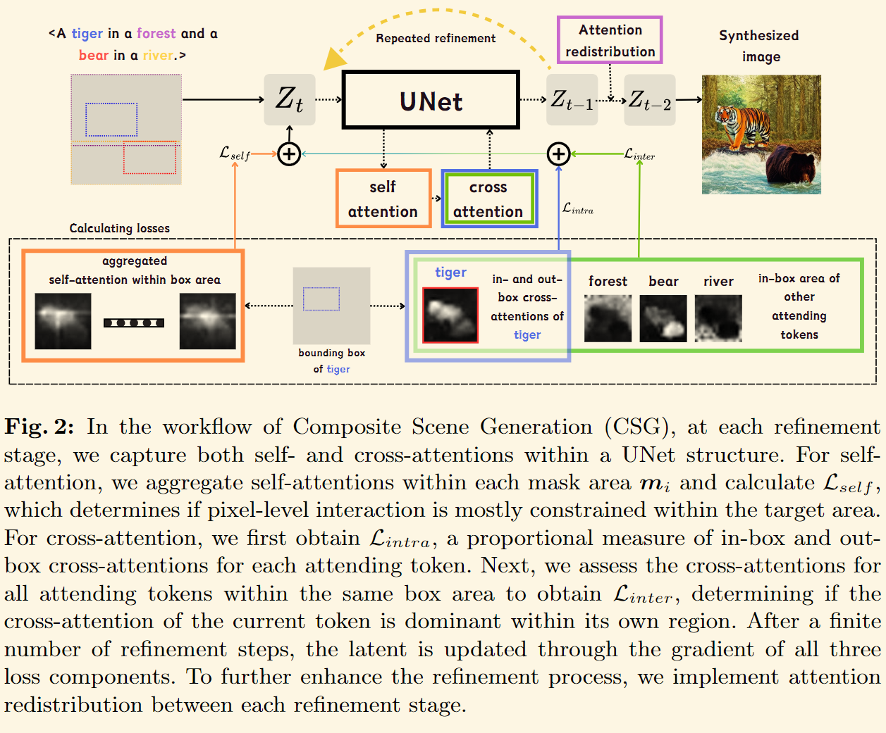

框架的基本架构包含三个关键组件：**选择性采样机制、交叉注意力约束和自注意力增强。**

**选择性采样机制**通过在目标区域选择最相关的注意力值并随机保留部分样本，在保持潜在噪声自然分布的同时确保充分的注意力覆盖。

**交叉注意力约束**则分为标记内约束和标记间约束，前者确保对象生成在指定区域内，后者解决语义交叉问题。

**自注意力增强**在扩散早期阶段优化像素间关系，提升局部连贯性。

工作原理是通过迭代优化过程来实现的。在每个优化步骤中，模型首先在UNet结构中捕获自注意力和交叉注意力信息，然后应用三种约束条件，最后基于组合损失更新潜在表示。在优化步骤之间，模型还采用注意力重分配机制来校正错位的注意力并减少语义交叉效应。整个过程持续TD个扩散步骤，每个步骤包含TR次优化迭代。

该框架的主要优势在于其对注意力机制的全面处理以及处理多对象复杂场景的能力。通过在保持扩散过程自然特性的同时，精心平衡空间约束和语义关系，模型能够在**不需要额外训练**的情况下实现高质量的布局控制图像生成。

示例如下：

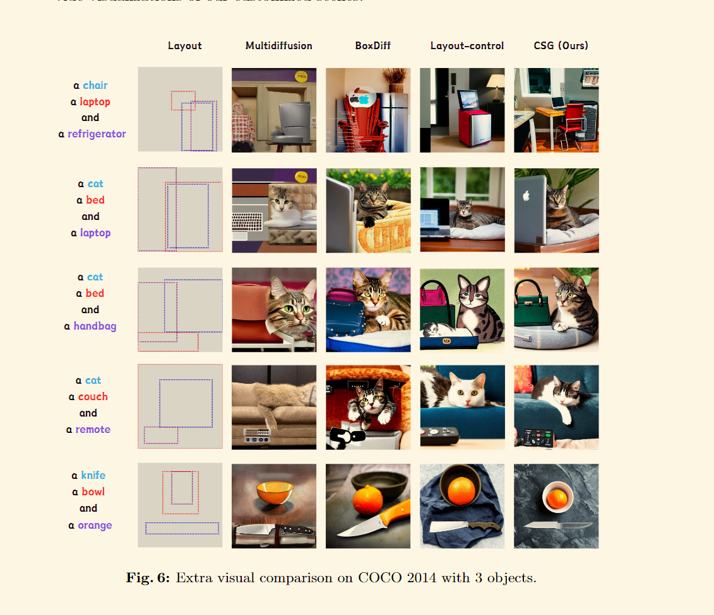

<h2 id="23.Isolated-Diffusion的框架和原理">23.Isolated Diffusion的框架和原理</h2>

论文链接：[2403.16954](https://arxiv.org/pdf/2403.16954)

Isolated Diffusion旨在解决文本到图像生成中"概念混淆"问题的无训练框架。这个框架主要处理两种情况：多个附属物（如一个企鹅戴着蓝帽子、红围巾和绿衬衫）和多个主体（如一只狗和一只猫）的生成问题。这种方法的核心思想是将不同概念的去噪过程隔离开来，以避免它们之间的相互干扰。主要分为以下几个流程：

第一部分 - **多附属物处理流程**（顶部黄色区域）： 这部分展示了如何处理单个主体的多个附属特征。以"戴着蓝帽子、红围巾和绿衬衫的小企鹅"为例，系统首先使用 GPT4 将输入拆分成多个子提示词，包括基础提示词"a baby penguin"和各个附属特征。这些提示词通过 CLIPtext 进行编码，然后在去噪过程中按照特定的数学公式（图中的数学表达式）进行组合，最终生成准确反映所有特征的图像。

第二部分 - **标准扩散推理流程**（中间粉色区域）： 这部分展示了传统的 Stable Diffusion 处理方式。它直接使用完整的提示词进行处理，但可能导致概念混淆的问题。图中展示了两个例子：一个是颜色特征混淆的企鹅，另一个是物种特征混淆的猫狗图像。这一部分的目的是展示未经改进的模型可能产生的问题。

第三部分 - **多主体处理流程（**底部黄色区域）： 这部分展示了如何处理多个主体的生成过程。以"一只狗在一只猫旁边"为例，系统首先使用 YOLO 进行目标检测，然后使用 SAM 模型生成精确的蒙版。在时间步骤 Tlay 处，系统通过替换其他主体区域的方式独立生成每个主体，最后通过特殊的掩码组合方式将它们整合在一起。图中的数学表达式展示了这个过程中的具体计算方法。

Isolated Diffusion 能够有效解决文本到图像生成中的概念混淆问题，同时保持了较高的图像质量和文本-图像一致性。

示例如下：

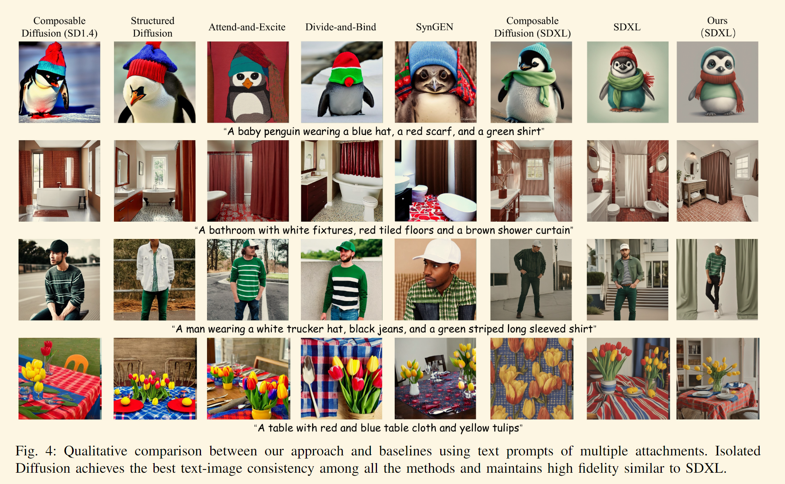

<h2 id="24.MIGC++的框架和原理">24.MIGC++的框架和原理</h2>

论文链接：[2407.02329](https://arxiv.org/pdf/2407.02329)

MIGC和MIGC++的区别：

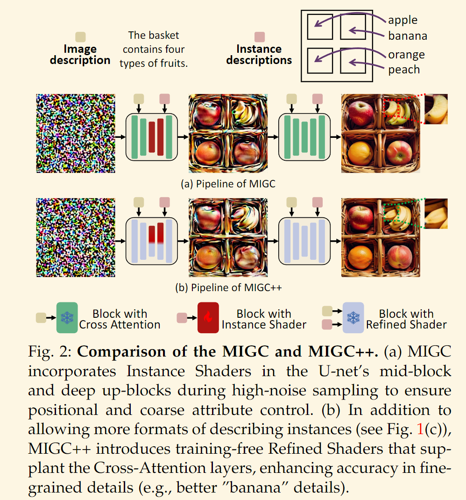

核心架构设计差异： MIGC采用较为基础的架构，主要在U-net的中间块和深层上采样块中使用Instance Shader来控制位置和粗略属性。相比之下，MIGC++引入了更复杂的架构，不仅保留了Instance Shader，还引入了免训练的Refined Shader来替代原有的Cross-Attention层，从而实现更精细的细节控制。

处理流程的区别： 从图中的处理流程可以看出，MIGC主要通过绿色表示的Cross-Attention块和红色表示的Instance Shader进行处理。而MIGC++增加了蓝色表示的Refined Shader模块，形成了一个更完整的处理链条，使得生成过程更加精细和可控。

**主要创新：**

属性泄露防止机制： 论文设计了Instance Shader(实例着色器)作为核心组件，包含三个关键模块：**Enhance Attention**(增强注意力)负责单实例的精确着色，防止属性混淆；**Layout Attention**(布局注意力)创建模板来桥接各个实例，保持空间关系；**Shading Aggregation Controller**(着色聚合控制器)动态整合各个实例结果和模板，生成连贯的最终图像。

**Enhance Attention**:

**Layout Attention:**

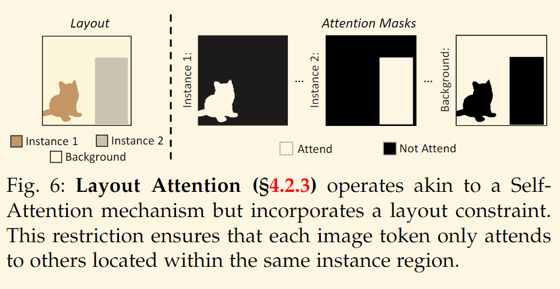

**Shading Aggregation Controller:**

示例如下：

<h2 id="25.DynamicControl的框架和原理">25.DynamicControl的框架和原理</h2>

论文链接：[arxiv.org/pdf/2412.03255](https://arxiv.org/pdf/2412.03255)

模型pipeline：

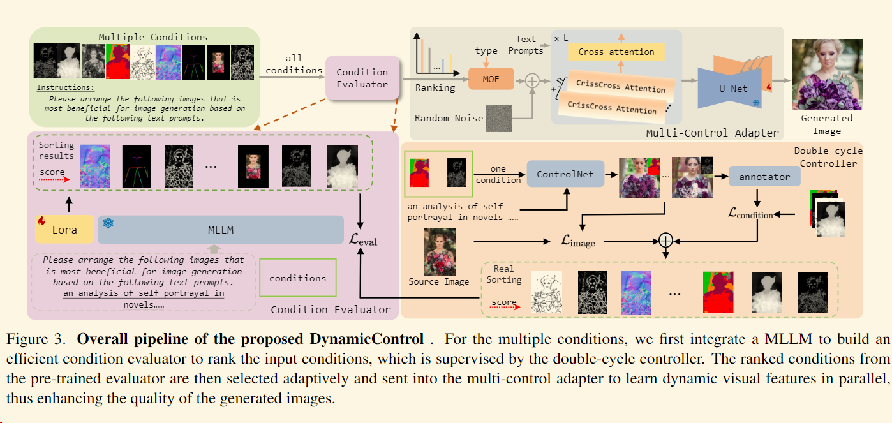

Double-Cycle Controller:

这个组件通过两个一致性评分来评估条件的重要性：条件一致性和图像一致性。它首先使用预训练的条件生成模型为每个条件生成图像，然后通过判别模型提取对应的反向条件，评估输入条件与提取条件的相似度，以及生成图像与源图像的像素级相似度。这种双重检查机制确保了条件选择的准确性。

Condition Evaluator:

这是一个基于多模态大语言模型(如LLaVA)的评估系统，用于高效地对多个输入条件进行排序和评估。它通过扩展模型词汇表来处理不同类型的条件信息，并在双循环控制器的监督下学习如何最优地组合这些条件。其创新之处在于避免了生成中间图像的开销，同时不依赖源图像就能在推理阶段做出准确的条件选择。

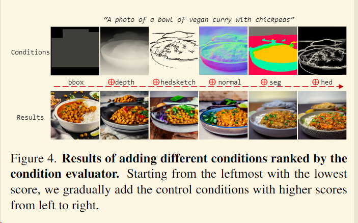

Multi-Control Adapter:

这是一个创新的并行处理架构，专门设计用来处理动态数量的控制条件。它采用混合专家系统(MoE)来并行提取不同视觉条件的特征，通过交叉注意力机制整合这些特征，最终调制ControlNet来实现更精确的图像生成控制。它的独特之处在于可以自适应地选择和组合不同数量和类型的条件，避免了固定条件数量的限制。

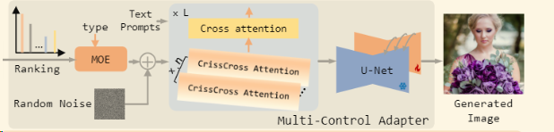

示例：

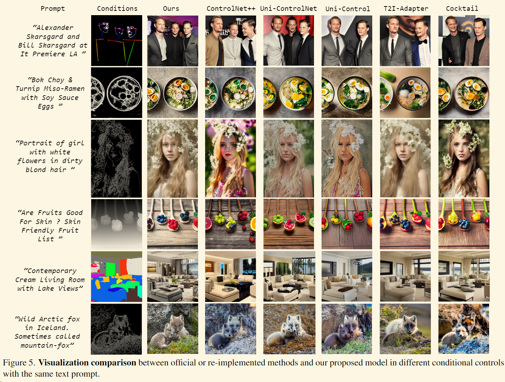

<h2 id="26.MaxFusion的框架和原理">26.MaxFusion的框架和原理</h2>

论文链接：[05506.pdf](https://www.ecva.net/papers/eccv_2024/papers_ECCV/papers/05506.pdf)

框架如下：

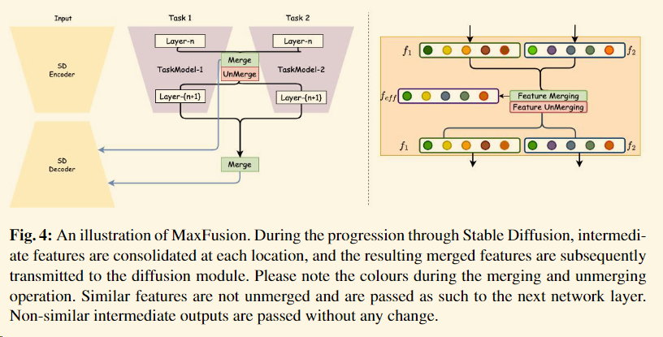

核心发现:

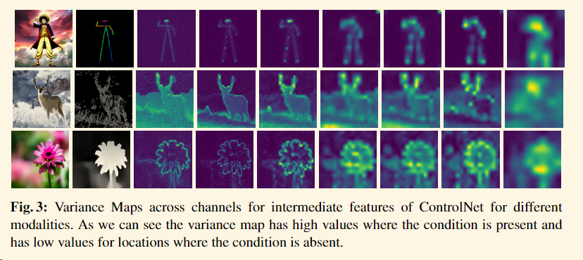

- 发现扩散模型中间特征图的方差图(variance maps)能够捕捉条件信息的强度
- 可以利用这个特性来融合不同模态的特征

**MaxFusion（最大融合）：** 

核心融合算法，基于特征相关性（correlation）做决策：当相关性高于阈值时进行加权平均，低于阈值时选择方差最大的特征，并引入相对标准差来确保不同模态间的公平性。

优势:

- 无需重训练,可即插即用
- 可以处理互补条件(同一物体的不同特征)和矛盾条件(不同物体的特征)
- 易于扩展到多个条件模态

示例：

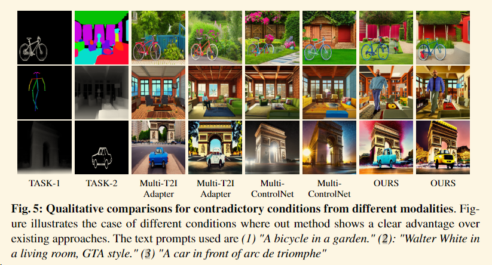

<h2 id="27.CreatiLayout的框架和原理">27.CreatiLayout的框架和原理</h2>

论文链接：[[2412.03859\] CreatiLayout: Siamese Multimodal Diffusion Transformer for Creative Layout-to-Image Generation](https://arxiv.org/abs/2412.03859)

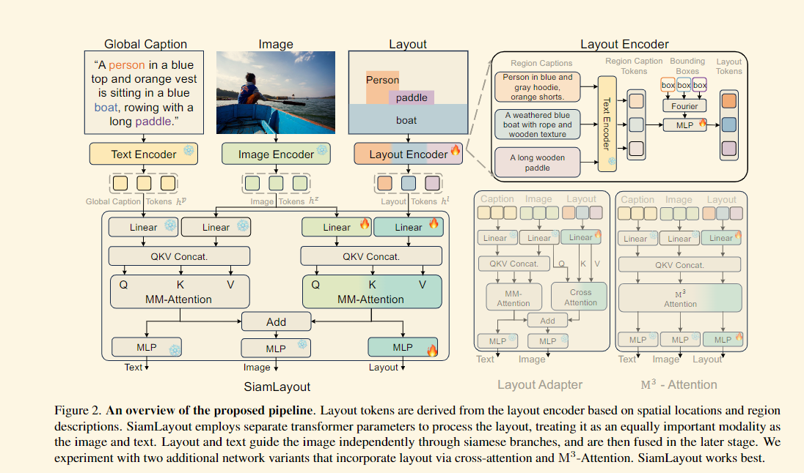

1. 整体架构

- 基于多模态扩散变换器(MM-DiT)设计
- 将布局作为与图像和文本同等重要的独立模态
- 采用孪生(Siamese)分支结构处理不同模态间的交互

2.主要创新点：SiamLayout架构 

这个架构通过两个关键设计解决了模态竞争问题：

a) 独立模态处理：

- 使用单独的transformer参数处理布局信息
- 使布局与图像和文本具有同等地位

b) 孪生分支结构：

- 将三模态交互解耦为两个平行分支:

  - 图像-文本分支
  - 图像-布局分支

- 后期再融合两个分支的输出

- 这种设计避免了模态间的直接竞争

- 作者还对比了其他两种架构变体：

  - Layout Adapter：通过cross-attention引入布局信息
  - M³-Attention：直接将三个模态放在一起做attention

  但实验表明SiamLayout的效果最好，主要原因是它避免了模态间的直接竞争，让每个模态都能充分发挥作用。

  示例：

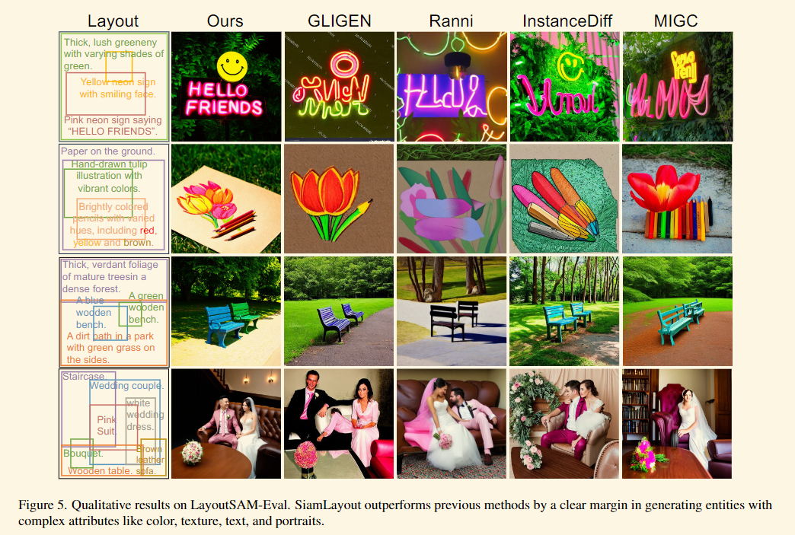

<h2 id="28.Ctrl-X的框架和原理">28.Ctrl-X的框架和原理</h2>

论文链接：[2406.07540](https://arxiv.org/pdf/2406.07540

Ctrl-X 是一个训练无关、指导无关的框架，通过操控预训练的 T2I 扩散模型的特征层，提供对生成图像结构（Structure）和外观（Appearance）的控制。

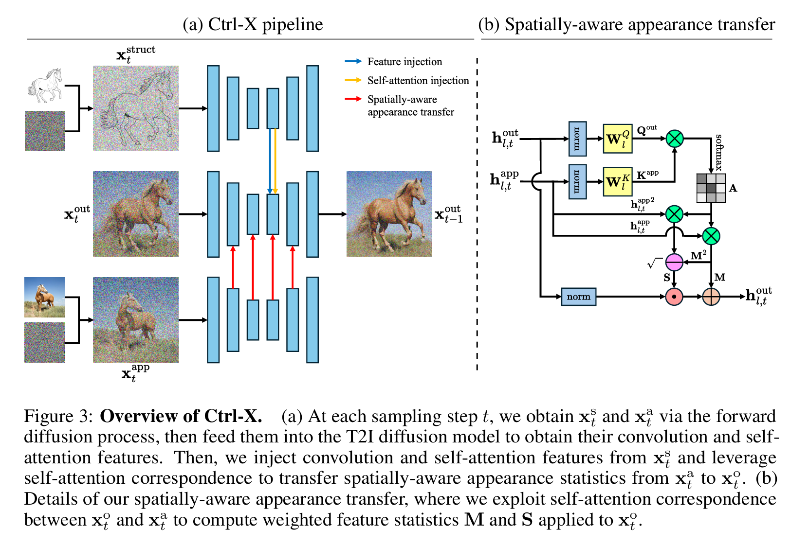

该框架 **Ctrl-X** 的核心流程可概括为以下几个关键步骤：

1. **结构与外观特征提取**：通过前向扩散过程分别对输入的结构图像 (x^s_t) 和外观图像 (x^a_t) 添加噪声后，将其输入到预训练的扩散模型中，提取卷积特征和自注意力特征。
2. **特征注入与迁移**：
   - **特征注入**：将结构图像的卷积特征和注意力特征注入到目标图像 (x^o_t) 的生成过程中，确保生成图像的结构与输入对齐。
   - **外观迁移**：利用输入外观图像和目标图像的自注意力对应关系，计算加权的均值 (M) 和标准差 (S)，用于对目标图像的特征进行归一化，实现空间感知的外观迁移。
3. **生成过程**：在每一步生成中，将上述注入的结构和外观特征结合，逐步生成符合目标结构与外观的图像。

**优势**：

- 无需额外训练，直接在预训练扩散模型上运行。
- 支持任意类型的结构和外观输入，具有高度的灵活性和高效性。

示例：

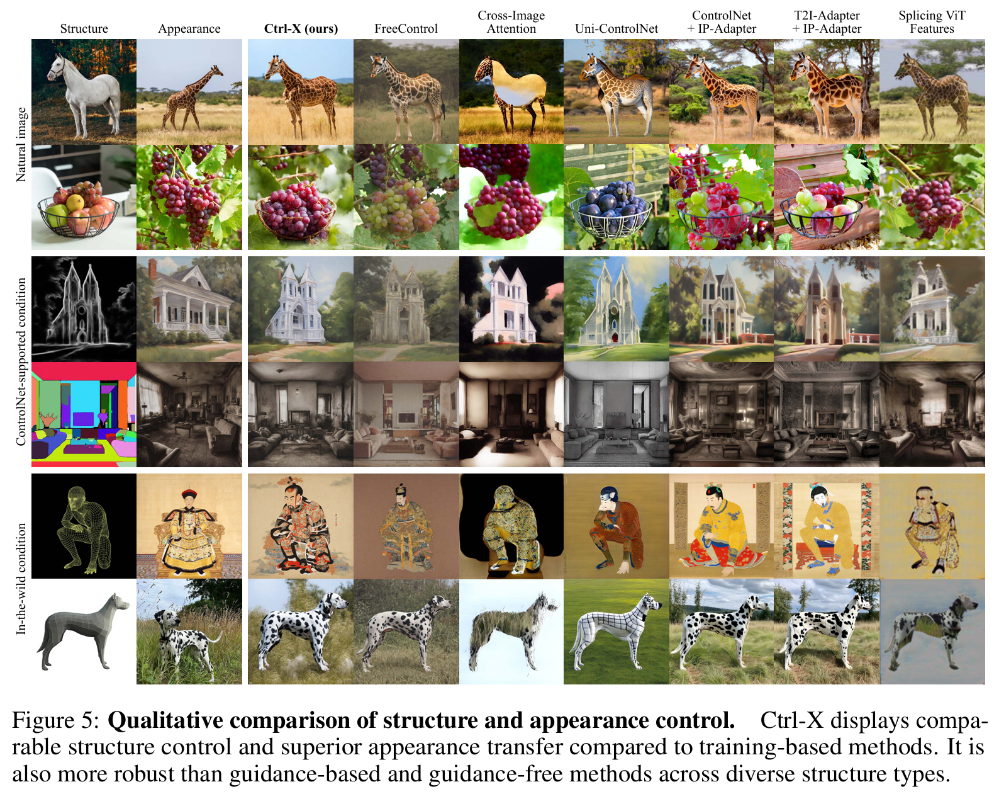

<h2 id="29.OMNIBOOTH的框架和原理">29.OMNIBOOTH的框架和原理</h2>

论文链接：[2410.04932](https://arxiv.org/pdf/2410.04932)

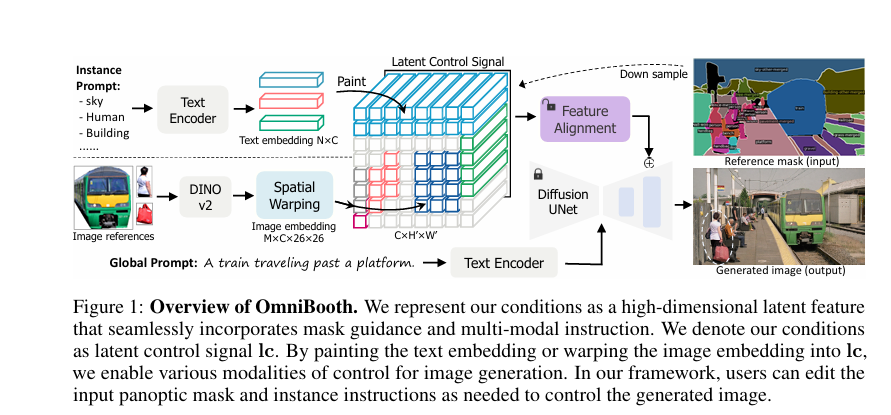

核心架构分为三部分：

1.双路输入处理：

- 文本路径：Instance Prompt → Text Encoder → 文本嵌入
- 图像路径：Image references → DINO v2 → Spatial Warping → 图像嵌入

2.潜在控制信号(Latent Control Signal)：

- 维度为C×H'×W'的特征空间
- 通过Paint操作融合文本嵌入
- 通过Spatial Warping融合图像特征
- 作为统一的控制信号输入到生成网络

3.生成网络：

- Feature Alignment进行特征对齐
- Diffusion UNet生成最终图像
- 同时接收Global Prompt作为全局引导

示例：

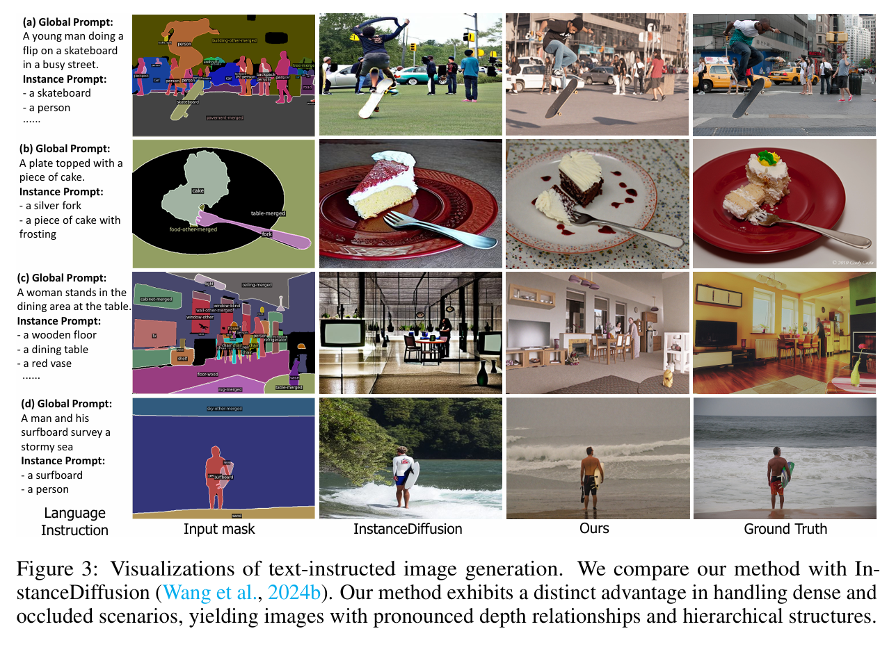

<h2 id="30.EasyPhoto的训练和推理流程是什么样的？">30.EasyPhoto的训练和推理流程是什么样的？</h2>

## EasyPhoto的训练流程

1. 人像得分排序：人像排序流程需要用到人脸特征向量、图像质量评分与人脸偏移角度。其中人脸特征向量用于选出最像本人的图片，用于LoRA的训练；图像质量评分用于判断图片的质量，选出质量最低的一些进行超分，提升图片质量；人脸偏移角度用于选出最正的人像，这个最正的人像会在推理阶段中作为参考人像进行使用，进行人脸融合。
2. Top-k个人像选取：选出第一步中得分最高的top-k个人像用于LoRA模型的训练。
3. 显著性分割：将背景进行去除，然后通过人脸检测模型选择出人脸周围的区域。
4. 图像修复：使用图像修复算法进行图像修复，并且超分，并使用美肤模型，最终获得高质量的训练图像。
5. LoRA模型训练：使用处理好的数据进行LoRA模型的训练。
6. LoRA模型融合：在训练过程中，会保存很多中间结果，选择几个效果最好的模型，进行模型融合，获得最终的LoRA模型。

 

## EasyPhoto的推理流程

### 初步重建

1. 人脸融合：使用人脸融合算法，给定一张模板图和一张最佳质量的用户图，人脸融合算法能够将用户图中的人脸融合到模板人脸图像中，生成一张与目标人脸相似，且具有模版图整体外貌特征的新图像。
2. 人脸裁剪与仿射变换：将训练过程中生成的最佳人脸图片进行裁剪和仿射变换，利用五个人脸关键点，将其贴到模板图像上，获得一个Replaced Image，这个图像会在下一步中提供openpose信息。
3. Stable Diffusion + LoRA重绘和ControlNet控制：使用Canny控制（防止人像崩坏）、颜色控制（使生成的颜色符合模板）以及Replaced Image的Openpose+Face pose控制（使得眼睛与轮廓更像本人），开始使用Stable Diffusion + LoRA进行重绘，用脸部的Mask让重绘区域限制在脸部。

### 边缘完善

1. 人脸再次融合：和初步重建阶段一样，我们再做一次人脸融合以提升人脸的相似程度。
2. Stable Diffusion + LoRA重绘和ControlNet控制：使用tile控制（防止颜色过于失真）和canny控制（防止人像崩坏），开始第二次重绘，主要对边缘（非人像区域）进行完善。

### 后处理

后处理主要是提升生成图像的美感与清晰度。

1. 人像美肤：使用人像美肤模型，进一步提升写真图片的质感。
2. 超分辨率重建：对写真图片进行超分辨率重建，获取高清大图。

 

<h2 id="31.FaceChain的训练和推理流程是什么样的？">31.FaceChain的训练和推理流程是什么样的？</h2>

FaceChain是一个功能上近似“秒鸭相机”的技术，我们只需要输入几张人脸图像，FaceChain技术会帮我们合成各种服装、各种场景下的AI数字分身照片。下面Rocky就给大家梳理一下FaceChain的训练和推理流程：

## 训练阶段

1. 输入包含清晰人脸区域的图像。
2. 使用基于朝向判断的图像旋转模型+基于人脸检测和关键点模型的人脸精细化旋转方法来处理人脸图像，获取包含正向人脸的图像。
3. 使用人体解析模型+人像美肤模型，获得高质量的人脸训练图像。
4. 使用人脸属性模型和文本标注模型，再使用标签后处理方法，生成训练图像的精细化标签。
5. 使用上述图像和标签数据微调Stable Diffusion模型得到人脸LoRA模型。
7. 输出人脸LoRA模型。

## 推理阶段

1. 输入训练阶段的训练图像。
2. 设置用于生成个人写真的Prompt提示词。
3. 将人脸LoRA模型和风格LoRA模型的权重融合到Stable Diffusion模型中。
4. 使用Stable Diffusion模型的文生图功能，基于设置的输入提示词初步生成AI个人写真图像。
5. 使用人脸融合模型进一步改善上述写真图像的人脸细节，其中用于融合的模板人脸通过人脸质量评估模型在训练图像中挑选。
6. 使用人脸识别模型计算生成的写真图像与模板人脸的相似度，以此对写真图像进行排序，并输出排名靠前的个人写真图像作为最终输出结果。

32.ReCo的框架和原理

<h2 id="32.ReCo的框架和原理">32.ReCo的框架和原理</h2>

论文链接：[[2211.15518\] ReCo: Region-Controlled Text-to-Image Generation](https://arxiv.org/abs/2211.15518)

#### 框架架构

1. ReCo基于Stable Diffusion（SD）模型改进，主要包含以下模块：
   1. **双模态输入序列**：在传统文本令牌（Text Tokens）的基础上，引入**位置令牌（Position Tokens）**。这些位置标记通过坐标编码（如边界框的归一化坐标）生成，允许用户在输入查询中混合自由文本描述和区域位置信息。
      - 示例输入格式：
        `"a kitchen with <576> <553> <791> <979> stainless steel appliances and a counter"`
   2. **扩展的文本编码器**：沿用CLIP ViT-L/14文本编码器，但额外支持位置标记的嵌入，联合文本和位置标记生成条件嵌入向量。
   3. **扩散模型架构**：保持SD的U-Net架构，但通过微调使其能结合位置信息进行去噪。位置标记与文本标记通过交叉注意力机制共同指导图像生成。

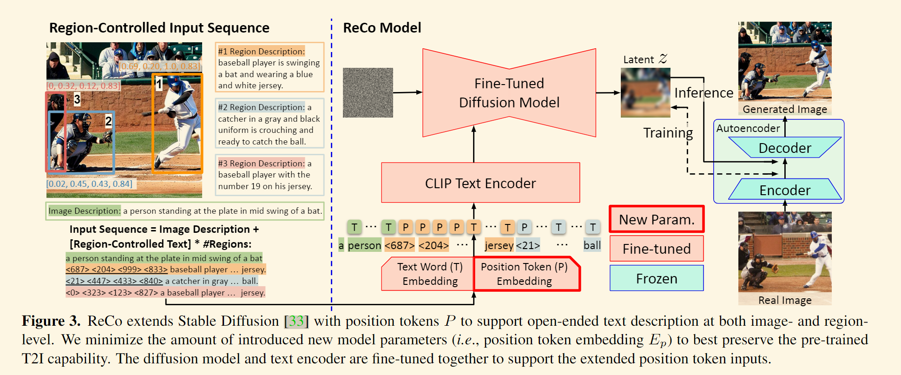

#### **关键原理**

1. **区域指令的可控性**：
    ReCo通过位置标记直接指定目标区域（如物体位置或范围），降低生成过程中的空间歧义。例如，用户可精确描述"沙发在画面左侧（区域<0, 0, 0.5, 1>）"，从而避免模型对布局的随机猜测。
2. **训练数据构建**：
   - 使用自动标注工具（如GIT captioning模型）为图像中的裁剪区域生成区域描述。
   - 对位置标记进行随机化裁剪与坐标编码，增强模型对多样化区域指令的泛化能力。
3. **保留预训练能力**：
    ReCo仅微调SD模型的文本编码器和交叉注意力层，最大限度保留原有生成质量，并适应区域控制任务。

下面是示例：

<h2 id="33.BeYourself（Bounded-Attention-for-Multi-Subject-Text-to-Image-Generation）的框架和原理33.BeYourself（Bounded-Attention-for-Multi-Subject-Text-to-Image-Generation）的框架和原理33.BeYourself（Bounded-Attention-for-Multi-Subject-Text-to-Image-Generation">33.Be Yourself（Bounded Attention for Multi-Subject Text-to-Image Generation）的框架和原理</h2>

论文链接：[[2403.16990\] Be Yourself: Bounded Attention for Multi-Subject Text-to-Image Generation](https://arxiv.org/abs/2403.16990)

#### **核心问题**

现有文本到图像扩散模型（如Stable Diffusion）在生成包含多个语义相似主体的复杂场景时，常出现**语义泄漏**（Semantic Leakage）问题，导致主体特征混淆（例如，“3只姜黄色小猫和2只灰色小猫”可能混合颜色或形态）。

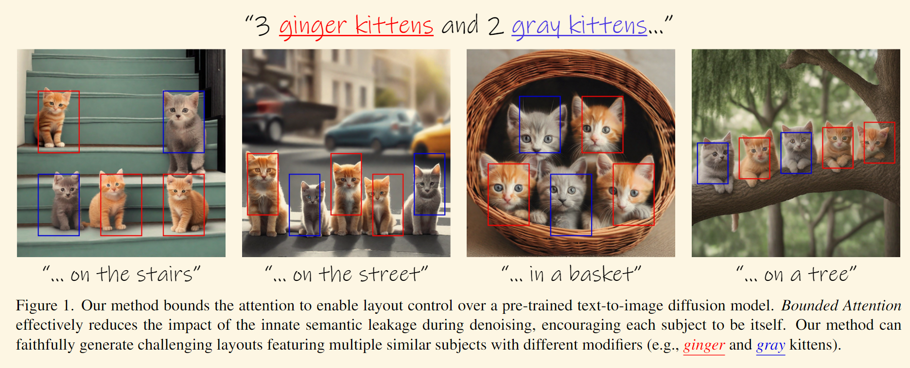

论文提出**Bounded Attention**（有界注意力）机制，通过约束交叉注意力和自注意力层的相互作用，分割不同主体的生成流程，主要包含以下模块：

1. **Bounded Guidance**
   - **功能**：在去噪过程的早期阶段，通过用户提供的布局（如bounding boxes）生成粗略的语义分割掩模，引导各主体区域的空间定位。
   - **原理**：限制不同区域的注意力交互，抑制跨区域语义干扰（如避免“姜黄色小猫”的特征泄漏到“灰色小猫”区域）。
2. **Bounded Denoising**
   - **功能**：在去噪后期，细化各主体的细节特征，确保其与文本描述严格对齐（如颜色、纹理等）。
   - **原理**：通过修改自注意力层中的查询（Query）和键（Key）的相似性，强制不同主体的特征独立性。
3. **Mask Refinement**
   - **功能**：动态优化分割掩模，提升主体边界清晰度。
   - **原理**：结合去噪过程中的隐变量特征，迭代更新掩模，避免区域重叠导致的特征混合。

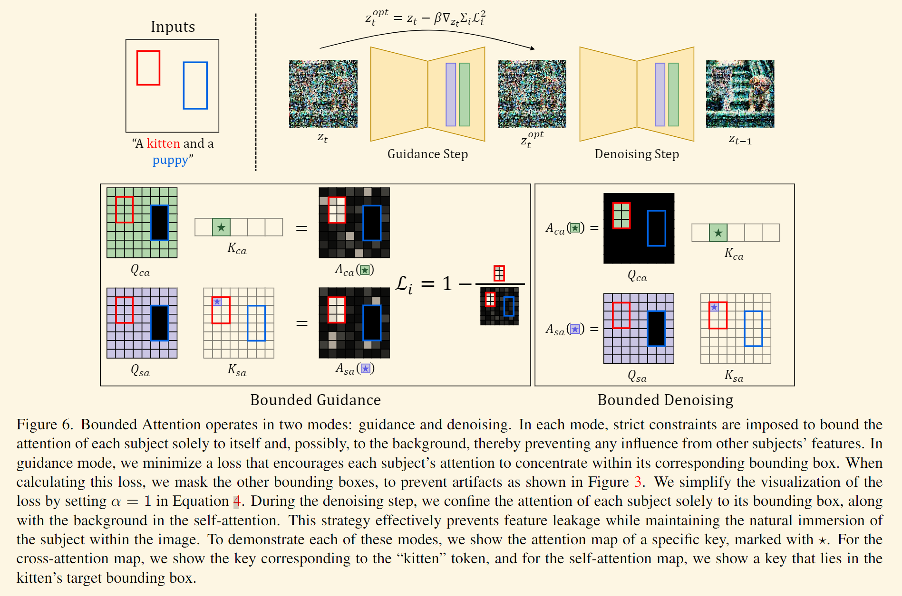

下面是示例：

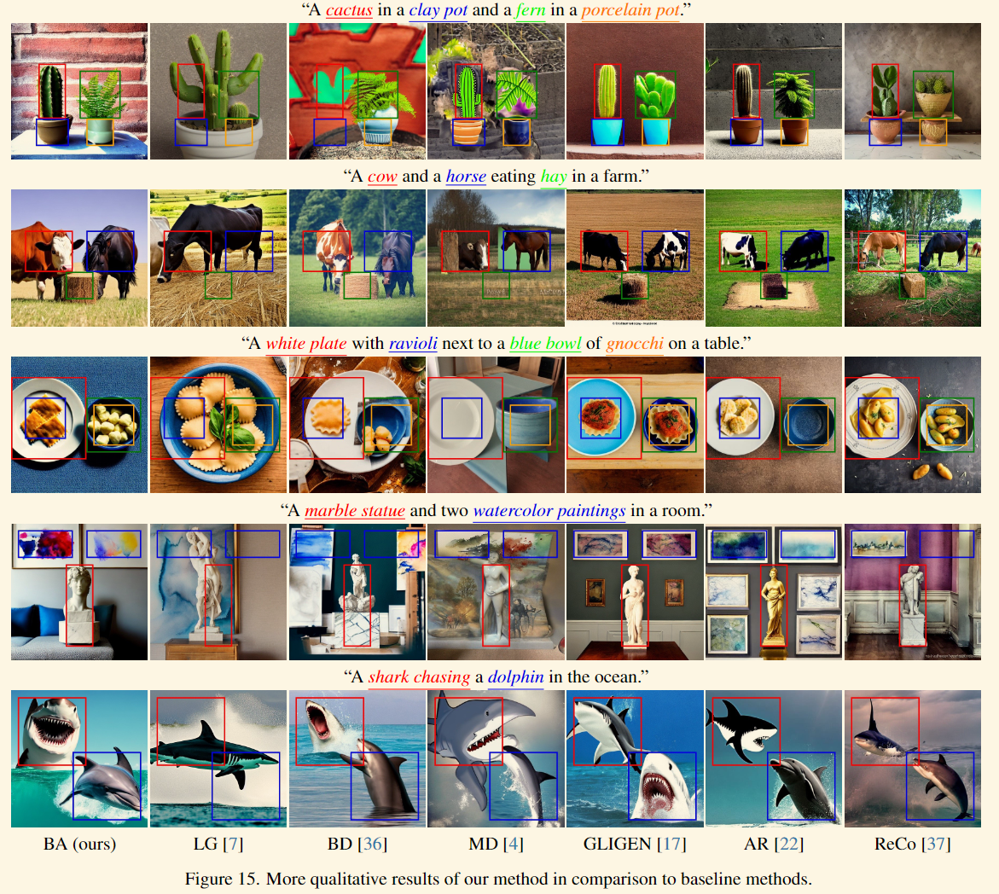

<h2 id="34.IFadapter的框架和原理">34.IFadapter的框架和原理</h2>

### 研究背景

- 当前的文本到图像（Text-to-Image, T2I）扩散模型在生成单个实例的高质量图像方面表现出色，但在处理多个实例的精确位置和特征生成时存在局限性。
- 布局到图像（Layout-to-Image, L2I）任务通过引入边界框作为空间控制信号解决了位置问题，但在生成精确的实例特征方面仍有不足。

论文提出了一个更具挑战性的任务：**实例特征生成（Instance Feature Generation, IFG）**，旨在同时确保生成内容的位置准确性和特征忠实度。

### IFAdapter框架

IFAdapter（实例特征适配器）是为解决IFG任务而设计的模型，主要包含两个核心组件：

#### 1. 外观令牌（Appearance Tokens）

- 解决问题：现有模型主要使用单一上下文化令牌（EoT令牌）来指导实例特征生成，无法捕捉高频细节特征
- 原理：引入可学习的外观查询，从实例描述中提取特定特征信息，形成外观令牌，与EoT令牌一起工作
- 优势：能够更精确地控制实例特征的生成，特别是复杂的纹理、混合颜色等细节

#### 2. 实例语义图（Instance Semantic Map）

- 解决问题：现有序列到2D定位条件无法提供足够强的空间先验
- 原理：构建2D语义图将实例特征与指定空间位置关联起来，提供增强的空间引导
- 特点：在多个实例重叠的区域，采用门控语义融合机制解决特征混淆问题
- 实现：仅在扩散模型的部分交叉注意力层中集成语义图，实现松散耦合

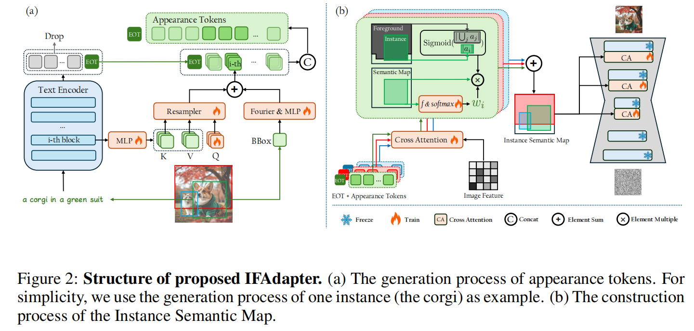

效果如下：

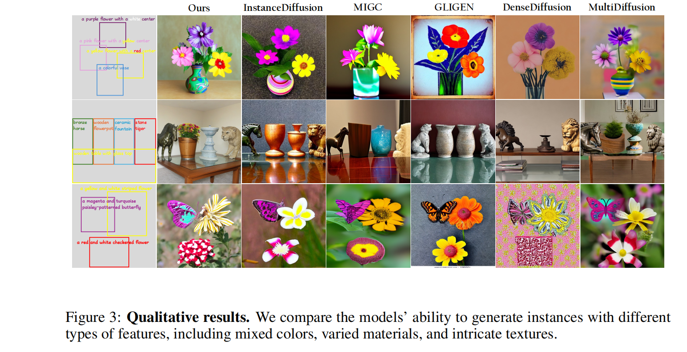

IFAdapter的即插即用设计使其能够无缝赋能各种社区模型，应用于图形设计和艺术设计等需要局部高级细节的场景。

这项研究为解决文本到图像生成中的精细控制问题提供了一种有效的方法，在保持位置准确性的同时提高了特征表现力，推动了可控图像生成技术的发展。

<h2 id="35.LAW-Diffusion的框架和原理">35.LAW-Diffusion的框架和原理</h2>

LAW-Diffusion是一种语义可控的布局感知扩散模型，其核心思想是解析对象之间的空间依赖关系，生成具有协调一致对象关系的复杂场景图像。该框架主要包含以下组件：

### 1. 空间依赖关系解析器（Spatial Dependency Parser）

不同于之前仅探索类别感知关系的方法，LAW-Diffusion引入了空间依赖关系解析器，用于编码对象之间的位置感知语义连贯性：

- **对象区域图（Object Region Maps）**：为每个对象实例化区域语义表示，将类别嵌入填充到其边界框指定的区域
- 位置感知跨对象注意力（Location-aware Cross-object Attention）：
  - 将对象区域图分割成区域片段
  - 对相同位置的区域片段执行多头注意力操作
  - 使用可学习的聚合令牌捕获位置感知的组合语义
  - 重新组合聚合片段得到布局嵌入（Layout Embedding）

这种方式同时捕获了类别感知和位置感知的依赖关系，确保在生成图像的局部片段时，能够准确指定对象在特定位置的可能重叠情况。

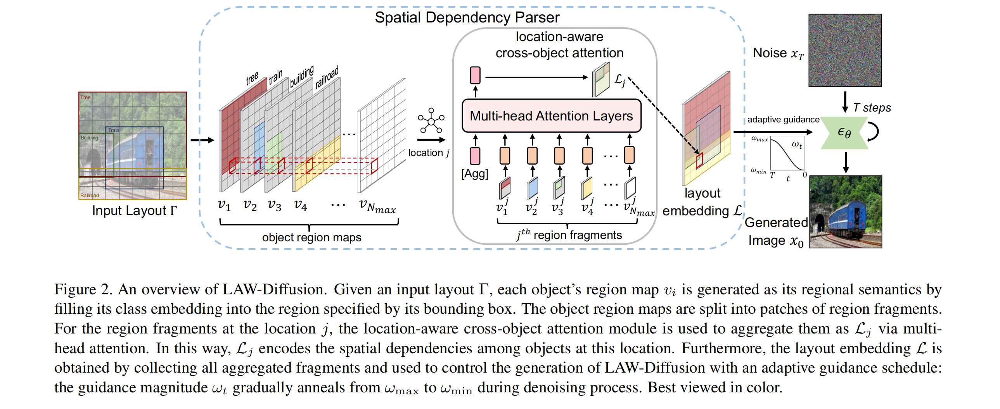

### 2. 自适应引导调度（Adaptive Guidance Schedule）

为了平衡区域语义对齐与对象纹理保真度之间的权衡，LAW-Diffusion提出了自适应引导调度策略：

- 在采样阶段使用余弦形式的引导幅度衰减函数
- 从初始较大的引导比例逐渐衰减到较小值
- 早期阶段强调语义控制，后期阶段注重纹理细节

这种策略类似于人类绘图时先构思整体语义，再细化细节的直觉过程。

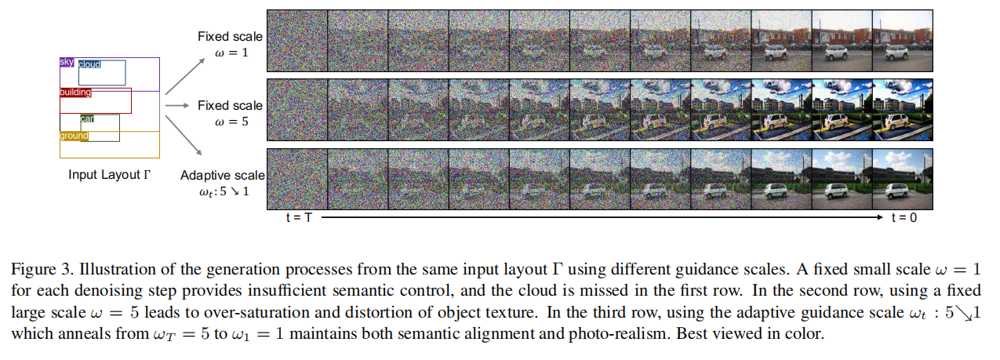

### 3. 布局感知潜在嫁接（Layout-aware Latent Grafting）

LAW-Diffusion还支持实例级别的重构能力，包括添加/移除/重新设计生成场景中的实例：

- 从已生成图像的扩散潜在表示中，提取边界框外的区域
- 在相同噪声级别下，将该区域嫁接到由新布局引导的目标潜在表示上
- 通过交替重组局部区域语义和去噪这些嫁接的潜在表示，实现实例重构

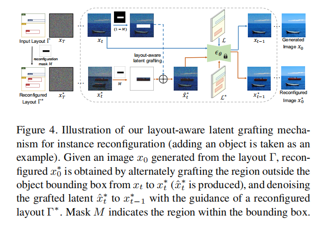

示例如下：

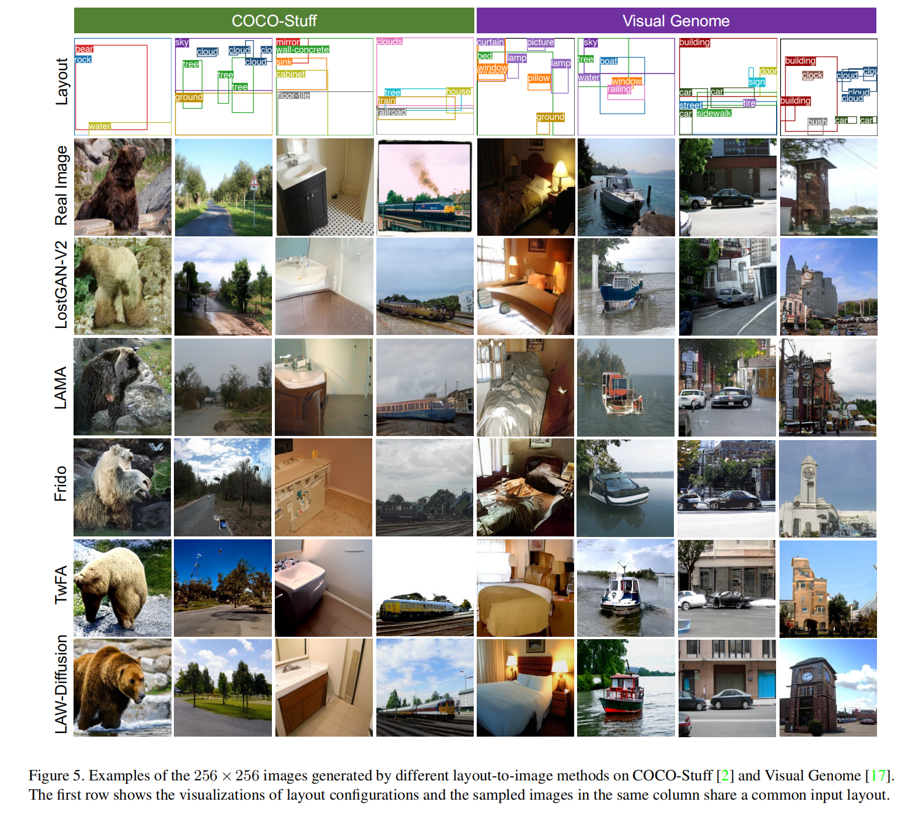

LAW-Diffusion通过引入空间依赖关系解析、自适应引导调度和布局感知潜在嫁接等创新技术，显著提升了布局到图像生成的效果，特别是在保持复杂场景中对象之间合理和协调的关系方面。该方法为控制复杂场景生成提供了新的思路，具有重要的理论和应用价值。

<h2 id="36.Check,Locate,Rectify（A-Training-Free-Layout-Calibration-System-for-Text-to-Image-Generation）的框架和原理">36.Check, Locate, Rectify（A Training-Free Layout Calibration System for Text-to-Image Generation）的框架和原理</h2>

本研究论文介绍了SimM，这是一种新颖的系统，旨在解决文本到图像生成中的一个常见挑战：准确实现文本提示中的空间布局指令。

### SimM方法

SimM采用“检查-定位-纠正”流程，无需额外训练即可干预生成过程：

1. **检查**：
   - 使用预定义词汇确定提示是否包含布局要求
   - 使用依赖解析和启发式规则生成对象的目标布局
   - 评估当前生成是否可能偏离这些要求
2. **定位**：
   - 在早期去噪步骤中识别对象当前被放置的位置
   - 使用注意力图找到每个对象的激活区域
3. **纠正**：
   - 将激活从错误位置转移到目标位置
   - 增强目标区域的激活并抑制其他区域的激活
   - 防止不同对象之间的激活重叠

示例如下：

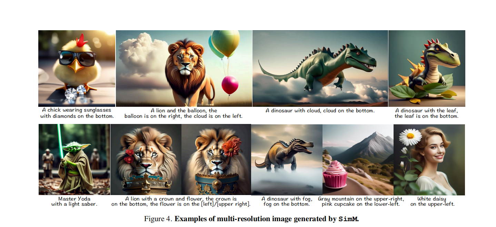

### 关键创新

1. **无需训练的实现**：可与现有的预训练模型配合使用，无需微调
2. **处理两种空间关系**:
   - 相对关系（例如，“一只狗在猫的左边”）
   - 最高级关系（例如，“左边的一朵花”）
3. **高效的布局生成**：自动从文本中推导出目标布局，无需手动输入
4. **最小的计算开销**：直接修改注意力图，无需复杂的优化

该技术可以改善创意应用中的用户控制，允许在文本到图像生成中更精确地指定布局，而无需具备布局技术知识或额外训练。
