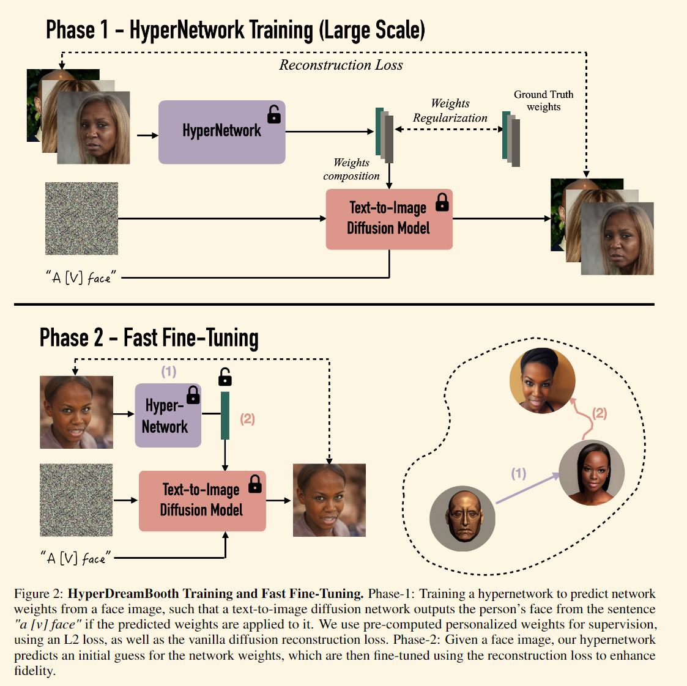
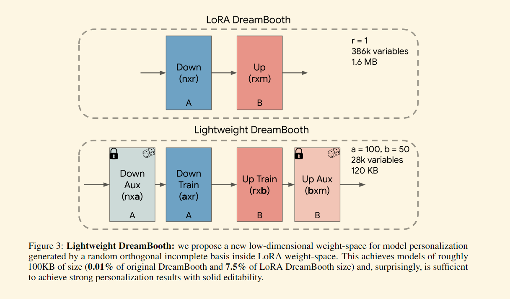
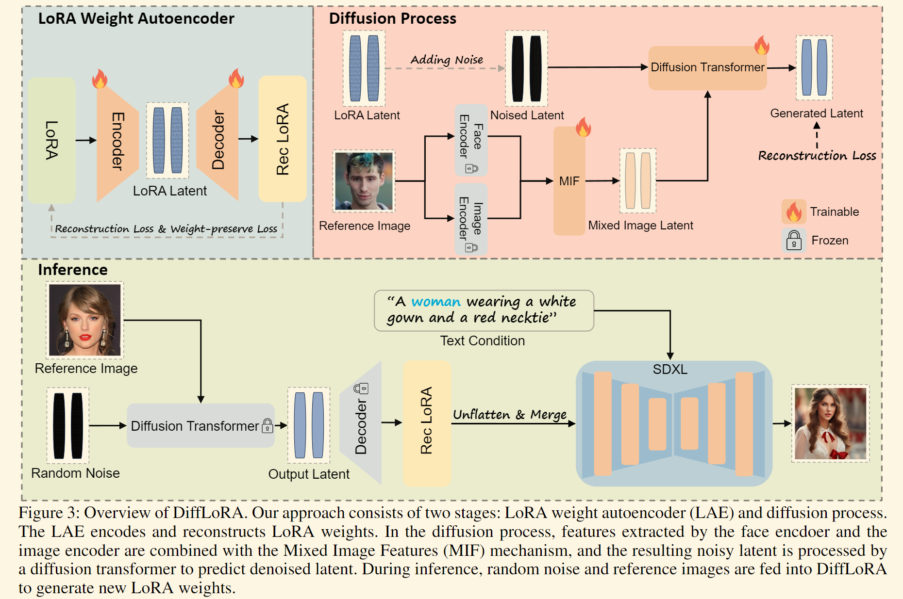
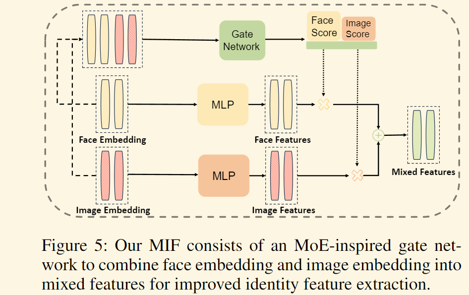
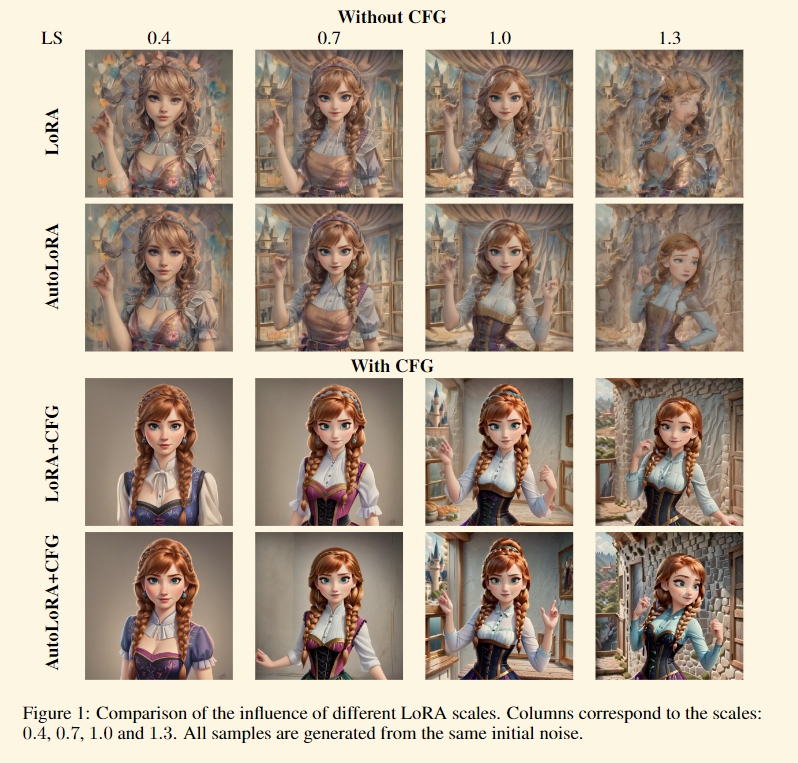

# 目录

- [1.使用lora微调Stable Diffusion模型](#1.使用lora微调Stable_Diffusion模型)
- [2.用于图像生成的多lora组合](#2.用于图像生成的多lora组合)
- [3.Hypernetwork是什么？](#3.Hypernetwork是什么？)
- [4.HyperDreamBooth是什么？](#4.HyperDreamBooth是什么？)
- [5.DiffLoRA是什么？](#5.DiffLoRA是什么？)
- [6.AutoLoRA是什么？](#6.AutoLoRA是什么？)

<h2 id="1.使用lora微调Stable Diffusion模型">1.使用lora微调Stable_Diffusion模型</h2>

[LoRA: Low-Rank Adaptation of Large Language Models](https://arxiv.org/abs/2106.09685) 是微软研究员引入的一项新技术，主要用于处理大模型微调的问题。目前超过数十亿以上参数的具有强能力的大模型 (例如 GPT-3) 通常在为了适应其下游任务的微调中会呈现出巨大开销。LoRA 建议冻结预训练模型的权重并在每个 Transformer 块中注入可训练层 (*秩-分解矩阵*)。因为不需要为大多数模型权重计算梯度，所以大大减少了需要训练参数的数量并且降低了 GPU 的内存要求。研究人员发现，通过聚焦大模型的 Transformer 注意力块，使用 LoRA 进行的微调质量与全模型微调相当，同时速度更快且需要更少的计算。

LoRA也是一种微调 Stable Diffusion 模型的技术，其可用于对关键的图像/提示交叉注意力层进行微调。其效果与全模型微调相当，但速度更快且所需计算量更小。

训练代码可参考以下链接：

[全世界 LoRA 训练脚本，联合起来! (huggingface.co)](https://huggingface.co/blog/zh/sdxl_lora_advanced_script)

<h2 id="2.用于图像生成的多lora组合">2.用于图像生成的多lora组合</h2>

论文链接:https://arxiv.org/abs/2402.16843.pdf

### **LoRA Merge**:

- 这种方法通过线性组合多个LoRAs来合成一个统一的LoRA，进而整合到文本到图像的模型中。
- 主要优点是能够统一多个元素，但它的一个缺点是没有考虑到生成过程中与扩散模型的交互，可能导致像汉堡包和手指这样的元素在图像中变形。

### **LoRA Switch (LoRA-S)**:

- LoRA Switch旨在每个去噪步骤中激活单个LoRA，通过在解码过程中定时激活各个LoRA，引入了一种动态适应机制。
- 图中用独特的颜色表示每个LoRA，每个步骤中只激活一个LoRA。
- 这种方法允许在扩散模型的不同解码步骤中精确控制元素的影响，提高了生成图像的灵活性和控制精度。

### **LoRA Composite (LoRA-C)**:

- LoRA Composite探索在每个时间步骤中整合所有LoRA，而不是合并权重矩阵。
- 它通过汇总每个LoRA在每一步的无条件和条件评分估计来实现，从而在图像生成过程中提供平衡的指导。
- 这种方法有助于保持所有不同LoRA代表的元素的连贯整合，增强了图像的整体一致性和质量。

<h2 id="3.Hypernetwork是什么？">3.Hypernetwork是什么？</h2>

Hypernetwork，也被称为“超网络”，是一种附加到 Stable Diffusion 模型的小型神经网络。它的主要作用是通过插入到噪声预测器 UNet 的交叉注意力模块中，从而改变模型的风格表现。

#### 2. Hypernetwork 与其他模型的区别

##### Hypernetwork VS Checkpoint（大模型）

- **Checkpoint 模型**：包含生成图像的所有必要信息，文件体积较大，通常在 2 GB 到 7 GB 之间。
- **Hypernetwork**：文件体积较小，通常低于 200 MB，但不能单独使用，必须与 Checkpoint 模型配合才能生成图像。

##### Hypernetwork VS LoRA 模型

- **相似性**：Hypernetwork 和 LoRA 模型在文件大小上相似，通常都在 200 MB 以下，比 Checkpoint 模型要小。
- **效果对比**：LoRA 模型一般能产生更好的效果，因此逐渐取代了 Hypernetwork 的位置。

##### Hypernetwork VS Embeddings

- **Embeddings**：通过“文本反转”（Textual Inversion）技术生成，它定义新的关键词来实现特定风格，不会改变模型结构。Embeddings 创建新的嵌入在文本编码器中。
- **Hypernetwork**：通过将一个小型网络插入到噪声预测器的交叉注意力模块中来改变模型的输出风格。

#### 3. Hypernetwork 的现状

- **使用减少**：由于 LoRA 和 Embeddings 的出现，Hypernetwork 的使用频率逐渐下降。在一些社区资源库中，Hypernetwork 文件数量非常有限。
- **效果有限**：虽然 Hypernetwork 的文件体积较大，但其效果往往不如更小的 Embeddings 文件，而这些效果可以通过其他方式实现，例如使用 Embeddings 或 LoRA 模型。

<h2 id="4.HyperDreamBooth是什么？">4.HyperDreamBooth是什么？</h2>

论文链接：https://arxiv.org/pdf/2307.06949

这篇论文提出了一种名为 HyperDreamBooth 的新方法,用于快速和轻量级的主体驱动个性化文本到图像扩散模型。主要内容包括:

1. **轻量级 DreamBooth (LiDB)**: 提出了一种新的低维权重空间,用于模型个性化,可以将个性化模型的大小减少到原始 DreamBooth 的 0.01%。

2. **超网络架构**: 设计了一个超网络,可以从单个图像生成 LiDB 参数。超网络由 ViT 编码器和 Transformer 解码器组成。

3. **rank-relaxed 快速微调**: 提出了一种技术,可以在几秒钟内显著提高输出主体的保真度。

4. 性能

   : 与 DreamBooth 和 Textual Inversion 等方法相比,HyperDreamBooth 在速度和质量上都有显著提升:

   - 速度提高了 25 倍
   - 模型大小减少了 10000 倍
   - 在主体保真度和风格多样性方面取得了相当或更好的结果

整体框架如下图：

Lightweight DreamBooth结构如下：

HyperDreamBooth 实现了快速、轻量级和高质量的文本到图像模型个性化,为创意应用开辟了新的可能性。

<h2 id="5.DiffLoRA是什么？">5.DiffLoRA是什么？</h2>

论文链接：https://arxiv.org/pdf/2408.06740

DiffLoRA框架包含以下关键组成部分:

1. LoRA权重自动编码器(LAE):将LoRA权重压缩到隐空间并进行重构。LAE采用1D卷积层作为主要压缩层,并引入权重保留损失来提高重构精度。
2. 混合图像特征(MIF):利用MoE启发的门控网络,将人脸特征和图像特征相结合,更好地提取身份信息。
3. 去噪过程:使用DiT架构和条件集成,通过迭代去噪生成LoRA隐表示。
4. LoRA权重数据集构建:自动化流程生成多身份LoRA权重数据集,用于训练DiffLoRA。

整体框架如下图：

MIF结构图:

这是一种利用扩散模型作为超网络来根据参考图像预测个性化低秩适应（LoRA）权重的方法。通过将这些 LoRA 权重集成到文本到图像模型中，DiffLoRA 无需进一步训练即可在推理过程中实现个性化。这是第一个利用扩散模型来生成面向身份的 LoRA 权重的模型。

<h2 id="6.AutoLoRA是什么？">6.AutoLoRA是什么？(2024年10月发布)</h2>

论文链接：[2410.03941](https://arxiv.org/pdf/2410.03941)

### 1. **方法概述**

AutoLoRA 是一种提升扩散模型生成图像多样性和质量的新方法，主要结合了 **LoRA (低秩适应)** 和 **AutoGuidance** 技术：

- **LoRA**：通过对大模型进行低秩微调，使其能够适应特定风格或领域，但通常由于训练数据有限，模型容易过拟合，导致生成图像的多样性不足。
- **AutoGuidance**：通过让训练不足的模型版本指导完全训练的模型，从而在生成过程中引入更多多样性。

AutoLoRA 结合了这两者的思路，通过让基础模型与 LoRA 微调模型共同指导图像生成，从而实现了在一致性和多样性之间的平衡。

### 2. **核心机制**

- **指导机制**：AutoLoRA 通过在每一步生成中，将基础模型 `ϵ(xt, y)` 和 LoRA 微调后的模型 `ϵLoRA(xt, y)` 的输出结合起来，控制生成的多样性：
  $$
  \epsilon_{\mathrm{\Lambda utoLoRA}}^{\gamma}(\mathbf{x}_t,y)=\epsilon(\mathbf{x}_t,y)+\gamma\cdot(\epsilon_{\mathrm{LoR\Lambda}}(\mathbf{x}_t,y)-\epsilon(\mathbf{x}_t,y)),
  $$
  其中 `γ` 是调节参数，决定了生成图像中基础模型多样性和 LoRA 模型适应性之间的平衡。

- **无分类器指导 (CFG)**：AutoLoRA 为基础模型和 LoRA 微调模型分别应用 CFG，进一步提升生成过程中的控制力和多样性。

### 3. **关键思想**

- **多样性与一致性的平衡**：通过结合基础和微调模型的输出，AutoLoRA 能在保留特定风格一致性的同时引入更多多样性。这解决了 LoRA 模型因小数据集训练导致的过拟合问题。
- **双重指导**：单独为基础和微调模型应用 CFG，有助于增加生成图像的细节和质量，同时维持对输入提示的良好响应。
- **探索与利用**：AutoLoRA 的设计类似于在探索（生成多样性）和利用（保持风格一致性）之间寻找最优点，使得生成的图像既符合预期风格，又能展示丰富的细节变化。

---
