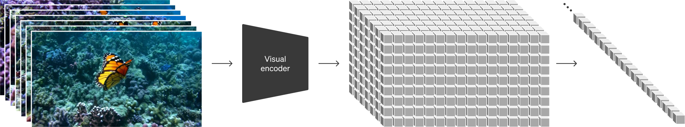
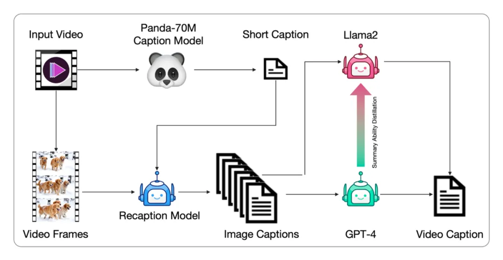
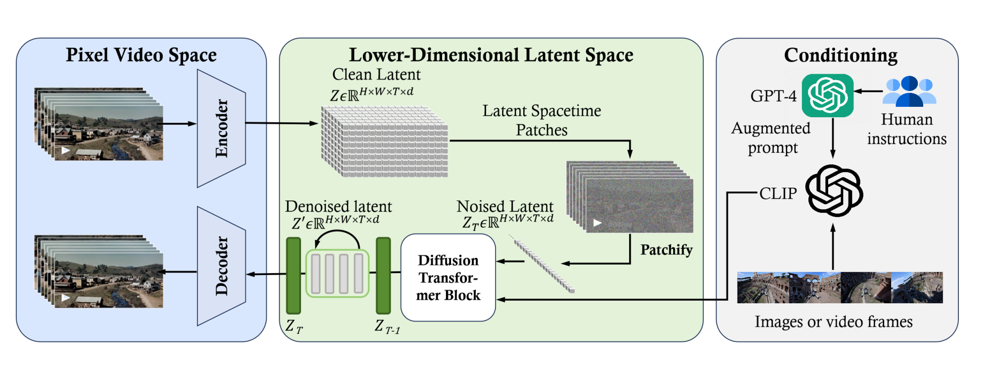
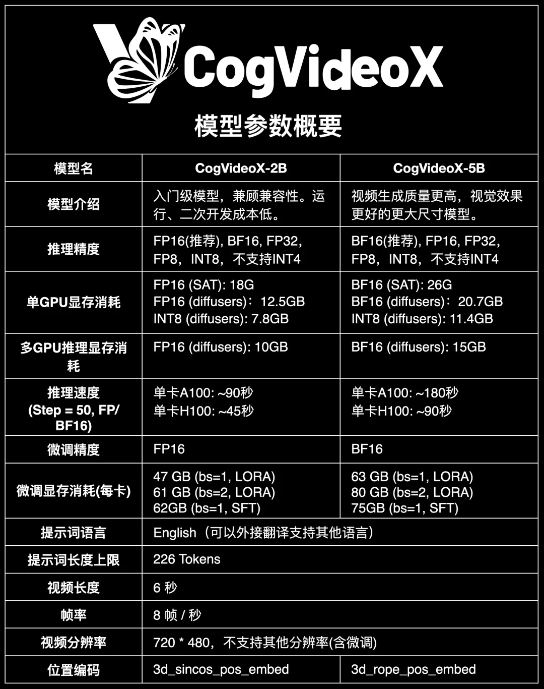
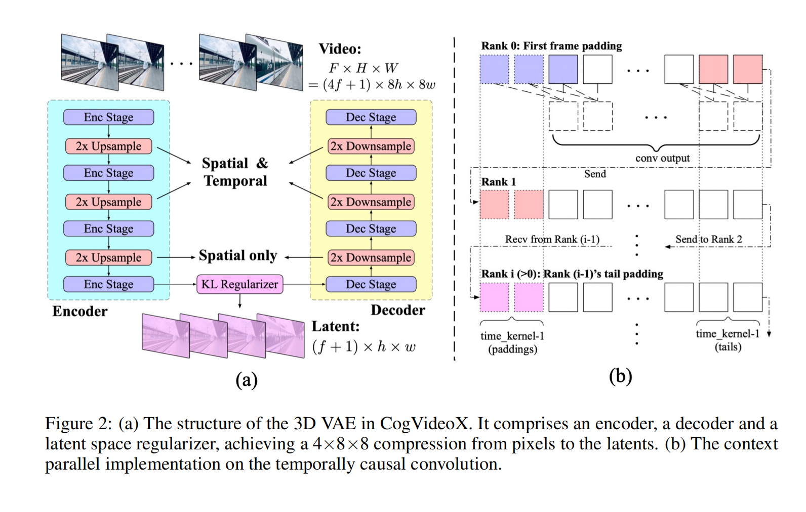
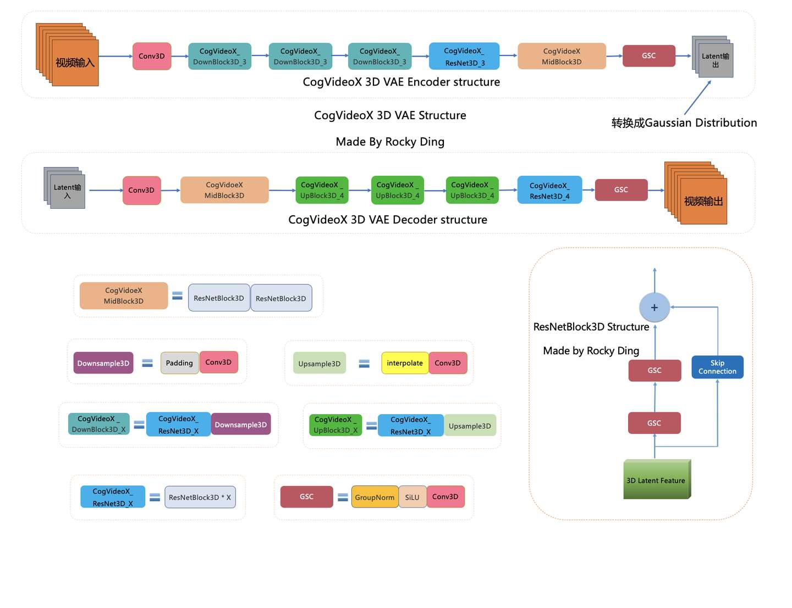

# 目录

- [1.目前主流的AI视频技术框架有哪几种？](#1.目前主流的AI视频技术框架有哪几种？)
- [2.目前主流的AI视频大模型有哪些？](#2.目前主流的AI视频大模型有哪些？)
- [3.Sora有哪些创新点？](#3.Sora有哪些创新点？)
- [4.SVD（Stable-Video-Diffusion）有哪些创新点？](#4.SVD（Stable-Video-Diffusion）有哪些创新点？)
- [5.AIGC时代的主流AI视频生成流程有哪些？](#5.AIGC时代的主流AI视频生成流程有哪些？)
- [6.Sora在训练时是如何处理输入数据的？](#6.Sora在训练时是如何处理输入数据的？)
- [7.Sora是如何对视频数据进行标注的？](#7.Sora是如何对视频数据进行标注的？)
- [8.为什么说Sora等AI视频大模型具备世界模拟器（world simulator）的潜质？](#8.为什么说Sora等AI视频大模型具备世界模拟器（world-simulator）的潜质？)
- [9.AI视频领域的数据工程是什么样的？](#9.AI视频领域的数据工程是什么样的？)
- [10.Sora模型的整体架构是什么样的？](#10.Sora模型的整体架构是什么样的？)
- [11.CogVideoX模型的整体架构是什么样的？](#11.CogVideoX模型的整体架构是什么样的？)
- [12.AI视频经典的工作流有哪些？](#12.AI视频经典的工作流有哪些？)
- [13.CogVideoX-5B和CogVideoX-2B有哪些异同？](#13.CogVideoX-5B和CogVideoX-2B有哪些异同？)
- [14.介绍一下CogVideoX系列模型的VAE结构](#14.介绍一下CogVideoX系列模型的VAE结构)

<h2 id="1.目前主流的AI视频技术框架有哪几种？">1.目前主流的AI视频技术框架有哪几种？</h2>

Rocky梳理总结了AIGC时代到目前为止主流的AI视频技术框架，市面上的所有AI视频产品基本上都是基于以下这些框架：
1. 文本生成视频：输入文本，先生成图片或者直接生成视频。主要流程包括工作流前处理+扩散模型+运动模块+条件控制+工作流后处理。
2. 图像生成视频：输入图像，先生成前后帧图像，然后使用插帧与语义扩展持续生成前后序列帧图像，最后生成完整视频。主要流程包括工作流前处理+扩散模型+运动模块+条件控制+工作流后处理。
3. 视频生成视频：输入视频，提取关键帧，对关键帧进行转绘，然后再进行插帧，从而生成新的视频。主要流程包括工作流前处理+扩散模型+运动模块+条件控制+工作流后处理。

<h2 id="2.目前主流的AI视频大模型有哪些？">2.目前主流的AI视频大模型有哪些？</h2>

Rocky为大家梳理总结了AIGC时代到目前为主的主流AI视频大模型，如下所示：

1. Stable Video Diffusion（SVD）系列
2. Sora
3. 可灵AI
4. LUMA
5. Gen系列
6. Stable Diffusion系列 + Animatediff

<h2 id="3.Sora有哪些创新点？">3.Sora有哪些创新点？</h2>

OpenAI对Sora的定位不只是视频生成工具，而是希望在此基础上开发出能够让计算机理解真实世界的算法与技术——“作为世界模拟器的视频生成模型”。在这个宏大愿景下最具潜力的技术基底之一便是生成式模型 (generative model)。

下面是Sora的一些创新点：
1. 海量的数据：在Sora的技术报告中，关于数据量级是一句话都没有提。这就说明，Sora使用了海量的高质量视频数据用作训练，Rocky相信未来全互联网的视频数据都会被Sora用作训练，同时在视频数据领域的数据生成、数据增强将会有非常大的机会。
2. 灵活编码：在Sora中，借鉴了大语言模型的构建方式，使用video compression network（convolutional VAEs）将视频数据tokenizer化，获得visual patches，使得任何长度和内容的视频都能编码成AI视频模型可以直接处理（输入/输出）的embeddings。首先video compression network将输入视频的时间和空间两个维度同时进行压缩，编码成一个和视频大小成正比的3D visual patch矩阵，然后再将其展开成1D array of patches Embeddings，送入到后续的DiT model中。这样可以带来两个好处，分别是让Sora能够生成不同分辨率的视频分和生成的视频的边框更加合理。
3. DiT模型架构：Sora使用了DiT（Diffusion Transformer）作为核心架构，这让Transformer在AI领域的大一统更进一步。
4. 精细化数据标注：和DALL-E 3一样，OpenAI用内部标注工具（可能是GPT4-4o等）给视频数据进行详尽的描述标注，从而提升Sora模型生成视频与输入prompt的一致性、生成视频的质量和视频中正确显示文本的能力。Rocky认为数据工程是非常关键的一点，无论是传统深度学习时代还是AIGC时代，都是AI领域的杀手锏。
5. 让AI视频领域的Scaling Law成立：保证模型越大，数据越多，效果就越好。Sora也不例外。一句话概括Sora的贡献，便是：在足量的数据，优质的标注，灵活的编码下，scaling law 在 transformer + diffusion model 的架构上继续成立。

<h2 id="4.SVD（Stable-Video-Diffusion）有哪些创新点？">4.SVD（Stable-Video-Diffusion）有哪些创新点？</h2>

Rocky认为SVD（Stable Video Diffusion）模型非常有价值，其开源精神让我们动容，下面是SVD模型的主要创新点：
1. 基于Stable Diffusion 2.1模型架构
2. 海量数据集：StabilityAI使用了一个包含5.8亿个视频剪辑的巨大数据集，来训练SVD模型。为了筛选高质量数据，首先需要检测每个视频中的不同镜头和转场，并且评估每个镜头中的运动信息，然后为每个镜头自动生成描述文字和每个镜头的美学效果等。
3. 数据精细化处理：（1）级联切换检测：采用级联的切换检测方法识别视频中的场景转场。（2）运动信息提取:基于稠密光流估计每个视频片段的运动信息。（3）文本描述生成:为每个视频片段自动生成三种形式的文字描述。（4）质量评估:使用CLIP等方法评估每个片段的视觉质量、文本匹配度等。（5）过滤去噪:根据上述评估指标过滤掉质量较差的视频片段。经过层层筛选，最后保留了一个约1.5亿视频片段的超高质量数据集，为后续的SVD模型训练奠定重要基础。
4. 多阶段训练：SVD模型在模型训练方面也与传统方法不同，其采用了一个三层训练架构。第一阶段是进行图像预训练，初始化一个图像生成模型。第二阶段是在已经构建的大规模视频数据集上进行视频预训练，学习运动表征。第三阶段是在一个小规模的高质量视频数据集上进行微调。这种分阶段的训练策略可以让模型更好地生成高保真视频。

<h2 id="5.AIGC时代的主流AI视频生成流程有哪些？">5.AIGC时代的主流AI视频生成流程有哪些？</h2>

Rocky总结了如下图所示的AIGC时代主流AI视频生成流程，可以作为大家构建AI视频产品构架的基础底座：

<h2 id="6.Sora在训练时是如何处理输入数据的？">6.Sora在训练时是如何处理输入数据的？</h2>

**Sora在处理输入数据的过程中引入了大语言模型标配的Tokenizer思想。**

在文本对话领域，Tokenizer可使任何长度和内容的文本编码成大语言模型可以直接处理（输入/输出）的Text Embeddings特征。在AI视频领域则是将视频数据进行编码获得**visual patches**，下图展示了Sore将输入视频转换成visual patches的过程：

**其中先使用一个Visual Encoder模型将视频数据（空间和时间维度）压缩编码到Latent特征空间，获得一个3D visual patch array，接着将整个Latent特征分解成spacetime patches，最后再排列组合成为一个visual patches向量。**

为了能有一个高质量的视频数据压缩编码效果，OpenAI针对性训练了一个Video compression network作为Visual Encoder模型。同时也训练了一个Visual Decoder模型用于Sora的解码来获取生成的视频结果。

Sora通过对输入数据的压缩编码，**为AI视频的生成带来了很多帮助：**

1. **训练的数据分辨率获得了解放：** Sora能够训练任意的分辨率、时间长度和长宽比的视频/图像数据。
2. **灵活的生成分辨率：** Sora可以生成1920x1080像素（横屏）到1080x1920像素（竖屏）之间任意分辨率的视频。
3. **生成视频的边缘更加符合真实常理：** Sora尝试过固定分辨率进行训练，这种情况下就需要裁剪视频数据。这样数据的裁剪bias会被带入到模型中，导致Sora模型生成很多主要内容缺失的视频。

<h2 id="7.Sora是如何对视频数据进行标注的？">7.Sora是如何对视频数据进行标注的？</h2>

和AI绘画领域的DALL-E 3一样，**OpenAI使用内部的数据标注模型（大概率是GPT4-v等）给视频数据进行了详细的描述（Caption）**，从而提升了Sora模型生成的视频与输入Prompt的一致性，同时生成视频的质量与视频中文本的渲染能力也有一定的提升。

Rocky认为视频数据的精细化标注非常关键，是AI视频模型生成效果的关键一招，**因为视频生成的动态性非常高，是一个非常大的数据分布**。

与此同时，虽然在训练中使用详细的描述（Caption）作为数据标签能够增强AI视频模型的文本一致性能力，但是在用户使用时可能会出现bias，因为用户输入的描述一般都相对较短。**这里Sora和DALL-E 3一样，也使用GPT-4来对用户的输入描述进行扩充完善来解决这个问题，同时提高了用户的使用体验和视频生成的多样性**。

<h2 id="8.为什么说Sora等AI视频大模型具备世界模拟器（world-simulator）的潜质？">8.为什么说Sora等AI视频大模型具备世界模拟器（world simulator）的潜质？</h2>

Sora能够根据文本提示词生成逼真或富有创意的场景视频，展现出强大的模拟物理世界的潜力。

**OpenAI一直以来有一个宏大愿景：开发出能够让计算机理解我们物理世界的AI算法技术，目前最有可能的技术之一就是AIGC模型。**

也正因此，Sora的技术报告中对Sora的定位正是“作为世界模拟器的视频生成模型”。

当前世界的物理信息与数字信息都呈爆发式增长，如此庞大的信息量，**包括图像、视频、文本、语音、3D等多种模态**，**我们需要为AIGC时代之后即将到来的元宇宙初级阶段与AGI初级阶段构建一个AI模型基底**，来理解上述的多模态信息，能够有逻辑的分析表达这些信息。

因此Rocky也认为，AIGC模型是朝向这个目标迈进的最有希望的技术之一。正如理查德·费曼的一句名言：

> 我所无法创造的，我也不能理解。

**这句话的潜台词就是要真正理解一个事物，我们就需要去创造它。**

这正与AIGC时代的核心思想耦合，我们要训练一个AIGC模型，我们首先要构建海量的数据集库，然后配置充足算力去训练AIGC模型去创造生成无穷无尽的内容。

Sora等AI视频大模型是能够理解和模拟现实世界的模型基础，是AI技术向前迈进的重要一步，2024年也将成为AIGC时代早期的一个重要时间节点。

总的来说，**Rocky认同OpenAI乃至AI行业的这个愿景与观点，未来的元宇宙时代和AGI时代，以AI视频大模型为基座的多模态AI会给我们创造出无穷无尽的价值**。

<h2 id="9.AI视频领域的数据工程是什么样的？">9.AI视频领域的数据工程是什么样的？</h2>

**不管是传统深度学习时代，还是现在的AIGC时代，数据质量都是决定AI模型性能上限的关键一招**，在AI视频领域也不例外。

**所以在AI视频数据的处理优化上，不管投入多少都是有价值的，因为这是AI模型这个黑盒系统中反馈最为显著的优化方式。**

接下来，Rocky以经典的AI视频数据处理工作流为例，向大家详细介绍我们该如何制作出高质量的AI视频数据。

AI视频大模型的训练数据必须是经过筛选的高质量视频数据集，才能让AI视频达模型深刻学习真实世界内容。

首先，我们需要识别和排除低质量视频，如过度编辑、运动不连贯、质量低下、讲座式、文本主导和屏幕噪声等视频。我们可以通过基于video-llama训练的视频过滤器来筛选视频数据。同时基于光流计算和美学分数等指标，动态调整阈值来确保视频数据集的质量。

接着，我们需要对视频数据进行标注，由于视频数据通常没有对应的文本描述，同时现有的视频字幕较短，无法全面描述视频的内容。所以需要从生成图像字幕到生成视频字幕的完整工作流，并微调端到端的视频字幕模型以获得更详细的字幕标签。

整体的标注工作流程如下：
1. 将视频数据输入Panda-70M模型（Caption Model）先生成简短的字幕标注（Short Caption）。
2. 再将视频数据逐帧（Video Frames）和简短的字幕标注一起输入到CogView3模型（Recaption Model）中，生成密集详细的每一帧图像字幕标签。
3. 然后使用GPT-4模型对这些图像字幕标签进行总结，生成最终的视频数据标签。与此同时，基于GPT-4的总结标签微调训练Llama 2模型，来为GPT-4分担压力，加速视频数据集完整字幕标签的生成。

<h2 id="10.Sora模型的整体架构是什么样的？">10.Sora模型的整体架构是什么样的？</h2>

虽然Sora模型暂未开源，**但是Rocky相信2024年之后的主流AI视频大模型的架构都将在Sora模型架构的基础上进行扩展创新，是AI视频领域从业者必须要熟悉的“核心基础架构”** 。

**Sora模型是AI视频领域第一个基于DiT架构（diffusion transformer）的大模型，具有灵活的采样维度**，如上图所示。Sora主要包括三个部分：

1. **3D VAE模型**：3D VAE Encoder能在时间和空间维度上将输入的原始视频映射到Latent空间中。同时3D VAE Decoder能将扩散模型生成的视频Latent特征进行重建，获得像素级视频内容。
2. **基于DiT的扩散模型架构**：使用类似于ViT（视觉转换器）的处理方式将视频的Latent特征进行Patch化，并进行扩散过程输出去噪后的视频Latent特征。
3. **一个类似CLIP模型架构的条件接收机制**：接收经过大型语言模型（LLM）增强的用户输入Prompt和视觉信息的Prompt，用以引导扩散模型生成具有特定风格或者主题的视频内容。

<h2 id="11.CogVideoX模型的整体架构是什么样的？">11.CogVideoX模型的整体架构是什么样的？</h2>

**CogVideoX是基于DiT架构的AI视频大模型**，可以说DiT架构已经经过考验，成为AI视频领域的核心基底模型。

CogVideoX主要包括三个部分：

1. **3D Causal VAE模型**：3D Causal VAE Encoder能在时间和空间维度上将输入的原始视频映射到Latent空间中。同时3D Causal VAE Decoder能将扩散模型生成的视频Latent特征进行重建，获得像素级视频内容。
2. **DiT Expert模型**：将视频信息的Latent特征和文本信息的Embeddings特征进行Concat后，再Patch化，并进行扩散过程输出去噪后的视频Latent特征。
3. **Text Encoder模型**：Text Encoder模型将输入的文本Prompt编码成Text Embeddings，作为条件注入DiT Expert模型中。CogVideoX中选用T5-XXL作为Text Encoder，Text Encoder具备较强的文本信息提取能力。

目前CogVideoX-2B的输入Prompt提示词上限为226个tokens，可以生成的视频长度为6秒，帧率为8帧/秒，生成视频分辨率为720*480。

<h2 id="12.AI视频经典的工作流有哪些？">12.AI视频经典的工作流有哪些？</h2>

本问答Rocky将根据AI视频领域的发展阶段持续更新，将最有价值的AI视频工作流分享给大家：

1. 文生视频：可以使用Sora、可灵、CogVideoX + LoRA + ControlNet组成的工作流。
2. 图生视频：可以使用SVD + LoRA + ControlNet组成的工作流。
3. 视频编辑（视频生视频）：AnimateDiff + LoRA + ControlNet组成的工作流。

<h2 id="13.CogVideoX-5B和CogVideoX-2B有哪些异同？">13.CogVideoX-5B和CogVideoX-2B有哪些异同？</h2>

CogVideoX-5B模型是CogVideoX-2B模型的升级版本，CogVideoX-2B模型的特点是入门级模型，兼顾兼容性。运行、二次开发成本低。CogVideoX-5B模型的特点是视频生成质量更高，视觉效果更好，同时模型参数量也更大。

下面汇总了CogVideoX-5B模型和CogVideoX-2B模型的异同，供大家参考：

<h2 id="14.介绍一下CogVideoX系列模型的VAE结构">14.介绍一下CogVideoX系列模型的VAE结构</h2>

和Sora类似，CogVideoX模型在输入端也是设计了一个3D Causal VAE结构对输入视频数据进行Latent编码。

**视频数据比起图像数据，本质上是增加了时间信息，所以其数据量级和计算量级也远超图像数据，处理难度也更高**。3D VAE架构主要通过3D卷积同时压缩视频的空间和时间维度，从而实现了对视频数据更高的压缩编码效率和更好的重建质量与连续性。
下图展示了3D VAE的结构示意图，主要包括一个Encoder（编码器）、一个Decoder（解码器）以及一个Latent Space Regularizer（潜在空间正则器）：

1. **编码器**：用于将输入视频数据转换为Latent Feature。这一过程中，编码器会通过四个下采样阶段逐步减少视频数据的空间和时间分辨率。
2. **解码器**：将视频数据的Latent Feature转换成原始的像素级视频。解码器也包含四个对称的上采样阶段，用于恢复视频数据的空间和时间分辨率。
3. **潜在空间正则化器**：通过KL散度来约束高斯Latent空间，对编码器生成的Latent Feature进行正则化。这对于AI视频大模型的生成效果和稳定性至关重要。

值得注意的是，编码器的前两个下采样阶段和解码器的最后两个上采样阶段涉及空间和时间维度，而最后一个阶段仅应用于空间采样。**所以3D VAE在时间维度上实现了4倍的压缩，而在空间维度上实现了8×8倍的压缩。总的来说，实现了视频数据从像素级到Latent Feature的4×8×8压缩比率，整体压缩效率还是非常高的**。

同时在3D VAE中采用了时间因果卷积，这是一种特殊的卷积网络，该卷积将所有填充放置在时间卷积的开头，如上图(b)中所示。这确保了未来帧的信息不会影响现在或过去的预测。这对于时间序列数据的处理非常重要，因为它保留了因果关系，使得模型的预测不会违反时间顺序。

由于处理视频数据的所有帧会消耗大量的GPU显存，**CogVideoX为了适应大规模视频的处理，在时间维度上应用了上下文并行（context parallel）的策略进行3D卷积操作**，将时间维度上的计算分配到多个GPU设备上进行并行计算，如上图中(b)所示。每个GPU设备只需要处理一部分时间段的数据，并将必要的信息传递给下一个GPU设备，这减少了GPU设备间的通信开销，并有效地分配了计算资源。由于卷积的因果性。

下图是**Rocky梳理的CogVideoX 3D VAE的完整结构图**，大家可以感受一下其魅力，看着这个完整结构图学习CogVideoX 3D VAE模型部分，相信大家脑海中的思路也会更加清晰：

