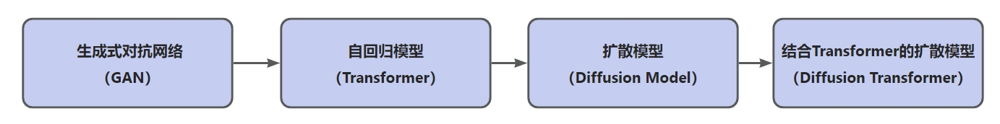
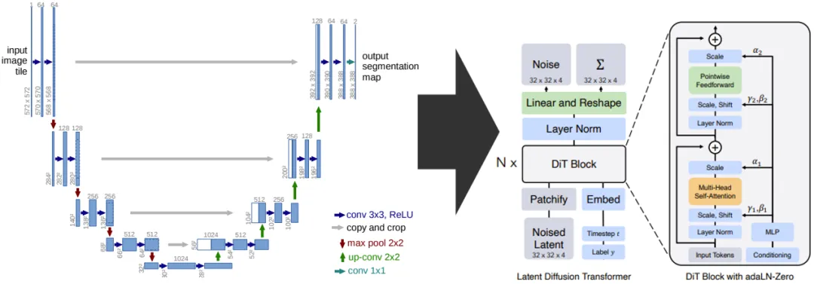
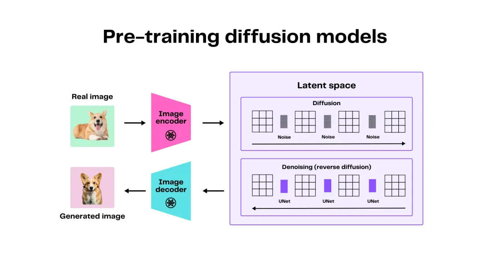
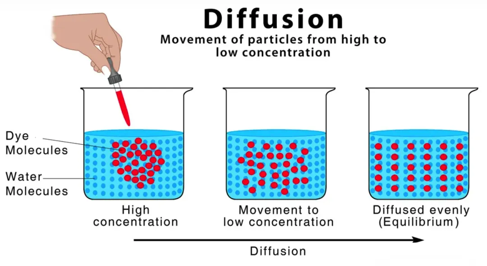
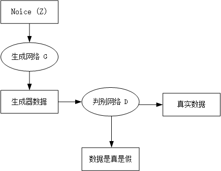
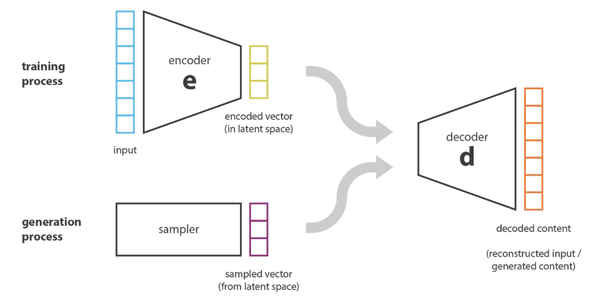
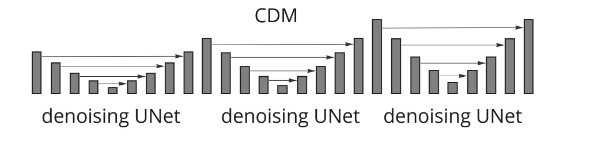
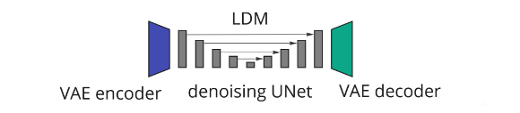

## 目录

- [1.说一下什么是AI视频，包括哪些关键技术?](#1.说一下什么是AI视频，包括哪些关键技术?)
- [2.请介绍下什么是视频生成，主要包括哪些方向？](#2.请介绍下什么是视频生成，主要包括哪些方向？)
- [3.请介绍下视频生成技术的演进路径？](#3.请介绍下视频生成技术的演进路径？)
- [4.请介绍下视频生成技术的应用场景？](#4.请介绍下视频生成技术的应用场景？)
- [5.什么DiT模型？](#5.什么DiT模型？)
- [6.简要解释下什么是扩散模型？](#6.简要解释下什么是扩散模型？)
- [7.简要介绍下GAN网络？并分析为什么视频生成模型很少采用GAN网络?](#7.简要介绍下GAN网络？并分析为什么视频生成模型很少采用GAN网络?)
- [8.请简要介绍下什么是VAE网络，及其在视频生成与分析中的应用？](#8.请简要介绍下什么是VAE网络，及其在视频生成与分析中的应用？)
- [9.生成对抗网络(GAN)和变分自动编码器(VAE)主要有哪些区别？](#9.生成对抗网络(GAN)和变分自动编码器(VAE)主要有哪些区别？)
- [10.生成对抗网络(GAN)和变分自动编码器(VAE)的训练过程有哪些挑战？](#10.生成对抗网络(GAN)和变分自动编码器(VAE)的训练过程有哪些挑战？)
- [11.视频扩散模型主要采用什么网络架构?](#11.视频扩散模型主要采用什么网络架构?)
- [12.视频扩散模型主要有哪些应用?](#12.视频扩散模型主要有哪些应用?)
- [13.请介绍下ViT，以及在视频扩散模型中的作用？](#13.请介绍下ViT，以及在视频扩散模型中的作用？)
- [14.ViT在图像分类中的具体应用案例有哪些？](#14.ViT在图像分类中的具体应用案例有哪些？)
- [15.请概括性总结下ViT模型的优点？](15.请概括性总结下ViT模型的优点？)
- [16.请介绍一下U-ViT的模型特点？](#16.请介绍一下U-ViT的模型特点？)
- [17.U-ViT模型在视频生成中的时间依赖性是如何处理的？](#17.U-ViT模型在视频生成中的时间依赖性是如何处理的？)
- [18.U-ViT模型在视频生成中的应用和性能？](#18.U-ViT模型在视频生成中的应用和性能？)
- [19.视频扩散模型与传统视频生成模型的区别是什么？](#19.视频扩散模型与传统视频生成模型的区别是什么？)
- [20.在视频生成领域，有哪些评估指标来验证算法模型的有效性？](#20.在视频生成领域，有哪些评估指标来验证算法模型的有效性？)
- [21.请简述视频扩散模型的去噪过程？](#21.请简述视频扩散模型的去噪过程？)
- [22.视频扩散模型在处理时间动态方面有哪些主要方法？](#22.视频扩散模型在处理时间动态方面有哪些主要方法？)
- [23.潜在扩散模型（LDM）在视频生成中的优势是什么？](#23.潜在扩散模型（LDM）在视频生成中的优势是什么？)
- [24.介绍一下AI视频领域的视频帧数、视频帧率、视频分辨率、视频码率的概念](#24.介绍一下AI视频领域的视频帧数、视频帧率、视频分辨率、视频码率的概念)

<h2 id="1.说一下什么是AI视频，包括哪些关键技术?">1.说一下什么是AI视频，包括哪些关键技术?</h2>

AI视频是指利用人工智能技术对视频进行智能处理和分析，包括但不限于视频理解、视频生成、视频编辑、视频推荐等。
关键技术包括计算机视觉、自然语言处理、深度学习、强化学习等。

- 计算机视觉：用于视频理解，如物体识别、场景识别、行为识别等。
- 自然语言处理：用于视频生成，如文本到视频生成、语音识别等。
- 深度学习：用于视频推荐，如用户行为分析、内容推荐等。
- 强化学习：用于视频编辑，如自动剪辑、自动配乐等。

<h2 id="2.请介绍下什么是视频生成，主要包括哪些方向？">2.请介绍下什么是视频生成，主要包括哪些方向？</h2>

**视频生成**是指通过对人工智能的训练，使其能够根据给定的文本、图像、视频等单模态或多模态数据，自动生成符合描述的、高保真的视频内容。
**从生成方式进行划分**，当前AI视频生成可分为**文生视频、图生视频、视频生视频**。

**主要包含以下技术内容：**
- **文生视频、图生视频**：（Runway、Pika labs、SD + Deforum、Stable Video Diffusion、MagicAnimate、DemoFusion等）
- **视频生视频**：又分逐帧生成（SD + Mov2Mov）、关键帧+补帧（SD + Ebsynth、Rerender A Video）、
动态捕捉（Deep motion、Move AI、Wonder Dynamics）、视频修复（Topaz Video AI）
- **AIAvatar+语音生成**：Synthesia、HeyGen AI、D-ID
- **长视频生短视频**：Opus Clip
- **脚本生成+视频匹配**：Invideo AI
- **剧情生成**：Showrunner AI

<h2 id="3.请介绍下视频生成技术的演进路径？">3.请介绍下视频生成技术的演进路径？</h2>

图片生成和视频生成的底层技术框架较为相似，主要包括GAN、自回归模型、扩散模型、DiT四大路径，其中扩散模型（Diffusion model）和DiT为当前主流生成模型。

<h2 id="4.请介绍下视频生成技术的应用场景？">4.请介绍下视频生成技术的应用场景？</h2>

视频生成技术广泛应用于广告、影视、教育、娱乐、医疗、金融等领域，如：
- **广告营销**：利用视频生成技术制作吸引人的广告视频，提高广告效果。
- **影视创作**：利用视频生成技术自动生成剧本、剪辑、配乐等，提高创作效率。
- **教育**：利用视频生成技术制作生动、有趣的课程视频，提高学生的学习兴趣和效果。
- **娱乐**：利用视频生成技术制作

<h2 id="5.什么DiT模型？">5.什么DiT模型？</h2>

**DiT**是一种结合了**Transformer架构的扩散模型**，用于图像和视频生成任务，能够高效地捕获数据中的依赖关系并生成高质量的结果。
其本质是一种新型的扩散模型，结合了去噪扩散概率模型(DDPM)和Transformer架构。

**其核心思想是**：
使用Transformer作为扩散模型的骨干网络，而不是传统的卷积神经网络(如U-Net)，以处理图像的潜在表示。

<h2 id="6.简要解释下什么是扩散模型？">6.简要解释下什么是扩散模型？</h2>

**Diffusion Models**是一种新型的、先进的生成模型，用于生成与训练数据相似的数据，可以生成各种高分辨率图像。

**扩散模型的核心思想：**

**Diffusion Models**是一种受到非平衡热力学启发的生成模型，**其核心思想是**通过模拟扩散过程来逐步添加噪声到数据中，
并随后学习反转这个过程以从噪声中构建出所需的数据样本。

<h2 id="7.简要介绍下GAN网络？并分析为什么视频生成模型很少采用GAN网络?">7.简要介绍下GAN网络？并分析为什么视频生成模型很少采用GAN网络?</h2>

**GAN**（Generative Adversarial Networks）是一种生成模型，由Ian Goodfellow等人于2014年提出，由两个神经网络组成：生成器（Generator）和判别器（Discriminator）。
生成器负责生成与训练数据相似的数据，而判别器则负责判断生成器生成的数据是否真实。

**GAN网络的核心思想：**

**GAN网络的核心思想是**通过对抗训练来学习生成器，使其生成的数据越来越接近真实数据。
生成器和判别器之间进行对抗训练，生成器不断优化生成数据，而判别器则不断优化判断生成数据的能力。

    

**GAN的特点：**

相较于其他模型，GAN的模型参数量小，较轻便，所以更加擅长对单个或多个对象类进行建模。但由于其训练过程的不稳定性，针对复杂数据集则极具挑战性，
稳定性较差、生成图像缺乏多样性。这也导致其终被自回归模型和扩散模型所替代。

**GAN网络在视频生成中的应用：**

在扩散模型前，GAN网络在视频生成中的应用比较广泛，如视频生成、视频修复、视频超分辨率等。
但是，由于视频数据量较大，计算复杂度较高，GAN网络在视频生成中的应用相对较少。

<h2 id="8.请简要介绍下什么是VAE网络，及其在视频生成与分析中的应用？">8.请简要介绍下什么是VAE网络，及其在视频生成与分析中的应用？</h2>

**VAE**（Variational Autoencoders）是一种结合了深度学习和概率图模型思想的生成式模型，
最早由Diederik P. Kingma和Max Welling在2013年的论文《Auto-Encoding Variational Bayes》中提出。

**VAE网络的核心思想：**

**VAE网络的核心思想是**通过最大化潜在空间中的概率分布来学习生成模型，从而生成与训练数据相似的数据。

**VAE由编码器和解码器两部分组成**，编码器将输入数据映射到潜在空间，解码器将潜在空间中的数据映射回原始数据空间。
- 编码器：将输入数据映射到潜在空间中的概率分布，通常是高斯分布。
- 解码器：将潜在空间中的样本重构为原始数据。

**在训练过程中，VAE试图最大化数据的边际对数似然**，同时最小化潜在表示与先验分布之间的KL散度（Kullback-Leibler divergence），
这样可以确保学习到的潜在表示更加连续和有意义。
通过VAE学习到的潜在表示可以用于数据压缩、降维、生成新样本等任务。

**VAE技术在视频生成与分析中的应用包括：**

- **视频内容分析**‌：VAE技术可以对音视频数据进行深入的分析，以获得更丰富的信息。
- **数据压缩‌**：VAE技术可以有效地对音视频数据进行压缩，以获得更小的文件大小。
- **生成质量**‌：VAE技术可以生成高质量音视频内容，使得视频内容更加丰富、生动。

<h2 id="9.生成对抗网络(GAN)和变分自动编码器(VAE)主要有哪些区别？">9.生成对抗网络(GAN)和变分自动编码器(VAE)主要有哪些区别？</h2>

**GAN和VAE理论和实践上有一些区别：**
GAN通过竞争的方式实现数据生成和分类，而VAE通过概率模型的学习实现数据生成和表示。

<h2 id="10.生成对抗网络(GAN)和变分自动编码器(VAE)的训练过程有哪些挑战？">10.生成对抗网络(GAN)和变分自动编码器(VAE)的训练过程有哪些挑战？</h2>

GAN和VAE在训练过程面临挑战，如训练稳定性、模型解释性、数据生成质量等。未来的研究应该关注如何解决这些挑战，以便更好地应用这两种模型。
比如提高训练稳定性、提高模型解释性、提高数据生成质量、拓展到多模态和多任务学习等。这些研究方向和挑战将有助于更广泛地应用GAN和VAE。

<h2 id="11.视频扩散模型主要采用什么网络架构?">11.视频扩散模型主要采用什么网络架构?</h2>

**视频扩散模型**主要采用的网络架构包括：

- **UNet：** 这是目前最流行的**去噪器架构**，最初用于医学图像分割，后来成功应用于图像、视频和音频生成任务。
UNet通过编码层将输入图像转换为越来越低的空间分辨率的潜在表示，然后通过解码层将这些表示上采样回原始大小。

- **Vision Transformer (ViT)：** 基于Transformer架构，结合了多头自注意力和交叉注意力机制，允许信息在整个图像或视频序列中共享。

- **Cascaded Diffusion Models (CDM)：** 由多个UNet模型组成，这些模型以递增的图像分辨率操作，通过上采样低分辨率输出图像来生成高保真度图像。

    

- **Latent Diffusion Models (LDM)：** 使用预训练的变分自编码器（VQ-VAE）将输入图像编码为具有较低空间分辨率和更多特征通道的潜在表示，
然后在VQ-VAE编码器的潜在空间中进行整个扩散和去噪过程。

    

这些架构在处理视频数据时，通常会结合时间和空间维度，以实现更好的性能和效率。

<h2 id="12.视频扩散模型主要有哪些应用?">12.视频扩散模型主要有哪些应用?</h2>

**视频扩散模型（Video Diffusion Models）** 在多个领域展示了其强大的应用潜力。根据文档内容，视频扩散模型的主要应用可以归纳为以下几类：

**1. 文本条件生成（Text-Conditioned Generation）** ：基于文本描述生成视频。

**2. 图像条件视频生成（Image-Conditioned Video Generation）** ：将现有的参考图像动画化，有时结合文本提示或其他指导信息。

**3. 视频完成（Video Completion）** ：给定一个现有的视频，在时间域上扩展它。

**4. 音频条件模型（Audio-Conditioned Models）**：接受音频片段作为输入，有时结合其他模态如文本或图像，合成与音源一致的视频。

**5. 视频编辑模型（Video Editing Models）**：使用现有视频作为基础，生成新视频。

**6. 智能决策（Intelligent Decision Making）**：用作真实世界的模拟器，基于代理的当前状态或高级文本描述的任务。

**7. 视频恢复（Video Restoration）**：恢复旧视频片段，包括去噪、色彩化或扩展纵横比等任务。

**8. 合成训练数据（Synthetic Training Data）**：生成合成数据以增强现有的训练数据集，用于下游任务如视频分类或字幕生成。
这些应用展示了视频扩散模型在内容生成、编辑、恢复和智能决策等多个领域的广泛潜力。

<h2 id="13.请介绍下ViT，以及在视频扩散模型中的作用？">13.请介绍下ViT，以及在视频扩散模型中的作用？</h2>

**Vision Transformer（ViT）** 是一种基于Transformer架构的深度学习模型，最初由Google的研究团队提出，
旨在将Transformer模型从自然语言处理（NLP）领域扩展到计算机视觉（CV）任务中，尤其是图像分类任务。

**ViT的核心思想是**将图像分割成固定大小的小块（patches），然后将这些小块视为序列中的单词或token，
输入到Transformer模型中进行处理。这种方法允许模型捕捉图像中的全局依赖关系，从而在多个视觉任务中取得了显著的性能提升。

**ViT在视频扩散模型中的作用：**
在视频扩散模型中，ViT架构被用来替换传统的基于卷积的U-Net架构。U-ViT模型通过将所有输入（包括时间、条件和噪声图像patches）视为tokens，
并在浅层和深层之间使用long skip connections，有效地利用ViT的全局感知能力 。这种设计不仅简化了噪声预测网络的训练，还提高了生成样本的质量。

**U-ViT模型的特点：**
- **输入处理**：U-ViT将视频帧分割成小块，并将这些小块以及时间、条件等信息视为tokens输入到Transformer模型中。
- **架构设计**：U-ViT保持了U-Net的U形架构，并在不同层之间引入了long skip connections，以利用低级特征。
- **输出优化**：在生成视频帧之前，U-ViT可以添加额外的卷积层以获得更好的视觉质量。

**ViT在视频扩散模型中的应用**，展示了其在处理视频数据时的强大能力和灵活性。通过利用Transformer的全局感知能力和U-Net的层次结构，
U-ViT模型在视频生成和其他视觉任务中取得了令人瞩目的成果。

<h2 id="14.ViT在图像分类中的具体应用案例有哪些？">14.ViT在图像分类中的具体应用案例有哪些？</h2>

ViT在图像分类领域的应用案例非常广泛，其强大的特征提取和分类能力使得它在多个实际应用场景中取得了显著的成果。比如：
- **自动驾驶**：在自动驾驶系统中，ViT被用于实时分析车辆周围的环境，包括识别行人、车辆、交通标志等。这种应用要求模型具有高准确性和实时处理能力，
ViT通过其全局感知能力，能够有效地处理复杂的视觉场景。
- **医疗影像分析**：在医疗领域，ViT被用于辅助诊断，如通过分析X光片、MRI图像等来识别病变区域。这要求模型能够处理大量的医疗图像数据，
并从中提取出有助于诊断的特征。
- **工业质检**：在工业质检中，ViT被用于自动检测产品缺陷，如通过分析生产线上的产品图像来识别不合格品。这种应用需要模型具有高准确性和对不同产品的泛化能力。

通过利用Transformer的全局感知能力和对多模态数据的支持，ViT模型在自动驾驶、医疗影像分析和工业质检等多个实际应用场景中取得了显著的成果。

<h2 id="15.请概括性总结下ViT模型的优点？">15.请概括性总结下ViT模型的优点？</h2>

- **全局感知能力**：通过将图像分割成小块并输入到Transformer模型中，ViT能够捕捉图像中的全局依赖关系。
- **泛化性**：ViT模型具有更好的泛化性，能够处理不同大小和形状的图像。
- **多模态支持**：ViT不仅适用于图像分类，还能够处理视频数据和其他多模态数据。

<h2 id="16.请介绍一下U-ViT的模型特点？">16.请介绍一下U-ViT的模型特点？</h2>

**U-ViT的模型**特点主要包含一下几点：

**1. 输入处理**：U-ViT将视频帧分割成小块，并将这些小块以及时间、条件等信息视为tokens输入到Transformer模型中

**2. 架构设计**：U-ViT保持了U-Net的U形架构，并在不同层之间引入了long skip connections，以利用低级特征

**3. 输出优化**：在生成视频帧之前，U-ViT可以添加额外的卷积层以获得更好的视觉质量。

<h2 id="17.U-ViT模型在视频生成中的时间依赖性是如何处理的？">17.U-ViT模型在视频生成中的时间依赖性是如何处理的？</h2>

**U-ViT模型**通过其独特的架构设计，有效地处理了视频生成中的时间依赖性问题。处理时间依赖性的方法主要包括：

- **输入处理**：U-ViT将视频帧分割成小块，并将这些小块以及时间、条件等信息视为tokens输入到Transformer模型中
- **架构设计**：U-ViT保持了U-Net的U形架构，并在不同层之间引入了long skip connections，以利用低级特征
- **输出优化**：在生成视频帧之前，U-ViT可以添加额外的卷积层以获得更好的视觉质量。

<h2 id="18.U-ViT模型在视频生成中的应用和性能？">18.U-ViT模型在视频生成中的应用和性能？</h2>

**U-ViT模型在unconditional或class-conditional图像生成任务、文生图任务中展现了良好的性能。** 
在ImageNet 256×256上的class-conditioned图像生成中，U-ViT实现了2.29的FID（Fréchet Inception Distance），
在MS-COCO上的文生图任务中实现了5.48的FID，同时没有使用大型外部数据集。

**U-ViT模型通过其创新的架构设计**，在视频生成领域有效地处理了时间依赖性问题，展现了其在处理视频数据时的强大能力和灵活性。

<h2 id="19.视频扩散模型与传统视频生成模型的区别是什么？">19.视频扩散模型与传统视频生成模型的区别是什么？</h2>

视频扩散模型与传统视频生成模型的主要区别**在于它们的工作原理、生成过程以及应用场景**。视频扩散模型通过多步骤过程生成视频，
而传统模型通常采用单步生成方法。以下是详细介绍：

**工作原理：**
- 视频扩散模型：通过逐步添加噪声并随后去除噪声的过程来生成视频。这种多步骤过程使得模型能够学习从噪声到清晰视频的映射，从而生成高质量的视频。
- 传统视频生成模型：通常基于生成对抗网络（GANs）或自回归Transformer，采用单步生成或解码器方法直接从隐空间生成视频。

**生成过程：**
- 视频扩散模型：采用加噪和去噪的迭代过程，逐步从噪声状态恢复到清晰视频。
- 传统视频生成模型：通常直接从隐空间映射到视频数据，建模过程较为复杂 。

**应用场景：**
- 视频扩散模型：适用于文本条件生成、图像条件视频生成、视频完成、音频条件模型、视频编辑、智能决策和视频恢复等多种场景。
- 传统视频生成模型：虽然也应用于视频生成，但在多样性和可控性方面可能不如扩散模型。 

<h2 id="20.在视频生成领域，有哪些评估指标来验证算法模型的有效性？">20.在视频生成领域，有哪些评估指标来验证算法模型的有效性？</h2>

在视频生成领域，评估算法模型的有效性通常涉及多个方面的指标，这些指标可以帮助我们全面了解生成视频的质量和性能。以下是一些常用的评估指标：

**1.视觉质量（Visual Quality）**
- **Frechet Inception Distance (FID)**：一种衡量**生成图像与真实图像分布之间距离**的指标。
它通过计算生成图像和真实图像在预训练的Inception网络上提取的特征之间的 Frechet 距离来实现。**较低的 FID 值表示生成的视频具有更高的视觉质量**。

- **Frechet Video Distance (FVD)**：一种专门针对视频的评估指标，它通过比较**生成视频和真实视频在多个时间步上的特征**来计算距离。
较低的 FVD 值表示生成的视频在视觉上更接近真实视频。

**2. 运动质量（Motion Quality）**
- **ObjMC (Object Motion Consistency)**：一种衡量生成视频中对象运动一致性的指标。它通过计算生成视频中对象的**运动轨迹与目标轨迹之间的平均距离**来实现。
较低的值表示生成的视频具有**更高的运动一致性**。

- **Kinematic Consistency**：这种指标评估生成视频中对象的运动是否符合物理规律，例如**速度和加速度**的一致性。

**3. 语义一致性（Semantic Consistency）**
- IoU (Intersection over Union)：用于评估生成视频中对象分割掩码与真实视频中的分割掩码之间的重叠程度。较高的 IoU 值表示生成的视频在语义上更接近真实视频。
- PSNR (Peak Signal-to-Noise Ratio)：虽然主要用于图像评估，但也可以用于视频帧的评估，衡量生成视频帧与真实视频帧之间的像素级差异。

**4. 多样性（Diversity）**
Inception Score (IS)：虽然主要用于图像生成，但也可以扩展到视频生成，衡量生成视频的多样性和质量。较高的 IS 值表示生成的视频不仅质量高，而且具有多样性。

**5. 时间连贯性（Temporal Coherence）**
- **Fréchet Temporal Distance (FTD)**：类似于 FID，但专门用于衡量视频序列的时间连贯性。较低的 FTD 值表示生成的视频在时间上更连贯。
- **Video Compression Artifact Detection (VCAD)**：用于检测视频压缩伪影，**评估生成视频在压缩**后的质量。

**6. 用户评价（User Evaluation）**
- **Human Evaluation**：通过让人类观察者对生成视频进行主观评价，可以提供更直观的质量感知。通常通过问卷调查或直接观看视频来进行。

**7. 计算效率（Computational Efficiency）**
- **Time to Generate**：衡量生成视频所需的时间，包括模型推理时间和任何后处理时间。
- **GPU Memory Usage**：评估生成视频所需的 GPU 内存，这对于实际应用非常重要。

<h2 id="21.请简述视频扩散模型的去噪过程？">21.请简述视频扩散模型的去噪过程？</h2>

视频扩散模型的去噪过程可以简述如下：

1. **初始噪声向量**：去噪过程从一个初始噪声向量开始，该向量是从高斯分布中采样的，通常表示为 $ x_T $。

2. **逆向马尔可夫链**：去噪过程通过一系列逆向步骤进行，每个步骤都试图将当前噪声帧 $ x_t $ 转换为更接近目标分布的帧 $ x_{t-1} $。
这个逆向过程也是一个马尔可夫链。

3. **去噪网络**：每个逆向步骤由一个神经网络参数化，该网络被训练以指导噪声输入 $ x_t $ 向目标分布 $ x_{t-1} $ 靠拢。
具体来说，神经网络根据当前帧 $ x_t $ 和时间步 $ t $ 输出条件概率分布 $ p_{\theta}(x_{t-1} \mid x_t) $。

4. **高斯转移概率**：在逆向过程中，条件概率分布 $ p_{\theta}(x_{t-1} \mid x_t) $ 是一个高斯分布，其均值和协方差矩阵由模型参数 $ \theta $ 决定。

5. **前向过程的逆操作**：通过逐个应用这些逆向步骤，最终可以将初始噪声向量 $ x_T $ 转换为接近无噪声的目标帧 $ x_0 $。

6. **损失函数优化**：为了训练去噪网络，通常使用变分下界（Variational Lower Bound, VLB）来最小化负对数似然。
这个损失函数可以分解为前向和后向步骤之间的Kullback-Leibler散度项的和。

7. **简化损失函数**：在实际应用中，预测添加的噪声 $ \epsilon_{\theta}(x_t, t) $ 而不是均值 $ \tilde{\mu}_{\theta}(x_t, t) $ 可以简化
损失函数，从而提高性能。

通过上述步骤，视频扩散模型能够逐步去除噪声，生成高质量的视频帧。

<h2 id="22.视频扩散模型在处理时间动态方面有哪些主要方法？">22.视频扩散模型在处理时间动态方面有哪些主要方法？</h2>

**视频扩散模型在处理时间动态方面采用了多种方法，主要包括以下几种**：

- **时空自注意力机制**：大多数视频扩散模型**修改了UNet模型中的自注意力层，使其能够在视频帧之间共享信息**。 这包括时间自注意力（只关注同一视频帧中的不同区域）、
全时空自注意力（关注所有视频帧中的所有区域）、因果自注意力（只关注之前的所有视频帧）和稀疏因果自注意力（只关注前几个视频帧）。

- **时间上采样**：为了**生成长视频序列**，许多模型采用了**分层上采样和时间上采样技术**。例如，NUWA-XL模型使用迭代分层方法，首先生成均匀间隔的关键帧，
然后使用局部扩散模型填充中间帧。LVDM模型则结合了自回归和分层方法，首先生成长序列的关键帧，然后填充缺失帧。

- **结构保留**：视频到视频翻译任务通常需要在**保持源视频粗略结构的同时引入所需的变化**。一种常见的方法是将输入视频的初始噪声替换为输入视频帧的潜在表示，
通过调整每个输入帧添加的噪声量来控制**输出视频与输入视频的相似度**。

<h2 id="23.潜在扩散模型（LDM）在视频生成中的优势是什么？">23.潜在扩散模型（LDM）在视频生成中的优势是什么？</h2>

**潜在扩散模型（LDM）在视频生成中具有以下优势：**

- **计算效率**：LDM通过在低维潜在空间中进行操作，显著减少了计算资源的消耗。具体来说，输入图像首先被编码成一个低分辨率的潜在表示，然后在这个潜在空间中进行扩散和去噪过程。这种方法比在RGB空间中直接操作图像更高效。

- **高质量生成**：由于LDM在低维空间中操作，它能够生成更高分辨率的图像和视频。稳定的扩散1（Stable Diffusion 1）是LDM架构的一个典型实现，它在图像和视频生成任务中表现出色。

- **灵活性**：LDM可以使用预训练的变分自编码器（VAE）来定义潜在空间，这使得模型能够灵活地适应不同的生成任务和数据集。此外，LDM还可以与其他技术结合，如条件信息和注意力机制，以进一步提高生成质量和多样性。

- **稳定性**：LDM通过在潜在空间中进行操作，减少了直接在高维像素空间中进行扩散和去噪的计算负担，从而提高了模型的稳定性和生成质量。

<h2 id="24.介绍一下AI视频领域的视频帧数、视频帧率、视频分辨率、视频码率的概念">24.介绍一下AI视频领域的视频帧数、视频帧率、视频分辨率、视频码率的概念</h2>

### **1. 视频帧数、视频帧率、视频分辨率、视频码率的基础定义与关联关系**
| **概念**          | **定义**                                                                 | **数学表达/单位**       | **相互影响**                          |
|-------------------|-------------------------------------------------------------------------|-------------------------|---------------------------------------|
| **视频帧数**       | 视频总包含的静止画面（帧）数量                                              | N（无单位）              | 总时长=帧数÷FPS                        |
| **视频帧率（FPS）** | 每秒显示的帧数（Frames Per Second），决定流畅度                              | FPS（帧/秒）             | FPS越高代表视频流畅度越好，数据量=分辨率×FPS×时长 |
| **视频分辨率**     | 单帧图像的像素尺寸（宽×高），决定清晰度                                      | 如1920×1080（像素）      | 分辨率↑ → 存储需求↑，计算复杂度↑         |
| **视频码率**       | 单位时间的数据量（与前三者强相关）                                           | Mbps（兆比特/秒）        | 码率≈分辨率×FPS×压缩率                  |

**核心公式**：  
视频数据量 ≈ 分辨率 × 色彩深度 × FPS × 时长 × (1 - 压缩率)  

### **2. 实际案例：短视频平台自适应码率技术**
- **问题**：用户网络带宽波动时，如何避免卡顿？  
- **解决方案**：  
  1. **动态调整分辨率**：4G环境使用720p，弱网切换480p；  
  2. **降低FPS**：从30FPS降至15FPS减少数据量；  
  3. **关键帧优先**：保持关键动作帧（如舞蹈转身）的高质量，过渡帧压缩更狠。  

### **3. 三大领域应用场景**

#### **AIGC（生成式AI）**
- **视频生成控制**：  
  - **帧率与运动连贯性**：生成舞蹈视频时，FPS<24会产生卡顿感（如早期Stable Video）；  
  - **分辨率与细节**：4K分辨率需更大的Diffusion模型（如Sora的Patches技术）。  
- **案例**：Runway ML生成视频时，用户可指定“1080p@30FPS”参数平衡质量与成本。

#### **传统深度学习**
- **动作识别优化**：  
  - **FPS选择**：UCF101数据集处理时，采样15FPS（保留动作特征，减少冗余帧）；  
  - **分辨率裁剪**：将原帧从224×224下采样至112×112，使3D CNN（如I3D）速度提升3倍。  
- **案例**：OpenAI的CLIP在视频理解中，对高分辨率帧提取关键语义特征。

#### **自动驾驶**
- **多摄像头协同**：  
  - **分辨率与检测精度**：1920×1080分辨率下，YOLOv8可识别50m外行人，720p仅30m；  
  - **FPS与实时性**：30FPS时感知延迟33ms，满足L4级自动驾驶需求（延迟<100ms）。  
- **案例**：特斯拉HW4.0系统以1280×960@36FPS处理8路摄像头，每秒处理超2亿像素。

