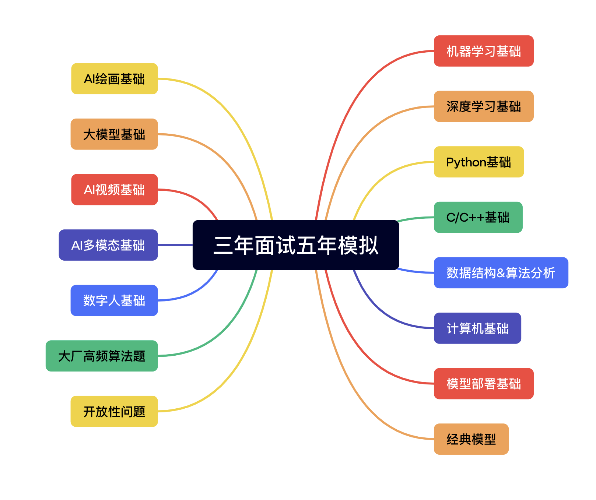

# 【三年面试五年模拟】算法工程师的求职面试秘籍

## 【三年面试五年模拟】内容大纲

## 作者介绍

Rocky Ding 主编

Rocky Ding，自媒体WeThinkIn创始人，资深AIGC算法专家，全网文章阅读量100万+，专注于AIGC创新产品的落地应用。在互联网大厂、AI独角兽、传统科技公司、国有企业有丰富的工作经验

张一凡 副主编

张一凡，资深AIGC算法专家，曾就职于某国内某top安防公司，专注于AIGC算法实现与落地部署，目前在国内某研究所主要从事AI大模型相关的研究。

## AIGCmagic社区与知识星球
AIGCmagic社区主要探讨交流AIGC、传统深度学习、自动驾驶、机器学习、计算机视觉、自然语言处理、图像处理、元宇宙、SLAM等AI行业话题。

AIGCmagic社区的主旨是找到更多志同道合的伙伴，在各个成员都能有成长、有进步、能提升个人基本面的基础上，一起推动AI行业的发展与繁荣。

AIGCmagic社区交流群里有很多人工智能行业的大牛，欢迎大家加入～（请添加小助手微信Jarvis8866，备注**姓名+城市+从事方向+公司**）

**Rocky也和AIGC的专家们一起建立了AIGCmagic社区知识星球**。AIGCmagic社区知识星球是国内首个以AIGC全栈技术与应用为主线的学习交流平台，涉及AI绘画、AI视频、ChatGPT等大模型、AI多模态、数字人、全行业AIGC赋能等50+应用方向，内部包含海量学习资源、专业问答、前沿资讯、内推招聘、AIGC模型、AIGC数据集和源码。欢迎大家加入，一起学习交流，共同推动AIGC行业的发展与普惠！

