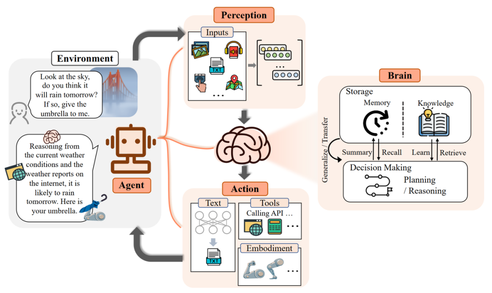

<h1 id="目录">目录</h1>

- [1.LLM中token指的是什么？](#1.LLM中token指的是什么？)
- [2.哪些因素会导致LLM中的偏见？](#2.哪些因素会导致LLM中的偏见？)
- [3.如何减轻LLM中的“幻觉”现象？](3.如何减轻LLM中的“幻觉”现象？)
- [4.解释一下大模型的涌现能力？](#4.解释一下大模型的涌现能力？)
- [5.解释一下MOE，它的作用主要是什么？](#5.解释一下MOE，它的作用主要是什么？)
- [6.如何缓解大语言模型inference时候重复的问题？](#6.如何缓解大语言模型inference时候重复的问题？)
- [7.什么是大模型智能体？](#7.什么是大模型智能体？)
- [8.LLM有哪些类型？](#8.LLM有哪些类型？)
- [9.什么是基础模型？什么是开源模型，和闭源模型？](9.什么是基础模型？什么是开源模型，和闭源模型？)
- [10.什么是语言模型？](#10.什么是语言模型？)
- [11.什么是自回归语言模型？](#11.什么是自回归语言模型？)
- [12.什么是信息理论？](#12.什么是信息理论？)
- [13.什么是n-gram模型？](#13.什么是n-gram模型？)
- [14.大语言模型的应用风险有哪些？](#14.大语言模型的应用风险有哪些？)
- [15.什么是大语言模型的适应性？](#15.什么是大语言模型的适应性？)
- [16.语言模型有哪些分类？](#16.语言模型有哪些分类？)
- [17.什么是注意力机制？](#17.什么是注意力机制？)
- [18.什么是语言模型的“两类错误”及其影响?](#18.什么是语言模型的“两类错误”及其影响?)
- [19.有哪些常见的语言任务?](#19.有哪些常见的语言任务?)
- [20.什么是分词?](#20.什么是分词?)
- [21.什么是最大匹配算法?](#21.什么是最大匹配算法?)
- [22.如何解决模型规模过大导致的难以扩展问题？](#22.如何解决模型规模过大导致的难以扩展问题？)
- [23.什么是混合专家模型？](#23.什么是混合专家模型？)
- [24.怎么构建大模型领域的数据集？](#24.怎么构建大模型领域的数据集？)
- [25.Decoder-only模型训练的目标函数是什么？](#25.Decoder-only模型训练的目标函数是什么？)
- [26.Encoder-only模型训练的目标函数是什么？](#26.Encoder-only模型训练的目标函数是什么？)
- [27.Encoder-decoder模型训练的目标函数是什么？](#27.Encoder-decoder模型训练的目标函数是什么？)
- [28.优化算法怎么应用在大模型的训练中？](#28.优化算法怎么应用在大模型的训练中？)
- [29.什么是大模型的混合精度训练？](#29.什么是大模型的混合精度训练？)
- [30.Probing方法怎么用于下游任务的迁移？](#30.Probing方法怎么用于下游任务的迁移？)
- [31.Prompt Tuning方法怎么用于下游任务的迁移？](#31.Prompt Tuning方法怎么用于下游任务的迁移？)

<h3 id='1.LLM中token指的是什么？'>1.LLM中token指的是什么？</h3>

在大语言模型中，Token是模型进行语言处理的基本信息单元，它可以是一个字，一个词甚至是一个短语句子。Token并不是一成不变的，在不同的上下文中，他会有不同的划分粒度。

<h3 id='2.哪些因素会导致LLM中的偏见？'>2.哪些因素会导致 LLM 中的偏见？</h3>

在大型语言模型（LLM）中，偏见可能来源于多个因素，包括以下几个方面：

1. **训练数据的偏差**：LLM 的性能依赖于所使用的训练数据。如果训练数据中包含偏见（例如，种族、性别、年龄、宗教等方面的偏见），模型可能会在生成文本时反映出这些偏见。

2. **数据选择与采样方法**：如果训练数据在选择和采样过程中不够多样化或不够平衡，可能导致模型对某些群体或观点的偏见。某些少数群体或观点可能在训练数据中被低估或忽视，从而导致模型表现出偏见。

3. **模型架构和训练方法**：虽然模型架构本身并不直接产生偏见，但特定的设计选择和训练方法可能会放大训练数据中的偏见。例如，过度优化某些性能指标（如精度）可能会忽视公平性和多样性。

4. **人类标注者的偏见**：在训练监督学习模型时，标注数据的过程通常涉及人类标注者。如果这些标注者带有偏见，他们的偏见可能会传递到训练数据中，从而影响模型的输出。

5. **模型部署和使用环境**：即使模型在训练过程中没有明显偏见，在实际部署和使用过程中，用户交互和反馈也可能引入新的偏见。例如，某些用户输入可能会导致模型生成偏见性回答。

6. **社会和文化背景**：语言和文化是动态变化的，不同社会和文化背景下的语言使用方式不同。如果模型训练数据主要来自特定文化或语言环境，可能会对其他文化或语言产生偏见。

为了减少这些偏见，研究人员和开发者可以采取以下措施：

- **多样化训练数据**：确保训练数据在性别、种族、文化、社会经济背景等方面具有多样性。

- **偏见检测和消除**：使用技术手段检测和消除模型中的偏见，例如通过去偏算法和公平性评估工具。

- **透明度和解释性**：增加模型的透明度，使用户能够理解模型的决策过程，并及时识别和纠正偏见。

- **持续监控和改进**：在模型部署后持续监控其表现，收集用户反馈，并定期更新和改进模型。
这些方法可以帮助减少 LLM 中的偏见，提高其公平性和可靠性。

<h3 id='3.如何减轻LLM中的“幻觉”现象？'>3.如何减轻 LLM 中的“幻觉”现象？</h3>

大模型幻觉问题主要指：指的是模型生成的内容看似合理但实际上是错误或虚构的信息。
减轻大型语言模型（LLM）中的“幻觉”现象可以通过多种方法实现。改进训练数据质量和训练方法，包括数据清洗、监督学习和强化学习，确保数据的准确性和多样性；采用后处理技术，如事实验证和编辑校对，确保生成内容的真实性；改进模型架构，结合外部知识库和多任务学习增强模型对事实的理解；提高模型透明度和可解释性，使用户能够理解和检查模型的输出；建立用户教育和反馈机制，鼓励用户验证生成内容并报告错误；以及定期更新和维护模型和数据。通过这些方法，可以显著减少模型生成错误信息的可能性，提高内容的准确性和可靠性。

<h3 id='4.解释一下大模型的涌现能力？'>4.解释一下大模型的涌现能力？</h3>

大模型的涌现能力指的是，当模型的规模和复杂度达到一定程度时，出现了一些在较小模型中未曾观察到的新特性或能力，如语言理解与生成、推理、多语言处理和少样本学习等。这些能力并非通过直接编程实现，而是在大量数据和复杂训练过程中自然涌现的。

<h3 id='5.解释一下MOE，它的作用主要是什么？'>5.解释一下MOE，它的作用主要是什么？</h3>

混合专家模型（Mixture of Experts：MoE）是一种稀疏门控制的深度学习模型，它主要由一组专家模型和一个门控模型组成。MoE的基本理念是将输入数据根据任务类型分割成多个区域，并将每个区域的数据分配一个或多个专家模型。每个专家模型可以专注于处理输入这部分数据，从而提高模型的整体性能。

MoE架构的基本原理非常简单明了，它主要包括两个核心组件：GateNet和Experts。GateNet的作用在于判定输入样本应该由哪个专家模型接管处理。而Experts则构成了一组相对独立的专家模型，每个专家负责处理特定的输入子空间。

微软研究报告，参考链接：
https://www.microsoft.com/en-us/research/blog/deepspeed-advancing-moe-inference-and-training-to-power-next-generation-ai-scale/

<h3 id='6.如何缓解大语言模型inference时候重复的问题？'>6.如何缓解大语言模型inference时候重复的问题？</h3>

缓解大语言模型推理时重复问题的方法包括引入重复惩罚机制、多样性采样技术（如温度采样、Top-k采样、Top-p采样）、N-gram去重、改进模型架构和训练方法（如长程记忆机制、训练数据去重）以及生成后的后处理技术。这些策略可以有效减少生成文本中的重复现象，提高生成内容的多样性和连贯性。

<h3 id='7.什么是大模型智能体？'>7.什么是大模型智能体？</h3>

**智能体**是具有自主性、反应性、积极性和社交能力特征的智能实体，由三个部分组成：**控制端（Brain）**，**感知端（Perception**）和**行动端（Action）**。

- **控制端**：主要由大型语言模型（LLMs）组成，负责存储记忆和知识，处理信息，并制定决策。它能够规划任务、理解上下文和知识库，并作为主控激活其他功能。

-  **感知端**：智能体通过这一部分接收外部信息，包括使用自然语言处理技术来理解文本信息，以及利用计算机视觉技术来分析图像和视频数据等。

-  **行动端**：智能体通过这一组件与外部环境互动并产生影响。这包括生成文本和图像、机器人的具身交互能力，以及调用各种工具来完成特定任务。

<h3 id='8.LLM有哪些类型？'>8.LLM有哪些类型？</h3>

LLM大模型根据应用领域的不同，分为文本、音频、视频、图像生成等类型。

- **音频和语音**：大模型直接分析给定的音频，并自动生成所需的音频数据，涵盖多语言语音识别，感情辨识，自然语音生成，多语言翻译等等问题，例如：FunAudioLLM。

- **图像和视频**：根据给定的文本、图像、视频等单模态数据，自动生成符合描述的、高保真的图像和视频内容，涵盖图像和视频的生成，理解，修复以及压缩等问题，例如：DALL-E。

- **文本类型**：  指利用自然语言处理技术，通过对大量文本数据的学习和理解，以及对语言规律的掌握，自动生成符合语法和语义要求的文本内容，涵盖文本和代码的生成，理解，翻译和改写等问题，例如：GPT-4。

- **多模态**： 将自然语言处理与视觉理解，音频处理等其他模态相结合，并通过多模态界面实现交互，实现在输入和输出中处理多种类型的数据，例如：GPT-4o。

<h3 id='9.什么是基础模型？什么是开源模型，和闭源模型？'>9.什么是基础模型？什么是开源模型，和闭源模型？</h3>

**1. 基础模型**：

Foundation model 出自论文[《On the Opportunities and Risks of Foundation Models》](https://arxiv.org/abs/2108.07258?WT.mc_id=academic-105485-koreyst)，其定义标准包括：
	
	（1）使用无监督学习或者自监督学习，仅接受未标记数据的预训练，而没有人工注释或标记数据的参与；
	（2）模型规模很大， 通常超过数十亿的参数；
	（3）作为基座模型，仅需要通过微调即可转变为特定应用模型。

**2.开源模型与闭源模型**

- **开源模型**： 开源模型是对公众开放，任何人都可以使用的模型，允许任何针对LLM的修改和定制，例如：LLaMA模型。

- **闭源模型**： 闭源模型为公司专有仅对公众开放接口的模型，例如：GPT-4o。

<h3 id='10.什么是语言模型？'>10.什么是语言模型？</h3>

语言模型是一种概率模型，用于预测词元（token）序列的概率分布。假设我们有一个词元集 $V$ ，语言模型则是为每个词元序列 $w_{1},...,w_{n} ∈ V$ 预测一个联合概率 $p(w_1, w_2 ... w_n)$ 。通过比较不同词元序列的联合概率，我们可以确定哪个序列在给定上下文中是最可能的，即最佳词元序列。

假设我们有以下三个词元序列，需要确定哪个是最佳序列：

$$
p(\text{你家的, 猫, 吃了, 那只, 老鼠}) = 0.02,
$$

$$
p(\text{那只, 老鼠,吃了, 你家的, 猫}) = 0.01,
$$

$$
p(\text{猫, 你家的, 那只, 老鼠, 吃了}) = 0.0001,
$$

根据语言模型，每个序列都会被赋予一个联合概率。我们来分析这些序列：

1. “你家的猫吃了那只老鼠” - 这个序列既符合语法规则，也符合我们对世界的常识。因此，语言模型会赋予它最高的联合概率。

2. “那只老鼠吃了你家的猫” - 尽管这个序列在语法上是正确的，但它违背了我们对世界的基本常识，因为老鼠通常不会吃猫。因此，语言模型也会赋予它很低的概率。

3. “猫你家的那只老鼠吃了” - 这个序列的语法不正确，主语和谓语的位置混乱，因此语言模型会赋予它很低的概率。

进一步分析，语言模型的任务不仅仅是学习如何为正确的词元序列赋予最高的联合概率，它还需要学习语法规则和世界知识。例如，语言模型应当识别出“猫你家的那只老鼠吃了”这样的序列具有很低的概率，因为该句子的语法结构混乱；同样，模型也应该对“那只老鼠吃了你家的猫”这样的句子赋予较低的概率，因为这违反了我们对世界的基本常识。因此，一个优秀的语言模型应当具备出色的语法理解和世界知识，这样才能更准确地预测词元序列的概率。

语言模型也可以做生成任务。最纯粹的方法是从基于概率的采样，其过程是：从第一个词语或字符开始，根据语言模型给出的概率分布，选择下一个词语或字符，然后基于新的序列，再次使用模型进行预测，选择下一个词语或字符，如此循环，直到生成一个完整的文本序列。

<h3 id='11.什么是自回归语言模型？'>11.什么是自回归语言模型？</h3>

自回归语言模型是一种使用先前的文字来预测下一个文字的模型。其通过逐词地生成文本，每一步都基于之前生成的内容，是通过逐步预测每个位置的单词来生成一句话或一段话的模型。

假设将序列 $𝑥_{1:𝐿}$ 的联合分布为$ 𝑝(𝑥_{1:𝐿})$ ，其常见写法是使用概率的链式法则：
$$
p(x_{1:L})=p(x_1)p(x_2|x_1)...p(x_L|x_{1:L-1})=\prod^L_{i=1}p(x_i|x_{1:i-1})
$$
自回归语言模型的特点是它可以利用前馈神经网络等方法有效计算出每个条件概率分布 $𝑝(𝑥_𝑖∣𝑥_{1:𝑖−1}) $。在自回归语言模型 $𝑝$ 中生成整个序列$ 𝑥_{1:𝐿}$ ，需要一次生成一个token，该token则是基于之前以生成的toke进行计算获得。

例如，要生成一句话“猫吃老鼠”：

1. 模型首先预测第一个词（例如：“猫”）。
2. 然后它使用“猫”来预测下一个词（例如：“吃”）。
3. 接着使用“猫吃”来预测下一个词（例如：“老鼠”）。
4. 迭代这个过程，直到生成完整的句子。

<h3 id='12.什么是信息理论？'>12.什么是信息理论？</h3>

信息理论是研究语言模型的重要理论，其是一门研究信息的度量、传递、存储和处理的学科。它由克劳德·香农（Claude Shannon）在20世纪40年代创立，主要应用于通信、数据压缩、加密、以及编码等领域。信息理论提供了一个框架，用于理解和优化信息系统的性能。

信息理论中最重要的一个概念是信息量（Entropy），也叫信息熵，它是用来度量信息不确定性的一个指标，其公式表达为：
$$
H(X)=-\sum_iP(x_i)\log P(x_i)
$$
其中，$H(X)$为离散随机变量$X$的信息熵，$P(x_i)$是$X$取值$x_i$的概率。

熵的实际上是一个衡量将样本$x\sim p$ 编码成比特串所需要的预期比特数的度量。熵的值越小，表明序列的结构性越强，编码的长度就越短。直观地讲， $-\log⁡ p(𝑥)$ 可以视为用于表示出现概率为$ 𝑝(𝑥)$ 的元素$ 𝑥$ 的编码的长度。

<h3 id='13.什么是n-gram模型？'>13.什么是n-gram模型？</h3>

n-gram模型是一种用于自然语言处理和概率语言建模的基本方法。它通过统计文本中$n$个连续单词出现的频率来预测下一个单词的概率，从而生成或分析文本。n-gram模型广泛应用于文本生成、拼写校正、语音识别和机器翻译等任务。

根据$n$的取值，n-gram可以是单词（$n=1$）、二元组（$n=2$）、三元组（$n=3$）等。例如，对于语句“猫吃老鼠”：

- 当$n=1$时，n-gram为“猫”、“吃”、“老”、“鼠”

- 当$n=2$时，n-gram为“猫吃”、“吃老”、“老鼠”

- 当$n=3$时，n-gram为“猫吃老”、“吃老鼠”

在一个n-gram模型中，关于$x_{i}$的预测只依赖于最后的 $𝑛−1$ 个字符$ 𝑥_{𝑖−(𝑛−1):𝑖−1}$ ，而不是整个历史：
$$
𝑝(𝑥_𝑖∣𝑥_{1:𝑖−1})=𝑝(𝑥_𝑖∣𝑥_{𝑖−(𝑛−1):𝑖−1}).
$$
如果$n$太小，那么模型将难以捕获长距离的依赖关系，下一个词将无法依赖于靠前的单词。然而，如果$n$太大，则统计上将无法得到概率的好估计。

<h3 id='14.大语言模型的应用风险有哪些？'>14.大语言模型的应用风险有哪些？</h3>

- **社会偏见**：大语言模型在处理不同群体的数据时，其表现并不一致，存在一定的偏差。具体来说包含**性能差异**和**刻板印象**两个方面。比如：由于GPT等大模型中亚洲人数据占比较小，所以可能导致在有关亚洲人的问题上性能欠佳或者生成具有刻板印象的答案。
- **有害性**：由于大语言模型是基于大量的互联网数据进行训练，所以可能导致大模型在生成文本时产生有害内容的倾向。
- **虚假信息**：由于大语言模型具备高度的语言生成能力，恶意行为者得以更加便捷地制造语法正确、风格一致且看似可信的虚假新闻，从而加剧了虚假信息宣传的泛滥和危害。
- **安全性**：由于大语言模型是通过抓取和利用网络数据进行训练的，因此任何人都有可能通过篡改或创建有毒数据来影响这些模型的训练过程，进而潜在地攻击和操纵大型模型的行为和输出。
- **法律效应**：如果训练数据中包含了受版权保护的作品，而使用这些作品未经版权持有者的许可，是否造成侵权？如果大语言模型生成的文本与受版权保护的原创作品相似到足以构成实质性相似，是否造成抄袭？
- **成本**：大语言模型的训练和推理过程需要巨大的算力支持，这带来了显著的成本问题：包括训练成本，推理成本和访问成本。

<h3 id='15.什么是大语言模型的适应性？'>15.什么是大语言模型的适应性？</h3>

大语言模型的核心是表示token序列的概率分布，不仅可以用来**评估**一个句子在自然语言中出现的可能性，还可以在给定部分序列（prompt）的情况下，**生成**与之匹配的后续序列，从而创建完整的句子或文本。因此，语言模型可以完成大量的自然语言任务，比如Language Modeling，Question Answering，Arithmetic，news Article Generation, translation, Novel Tasks等。我们使用**“适应”**一词来描述将**通用语言模型**转换为专门针对**特定自然语言任务模型**的过程。

常见的适应技巧包括**监督学习**和**提示学习**。**监督学习**：重新训练或者微调大语言模型。**提示学习**：通过设计并输入特定任务的提示或上下文信息，指导语言模型生成满足这些任务需求的输出。**监督学习**可能因数据问题导致模型过拟合或欠拟合，而**提示学习**则可能因输入提示长度限制而影响生成效果的质量。

<h3 id='16.语言模型有哪些分类？'>16.语言模型有哪些分类？</h3>

根据语言模型的架构，总体可分为编码器（Encoder-only）、解码器（Decoder-only）以及编码器-解码器（Encoder-Decoder）三种架构。

- 编码器架构：这类模型主要专注于理解输入文本的上下文语义信息。模型能够根据输入的文本生成向量表征，表征可用于文本分类等下游任务。该类型的模型典型代表是BERT、RoBERTa等。

- 解码器架构：该模型主要用于生成任务，相较于编码器架构，其能更进一步生成文本，有简单的训练目标。该类型的模型代表有GPT。

- 编码器-解码器架构：该类模型同时包含编码器和解码器，其中编码器负责理解文本输入，解码器负责生成文本。典型的代表是Transformer、BART以及T5模型等。

<h3 id='17.什么是注意力机制？'>17.什么是注意力机制？</h3>

注意力机制（Attention Mechanism）是一种处理序列数据的重要技术，被广泛应用于各种自然语言处理和计算机视觉任务。注意力机制的核心思想是允许模型在处理每个输入或输出元素时，动态地选择和关注输入序列的不同部分，从而更好地捕捉和利用相关信息。

以Transformer模型为例，其编码器和解码器结构中均存在注意力机制。Transformer使用多头注意力机制（Multi-head Attention），即通过多个并行的注意力层来捕捉序列中不同位置的重要关系，从而在处理长距离任务的同时，能够有效地关注最相关的信息。

<h3 id='18.什么是语言模型的“两类错误”及其影响?'>18.什么是语言模型的“两类错误”及其影响?</h3>

- **召回错误**：在自然语言处理中，语言模型在尝试预测文本中的下一个词（token）时，没有准确地估计出该词出现的概率。例如，如果实际文本中的下一个词是“苹果”，但模型预测这个词出现的概率非常低，那么就认为模型未能正确地为“苹果”这个词分配概率。

- **精确度错误**：在预测文本序列时，错误地高估了某些不合适或不符合实际语境的序列出现的概率。例如，在一个关于天气的对话中，如果模型预测出“今天天气很好，我去游泳，然后吃了一块月亮”，这里的“吃了一块月亮”就是一个错误的词序列。

当出现**召回错误**时，**困惑度**会非常高，因为模型未能预测到实际出现的词，这相当于模型给实际词分配了**接近于零的概率**。在几何平均的计算中，任何接近零的概率都会极大地增加整个序列的困惑度，因为几何平均对极端低概率非常敏感。但对于**精确度错误**，困惑度只会进行适度惩罚。 因为实际词的概率降低不大，导致其增量大概和错误序列占总文本的比例相当。

<h3 id='19.有哪些常见的语言任务?'>19.有哪些常见的语言任务?</h3>

**语言建模 任务**是预测文本序列中下一个token的任务。该任务基于给定的部分序列，预测下一个最可能的token，旨在捕捉自然语言的统计特性。该任务的概率可以通过链式规则表示为： $p(x_{1:l})=\prod_{i=1}^l{p(x_i|x_{1:i-1}})$。相关数据集有 Penn Tree Bank，LAMBADA，HellaSwag 等

**问答任务**是解决闭卷问答题的任务，其中输入是一个问题，输出是一个答案。语言模型必须以某种方式“知道”答案，而无需在数据库或一组文档中查找信息。相关数据集有：TriviaQA，WebQuestions

**翻译任务**涉及将源语言（如德语）的句子转换为目标语言（如英语）的句子。这一过程经历了从统计机器翻译到神经机器翻译的发展，再到利用大型模型进行翻译的演变。

**算术任务**：做算术题（2-5位数的加法，减法，乘法）。

**文章生成任务**：给定标题和副标题，生成新闻文章。

**其他任务**：包括使用新词，纠正语法，词汇替换，多选题等等

<h3 id='20.什么是分词?'>20.什么是分词?</h3>

**分词**是将连续的文本字符串分割成有意义的词元（token）序列的过程，这可以被视为自然语言与机器语言之间的一种隐式映射或对齐方式。通过分词，文本数据被转换成机器可以理解和处理的形式。常见的分词方法有：**基于空格的分词**，**字节对编码**，**Unigram 模型** 。

**基于空格的分词**：对于英文文本来说，由于其结构特点（单词之间通常由空格分隔），使用 text.split(' ') 方法进行分词是一种简单且直接的手段。

**字节对编码**：字节对编码（BPE）算法通过训练数据学习分词器，初始将每个字符作为单独的词元，然后合并频繁共现的词元对以构建词汇表，直至达到所需的大小。

**Unigram 模型**：Unigram模型是一种基于目标函数的分词方法，它通过统计每个词汇在训练数据中的出现次数来估计其概率，并通过计算整个训练数据的似然值来评估分词结果的质量。

<h3 id='21.常见的分词原则有哪些?'>21.常见的分词原则有哪些?</h3>

**分词原则**：
- ** 颗粒度越大越好**。词组的字数越多，所表示的含义越具体，语义分析的结果越精准。
- **分词结果中非词典词和单字词越少越好**。**非词典词**通常意味着文本中存在一些不在词典中的新词或专有名词。因为模型没有足够的训练数据来正确预测这些词，过多的非词典词可能会导致分词错误。单字词是指由单个汉字组成的词。单字词通常不是完整的词组，它们可能只是词的一部分，或者是停用词（如“的”、“了”、“是”等）。因为它们不能表达完整的语义信息，单字词的出现可能会导致分词结果的不准确。
- **总体词数越少越好**。在相同字数的情况下，总词数越少，通常意味着每个词组包含的语义信息越多，这有助于提高分词的准确性。但这并不意味着极端的少也是好的，因为过分的切分可能会导致语义信息的丢失。

<h3 id='21.什么是最大匹配算法?'>21.什么是最大匹配算法?</h3>

**最大匹配算法**是一种基于词典的分词技术，其核心任务是将以连续字符形式存在的文本拆解成一系列有意义的词语。该算法的工作原理是从文本中提取尽可能长的词语，并与预先设定的词库进行匹配。若提取的词语在词库中存在，则将其从文本中分离出来；若不存在，则缩短一个字符后再次尝试匹配，如此循环，直至文本中的每个字符都被成功分词。根据匹配的方向不同，最大匹配算法可以分为**正向最大匹配法**、**逆向最大匹配法**以及**双向最大匹配法**。

- **正向最大匹配算法**：像吃蛋糕一样，从蛋糕的一头开始，尽可能大口地吃（匹配最长的词语）。如果这一大口（词语）在词典中能找到，就确认吃下（记录这个词语），然后继续从剩下的蛋糕（文本）开始新的一口。如果这一大口（词语）在词典中找不到，就少吃一点（减少一个字），再尝尝看。重复这个过程，直到整个蛋糕（文本）被吃完（分词完成）。

- **逆向最大匹配法**：与正向最大匹配算法相反，这次是从蛋糕的另一头开始吃（从文本的末尾开始匹配）。同样地，尽可能大口地吃，如果词典中有这个词，就确认吃下，否则少吃一点再尝。直到蛋糕被吃完为止。

- **双向最大匹配法**：这个方法就像是同时从蛋糕的两头开始吃。分别用正向和逆向的方法吃蛋糕，然后比较哪种吃法更好（哪种分词结果更合理）。最后选择一种最好的吃法（分词结果）。

<h3 id='22.如何解决模型规模过大导致的难以扩展问题？'>22.如何解决模型规模过大导致的难以扩展问题？</h3>

常见的语言模型开发主要依赖于**稠密的Transformer模型架构**，其中GPT-3等模型通过堆叠多达96层的Transformer实现了强大的语言处理能力。然而，随着模型规模的不断增大，其对计算资源的需求也在急剧上升。这种增长导致模型训练和部署必须依赖于分布式系统，将模型分布在多个GPU上。但是，这种方法已经接近了技术和硬件上的**极限**，因此，探索新的模型架构以实现更好的稀疏性成为了解决扩展难题的关键。**混合专家模型（MoE）**和**基于检索的模型**提供了有效的解决方案。

**MoE模型**：
- 由多个专家网络构成，每个网络专门负责处理输入数据的一个特定子集。通过一个门控网络来决定哪些专家网络应该被激活以处理当前的输入，这样不仅实现了模型的稀疏化，还提高了计算效率。

- 这个过程可以类比为一个由多个领域专家组成的咨询委员会，每个专家都有其独特的技能和知识。面对一个特定问题时，只有那些具备相关领域知识的专家会被选中提供意见，他们的综合观点最终形成决策。

**基于检索的模型**：

- 这种模型依赖于一个庞大的原始数据存储库。当接收到一个新的输入时，模型会在存储库中检索与之相关的信息，并基于这些检索到的信息来预测输出。

- 这个过程与我们在日常生活中遇到问题时使用搜索引擎查找相关信息，然后基于这些信息作出判断非常相似。

<h3 id='23.什么是混合专家模型？'>23.什么是混合专家模型？</h3>

**基本思想**：将输入数据通过一个门控机制分配给不同的专家，然后根据这些专家的预测以及它们各自的重要性（或权重）来生成最终的输出。

**详解**：定义 $n$ 个专家，每个专家 $(1,2,...,i)$ 都有自己的嵌入矩阵 $w_i$。每个专家有自己的权重参数 $\theta_{i}$，并基于专家特性定义每个专家函数 $h_{\theta_i}(x)$。将门控函数定义为 $n$ 个专家的概率分布 $g_i(x) = \frac {e^{(w_ix)}} {\sum_{j=1}^{n}{w_jx}}$，根据输入数据动态地选择或组合多个专家的输出。那么最终模型为 $f(x) = \sum_{1}^i \underbrace{g_i(x)}*\text{gating} \underbrace{h_{\theta_i}(x)}_\text{expert}$ 。

**注意事项**：（1）专家的混合不会节省任何计算，因为前向传播仍然需要评估每个专家，而反向传播也必须接触每个专家。因此，可以选择值排名靠前的专家更新，并将其他专家规范化为0，以节约成本。（2）只有所有专家都参与进来，混合专家才有意义，因此也需要避免只有一个专家活跃的情况。

**如何应用在语言模型**：**Sparsely-gated mixture of experts**（门控函数应用于序列，混合专家应用于每个token和隔层的Transformer block，并且只在顶层进行专家的结合），**Switch Transformer** （简化的门控函数，只激活一个专家）

<h3 id='24.怎么构建大模型领域的数据集？'>24.怎么构建大模型领域的数据集？</h3>

大语言模型的训练依赖于大量涵盖广泛领域的文本数据，如WebText数据集用于GPT-2的训练，C4语料库用于T5的训练，以及CommonCrawl用于GPT-3的训练。然而，网络数据的品质参差不齐，因此提出了数据文档的概念，其要点如下：

（1）数据集创建背景：（创建动机）了解数据集为何而建； （创建者）明确数据集的作者是谁；（资金来源）知晓数据集创建的资助情况。（2）数据集组成：（实例代表性）了解数据集中的实例代表什么；（信息完整性）检查是否存在缺失信息；（机密性）确认是否包含敏感或机密数据。（3）数据收集过程：（数据获取方式）了解实例数据的收集方法；（参与人员）明确参与数据收集的人员；（报酬情况）掌握数据收集人员的报酬方式；（道德审查）确认是否进行了道德审查。（4）预处理、清理和标记：（完成情况）了解这些工作是否已实施；（软件工具）确认是否有相应的软件支持。（5）数据集使用情况：（应用任务）了解数据集已用于哪些任务；（限制性任务）明确不适合使用该数据集的任务。（6）数据分发：（分发方式）了解数据集的分发途径；（知识产权限制）确认是否存在第三方对数据的知识产权或其他限制。（7）数据集维护：（负责人）明确谁负责维护数据集；（更新情况）了解数据集是否会进行更新。
        

<h3 id='25.Decoder-only模型训练的目标函数是什么？'>25.Decoder-only模型训练的目标函数是什么？</h3>

**Decoder-only模型**通过一个上下文嵌入函数 $\phi$ 来将序列的前 $i−1$ 个词 $x_{1:i−1}$ 映射到一个嵌入向量 $\phi(x_{1:i−1})$ ；随后应用嵌入矩阵 $E$ 和 $softmax$ 函数来得到第 $i$ 个词 $x_i$ 的概率分布 $p(x_{i}|x_{1:i})$ 。那么，Decoder-only模型训练的条件分布可以表示为 $p(x_{i}|x_{1:i})=softmax(E\phi(x_{1:i-1})_{i-1})$。

为了最大化模型在数据集上的概率，我们采用**最大似然估计**来估计此模型的参数。在这一过程中，我们计算对数似然的梯度，并根据梯度方向调整参数。设 $\theta$ 是大模型的所有参数， $D$ 是所有的训练数据， $L$ 是单个语言序列的长度， 则最终的目标函数为： $f(θ) = ∑_{x ∈ D} -\log p_θ(x) = ∑_{x ∈ D} ∑_{i=1}^{L} -\log p_θ(x_i | x_{1:i-1})$。

<h3 id='26.Encoder-only模型训练的目标函数是什么？'>26.Encoder-only模型训练的目标函数是什么？</h3>

**BERT**是一种典型的encoder-only模型，其设计目标是通过对大量文本的双向编码来获得深层次的上下文理解。其目标函数包括两个部分：（1）掩码语言模型和（2）下一句预测。

**掩码语言模型**的基本思想是通过加噪然后预测来进行训练，比如：[猫，[MASK]， 老鼠] → [猫，吃，老鼠]。该模型通过输入有噪声的序列 $x_{1:L}^{noise}$ 及其上下文嵌入，预测每个token，即 $p(x_i|x_{1:L}^{noise})=softmax(E\phi(x_{1:L}^{noise})_i)$。

**下一句预测**的目的是预测第二局是否跟随第一句，比如：[[CLS]，猫，吃，老鼠，[SEP]，[它]，[吃]，[饱了]] → 1，而 [[CLS]，猫，吃，老鼠，[SEP]，[苹果]，[红了]] → 0。注：[CLS]是驱动分别任务的起始嵌入，[SEP]用于区别两个语言序列。

BERT训练的目标函数最终为下式（RoBERTa删除了下一句预测）。其中 $D$ 是训练集， $A$ 是随机噪声函数， $I$ 表示从 $1$ 到 $L$ 的随机位置， $C$ 表示是否为跟随的下一句。

$$\sum_{x_{1:L} \in D}E_{I,x_{1:L}^{noise} \sim A(x_{1:L},I)}[\sum_{i \in I} -\log p_θ(x_i^{noise}|x_{1:i-1})]+ (-logp(c|\phi(x_{1:L})_1))$$

<h3 id='27.Encoder-decoder模型训练的目标函数是什么？'>27.Encoder-decoder模型训练的目标函数是什么？</h3>

**BART**和**T5**是典型的Encoder-decoder模型，可以实现像BERT一样对输入进行双向编码或者像GPT一样进行自回归编码。**BART**采用RoBERTa相同的编码器架构和相同的目标函数进行训练。通过掩码，乱序，删除等手段，实现了分类和生成任务。

**T5**采用denoising objective作为目标函数。该目标函数的功能是：在输入样本中，用一些唯一的特殊符号<X>, <Y>来表示原始样本中被随机masked的token，而目标样本则为被masked的token序列，用输入样本中对应位置的特殊符号<X>, <Y>分隔，最后加上一个特殊符号<Z>表示序列结束。例如：原始样本 [我，在院子里，听说，猫，吃，老鼠]，输入样本 [我，<X>，听说，<Y>，吃，老鼠]，输出样本 [是的，小明，<X>，这件事，<Z>]

<h3 id='28.优化算法怎么应用在大模型的训练中？'>28.优化算法怎么应用在大模型的训练中？</h3>

常见的优化算法：随机梯度下降算法通过初始化参数后，不断随机抽取小批量数据计算梯度并更新参数；Adam算法引入了动量和自适应步长，通过初始化参数和动量，不断随机抽取小批量数据计算梯度并更新一阶，二阶动量和参数。优化算法的优化关键在于平衡参数快速收敛与处理大模型参数量带来的高内存占用的矛盾。由于稳定性问题，学习率和一些直觉（例如，二阶方法）仍然有用，但要使大语言模型有效训练，还需要克服许多其他独特的挑战。

<h3 id='29.什么是大模型的混合精度训练？'>29.什么是大模型的混合精度训练？</h3>

在处理大规模语言模型训练时，FP16（16位浮点数）格式虽然能够显著减少内存消耗，但它限制了数值的精度，特别是对于非常小的数值，比如小于2^-24的值会直接归零。因此，为了保证训练的精度和稳定性，我们通常采用FP32（32位浮点数）来进行训练。

然而，为了平衡存储和计算效率，实践中会将**模型的权重以FP32格式存储，而在计算过程中使用FP16进行前向和反向传播**。这种方法虽然可能引入一些数值上的放大误差，但能够有效减少内存使用，同时避免了梯度消失的问题，使得内存需求大约减少了一半。这样的策略在保持模型性能的同时，优化了资源的使用。

<h3 id='30.Probing方法怎么用于下游任务的迁移？'>30.Probing方法怎么用于下游任务的迁移？</h3>

**Probing技术**是一种用于**分析和理解预训练语言模型内部表示**的有效手段。它通过在预训练语言模型的**最后一层**之后附加**参数较少的线性或浅层前馈网络**，即Probing预测头，有效地分析和理解模型内部表示，以评估模型对特定任务（如输出标签）的处理能力。为了将一个包含 $L$ 个token的序列合理地映射为单个/少量的token的表示，Probing技术采用了以下两种策略：**CLS token策略**和**平均化策略**来优化预测头的映射能力。

**CLS token策略**表示在序列的开始处插入一个特殊的分类token（CLS），这个token的目的是聚合整个序列的信息。在模型的输出中，CLS token对应的表示被用作整个序列的表示。**平均化策略**假设序列中的每个token都为整个序列的语义贡献了等量的信息。因此，取序列中所有token的表示的平均值，以此来创建一个单一的、全局的序列表示。Probing方法在训练过程中保持预训练模型的权重不变，仅对新增的预测头进行训练，大幅度降低了训练成本。

<h3 id='31.Prompt tuning方法怎么用于下游任务的迁移？'>31.Prompt tuning方法怎么用于下游任务的迁移？</h3>

**Prompt tuning方法**专注于优化**输入提示**，而不涉及修改语言模型的内部参数。该方法通过在原始输入前添 $k$ 个可学习的连续tokens，使得新的输入长度变为 $L= L + K$ 。这些额外的tokens的嵌入是通过在带标签的任务数据上进行训练来学习的。在整个微调过程中，**预训练的语言模型保持冻结状态**，即模型的主体参数不会发生变化。随着预训练模型规模的增大，prompt tuning的性能表现越来越出色，有时甚至能够与全面微调的效果相匹配。其中，该方法的初始化策略包括： **随机词汇嵌入**（选择随机的词嵌入），**类标签词嵌入**（选择和分类标签相关的词嵌入）和**随机初始化**（随机分配值）。

P-Tuning v2是提示调整（Prompt tuning）方法的一个改进版本，不仅仅是在输入层添加可学习的提示（prompt），而是在模型的多个层级上进行了优化。