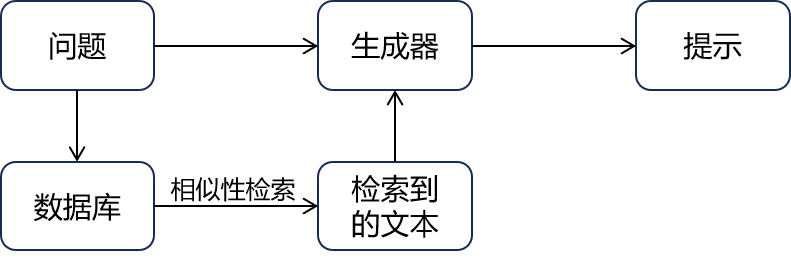
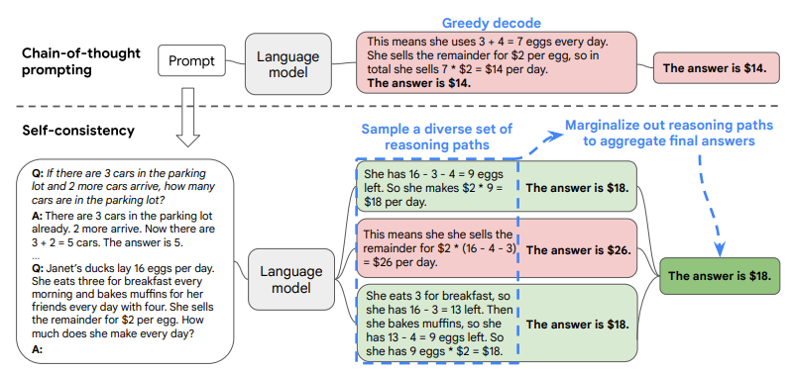
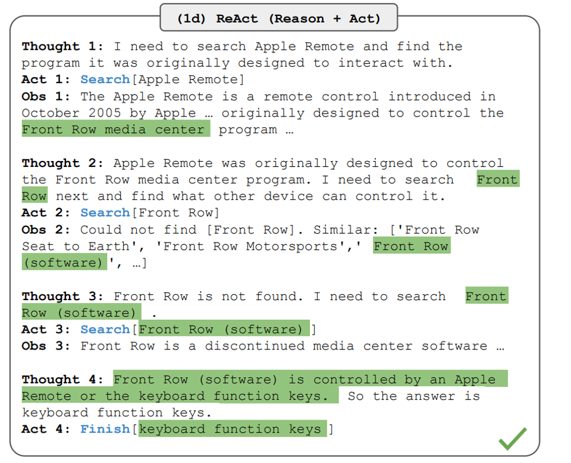
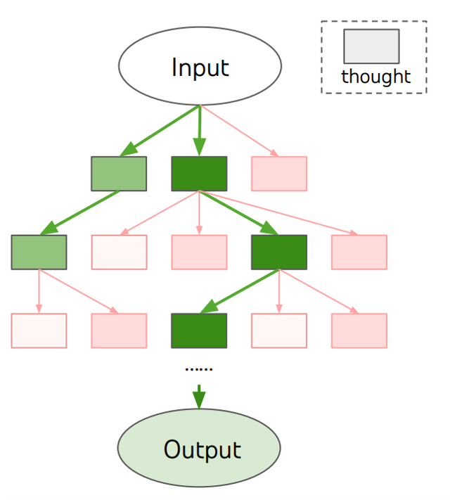
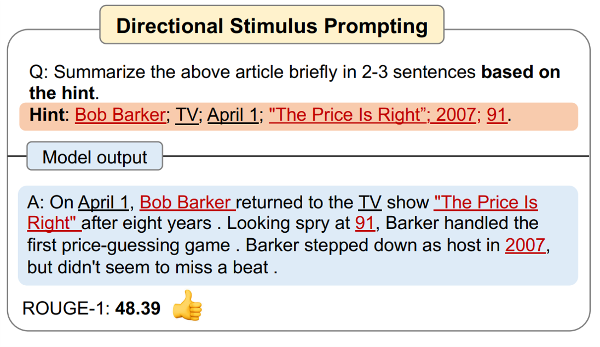
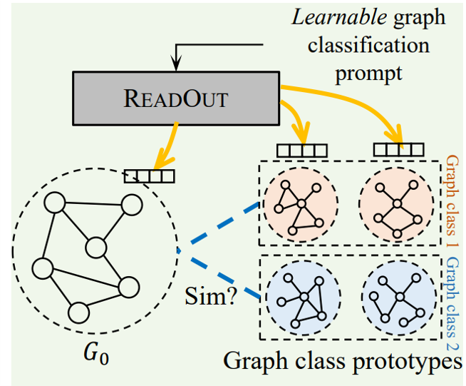
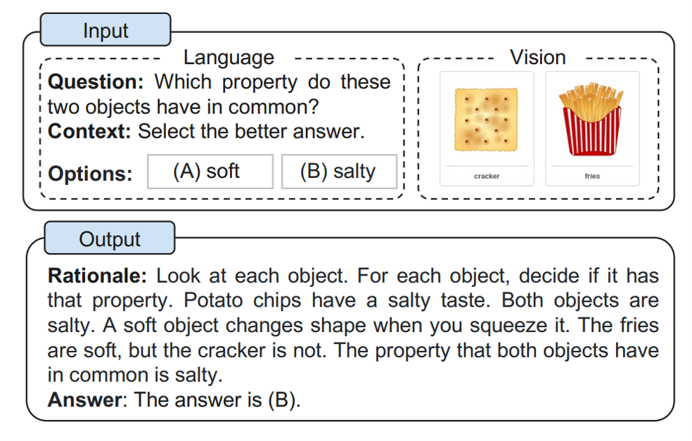
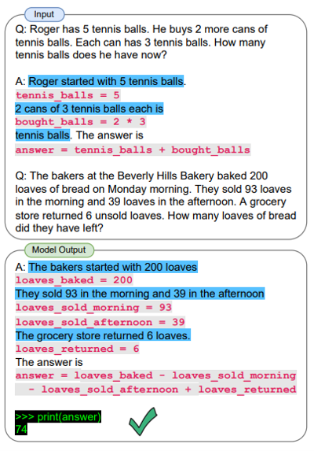
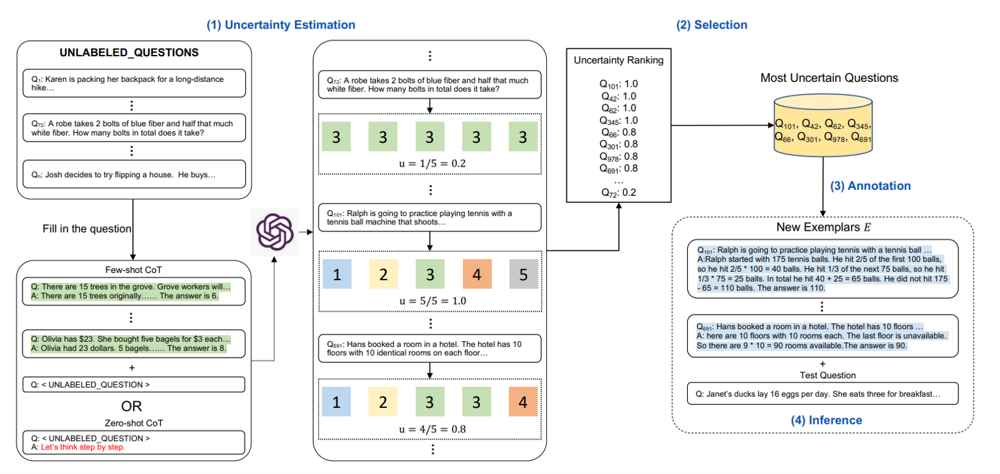
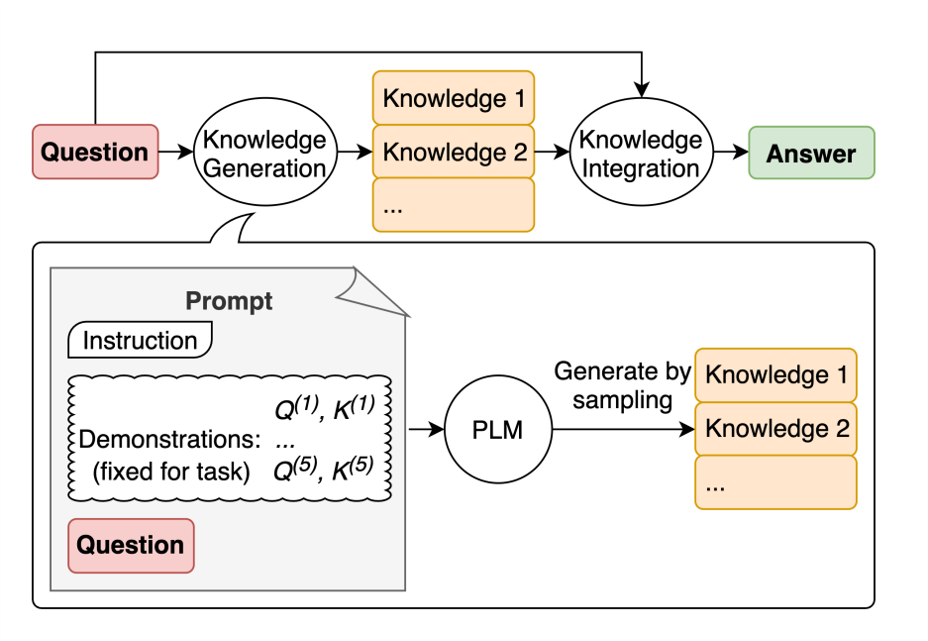

### 常见提示工程
- **零样本提示（Zero shot）(Wang et al., 2019)**
  原则：与大模型交互的提示仅包含指令，不包含任何示例。
  应用：一般性问题（文本翻译，摘要总结等）。
  论文：A Survey of Zero-Shot Learning （https://dl.acm.org/doi/10.1145/3293318）
  >例：
  >请将以下内容翻译成为英文。
  >内容: 我爱看三年面试五年模拟。
  
- **少样本提示（Few shot）(Brown et al., 2020)**
  原则：提示中包含少量示例，旨在通过例子作为上下文来引导大模型的响应。
  应用：需要上下文学习的问题（文本仿写，格式约束等）。
  论文：Language Models are Few-Shot Learners （https://arxiv.org/abs/2005.14165）
  >例：
  >《三年面试五年模拟》太棒了 // Positive	 
  >内容对小白很友好哇 // Positive	
  >学习的时候网络十分糟糕 // Negative   
  >请问"多么优秀的知识分享项目"是Positve还是Negative？
  
- **检索增强生成（Retrieval augmented generation, RAG）(Lewis et al., 2020)**
  原则：提示中包含检索得到的外部知识源。
  应用：知识密集型或频繁更新的问题（新发布文件的解读等）。
  论文：Retrieval-Augmented Generation for Knowledge-Intensive NLP Tasks （https://arxiv.org/abs/2005.11401）
  >例：
  >

- **思考链提示（Chain of thought, COT）(Wei et al., 2022)**
  原则：提示包括相似问题的思维过程或中间推理步骤。
  应用：包含多步推理的问题（数学推导等）。
  论文：Chain-of-Thought Prompting Elicits Reasoning in Large Language Models
  （https://arxiv.org/abs/2201.11903）
  >例：
  >这组数中奇数位的数加起来是偶数还是奇数：6, 8, 12, 0, 17, 5, 3。
  >A：找出所有奇数位的数，是6, 12, 17, 5。将它们相加6+12+17+5
  >=18+17+5=35+5=40。答案为True。
  >请问这组数中偶数位的数加起来是偶数还是奇数：5, 7, 0, 19, 35, 7, 5

- **自我一致性（Self-consistency）(Wang et al., 2022)**
  原则：通过少样本COT提示生成多个推理路径，选择最一致的结果作为大模型的响应。
  应用：包含多步推理的复杂问题（数学推导等）。
  论文：Self-Consistency Improves Chain of Thought Reasoning in Language Models
  （https://arxiv.org/abs/2203.11171）
  >例：
  >

- **ReAct提示 （Reasoning and action, ReAct） (Yao et al., 2022)**
  原则：以交错的方式生成COT推理轨迹和特定于任务的动作，从而实现两者之间更大的协同作用。
  应用：包含多步推理的复杂问题（数学推导等）。
  论文：ReAct: Synergizing Reasoning and Acting in Language Models （https://arxiv.org/abs/2210.03629）
  >例：
  >

- **思维树提示 （Tree of thought, TOT）(Yao et al., 2023)**
  原则：采用树结构考虑多种不同的推理路径和自我评估来决定下一步的行动方案，并在必要时进行选择回溯。
  应用：包含多步推理的复杂问题（数学推导等）。
  论文：Tree of Thoughts: Deliberate Problem Solving with Large Language Models （https://arxiv.org/abs/2305.10601）
  > 例:
  >

- **方向刺激提示 （Directional stimulus prompting）(Li et al., 2023)**
  原则：提示中包含细致入微的、特定实例的提示和线索，指导大模型的生成。例如在生成的摘要中包含特定的关键字。
  应用：一般性问题（细节提取等）。
  论文：Guiding Large Language Models via Directional Stimulus Prompting （https://arxiv.org/abs/2302.11520）
  >例：
  >
 
  - **基于图的提示 （Graph prompting）(Liu et al., 2023)**
  原则：使用图结构存储和查询相关知识，并生成合适的提示。
  应用：图相关问题。
  论文： GraphPrompt: Unifying Pre-Training and Downstream Tasks for Graph Neural Networks（https://arxiv.org/abs/2302.08043）
  >例
  >

  - **多模态思维链提示 （Multimodel COT）(Zhang et al., 2023)**
  原则：将COT提示拓展到多模态（文本，图像）
  应用：多模态的多步推理问题。
  论文：Multimodal Chain-of-Thought Reasoning in Language Models （https://arxiv.org/abs/2302.00923）
  >例：
  >

### 其他提示方法
  - **# 程序辅助语言模型提示（Program-Aided Language Models）(Gao et al., 2022)**
  原则：使用 LLM 读取自然语言问题并生成程序作为中间推理步骤。
  论文：PAL: Program-aided Language Models（https://arxiv.org/abs/2211.10435）
  >例：
  >
  
  - **# 主动提示（Active-prompt）(Diao et al., 2023)**
  原则：通过少样本COT生成多组推理，通过不确定量度出最有效的示例。
  论文：Active Prompting with Chain-of-Thought for Large Language Models（https://arxiv.org/abs/2302.12246）
  >例：
  >

  
  - **# 生成知识提示（Generated knowledge prompt）(Liu et al., 2022)**
  原则：从语言大模型生成知识，然后在回答问题时提供知识作为附加输入。
  论文：Generated Knowledge Prompting for Commonsense Reasoning（https://arxiv.org/abs/2110.08387）
  >例
  >
