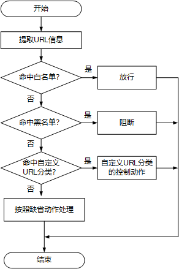

### 1. **URL 过滤**
- **定义**：URL过滤是一种限制用户可以访问Web 内容的技术。通过允许或禁止用户访问某些网页资源，达到初步清理情色、暴力、诈骗以及机器生成的垃圾信息。
 >

- **常用方法**: 黑白名单机制和URL分类法
**黑白名单机制**：先判断是否属于黑名单，匹配则将拒绝URL请求；再判断网页是否属于白名单，匹配则允许该URL请求。其中，白名单的优先级高于黑名单。

**URL分类法**：预先将海量的URL划分归类，比如：色情类，博彩类，钓鱼类等等。根据匹配结果和预先设定的动作决定允许还是拒绝。

- **匹配方式**
**前缀匹配**：匹配所有以指定字符串开头的URL。

**后缀匹配**：匹配所有以指定字符串结尾的URL。

**关键字匹配**：匹配所有包含指定字符串的URL。

**精确匹配**：首先判断URL和指定字符串是否匹配，如果未匹配，则去除URL的最后一个目录，再和指定字符串进行匹配；如果还未匹配，则继续去除URL的最后一个目录，再和指定字符串进行匹配。以此类推，直到用域名去匹配指定的字符串为止。

**匹配优先级**：（1）精确匹配 > 后缀匹配 > 前缀匹配 > 关键字匹配。（2）在同一种匹配方式下，适配度越高的字符串优先级越高。（3）当匹配方式和适配度相同时，配置的动作模式的严格性（严格/宽松）将成为决定性标准。

- **响应动作类别**
**允许**：设备对该HTTP报文不进行处理，允许其通过。

**警告**：设备允许HTTP报文通过，但会记录日志。

**阻断**：设备禁止HTTP报文通过，同时记录日志。同时设备会向发起HTTP请求的用户返回阻断页面。

- **动作模式类别**
**严格模式**：最终动作取所有命中分类中最严格的动作。

**松散模式**：最终动作取所有命中分类中最宽松的动作。

- **参考文献**

1. [URL过滤原理描述 - AR500, AR510, AR531, AR550, AR1500, AR2500 V200R010 配置指南-安全（命令行） - 华为 (huawei.com)](https://support.huawei.com/enterprise/zh/doc/EDOC1100034260/9b51fc47)

2. [URL过滤-阿里云开发者社区 (aliyun.com)](https://developer.aliyun.com/article/1513601#:~:text=URL%E8%BF%87%E6%BB%A4%E6%98%AF%E4%B8%80%E7%A7%8D%E9%92%88%E5%AF%B9%E7%94%A8%E6%88%B7%E7%9A%84URL%E8%AF%B7%E6%B1%82%E8%BF%9B%E8%A1%8C%E4%B8%8A%E7%BD%91%E6%8E%A7%E5%88%B6%E7%9A%84%E6%8A%80%E6%9C%AF%EF%BC%8C%E9%80%9A%E8%BF%87%E5%85%81%E8%AE%B8%E6%88%96%E7%A6%81%E6%AD%A2%E7%94%A8%E6%88%B7%E8%AE%BF%E9%97%AE%E6%9F%90%E4%BA%9B%E7%BD%91%E9%A1%B5%E8%B5%84%E6%BA%90%EF%BC%8C%E8%BE%BE%E5%88%B0%E8%A7%84%E8%8C%83%E4%B8%8A%E7%BD%91%E8%A1%8C%E4%B8%BA%E5%92%8C%E9%99%8D%E4%BD%8E%E5%AE%89%E5%85%A8%E9%A3%8E%E9%99%A9%E7%9A%84%E7%9B%AE%E7%9A%84%E3%80%82,URL%E8%BF%87%E6%BB%A4%E5%8F%AF%E4%BB%A5%E5%9F%BA%E4%BA%8EURL%E5%88%86%E7%B1%BB%E3%80%81%E7%89%B9%E5%AE%9AURL%E7%AD%89%E5%A4%9A%E7%A7%8D%E6%96%B9%E5%BC%8F%E9%99%90%E5%88%B6URL%E8%AE%BF%E9%97%AE%E3%80%82)
