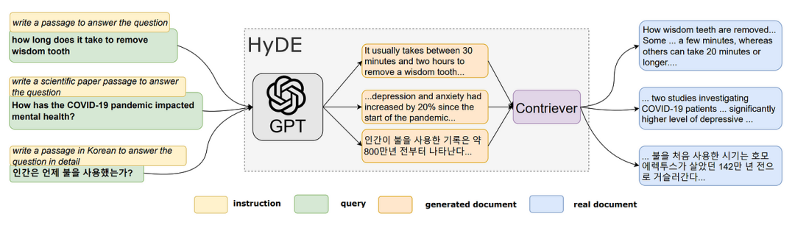
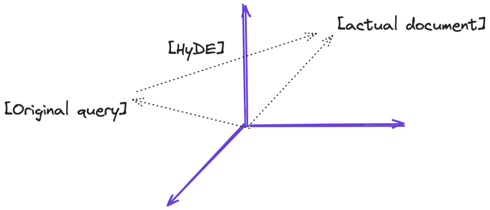
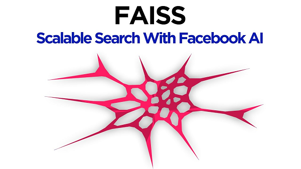
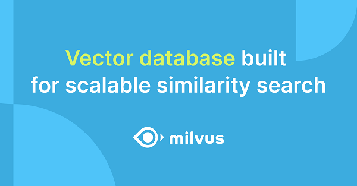
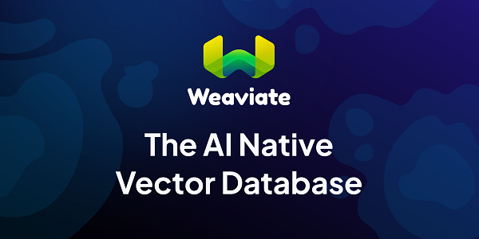
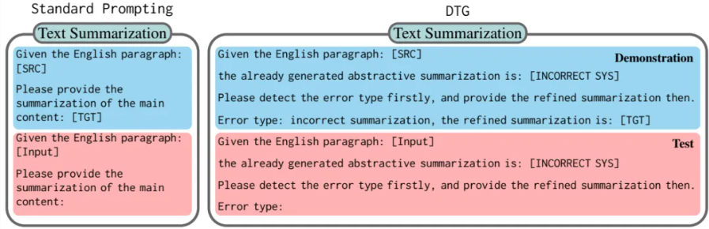
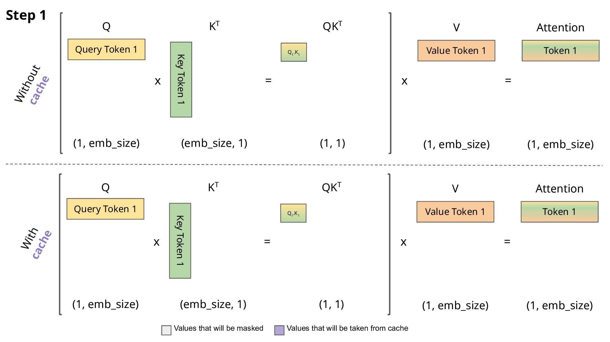
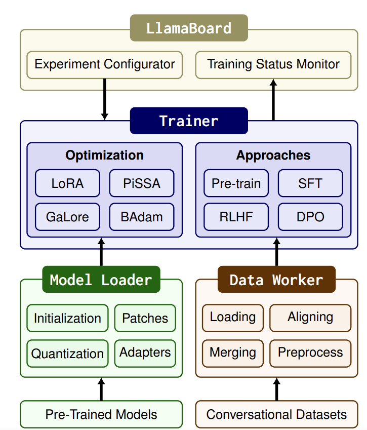
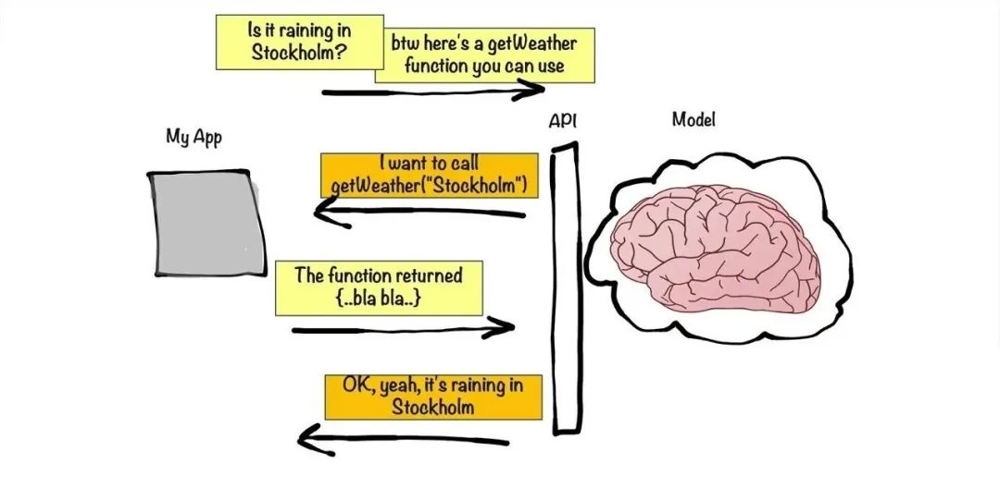

<h1 id="目录">目录</h1>

- [1.RAG应用](#1.RAG应用)
	- [1.RAG文档召回率是什么？](#1.RAG文档召回率是什么？)
	- [2.RAG技术的难点有哪些？](#2.RAG技术的难点有哪些？)
	- [3.RAG存在的一些问题和避免方式有哪些？](#3.RAG存在的一些问题和避免方式有哪些？)
	- [4.在大模型工程应用中RAG与LLM微调优化哪个是最优解?](#4.在大模型工程应用中RAG与LLM微调优化哪个是最优解?)
	- [5.基于langchain的本地文档问答系统实现步骤有哪些?](#5.基于langchain的本地文档问答系统实现步骤有哪些?)
	- [6.如何保证文档切片不会造成相关内容的丢失？文档切片的大小如何控制？](#6.如何保证文档切片不会造成相关内容的丢失？文档切片的大小如何控制？)
	- [7.RAG之假设文档嵌入(HyDE)](#7.RAG之假设文档嵌入(HyDE))
	- [8.RAG的评估指标有哪些？](#8.RAG的评估指标有哪些？)
	- [9.llama-index的索引类别有哪些？](#9.llama-index的索引类别有哪些？)
	- [10.向量数据库介绍](#10.向量数据库介绍)
	- [11.RAG之Re-Ranking机制介绍](#11.RAG之Re-Ranking机制介绍)
	- [12.RAG之Embedding模型介绍](#12.RAG之Embedding模型介绍)
	- [13.RAG之PDF文档加载器介绍](#13.RAG之PDF文档加载器介绍)
	- [14.RAG之chunking方法介绍](#14.RAG之chunking方法介绍)
	- [15.RAG之查询重写的策略介绍](#15.RAG之查询重写的策略介绍)
	- [16.介绍一下 LangChain](#16.介绍一下LangChain)
	- [17.LangChain 中 Chat Message History 是什么？](#17.LangChain中ChatMessageHistory是什么？)
	- [18.LangChain 中 LangChain Agent 是什么？](#18.LangChain中LangChainAgent是什么？)
	- [19.LangChain 支持哪些功能?](#19.LangChain支持哪些功能?)
	- [20.什么是 LangChain model?](#20.什么是LangChainmodel?)
	- [21.LangChain 如何链接多个组件处理一个特定的下游任务？](#21.LangChain如何链接多个组件处理一个特定的下游任务？)

- [2.提示工程](#2.提示工程)
	- [1.零样本提示（Zero shot）是什么？](#1.零样本提示是什么？)
	- [2.少样本提示（Few shot）是什么？](#2.少样本提示是什么？)
	- [3.检索增强生成（Retrieval augmented generation, RAG）是什么？](#3.检索增强生成是什么？)
	- [4.思考链提示（Chain of thought, COT）是什么？](#4.思考链提示是什么？)
	- [5.自我一致性（Self-consistency）是什么？](#5.自我一致性是什么？)
	- [6.ReAct提示 （Reasoning and action, ReAct）是什么？](#6.ReAct提示是什么？)
	- [7.思维树提示 （Tree of thought, TOT）是什么？](#7.思维树提示是什么？)
	- [8.方向刺激提示 （Directional stimulus prompting）是什么？](#8.方向刺激提示是什么？)
	- [9.基于图的提示 （Graph prompting）是什么？](#9.基于图的提示是什么？)
	- [10.多模态思维链提示 （Multimodel COT）是什么？](#10.多模态思维链提示是什么？)
	- [11.程序辅助语言模型提示（Program-Aided Language Models）是什么？](#11.程序辅助语言模型提示是什么？)
	- [12.主动提示（Active-prompt）是什么？](#12.主动提示是什么？)
	- [13.生成知识提示（Generated knowledge prompt）是什么](#13.生成知识提示是什么)
	- [14.解释ChatGPT的“零样本”和“少样本”学习的概念](#14.解释ChatGPT的“零样本”和“少样本”学习的概念)
	- [15.什么是DTG提示方法？](#15.什么是DTG提示方法？)
- [3.推理优化](#3.推理优化)
	- [1.简要介绍一下KV-Cache](#1.简要介绍一下KV-Cache)
	- [2.kv-cache的作用](#2.kv-cache的作用)
	- [3.什么是llama-index？](#3.什么是llama-index？)
	- [4.什么是LangChain？](#4.什么是LangChain？)
	- [5.llama-index和LangChain的区别和联系](#5.llama-index和LangChain的区别和联系)
  - [6.llama-factory简单介绍](#6.llama-factory简单介绍)
- [4.工具调用](#4.工具调用)
	- [1.什么是自然语言接口？](#1.什么是自然语言接口？)
	- [2.什么是函数调用？](#2.什么是函数调用？)


- [4.Agent](#4.agent)
	- [1.什么是agent？](#1.什么是自然语言接口？)
	- [2.什么是函数调用？](#2.什么是函数调用？)


- [5.Agent应用](#5.Agent应用)
	- [1.什么是大模型Agent？其核心能力与传统AI系统有何区别？](#1.什么是大模型Agent？其核心能力与传统AI系统有何区别？)
	- [2.如何设计一个支持多轮对话的Agent？需考虑哪些关键技术模块？](#2.如何设计一个支持多轮对话的Agent？需考虑哪些关键技术模块？)
	- [3.如何解决大模型Agent的“幻觉”（生成错误事实）问题？](#3.如何解决大模型Agent的“幻觉”（生成错误事实）问题？)
	- [4.请解释Agent中“ReAct”框架的原理，并举一个应用案例。](#4.请解释Agent中“ReAct”框架的原理，并举一个应用案例。)
	- [5.如何让Agent具备长期记忆能力？请列举两种技术方案。](#5.如何让Agent具备长期记忆能力？请列举两种技术方案。)
 	- [6.在工具调用场景中，如何让Agent动态选择最佳工具？](#6.在工具调用场景中，如何让Agent动态选择最佳工具？)
	- [7.如何优化大模型Agent的响应延迟？列举三种工程方法。](#7.如何优化大模型Agent的响应延迟？列举三种工程方法。)
	
<h2 id="1.RAG应用"> 1.RAG应用 </h2>


<h3 id="1.RAG文档召回率是什么？">1.RAG文档召回率是什么？</h3>

RAG（Retrieval-Augmented Generation）中的文档召回率（Document Recall）是指在检索阶段，模型能够成功找到与用户查询相关的所有文档的比例。具体来说，它衡量的是在所有相关文档中，有多少被成功检索到了。

文档召回率是评估检索系统性能的重要指标。它可以用以下公式计算：文档召回率=成功检索到的相关文档数量/所有相关文档数量

在RAG中，文档召回率的高低直接影响生成模型的表现。如果召回率低，生成模型可能会缺乏足够的背景信息，从而影响答案的准确性和相关性。

要提高文档召回率，可以采取以下措施：

1. 改进检索模型：使用更先进的检索模型，如Dense Passage Retrieval (DPR) 或改进BM25算法，来提高相关文档的检索效果。

2. 扩展检索范围：增加知识库的规模和多样性，以确保包含更多潜在相关文档。

3. 优化检索策略：调整检索策略，使用多轮检索或结合多个检索模型的结果，来提高召回率。

高召回率可以确保生成模型有更丰富的信息源，从而提高最终生成答案的准确性和可靠性。


<h3 id="2.RAG技术的难点有哪些？">2.RAG技术的难点有哪些？</h3>

（1）数据处理

目前的数据文档种类多，包括doc、ppt、excel、pdf扫描版和文字版。ppt和pdf中包含大量架构图、流程图、展示图片等都比较难提取。而且抽取出来的文字信息，不完整，碎片化程度比较严重。

而且在很多时候流程图，架构图多以形状元素在PPT中呈现，光提取文字，大量潜藏的信息就完全丢失了。

（2）数据切片方式

不同文档结构影响，需要不同的切片方式，切片太大，查询精准度会降低，切片太小一段话可能被切成好几块，每一段文本包含的语义信息是不完整的。

（3）内部知识专有名词不好查询

目前较多的方式是向量查询，对于专有名词非常不友好；影响了生成向量的精准度，以及大模型输出的效果。

（4）新旧版本文档同时存在

一些技术报告可能是周期更新的，召回的文档如下就会出现前后版本。

（5）复杂逻辑推理

对于无法在某一段落中直接找到答案的，需要深层次推理的问题难度较大。

（6）金融行业公式计算

如果需要计算行业内一些专业的数据，套用公式，对RAG有很大的难度。

（7）向量检索的局限性

向量检索是基于词向量的相似度计算，如果查询语句太短词向量可能无法反映出它们的真实含义，也无法和其他相关的文档进行有效的匹配。这样就会导致向量检索的结果不准确，甚至出现一些完全不相关的内容。

（8）长文本

（9）多轮问答


<h3 id="3.RAG存在的一些问题和避免方式有哪些？">3.RAG存在的一些问题和避免方式有哪些？</h3>

（1）分块（Chunking）策略以及Top-k算法

一个成熟的RAG应该支持灵活的分块，并且可以添加一点重叠以防止信息丢失。用固定的、不适合的分块策略会造成相关度下降。最好是根据文本情况去适应。

在大多数设计中，top_k是一个固定的数字。因此，如果块大小太小或块中的信息不够密集，我们可能无法从向量数据库中提取所有必要的信息。

（2）世界知识缺失

比如我们正在构建一个《西游记》的问答系统。我们已经把所有的《西游记》的故事导入到一个向量数据库中。现在，我们问它：人有几个头?

最有可能的是，系统会回答3个，因为里面提到了哪吒有“三头六臂”，也有可能会说很多个，因为孙悟空在车迟国的时候砍了很多次头。而问题的关键是小说里面不会正儿八经地去描述人有多少个头，所以RAG的数据有可能会和真实世界知识脱离。

（3）多跳问题（推理能力）

让我们考虑另一个场景：我们建立了一个基于社交媒体的RAG系统。那么我们的问题是：谁知道埃隆·马斯克？然后，系统将遍历向量数据库，提取埃隆·马斯克的联系人列表。由于chunk大小和top_k的限制，我们可以预期列表是不完整的；然而，从功能上讲，它是有效的。

现在，如果我们重新思考这个问题：除了艾梅柏·希尔德，谁能把约翰尼·德普介绍给伊隆·马斯克？单次信息检索无法回答这类问题。这种类型的问题被称为多跳问答。解决这个问题的一个方法是:

    找回埃隆·马斯克的所有联系人
    找回约翰尼·德普的所有联系人
    看看这两个结果之间是否有交集，除了艾梅柏·希尔德
    如果有交集，返回结果，或者将埃隆·马斯克和约翰尼·德普的联系方式扩展到他们朋友的联系方式并再次检查。

有几种架构来适应这种复杂的算法，其中一个使用像ReACT这样复杂的prompt工程，另一个使用外部图形数据库来辅助推理。我们只需要知道这是RAG系统的限制之一。

（4）信息丢失

RAG系统中的流程链:

    将文本分块（chunking）并生成块（chunk）的Embedding
    通过语义相似度搜索检索数据块
    根据top-k块的文本生成响应  


<h3 id="4.在大模型工程应用中RAG与LLM微调优化哪个是最优解?">4.在大模型工程应用中RAG与LLM微调优化哪个是最优解?</h3>

RAG: 将检索(或搜索)的能力集成到LLM文本生成中，结合了检索系统(从大型语料库中获取相关文档片段)和LLM(使用这些片段中的信息生成答案)。
微调: 对预训练的LLM模型在特定数据集上进一步训练，使其适应特定任务或提高其性能的过程。

一般在工程中考虑使用RAG还是LLM需要从以下几点考虑：

（1）如果需要访问大量的外部数据，并且要实时更新。RAG系统在具有动态数据的环境中具有固有的优势。它们的检索机制不断地查询外部源，确保它们用于生成响应的信息是最新的。随着外部知识库或数据库的更新，RAG系统无缝地集成了这些更改，在不需要频繁的模型再训练的情况下保持其相关性。

（2）如果我们需要改变模型的输出风格，如我们想让模型听起来更像医学专业人士，用诗意的风格写作，或者使用特定行业的行话，那么对特定领域的数据进行微调可以让我们实现这些定制。

RAG虽然在整合外部知识方面很强大，但主要侧重于信息检索。

（3）一般来说RAG与LLM微调可以单独使用也可以组合使用。

（4）通过将模型在特定领域的数据中微调可以一定程度上减少幻觉。然而当面对不熟悉的输入时，模型仍然可能产生幻觉。相反，RAG系统天生就不容易产生幻觉，因为它们的每个反应都是基于检索到的证据。
    
    
<h3 id="5.基于langchain的本地文档问答系统实现步骤有哪些?">5.基于langchain的本地文档问答系统实现步骤有哪些?</h3>

项目实现过程包括加载文件、读取文本、文本分割、文本向量化、问句向量化、在文本向量中匹配出与问句向量最相似的topk个、匹配出的文本作为上下文和问题一起添加到prompt中、提交给LLM生成回答。


<h3 id="6.如何保证文档切片不会造成相关内容的丢失？文档切片的大小如何控制？">6.如何保证文档切片不会造成相关内容的丢失？文档切片的大小如何控制？</h3>
一、一般的文本切分可以按照字符、长度或者语义（经过NLP语义分析的模型）进行拆分。

二、刚好有一段完整的文本，如果切太小，那么则会造成信息丢失，给 LLM 的内容则不完整。太大则不利于向量检索命中。

文本切片不要使用固定长度，可以采用 LangChain 的 MultiVector Retriever ，它的主要是在做向量存储的过程进一步增强文档的检索能力。LangChain 有 Parent Document Retriever 采用的方案是用小分块保证尽可能找到更多的相关内容，用大分块保证内容完整性， 这里的大块文档是指 Parent Document 。MultiVector Retriever 在 Parent Document Retriever 基础之上做了能力扩充。

参考链接：https://python.langchain.com/v0.1/docs/modules/data_connection/retrievers/multi_vector/


<h3 id="7.RAG之假设文档嵌入(HyDE)">7.RAG之假设文档嵌入(HyDE)</h3>

### 什么是HyDE
HyDE 使用一个语言学习模型，比如 ChatGPT，在响应查询时创建一个理论文档，而不是使用查询及其计算出的向量直接在向量数据库中搜索。它更进一步，通过对比方法学习无监督编码器。这个编码器将理论文档转换为一个嵌入向量，以便在向量数据库中找到相似的文档。它不是寻求问题或查询的嵌入相似性，而是专注于答案到答案的嵌入相似性。它的性能非常稳健，在各种任务（如网络搜索、问答和事实核查）中的表现与经过良好调整的检索器相匹配。



该流程主要分为四个步骤：

1) 使用LLM基于查询生成k个假设文档。这些生成的文件可能不是事实，也可能包含错误，但它们应该于相关文件相似。此步骤的目的是通过LLM解释用户的查询。

2) 将生成的假设文档输入编码器，将其映射到密集向量$f\left(d_{k}\right)$，编码器具有过滤功能，过滤掉假设文档中的噪声。这里，dk表示第k个生成的文档，f表示编码器操作。

3) 使用给定的公式计算以下k个向量的平均值 $\mathbf{v}=\frac{1}{N} \sum_{k=1}^{N} f\left(d_{k}\right)$ ，可以将原始查询q视为一个可能的假设： $\mathbf{v}=\frac{1}{N+1} \sum_{k=1}^{N}\left[f\left(d_{k}\right)+f(q)\right]$ 

4) 使用向量v从文档库中检索答案。如步骤3中所建立的，该向量保存来自用户的查询和所需答案模式的信息，这可以提高回忆。HyDE的目标是生成假设文档，以便最终查询向量v与向量空间中的实际文档尽可能紧密地对齐。



### HyDE的作用

在检索增强生成（RAG）中，经常遇到用户原始查询的问题，如措辞不准确或缺乏语义信息，比如“The NBA champion of 2020 is the Los Angeles Lakers! Tell me what is langchain framework?”这样的查询，如果直接进行搜索，那么LLM可能会给出不正确或无法回答的回答。因此，将用户查询的语义空间与文档的语义空间对齐是至关重要的。查询重写技术可以有效地解决这一问题，从RAG流程的角度来看，查询重写是一种预检索方法。HyDE通过假设文档来对齐查询和文档的语义空间。


<h3 id="8.RAG的评估指标有哪些？">8.RAG的评估指标有哪些？</h3>

### Context precision上下文精确度

评估检索质量，衡量上下文中所有相关的真实信息是否被排在较高的位置。理想情况下，所有相关的信息快都应该出现在排名的最前面。这个指标是根据问题和上下文来计算的，数值范围在0~1之间，分数越高表示精确度越好。

### Context Recall上下文召回率

衡量检索的完整性，用来衡量检索到的上下文与被视为事实真相的标注答案的一致性程度。根据事实真相和检索到的上下文来计算，数值范围在0~1之间，数值越高表示性能越好。为了从事实真相的答案中估计上下午的召回率，需要分析答案中的每个句子是否可以归因于检索到的上下文。在理想情况下，事实真相答案中的所有句子都应该能够对应到检索到的上下文中。

### Faithfulness忠实度

衡量生成答案中的幻觉情况，衡量生成答案与给定上下文之间的事实一致性。忠实度得分是基于答案和检索到的上下文计算出来的，答案的评分范围在0~1之间，分数越高越好。

### Answer Relevance答案相关性

衡量答案对问题的直接性（紧扣问题的核心），旨在评估生成答案与给定提示的相关程度。如果答案不完整或包含冗余信息，则会被赋予较低的分数。这个指标使用问题和答案来计算，其值介于0~1之间，得分越高表明答案的相关性越好。


<h3 id="9.llama-index的索引类别有哪些？">9.llama-index的索引类别有哪些？</h3>

### 索引的概念

Index是一种数据结构，允许我们快速检索用户查询的相关上下文。对于 LlamaIndex 来说，它是检索增强生成 (RAG) 用例的核心基础。在高层次上，Indexes是从Documents构建的。它们用于构建查询引擎和聊天引擎 ，从而可以通过数据进行问答和聊天。在底层，Indexes将数据存储在Node对象中（代表原始文档的块），并公开支持额外配置和自动化的Retriever接口。

- Node：对应于文档中的一段文本。LlamaIndex 接收 Document 对象并在内部将它们解析/分块为 Node 对象。

- Response Synthesis：我们的模块根据检索到的节点合成响应。

llam-index有以下五种索引

1) Summary Index ,将节点存储为顺序链


2) Vector Store Index，将每个节点及其相应的嵌入存储在向量存储中


3) Tree Index，从一组节点（在此树中成为叶节点)构建一个层次结构树


4) Keyword Table Index，从每个节点中提取关键字，并建立从每个关键字到相应节点的映射。


5) Property Graph Index，构建包含标记节点和关系的知识图谱。这个图的构造是非常可定制的，从让 LLM 提取它想要的任何内容，到使用严格的模式提取，甚至实现你自己的提取模块，也可以嵌入节点以供以后检索。

[llama-index文档链接](https://docs.llamaindex.ai/en/stable/module_guides/indexing/index_guide)


<h3 id="10.向量数据库介绍">10.向量数据库介绍</h3>

### 什么是向量数据库

向量数据库是一种将数据存储为高维向量的数据库，高维向量是特征或属性的数学表示。每个向量都有一定数量的维度，范围从几十到几千不等，具体取决于数据的复杂性和粒度。向量数据库同时具有CRUD操作、元数据过滤和水平扩展等功能。通过复杂的查询语言，利用资源管理、安全控制、可扩展性、容错能力和高效信息检索等数据库功能，可以提高应用程序开发效率.

### 向量数据库的特点

- 支持向量相似性搜索，它会找到与查询向量最近的 k 个向量，这是通过相似性度量来衡量的。 向量相似性搜索对于图像搜索、自然语言处理、推荐系统和异常检测等应用非常有用。

- 使用向量压缩技术来减少存储空间并提高查询性能。向量压缩方法包括标量量化、乘积量化和各向异性向量量化。

- 可以执行精确或近似的最近邻搜索，具体取决于准确性和速度之间的权衡。精确最近邻搜索提供了完美的召回率，但对于大型数据集可能会很慢。近似最近邻搜索使用专门的数据结构和算法来加快搜索速度，但可能会牺牲一些召回率。

- 支持不同类型的相似性度量，例如 L2 距离、内积和余弦距离。不同的相似性度量可能适合不同的用例和数据类型。

可以处理各种类型的数据源，例如文本、图像、音频、视频等。 

- 可以使用机器学习模型将数据源转化为向量嵌入，例如词嵌入、句子嵌入、图像嵌入等。

### 有哪些向量数据库

1、Elasticsearch

ElasticSearch是一个支持各种类型数据的分布式搜索和分析引擎。 Elasticsearch 支持的数据类型之一是向量字段，它存储密集的数值向量。


在 7.10 版本中，Elasticsearch 添加了对将向量索引到专用数据结构的支持，以支持通过 kNN 搜索 API 进行快速 kNN 检索。 在 8.0 版本中，Elasticsearch 添加了对带有向量场的原生自然语言处理 (NLP) 的支持。

2、Faiss

Meta的Faiss是一个用于高效相似性搜索和密集向量聚类的库。 它包含搜索任意大小的向量集的算法，直到可能不适合 RAM 的向量集。 它还包含用于评估和参数调整的支持代码。



3、Milvus  

Milvus是一个开源向量数据库，可以管理万亿向量数据集，支持多种向量搜索索引和内置过滤。



4、Weaviate

Weaviate是一个开源向量数据库，允许你存储数据对象和来自你最喜欢的 ML 模型的向量嵌入，并无缝扩展到数十亿个数据对象。



5、Pinecone

Pinecone专为机器学习应用程序设计的向量数据库。 它速度快、可扩展，并支持多种机器学习算法。


Pinecone 建立在 Faiss 之上，Faiss 是一个用于密集向量高效相似性搜索的库。

6、Qdrant

Qdrant是一个向量相似度搜索引擎和向量数据库。 它提供了一个生产就绪的服务，带有一个方便的 API 来存储、搜索和管理点带有额外有效负载的向量。


Qdrant 专为扩展过滤支持而定制。 它使它可用于各种神经网络或基于语义的匹配、分面搜索和其他应用程序。

7、Vespa

Vespa是一个功能齐全的搜索引擎和向量数据库。 它支持向量搜索 (ANN)、词法搜索和结构化数据搜索，所有这些都在同一个查询中。 集成的机器学习模型推理允许你应用 AI 来实时理解你的数据。


8、Vald

Vald是一个高度可扩展的分布式快速近似最近邻密集向量搜索引擎。 Vald是基于Cloud-Native架构设计和实现的。 它使用最快的 ANN 算法 NGT 来搜索邻居。


Vald 具有自动向量索引和索引备份，以及水平缩放，可从数十亿特征向量数据中进行搜索。

9、ScaNN (Google Research)  

ScaNN（Scalable Nearest Neighbours）是一个用于高效向量相似性搜索的库，它找到 k 个与查询向量最近的向量，通过相似性度量来衡量。向量相似性搜索对于图像搜索、自然语言处理、推荐系统和异常检测等应用非常有用。

10、pgvector

pgvector是PostgreSQL 的开源扩展，允许你在数据库中存储和查询向量嵌入。 它建立在 Faiss 库之上，Faiss 库是一个流行的密集向量高效相似性搜索库。 pgvector 易于使用，只需一条命令即可安装。


<h3 id="11.RAG之Re-Ranking机制介绍">11.RAG之Re-Ranking机制介绍</h3>

### 为什么要用Re-Ranking？

#### 检索阶段的挑战

- 在RAG模型中，检索器负责从大规模的语料库中检索与输入问题相关的文档。然而，由于语料库的广泛性和多样性，检索器可能返回的文档的相关性会有所不同。这种不确定性带来了两个主要挑战：

- 文档相关性差异： 检索器返回的文档可能在相关性上存在差异，有些文档可能与输入问题高度相关，而有些文档可能相关性较低。这种差异性使得直接使用检索器返回的文档进行生成可能会导致结果的不准确或不相关。

- 信息不完整性： 检索器返回的文档通常只是初步筛选，其中可能包含了一些噪音或不相关的信息。这使得生成器在生成结果时面临着信息不完整的挑战，需要进一步处理以提高结果的质量。

因此，为了克服这些挑战，需要引入Re-Ranking机制对检索器返回的文档进行再排序，以确保最终使用的文档具有更高的相关性和质量。

#### 提高生成质量

- Re-Ranking机制不仅可以解决检索阶段的挑战，还可以显著提高生成结果的质量。通过对检索器返回的文档进行再排序，Re-Ranking机制可以使生成器在生成结果时更加准确、相关。

- 具体来说，Re-Ranking机制可以帮助生成器更好地理解和利用检索到的信息，从而生成更加贴近输入问题的文本。它可以过滤掉不相关或噪音信息，强化相关文档的影响，从而提高生成结果的相关性和准确性。这样，Re-Ranking机制不仅可以提高生成结果的质量，还可以增强模型对输入问题的理解能力，使得模型在实际应用中更加可靠和实用。

### 什么是Re-Ranking

Re-Ranking是指在RAG模型中对检索器返回的文档进行再排序的过程。其目的是通过重新排列候选文档，使得生成器更好地利用相关信息，并生成与输入问题更加相关和准确的结果。

在RAG中，Re-Ranking的关键目标是提高生成结果的相关性和质量。通过对检索器返回的文档进行再排序，Re-Ranking可以将与输入问题更加相关的文档排在前面，从而使得生成器在生成结果时能够更加准确地捕捉到输入问题的语境和要求，进而生成更加合适的答案或文本。

### Re-Ranking的步骤

Re-Ranking的过程可以分为以下几个步骤：

- 检索文档： 首先，RAG模型通过检索器从大规模语料库中检索相关文档，这些文档被认为可能包含了与输入问题相关的信息。

- 特征提取： 对检索到的文档进行特征提取，通常会使用各种特征，如语义相关性、词频、TF-IDF值等。这些特征能够帮助模型评估文档与输入问题的相关性。

- 排序文档： 根据提取的特征，对检索到的文档进行排序，将与输入问题最相关的文档排在前面，以便后续生成器使用。

- 重新生成： 排序完成后，生成器将重新使用排在前面的文档进行文本生成，以生成最终的输出结果。

### Re-Ranking的方法

在RAG中，有多种方法可以实现Re-Ranking，包括但不限于：

- 基于特征的Re-Ranking： 根据检索到的文档提取特征，并利用这些特征对文档进行排序，以提高与输入问题相关的文档在排序中的优先级。

- 学习型Re-Ranking： 使用机器学习算法，如支持向量机（SVM）、神经网络等，根据历史数据和标注样本，学习文档与输入问题之间的相关性，并利用学习到的模型对文档进行再排序。

- 混合方法： 将基于特征的方法和学习型方法结合起来，以充分利用特征提取和机器学习的优势，从而更好地实现Re-Ranking的目标。

### Re-Ranking的优化策略

在实际应用中，我们可以采用一些优化策略来进一步提高Re-Ranking的性能和效果：

- 特征优化： 不断优化提取的特征，使其更能反映文档与输入问题的相关性，从而提高Re-Ranking的准确性。

- 模型调优： 如果采用学习型的Re-Ranking方法，可以通过调整模型结构、超参数等来提高模型的性能，使其更好地适应具体的应用场景。

- 多模态融合： 结合文本信息以外的其他模态信息，如图像、视频等，可以提供更多的信息来辅助Re-Ranking，从而提高最终结果的质量。

- 实时调整： 根据实际应用情况，动态调整Re-Ranking策略，以适应不同类型的输入问题和文档。

### 当前Re-Ranking面临的挑战

在实际应用中，Re-Ranking面临一些挑战，限制了其性能和效果，主要包括：

- 计算复杂性： Re-Ranking过程涉及对大规模文档进行排序和评估，计算复杂度较高。尤其是对于大型语料库和实时应用场景，计算资源需求巨大，需要寻找高效的算法和技术来加速处理。

- 可解释性和透明度： Re-Ranking的结果直接影响生成结果的质量，但其内部工作机制通常较为复杂，缺乏可解释性和透明度。这使得难以理解和调试Re-Ranking过程中的问题，也限制了用户对结果的信任度。

-   数据偏差和公平性： Re-Ranking的效果往往受到数据的影响，如果训练数据存在偏差，可能会导致Re-Ranking结果的偏差。此外，Re-Ranking策略可能对不同群体或类别的文档产生不同程度的影响，需要考虑公平性和平衡性的问题。


<h3 id="12.RAG之Embedding模型介绍">12.RAG之Embedding模型介绍</h3>

1.BGE

BGE，即BAAI General Embedding，是由智源研究院（BAAI）团队开发的一款文本Embedding模型。该模型可以将任何文本映射到低维密集向量，这些向量可用于检索、分类、聚类或语义搜索等任务。此外，它还可以用于LLMs的向量数据库。

BGE模型在2023年有多次更新，包括发布论文和数据集、发布新的reranker模型以及更新Embedding模型。BGE模型已经集成到Langchain中，用户可以方便地使用它。此外，BGE模型在MTEB和C-MTEB基准测试中都取得了第一名的成绩。

BGE模型的主要特点如下：

- 多语言支持：BGE模型支持中英文。

- 多版本：BGE模型有多个版本，包括bge-large-en、bge-base-en、bge-small-en等，以满足不同的需求。

- 高效的reranker：BGE提供了reranker模型，该模型比Embedding模型更准确，但比Embedding模型更耗时。因此，它可以用于重新排名Embedding模型返回的前k个文档。

- 开源和许可：BGE模型是开源的，并在MIT许可下发布。这意味着用户可以免费用于商业目的。

- 丰富集成：用户可以使用FlagEmbedding、Sentence-Transformers、Langchain或Huggingface Transformers等工具来使用BGE模型。

2.GTE

GTE模型，也称为General Text Embeddings，是阿里巴巴达摩院推出的文本Embedding技术。它基于BERT框架构建，并分为三个版本：GTE-large、GTE-base和GTE-small。

该模型在大规模的多领域文本对语料库上进行训练，确保其广泛适用于各种场景。因此，GTE可以应用于信息检索、语义文本相似性、文本重新排序等任务。

尽管GTE模型的参数规模为110M，但其性能卓越。它不仅超越了OpenAI的Embedding API，在大型文本Embedding基准测试中，其表现甚至超过了参数规模是其10倍的其他模型。更值得一提的是，GTE模型可以直接处理代码，无需为每种编程语言单独微调，从而实现优越的代码检索效果。

3.E5 Embedding

E5-embedding是由intfloat团队研发的一款先进的Embedding模型。E5的设计初衷是为各种需要单一向量表示的任务提供高效且即用的文本Embedding，与其他Embedding模型相比，E5在需要高质量、多功能和高效的文本Embedding的场景中表现尤为出色。

E5-embedding的主要特点：

- 新的训练方法：E5采用了“EmbEddings from bidirEctional Encoder rEpresentations”这一创新方法进行训练，这意味着它不仅仅依赖传统的有标记数据，也不依赖低质量的合成文本对。

- 高质量的文本表示：E5能为文本提供高质量的向量表示，这使得它在多种任务上都能表现出色，尤其是在需要句子或段落级别表示的任务中。

- 多场景：无论是在Zero-shot场景还是微调应用中，E5都能提供强大的现成文本Embedding，这使得它在多种NLP任务中都有很好的应用前景。

4.Jina Embedding

jina-embedding-s-en-v1是Jina AI的Finetuner团队精心打造的文本Embedding模型。它基于Jina AI的Linnaeus-Clean数据集进行训练，这是一个包含了3.8亿对句子的大型数据集，涵盖了查询与文档之间的配对。这些句子对涉及多个领域，并已经经过严格的筛选和清洗。值得注意的是，Linnaeus-Clean数据集是从更大的Linnaeus-Full数据集中提炼而来，后者包含了高达16亿的句子对。

Jina Embedding的主要特点：

- 广泛应用：jina-embedding-s-en-v1适合多种场景，如信息检索、语义文本相似性判断和文本重新排序等。

- 卓越性能：虽然该模型参数量仅为35M，但其性能出众，而且能够快速进行推理。

- 多样化版本：除了标准版本，用户还可以根据需求选择其他大小的模型，包括14M、110M、330M

5.Instructor

Instructor是由香港大学自然语言处理实验室团队推出的一种指导微调的文本Embedding模型。该模型可以生成针对任何任务（例如分类、检索、聚类、文本评估等）和领域（例如科学、金融等）的文本Embedding，只需提供任务指导，无需任何微调。Instructor在70个不同的Embedding任务（MTEB排行榜）上都达到了最先进的性能。该模型可以轻松地与定制的sentence-transformer库一起使用。

Instructor的主要特点：

- 多任务适应性：只需提供任务指导，即可生成针对任何任务的文本Embedding。

- 高性能：在MTEB排行榜上的70个不同的Embedding任务上都达到了最先进的性能。

- 易于使用：与定制的sentence-transformer库结合使用，使得模型的使用变得非常简单。

6.XLM-Roberta

XLM-Roberta（简称XLM-R）是Facebook AI推出的一种多语言版本的Roberta模型。它是在大量的多语言数据上进行预训练的，目的是为了提供一个能够处理多种语言的强大的文本表示模型。XLM-Roberta模型在多种跨语言自然语言处理任务上都表现出色，包括机器翻译、文本分类和命名实体识别等。

XLM-Roberta的主要特点：

- 多语言支持：XLM-Roberta支持多种语言，可以处理来自不同语言的文本数据。

- 高性能：在多种跨语言自然语言处理任务上，XLM-Roberta都表现出了最先进的性能。

- 预训练模型：XLM-Roberta是在大量的多语言数据上进行预训练的，这使得它能够捕获跨语言的文本表示。

7.text-embedding-ada-002

text-embedding-ada-002是一个由Xenova团队开发的文本Embedding模型。该模型提供了一个与Hugging Face库兼容的版本的text-embedding-ada-002分词器，该分词器是从openai/tiktoken适应而来的。这意味着它可以与Hugging Face的各种库一起使用，包括Transformers、Tokenizers和Transformers.js。

text-embedding-ada-002的主要特点：

- 兼容性：该模型与Hugging Face的各种库兼容，包括Transformers、Tokenizers和Transformers.js。

- 基于openai/tiktoken：该模型的分词器是从openai/tiktoken适应而来的。


<h3 id="13.RAG之PDF文档加载器介绍">13.RAG之PDF文档加载器介绍</h3>

### PDF的解析方法：

- 基于规则的方法：根据文档的组织特征确定每个部分的风格和内容。然而，这种方法不是很通用，因为PDF有很多类型和布局，不可能用预定义的规则覆盖所有类型和布局。

- 基于深度学习模型的方法：例如将目标检测和OCR模型相结合的流行解决方案。

- 基于多模态大模型对复杂结构进行Pasing或提取PDF中的关键信息。

### 常见的PDF文档加载器

1) PyPDF

PyPDF 是一个用于处理PDF文件的Python库。它提供了一系列的功能，允许用户读取、写入、分析和修改PDF文档。在LangChain中，PyPDFLoader 使用 pypdf 库加载PDF文档为文档数组，PDF将会按照page逐页读取，每个文档包含页面内容和带有页码的元数据。

```
from langchain_community.document_loaders import PyPDFLoader
loader = PyPDFLoader("example_data/layout-parser-paper.pdf")
pages = loader.load_and_split()
print(pages[0]
```

图片信息提取：pip install rapidocr-onnxruntime

```
from langchain_community.document_loaders import PyPDFLoader
 
loader = PyPDFLoader("https://arxiv.org/pdf/2103.15348.pdf", extract_images=True)
pages = loader.load()
print(pages[4].page_content)
```

2) pyplumber

```
from langchain_community.document_loaders import PDFPlumberLoader
loader = PDFPlumberLoader("example_data/layout-parser-paper.pdf")
pages = loader.load()
```

3) PDFMiner

将整个文档解析成一个完整的文本，文本结构可以自行定义

```
from langchain_community.document_loaders import PDFMinerLoader
loader = PDFMinerLoader("example_data/layout-parser-paper.pdf")
pages = loader.load()
```

以上三种是基于规则解析

4) Unstructured(基于深度学习模型)

非结构化加载器针对不同的文本块创建了不同的元素。默认情况下将其组合在一起，可以通过指定model="elements"保持这种分离，然后根据自己的逻辑进行分离

```
from langchain_community.document_loaders import UnstructuredPDFLoader
loader = UnstructuredPDFLoader("example_data/layout-parser-paper.pdf", model="elements")
pages = loader.load()
```


<h3 id="14.RAG之chunking方法介绍">14.RAG之chunking方法介绍</h3>

1) Fixed size chunking：这是最常见、最直接的分块方法。我们只需决定分块中的tokens数量，以及它们之间是否应该有任何重叠。一般来说，我们希望在块之间保持一些重叠，以确保语义上下文不会在块之间丢失。与其他形式的分块相比，固定大小的分块在计算上便宜且使用简单，因为它不需要使用任何NLP库。

2) Recursive Chunking：递归分块使用一组分隔符，以分层和迭代的方式将输入文本划分为更小的块。如果最初分割文本没有产生所需大小或结构的块，则该方法会使用不同的分隔符或标准递归地调用结果块，直至达到所需的块大小或结构。这意味着，虽然块的大小不会完全相同，但它们仍然具有相似的大小，并可以利用固定大小块和重叠的优点。

3) Document Specific Chunking：该方法不像上述两种方法一样，它不会使用一定数量的字符或递归过程，而是基于文档的逻辑部分（如段落或小节）来生成对齐的块。该方法可以保持内容的组织，从而保持了文本的连贯性，比如Markdown、Html等特殊格式。

4) Semantic Chunking：语义分块会考虑文本内容之间的关系。它将文本划分为有意义的、语义完整的块。这种方法确保了信息在检索过程中的完整性，从而获得更准确、更符合上下文的结果。与之前的分块策略相比，速度较慢。


<h3 id="15.RAG之查询重写的策略介绍">15.RAG之查询重写的策略介绍</h3>

### 查询重写的策略

- 假设文档嵌入 (HyDE) ：通过创建虚拟文档来使查询和文档的语义空间保持一致。

- 重写-检索-阅读：提出了一种全新的框架，它颠覆了传统的检索-阅读顺序，将重点放在查询重写上。

- 回溯提示 (Step-Back Prompting)： 允许大语言模型 (LLM) 基于- 高层概念进行抽象推理和检索。

- Query2Doc： 利用来自大语言模型 (LLM) 的少量提示生成伪文档，并将这些伪文档与原始查询合并，构建新的查询。

- ITER-RETGEN：提出了一种迭代式检索生成方法。它将前一次生成的结果与之前的查询相结合，然后检索相关文档并生成新的结果。这个过程会重复多次，直到最终得到理想的结果。


<h3 id="16.介绍一下LangChain">16.介绍一下 LangChain</h3>

💡 [https://python.langchain.com/docs/get_started/introduction](https://python.langchain.com/docs/get_started/introduction)

LangChain 是一个基于语言模型的框架，用于构建聊天机器人、生成式问答（GQA）、摘要等功能。它的核心思想是将不同的组件“链”在一起，以创建更高级的语言模型应用。LangChain 的起源可以追溯到 2022 年 10 月，由创造者 Harrison Chase 在那时提交了第一个版本。与 Bitcoin 不同，Bitcoin 是在 2009 年由一位使用化名 Satoshi Nakamoto 的未知人士创建的，它是一种去中心化的加密货币。而 LangChain 是围绕语言模型构建的框架。

LangChain 包含以下这些核心概念：

StreamlitChatMessageHistory：用于在 Streamlit 应用程序中存储和使用聊天消息历史记录。它使用 Streamlit 会话状态来存储消息，并可以与 ConversationBufferMemory 和链或代理一起使用。

CassandraChatMessageHistory：使用 Apache Cassandra 数据库存储聊天消息历史记录。Cassandra 是一种高度可扩展和高可用的 NoSQL 数据库，适用于存储大量数据。

MongoDBChatMessageHistory：使用 MongoDB 数据库存储聊天消息历史记录。MongoDB 是一种面向文档的 NoSQL 数据库，使用类似 JSON 的文档进行存储。


<h3 id="17.LangChain中ChatMessageHistory是什么？">17.LangChain 中 Chat Message History 是什么？</h3>

💡 [https://python.langchain.com/docs/modules/memory/chat_messages/](https://python.langchain.com/docs/modules/memory/chat_messages/)

Chat Message History 是 Langchain 框架中的一个组件，用于存储和管理聊天消息的历史记录。它可以跟踪和保存用户和AI之间的对话，以便在需要时进行检索和分析。

Langchain 提供了不同的 Chat Message History 实现，包括 StreamlitChatMessageHistory、CassandraChatMessageHistory 和 MongoDBChatMessageHistory。

您可以根据自己的需求选择适合的 Chat Message History 实现，并将其集成到 Langchain 框架中，以便记录和管理聊天消息的历史记录。

请注意，Chat Message History 的具体用法和实现细节可以参考 Langchain 的官方文档和示例代码。

<h3 id="18.LangChain中LangChain Agent是什么？">18.LangChain 中 LangChain Agent 是什么？</h3>

💡 [https://python.langchain.com/docs/modules/agents/](https://python.langchain.com/docs/modules/agents/)

LangChain Agent 是 LangChain 框架中的一个组件，用于创建和管理对话代理。代理是根据当前对话状态确定下一步操作的组件。LangChain 提供了多种创建代理的方法，包括 OpenAI Function Calling、Plan-and-execute Agent、Baby AGI 和 Auto GPT 等。这些方法提供了不同级别的自定义和功能，用于构建代理。

代理可以使用工具包执行特定的任务或操作。工具包是代理使用的一组工具，用于执行特定的功能，如语言处理、数据操作和外部 API 集成。工具可以是自定义构建的，也可以是预定义的，涵盖了广泛的功能。

通过结合代理和工具包，开发人员可以创建强大的对话代理，能够理解用户输入，生成适当的回复，并根据给定的上下文执行各种任务。

以下是使用 LangChain 创建代理的示例代码：

```
from langchain.chat_models import ChatOpenAI
from langchain.agents import tool
# 加载语言模型
llm = ChatOpenAI(temperature=0)
# 定义自定义工具
@tool   def get_word_length(word: str) -> int:
"""返回单词的长度。"""     
return len(word)     
# 创建代理
agent = {       "input": lambda x: x["input"],
"agent_scratchpad": lambda x: format_to_openai_functions(x['intermediate_steps'])   } | prompt | llm_with_tools | OpenAIFunctionsAgentOutputParser()
 # 调用代理
output = agent.invoke({       "input": "单词 educa 中有多少个字母？",       "intermediate_steps": []   })      # 打印结果
print(output.return_values["output"])  
```

这只是一个基本示例，LangChain 中还有更多功能和功能可用于构建和自定义代理和工具包。您可以参考 LangChain 文档以获取更多详细信息和示例。

<h3 id="19.LangChain 支持哪些功能?">19.LangChain 支持哪些功能?</h3>

langChain是一个用于开发由大语言模型支持的应用程序的框架。它提供以下功能：

上下文感知能力：LangChain可以将语言模型与上下文源（提示说明、示例场景、响应内容等）连接起来，使应用程序具备上下文感知能力。
推理能力：LangChain依靠语言模型进行推理，例如根据提供的上下文生成回答或执行相应的操作。
LangChain的价值：

组件抽象化：LangChain提供了用于处理语言模型的抽象组件，并提供了一组实现这些组件的现成实现。不论您是否使用LangChain框架的其他部分，这些组件都具有模块化且易于使用的特点。

现成的链式结构：LangChain提供了一系列结构化的组件链，用于完成特定的高级任务。这些现成的链式结构使您能够轻松上手。对于复杂的应用程序，您可以轻松定制现有链或构建新的链。

<h3 id="20.什么是 LangChain model?">20.什么是 LangChain model?</h3>

LangChain model 是一个基于语言模型的框架，用于构建聊天机器人、生成式问答（GQA）、摘要等功能。LangChain 的核心思想是可以将不同的组件“链”在一起，以创建更高级的语言模型应用。

LangChain model是一种基于大型语言模型（LLM）的模型。它是LangChain框架的核心组件之一，用于构建基于语言模型的应用程序。LangChain模型可以用于聊天机器人、生成式问答、摘要等多种应用。它提供了一种标准的接口，使开发人员能够使用LLM来处理自然语言处理任务。LangChain模型的目标是简化开发过程，使开发人员能够更轻松地构建强大的语言模型应用程序。

<h3 id="21.LangChain 如何链接多个组件处理一个特定的下游任务？">21.LangChain 如何链接多个组件处理一个特定的下游任务？</h3>

要链接多个组件处理一个特定的下游任务，您可以使用LangChain框架提供的**Chain类。Chain类允许您将多个组件连接在一起，以便按顺序处理任务。以下是一个示例代码片段，展示了如何使用Chain**类链接多个组件处理下游任务：

```
from langchain.chains import Chain
from langchain.components import Component1, Component2, Component3
# 创建组件实例
 component1 = Component1()
component2 = Component2()
component3 = Component3()
 # 创建Chain实例并添加组件
chain = Chain()
chain.add_component(component1)
chain.add_component(component2)
chain.add_component(component3)
# 处理下游任务
output = chain.process_downstream_task()
print(output)   

```
在上面的代码中，我们首先创建了多个组件的实例，例如**Component1、Component2和Component3。然后，我们创建了一个Chain实例，并使用add_component方法将这些组件添加到链中。最后，我们调用process_downstream_task**方法来处理下游任务，并打印输出结果。

请注意，您可以根据需要添加、删除和修改组件。**Chain**类提供了多种方法来操作链。更多详细信息和示例代码可以在LangChain文档中找到。


<h2 id="2.提示工程"> 2.提示工程 </h2>


<h3 id="1.零样本提示是什么？">1.零样本提示（Zero shot）是什么？</h3>

- 原则：与大模型交互的提示仅包含指令，不包含任何示例。

- 应用：一般性问题（文本翻译，摘要总结等）。

- 论文：[A Survey of Zero-Shot Learning] (https://dl.acm.org/doi/10.1145/3293318)

  >例：
  >请将以下内容翻译成为英文。
  >内容: 我爱看三年面试五年模拟。


<h3 id="2.少样本提示是什么？">2.少样本提示（Few shot）是什么？</h3>

- 原则：提示中包含少量示例，旨在通过例子作为上下文来引导大模型的响应。

- 应用：需要上下文学习的问题（文本仿写，格式约束等）。

- 论文：[Language Models are Few-Shot Learners](https://arxiv.org/abs/2005.14165)

  >例：
  >《三年面试五年模拟》太棒了 // Positive	 
  >内容对小白很友好哇 // Positive	
  >学习的时候网络十分糟糕 // Negative   
  >请问"多么优秀的知识分享项目"是Positve还是Negative？


<h3 id="3.检索增强生成是什么？">3.检索增强生成（Retrieval augmented generation, RAG）是什么？</h3>

- 原则：提示中包含检索得到的外部知识源。

- 应用：知识密集型或频繁更新的问题（新发布文件的解读等）。

- 论文：[Retrieval-Augmented Generation for Knowledge-Intensive NLP Tasks](https://arxiv.org/abs/2005.11401)

  >例：
  >


<h3 id="4.思考链提示是什么？">4.思考链提示（Chain of thought, COT）是什么？</h3>

- 原则：提示包括相似问题的思维过程或中间推理步骤。

- 应用：包含多步推理的问题（数学推导等）。

- 论文：[Chain-of-Thought Prompting Elicits Reasoning in Large Language Models](https://arxiv.org/abs/2201.11903)

  >例：
  >这组数中奇数位的数加起来是偶数还是奇数：6, 8, 12, 0, 17, 5, 3。
  >A：找出所有奇数位的数，是6, 12, 17, 5。将它们相加6+12+17+5
  >=18+17+5=35+5=40。答案为True。
  >请问这组数中偶数位的数加起来是偶数还是奇数：5, 7, 0, 19, 35, 7, 5


<h3 id="5.自我一致性是什么？">5.自我一致性（Self-consistency）是什么？</h3>

- 原则：通过少样本COT提示生成多个推理路径，选择最一致的结果作为大模型的响应。

- 应用：包含多步推理的复杂问题（数学推导等）。

- 论文：[Self-Consistency Improves Chain of Thought Reasoning in Language Models](https://arxiv.org/abs/2203.11171)

  >例：
  >


<h3 id="6.ReAct提示是什么？">6.ReAct提示 （Reasoning and action, ReAct）是什么？</h3>

- 原则：以交错的方式生成COT推理轨迹和特定于任务的动作，从而实现两者之间更大的协同作用。

- 应用：包含多步推理的复杂问题（数学推导等）。

- 论文：[ReAct: Synergizing Reasoning and Acting in Language Models](https://arxiv.org/abs/2210.03629)

  >例：
  >


<h3 id="7.思维树提示是什么？">7.思维树提示 （Tree of thought, TOT）是什么？</h3>

- 原则：采用树结构考虑多种不同的推理路径和自我评估来决定下一步的行动方案，并在必要时进行选择回溯。

- 应用：包含多步推理的复杂问题（数学推导等）。

- 论文：[Tree of Thoughts: Deliberate Problem Solving with Large Language Models](https://arxiv.org/abs/2305.10601)

  > 例:
  >


<h3 id="8.方向刺激提示是什么？">8.方向刺激提示 （Directional stimulus prompting）是什么？</h3>

- 原则：提示中包含细致入微的、特定实例的提示和线索，指导大模型的生成。例如在生成的摘要中包含特定的关键字。
- 应用：一般性问题（细节提取等）。
- 论文：[Guiding Large Language Models via Directional Stimulus Prompting] (https://arxiv.org/abs/2302.11520)

  >例：
  >


<h3 id="9.基于图的提示是什么？">9.基于图的提示 （Graph prompting）是什么？</h3>

- 原则：使用图结构存储和查询相关知识，并生成合适的提示。

- 应用：图相关问题。

- 论文： [GraphPrompt: Unifying Pre-Training and Downstream Tasks for Graph Neural Networks](https://arxiv.org/abs/2302.08043)

  >例
  >


<h3 id="10.多模态思维链提示是什么？">10.多模态思维链提示 （Multimodel COT）是什么？</h3>

- 原则：将COT提示拓展到多模态（文本，图像）

- 应用：多模态的多步推理问题。

- 论文：[Multimodal Chain-of-Thought Reasoning in Language Models](https://arxiv.org/abs/2302.00923)
  
  >例：
  >


<h3 id="11.程序辅助语言模型提示是什么？">11.程序辅助语言模型提示（Program-Aided Language Models）是什么？</h3>

- 原则：使用 LLM 读取自然语言问题并生成程序作为中间推理步骤。

- 论文：[PAL: Program-aided Language Models](https://arxiv.org/abs/2211.10435)

  >例：
  >


<h3 id="12.主动提示是什么？">12.主动提示（Active-prompt）是什么？</h3>

- 原则：通过少样本COT生成多组推理，通过不确定量度出最有效的示例。

- 论文：[Active Prompting with Chain-of-Thought for Large Language Models](https://arxiv.org/abs/2302.12246)

  >例：
  >


<h3 id="13.生成知识提示是什么？">13.生成知识提示（Generated knowledge prompt）是什么？</h3>

- 原则：从语言大模型生成知识，然后在回答问题时提供知识作为附加输入。
- 论文：[Generated Knowledge Prompting for Commonsense Reasoning](https://arxiv.org/abs/2110.08387)

  >例
  >


<h3 id="14.解释ChatGPT的“零样本”和“少样本”学习的概念">14.解释ChatGPT的“零样本”和“少样本”学习的概念</h3>

零样本学习（Zero-Shot Learning）是指模型在没有见过任何特定任务训练样本的情况下直接执行任务的能力，而少样本学习（Few-Shot Learning）是指模型在只有极少量特定任务训练样本的情况下执行任务的能力。这些能力展示了大规模语言模型的灵活性和泛化能力，使其能够在广泛的任务中生成有用且相关的回答，即使缺乏专门的训练数据。

### 零样本学习（Zero-Shot Learning）

**概念**：

- 零样本学习指的是模型在没有见过任何特定任务训练样本的情况下，直接执行该任务。

- 模型通过预先训练的大量数据中学到的知识，能够推理并解决新任务。

**应用**：

- 例如，如果你问ChatGPT关于一种它从未见过的动物的问题，它可以利用已知的类似动物的信息进行推理，给出合理的回答。

- 另一个例子是语言翻译。即使模型没有特定语言对的训练数据，它仍能根据已有的语言知识进行初步的翻译。

### 少样本学习（Few-Shot Learning）

**概念**：

- 少样本学习指的是模型在只有很少量的特定任务训练样本的情况下，执行该任务的能力。

- 这些示例通常作为提示输入给模型，帮助它理解任务的具体要求。

**应用**：

- 例如，在提供了几个示例句子的情况下，模型可以生成风格相似的句子。

- 给定几组问题和答案的示例，模型可以回答类似格式的问题。

**示例**：

- **零样本学习**：如果你问ChatGPT一个从未见过的问题，例如“如何在月球上种植植物？”，模型会利用它的通用知识和语言理解能力生成一个合理的回答，即使没有直接的训练示例。

  **示例对话**：

  ```
  用户：如何在月球上种植植物？
  ChatGPT：在月球上种植植物需要考虑缺乏大气、水和适宜温度等因素。可以考虑使用温室技术，提供人工大气和水循环系统，并控制温度和光照，以模拟地球上的种植环境。
  ```
  
- **少样本学习**：如果你给ChatGPT几个示例，说明如何回答某类问题，它可以基于这些示例生成类似风格和格式的回答。

  **示例对话**：
  
  ```
  用户：猫喜欢吃什么？（示例）
  ChatGPT：猫通常喜欢吃肉类，如鸡肉、鱼肉和牛肉。（示例）
  用户：狗喜欢吃什么？
  ChatGPT：狗通常喜欢吃肉类，如鸡肉、牛肉和羊肉，有时也喜欢蔬菜和水果。
  ```
  
  通过零样本和少样本学习，ChatGPT等大规模语言模型展示了在广泛任务中强大的泛化能力，即使在缺乏特定任务数据的情况下，也能生成有用且相关的回答。

<h1 id='15.什么是DTG提示方法？'> 15.什么是DTG提示方法？</h1>

- **DTG提示的步骤**

（1）清晰明确地说出要求，并给出生成地指导；（2）提供一个合成文本作为候选输出；（3）通过鼓励大模型发现潜在错误，并进行自我思考改进输出。ONE-SHOT样本如下所示：



**核心：强调错误检测而不是即时响应**

**效果**：在**语言翻译**， **摘要生成**，**风格转化**上面优于大多数提示工程。


<h2 id="3.推理优化"> 3.推理优化 </h2>


<h3 id="1.简要介绍一下KV-Cache"> 1.简要介绍一下KV-Cache </h3>

对于单个样本来说，生成式模型是next token prediction，随着序列变长，next token预测成本越来越高，FLOPs越来越大。但实际上它们重复计算了很多previous tokens。

KV-Cache的作用就是将计算过的token缓存起来不再重复计算。

假设没有KV-Cache，则next token prediction遵循如下伪代码。
```python
EOS_token = torch.tensor([198])
cur_tokens = torch.tensor(tokenizer.encode("WeThinkIn is"))
next_token = None
with torch.no_grad():
    while next_token != EOS_token:
        # cur_tokens会包含越来越多的重复计算
        logits, _ = model(cur_tokens)
        next_token = torch.argmax(logits[-1, :], dim=0, keepdim=True)
        # 每次得到next_token后需要和cur_tokens拼接
        cur_tokens = torch.cat((cur_tokens, next_token), 0)
```

```python
EOS_token = torch.tensor([198])
cur_tokens = torch.tensor(tokenizer.encode("WeThinkIn is"))
next_token = None
kv_cache = None
with torch.no_grad():
    while next_token != EOS_token:
        # 通过past_key_values实现
        logits, kv_cache = model(cur_tokens, past_key_values=kv_cache)
        next_token = torch.argmax(logits[-1, :], dim=0, keepdim=True)
        # 不再需要concate，因为需要重复计算的部分会不断增量缓存到kv_cache中，以空间换时间。
        cur_tokens = next_tokens
```

如果一个mini-batch内的样本共享相同的meta/system prompt或图像，则可以先统一做一次预填充，再通过past_key_value参数传入generate的方式实现不同样本间的KV-Cache。


<h3 id='2.kv-cache的作用'>2.kv-cache的作用</h3>

### 什么是kv-cache

KV Cache是一种缓存技术，通过存储键值对的形式来复用计算结果，以达到提高性能和降低内存消耗的目的。在大规模训练和推理中，KV Cache可以显著减少重复计算量，从而提升模型的推理速度。

### 工作原理

KV Cache的核心思想是以空间换时间。在推理过程中，模型会根据输入数据计算出相应的输出结果，并将这些结果存储在缓存中。当遇到相同的输入时，可以直接从缓存中获取结果，避免了重复计算。通过这种方式，KV Cache能够显著降低计算压力，提高推理性能。

### 为什么没有Q-cache

Q矩阵通常是由模型输入计算得出的，每次都不同，无法进行缓存




<h3 id='3.什么是llama-index？'> 3.什么是llama-index？</h3>

LlamaIndex（之前称为 GPT Index）是一个开源项目，它在 LLM 和外部数据源（如 API、PDF、SQL 等）之间提供一个简单的接口进行交互。它提了供结构化和非结构化数据的索引，有助于抽象出数据源之间的差异。它可以存储提示工程所需的上下文，处理当上下文窗口过大时的限制，并有助于在查询期间在成本和性能之间进行权衡。

LllamaIndex 以专用索引的形式提供独特的数据结构：

- 向量存储索引：最常用，允许您回答对大型数据集的查询。

- 树索引：对于总结文档集合很有用。

- 列表索引：对于合成一个结合了多个数据源信息的答案很有用。

- 关键字表索引：用于将查询路由到不同的数据源。

- 结构化存储索引：对于结构化数据（例如 SQL 查询）很有用。

- 知识图谱索引：对于构建知识图谱很有用。

LlamaIndex 通过 LlamaHub 提供数据连接器，LlamaHub 是一个开源存储库，包含了各种数据加载器，如本地目录、Notion、Google Docs、Slack、Discord 等。LlamaIndex 的目标是通过先进技术增强文档管理，提供一种直观有效的方法来使用LLM和创新索引技术搜索和总结文档。

知识库文档被切分，每个切分被存储在一个节点对象中，这些节点对象将与其他节点一起形成一个图（索引）。这种切分的主要原因是LLM有限的输入token容量，因此，在提示中以一种平滑、连续的方式提供大型文档的策略将是有帮助的。

图索引可以是一个简单的列表结构、树结构或关键字表。此外，还可以从不同的索引中组合一个索引。当我们想要将文档组织成一个层次结构以获得更好的搜索结果时，这个很有用。例如，我们可以在Confluence、Google Docs和电子邮件上创建单独的列表索引，并在列表索引上创建一个覆盖性的树索引。


<h3 id='4.什么是LangChain？'> 4.什么是LangChain？</h3>

LangChain是一个开源库，旨在构建具备 LLM 强大功能的应用程序。LangChain最初是用Python编写的，现在也有一个Javascript实现。它可用于聊天机器人、文本摘要、数据生成、问答等应用场景。从广义上讲，它支持以下模块：

- 提示：管理LLM作为输入的文本。

- LLM：围绕底层LLM的API包装器。

- 文档加载器：用于加载文档和其他数据源的接口。

- Utils：用于计算或与其他来源（如嵌入、搜索引擎等）交互的实用程序。

- 链：调用LLM和实用程序的顺序;朗链的真正价值。

- 索引：合并自己的数据的最佳做法。

- 代理：使用 LLM 决定要执行的操作以及顺序。

- 内存：代理或链调用之间的状态持久性。


<h3 id='5.llama-index和LangChain的区别和联系'> 5.llama-index和LangChain的区别和联系</h3>

LlamaIndex的重点放在了Index上，也就是通过各种方式为文本建立索引，有通过LLM的，也有很多并非和LLM相关的。LangChain的重点在 Agent 和 Chain 上，也就是流程组合上。可以根据你的应用组合两个，如果你觉得问答效果不好，可以多研究一下LlamaIndex。如果你希望有更多外部工具或者复杂流程可以用，可以多研究一下LangChain。

尽管LlamaIndex和LangChain在它们的主要卖点上有很多重叠，即数据增强的摘要和问答，但它们也有一些区别。LangChain提供了更细粒度的控制，并覆盖了更广泛的用例。然而，LlamaIndex的一个很大的优势是能够创建层次化的索引，这在语料库增长到一定大小时非常有帮助。

<h3 id='6.llama-factory简单介绍'> 6.llama-factory简单介绍</h3>

LLaMA Factory 是一个简单易用且高效的大型语言模型（Large Language Model）训练与微调平台。通过 LLaMA Factory，可以在无需编写任何代码的前提下，在本地完成上百种预训练模型的微调，框架特性包括：
- 模型种类：LLaMA、LLaVA、Mistral、Mixtral-MoE、Qwen、Yi、Gemma、Baichuan、ChatGLM、Phi 等等。

- 训练算法：（增量）预训练、（多模态）指令监督微调、奖励模型训练、PPO 训练、DPO 训练、KTO 训练、ORPO 训练等等。

- 运算精度：16 比特全参数微调、冻结微调、LoRA 微调和基于 AQLM/AWQ/GPTQ/LLM.int8/HQQ/EETQ 的 2/3/4/5/6/8 比特 QLoRA 微调。

- 优化算法：GaLore、BAdam、DoRA、LongLoRA、LLaMA Pro、Mixture-of-Depths、LoRA+、LoftQ 和 PiSSA。

- 加速算子：FlashAttention-2 和 Unsloth。

- 推理引擎：Transformers 和 vLLM。

- 实验面板：LlamaBoard、TensorBoard、Wandb、MLflow 等等。



Llama-Factory 的设计目标是简化大语言模型（LLM）的微调和推理过程，其架构涵盖了从模型加载、模型补丁、量化到适配器附加的全流程优化。这种模块化的设计不仅提升了微调的效率，还确保了在不同硬件环境下的高性能运行。

1) **模型加载与初始化**

Llama-Factory 采用 Transformer 框架的 AutoModel API 进行模型加载，这一方法支持自动识别和加载多种预训练模型。加载过程中，用户可以根据具体任务需求调整嵌入层的大小，并利用 RoPE scaling 技术（旋转位置编码缩放）来处理超长上下文输入。这确保了模型在处理长文本时依然能够保持高效和准确。

2) **模型补丁（Model Patching）**

为了加速模型的前向计算，Llama-Factory 集成了 flash attention 和 S2 attention 技术。这些技术通过优化注意力机制的计算方式，大幅提升了模型的计算效率。此外，Llama-Factory 采用 monkey patching 技术，进一步优化了计算过程，特别是在处理大规模模型时表现尤为出色。这些优化手段不仅缩短了训练时间，还减少了资源消耗。

3) **模型量化**

模型量化是 Llama-Factory 的另一大亮点。它支持 4位和8位量化（LLM.int8 和 QLoRA），通过减少模型权重的比特数，显著降低了内存占用。这不仅使得在资源受限的设备上进行模型微调成为可能，还在不显著影响模型精度的前提下，提升了推理速度。量化技术的应用，使得 Llama-Factory 能够在更广泛的硬件环境中高效运行。

4) **适配器附加**

适配器（Adapter）技术允许在不大规模调整模型参数的情况下，实现对模型的高效微调。Llama-Factory 自动识别并附加适配器，优化了微调性能，同时减少了内存消耗。这种方法不仅提高了模型的灵活性，还使得在多任务场景下，能够快速切换和适应不同的任务需求。


<h2 id="4.工具调用"> 4.工具调用 </h2>


<h3 id="1.什么是自然语言接口？">1.什么是自然语言接口？</h3>

- **定义**

自然语言接口（Natural Language Interface）允许用户通过语言命令与软件和设备交互，无需特定的命令或语法。 当多个软件和设备能够同时基于自然语言交互，则可以集成软件，降低用户门槛。

- **实现思路**

**AI决策**：依赖高度智能的大模型理解语言命令，拆分命令，转化命令，并分发任务。

**广播指令**：大模型将命令广播给所有软件，软件通过触发条件来自主响应。


<h1 id=' 2.什么是函数调用？'>  2.什么是函数调用？</h1>

- **定义**

函数调用（Natural Language Interface）允许大模型理解用户的语言命令，并自动调用对应的函数执行。函数调用缓解了大模型的
 “伪逻辑”现象，让模型的生成更加可靠。

 

- **实现思路**

（1）用户通过向大模型提出问题；（2）大模型理解并解析用户的问题，并判断是否需要调用函数；（3）调用所需函数生成结构化数据；（4）将函数结果附加到模型中，并生成自然语言回复给客户。


<h2 id="5.Agent应用">5.Agent应用 </h2>

<h3 id="1.什么是大模型Agent？其核心能力与传统AI系统有何区别？">1.什么是大模型Agent？其核心能力与传统AI系统有何区别？</h3>

大模型Agent的定义
大模型Agent是一种基于大型语言模型（LLM）构建的智能体，它结合了强大的语言理解和生成能力，并具备自主感知、决策和执行任务的能力。大模型Agent可以被视为一个具有“大脑”（LLM）和“手脚”（工具使用和执行能力）的完整系统。
大模型Agent的核心能力
大模型Agent的核心能力包括以下几个方面：

    环境感知：通过传感器或其他方式获取环境信息，例如语音识别、图像识别等。
    决策制定：基于感知信息和内部逻辑，做出合理的决策，包括长期规划和风险评估。
    动作执行：将决策转化为具体行动，例如控制设备、发送消息或执行任务。
    记忆能力：存储短期和长期记忆，支持未来的行动决策。
    工具使用：与外部工具（如API、数据库）交互，扩展自身能力。
    多模态处理：处理多种类型的数据（如文本、图像、语音），并综合这些数据做出决策。

与传统AI系统的区别
大模型Agent与传统AI系统的主要区别如下：

    模型规模与复杂度：
        大模型Agent：通常包含数十亿甚至数万亿参数，模型复杂，需要大量计算资源。
        传统AI：模型规模较小，参数数量少，计算资源需求低。
    泛化能力：
        大模型Agent：具有强大的泛化能力，能够处理多种任务和场景。
        传统AI：通常针对特定任务优化，泛化能力较弱。
    任务范围：
        大模型Agent：可以处理多种自然语言处理任务，如文本生成、问答、翻译等，并具备多模态处理能力。
        传统AI：通常专注于特定领域的简单任务，如图像识别或语音识别。
    持续学习能力：
        大模型Agent：支持持续学习，能够适应新数据和新场景。
        传统AI：通常需要重新设计和训练模型以适应新任务。
    可解释性与透明度：
        大模型Agent：由于模型复杂，可解释性较差。
        传统AI：结构简单，可解释性较高。
    交互方式：
        大模型Agent：支持多样化交互，包括文本、语音、视觉等。
        传统AI：主要通过文本或特定接口交互。
总结:
大模型Agent通过结合强大的语言模型和自主行动能力，能够在复杂环境中完成多种任务。与传统AI系统相比，它在泛化能力、任务范围和持续学习能力上有显著优势，但也面临可解释性和计算资源需求的挑战。

<h3 id="2.如何设计一个支持多轮对话的Agent？需考虑哪些关键技术模块？">2.如何设计一个支持多轮对话的Agent？需考虑哪些关键技术模块？</h3>

设计一个支持多轮对话的Agent需要考虑多个关键技术模块，以下是其核心模块及设计要点：
1. 对话管理模块
对话管理是多轮对话系统的核心，负责控制对话流程、维护对话状态以及选择合适的响应策略。基于大模型的对话管理模块可以通过学习大量对话数据，自动优化对话策略，使系统能够在不同情境下做出恰当的回应。此外，对话管理还需要处理多轮对话中的上下文关系，确保系统能够连续、准确地回答用户的问题。
2. 知识图谱与实体链接
知识图谱为对话系统提供了丰富的背景知识库，有助于系统更准确地理解用户意图并给出相关信息。通过实体链接技术，系统可以将用户提到的实体与知识图谱中的实体进行关联，从而实现对话内容的深度理解和推理。
3. 自然语言处理模块
自然语言处理（NLP）模块是Agent理解用户输入的基础。它需要具备以下功能：

    意图识别：准确判定用户输入的意图，支持自定义意图扩展。
   
    槽位填充：动态识别并填充关键信息（如时间、地点、对象等）。
   
    情感分析：识别用户情绪，使Agent能够以更加人性化的方式与用户交流。

5. 状态管理模块
状态管理模块负责跟踪对话的上下文信息，确保在多个回合的对话中能够准确理解用户的意图和槽位信息。例如，LangChain通过状态流图（State Graph）来管理多轮对话，将用户输入和对话状态结合在一起，动态调度模型调用或其他任务。
6. 模型调用与工具集成模块
Agent需要根据用户输入调用合适的模型或工具来生成响应。例如，LangChain的LangGraph框架通过图结构管理任务流，将模型调用、工具操作等抽象为节点，并通过边定义任务的流转关系。
7. 个性化与定制化模块
根据用户的历史记录和行为习惯，为用户提供个性化的服务和建议。例如，Agent可以根据用户的偏好选择不同的语音音色和风格，或提供符合用户习惯的交互方式。
8. 安全与隐私保护模块
确保对话数据的安全和用户隐私的保护。例如，通过数据加密、权限管理和匿名化处理等措施，保障系统的安全性。
应用案例
以智能客服场景为例，多轮对话Agent可以通过以下方式实现高效交互：

    意图识别与槽位填充：当用户询问“我想预订明天去上海的机票”，Agent通过意图识别确定用户需要预订机票，并通过槽位填充提取出“明天”和“上海”等关键信息。
   
    对话管理：Agent根据对话状态，继续追问用户“您需要预订经济舱还是商务舱？”以获取更多信息。
   
    知识图谱支持：结合知识图谱中的航班信息，Agent可以为用户提供准确的航班选择。
   
    个性化服务：如果用户之前预订过商务舱，Agent可以主动推荐商务舱选项，提供个性化的服务。

通过以上模块的协同工作，多轮对话Agent能够实现高效、智能的交互体验。

<h3 id="3.如何解决大模型Agent的“幻觉”（生成错误事实）问题？">3.如何解决大模型Agent的“幻觉”（生成错误事实）问题？</h3>

大模型Agent的“幻觉”问题，即生成与事实不符的内容，是当前大模型应用中面临的一个重要挑战。以下是一些解决该问题的方法：

大模型Agent的“幻觉”问题，即生成错误事实或与上下文不一致的内容，是当前生成式人工智能面临的重要挑战之一。以下是几种解决大模型Agent幻觉问题的方法：
1. 调整生成策略

    降低温度参数（Temperature）：温度参数控制模型生成文本的随机性和创造性。降低温度参数可以减少模型生成多样化内容的倾向，从而降低幻觉现象。
    优化解码策略：采用束搜索（beam search）、拓扑抽样（top-k sampling）或核心抽样（nucleus sampling）等策略，平衡生成文本的多样性和准确性。

2. 提示工程（Prompt Engineering）

    逐步推理提示：要求模型在生成回答时逐步思考，并在回复中提供事实性信息和参考来源。这种方法可以引导模型更谨慎地生成内容。
    思维链提示（Chain of Thought Prompting）：通过设计更复杂的提示，让模型在生成过程中进行多步推理，从而提高回答的准确性和可靠性。

3. 检索增强生成（Retrieval-Augmented Generation, RAG）

    结合检索和生成：在生成过程中，通过检索外部知识库中的相关文档或信息，为模型提供更准确的背景知识，从而减少幻觉现象。
    动态检索：在推理过程中，从外部知识源中动态检索信息，确保生成内容的时效性和准确性。

4. 多智能体协作（如AutoGen）

    多智能体相互验证：通过创建多个具有不同角色的智能体，让它们相互协作、共享信息，并相互检查工作。这种方法可以利用多重视角和内置自我纠正机制，降低单个智能体产生错误的风险。
    特定领域专业知识：每个智能体可以针对特定知识领域进行微调，确保生成信息的相关性和准确性。

5. 模型优化与训练

    高质量预训练数据：使用更高质量、更具代表性的数据集进行预训练，减少数据中的错误和偏见。
    微调与强化学习：在微调阶段，使用与目标任务更相关的数据集，或采用强化学习方法，进一步优化模型的生成能力。

6. 幻觉检测与后处理

    可解释性工具：分析生成模型的输出，识别和纠正潜在的幻觉问题。
    用户反馈集成：通过用户反馈和持续学习算法，动态调整模型的生成策略，确保内容的可靠性。

通过上述方法的组合使用，可以在一定程度上减少大模型Agent的幻觉现象，提高生成内容的准确性和可靠性。

<h3 id="4.请解释Agent中“ReAct”框架的原理，并举一个应用案例。">4.请解释Agent中“ReAct”框架的原理，并举一个应用案例。</h3>

ReAct框架即推理（Reasoning）和行动（Action）框架，是一种用于增强语言模型与外部环境交互能力，以更好地完成任务的架构。以下是其原理及应用案例：

### 原理
- **推理（Reasoning）**：在ReAct框架中，推理部分主要基于语言模型来实现。语言模型会对输入的任务或问题进行理解和分析，利用其预训练所获得的知识和语言理解能力，生成一个初步的推理结果或行动计划。这一步骤旨在让模型根据已有的知识和经验，思考如何解决问题或完成任务，确定大致的行动方向。
- **行动（Action）**：基于推理阶段确定的行动计划，Agent会执行相应的行动与外部环境进行交互。这些行动可以是查询数据库、调用其他工具或API、获取更多信息等操作。通过执行这些行动，Agent能够获取到额外的信息或反馈，这些新信息会被反馈给语言模型。
- **循环交互**：ReAct框架将推理和行动这两个步骤进行循环迭代。每次行动获取到的新信息都会作为输入再次进入推理阶段，帮助语言模型进一步完善推理结果和行动计划，然后再执行新的行动，如此循环，直到达到任务的目标或满足一定的终止条件。通过这种循环交互的方式，Agent能够不断地根据环境的反馈调整自己的行为，逐步逼近问题的最优解。

应用案例
智能客服场景：假设用户向智能客服提问“某款手机的电池容量是多少以及该手机是否支持无线充电”。
推理阶段：智能客服中的ReAct Agent接收到问题后，首先通过语言模型进行推理，判断这是一个关于产品规格查询的问题，确定需要查询手机产品信息库来获取答案。
  行动阶段：Agent根据推理结果，向后台的产品信息数据库发送查询请求，这就是它执行的行动。数据库返回该款手机的相关信息，如电池容量为4500mAh，支持无线充电。
  反馈与循环：Agent获取到这些信息后，将其反馈给语言模型，语言模型根据这些信息生成回复内容“这款手机的电池容量是4500mAh，并且支持无线充电”，并发送给用户。如果用户继续提问其他相关问题，Agent会再次进入推理和行动阶段，继续为用户提供服务。


<h3 id="5.如何让Agent具备长期记忆能力？请列举两种技术方案。">5.如何让Agent具备长期记忆能力？请列举两种技术方案。</h3>

以下是两种可以让Agent具备长期记忆能力的技术方案：
1. 向量数据库存储方案

    工作原理：向量数据库是实现AI Agent长期记忆的有效方式。它将信息编码为向量形式进行存储，便于快速检索和访问。Agent可以将需要长期记忆的信息，如用户的历史对话、偏好设置、知识库内容等，经过向量化处理后存储到向量数据库中。当需要回忆信息时，通过向量相似度搜索，快速找到与当前查询最相关的记忆内容。
    优势：
        高效检索：向量数据库能够支持大规模数据的快速检索，即使存储的信息量很大，也能在较短时间内找到与查询最相关的记忆。
   
        语义理解：基于向量表示的信息存储和检索方式，能够更好地理解记忆内容的语义，而不仅仅是简单的关键词匹配，从而提供更准确的回忆结果。
   
        扩展性强：可以方便地扩展存储容量，以应对不断增长的长期记忆需求。
    应用示例：在智能客服场景中，Agent可以通过向量数据库存储用户的历史问题和回答，当用户再次咨询时，快速检索出之前的相关对话，从而提供更连贯和准确的回答

3. 结构化数据库与模型参数结合方案

    工作原理：一方面利用结构化数据库存储Agent的历史数据、用户偏好、任务记录等信息，这些信息以结构化的形式组织，便于查询和管理。另一方面，通过训练机器学习模型（如推荐算法、强化学习模型等），将用户的行为模式、兴趣偏好等学习到的知识存储在模型的参数中，这些参数可以视为Agent的长期记忆的一部分。在Agent运行过程中，根据当前的输入和上下文，结合数据库中的历史数据和模型参数，做出相应的决策和响应。
    优势：
        精准个性化服务：模型参数能够捕捉到用户的个性化特征和行为模式，结合结构化数据库中的历史数据，可以为用户提供更加精准的个性化服务和智能推荐。
        任务驱动的优化：模型参数可以根据不同的任务需求进行优化和调整，使Agent在特定任务的执行上更加高效和准确。
        数据管理方便：结构化数据库使得数据的存储、更新和查询更加规范和高效，便于对Agent的长期记忆进行管理和维护。
    应用示例：在智能旅游助手Agent中，通过结构化数据库存储用户的历史旅行记录和偏好设置等信息，同时利用模型参数学习用户的旅行兴趣点和偏好。当用户进行新的旅行规划时，Agent可以结合这些长期记忆的结构化数据和模型参数，快速给出精准的景点推荐和行程规划建议。
   
<h3 id="6.在工具调用场景中，如何让Agent动态选择最佳工具？">6.在工具调用场景中，如何让Agent动态选择最佳工具？</h3>

在工具调用场景中，让Agent动态选择最佳工具的关键在于如何根据当前任务需求和上下文信息，智能地调用合适的工具。以下是实现这一目标的几种方法和策略：
1. 基于上下文的动态决策
Agent需要根据当前对话的上下文信息来决定调用哪个工具。上下文信息包括用户的历史输入、之前的对话内容、以及当前任务的目标。通过分析这些信息，Agent可以判断出当前最需要的工具。
例如，在LangChain框架中，可以通过定义工具的触发条件和逻辑，让Agent根据上下文动态选择工具。例如，当用户询问旅行目的地时，Agent可以调用get_travel_recommendations工具；当用户需要酒店推荐时，Agent可以调用get_hotel_recommendations工具。
2. 强化学习与策略学习
通过强化学习（Reinforcement Learning），Agent可以学习到在不同情境下选择最佳工具的策略。强化学习模型可以根据历史数据和奖励信号，优化工具选择策略，从而在面对新任务时能够做出更合理的决策。
例如，UNICORN模型通过强化学习统一了询问和推荐的决策过程，利用图结构和动态权重图来表示当前对话状态，并通过动作选择模块来决定下一步的动作。
3. 多智能体协作与工具传递
在复杂的任务场景中，单个Agent可能无法完成所有任务。此时，可以采用多智能体协作的方式，让不同的Agent专注于不同的任务，并在需要时将任务传递给其他Agent。
例如，在旅行推荐场景中，travel_advisor Agent可以负责推荐旅行目的地，而hotel_advisor Agent可以负责推荐酒店。当travel_advisor Agent需要酒店推荐时，它可以将任务传递给hotel_advisor Agent。
4. 工具调用的优先级和条件
为每个工具定义明确的优先级和调用条件，Agent可以根据这些规则动态选择工具。例如，某些工具可能更适合处理特定类型的任务，或者在特定条件下更有效。
5. 实时反馈与优化
通过实时收集用户反馈和任务执行结果，Agent可以不断优化工具选择策略。例如，如果某个工具的调用结果不理想，Agent可以调整策略，优先选择其他工具。
6. 调试与优化
通过开启调试模式，观察Agent在执行任务时的工具调用过程，可以帮助开发者了解Agent的决策逻辑，并根据实际情况进行优化。
应用案例
假设用户询问：“我想去一个温暖的地方旅行，你能推荐一个目的地吗？”Agent首先调用get_travel_recommendations工具，推荐一个目的地（如“三亚”）。用户接着问：“你能推荐一家不错的酒店吗？”Agent根据上下文，调用get_hotel_recommendations工具，为用户推荐酒店。
通过上述方法，Agent可以在工具调用场景中动态选择最佳工具，从而更高效地完成任务并提供更好的用户体验。

<h3 id="7.如何优化大模型Agent的响应延迟？列举三种工程方法。">7.如何优化大模型Agent的响应延迟？列举三种工程方法。</h3>

优化大模型Agent的响应延迟是提升用户体验和系统性能的关键。以下是三种有效的工程方法：
1. 优化Prompt设计
Prompt设计对响应延迟影响显著。通过优化Prompt，可以减少模型处理的复杂度和Token数量，从而降低响应时间。

    拆分Prompt：将复杂的Prompt拆分成多个层次，例如将规划和执行分开，分别由不同的Agent处理。这样可以减少每次调用时发送的Token数量，从而降低响应延迟。
    约束输出结构：在Prompt中明确指定输出的结构和内容，减少模型生成冗余信息的可能，从而减少输出Token数量。

2. 采用流式输出与异步处理
流式输出和异步处理可以显著提升响应速度，让用户更快地看到初步结果。

    流式输出：将大模型的输出结果分段返回给用户，而不是等待全部结果生成后再返回。例如，可以先返回部分结果，让用户快速了解核心信息，后续再补充详细内容。
    异步处理：对于一些可以并行处理的任务，如调用外部API获取数据，可以采用异步方式，减少用户等待时间。

3. 合理选择和使用工具
工具的选择和使用方式直接影响响应延迟，需要根据具体任务合理选择。

    避免过度使用Agent：Agent虽然功能强大，但会显著增加Token消耗和响应延迟。对于一些简单的任务，可以直接使用简单的指令或工具，而不是依赖复杂的Agent。
    使用高效工具进行计算：对于数据计算等任务，可以将问题转换为SQL或Python等更高效的工具进行处理，而不是完全依赖大模型。

通过以上方法，可以在不同场景下有效优化大模型Agent的响应延迟，提升用户体验和系统性能。

