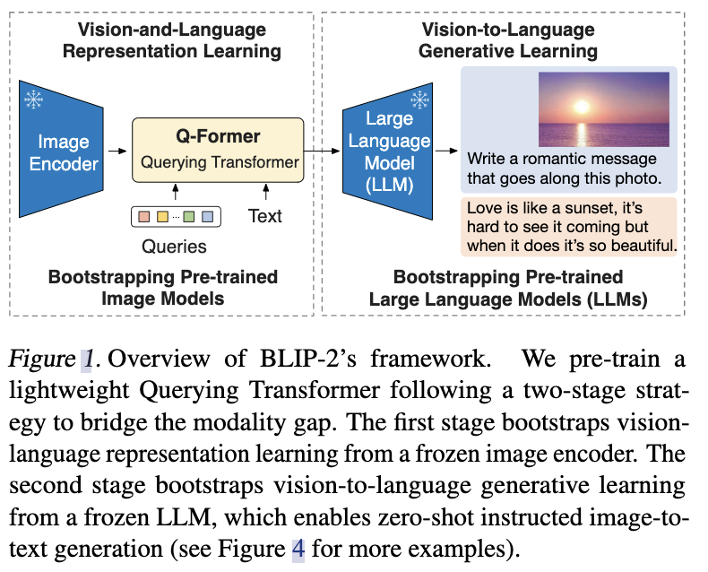
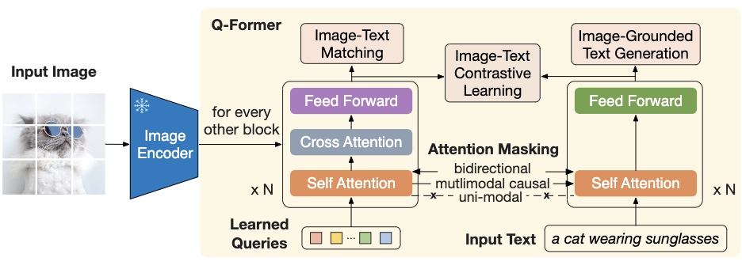
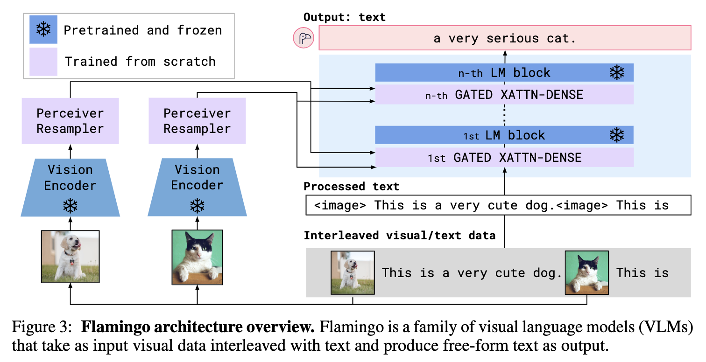
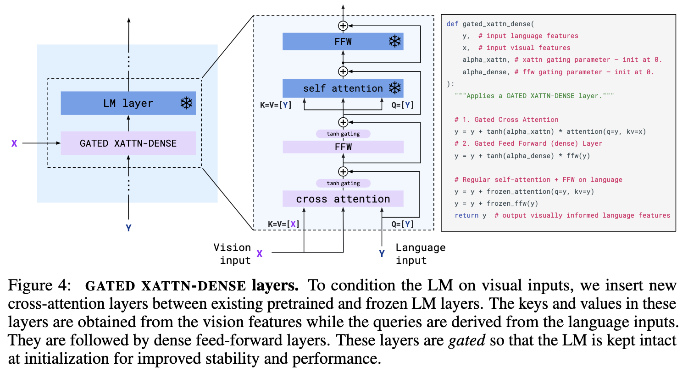
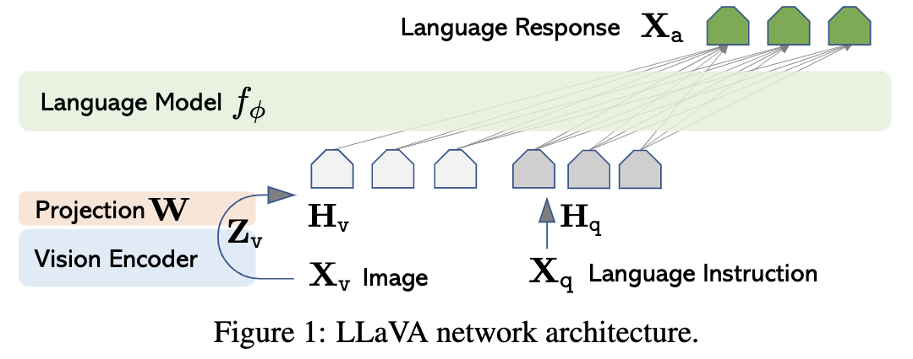
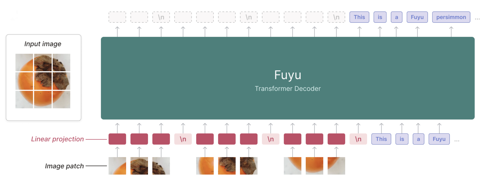

<h1 id="目录">目录</h1>

- [1.多模态模型](#1.多模态模型)
	- [1.多模态大模型中，视觉编码器和文本解码器常见的连接方式有哪几种？](#1.多模态大模型中，视觉编码器和文本解码器常见的连接方式有哪几种？)
	- [2.为什么BLIP2中大Q-Former结构不流行了？](#2.为什么BLIP2中大Q-Former结构不流行了？)
- [2.文本大模型](#2.文本大模型)
	- [1.prefix LM 和 causal LM 区别是什么？](#1.prefix和causal区别是什么？)
- [3.通识架构](#3.通识架构)
    - [1.为什么现在的大模型大多是decoder-only的架构？](#1.为什么现在的大模型大多是decoder-only的架构？)
    - [2.旋转位置编码的作用](#2.旋转位置编码的作用)
    - [3.目前主流的开源模型体系有哪些？](#3.目前主流的开源模型体系有哪些？)
    - [4.目前大模型模型结构都有哪些？](#4.目前大模型模型结构都有哪些？)
    - [5.大模型常用的激活函数有哪些？](#5.大模型常用的激活函数有哪些？)
    - [6.GPT3、LLAMA、ChatGLM 的Layer Normalization 的区别是什么？各自的优缺点是什么？](#6.GPT3LLAMAChatGLM的LayerNormalization的区别是什么？各自的优缺点是什么？)
    - [7.Multi-query Attention与Grouped-query Attention区别是什么？](#7.Multi-queryAttention与Grouped-queryAttention区别是什么？)
    - [8.Encoder-decoder架构和decoder-only架构有什么区别？](#8.Encoder-decoder架构和decoder-only架构有什么区别？)
- [4.DeepSeek相关问答](#4.DeepSeek相关问答)
    - [1.DeepSeek在算法架构优化方面有哪些具体的技术突破？](#1.DeepSeek在算法架构优化方面有哪些具体的技术突破？)
    - [2.DeepSeek-R1的训练过程中，如何通过RL强化LLM的推理能力？](#2.DeepSeek-R1的训练过程中，如何通过RL强化LLM的推理能力？)
    - [3.非Transformer架构的算法模型如LFM有哪些优势？](#3.非Transformer架构的算法模型如LFM有哪些优势？)

<h2 id='1.多模态模型'>1.多模态模型</h2>

<h3 id='1.多模态大模型中，视觉编码器和文本解码器常见的连接方式有哪几种？'>1.多模态大模型中，视觉编码器和文本解码器常见的连接方式有哪几种？</h3>

常见连接方式有Q-Former，Attention，Linear Layer/ MLP结构。此外还有Fuyu这类较特殊的结构，它没有Image Encoder，而是直接把image patches通过Linear Layer映射后送入LLM。

各结构的代表性方法列举如下：

**Q-Former**

>以BLIP-2为代表的Q-Former结构在其中增加了多个目标函数，希望视觉信息和文本信息在Q-Former中进一步对齐。

**Attention**

>以Flamingo结构为代表的Attention结构没有简单的把视觉tokens和文本tokens拼接到一起，而是在cross-attention层加入，增强了视觉信息和文本信息间的交互。

**Linear Layer / MLP**

>最近的研究工作大大简化的连接方式，以LLaVA为代表的方法仅使用了一个Linear Layer作为连接器，然后把视觉tokens和文本tokens经过拼接后送入LLM。

>在LLaVA 1.5中，Linear Layer升级为了2层MLP。目前MLP结构广受欢迎。

**Fuyu**

>Fuyu架构同样使用了Linear Layer，但更为特殊的是，Fuyu索性将image encoder去掉了，直接将image patches经Linear Layer映射后与文本tokens拼接，并送入LLM中。

<h3 id='2.为什么BLIP2中大Q-Former结构不流行了？'>2.为什么BLIP2中大Q-Former结构不流行了？</h3>

1. LLaVA系列的流行使很多后续工作follow了MLP结构；

2. 在Q-Former结构没有获得比MLP结构更优性能的前提下，使用简单易收敛的MLP结构何乐而不为；

3. Q-Former的有损压缩结构会损失视觉信息，导致模型容易产生幻觉。

<h2 id='2.文本大模型'>2.文本大模型</h2>

<h3 id='1.prefix和causal区别是什么？'>1.prefix LM 和 causal LM 区别是什么？</h3>

前缀语言模型（Prefix LM）利用给定前缀的全局上下文进行文本生成和填空，适用于需要结合全局信息的任务，如自然语言理解和填空任务；

而因果语言模型（Causal LM）按序列顺序逐字生成文本，依赖前面词预测下一个词，主要用于自回归生成任务，如文本生成和对话生成。

<h2 id='3.通识架构'>3.通识架构</h2>

<h3 id='1.为什么现在的大模型大多是decoder-only的架构？'>1.为什么现在的大模型大多是decoder-only的架构？</h3>

LLM之所以主要都用Decoder-only架构，除了训练效率和工程实现上的优势外，在理论上是因为Encoder的双向注意力会存在低秩问题，这可能会削弱模型表达能力，就生成任务而言，引入双向注意力并无实质好处。而Encoder-Decoder架构之所以能够在某些场景下表现更好，大概只是因为它多了一倍参数。所以，在同等参数量、同等推理成本下，Decoder-only架构就是最优选择了。

<h3 id='2.旋转位置编码的作用'>2.旋转位置编码的作用</h3>

### 旋转位置编码的本质和计算流程

旋转位置编码RoPE是一种固定式的绝对位置编码策略，但是它的绝对位置编码配合Transformer的Attention内积注意力机制能达到相对位置编码的效果。RoPE的本质是对两个token形成的Query和Key向量做一个变换，使得变换后的Query和Key带有位置信息，进一步使得Attention的内积操作不需要做任何更改就能自动感知到相对位置信息。换句话说，RoPR的出发点和策略用的相对位置编码思想，但是实现方式的确用的是绝对位置编码。

固定式表明RoPE没有额外需要模型自适应学习的参数，因此RoPE是一种高效的编码方式。绝对位置编码表明RoPE给文本的每个位置单词都分配了一个位置表征，和三角sin-cos位置编码一样，RoPE通过token在句子中的位置，token embedding中每个元素的位置，这两个要素一起确定位置编码的表达

### 旋转位置编码如何表达相对位置信息

sin-cos位置编码因为三角函数的性质，使得它可以表达相对位置信息，具体而言是：给定距离，任意位置的位置编码都可以表达为一个已知位置的位置编码的关于距离的线性组合，而RoPE的位置编码也是同样的思路，采用绝对位置编码实现相对距离的表达，区别如下:

- 实现相对位置能力的途径不同：sin-cos位置编码由于三角函数的性质，导致它本身就具备表达相对距离的能力，而RoPE位置编码本身不能表达相对距离，需要结合Attention的内积才能激发相对距离的表达能力

- 和原输入的融合计算方式不同：sin-cos位置编码直接和原始输入相加，RoPE位置编码采用类似哈达马积相乘的形式。

<h3 id='3.目前主流的开源模型体系有哪些？'>3.目前主流的开源模型体系有哪些？</h3>

目前主流的开源模型体系主要包括以下几个：

1. Transformer及其变体：

   包括Google提出的Transformer模型以及基于Transformer架构的各种变体，如BERT (Bidirectional Encoder Representations from Transformers)、GPT (Generative Pre-trained Transformer) 等。这些模型在自然语言处理任务中取得了显著的成就。
  
2. BERT（Bidirectional Encoder Representations from Transformers）：

   BERT 是一种预训练语言模型，采用Transformer编码器架构，并通过大规模无监督训练来学习语言表示。它能够通过微调在多种NLP任务中达到很高的性能。
   
3. GPT（Generative Pre-trained Transformer）：

   GPT 系列模型是基于Transformer解码器架构的预训练语言模型，主要用于生成式任务和文本生成。
   
4. PyTorch Lightning：

   pyTorch Lightning 是一个基于PyTorch的轻量级深度学习框架，旨在简化模型训练过程，并提供可扩展性和复现性。
   
5. TensorFlow Model Garden：

   TensorFlow Model Garden 提供了 TensorFlow 官方支持的一系列预训练模型和模型架构，涵盖了多种任务和应用领域。
   
6. Hugging Face Transformers：

   Hugging Face Transformers 是一个流行的开源库，提供了大量预训练模型和工具，特别适用于自然语言处理任务。它使得研究人员和开发者能够轻松使用、微调和部署各种现成的语言模型。
   
   这些开源模型体系在机器学习和自然语言处理领域都有广泛的应用和影响力，为研究人员和开发者提供了强大的工具和资源。
   
   
<h3 id='4.目前大模型模型结构都有哪些？'>4.目前大模型模型结构都有哪些？</h3>

目前大模型的模型结构主要包括以下几种：

1. Transformer模型：

   原始Transformer：基础模型，采用自注意力机制和前馈神经网络。
   
   GPT系列：基于自回归生成的Transformer变体，适用于文本生成任务。
   
   BERT系列：基于双向编码的Transformer变体，适用于自然语言理解任务。
   
   T5：结合生成和理解的Transformer，使用统一的文本到文本框架。
   
   LLAMA：类似GPT，但采用前标准化结构，提高泛化能力和鲁棒性
   
2. 混合结构模型：

   Transformer-XL：在Transformer中引入相对位置编码和片段级记忆机制，处理长序列任务。
   
   XLNet：融合自回归和自编码思想，通过双向学习提升模型性能。
   
3. 稠密模型：

   DeBERTa：结合相对位置编码和解耦的注意力机制，提高模型性能和泛化能力。
   
4. 稀疏模型：

   Switch Transformer：通过稀疏激活和专家混合机制，实现大规模训练和推理的高效性。
   
   GShard：在大规模并行计算框架下优化Transformer的性能
   
5. 对比学习模型：

   SimCLR：利用对比学习方法进行预训练，增强模型的表示能力。
   
   CLIP：将图像和文本进行对比学习，获取多模态表示。

这些模型结构在不同的任务和应用场景中展现了各自的优势和特点，不断推动自然语言处理和生成模型的发展。

<h3 id='5.大模型常用的激活函数有哪些？'>5.大模型常用的激活函数有哪些？</h3>

大模型常用的激活函数包括ReLU、Leaky ReLU、ELU、Swish和GELU。ReLU计算简单且有效避免梯度消失问题，加快训练速度，但可能导致神经元死亡；Leaky ReLU通过引入小斜率缓解ReLU的缺点；GeLU一种改进的ReLU函数，可以提供更好的性能和泛化能力；Swish一种自门控激活函数，可以提供非线性变换，并具有平滑和非单调的特性，在平滑性和性能上表现优异，但计算开销较大。

<h3 id='6.GPT3LLAMAChatGLM的LayerNormalization的区别是什么？各自的优缺点是什么？'>6.GPT3、LLAMA、ChatGLM 的Layer Normalization 的区别是什么？各自的优缺点是什么？</h3>

GPT-3：采用的是后标准化结构，即在执行自注意力或前馈神经网络计算之后进行Layer Normalization。这种方法有助于稳定训练过程并提升模型性能。

LLAMA：使用前标准化结构，即在自注意力或前馈神经网络计算之前进行Layer Normalization。这种结构有助于提升模型的泛化能力和鲁棒性。

ChatGLM：与GPT-3相似，采用后标准化结构，即在自注意力或前馈神经网络计算之后进行Layer Normalization。这种方法能够增强模型的性能和稳定性。

<h3 id='7.Multi-queryAttention与Grouped-queryAttention区别是什么？'>7.Multi-query Attention与Grouped-query Attention区别是什么？</h3>

Multi-query Attention和Grouped-query Attention是两种改进和扩展传统自注意力机制的变体。
Multi-query Attention：在这种机制中，每个查询与多个键值对进行交互，从而能够捕捉更多的上下文信息。这有助于提高模型在处理长序列或复杂关系时的表达能力和性能。

Grouped-query Attention：这种机制将查询分成多个组，每个组内的查询与相应的键值对进行交互。这样可以减少计算复杂度，提高效率，同时仍能保持良好的性能。

<h3 id='8.Encoder-decoder架构和decoder-only架构有什么区别？'>8.Encoder-decoder架构和decoder-only架构有什么区别？</h3>

- **Encoder-only架构**：只有编码器的模型，如BERT模型，能够很好的注意到输入文本的语义和上下文关系，但不擅长生成内容，适用于文本分类，情感分析等领域。

- **Decoder-only架构**： 仅含有解码器的模型，如GPT模型，不太擅长理解主题和学习目标，更关注于从已有的信息扩展出新的内容，适用于创造性的写作。

- **Encoder-Decoder架构**： 同时包含编码器和解码器部分的模型，如T5模型。该架构利用编码器对输入序列进行编码，提取其特征和语义信息，并将编码结果传递给解码器；然后，解码器根据编码结果生成相应的输出序列，适用于文本翻译等领域。

<h2 id='4.DeepSeek相关问答'>4.DeepSeek相关问答</h2>

<h3 id='1.DeepSeek在算法架构优化方面有哪些具体的技术突破？'>1.DeepSeek在算法架构优化方面有哪些具体的技术突破？</h3>

**1）重新设计了训练流程**，通过少量SFT数据和多轮强化学习的方法，提高了模型准确性，同时显著降低了内存占用和计算开销；

**2）实现了算力与性能的近似线性关系**，每增加一张GPU，模型推理能力可稳定提升，无需依赖复杂的外部监督机制。

<h3 id='2.DeepSeek-R1的训练过程中，如何通过RL强化LLM的推理能力？'>2.DeepSeek-R1的训练过程中，如何通过RL强化LLM的推理能力？</h3>

DeepSeek-R1的训练过程中，**R1-zero完全基于RL进行训练**，未使用任何监督训练或人类反馈。
通过自我学习，R1-zero能够提高性能。R1则是在R1-zero的基础上，通过**少量冷启动数据进行微调**，提高了输出质量和可读性。

