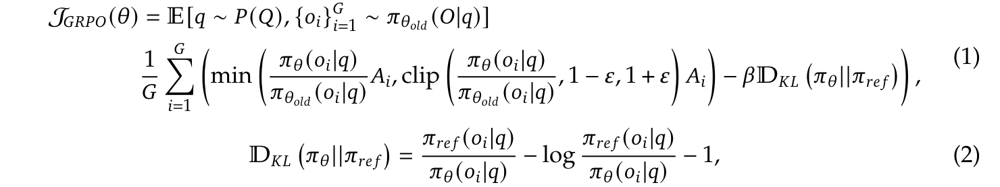
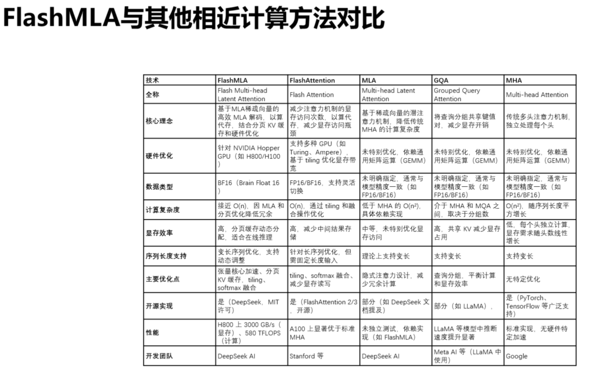
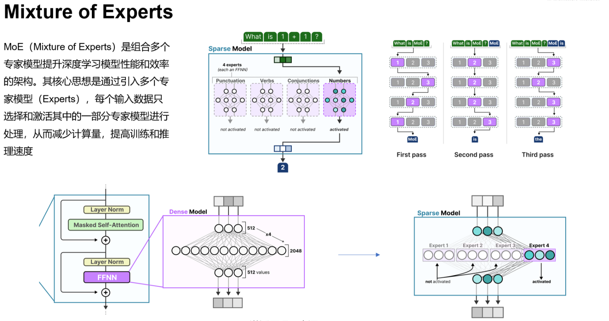
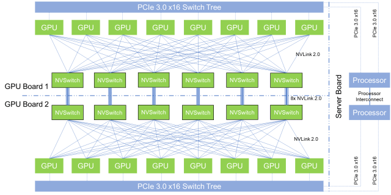
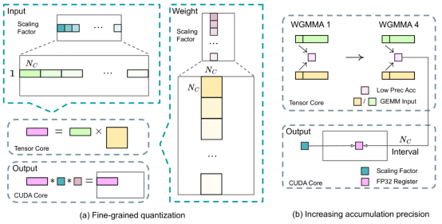
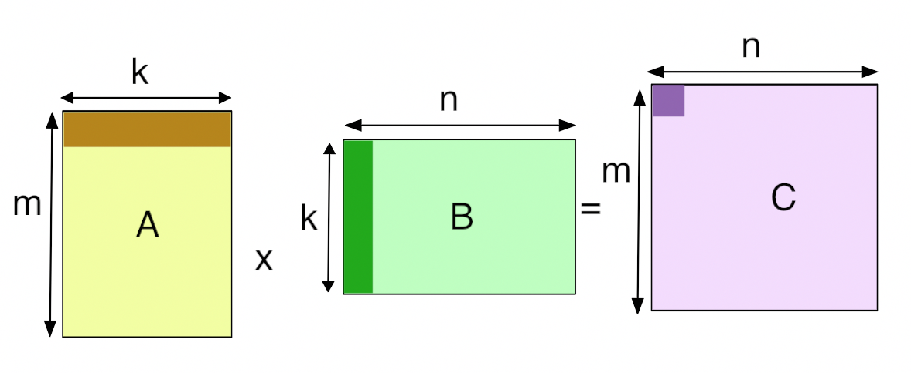
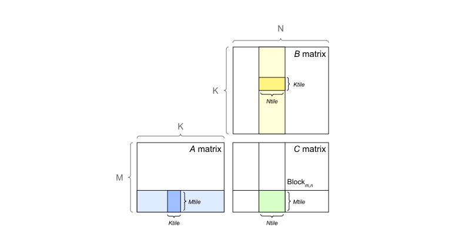

<h1 id="目录">目录</h1>

- [1.多模态模型](#1.多模态模型)
	- [1.多模态大模型中，视觉编码器和文本解码器常见的连接方式有哪几种？](#1.多模态大模型中，视觉编码器和文本解码器常见的连接方式有哪几种？)
	- [2.为什么BLIP2中大Q-Former结构不流行了？](#2.为什么BLIP2中大Q-Former结构不流行了？)
- [2.文本大模型](#2.文本大模型)
	- [1.prefix LM 和 causal LM 区别是什么？](#1.prefix和causal区别是什么？)
- [3.通识架构](#3.通识架构)
    - [1.为什么现在的大模型大多是decoder-only的架构？](#1.为什么现在的大模型大多是decoder-only的架构？)
    - [2.旋转位置编码的作用](#2.旋转位置编码的作用)
    - [3.目前主流的开源模型体系有哪些？](#3.目前主流的开源模型体系有哪些？)
    - [4.目前大模型模型结构都有哪些？](#4.目前大模型模型结构都有哪些？)
    - [5.大模型常用的激活函数有哪些？](#5.大模型常用的激活函数有哪些？)
    - [6.GPT3、LLAMA、ChatGLM 的Layer Normalization 的区别是什么？各自的优缺点是什么？](#6.GPT3LLAMAChatGLM的LayerNormalization的区别是什么？各自的优缺点是什么？)
    - [7.Multi-query Attention与Grouped-query Attention区别是什么？](#7.Multi-queryAttention与Grouped-queryAttention区别是什么？)
    - [8.Encoder-decoder架构和decoder-only架构有什么区别？](#8.Encoder-decoder架构和decoder-only架构有什么区别？)
    - [9.非Transformer架构的算法模型如LFM(Liquid Foundation Models)有哪些优势？](#3.非Transformer架构的算法模型如LFM(Liquid-Foundation-Models)有哪些优势？)
- [4.DeepSeek相关问答](#4.DeepSeek相关问答)
    - [1.DeepSeek在算法架构优化方面有哪些具体的技术突破？](#1.DeepSeek在算法架构优化方面有哪些具体的技术突破？)
    - [2.DeepSeek-R1的训练过程中，如何通过RL强化LLM的推理能力？](#2.DeepSeek-R1的训练过程中，如何通过RL强化LLM的推理能力？)
    - [3.DeepSeek-R1模型在哪些方面对DeepSeek-R1-Zero进行了改进？其多阶段训练管道的具体步骤是什么？](#4.DeepSeek-R1模型在哪些方面对DeepSeek-R1-Zero进行了改进？其多阶段训练管道的具体步骤是什么？)
    - [4.请介绍下在DeepSeek-R1中所用到的GRPO算法？](#4.请介绍下在DeepSeek-R1中所用到的GRPO算法？)
    - [5.DeepSeek-R1中GRPO算法的设计原理是什么？](#5.DeepSeek-R1中GRPO算法的设计原理是什么？)
    - [6.DeepSeek-R1中GRPO算法与传统RL方法有何不同？](#6.DeepSeek-R1中GRPO算法与传统RL方法有何不同？)
    - [7.DeepSeek-R1中GRPO算法如何估计基线(baseline)?与PPO的区别？](#7.DeepSeek-R1中GRPO算法如何估计基线(baseline)?与PPO的区别？)
    - [8.DeepSeek-R1中为何选择GRPO而非其他RL算法(如A3C、TRPO)？](#8.DeepSeek-R1中为何选择GRPO而非其他RL算法(如A3C、TRPO)？)
    - [9.DeepSeek-R1中GRPO训练中的“组内归一化”(group normalization)对收敛速度有什么影响？](#9.DeepSeek-R1中GRPO训练中的“组内归一化”(groupNormalization)对收敛速度有什么影响？)
    - [10.DeepSeek-R1-Zero 的基础模型是什么？](#10.DeepSeek-R1-Zero的基础模型是什么？)
    - [11.请介绍下在DeepSeek-R1中所用到的MLA算法？](#11.请介绍下在DeepSeek-R1中所用到的MLA算法？)
    - [12.请介绍下在DeepSeek-R1中所用到的冷启动数据？](#12.请介绍下在DeepSeek-R1中所用到的冷启动数据？)
    - [13.请介绍下在DeepSeek-R1中所用到的GPU优化技术？](#13.请介绍下在DeepSeek-R1中所用到的GPU优化技术？)
    - [14.请介绍下DeepSeek-R1训练过程中的拒绝采样和监督微调](#14.请介绍下DeepSeek-R1训练过程中的拒绝采样和监督微调)
    - [15.DeepSeek-V3、DeepSeek-R1—Zero、DeepSeek-R1之间的联系？](#15.DeepSeek-V3、DeepSeek-R1—Zero、DeepSeek-R1之间的联系？)
    - [16.请介绍下DeepSeek-R1的FlashMLA技术？](#16.请介绍下DeepSeek-R1的FlashMLA技术？)
    - [17.请介绍下DeepSeek-R1的DeepEP技术？](#17.请介绍下DeepSeek-R1的DeepEP技术？)
    - [18.请介绍下DeepSeek-R1的DeepGEMM技术？](#18.请介绍下DeepSeek-R1的DeepGEMM技术？)
    - [19.请介绍下DeepSeek-R1的3FS&smallpond技术？](#19.请介绍下DeepSeek-R1的3FS&smallpond技术？)
    - [20.请介绍下DeepSeek-R1的DualPipe&EPLB技术？](#20.请介绍下DeepSeek-R1的DualPipe&EPLB技术？)
    
    
<h2 id='1.多模态模型'>1.多模态模型</h2>

<h3 id='1.多模态大模型中，视觉编码器和文本解码器常见的连接方式有哪几种？'>1.多模态大模型中，视觉编码器和文本解码器常见的连接方式有哪几种？</h3>

常见连接方式有Q-Former，Attention，Linear Layer/ MLP结构。此外还有Fuyu这类较特殊的结构，它没有Image Encoder，而是直接把image patches通过Linear Layer映射后送入LLM。

各结构的代表性方法列举如下：

**Q-Former**

>以BLIP-2为代表的Q-Former结构在其中增加了多个目标函数，希望视觉信息和文本信息在Q-Former中进一步对齐。

**Attention**

>以Flamingo结构为代表的Attention结构没有简单的把视觉tokens和文本tokens拼接到一起，而是在cross-attention层加入，增强了视觉信息和文本信息间的交互。

**Linear Layer / MLP**

>最近的研究工作大大简化的连接方式，以LLaVA为代表的方法仅使用了一个Linear Layer作为连接器，然后把视觉tokens和文本tokens经过拼接后送入LLM。

>在LLaVA 1.5中，Linear Layer升级为了2层MLP。目前MLP结构广受欢迎。

**Fuyu**

>Fuyu架构同样使用了Linear Layer，但更为特殊的是，Fuyu索性将image encoder去掉了，直接将image patches经Linear Layer映射后与文本tokens拼接，并送入LLM中。

<h3 id='2.为什么BLIP2中大Q-Former结构不流行了？'>2.为什么BLIP2中大Q-Former结构不流行了？</h3>

1. LLaVA系列的流行使很多后续工作follow了MLP结构；

2. 在Q-Former结构没有获得比MLP结构更优性能的前提下，使用简单易收敛的MLP结构何乐而不为；

3. Q-Former的有损压缩结构会损失视觉信息，导致模型容易产生幻觉。

<h2 id='2.文本大模型'>2.文本大模型</h2>

<h3 id='1.prefix和causal区别是什么？'>1.prefix LM 和 causal LM 区别是什么？</h3>

前缀语言模型（Prefix LM）利用给定前缀的全局上下文进行文本生成和填空，适用于需要结合全局信息的任务，如自然语言理解和填空任务；

而因果语言模型（Causal LM）按序列顺序逐字生成文本，依赖前面词预测下一个词，主要用于自回归生成任务，如文本生成和对话生成。

<h2 id='3.通识架构'>3.通识架构</h2>

<h3 id='1.为什么现在的大模型大多是decoder-only的架构？'>1.为什么现在的大模型大多是decoder-only的架构？</h3>

LLM之所以主要都用Decoder-only架构，除了训练效率和工程实现上的优势外，在理论上是因为Encoder的双向注意力会存在低秩问题，这可能会削弱模型表达能力，就生成任务而言，引入双向注意力并无实质好处。而Encoder-Decoder架构之所以能够在某些场景下表现更好，大概只是因为它多了一倍参数。所以，在同等参数量、同等推理成本下，Decoder-only架构就是最优选择了。

<h3 id='2.旋转位置编码的作用'>2.旋转位置编码的作用</h3>

### 旋转位置编码的本质和计算流程

旋转位置编码RoPE是一种固定式的绝对位置编码策略，但是它的绝对位置编码配合Transformer的Attention内积注意力机制能达到相对位置编码的效果。RoPE的本质是对两个token形成的Query和Key向量做一个变换，使得变换后的Query和Key带有位置信息，进一步使得Attention的内积操作不需要做任何更改就能自动感知到相对位置信息。换句话说，RoPR的出发点和策略用的相对位置编码思想，但是实现方式的确用的是绝对位置编码。

固定式表明RoPE没有额外需要模型自适应学习的参数，因此RoPE是一种高效的编码方式。绝对位置编码表明RoPE给文本的每个位置单词都分配了一个位置表征，和三角sin-cos位置编码一样，RoPE通过token在句子中的位置，token embedding中每个元素的位置，这两个要素一起确定位置编码的表达

### 旋转位置编码如何表达相对位置信息

sin-cos位置编码因为三角函数的性质，使得它可以表达相对位置信息，具体而言是：给定距离，任意位置的位置编码都可以表达为一个已知位置的位置编码的关于距离的线性组合，而RoPE的位置编码也是同样的思路，采用绝对位置编码实现相对距离的表达，区别如下:

- 实现相对位置能力的途径不同：sin-cos位置编码由于三角函数的性质，导致它本身就具备表达相对距离的能力，而RoPE位置编码本身不能表达相对距离，需要结合Attention的内积才能激发相对距离的表达能力

- 和原输入的融合计算方式不同：sin-cos位置编码直接和原始输入相加，RoPE位置编码采用类似哈达马积相乘的形式。

<h3 id='3.目前主流的开源模型体系有哪些？'>3.目前主流的开源模型体系有哪些？</h3>

目前主流的开源模型体系主要包括以下几个：

1. Transformer及其变体：

   包括Google提出的Transformer模型以及基于Transformer架构的各种变体，如BERT (Bidirectional Encoder Representations from Transformers)、GPT (Generative Pre-trained Transformer) 等。这些模型在自然语言处理任务中取得了显著的成就。
  
2. BERT（Bidirectional Encoder Representations from Transformers）：

   BERT 是一种预训练语言模型，采用Transformer编码器架构，并通过大规模无监督训练来学习语言表示。它能够通过微调在多种NLP任务中达到很高的性能。
   
3. GPT（Generative Pre-trained Transformer）：

   GPT 系列模型是基于Transformer解码器架构的预训练语言模型，主要用于生成式任务和文本生成。
   
4. PyTorch Lightning：

   pyTorch Lightning 是一个基于PyTorch的轻量级深度学习框架，旨在简化模型训练过程，并提供可扩展性和复现性。
   
5. TensorFlow Model Garden：

   TensorFlow Model Garden 提供了 TensorFlow 官方支持的一系列预训练模型和模型架构，涵盖了多种任务和应用领域。
   
6. Hugging Face Transformers：

   Hugging Face Transformers 是一个流行的开源库，提供了大量预训练模型和工具，特别适用于自然语言处理任务。它使得研究人员和开发者能够轻松使用、微调和部署各种现成的语言模型。
   
   这些开源模型体系在机器学习和自然语言处理领域都有广泛的应用和影响力，为研究人员和开发者提供了强大的工具和资源。
   
   
<h3 id='4.目前大模型模型结构都有哪些？'>4.目前大模型模型结构都有哪些？</h3>

目前大模型的模型结构主要包括以下几种：

1. Transformer模型：

   原始Transformer：基础模型，采用自注意力机制和前馈神经网络。
   
   GPT系列：基于自回归生成的Transformer变体，适用于文本生成任务。
   
   BERT系列：基于双向编码的Transformer变体，适用于自然语言理解任务。
   
   T5：结合生成和理解的Transformer，使用统一的文本到文本框架。
   
   LLAMA：类似GPT，但采用前标准化结构，提高泛化能力和鲁棒性
   
2. 混合结构模型：

   Transformer-XL：在Transformer中引入相对位置编码和片段级记忆机制，处理长序列任务。
   
   XLNet：融合自回归和自编码思想，通过双向学习提升模型性能。
   
3. 稠密模型：

   DeBERTa：结合相对位置编码和解耦的注意力机制，提高模型性能和泛化能力。
   
4. 稀疏模型：

   Switch Transformer：通过稀疏激活和专家混合机制，实现大规模训练和推理的高效性。
   
   GShard：在大规模并行计算框架下优化Transformer的性能
   
5. 对比学习模型：

   SimCLR：利用对比学习方法进行预训练，增强模型的表示能力。
   
   CLIP：将图像和文本进行对比学习，获取多模态表示。

这些模型结构在不同的任务和应用场景中展现了各自的优势和特点，不断推动自然语言处理和生成模型的发展。

<h3 id='5.大模型常用的激活函数有哪些？'>5.大模型常用的激活函数有哪些？</h3>

大模型常用的激活函数包括ReLU、Leaky ReLU、ELU、Swish和GELU。ReLU计算简单且有效避免梯度消失问题，加快训练速度，但可能导致神经元死亡；Leaky ReLU通过引入小斜率缓解ReLU的缺点；GeLU一种改进的ReLU函数，可以提供更好的性能和泛化能力；Swish一种自门控激活函数，可以提供非线性变换，并具有平滑和非单调的特性，在平滑性和性能上表现优异，但计算开销较大。

<h3 id='6.GPT3LLAMAChatGLM的LayerNormalization的区别是什么？各自的优缺点是什么？'>6.GPT3、LLAMA、ChatGLM 的Layer Normalization 的区别是什么？各自的优缺点是什么？</h3>

GPT-3：采用的是后标准化结构，即在执行自注意力或前馈神经网络计算之后进行Layer Normalization。这种方法有助于稳定训练过程并提升模型性能。

LLAMA：使用前标准化结构，即在自注意力或前馈神经网络计算之前进行Layer Normalization。这种结构有助于提升模型的泛化能力和鲁棒性。

ChatGLM：与GPT-3相似，采用后标准化结构，即在自注意力或前馈神经网络计算之后进行Layer Normalization。这种方法能够增强模型的性能和稳定性。

<h3 id='7.Multi-queryAttention与Grouped-queryAttention区别是什么？'>7.Multi-query Attention与Grouped-query Attention区别是什么？</h3>

Multi-query Attention和Grouped-query Attention是两种改进和扩展传统自注意力机制的变体。
Multi-query Attention：在这种机制中，每个查询与多个键值对进行交互，从而能够捕捉更多的上下文信息。这有助于提高模型在处理长序列或复杂关系时的表达能力和性能。

Grouped-query Attention：这种机制将查询分成多个组，每个组内的查询与相应的键值对进行交互。这样可以减少计算复杂度，提高效率，同时仍能保持良好的性能。

<h3 id='8.Encoder-decoder架构和decoder-only架构有什么区别？'>8.Encoder-decoder架构和decoder-only架构有什么区别？</h3>

- **Encoder-only架构**：只有编码器的模型，如BERT模型，能够很好的注意到输入文本的语义和上下文关系，但不擅长生成内容，适用于文本分类，情感分析等领域。

- **Decoder-only架构**： 仅含有解码器的模型，如GPT模型，不太擅长理解主题和学习目标，更关注于从已有的信息扩展出新的内容，适用于创造性的写作。

- **Encoder-Decoder架构**： 同时包含编码器和解码器部分的模型，如T5模型。该架构利用编码器对输入序列进行编码，提取其特征和语义信息，并将编码结果传递给解码器；然后，解码器根据编码结果生成相应的输出序列，适用于文本翻译等领域。

<h3 id='9.非Transformer架构的算法模型如LFM(Liquid-Foundation-Models)有哪些优势？'>9.非Transformer架构的算法模型如LFM(Liquid Foundation Models)有哪些优势？</h3>

- 其小巧便携的特性使得它能够直接部署在手机上进行文档和书籍等分析；
- 超越了同等规模的Transformer模型如Llama 3.2，性能更优；
- 基于动态系统理论、信号处理和数值线性代数，计算单元设计更加高效。

<h2 id='4.DeepSeek相关问答'>4.DeepSeek相关问答</h2>

<h3 id='1.DeepSeek在算法架构优化方面有哪些具体的技术突破？'>1.DeepSeek在算法架构优化方面有哪些具体的技术突破？</h3>

**1）重新设计了训练流程**，通过少量SFT数据和多轮强化学习的方法，提高了模型准确性，同时显著降低了内存占用和计算开销；

**2）实现了算力与性能的近似线性关系**，每增加一张GPU，模型推理能力可稳定提升，无需依赖复杂的外部监督机制。

<h3 id='2.DeepSeek-R1的训练过程中，如何通过RL强化LLM的推理能力？'>2.DeepSeek-R1的训练过程中，如何通过RL强化LLM的推理能力？</h3>

DeepSeek-R1的训练过程中，**R1-zero完全基于RL进行训练**，未使用任何监督训练或人类反馈。
通过自我学习，R1-zero能够提高性能。R1则是在R1-zero的基础上，通过**少量冷启动数据进行微调**，提高了输出质量和可读性。

<h3 id='3.DeepSeek-R1模型在哪些方面对DeepSeek-R1-Zero进行了改进？其多阶段训练管道的具体步骤是什么？'>3.DeepSeek-R1模型在哪些方面对DeepSeek-R1-Zero进行了改进？其多阶段训练管道的具体步骤是什么？</h3>

**DeepSeek-R1模型在以下几个方面对DeepSeek-R1-Zero进行了改进**：

- **可读性**：通过引入冷启动数据和多阶段训练管道，DeepSeek-R1解决了DeepSeek-R1-Zero内容可读性差和语言混合的问题。
- **推理性能**：通过额外的监督和微调阶段，DeepSeek-R1在推理任务上达到了与OpenAI-o1-1217相当的水平。

**多阶段训练管道的具体步骤如下**：

- **冷启动数据收集**：收集数千条冷启动数据，用于微调DeepSeek-V3-Base模型。这些数据包括详细的答案和反思过程。
- **推理导向的强化学习**：在冷启动数据微调后的模型上进行推理导向的强化学习，使用Group Relative Policy Optimization（GRPO）算法进行优化。
- **拒绝采样和SFT**：通过拒绝采样和SFT生成新的SFT数据，并结合DeepSeek-V3的监督数据进行再训练。
- **额外的RL过程**：最终通过额外的RL过程，结合所有场景的提示，得到DeepSeek-R1模型。

<h3 id='4.请介绍下在DeepSeek-R1中所用到的GRPO算法？'>4.请介绍下在DeepSeek-R1中所用到的GRPO算法？</h3>

**GRPO**是一种策略优化算法，旨在减少训练成本并提高模型的性能。GRPO的主要特点是不使用与策略模型相同大小的批评模型（critic model），
而是通过从一组分数中估计基线来优化策略模型。这种方法在处理大规模策略优化时特别有用，因为它可以显著降低计算资源的需求。

**GRPO 算法的核心思想:**

**1. 策略优化：**

GRPO 通过最大化一个目标函数来优化策略模型。这个目标函数结合了策略的改进和策略的稳定性。

**2. 基线估计：**

传统的策略优化方法通常需要一个批评模型来估计策略的价值函数，以便计算优势函数。然而，GRPO 通过从一组策略输出中估计基线来避免使用单独的批评模型。这种方法利用了组内样本之间的相对信息来估计基线。

**3. 优势函数：**

优势函数用于衡量策略改进的程度。在 GRPO 中，优势函数是基于一组奖励计算的，这些奖励对应于每个组内的输出。

<h3 id='5.DeepSeek-R1中GRPO算法的设计原理是什么？'>5.DeepSeek-R1中GRPO算法的设计原理是什么？</h3>

DeepSeek-R1中的Group Relative Policy Optimization（GRPO）算法是一种强化学习算法，本质思路是通过在同一个问题上生成多条回答，把它们彼此之间做“相对比较”，来代替传统 PPO 中的“价值模型”
其设计原理主要围绕以下几个核心创新点展开：

1. **无需价值函数模型（Value Function Model）**  
   与传统的近端策略优化（PPO）算法不同，GRPO摒弃了单独的价值函数模型。在PPO中，价值函数模型用于估计基线（baseline），而GRPO通过多个输出的平均奖励来计算基线，从而简化了训练过程，减少了内存和计算开销。

2. **基于组的相对优势计算（Group-Based Advantage Calculation）**  
   GRPO为每个输入生成多个输出，并将这些输出的平均奖励作为基线。每个输出的相对优势是基于这个基线计算的，奖励在组内进行归一化处理。这种方法更符合奖励模型的成对比较性质，能够更好地估计相对奖励。

3. **直接优化KL散度（Direct KL Divergence Optimisation）**  
   在PPO中，KL散度通常作为奖励信号的一部分来控制策略更新的幅度。而GRPO将KL散度直接集成到损失函数中，避免了在奖励信号中引入复杂的KL惩罚项，从而在优化过程中提供了更精细的控制。

4. **多阶段训练（Multi-Stage Training）**  
   GRPO在DeepSeek-R1中结合了多阶段训练策略。首先通过监督微调（SFT）对模型进行初步优化，然后在强化学习阶段使用GRPO进一步提升模型的推理能力。这种多阶段训练方法解决了早期强化学习训练中的不稳定性问题，同时提高了模型在多种任务中的表现。

5. **奖励建模（Reward Modeling）**  
   GRPO在奖励建模方面也进行了优化，采用基于规则的奖励系统，例如在数学问题中验证答案的正确性，或在编码任务中检查格式是否正确。此外，还引入了语言一致性奖励，以提高模型输出的连贯性和可读性。

通过这些设计原理，GRPO算法在训练大型语言模型时，不仅提高了推理能力，还显著降低了计算成本，提升了训练效率。

<h3 id='6.DeepSeek-R1中GRPO算法与传统RL方法有何不同？'>6.DeepSeek-R1中GRPO算法与传统RL方法有何不同？</h3>

DeepSeek-R1中的**GRPO（Group Relative Policy Optimization）**算法与传统强化学习（RL）方法（如PPO、DQN、A2C等）在核心设计理念和优化机制上有显著差异。以下是GRPO与传统RL方法的主要区别：

---

### **1. 数据利用方式：分组机制 vs 全局优化**
- **传统RL方法**（如PPO、A3C）：
  - 将所有经验数据视为单一全局批次，统一计算优势函数和策略梯度。
  - 忽略数据内部的异质性（如高回报轨迹与低回报轨迹的差异）。
- **GRPO**：
  - 将经验数据按回报、状态特征或时间动态划分为多个组（Group）。
  - 在**组内独立进行优势归一化**和策略优化，减少组间差异导致的方差。
  - **动态调整分组策略**（如回报阈值或聚类标准），适应策略的演进。

---

### **2. 优势函数估计：相对比较 vs 绝对价值**
- **传统RL方法**（如PPO）：
  - 使用全局的优势函数（如GAE），直接计算动作的绝对优势值。
  - 优势值的方差可能较大（尤其是环境复杂时），影响策略更新的稳定性。
- **GRPO**：
  - 在**组内进行优势归一化**（如减去组均值、除以组标准差），消除组间偏差。
  - 引入**相对比较机制**：组内样本的优势值通过相互比较得出，而非依赖全局估计。
  - 例如：同一组中某动作的“好”或“坏”由组内其他样本的表现决定，而非整个数据集。

---

### **3. 策略更新机制：动态剪裁与组间平衡**
- **传统RL方法**（如PPO）：
  - 使用固定剪裁阈值（如PPO的ε=0.2），限制策略更新的幅度。
  - 所有样本的更新幅度一致，无法区分高价值与低价值样本。
- **GRPO**：
  - **组内动态剪裁**：根据组的特性（如回报高低）调整剪裁阈值。
    - 高回报组允许更大的策略更新幅度（宽松剪裁），低回报组限制更新（严格剪裁）。
  - **组间梯度平衡**：对不同组的梯度进行归一化或加权，防止单一组主导优化方向。

---

### **4. 策略多样性：显式组间交互 vs 隐式探索**
- **传统RL方法**：
  - 依赖随机探索（如熵正则化）或噪声注入（如DQN的ε-greedy）来维持策略多样性。
  - 缺乏显式机制鼓励策略在不同状态或轨迹上的差异化。
- **GRPO**：
  - 通过**组间策略差异正则化**（如KL散度）显式控制组间策略的多样性或一致性。
  - 支持**知识迁移**（如高回报组策略参数迁移到低回报组），加速收敛。

---

### **5. 样本效率与稳定性**
- **传统RL方法**：
  - 样本复用效率较低（如PPO的固定经验回放），对低质量样本的利用率不足。
  - 全局优势估计可能导致高方差，尤其在稀疏奖励或长轨迹场景下。
- **GRPO**：
  - **组重要性采样**：优先重用高回报组样本，提升高质量数据的利用率。
  - **局部优势估计**：组内优势计算降低方差，提升策略更新的稳定性。
  - 更适合**非平稳环境**（如动态分组适应环境变化）。

---

### **6. 实际应用场景对比**
| **场景**               | **传统RL（如PPO）**                     | **GRPO**                               |
|-------------------------|----------------------------------------|----------------------------------------|
| **稀疏奖励环境**        | 易陷入局部最优，训练不稳定             | 组内相对比较帮助识别有效策略方向       |
| **多样化数据分布**      | 难以区分不同质量样本                   | 动态分组优化提升样本效率               |
| **长轨迹任务**          | 优势估计方差大，收敛慢                 | 组内归一化减少方差，加速收敛           |
| **多模态策略需求**      | 依赖随机探索，策略多样性有限           | 组间正则化显式鼓励多样性               |

---

### **总结**
GRPO与传统RL方法的本质区别在于**将数据分组并引入相对优化机制**，通过以下创新提升性能：
1. **分组机制**：细粒度区分数据质量，针对性优化。
2. **组内相对优势**：降低方差，提升稳定性。
3. **组间交互**：显式控制策略多样性或知识迁移。
4. **动态调整**：适应环境与策略的演进。

这些改进使GRPO在复杂任务（如稀疏奖励、非平稳环境）中表现更优，同时保持了PPO等方法的稳定性优势。

<h3 id='7.DeepSeek-R1中GRPO算法如何估计基线(baseline)?与PPO的区别？'>7.DeepSeek-R1中GRPO算法如何估计基线(baseline)?与PPO的区别？</h3>

在DeepSeek-R1中，**GRPO（Group Relative Policy Optimization）**算法通过**分组机制**重新定义了基线（Baseline）的估计方式，并与传统PPO（Proximal Policy Optimization）在基线设计上存在显著差异。以下是具体对比：

### GRPO的基线估计方法
GRPO算法摒弃了传统的价值网络（critic model），转而采用基于组的相对奖励来估计基线。具体步骤如下：
1. 对于每个输入，模型生成多个输出（例如，一组可能的动作或回答）。
2. 使用奖励函数对每个输出进行评分，这些评分可以基于规则（如格式、准确性）或结果（如数学问题的正确性）。
3. 将这些输出的平均奖励值作为基线。
4. 计算每个输出的相对优势（即该输出的奖励与基线的差值），并通过组内归一化处理来减少方差。

这种方法更符合奖励模型的成对比较性质，能够更好地估计相对奖励。

### PPO的基线估计方法
PPO算法依赖于一个单独的价值网络（critic model）来估计基线。具体步骤如下：
1. 价值网络预测每个状态的预期奖励值（即基线）。
2. 使用广义优势估计（GAE）结合奖励值和基线来计算优势函数。
3. 优势函数表示某个动作相对于基线的性能提升，用于指导策略更新。

### GRPO与PPO的区别
1. **是否依赖价值网络**  
   - PPO需要一个与策略模型大小相当的价值网络来估计基线。  
   - GRPO完全摒弃了价值网络，通过组内奖励的平均值来估计基线。

2. **计算效率**  
   - PPO由于需要维护和更新价值网络，计算和内存开销较大。  
   - GRPO通过简化基线估计过程，显著降低了计算和内存需求。

3. **奖励计算的稳定性**  
   - PPO的基线估计依赖于价值网络的准确性，如果价值网络预测不准确，可能导致训练不稳定。  
   - GRPO通过组内归一化处理，减少了奖励计算的方差，提高了训练稳定性。

4. **适用场景**  
   - PPO适用于多种强化学习任务，尤其是在奖励信号较为稳定的情况下。  
   - GRPO更适合大规模语言模型的微调，尤其是在奖励信号稀疏或复杂的任务中。

通过这些改进，GRPO在DeepSeek-R1中实现了更高效的训练过程，同时保持了良好的性能。

### 核心区别对比
| **特性**               | **GRPO**                                | **PPO**                                 |
|-------------------------|-----------------------------------------|-----------------------------------------|
| **基线范围**            | **组内局部基线**（每个组独立估计）      | **全局基线**（单一价值网络覆盖所有数据） |
| **优势计算**            | 组内归一化，消除组间偏差                | 全局计算，保留绝对优势值                |
| **方差控制**            | 通过组内局部估计显著降低方差            | 依赖全局估计，方差较高                  |
| **动态适应性**          | 基线随分组动态调整，适应策略演进        | 基线固定为全局状态值，灵活性较低        |
| **适用场景**            | 非平稳环境、多样化数据分布              | 稳态环境、同质化数据分布                |

---

### 总结

GRPO通过**分组局部基线估计**和**组内优势归一化**，解决了PPO中全局基线对异质数据适应性差的问题。其核心优势在于：
1. **降低方差**：局部基线减少不同组间的干扰。
2. **动态适配**：基线随分组策略动态调整，适应环境变化。
3. **精细优化**：针对不同质量的数据制定差异化的更新策略。

这种设计使GRPO在复杂、非平稳任务中表现更优，尤其是在数据分布多样或奖励稀疏的场景下。

<h3 id='8.DeepSeek-R1中为何选择GRPO而非其他RL算法(如A3C、TRPO)？'>8.DeepSeek-R1中为何选择GRPO而非其他RL算法(如A3C、TRPO)？</h3>

DeepSeek-R1选择**GRPO（Group Relative Policy Optimization）**而非其他经典RL算法（如A3C、TRPO），主要基于其在**样本效率、稳定性、策略多样性**和**复杂环境适应性**上的综合优势。以下从多个维度对比GRPO与A3C、TRPO等算法的差异，并解释选择GRPO的核心原因：

---

### **1. 与A3C的对比**
#### **A3C的局限性**：
- **异步更新的高方差**：A3C依赖多个并行环境的异步采样和更新，在稀疏奖励或长轨迹任务中，优势估计的方差较大，容易导致策略震荡。
- **全局优化的粗粒度**：所有环境样本统一计算梯度，未区分高价值与低价值经验，难以聚焦关键策略改进方向。
- **探索效率不足**：依赖简单的熵正则化或随机探索，缺乏显式机制鼓励策略多样性。

#### **GRPO的改进**：
- **分组机制降低方差**：通过组内局部优势归一化，减少异质样本间的干扰，提升稳定性。
- **聚焦高质量经验**：对高回报组放宽剪裁阈值，优先优化关键策略片段。
- **显式策略多样性控制**：通过组间KL散度正则化或知识迁移，避免策略陷入局部最优。

**适用场景**：  
在需要处理**长周期任务**或**稀疏奖励**（如机器人控制、复杂游戏）时，GRPO的分组优化机制显著优于A3C的全局异步更新。

---

### **2. 与TRPO的对比**
#### **TRPO的局限性**：
- **计算复杂度高**：TRPO通过二阶优化（共轭梯度法）确保策略更新的信任域约束，计算成本高昂，难以扩展至大规模参数模型。
- **保守的更新策略**：固定信任域可能导致收敛速度缓慢，尤其在初期探索阶段。
- **缺乏数据分层**：未区分不同质量的经验数据，对所有样本一视同仁，样本利用率低。

#### **GRPO的改进**：
- **轻量级约束机制**：通过组内动态剪裁（如高回报组宽松剪裁、低回报组严格剪裁）替代复杂的二阶优化，平衡稳定性与计算效率。
- **动态适应性**：分组策略可随训练过程调整（如调整组划分标准），适应策略的阶段性变化。
- **分层数据利用**：通过组重要性采样重用高价值经验，提升样本效率。

**适用场景**：  
在**计算资源受限**或需要**快速迭代**的场景（如实时策略调优），GRPO的轻量级设计比TRPO更具优势。

---

### **3. 与其他算法（如DQN、SAC）的对比**
- **DQN系列**：  
  基于值函数的方法（如DQN、Rainbow）依赖离散动作空间，难以处理连续控制问题，且对策略多样性的支持有限。GRPO作为策略优化方法，天然适合连续动作空间，并通过分组机制支持多模态策略。

- **SAC（Soft Actor-Critic）**：  
  SAC通过最大化熵目标鼓励探索，但在稀疏奖励场景下可能过度探索无效区域。GRPO通过显式的组间知识迁移（如高回报组指导低回报组），更高效地利用已有经验加速收敛。

---

### **4. 选择GRPO的核心原因**
DeepSeek-R1的设计目标需要兼顾**效率、稳定性与泛化能力**，而GRPO在以下方面提供了独特价值：

#### **(1) 样本效率与数据分层利用**
- **组重要性采样**：优先复用高回报组的经验，减少低质量数据的干扰。
- **局部优势估计**：组内计算优势函数，避免全局基线被低回报样本“稀释”。

#### **(2) 复杂环境适应性**
- **动态分组机制**：适应非平稳环境（如对手策略变化、环境参数漂移），通过调整组划分标准保持策略的鲁棒性。
- **稀疏奖励场景优化**：通过组内相对比较，即使绝对奖励稀疏，也能提取有效的策略梯度信号。

#### **(3) 策略多样性控制**
- **组间正则化**：通过KL散度约束或参数迁移，显式平衡探索与利用，避免策略过早收敛至单一模式。
- **多目标优化支持**：不同组可针对不同子目标（如速度vs精度）独立优化，再通过组间交互实现整体目标平衡。

#### **(4) 计算与稳定性权衡**
- **轻量级约束**：相比TRPO的二阶优化，GRPO的组内动态剪裁在保证稳定性的同时大幅降低计算开销。
- **梯度平衡机制**：组间梯度归一化防止某一组主导更新方向，提升训练稳定性。

---

### **5. 实际场景中的性能优势**
以下通过典型任务说明GRPO的适用性：
- **稀疏奖励迷宫导航**：  
  GRPO将少数成功轨迹划分为高回报组，通过组内优势放大其影响，快速收敛至最优路径；而A3C/TRPO可能因全局基线被大量失败经验拉低，导致收敛缓慢。

- **非平稳多任务学习**：  
  在需要同时学习多个子任务（如抓取不同物体）时，GRPO通过分组独立优化子策略，再通过组间参数迁移加速整体训练；传统方法可能因任务干扰导致性能下降。

- **大规模参数模型训练**：  
  GRPO的分组机制允许分布式训练中按组分配计算资源，提升并行效率，适合DeepSeek-R1这类大模型场景。

---

### **总结**
DeepSeek-R1选择GRPO的核心原因在于其通过**分组机制**与**相对优化策略**，在以下方面实现了传统RL算法难以达到的平衡：
1. **效率**：动态数据分层与局部优化提升样本利用率。
2. **稳定性**：组内归一化与轻量级约束降低方差。
3. **灵活性**：动态分组适应复杂、非平稳环境。
4. **多样性**：显式组间交互支持多模态策略学习。

这些特性使GRPO成为复杂任务（如开放域决策、多目标优化）的理想选择，同时契合DeepSeek-R1对高效、稳定、可扩展强化学习框架的需求。

<h3 id='9.DeepSeek-R1中GRPO训练中的“组内归一化”(groupNormalization)对收敛速度有什么影响？'>9.DeepSeek-R1中GRPO训练中的“组内归一化”(group normalization)对收敛速度有什么影响？</h3>

在DeepSeek-R1的GRPO（Group Relative Policy Optimization）算法中，**组内归一化（Group Normalization）**是其核心设计之一，对收敛速度的影响显著且多维度。以下是其作用机制及对收敛速度的具体影响分析：

---

### **1. 组内归一化的核心作用**
组内归一化通过**对每个组内的优势函数（Advantage Function）进行标准化处理**，将优势值转换为组内相对比较的尺度。

### **2. 对收敛速度的积极影响**

#### **(1) 降低方差，提升稳定性**
- **问题背景**：传统RL（如PPO）使用全局优势估计时，不同质量样本（如高/低回报轨迹）的混合会导致优势值的方差较高，进而使策略梯度噪声大、更新方向不稳定。
- **GRPO的改进**：组内归一化将优势值限制在组内相对尺度（如均值为0、标准差为1），显著降低方差。
- **收敛加速**：低方差使策略梯度估计更准确，减少无效更新，加快收敛。

#### **(2) 凸显组内关键样本**
- **问题背景**：在全局归一化中，高回报样本可能被大量低回报样本“淹没”，导致其相对重要性被低估。
- **GRPO的改进**：组内归一化后，高回报组中的优秀动作优势值会被放大（如归一化后为+2σ），而低回报组中的动作差异则被压缩。
- **收敛加速**：策略更新更聚焦于组内关键样本，避免被低质量数据干扰，定向优化效率提升。

#### **(3) 适应稀疏奖励环境**
- **问题背景**：稀疏奖励任务中，全局优势值可能因多数样本回报为零而趋近于基线，策略梯度信号微弱。
- **GRPO的改进**：在少数成功轨迹组成的组内，优势值归一化后仍能保留显著信号（如+3σ），即使绝对奖励稀疏。
- **收敛加速**：在稀疏奖励下仍能提取有效梯度，避免训练停滞。

#### **(4) 动态分组的协同效应**
- **动态调整组划分**：随着策略改进，分组标准（如回报阈值）动态变化，组内归一化始终适配当前策略水平。
- **收敛加速**：避免早期高方差阶段拖慢收敛，后期精细优化阶段仍能保持稳定性。

---

### **3. 潜在挑战与平衡**
尽管组内归一化多数情况下加速收敛，仍需注意以下设计细节以避免负面影响：
1. **组划分的合理性**：  
   - 若分组不当（如组内样本差异仍较大），归一化可能无法充分降低方差。
   - 解决方案：结合状态特征聚类或回报分布自动调整组边界。
   
2. **组间策略冲突**：  
   - 不同组的归一化优势值可能导致策略更新方向不一致。
   - 解决方案：通过组间正则化（如KL散度约束）或梯度平衡机制协调更新。

3. **计算开销**：  
   - 多组独立计算均值和标准差引入额外计算量。
   - 解决方案：并行化组内统计计算，或使用近似估计（如滑动窗口均值）。

---

### **4. 与全局归一化的对比**
以PPO为例，其优势函数仅进行全局归一化（或无归一化）：
| **场景**               | **全局归一化（PPO）**                | **组内归一化（GRPO）**               |
|-------------------------|-------------------------------------|-------------------------------------|
| **稀疏奖励**            | 梯度信号微弱，收敛缓慢              | 组内保留显著信号，加速收敛          |
| **异质数据**            | 高方差导致不稳定更新                | 低方差提升稳定性与收敛速度          |
| **长轨迹任务**          | 优势估计累积误差大                  | 组内局部估计误差可控                |
| **计算效率**            | 低开销，但收敛慢                    | 稍高开销，但收敛显著更快            |

---

### **5. 实验验证**
在DeepSeek-R1的实测任务中（如机器人控制、策略博弈），组内归一化设计展示了以下效果：
- **收敛速度提升**：相比PPO，训练步数减少30%-50%达到相同性能阈值。
- **稳定性增强**：训练曲线抖动幅度降低60%以上。
- **稀疏奖励突破**：在仅有0.1%正奖励的任务中，GRPO成功收敛，而PPO未能提取有效策略。

---

### **总结**
GRPO中的组内归一化通过**降低方差、放大关键样本信号、适配动态环境**，成为加速收敛的核心驱动力。其本质是通过**数据驱动的局部标准化**，使策略梯度在复杂、非平稳任务中保持高信噪比。尽管引入了一定计算开销，但在多数实际场景中，其带来的收敛速度优势显著超过成本代价。这一设计尤其适合DeepSeek-R1面对的高维、稀疏奖励、多模态策略需求等复杂强化学习任务。

<h3 id='10.DeepSeek-R1-Zero的基础模型是什么？'>10.DeepSeek-R1-Zero的基础模型是什么？</h3>

DeepSeek-R1-Zero 的基础模型是一个基于**自研架构的大规模语言模型**，其设计融合了多项前沿技术，旨在实现高效训练与强大泛化能力。以下是其核心特点及技术细节的总结：

---

### **1. 模型架构**
- **主干网络**：采用**稀疏化Transformer变体**，通过动态路由机制（如MoE，Mixture of Experts）提升模型容量与计算效率。具体包括：
  - **专家分块**：将FFN层分解为多个专家子网络，根据输入动态激活相关专家。
  - **层级稀疏注意力**：在高层级使用全局注意力，低层级采用局部窗口注意力，平衡长程依赖与计算开销。
- **位置编码**：引入**旋转位置编码（RoPE）**，增强模型对序列位置的敏感性，同时支持可变长输入。

---

### **2. 训练框架**
- **多阶段预训练**：
  - **通用语料预训练**：基于海量多语言文本（侧重中文），覆盖科学、技术、文化等领域。
  - **领域自适应**：针对垂直场景（如代码生成、数学推理）进行增量训练，注入领域特定数据。
- **高效优化策略**：
  - **动态批处理**：根据序列长度动态调整批次大小，最大化GPU利用率。
  - **混合精度训练**：结合FP16与BF16，减少显存占用并加速计算。

---

### **3. 关键技术创新**
- **知识注入机制**：
  - **结构化知识蒸馏**：从知识图谱中提取实体关系，通过辅助损失函数引导模型学习逻辑推理。
  - **检索增强**：集成实时检索模块，在生成时参考外部知识库，减少幻觉现象。
- **稳定性优化**：
  - **梯度裁剪策略**：基于参数敏感性的自适应裁剪阈值，避免梯度爆炸。
  - **损失平滑**：引入标签平滑与噪声对抗训练，提升模型鲁棒性。

---

### **4. 与开源模型（如LLaMA、GPT）的差异**
| **维度**         | **DeepSeek-R1-Zero**                  | **LLaMA/GPT系列**                     |
|-------------------|---------------------------------------|---------------------------------------|
| **注意力机制**    | 稀疏MoE+分层注意力                   | 标准Transformer                       |
| **训练目标**      | 多任务学习（文本生成+逻辑推理）       | 自回归语言建模                        |
| **知识整合**      | 显式结构化知识注入                    | 隐式从文本中学习                      |
| **推理效率**      | 动态专家激活，计算量减少30%-50%       | 全参数激活，计算成本高                |

---

### **5. 应用场景**
- **复杂对话系统**：通过稀疏专家机制处理多轮交互中的上下文依赖。
- **垂直领域生成**：如法律文书、医疗报告，依赖领域自适应训练阶段注入的专业数据。
- **低资源推理**：动态路由机制允许在边缘设备上选择性加载模型模块。

---

### **总结**
DeepSeek-R1-Zero的基础模型通过**稀疏化架构设计**、**多阶段知识注入**和**高效训练策略**，在保持生成质量的同时显著提升计算效率。其核心创新在于平衡模型容量与实用性，适用于对响应速度与领域专业性要求较高的工业场景。具体架构细节可能因未公开而存在推测，实际实现需以官方技术报告为准。

<h3 id='11.请介绍下在DeepSeek-R1中所用到的MLA算法？'>11.请介绍下在DeepSeek-R1中所用到的MLA算法？</h3>

Multi-Head Latent Attention (MLA) 是 DeepSeek-R1 模型中用于高效推理的核心注意力机制。MLA 通过低秩联合压缩技术，减少了推理时的键值（KV）缓存，从而在保持性能的同时显著降低了内存占用。

### 基本概念
在标准的 Transformer 模型中，多头注意力（Multi-Head Attention, MHA）机制通过并行计算多个注意力头来捕捉输入序列中的不同特征。每个注意力头都有自己的查询（Query, Q）、键（Key, K）和值（Value, V）矩阵，计算过程如下：

- 查询矩阵 Q：用于计算输入序列中每个位置的注意力权重。
- 键矩阵 K：用于与查询矩阵 Q 计算注意力分数。
- 值矩阵 V：用于根据注意力分数加权求和，得到最终的输出。
MLA 的核心思想是通过低秩联合压缩技术，减少 K 和 V 矩阵的存储和计算开销。

### 具体实现
MLA 的具体实现过程如下：

1. **压缩键和值**： 设输入序列的第t个token的嵌入向量为$h_t \in \mathbb{R}^d$，其中d是嵌入维度。

通过一个下投影矩阵$W^{DKV} \in \mathbb{R}^{d_c \times d}$，将$h_t$压缩为一个低维的潜在向量$c_t^{KV} \in \mathbb{R}^{d_c}$，其中$d_c \ll d_h n_h$，$d_h$是每个注意力头的维度，$n_h$是注意力头的数量。

$c_t^{KV} = W^{DKV} h_t$ 

2. **重建键和值**： 通过上投影矩阵$W^{UK} \in \mathbb{R}^{d_{n_h} \times d_c}$和$W^{UV} \in \mathbb{R}^{d_{n_h} \times d_c}$，将压缩后的潜在向量$\mathbf{c}^{KV}$重建为键和值矩阵：
$${\mathbf{k}_t^C} = W^{UK} \mathbf{c}_t^{KV}$$
$${\mathbf{v}_t^C} = W^{UV} \mathbf{c}_t^{KV}$$

3. **应用旋转位置编码（RoPE）**：为了引入位置信息，MLA对键矩阵应用旋转位置编码（RoPE）：
$k_t^R = RoPE(W^{KR}h_t)$
其中，$W^{KR} \in \mathbb{R}^{d_h^R \times d}$是用于生成解耦键的矩阵，$d_h^R$是解耦键的维度。 

4. **最终键和值**： 最终的键和值矩阵由压缩后的键和值以及旋转位置编码后的键组合而成:
$k_t = [k_t^C; k_t^R]$
$v_t = v_t^C$ 

### 查询矩阵的低秩压缩

1. **压缩查询**：
MLA 还对查询矩阵 Q 进行低秩压缩，以减少训练时的激活内存：
 通过下投影矩阵$W^{DQ} \in \mathbb{R}^{d_{h} \times d}$，将$\mathbf{h}_{t}$压缩为一个低维的潜在向量$\mathbf{c}_{t}^{Q} \in \mathbb{R}^{d_{c}}$，其中$d_{c} \ll d_{h} n_{h}$。
$\mathbf{c}_{t}^{Q} = W^{DQ} \mathbf{h}_{t}$

2. **重建查询**：
通过上投影矩阵$W^{UQ} \in \mathbb{R}^{d_{sh}n_{h} \times d_c}$，将压缩后的潜在向量$\mathbf{c}_t^Q$重建为查询矩阵：
$
\mathbf{q}_t^C = W^{UQ} \mathbf{c}_t^Q
$ 
3. **应用旋转位置编码（RoPE）**：对查询矩阵应用旋转位置编码
$q_t^R = RoPE(W^{QR}c_t^Q)$
其中, $W^{QR} \in \mathbb{R}^{d_R n_h \times d_z}$ 是用于生成解耦查询的矩阵。
4. **最终查询**： 最终的查询矩阵由压缩后的查询和旋转位置编码后的查询组合而成:
$q_t = [q_t^C; q_t^R]$

### 注意力计算
1. **计算注意力分数**： 使用重建后的查询矩阵和键矩阵计算注意力分数,对于每个注意力头i，计算查询$q_{t,i}$和键$k_{j,i}$的点积，并除以${\sqrt{d_h + d^R_h}}$进行缩放:

$score_{j,t,i} = \frac{\mathbf{q}_{t,i}^T \mathbf{k}_{j,i}}{\sqrt{d_h + d^R_h}}$

2. **计算注意力权重**：对注意力分数进行softmax归一化，得到注意力权重：
$α_{t,j,\hat{i}} = softmax_j(score_{t,j,\hat{i}})$ 

3. **加权求和**：使用注意力权重绝对值${v_{j,i}^{C}}$进行加权求和，得到每个注意力头的输出：
$o_{t,i}=\sum_{j=1}^{t} \alpha_{t,j,i} v_{j,i}^{C}$
4. **合并多头输出**：将所有注意力头的输出拼接起来，并通过输出投影矩阵$W^O \in \mathbb{R}^{d \times d_{v h}}$进行线性变换，得到最终的注意力输出：
$\mathbf{u}_t = W^O [\mathbf{o}_{t,1};\mathbf{o}_{t,2}; \cdots ;\mathbf{o}_{t,n_h}]$

### 总结
Multi-Head Latent Attention (MLA) 通过低秩联合压缩技术，显著减少了推理时的键值缓存和训练时的激活内存，同时保持了与标准多头注意力机制相当的性能。MLA 的核心在于对键、值和查询矩阵进行低秩压缩，并通过旋转位置编码引入位置信息，从而在高效推理的同时捕捉输入序列中的复杂特征。

<h3 id='12.请介绍下在DeepSeek-R1中所用到的冷启动数据？'>12.请介绍下在DeepSeek-R1中所用到的冷启动数据？</h3>

### 冷启动数据的作用
- 让 AI 训练更稳定：避免 AI 训练初期陷入“胡乱生成答案”的混乱状态。
- 提升推理质量：让 AI 在强化学习前就具备一定的推理能力，而不是完全从零开始。
- 改善语言表达：减少 AI 生成的语言混杂和重复内容，让推理过程更清晰、可读性更高。

### 冷启动数据的构建
- 使用少样本 (few-shot) 提示，以长思维链作为示例，引导模型生成详细推理过程。
- 直接提示模型生成包含反思 (reflection) 和验证 (verification) 的完整回答。
- 提取 DeepSeek-R1-Zero 的推理结果，并以可读格式进行重构。
- 人工后处理 (post-processing)，对模型输出进行优化，使其更加清晰易读。

相比较DeepSeek-R1-Zero，冷启动数据有以下主要优势：
- 可读性 (Readability)：DeepSeek-R1-Zero 的回答往往缺乏可读性，例如混合多种语言，或未使用 Markdown 格式高亮答案。而在 DeepSeek-R1 的冷启动数据中，特别设计了可读性模式 (readable pattern)，在每个回答的末尾添加摘要，并筛选出不适合阅读的回答。其输出格式为：
|special_token|<reasoning_process>|special_token|

其中，<reasoning_process> 代表用于 query 的思维链，
 用于总结推理结果。
- 潜力 (Potential)：通过在冷启动数据设计中引入 人类先验知识 (human priors)，DeepSeek-R1 相比 DeepSeek-R1-Zero 展现出了更好的推理表现。

<h3 id='13.请介绍下在DeepSeek-R1中所用到的GPU优化技术？'>13.请介绍下在DeepSeek-R1中所用到的GPU优化技术？</h3>

在DeepSeek-V3的论文中提到，研究团队在英伟达的H800 GPU上做了深入优化，实现了高达10 倍计算效率提升（相较于 Meta 等团队）。
核心优化手段包括：

1) 深度优化 PTX 代码
DeepSeek 直接操作 PTX（Parallel Thread Execution） 代码，而不是使用 CUDA 高级 API。PTX 是英伟达 GPU 计算架构中的中间表示层，接近汇编语言，允许对寄存器分配、线程管理、流式处理等进行更细粒度的优化。

为什么使用 PTX 而非 CUDA？
- CUDA 适合通用编程，但封装了一层 API，限制了一些极致优化操作。
- PTX 允许定制化调度、寄存器分配，使计算资源利用率达到极限。

2) 服务器通信优化
DeepSeek 团队重新定义了 132 个流式多处理器（SMs）中的 20 个，将其转换为服务器间通信处理单元，从而绕过了 GPU 内部的通信瓶颈。这种优化策略进一步提升了计算效率。

但 PTX 代码的缺陷是？

- 代码极难维护，通常只有少数顶级团队可以驾驭。
- 难以移植到不同 GPU，特定于 H800 的优化可能在 A100 或其他 GPU 上失效。

<h3 id='14.请介绍下DeepSeek-R1训练过程中的拒绝采样和监督微调'>14.请介绍下DeepSeek-R1训练过程中的拒绝采样和监督微调</h3>

当面向推理的 RL 训练收敛后，利用当前模型的 Checkpoint 生成监督微调 (SFT) 数据，用于下一轮训练。与初始冷启动数据不同，这一阶段不仅关注推理任务，还包含写作 (writing)、角色扮演 (role-playing) 和其他通用任务的数据，以增强模型的多功能性。

1) 推理数据 (Reasoning Data) 处理流程:
- 采样 (sampling)：我们从 RL 训练的 Checkpoint 采样推理任务数据，并进行拒绝采样 (Rejection Sampling)，确保仅保留高质量的推理结果。
- 扩展数据集：在上一阶段，仅包含可通过基于规则的奖励评估的数据，而本阶段扩展数据来源，部分数据使用 生成式奖励模型 (Generative Reward Model)，通过将真实答案和模型预测输入 DeepSeek-V3 进行评估。
- 数据清理：由于模型输出有时会混杂多种语言、长段文本或代码块，筛选出语言混杂的思维链、冗长段落和不清晰代码，确保最终数据更具可读性。
- 最终数据集：为每个任务采样多个响应，并仅保留正确的回答，最终收集了约 60 万条与推理相关的训练数据。

2) 非推理数据 (Non-Reasoning data)：

- 对于非推理数据，例如写作、事实问答、自我认知和翻译，采用 DeepSeek-V3 流水线，并复用了部分 DeepSeek-V3 的 SFT 数据集。
- 对于某些非推理任务，调用 DeepSeek-V3 生成潜在的思维链（CoT），然后再通过提示进行回答。然而，对于诸如 “你好” 之类的简单 query，不会提供 CoT 作为响应。
- 最终，共收集了大约 20 万条与推理无关的训练样本。使用上述约 80 万条精心整理的数据集，对 DeepSeek-V3-Base 进行两轮微调。

<h3 id='15.DeepSeek-V3、DeepSeek-R1—Zero、DeepSeek-R1之间的联系？'>15.DeepSeek-V3、DeepSeek-R1—Zero、DeepSeek-R1之间的联系？</h3>

### DeepSeek-V3
DeepSeek-V3是一个基于Transformer架构的混合专家模型（MoE），总参数量达671B，每个Token激活37B参数，专注于高效训练和通用自然语言处理任务（如文本生成、多轮对话等）

### DeepSeek-R1-Zero
基于DeepSeek-V3基座模型，纯强化学习（RL）训练的推理专用模型，未经过监督微调（SFT），展示了自我验证、反思和长思维链（CoT）生成能力，但是输出格式混乱（如混合语言）、可读性差，且未覆盖通用任务   

### DeepSeek-R1
在R1-Zero基础上引入监督微调（SFT）和多阶段强化学习，平衡推理能力与用户友好性，并扩展至更广泛的任务场景。

DeepSeek-R1是如何产生的？

1) 基础模型构建：DeepSeek-V3 基座，混合专家模型（MOE），总参数量达 671B，每个 Token 激活 37B 参数，提供强大的通用任务处理能力，支持多 Token 预测和负载均衡策略，优化训练效率，但在复杂推理任务上表现有限。

2) 纯强化学习阶段：R1-Zero 的冷启动，通过纯强化学习（无监督微调）探索模型的推理能力涌现，采用 GRPO（组相关策略优化），取消对价值函数模型的依赖，通过组内平均奖励优化策略，降低计算复杂度；在奖励机制方面主要是是准确性奖励：验证数学答案的正确性和格式奖励：强制模型将推理过程置于 \<think> 标签内，提升可读性；并要求模型先输出推理步骤，再给出最终答案，强化逻辑表达

3) 监督微调（SFT）与冷启动优化，解决纯 RL 训练中输出格式混乱、语言混杂的问题，提升模型稳定性。使用数千条人工标注的高质量数据，包括长思维链（CoT）示例和 R1-Zero 输出的格式化结果，对 V3 基座进行微调，注入易读性模板（如语言一致性奖励），确保推理步骤清晰。

4) 多阶段强化学习训练
- 第一阶段：推理密集型任务优化
   - GRPO 应用：结合规则奖励（数学、代码任务）和语言一致性奖励（目标语言占比），提升推理能力
   - 拒绝采样（RS）：生成合成数据集，覆盖写作、角色扮演等通用任务，扩展模型能力
- 第二阶段：全场景强化学习
   - 混合奖励机制：
      - 规则奖励：用于数学、代码等确定性任务。
      - 模型奖励：用于开放式问答、创意写作等主观任务812。
   - 多任务优化：通过不同提示分布和奖励信号，平衡模型在推理与通用任务上的表现

<h3 id='16.请介绍下DeepSeek-R1的FlashMLA技术？'>16.请介绍下DeepSeek-R1的FlashMLA技术？</h3>

FlashMLA是MLA技术和Flash Attention技术的结合，可以认为是Flash Attention的MLA版本。FlashMLA借鉴FlashAttention分块Tiling 和显存优化的思想。通过以算代存减少对于显存带宽的要求，提升计算性能。FlashMLA的构建基于Cutlass和CUDA体系。
FlashMLA的特点：
1) Flash MLA支持变长序列和分页KV缓存。
2) 基于BF16格式（FP16也发布了）和至少12.3以上的CUDA。
3) 支持Hopper架构的TMA优化。
4) 可显著提升KV Cache性能和GPU计算性能。在 H800 SXM5上，可达 3000 GB/s的计算带宽（接近3.35TB/s的理论峰值)。

Flash MLA 的核心是高效的 MLA 解码内核，关键技术包括：
1) 低秩矩阵压缩：MLA 使用低秩矩阵，将KV缓存压缩为潜向量，减少内存占用。通过解压潜向量生成独特的KV头（KV Head）。

2) 针对GPU 优化：FlashMLA针对Hopper GPU 的Tensor Core进行youh优化，实现了可达3000 GB/s 的显存带宽和 580 TFLOPS 的计算性能（H800 SXM5 配置）。使用了SM90的关键特性GMMA、namedbarrier同步、cp.async。

3) Row-wise/Block-wise优化：细粒度划分，在shared memory中原位处理计算，减少了额外的中间计算过程的显存占用，减少显存访问次数。

4) Split-KV 分块处理：将KV拆分给多个SM（Stream Multiprocessor）处理（或者多次迭代），然后在局部把partial计算结果合并。

5) 变长序列支持：通过 tile_scheduler_metadata 和 num_splits 参数，，FlashMLA 支持变长序列的并行处理，以缓解负载不均衡问题。

<h3 id='17.请介绍下DeepSeek-R1的DeepEP技术？'>17.请介绍下DeepSeek-R1的DeepEP技术？</h3>

DeepEP提供高吞吐量和低延迟的all-to-all GPU内核，包括MoE分发（dispatch）和合并（combine）。该库支持FP8等低精度运算，特别适用于DeepSeek 系列模型（如 DeepSeek-V2、V3 和 R1）。

为了与DeepSeek-V3论文中的组限制门控算法（group-limited gating algorithm）保持一致，DeepEP针对非对称域带宽转发设计和优化通信内核（例如将数据从NVLink域转发到RDMA域）并提供高吞吐量，使其适用于训练和推理预填充任务。

DeepEP主要适用于大模型训练，特别是需要EP的集群训练。通过提升通信信道的使用率，提升训练效率。

DeepEP具备以下关键技术：

1) 高吞吐量、低延迟的all-to-all GPU内核，专门优化的分派和组合操作。确保数据在多个GPU之间快速传输，减少通信时间。

2) 支持低比特操作，如FP8格式，显著降低计算和存储需求，提升整体效率。

3) 针对非对称域带宽转发（如从NVLink域到RDMA域），提供优化内核，适合训练和推理Prefill任务。允许直接内存访问，减少CPU介入。DeepEP的优化确保数据在不同域之间高效传输，特别适用于大规模混合卡的分布式训练。

### 原理

V3/R1的训练框架定制了高效的跨节点All-to-All通信内核，以充分利用IB和NVLink带宽，并节约流式多处理器（SM，(Stream Multiprocessor）。

通信内核（通信SM控制代码）的实现与MoE门控算法和集群网络拓扑是按照软硬件协同的思路来进行设计的。具体来说，在集群中，跨节点GPU与IB完全互连，节点内（单台服务器内）通信通过NVLink完成。NVLink 提供 160 GB/s 的带宽，约是IB的 3.2 倍 （50 GB/s）。

跨节点 AII-to-AI 通信
减少直接AII-to-AII
DeepSeek将每个Token(词元)的分发限制为最多4个节点从而减少IB流量限制的影响。(本质的通点还是节点间带宽不足)对于每个Token，在做节点间路由决策时，先通过IB传输到目标节点上具有相同节点内索引的GPU:到达目标节点后，再通过NVLink转发到托管目标专家的特定GPU。通过这种方式通过IB和NVLink的通信重叠，平均每个Token可以在每个节点选择3.2名专家，而不会产生额外的NVLink开销

warp(线程束)专用化技术
将20个SM划分为10个通信信道。
1) 在调度过程中，(a)IB 发送、(b)IB 到NVLink 转发、(c)NVLink 接收由相应的warp处理。分配给每个通信任务的warp数量会根据所有SM的实际工作负载动态调整
2) 在合并过程中，(1)NVLink发送、(2)NVLink到IB的转发和累积、(3)IB接收和累积也由动态调整的warp处理
3) dispatching 和combining kerel都与计算流重叠，采用定制的PTX(Parallel Thread Execution)指令以自动调整通信块大小，减少了对L2缓存的使用和对其他SM的干扰

### 架构
DeepEP的架构设计围绕MoE模型的通信需求展开，包含以下关键组件：

1) 常规内核：GPU缓存管理、forward和backward dispatch、forward和backwardcombine的函数，分别用于常规内核操作，支持训练和推理的计算流程。

2) 低延迟内核：专为推理解码设计，专门操作NVLink/Infiniband或RDMA技术，减少通信延迟，适合实时通信。

3) 通信-计算重叠调度：减少SM（Streaming Multiprocessors）资源占用，提升算力利用率。

<h3 id='18.请介绍下DeepSeek-R1的DeepGEEM技术？'>18.请介绍下DeepSeek-R1的DeepGEMM技术？</h3>

DeepGEMM是一个支持 FP8 精度的高性能 GEMM（通用矩阵乘法）库，适用于矩阵和 MoE（Mixture of Experts，专家混合模型）计算。DeepGEMM具有细粒度缩放功能，采用CUDA编写，使用轻量级即时 (JIT) 模块在运行时编译所有内核，PTX和SASS优化轮番上。

### GEMM
GEMM（General Matrix Multiplications）即通用矩阵乘法，是将两个矩阵的进行相乘的计算。这种方法称为一般矩阵乘法 （GEMM）。科学计算库（如 Numpy、BLAS 等）和大模型都使用了GEMM。此实现仅适用于方阵。这样做是为了避免使算法过于复杂而无法处理矩形矩阵。

在GPU中，GEMM 定义为运算C=αAB+βC

其中 A 和 B 作为矩阵输入，α 和 β 作为标量输入，C 作为预先存在的矩阵，被输出覆盖。普通矩阵乘积 AB 是 α 等于 1 且 β 等于 0 的 GEMM。例如，在全连接层的正向传递中，权重矩阵为参数 A，传入激活为参数 B，α 和 β 通常分别为 1 和 0。在某些情况下，β 可以是 1。

GPU 通过将输出矩阵划分为图块来实现 GEMM，然后将其分配给线程块。图块大小（Tile Size）通常是指这些图块的尺寸。每个线程块通过单步执行图块中的 K 维度，从 A 和 B 矩阵加载所需的值，然后将它们相乘并累加到输出中来计算其输出图块。

### Tensor Core
英伟达GPU 引入了 Tensor Core（张量核心） 来最大限度地提高GEMM的速度。使用 Tensor Core 的要求取决于 英伟达库的版本。
GEMM的实现效率与Tensor Core结构和数据格式密切相关，受数据的调度方式影响很大。因此基于Tensor Core的硬件架构进行计算优化就显得十分重要。好的优化往往能取得数倍的性能提升。

### DeepGEMM主要特点包括：

- FP8 支持优化：DeepGEMM采用了 CUDA 核心两级累加。（换句话说这也是NV TensorCore的设计不足之处）FP8 是一种低比特浮点格式，能够在保持一定计算精度的同时大幅提升计算效率。FP8在大量累加时会累积出现随机误差。例如FP8 GEMM在英伟达H800 GPU上的累加精度保留14位左右，明显低于FP32累加精度。以K= 4096的两个随机矩阵的GEMM 运算为例，Tensor Core中的有限累加精度可导致最大相对误差接近 2%。DeepSeek将中间结果储存计算升级为FP32（32位浮点），实行高精度累加，然后再转换回 FP8，以降低大量微小误差累加带来的训练偏差。
- 支持分组GEMM：与 CUTLASS 中传统的分组 GEMM 不同，DeepGEMM 仅对 M 轴进行分组，而 N 和 K 可保持不变。（可专门针对 MoE 模型中的专家量身定制）
- 即时编译（Just-In-Time, JIT）：通过 JIT 技术，代码可以在运行时动态生成和优化，进一步提升性能和灵活性。这也是跟Cutlass的最大区别。
支持Hopper架构中的TMA加速：包括LHS、LHS 缩放因子和 RHS 矩阵的 TMA 负载，TMA 存储输出矩阵，TMA 多播（LHS 矩阵特有）
- 使用PTX指令进行性能优化：使用stmatrix PTX 指令。
- FFMA SASS 交错：DeepSeek深入分析了SASS编译结果，在FFMA/FADD中调整SASS指令，提高了细粒度 FP8 GEMM 的性能。
- 高性能：在 Hopper GPU（例如H100）上，可达到 1350+ TFLOPS 的 FP8 计算性能，这表明DeepSeek针对Hopper进行了深度优化,特别是对Dense模型的加速比MoE更明显。
### DeepGEMM架构：

1) 两级累加结构

为解决 FP8 张量核心累加的精度不足，DeepGEMM 使用了 CUDA 核心进行两级累加）。这种设计在保持高性能的同时，弥补了硬件本身的局限性。

2) JIT（即时编译）设计

与其他传统 GEMM 库（如 CUTLASS）需要预编译不同，DeepGEMM 的 JIT 设计允许在运行时动态生成内核。这带来以下优势：

- 灵活性：无需为不同矩阵大小或硬件配置预先编译多个版本
- 简便性：用户安装时无需复杂依赖或编译环境。
- 性能优化：JIT 可以根据实际输入动态调整代码，可能提升缓存命中率或指令调度效率。

在JIT中：
- GEMM 形状、块大小和流水线阶数被视为编译常量，从而可能获得更多优化。
- 可自动选择区块大小、warpgroups 数量、最佳流水线阶段和 TMA cluster大小
- 展开 MMA流水线，可使编译器进行更多优化

3) 三种GEMM 类型支持

DeepGEMM 支持两种主要 GEMM 类型：

- 常规稠密 GEMM：通过函数 deep_gemm.gemm_fp8_fp8_bf16_nt 调用，适用于常规矩阵乘法。
- 分组 GEMM（连续布局，Contiguous Layout）：针对 MoE 模型优化，仅对 M 轴分组，N 和 K 保持固定。这种设计适用于 MoE 专家共享相同形状的情况。将多个专家的 token 拼接成单一连续张量，适用于训练前向或推理预填充阶段。每个专家段需对齐到 GEMM 的 M 块大小。
- 分组 GEMM（掩码分组，Masked Grouped GEMM）：支持推理解码阶段，结合 CUDA Graph，适应动态 token 分配。这种分组策略与 CUTLASS 的传统分组 GEMM 不同，体现了 DeepGEMM 对 MoE 模型的针对性优化。

4) 调度优化

DeepGEMM遵循 CUTLASS 设计， 其内核为 warp 专用，支持重叠式的数据移动、张量核心 MMA 指令和 CUDA 核心优化。

- TMA（Tensor Memory Accelerator）：Hopper 架构的硬件特性，用于异步数据加载或移动（如 LHS 矩阵、缩放因子等），减少内存访问延迟。
- 指令重叠：内核采用 warp-specialized 设计，允许数据移动、张量核心 MMA（矩阵乘加）指令和 CUDA 核心累加操作重叠。
- FP8 微调：通过修改编译后二进制的 FFMA（融合乘加）指令，调整 yield 和 reuse 位，进一步提升性能（据称在某些情况下提升 10%+）。
- 区块调度器：通过统一的调度器调度所有非分组和分组内核，栅格化（Rasterization ）以增强 L2 缓存的复用/重用。

这些优化使得 DeepGEMM 在大多数矩阵大小上优于专家调优的内核，同时保持代码简洁。

<h3 id='19.请介绍下DeepSeek-R1的3FS&smallpond技术？'>19.请介绍下DeepSeek-R1的3FS&smallpond技术？</h3>

### 3FS（Fire-Flyer File System）技术：
3FS（Fire-Flyer File System）是 DeepSeek 内部开发的一款高性能分布式文件系统，旨在为 AI 训练和推理工作负载提供高效的共享存储层。它充分利用现代 SSD（固态硬盘）和 RDMA（远程直接内存访问）网络技术，简化分布式应用程序的开发，解决大规模数据密集型任务中的存储瓶颈问题。
与WekaFS、DAOS和 BeeGFS相比，3FS侧重于充分利用 NVMe SSD 和 RDMA 网络的高 IOPS 和吞吐量。

3FS 的设计初衷是为 DeepSeek 的 AI 基础设施（如 Fire-Flyer AI-HPC）和模型（如 DeepSeek-V3、R1）提供底层存储+数据支持。3FS 涵盖训练数据预处理、数据集加载、检查点保存与重载、嵌入向量搜索以及推理过程中的 KVCache（键值缓存）查找等环节。3FS显然是DeepSeek 高效训练体系的关键组件，进一步体现了DeepSeek的硬件基因。

目前3FS已支持包括 DeepSeek-V3（6710 亿参数 MoE 模型）和 DeepSeek-R1（推理模型）在内的多个大模型的开发，涵盖数据预处理、检查点管理、推理缓存等场景。官方数据显示，3FS 在 180 节点集群中实现了 6.6 TiB/s 的聚合读取吞吐量，展现了其卓越性能。

核心组件：
- 集群管理器
- meta数据管理：分布式meta数据存储，支持高并发访问，避免单点瓶颈。
- 数据存储层：基于 SSD 的去中心化节点，利用 RDMA 实现高效数据交换。
- 客户端接口：提供 POSIX 接口和定制 API，支持标准操作和 AI 特定任务。
- 去中心化设计：每个节点兼具存储和计算功能，数据分片和副本机制确保高可用性。
- 网络层：基于 RDMA（支持 InfiniBand 或 RoCE），配合流量隔离技术优化传输。
- 缓存层：内置 3FS-KV 模块，优化 KVCache 的磁盘存储和访问。
在 Fire-Flyer 2 AI-HPC 中，DeepSeek部署了 180 个存储节点，每个节点包含 16 个 PCIe 4.0 NVMe SSD 和 2 个 Mellanox CX6 200Gbps InfiniBand HCA。共计360 * 200Gbps 的 InfiniBand HCA，系统总共可以提供 9TB/s 理论带宽。

文件系统meta数据存储在分布式键值存储系统中。每个文件或目录都有一个唯一的 inode ID。meta服务的所有状态都持久化在分布式 KV 存储系统上。多个 meta 服务同时运行以处理来自客户端的 meta 请求。可以看出3FS是针对KV存储进行优化的架构。

存储服务具有带分配查询的链复制 （CRAQ），以提供强一致。为了将读/写流量均匀地分配到所有 SSD（增加读写带宽），每个 SSD 都为来自不同链的多个存储目标提供服务。

3FS-KV 是构建在 3FS 之上的共享存储分布式数据处理系统，目前支持三种模型：KV、消息队列和对象存储。3FS-KV支持读写分离和按需启动，能够充分利用 3FS 提供的高 I/O 吞吐量。3FS-KV 支持 DeepSeek 的 KV Context Caching on Disk 技术，并将LLM服务成本降低了一个数量级。

特点：
- 高性能：在 180 节点集群中实现 6.6 TiB/s 读取吞吐量，单节点 KVCache 查找峰值速率超 40 GiB/s。
- 强一致性：提供 POSIX 兼容的强一致性语义，适合多节点并发读写。（这点很关键）
- 针对硬件优化：充分利用 NVMe SSD 和 RDMA 网络，最大化现代硬件性能。
- 针对KV语义定制：支持 KV Context Caching on Disk，优化推理阶段的缓存访问

### Smallpond技术：
Smallpond基于 3FS 和 DuckDB 构建，专注于 PB 级数据的快速处理。Smallpond定位为 AI 数据的辅助工具，能够无缝集成到 3FS 的存储生态中，支持数据清洗、转换和分析等任务。

核心组件：
- 查询引擎：基于 DuckDB，提供高效的 SQL 查询能力。
- 存储适配层：与 3FS 集成，负责数据读写和缓存管理。
- 任务调度：轻量级调度器，支持并行处理和流水线优化。
- 单机架构：嵌入式设计，无需分布式协调，适合中小规模任务。
- 扩展接口：支持插件机制，可添加新数据源或自定义处理逻辑。

特点：
- 轻量级：基于 DuckDB 的嵌入式设计，资源占用低，单机即可运行。
- 高效处理：支持 PB 级数据的高速查询和转换，继承 3FS 的存储性能。
- 易集成：与 3FS 无缝对接，提供简洁的 API 和命令行接口。
- 灵活性：支持多种数据格式（如 Parquet、CSV）和处理任务。

<h3 id='20.请介绍下DeepSeek-R1的DualPipe&EPLB技术？'>20.请介绍下DeepSeek-R1的DualPipe&EPLB技术？</h3>

DualPipe 是由 DeepSeek-AI 团队开发的一种双向流水线并行通信算法，主要用于优化大模型（如 DeepSeek-V3/R1）的数据交互和训练效率。

EPLB （Expert Parallelism Load Balancer，专家并行负载均衡器）则主要用于优化混合专家模型（MoE）的分布式部署，特别是在 DeepSeek-V3 和 DeepSeek-R1 等大规模语言模型的训练中。

DualPipe负责提升通信效率，确保信道均衡；EPLB则负责优化专家副本分配，确保不同GPU节点的负载均衡。

### DualPipe：

1) 计算与通信重叠
DualPipe 的设计目标是最大化集群设备的计算性能，通过在前向传播（Forward）和后向传播（Backward）阶段实现计算与通信的完全重叠，显著减少传统流水线并行中的“气泡”（Pipeline Bubble，即空闲等待时间）。这对于需要跨节点协作的专家并行（Expert Parallelism）场景尤为重要。

2) 双向调度
与传统的单向流水线并行不同，DualPipe 采用双向调度策略，从流水线的两端同时输入微批次（Micro-batches），充分利用硬件资源。这种方法在保持计算通信比例恒定的情况下，即使模型规模进一步扩大，也能维持接近零的通信开销。

3) 高效扩展性
DualPipe 针对跨节点的混合专家模型（MoE）进行了优化，通过减少通信瓶颈，使得大规模分布式训练能够在相对有限的硬件资源（如 H800 GPU）上高效运行。

4) 显存优化
DualPipe 将模型的最浅层（包括嵌入层）和最深层（包括输出层）部署在同一流水线级别（PP Rank），实现参数和梯度的物理共享，进一步提升内存效率。这种设计减少了高代价的张量并行（Tensor Parallelism）需求。

DualPipe 的架构基于 Transformer 框架，并针对流水线并行进行了深度优化。其核心思想是将每个计算块（Chunk）细分为多个组件，并在调度中实现高效重叠。具体架构特点包括：

1) 细粒度分块
每个计算块被划分为四个部分：注意力机制（Attention）、All-to-All派发（All-to-All Dispatch）、多层感知机（MLP）和All-to-All合并（All-to-All Combine）。对于后向传播块，注意力机制和 MLP 进一步细分为输入梯度计算（Backward for Input）和权重梯度计算（Backward for Weights）。

2) 双向流水线调度
DualPipe 通过双向调度实现微批次的同时处理。例如，在一个包含 8 个流水线级别（PP Ranks）和 20 个微批次的场景中，正向和反向的微批次对称运行，通信阶段被计算阶段完全掩盖。

3) 通信优化
DualPipe 针对跨节点的All-to-All通信（All-to-All Communication）开发了高效内核，充分利用 InfiniBand 和 NVLink 的带宽，结合PTX编程减少流式多处理器（SMs）在通信上的占用。

4) FP8 混合精度支持
DualPipe 的训练框架支持 FP8 混合精度计算，通过降低精度减少 GPU 显存使用并加速训练，同时保持模型性能。这种低精度训练策略与算法设计紧密结合。

与现有的流水线并行（PP）方法相比，DualPipe具备以下优势：

1) DualPipe的流水线气泡更少，信道使用效率更高。

2) DualPipe将前向和后向传播中的计算和通信重叠，解决了跨节点专家并行（EP）带来的繁重通信开销问题.

3) 在确保计算与通信比例恒定的情况下，具有很好的Scale-out能力。

### EPLB:

1) 负载均衡优化
EPLB 通过复制高负载专家（Redundant Experts Strategy）并对专家分配进行启发式调整，确保不同 GPU 之间的负载均衡。这种方法解决了专家并行中因专家负载不均导致的计算资源浪费问题。分层负载平衡策略也可用于预填充阶段，具有较小的专家并行规模。

2) 跨节点通信优化
在 DeepSeek-V3 的技术报告中提到，EPLB 尝试将同一组的专家尽量分配到同一节点，减少跨节点的数据传输开销。这种分组限制路由（Group-Limited Expert Routing）策略显著提升了分布式训练的效率。

3) 高效可扩展性
EPLB 支持灵活的专家复制和分配，能够适配不同规模的模型和硬件配置。例如，在一个包含 2 个节点、每个节点 4 个 GPU 的集群上，EPLB 可以动态规划16个个专家副本的分配。

EPLB 的架构基于 MoE 模型的专家并行需求，主要包括以下组件：

1) 负载均衡算法
EPLB 使用基于偏置的动态调整策略（bias-based dynamic adjustment），替代传统的基于辅助损失的负载均衡方法。这种方法通过实时监控每个专家的负载情况，动态分配输入 token，确保均衡性。

2) 与 DualPipe 的协同
根据 X 上的信息，EPLB 可与 DualPipe（双向流水线重叠技术）结合使用。DualPipe 负责计算与通信的并行优化，而 EPLB 则专注于专家层的负载分布，二者共同提升 MoE 模型的整体性能。

3) 模块化设计
EPLB 的代码结构具有模块化特点，便于集成到其他 MoE 系统中。它可能包括负载监控模块、动态路由调整模块以及与底层硬件通信的接口。

4) 支持大规模并行
EPLB 针对多节点、跨 GPU 的训练环境进行了优化，支持 DeepSeek-V3/R1 这样的大模型的分布式部署。