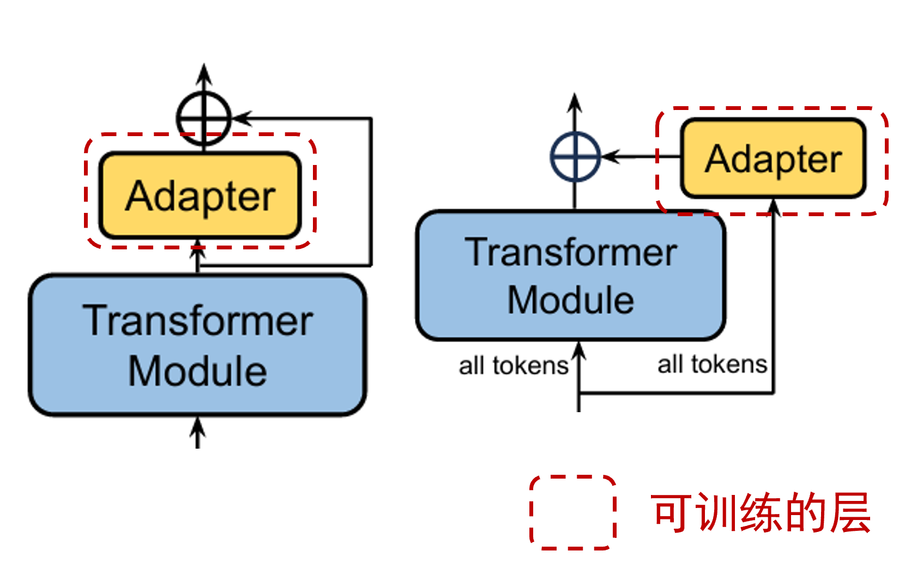
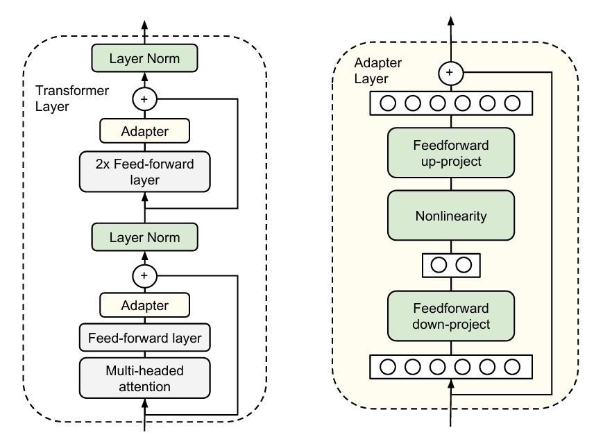
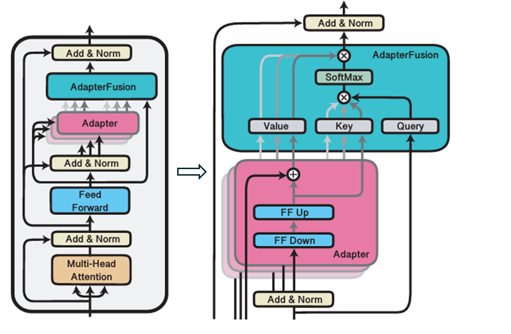
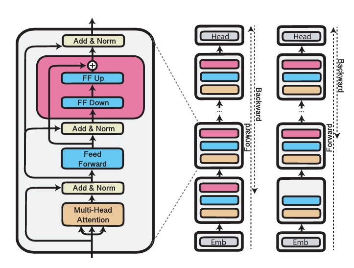
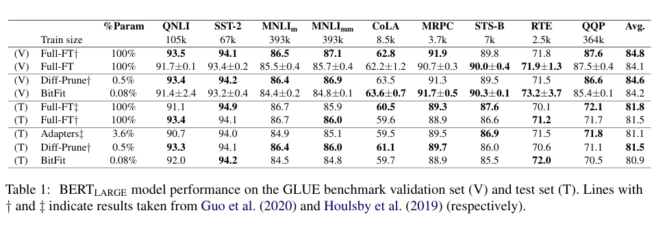
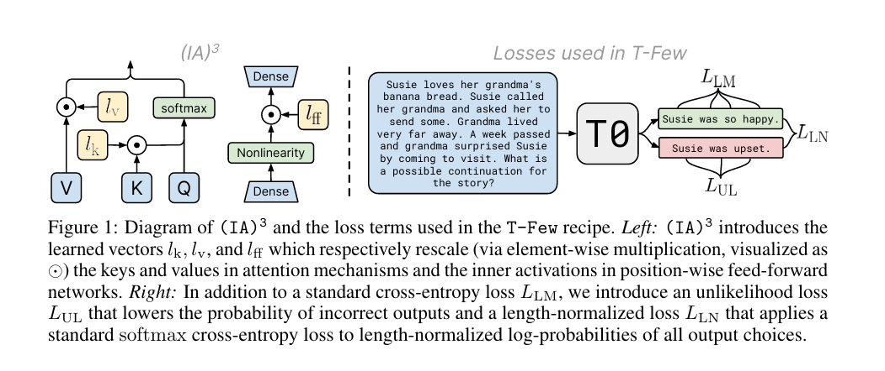
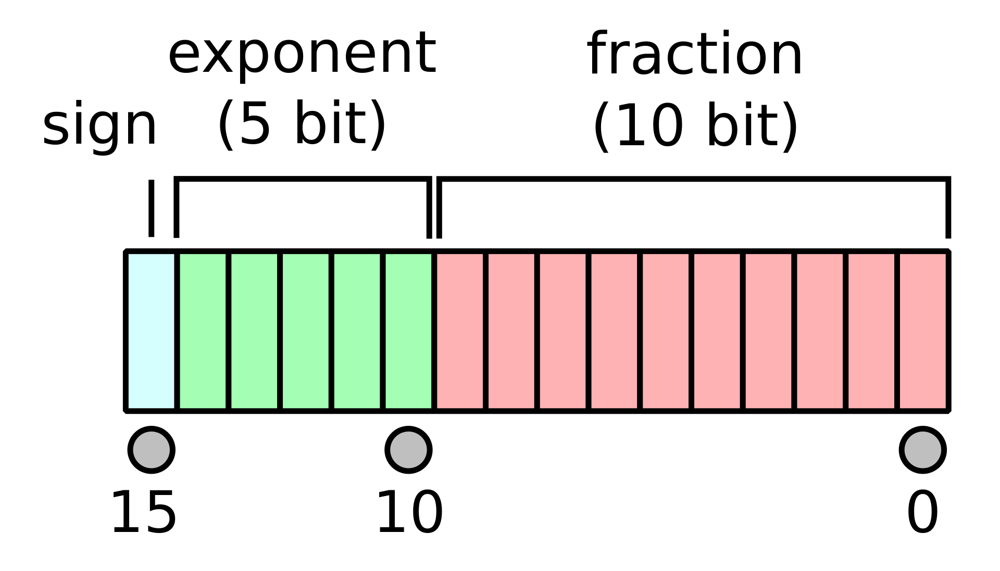
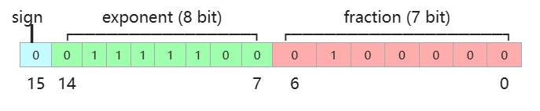
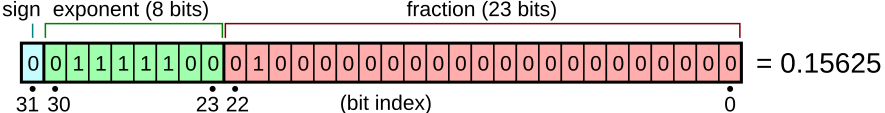
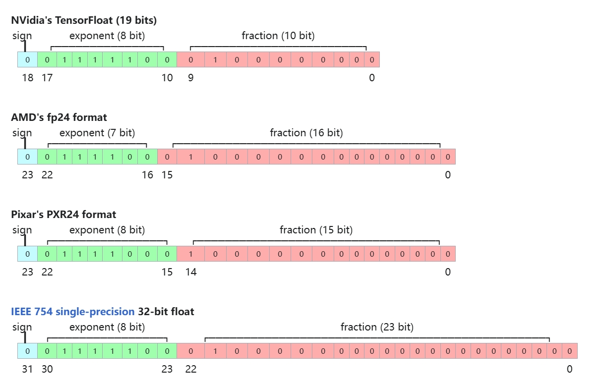

<h1 id="目录">目录</h1>

- [1.基本概念](#1.基本概念)
	- [1.什么是微调？](#1.什么是微调)
	- [2.全量参数微调与参数高效微调有什么区别？](#2.全量参数微调与参数高效微调有什么区别？)
	- [3.参数高效微调（PEFT）有什么优点？](#3.参数高效微调（PEFT）有什么优点？)
	- [4.现有的参数高效微调（PEFT）有什么问题？](#4.现有的参数高效微调（PEFT）有什么问题？)

- [2.指令微调](#2.指令微调)
	- [1.指令微调数据制作发展路线](#1.指令微调数据制作发展路线)
	- [2.指令微调数据构造有哪些指导原则？](#2.指令微调数据构造有哪些指导原则？)
	- [3.经过监督微调SFT后LLM表现下降的原因是什么？](#3.经过监督微调SFT后LLM表现下降的原因是什么？)
    - [4.怎么缓解模型的遗忘（表现下降）？](#4.怎么缓解模型的遗忘（表现下降）？)
    - [5.模型微调阶段样本量规模增大导致的OOM错误原因是什么？](#5.模型微调阶段样本量规模增大导致的OOM错误原因是什么？)
    - [6.微调的基座模型选择Chat还是Base模型？](#6.微调的基座模型选择Chat还是Base模型？)
- [3.LoRA](#3.Lora)
	- [1.简要介绍一下LoRA](#1.简要介绍一下LoRA)
	- [2.简要介绍一下LoRA的问题以及常见的LoRA改进方案](#2.简要介绍一下LoRA的问题以及常见的LoRA改进方案)
    - [3.LoRA训练时的Rank和alpha作用是什么？](#3.LoRA训练时的Rank和alpha作用是什么？)
    - [4.LoRA模型如何初始化](#4.LoRA模型如何初始化)
    - [5.介绍一下大模型常用微调方法LORA和Ptuning的原理。](#5.介绍一下大模型常用微调方法LORA和Ptuning的原理。)

- [4.Adapter-based methods](#4.Adapter)
	- [1.什么是Adapter结构？](#1.什么是Adapter结构？)
	- [2.什么是Bottleneck Adapter？](#2.什么是BottleneckAdapter？)
	- [3.什么是AdapterFusion？](#3.什么是AdapterFusion？)
	- [4.什么是AdapterDrop？](#4.什么是AdapterDrop？)
   	- [5.什么是Compacter？](#5.什么是Compacter？)

- [5.其他PEFT微调方法](#5.其他PEFT微调方法)
	- [1.什么是BitFit微调方法？](#1.什么是BitFit微调方法？)
	- [2.什么是IA3微调方法？](#2.什么是IA3微调方法？)
 
- [6.训练技巧](#6.训练技巧)
	- [1.怎么解决训练使用float16导致溢出的问题](#1.怎么解决训练使用float16导致溢出的问题)
	- [2.llm训练的时候用float16，还是bfloat16，float32?](#2.llm训练的时候用float16，还是bfloat16，float32?)
	- [3.float16是什么数据类型？](#3.float16是什么数据类型？)
	- [4.bfloat16和float32是什么数据类型？](#4.bfloat16和float32是什么数据类型？)
	- [5.什么是FP8？](#5.什么是FP8？)
	- [6.大模型微调需要考虑哪些方面？](#6.大模型微调需要考虑哪些方面？)

<h2 id='1.基本概念'>1.基本概念</h2>


<h3 id='1.什么是微调？'>1.什么是微调？</h3>

**微调**是一种**迁移学习**的方法。基于预训练模型，在特定任务的数据上进行有监督的训练（SFT），以适应任务需求。微调可以将预训练模型在大规模通用数据上学习到的知识迁移到特定任务重。

微调的**一般步骤**包括：（1）选择预训练模型；（2）准备微调数据；（3）构建任务特定的模型头（task-specific head）；（4）加载预训练模型的参数；（5）设置超参数并执行微调；（6）评估，验证和二次微调。

- Task-specific head：添加到预训练模型之上的额外结构，用于根据任务需求进行输出预测或分类。

<h3 id='2.全量参数微调与参数高效微调有什么区别？'>2.全量参数微调与参数高效微调有什么区别？</h3>

**全量微调**：随着预训练大模型的参数规模越来越大，这使得在**消费级硬件**上进行全量微调变得**不可行**。比如：3B参量级的大模型全量微调大约需要48GB的GPU资源，而占用的CPU内存大约在3GB左右。除此之外，模型的全量微调还会导致**多样性的损失**，甚至发生**灾难性遗忘**等问题。

**参数高效微调（PEFT）**：参数高效微调是指**微调少量或额外的模型参数**。该方法固定大部分预训练模型（LLM）参数，大大降低了计算和存储成本的同时，实现与**全量参数微调相当的性能**。高效微调技术可以粗略分为以下三大类：**增加额外参数（A）**、**选取一部分参数更新（S）**、**引入重参数化（R）**。


<h3 id='3.参数高效微调（PEFT）有什么优点？'>3.参数高效微调（PEFT）有什么优点？</h3>

相较于传统的全量微调，PEFT的好处有以下几点：

- **减少计算和存储成本**：PEFT只涉及微调少量的模型参数，显著降低了计算和存储成本。

- **克服灾难性遗忘**：全量微调可能导致模型忘记预训练期间学到的知识，而PEFT只更新少量参数，而不是对整个模型进行微调，能够有效减少对预训练知识的遗忘。

- **数据稀缺场景的泛化性**：在数据稀缺的情况下，PEFT方法能够让模型保持更好的性能。

- **可移植和稳定的性能**：PEFT方法在性能上与全量微调相当，但仅产生MB级的小检查点文件。这使得训练好的权重更容易在不同设备上进行部署。


<h3 id='4.现有的参数高效微调（PEFT）有什么问题？'>4.现有的参数高效微调（PEFT）有什么问题？</h3>

当前的参数高校微调技术存在以下几点问题：

- **参数计算口径不一致**：参数计算包括：可训练参数的数量，微调模型与原始模型相比改变的参数数量、微调模型和原始模型之间差异的等级。仅通过可训练参数量来衡量存储效率是不完美的，但不同的微调方法在这些指标上的表现可能不同，导致比较时存在困难。

- **缺乏模型大小的考虑**：大模型微调所需的参数占比远小于小模型。因此在比较不同的参数高效微调方法时，不仅要关注微调过程中更新的参数量，还需要考虑基础模型的大小。

- **缺乏评价标准和代码规范**：不同研究使用了不同的模型和数据集组合，导致难以直接比较结果。同时，开源代码缺乏统一的编写规范，代码实现不透明，难以复用和验证。

针对以上问题，最佳实践过程应该包括：明确指出参数数量类型，使用不同大小的模型多次评估，与类似方法进行比较，标准化测试数据集并最小化代码实现难度。


<h2 id='2.指令微调'>2.指令微调</h2>

<h3 id='1.指令微调数据制作发展路线'>1.指令微调数据制作发展路线</h3>

1. **Scaling law**：在指令微调数据较为匮乏的时期，收集更多的数据是提升性能的大力出奇迹办法。

2. **人工和启发式的数据多样性**：在数据量积累到一定规模后，数据混合配比成为新的研究话题。一些研究成果验证了合适的数据配比可以提升性能，但数据配比没有通用的万能钥匙。

3. **基于模型的多样性**：随着LLMs/MLLMs，可以让它们参与到数据生产和筛选流程中，例如用GPT3.5/4/4V生产数据，用其它LLMs作为数据质量筛选器。（GPT4/GPT4V为指令微调领域贡献了太多数据，这可能也是一种OpenAI吧）

4. **数据效率**：有了LLMs/MLLMs的加持，数据量似乎已经不成大问题。因此高质量数据的多样性、难度和复杂程度成为了关注焦点。满足上述要求的数据意味着用高质量的响应近似真实用户提示，LIMA论证了只要数据质量足够高，数据量会是次要因素。因此，需要自动化或半自动方案对数据进行过滤：

    1. 基于自然语言规则过滤；

    2. 用InsTag对指令微调数据打语义或意图的标签，从而做聚类分析；

    3. 利用GPT4等语言模型过滤噪声数据；

    4. 利用模型的loss等反馈数据对模型的影响，例如评估模型对指令的不确定性（Active Instruction Tuning）；

5. **数据治理、责任和其他问题**：开始关注数据商业条款、许可，版权等问题。


<h3 id='2.指令微调数据构造有哪些指导原则？'>2.指令微调数据构造有哪些指导原则？</h3>

1. **多样性**：覆盖尽可能多的数据/能力/响应类型；

2. **高质量**：Less is More，最好由算法工程师人工检查每一条指令微调数据，保证每条数据的高质量，三个臭皮匠抵不过一个诸葛亮；

3. **复杂性**：提高每条数据的信息量；

4. **每种能力的激活不需要太多数据**；

5. **更自由的强指令跟随能力需要较多数据**；

6. **精调各项能力配比**，避免遗忘；

<h3 id='3.经过监督微调SFT后LLM表现下降的原因是什么？'>3.经过监督微调SFT后LLM表现下降的原因是什么？</h3>

SFT（Supervised Fine-Tuning）是一种常见的微调技术，它通过在特定任务的标注数据上进行训练来改进模型的性能。在经过监督微调（SFT）后，语言模型（LLM）性能下降可能是由以下几个原因导致的：

**过拟合（Overfitting）**
    - **原理**：在监督微调过程中，如果训练数据量相对模型的容量过小，或者训练轮数过多，模型可能会过度学习训练数据中的细节和噪声，而无法很好地泛化到新的数据。例如，模型可能记住了训练数据中的一些特定的回答模式或文本片段，而不是学习到通用的语言规则和语义理解。
    - **举例**：假设微调一个用于情感分类的LLM，训练数据集中有很多包含特定电影名称的影评，模型可能会过度关注这些电影名称与情感标签之间的关联。当遇到不包含这些电影名称的新影评时，模型的性能就会下降。
**数据质量问题**
    - **标注错误（Labeling Errors）**：监督微调依赖于标注数据来学习任务特定的知识。如果标注数据中存在错误，例如将正面情感的文本标注为负面，那么模型在学习这些错误标注后，性能会受到影响。例如，在一个文本翻译任务中，错误的翻译标注会引导模型学习到错误的翻译规则。
    - **数据分布偏差（Data Distribution Bias）**：如果微调数据的分布与预训练数据或者实际应用场景中的数据分布差异过大，模型可能会在新的数据分布上表现不佳。比如，预训练数据涵盖了各种主题和风格的文本，但微调数据主要集中在某一特定领域，那么模型在其他领域的文本处理上性能可能会下降。
**模型结构和超参数问题**
    - **微调策略不当（Improper Fine - tuning Strategy）**：选择的微调方法可能不适合当前的任务或模型。例如，微调时学习率设置过高，可能会导致模型在优化过程中跳过最优解，甚至使模型参数变得混乱，无法有效学习到有用的信息。
    - **模型架构冲突（Model Architecture Mismatch）**：某些LLM的架构可能在预训练阶段针对通用语言知识进行了优化，在监督微调时，如果任务的性质与预训练的目标差异很大，模型可能无法很好地适应。例如，一个以生成式预训练为主的模型，在微调用于判别式任务（如文本分类）时，如果没有适当的调整，可能会出现性能问题。
**灾难性遗忘（Catastrophic Forgetting）**
    - **原理**：在LLM进行监督微调时，模型可能会忘记在预训练阶段学到的通用语言知识，而过度关注微调任务相关的知识。因为模型的参数在微调过程中被更新，新的任务知识可能会覆盖或干扰之前学到的知识。
    - **举例**：一个已经预训练好的语言模型，在预训练阶段学会了很好的语法知识和词汇语义。在进行监督微调用于某个特定领域（如医学文献翻译）后，可能会忘记一些通用词汇在其他语境下的正确用法，从而导致在处理非医学文本时性能下降。

可以使用一些策略进行改善，如：
- 使用更小的学习率进行微调，以减少模型对预训练知识的遗忘。
- 使用正则化技术，如权重衰减或者早停，以防止模型过度适应微调数据。
- 使用Elastic Weight Consolidation（EWC）等技术，这些技术试图在微调过程中保留模型在预训练阶段学到的重要知识。


<h3 id='4.怎么缓解模型的遗忘（表现下降）？'>4.怎么缓解模型的遗忘（表现下降）？</h3>

- **保留部分通用数据**：在进行模型微调时，保留部分通用数据用于模型微调。

- **增量训练策略**：将微调数据与通用数据逐步交替进行训练。

- **强化学习**：通过给模型设置奖励机制，鼓励模型在领域任务上表现好，同时保持一定的通用能力。

- **数据重采样**：确保模型在微调过程中能够更多地接触到通用数据，从而缓解遗忘通用能力的问题。


<h3 id='5.模型微调阶段样本量规模增大导致的OOM错误原因是什么？'>5.模型微调阶段样本量规模增大导致的OOM错误原因是什么？</h3>

全参数微调的显存需求取决于多个因素，包括模型的大小（参数数量），批次大小，序列长度，以及是否使用了混合精度训练等。对于GPT-3这样的大模型，如果想要在单个GPU上进行全参数微调，可能需要数十GB甚至上百GB的显存。

当样本量规模增大时，可能会出现OOM（Out of Memory）错误，这是因为模型需要更多的内存来存储和处理数据。

一般来说导致OOM（Out of Memory）错误的原因主要有以下几点：
- **数据存储需求增加**：随着样本量的增大，需要加载到内存中的数据量也相应大幅增加。模型在训练时需要同时存储输入数据、标签数据以及可能的一些预处理后的中间结果等，这会快速耗尽内存资源。例如，对于图像数据，每个样本可能本身就具有较大的尺寸和数据量，大量样本积累起来会占用巨额内存.
- **模型参数更新的内存开销**：在微调过程中，模型需要计算每个样本的梯度来更新参数。更多的样本意味着更多的梯度计算和参数更新步骤，这会导致存储梯度信息和临时计算结果所需的内存增加。而且，一些优化算法在更新参数时还可能需要额外的内存来存储中间状态信息.
- **批量大小的影响**：通常情况下，为了加快训练速度和提高模型性能，会使用一定大小的批量数据进行训练。当样本量增大时，如果保持较大的批量大小，那么每次迭代需要处理的样本数量就更多，内存消耗也会呈倍数增长。即使批量大小保持不变，由于总样本量的增加，在整个训练过程中累计的内存占用也会逐渐超出限制.
- **模型复杂度与参数数量**：大型的预训练模型本身具有大量的参数，在微调时这些参数需要与大量的样本数据进行交互计算。当样本量进一步增大时，模型参数与样本数据之间的计算量和内存需求会急剧上升。例如，像GPT-3这样的大型语言模型，其参数量巨大，微调时即使是中等规模的样本量增加，也可能导致内存不足.
- **硬件限制**：即使数据存储和计算本身理论上所需的内存并未超出系统总内存，但计算机硬件设备（如GPU显存）存在着固定的容量限制。当样本量规模增大到一定程度，硬件设备无法提供足够的内存来满足模型训练的需求，就会出现OOM错误.
为了解决这个问题，可以尝试以下方法：
- 减小批量大小：这可以减少每次训练需要处理的数据量，从而减少内存使用。
- 使用梯度累积：这种方法可以在不减小批量大小的情况下，减少内存使用。
- 使用模型并行：这种方法可以将模型的不同部分放在不同的设备上进行训练，从而减少每个设备需要的内存。

<h3 id='6.微调的基座模型选择Chat还是Base模型？'>6.微调的基座模型选择Chat还是Base模型？</h3>

如果监督任务涉及对话生成（如生成对话回复、对话情感分类等），建议选择 Chat 模型作为基座模型。如果监督任务是单轮文本生成（如新闻标题生成、文章摘要等）或非对话生成任务，建议选择 Base模型作为基座模型。

<h2 id='3.LoRA'>3.LoRA</h2>


<h3 id='1.简要介绍一下LoRA'>1.简要介绍一下LoRA</h3>

LoRA全称Low Rank Adaptation，出自论文《LoRA: Low-Rank Adaptation of Large Language Models》。

LoRA的出发点是：预训练模型的参数量太大，而事实上对下游任务的微调所需要的本征维度(Intrinsic Dimension)并不高。

假设预训练参数 $W_0$ ，微调后的参数为 $W_1$ ，参数更新可以表示：

$$W_1 = W_0 + \Delta W$$

在“本征维度较低”假设下，可以将$\Delta W$做低秩分解：

$$W_1 = W_0 + UV$$

其中 $U \in {\mathbb R}^{m \times r}$；$V \in {\mathbb R}^{r \times n}$ 。 $r$ 可以设置得非常小，而后在微调过程中只微调 $UV$ 。
这样需要被微调的参数量就少了很多很多。

在实践中，要保证模型初始为预训练状态以获得一个好的微调起点，例如将$UV$之一做全0初始化，或者在 $W_0$ 中先减去 $UV$ .


<h3 id='2.简要介绍一下LoRA的问题以及常见的LoRA改进方案'>2.简要介绍一下LoRA的问题以及常见的LoRA改进方案</h3>

LoRA的低秩思路显著提升了微调效率，但同时也受到低秩限制，微调性能和全参微调还是存在差距。

**（1）PLoRA**

**PLoRA**的改进思路是通过多阶段累积低秩矩阵来逼近全参微调性能。
PLoRA在每个训练阶段做一次LoRA微调并在阶段结束时将训练得到的LoRA合并到主干参数中，然后重新初始化LoRA状态。

**(2) LoRA+**

**LoRA+**可以为UV矩阵设置不同的学习率。


<h3 id='3.LoRA训练时的Rank和alpha作用是什么？'>3.LoRA训练时的Rank和alpha作用是什么？</h3>
rank 是矩阵的秩，它决定了模型在微调过程中允许模型学习的新特征的维数。通常，rank 选
的越小，意味着模型的新参数越少，从而降低开销。然后，秩越低，LoRA 层捕捉到的表示能力
就越低，这可能会影响模型在新任务重的表现。
alpha 是 LoRA 中的一个缩放系数，它用于调节 LoRA 层的输出对最终模型的影响。在
LoRA 中，LoRA 层的输出会被乘以一个缩放系数 alpha / rank
 。其计算公式为：

$$
HLoRA =
alpha
/rank × (A × B)
$$

其中 HLoRA 是 LoRA 层的输出。alpha 的作用是控制 LoRA 层在微调过程中对整个模型
输出的影响:
• 当 alpha 较大, LoRA 层对模型的影响会加大，LoRA 层的输出将更强烈地改变模型的行
为。这通常在微调任务需要对模型进行显著调整时使用。
• 当 alpha 较小, LoRA 层对模型的影响较小，意味着微调过程中 LoRA 对模型的改动相对
温和。这通常适用于希望仅对模型进行小幅调整的任务。
因此，alpha 是用来平衡 LoRA 层与原始模型输出的系数，确保 LoRA 层的更新不会过度影响模型的输出，保持模型稳定性


<h3 id='4.LoRA模型如何初始化'>4.LoRA模型如何初始化</h3>

在 LORA 模型中，down 层的权重使用标准正态分布初始化，标准差为 1/rank，而 up 层的权重初始化为 0。原因如下：
- 保持模型的初始输出不变：在模型初始化时，不希望 LoRA 层对模型的输出产生大的改变或干扰。将 up 层的权重初始化为零，意味着 LoRA 层在刚开始时对模型的输出不会有任何影响，模型的行为与没有 LoRA 的原始模型一致。
- 渐进式学习 LoRA 参数：LoRA 层的目标是在不破坏模型预训练的情况下，逐步微调这些新插入的层。因此，在开始时，将 up 层初始化为零可以保证 LoRA 仅从预训练的基础模型输出开始，逐步加入对任务相关的影响。down 层的初始化使用正态分布，它的作用是将输入特征进行压缩，这个压缩操作开始时可以是任意的（因此使用正态分布初始化）。但up层的作用是将低秩表示映射回到高维度，如果 up 层初始化为零，则不会在初始时对原始模型的输出产生干扰。这样，网络可以逐渐通过学习适应新的任务，而不是一开始就对模型施加随机的影响。

<h1 id='5.介绍一下大模型常用微调方法LORA和Ptuning的原理。'>5.介绍一下大模型常用微调方法LORA和Ptuning的原理。</h1>

Lora方法的核心是在大型语言模型上对指定参数增加额外的低秩矩阵，也就是在原始PLM旁边增加一个旁路，做一个降维再升维的操作。并在模型训练过程中，固定PLM的参数，只训练降维矩阵A与升维矩阵B。

Ptuning方法的核心是使用可微的virtual token替换了原来的discrete tokens，且仅加入到输入层，并使用prompt encoder（BiLSTM+MLP）对virtual token进行编码学习。

以下是对大模型常用微调方法LORA和P-tuning原理的介绍：

### LORA原理
- **核心思想**：LORA即低秩适应（Low-Rank Adaptation），其核心是在模型的权重矩阵中引入两个低秩矩阵的乘积来近似全参数微调的更新，从而大幅减少参数量，降低计算和存储成本.
- **在LLM中的应用** ：
    - **参数效率**：通过低秩适应减少了参数更新的数量，使得在有限的计算资源下可以对更大的模型进行微调。
    - **微调速度**：参数量的减少加快了微调过程，让模型能更快适应特定任务。
    - **多任务学习**：允许在同一预训练模型基础上，通过不同的低秩矩阵适应不同的下游任务，实现多任务学习。
    - **推理效率**：在推理阶段，将训练好的低秩矩阵与预训练权重合并，避免了推理时的额外开销。
    - 
### P-tuning原理
- **核心思想**：P-tuning是通过修改输入提示（prompt）来调整模型对特定任务的适应性，而不是直接调整模型的权重，主要是将 prompts 转化为可学习的嵌入层，并使用多层感知机（MLP）和长短期记忆网络（LSTM）等对其进行处理，从而找到更优的提示表示，以更好地引导模型生成或预测任务相关的输出.
- **具体做法**：
    - **样本选择**：从大规模文本语料库中选取具有多样性的样本作为训练集，涵盖不同文化、背景和价值观.
    - **PLM预训练**：利用选定样本进行预训练，得到包含词语上下文信息及关联性的初始预训练语言模型.
    - **特征定义**：定义特征函数，用于指示某个词对特定偏见的敏感程度，特征函数可包含词语含义、出现上下文的频次等.
    - **偏见调整**：通过修改样本中某些词语的上下文，降低其与偏见之间的相关性，从而调整预训练语言模型的偏见.
    - **约束优化**：引入约束函数度量样本平衡性，控制偏见调整程度，约束函数可包括不同群体的样本分布、词语多样性等，在该框架下反复调整样本和模型，直至达到平衡状态.
- **优点及发展**：P-tuning通常比传统权重微调更简单，无需调整模型权重，只需设计不同提示，更容易实现和实验，还可通过设计更多提示提高模型性能，且具有较好的泛化能力。不过，其成功很大程度上取决于提示的设计，需要深入理解任务和语言模型工作原理并进行大量实验调整。为改进P-tuning等方法存在的问题，如缺乏模型参数规模和任务通用性、缺少深度提示优化等，又发展出了P-tuning v2，它在不同模型规模和各种困难的自然语言理解任务上表现与微调相匹配，且大大降低了训练时间、内存消耗和存储成本.


<h2 id='4.Adapter'>4.Adapter-based methods</h2>


<h3 id='1.什么是Adapter结构？'>1.什么是Adapter结构？</h3>

在设计针对特定下游任务的模型优化策略时，全面微调预训练模型的全部参数效率较低。而如果仅对预训练模型的部分层进行固定，只调整接近下游任务的几层参数，则难以实现理想的效果。为解决这一问题，研究人员设计了一种名为Adapter的结构，并将其**嵌入**到Transformer模型中。在训练过程中，**保持原预训练模型的参数不变**，仅对新增的**Adapter结构**进行微调。常见的Adaptor包括：Bottleneck Adapter, AdapterFusion，AdapterDrop和Compacter。




<h3 id='2.什么是BottleneckAdapter？'>2.什么是Bottleneck Adapter？</h3>

**定义**: Adapter层的结构相对简单，它首先将输入数据降维到一个较小的维度，然后通过一个非线性激活函数进行处理，接着再将数据升维回到原始维度。此外，Adapter层在输入和输出之间加入了残差连接。新增的参数量大约占原模型参数量的0.5%~8%。



**初始化**：参数从均值为0，标准差为0.01的正太分布中随机采样。初始化策略可以使得Adaptor中的全连接网络输出较小，从而使得残差连接传递的信息更为显著。

**训练**：只训练Adapter的参数和Layer normalization的参数。

**论文原文**：[Parameter-Efficient Transfer Learning for NLP](https://proceedings.mlr.press/v97/houlsby19a/houlsby19a.pdf)


<h3 id='3.什么是AdapterFusion？'>3.什么是AdapterFusion？</h3>

**定义**：针对传统多任务学习中存在的问题，我们采取以下策略：首先，为每个任务学习一组特定的adapter参数。接着，在针对某个特定目标任务进行学习时，引入一个融合模块，该模块负责将第一步中所有任务的adapter参数结合起来。假设在第二阶段中，所有任务都已包含在第一阶段的学习中，不考虑在第二阶段引入新任务的情况。Adapter Fusion层的结构就是一个**注意力模块**。Q是原来transformer层中全连接层的输出，K和V都是各个任务对应的adapter的输出。



**初始化**：QK随机初始化，V初始化成identity matrix加上一些小的随机噪声。

**训练**：（1）训练每个任务对应的Adapter。可以考虑单独训练，也可以考虑联合训练。（2）加入Adapter Fusion层，在目标任务上进行二次训练。单独训练+Adapter Fusion的效果最好。

**论文**：[AdapterFusion: Non-Destructive Task Composition for Transfer Learning](https://aclanthology.org/2021.eacl-main.39.pdf)


<h3 id='4.什么是AdapterDrop？'>4.什么是AdapterDrop？</h3>

**定义**：为了加快推理速度，在推理时对某几层的Adapter进行剪枝。由于靠近输入的Adapter被剪掉后对性能的影响较小。因此，设计了两种**训练方案**：（1）Specialized Adaptor Drop：训练时固定最接近输入的N层，然后推理时也固定裁掉这几层。（2）Robust Adaptor Drop：训练时每个batch都随机设定N值，保证在推理时可以适应多种裁剪方案。两种方案在N<=5时，都可以保持相对高的性能，但加快了20%~40%的推理速度。



**论文**：[AdapterDrop: On the Efficiency of Adapters in Transformers](https://aclanthology.org/2021.emnlp-main.626.pdf)


<h3 id='5.什么是Compacter？'>5.什么是Compacter？</h3>

**定义**：Compacter在adapter的放置位置和训练方式上沿用了传统方法，但其对adapter结构进行了重新设计，使其更加轻量化。通过这种设计，Compacter仅需增加原始模型大约0.05%-0.2%的参数量，就能在GLUE和SuperGLUE等基准测试中取得良好的性能表现。


**结构**：Compacter应用了Kronecker积。假设传统的Bottleneck Adapter是两层$K \times B$的矩阵，Compacter首先将每个矩阵拆分为一个$n \times n$的矩阵A和一个$k/n \times b/n$的矩阵B的Kronecker积，然后要求两个adaptor共享矩阵A。另外，再次把矩阵B分解为n组两个低秩矩阵$k/b \times r$和$r \times b/n$的积。这样子就大大减少了Adapter所需的参数量。

**论文**：[COMPACTER: Efficient Low-Rank Hypercomplex Adapter Layers](https://proceedings.neurips.cc/paper_files/paper/2021/file/081be9fdff07f3bc808f935906ef70c0-Paper.pdf)


<h2 id='5.其他PEFT微调方法'>5.其他PEFT微调方法</h2>

<h3 id='1.什么是BitFit微调方法？'>1.什么是BitFit微调方法？</h3>

BitFit是一种稀疏的微调方法，它训练时只更新部分或者全部的偏置值。对于Transformer模型而言，涉及到的bias参数有attention模块中计算quer，,key，value跟合并多个attention结果时涉及到的bias，MLP层中的bias，Layernormalization层的bias参数。该方法在GLUE benchmark上的结果如图所示。



论文地址：https://arxiv.org/pdf/2106.10199

<h3 id='2.什么是IA3微调方法？'>2.什么是IA3微调方法？</h3>

IA3是一种基于可训练向量的加权微调技术，它通过可训练向量来**抑制**和**放大**Transformer模型中attention和feedforward模块的**内部激活层**，而原始权重保持冻结。这种方法通过引入相对较少的新参数，达到改进模型性能的目的。



该方法的优点有：大幅减少了训练所需的参数量（相较于LoRA）；轻量便携的IA3微调模块：相较于全量微调性能损失不大。

<h2 id='6.训练技巧'>6.训练技巧</h2>


<h3 id='1.怎么解决训练使用float16导致溢出的问题？'>1.怎么解决训练使用float16导致溢出的问题</h3>

在训练过程中使用 float16 可能会导致数值溢出（overflow）或下溢（underflow），特别是在处理大模型和高动态范围的数据时。为了解决这些问题，可以采取以下几种策略：

### 1. **损失缩放（Loss Scaling）**

损失缩放是一种常见的方法，用于在使用 float16 进行训练时保持数值稳定性。具体步骤如下：

- 在前向传播过程中，将损失值乘以一个缩放因子（例如 1024 或 65536）。

- 在反向传播计算梯度时，将梯度除以同样的缩放因子。

通过这种方式，可以在梯度计算中保持足够的数值范围，减少下溢和溢出的风险。

```python
loss_scale = 1024.0
scaled_loss = loss * loss_scale
scaled_loss.backward()
for param in model.parameters():
    if param.grad is not None:
        param.grad.data /= loss_scale
```

### 2. **混合精度训练（Mixed Precision Training）**

混合精度训练结合使用 float16 和 float32，以兼顾计算效率和数值稳定性。通常使用 NVIDIA 的 Apex 或 PyTorch 的 AMP（Automatic Mixed Precision）工具来实现混合精度训练。

在 PyTorch 中，可以使用 `torch.cuda.amp` 进行混合精度训练：

```python
from torch.cuda.amp import GradScaler, autocast
scaler = GradScaler()
for input, target in data_loader:
    optimizer.zero_grad()
    with autocast():
        output = model(input)
        loss = criterion(output, target) 
    scaler.scale(loss).backward()
    scaler.step(optimizer)
    scaler.update()
```

### 3. **模型架构调整**

对于特定的模型，可以通过调整架构来减少溢出和下溢问题。例如：

- 在网络中添加适当的正则化层（如 Batch Normalization）来稳定训练。

- 使用更小的初始学习率，并逐渐增加。

- 采用较浅的网络层，减少过深网络带来的数值不稳定性。
- 
### 4. **动态损失缩放**

动态损失缩放是一种自适应调整损失缩放因子的方法，能够根据训练过程中的数值范围动态调整缩放因子。可以通过 NVIDIA Apex 工具中的 `DynamicLossScaler` 类来实现。

```python
from apex import amp
model, optimizer = amp.initialize(model, optimizer, opt_level="O1")
for input, target in data_loader:
    optimizer.zero_grad()
    with amp.scale_loss(loss, optimizer) as scaled_loss:
        scaled_loss.backward()
    optimizer.step()
```

### 5. **监控和调整训练参数**

在训练过程中，持续监控梯度和权重的数值范围，及时调整训练参数（如学习率、损失缩放因子等）以避免数值问题。可以使用工具（如 TensorBoard）来可视化这些信息，并做出相应的调整。

### 总结

通过结合使用损失缩放、混合精度训练、模型架构调整和动态损失缩放等方法，可以有效解决 float16 训练过程中出现的数值溢出问题，提高训练效率和数值稳定性。


<h3 id='2.llm训练的时候用float16，还是bfloat16，float32?'>2.llm训练的时候用float16，还是bfloat16，float32?</h3>

在训练大规模语言模型（LLM）时，使用不同的数值精度（如float16、bfloat16、float32）各有其优缺点，具体选择取决于训练的需求、硬件支持和精度要求。以下是每种数值精度的特点和适用情况：

1. **Float32（单精度浮点数）**：

   - **特点**：32位浮点数，提供较高的精度和动态范围。

   - **优点**：高精度，数值稳定性好，广泛支持。

   - **缺点**：内存和计算需求较大，训练速度较慢。

   - **适用情况**：用于需要高精度的训练场景，尤其是在数值稳定性非常关键的情况下。

2. **Float16（半精度浮点数）**：

   - **特点**：16位浮点数，精度和动态范围较低。

   - **优点**：内存和计算需求低，能够显著加速训练过程，适合在支持混合精度训练的硬件（如NVIDIA的Tensor Cores）上使用。

   - **缺点**：数值稳定性较差，容易出现溢出和下溢，需要额外的措施（如损失缩放）来确保训练稳定性。

   - **适用情况**：适用于资源受限、需要加速训练的场景，但需要注意数值稳定性。

3. **BFloat16（单精度浮点数的变种）**：

   - **特点**：16位浮点数，与float16相比，具有更大的动态范围，但精度略低。

   - **优点**：较大的动态范围使其在处理大模型和复杂计算时更加稳定，不需要复杂的损失缩放技术。兼顾计算效率和数值稳定性。

   - **缺点**：精度不如float32，但在大多数情况下足够使用。

   - **适用情况**：适用于需要平衡训练速度和数值稳定性的场景，尤其在支持bfloat16的硬件（如Google的TPUs）上效果更佳。

### 总结：

- **Float32**：适用于需要高精度和数值稳定性的训练任务。

- **Float16**：适用于希望加速训练过程并能应对数值稳定性挑战的任务，适合使用NVIDIA GPU的混合精度训练。

- **BFloat16**：适用于需要兼顾训练速度和数值稳定性的任务，尤其在使用Google TPU时。
在实际操作中，bfloat16和混合精度（float16和float32结合使用）往往是大模型训练中的最佳选择，因其在计算效率和数值稳定性之间达到了较好的平衡。


<h3 id='3.float16是什么数据类型？'>3.float16是什么数据类型？</h3>

#### 基本概念

**简要介绍**

半精度浮点数，又称float16，FP16，half-precision floating-point，binary16，用16位二进制来表示数据的浮点数。其格式如图所示：



**格式详解**

Sign（符号位）：1位。0表示正数，1表示负数。

Exponent（指数位）：5位。对于float16，范围为00001~11110，偏置常数为15，因此可以表示的数据范围为 $2^{1−15}$ ~ $2^{30−15}$ 。

Fraction（尾数位）：10位。为了确保浮点数的表示唯一性，所有浮点数格式规定尾数部分的高位始终为1，这一位在表示中是隐含的，因此尾数实际上有11位的精度。

因此，float16的计算公式如下（同样也可以采用 $1 \times 2^0 + 0(1) \times 2^1 ...$ 的方式对尾数位进行计算）：

$$ (-1)^{sign} \times 2^{exponent-15} \times (1+ \frac{fraction_{2进制到10进制}}{1024})$$

**特殊数值**

最大正数（65504）： $0 \, 11110 \, 1111111111$

最大负数（-65504）： $1 \, 11110 \, 1111111111$

+0：$0 \, 00000 \, 0000000000$

-0：$1 \, 00000 \, 0000000000$

正无穷：$0 \, 11111 \, 0000000000$

负无穷：$1 \, 11111 \, 0000000000$（

**分辨率和最小分辨率**

分辨率：在当前的指数位设置下，每个最小单位（1/1024）所代表的数值大小，即 $2^{exponent-15} \times  \frac{1}{1024}$ 。因此，不同分辨率的数据相加可能会由于精度丢失而导致小数部分被舍去。

最小分辨率：表示float16，可以表示的最小精度，即 $2^{-14} \times  \frac{1}{1024} \approx 0.000000059604645$


<h3 id='4.bfloat16和float32是什么数据类型？'>4.bfloat16和float32是什么数据类型？</h3>

#### bfloat16

bfloat16，又称BP16，brain floating point，用16位二进制来表示数据的浮点数。相较于float16，其格式是Sign（符号位）为1位；Exponent（指数位）为8位，偏置常数为127；Fraction（位数）为7位。其计算公式，特殊数值，分辨率和最小分辨率的表示方法，同float16。bfloat16的格式如图所示：



#### float32

单精度浮点数，又称float32，FP32，single-precision floating-point，binary32，用32位二进制来表示数据的浮点数。相较于float16，其格式是Sign（符号位）为1位；Exponent（指数位）为8位，偏置常数为127；Fraction（位数）为23位。其计算公式，特殊数值，分辨率和最小分辨率的表示方法，同float16。float32的格式如图所示：



#### 不常见的数据类型




<h3 id='5.什么是FP8？'>5.什么是FP8？</h3>

#### 基本概念

FP8是FP16的衍生产物，一般包含1E5M2和1E3M3两种编码格式。其中，E表示指数位，M表示尾数位（也可以用fraction）。


#### 表示范围

FP8也采用浮点表示法（符号位：0正1负；指数位和尾数位共同表示数值大小）。详细请参照FP16。

**差异**：E5M3严格遵守IEEE754标准（指数位全为1，尾数位任意，则表示无穷）。但E4M3不完全遵守，指数位全为1，也需按照浮点数表示法进行有效数字的换算；当且仅当指数和位数全为1时，才表示无穷。

#### 与INT8比较

- FP8 具有更大的表示范围；但在一定范围内，其表示精度相较 INT8 更差。

- 选择合适的缩放因子时，INT8的量化精度高于FP8，且两者之间的误差几乎相差一个数量级。FP8将提供更好的宽容性，对scale的选择不敏感。


<h1 id='6.大模型微调需要考虑哪些方面？'> 6.大模型微调需要考虑哪些方面？</h1>

- **目标领域**：希望改进当前预训练模型的哪些能力？

- **代替方案**：是否有其他替代方案能够达到预期的效果？如果不能是否已经通过替代方案创建了比较的基线？

- **成本**：是否估算了微调的成本（算力，数据等）？
