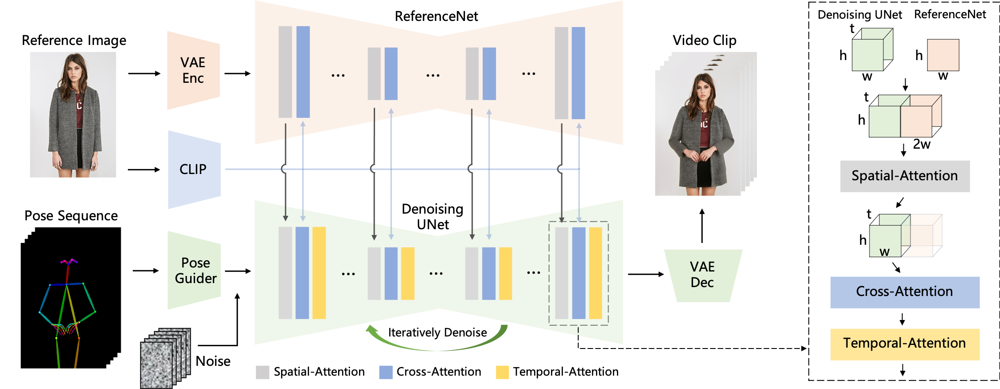

# 目录

## 第一章 可控数字人生成
- [1.2D数字人生成有什么方向?](#1.2D数字人生成有什么方向?)
- [2.如何基于一个图像生成模型扩展到视频?](#2.如何基于一个图像生成模型扩展到视频?)
- [3.人体驱动的方法有哪些?](#3.人体驱动的常用方法有哪些?)
- [4.可控人体生成的目的是什么，如何做到驱动?](#4.可控人体生成的目的是什么，如何做到驱动?)
- [5.如何提升人体驱动生成中脸部的ID相似度?](#5.如何提升人体驱动生成中脸部的ID相似度?)
- [6.Animate-Anyone的模型结构和原理](#6.Animate-Anyone的模型结构和原理)
- [7.ID保持图像生成和换脸的区别](#7.ID保持图像生成和换脸的区别)
- [8.有哪些专注人像生成的预训练模型?](#8.有哪些专注人像生成的预训练模型?)
- [9.介绍一下IP-Adapter](#9.介绍一下IP-Adapter)
- [10.介绍一下InstantID](#10.介绍一下InstantID)
- [11.介绍一下PuLID](#11.介绍一下PuLID)
- [12.介绍一下UniPortrait](#12.介绍一下UniPortrait)
- [13.介绍一下ConsistentID](#13.介绍一下ConsistentID)
- [14.介绍一下PhotoMaker](#14.介绍一下PhotoMaker)
- [15.介绍一下Hallo](#15.介绍一下Hallo)
- [16.介绍一下Hallo2](#16.介绍一下Hallo2)
- [17.介绍一下Hallo3](#17.介绍一下Hallo3)
- [18.介绍一下UniPortrait](#18.介绍一下UniPortrait)
- [19.介绍一下LivePortrait](#19.介绍一下LivePortrait)
- [20.介绍一下ConsisID](#20.介绍一下ConsisID)
- [21.什么是视频虚拟换衣](#21.什么是视频虚拟换衣)
- [22.视频换衣和图像换衣的区别](#22.视频换衣和图像换衣的区别)
- [23.视频虚拟换衣有哪些应用场景](#23.视频虚拟换衣有哪些应用场景)
- [24.视频换衣面临哪些技术挑战？如何解决？](#24.视频换衣面临哪些技术挑战？如何解决？)
- [25.如何解决视频换衣中服饰与动作的匹配冲突](#25.如何解决视频换衣中服饰与动作的匹配冲突)
- [26.如何设计一套成品模特试穿视频生成链路](#26.如何一套成品模特试穿视频生成链路)

## 第一章 可控数字人生成

<h2 id="1.2D数字人有什么方向">1.2D数字人有什么方向?</h2>

目前，2D数字人生成的方向包括：

1. 可控人体生成
- ‌**人体驱动** 
- **虚拟换衣**

2. 可控人脸生成
- **人脸属性编辑**
- **换脸**
- **目标人脸引导的人脸驱动生成**
- **音频引导的人脸驱动生成**

3. ID保持的人体图像/视频生成
- **视频写真**

<h2 id="2.如何基于一个图像人体或人脸生成模型扩展到视频?">2.如何基于一个图像生成模型扩展到视频?</h2>

  基于GAN的方案构造视频数据集抽帧进行训练即可，无需添加额外的帧间一致性模块，测试时就可以达到不错的帧间稳定性。由于扩散模型方案建模的多样性强，如果直接逐帧进行推理会导致帧间一致性较差，目前常用的解决方式是采用SD1.5或者SDXL基底模型的基础上，第一阶段使用人脸或人体数据集将底模调整到对应的domain，第二阶段插入一个类似AnimateDiff中提出的Motion Module提升帧间一致性。

<h2 id="3.人体驱动的方法有哪些?">3.人体驱动的方法有哪些?</h2>

|                                                              |     T2V model                 |     Pose Condition                   |     Injection Type                                     |     Others                |
|--------------------------------------------------------------|-------------------------------|--------------------------------------|--------------------------------------------------------|---------------------------|
|     Magic Animate                                            |     AnimateDiff               |     DensePose                        |     ReferenceNet+ControlNet                            |     w/o. alignment        |
|     Animate Anyone                                           |     AnimateDiff               |     DWPose                           |     ReferenceNet+Pose Encoder+CLIP                     |     w/o. alignment        |
|     Moore-Animate Anyone (AA unofficial   implementation)    |     AnimateDiff               |     DWPose                           |     ReferenceNet+Pose Encoder+CLIP                     |     w/o. alignment        |
|     MusePose                                                 |     AnimateDiff               |     DWPose                           |     ReferenceNet+Pose Encoder+CLIP                     |     w/. alignment (2d)    |
|     Champ                                                    |     AnimateDiff               |     DensePose/DWPose/Normal/Depth    |     ReferenceNet+Pose Encoder+CLIP                     |     w/. alignment (2d)    |
|     UniAnimate                                               |     AnimateDiff               |     DWPose                           |     Pose Encoder+CLIP                                  |     w/. alignment (2d)    |
|     ViVidPose                                                |     Stable Video Diffusion    |     DWPose/SMPLX-Shape               |     ReferenceNet+Pose   Encoder+CLIP+Face   Encoder    |     w/. alignment (3d)    |

<h2 id="4.可控人体生成的目的是什么，如何做到驱动?">4.可控人体生成的目的是什么，如何做到驱动?</h2>
    
  不管是文本生成、图像生成、视频生成，如果没有具备可控性，AI作为一个工具，本身能够带来的效能的提升就非常的有限。可控人体生成的目的就是希望通过输入一段目标的姿态序列和一张参考人像图片，能够保持参考人像的背景，人物特征的同时，生成其按照目标序列进行运动的人像视频。

<h2 id="5.如何提升人体驱动生成中脸部的ID相似度?">5.如何提升人体驱动生成中脸部的ID相似度?</h2>

  人脸生成，是 AI 生成视频中最难的场景之一。首先是因为人类对人脸本身就很敏感。一个细微的肌肉表情，就能被解读出不同的含义。人们自拍经常要拍几十张相似的照片，才能挑到合适的角度。因此涉及到人脸的一些形变，很容易就会引起我们的注意。在早期的人体驱动工作中，研究者们并没有过多的采用一些额外的模块约束参考人像和生成人像的脸部ID一致性，仅采用ReferenceNet和CLIP Image Encoder来提取了参考人像信息。在此基础上，有几种方式可以提升脸部ID一致性：
  1. 在训练过程中，计算生成人脸和参考人脸的ID Similarity，并加入ID Loss，
  2. 对于参考人像的人脸区域，使用人脸识别网络提取对应的ID信息，在主干网络中注入

<h2 id="6.Animate-Anyone的模型结构和原理">6.Animate-Anyone的模型结构和原理</h2>

  AnimateAnyone是一种能够将角色图像转换为所需姿势序列控制的动画视频的方法，继承了Stable Diffusion模型的网络设计和预训练权重，并在UNet中插入Motion Module以适应多帧输入。为了解决保持外观一致性的挑战，引入了ReferenceNet，专门设计为UNet结构来捕获参考图像的空间细节。

  

<h2 id="7.ID保持图像生成和换脸的区别">7.ID保持图像生成和换脸的区别</h2>

  ID保持图像生成和换脸都可以达到生成和参考人脸相似的人体图像。这两者区别在于，ID保持图像生成是在生成过程中保持了参考图像的ID信息，而换脸则是将目标图像的人脸替换为参考图像的人脸。ID保持图像生成的目的是生成一个新的图像，使其在视觉上与参考图像相似，但不是完全相同。而换脸则是将目标图像的人脸替换为参考图像的人脸，使得目标图像的人脸与参考图像的人脸完全一致。其中，换脸还需要保持目标图像的其他信息不变，如头发、衣服等，而ID保持图像生成则不需要保持这些信息。

<h2 id="8.有哪些专注人像生成的预训练模型?">8.有哪些专注人像生成的预训练模型?</h2>

  随着大规模预训练模型的发展，专注人像生成的预训练模型也在不断涌现。目前，一些专注人像生成的预训练模型包括：
  - **CosmicMan**: 一个基于文本的高保真人物图像生成模型，能够产生与文本描述精确对齐的逼真人物图像。CosmicMan在图像质量和文本-图像对齐方面优于现有模型，如Stable Diffusion和Imagen。它在2D和3D人物生成任务中展现了实用性和潜力。

  - **Arc2Face**: 专注于使用人脸识别技术的核心特征来引导图像的生成，从而实现在各种任务中保持人脸身份的一致性。这意味着Arc2Face可以用于创建非常符合特定人物身份特征的人脸图像，为人脸识别、数字娱乐以及安全领域等提供了新的可能性。

    

<h2 id="9.介绍一下IP-Adapter?">9.介绍一下IP-Adapter</h2>

IP-Adapter试图在现有的文本到图像扩散模型中实现图像提示（image prompt）的能力，以便更有效地生成所需的图像，想要解决一下问题：

1. 文本提示的复杂性：使用文本提示生成图像往往需要复杂的提示工程，这使得生成理想图像变得困难。

2. 文本表达的局限性：文本在表达复杂场景或概念时可能不够丰富，这限制了内容创作的灵活性。

3. 现有方法的局限性：直接从预训练模型微调（fine-tuning）以支持图像提示虽然有效，但需要大量的计算资源，且不兼容其他基础模型、文本提示和结构控制。

技术方案：
- 解耦的交叉注意力机制：IP-Adapter为文本特征和图像特征分别设置了独立的交叉注意力层。这种设计允许模型在保持原始文本到图像模型结构不变的情况下，有效地处理和融合图像提示信息。
- 图像编码器：使用预训练的CLIP图像编码器来提取图像提示的特征。CLIP模型通过对比学习在大量图像-文本对上训练，能够很好地理解和表示图像内容。
- 适配器训练：在训练阶段，只有新添加的交叉注意力层的参数会被训练，而预训练的扩散模型保持冻结状态。这使得IP-Adapter可以快速训练并适应不同的模型和应用。
- 通用性和兼容性：IP-Adapter训练完成后，可以轻松地应用于从同一基础模型微调出的自定义模型，并且与现有的结构控制工具（如ControlNet）兼容，从而实现更多样化的图像生成任务。

通过这些设计，IP-Adapter能够在保持模型轻量级的同时，实现与完全微调的图像提示模型相当甚至更好的性能。此外，IP-Adapter的通用性和兼容性使其在多种图像生成任务中具有广泛的应用潜力，也为后续2D数字人生成工作的可控性提供了一个参考。

<h2 id="10.介绍一下InstantID">10.介绍一下InstantID</h2>
InstantID只需输入单个图像即可生成实现 ID 保留生成各类风格的图像。以往这类生成任务都需要多样本，多轮次的训练微调才能得到特定ID模型，比如Textual Inversion、DreamBooth和 LoRA 等方法，其技术方案主要涉及以下要点：
- ID嵌入：使用预训练的面部模型来提取参考面部图像中的身份嵌入，这些嵌入包含了丰富的语义信息，如身份、年龄和性别等。与CLIP图像嵌入相比，这种方法能够提供更强的语义细节和更高的保真度。

- 图像适配器：引入了一个轻量级的适配器模块，该模块具有解耦的交叉注意力机制，允许将图像作为视觉提示与文本提示一起用于图像生成过程。这种设计使得InstantID能够灵活地处理各种风格的图像个性化。

- IdentityNet：设计了一个IdentityNet，它通过整合面部图像、面部关键点图像和文本提示来引导图像生成过程。IdentityNet在生成过程中完全由面部嵌入指导，而不使用任何文本信息，从而确保了面部身份的保留。

- 训练和推理策略：在训练过程中，只优化Image Adapter和IdentityNet的参数，而保持预训练文本到图像扩散模型的参数不变。在推理过程中，InstantID能够通过单步前向传播生成身份保持的图像，无需微调。

<h2 id="11.介绍一下PuLID">11.介绍一下PuLID</h2>

PuLID（Pure and Lightning ID customization），旨在解决文本到图像（Text-to-Image，T2I）生成中的个性化身份（ID）定制问题，在InstantID之后，PuLID使用SDXL作为基底模型取得了惊艳的效果，其关键组成有五个：
- 引入轻量T2I分支：PuLID在标准的扩散去噪训练分支之外引入了一个轻量T2I（Lightning T2I）分支。这个分支利用快速采样方法从纯噪声开始，通过有限且可控的步骤生成高质量的图像。

- 对比对齐损失：为了最小化ID插入对原始模型行为的影响，PuLID构建了一对对比路径，一个仅由文本提示条件，另一个同时由ID和文本提示条件。通过语义上对齐这两个路径的UNet特征，模型学会了如何在不影响原始模型行为的情况下嵌入ID信息。

- 准确的ID损失：由于闪电T2I分支能够生成高质量的x0，PuLID能够在一个更准确的设置中计算ID损失。这与测试阶段的设置相匹配，使得ID损失的优化更直接和有效。

- 全目标优化：PuLID的完整学习目标是结合扩散损失、对比对齐损失和ID损失。只有新引入的MLPs和交叉注意力层中的可学习线性层Kid和Vid会使用这个目标进行优化，其余部分保持冻结。

- 训练过程：PuLID的训练过程分为三个阶段。第一阶段使用传统的扩散损失进行训练；第二阶段引入ID损失以提高ID保真度；第三阶段添加对比对齐损失，使用完整目标进行微调。

<h2 id="12.介绍一下UniPortrait">12.介绍一下UniPortrait</h2>
UniPortrait 能够在保证ID信息的情况下，根据文本提示词来生成带有ID的个性化图片。在多人生成的场景，可以不通过mask以及文本描述词的改变来实现多ID生成：

- ID嵌入模块（ID Embedding Module）：
使用面部识别模型的倒数第二层特征作为基础内在ID特征，以保留与身份相关的空间信息。结合CLIP图像编码器的局部特征和面部识别模型的浅层特征，以增强面部结构表示。通过DropToken和DropPath正则化技术，显式地将面部结构特征与内在ID特征解耦，防止模型过拟合非本质面部细节。

- ID路由模块（ID Routing Module）：
在每个交叉注意力层内集成ID路由模块，为潜在的面部区域分配独特的ID。预测每个空间位置的离散概率分布，并选择最匹配的ID嵌入参与该位置的注意力机制。

- 两阶段训练方案：第一阶段（单身份训练阶段）：只引入ID嵌入模块，专注于单身份图像的训练。第二阶段（多身份微调阶段）：在第一阶段训练完成后，引入ID路由模块，对多身份图像进行微调。

- 路由正则化损失（Routing Regularization Loss）：通过L2损失和Gumbel-softmax技巧，确保所有ID都被路由，并且每个ID只被路由到一个目标面部区域。

- 兼容性与扩展性：UniPortrait设计为即插即用模块，与现有的生成控制工具（如ControlNet和IP-Adapter）兼容，提供了广泛的应用潜力。

<h2 id="13.介绍一下ConsistentID">13.介绍一下ConsistentID</h2>
ConsistentID在个性化面部生成的精度和多样性方面取得了显著的成果，并且在引入更多多模态ID信息的同时，保持了快速的推理速度，下面是这篇文章的主要贡献：

- 多模态面部提示生成器：该组件结合了面部特征、相应的面部描述和整体面部上下文，以增强面部细节的精确度。它使用一个细粒度的多模态特征提取器和一个面部ID特征提取器，从多条件下生成更详细的面部ID特征。

- 面部ID特征提取器：除了细粒度的面部特征输入条件外，该组件还将角色的整体ID信息作为视觉提示注入到ConsistentID中。这依赖于预训练的CLIP图像编码器和专门版本的IP-Adapter模型（IPA-FaceID-Plus）来生成整个图像的面部嵌入。

- ID保持网络：该网络通过面部注意力定位策略来优化，以保持每个面部区域内的ID一致性。这种策略通过在训练期间引入面部分割掩码来获得与增强文本交叉注意力模块学习的注意力分数，从而确保面部特征的注意力与相应的面部区域对齐。

- 训练和推理细节：在训练过程中，只优化面部编码器和整体面部ID特征提取器中的投影模块的参数，同时保持预训练扩散模型的参数冻结。推理过程中采用延迟主题条件，以平衡身份保持和可编辑性。

- 细粒度人类数据集构建：为了提供详细的面部特征和相应的文本提示，作者引入了一个数据集管道来创建FGID数据集，该数据集包含525,258张图像，提供了比现有公共面部数据集更丰富的细粒度ID信息和详细的面部描述。

通过这些步骤，ConsistentID能够在仅使用单个参考图像的情况下，生成具有高度ID一致性和多样化面部细节的个性化面部图像

<h2 id="14.介绍一下PhotoMaker">14.介绍一下PhotoMaker</h2>

根据[程明明老师的讲解](https://zhuanlan.zhihu.com/p/680468694)，定制化的文生图工作中，基于DreamBooth+LoRA的人像定制应用都有三个资源采集和消耗上的痛点：

1. 定制时间慢：由于需要在“测试”（定制）阶段对模型进行微调，理论上消耗的时间往往需要大约15分钟，在一些商业化的APP上，由于资源分配和排队的问题这一定制时间甚至要更久（数小时到数天）。

2. 消耗显存高：如果不进行额外的优化，在SDXL底模上执行定制化过程只能在专业级显卡上进行，这些专业级显卡的昂贵都是出了名的。

3. 对输入素材要求高：以妙鸭举例，它要求用户输入20张以上高质量的人像照片，且每次定制过程都需要重新进行收集。对用户来说非常不友好。

PhotoMaker希望在训练时，我们的输入图像和输出的目标图像都不来源于同一个图像。其次，且送入多个同一ID的图像提取embedding以得到对输出ID的一个全面且统一的表达。这个embedding将它命名为Stacked ID embedding。Stacked ID embedding中存取的每个embedding它们的图像来源可能姿态不同，表情不同以及配饰不同，但ID都是相同的，因此可以隐式的将ID与其他与ID无关的信息解耦，以使其只表征待输出的ID信息。论文的主要贡献在于提出了一种新的个性化图像生成框架，通过创新的堆叠ID嵌入方法，在保持高效率的同时，提供了高质量的生成结果和强大的泛化能力。此外，论文还通过自动化数据构建流程支持了模型的训练，并在多个应用场景中展示了其优越的性能。

<h2 id="15.介绍一下Hallo">15.介绍一下Hallo</h2>
Hallo是复旦大学朱思语老师Fusion Lab的工作，这也是champ之后第二个很受欢迎的数字人生成方向的一个工作，延续使用了RefernceNet和Animatediff模块在音频驱动人脸生成上得到了不错的效果，其主要技术方案涉及以下要点：

1. 分层音频驱动视觉合成模块（Hierarchical Audio-Driven Visual Synthesis）：
- 音频嵌入：使用wav2vec作为音频特征编码器，从音频中提取丰富的语义信息，为后续的动画生成提供运动驱动信息。
- 面部嵌入：采用预训练的面部编码器提取输入面部图像的身份特征，确保生成的动画能够准确地保留输入人物的身份特征，如面部表情、年龄和性别等。
- 交叉注意力机制：在音频和视觉特征之间建立对应关系，使模型能够根据音频信息精确地控制视觉输出中的嘴唇动作、表情变化和头部姿态等，从而实现音频与视觉的精准同步。
- 自适应加权融合：对不同层次的交叉注意力输出进行自适应加权融合，以更好地平衡嘴唇、表情和姿态等不同视觉元素在动画生成中的重要性，提高生成动画的整体质量和自然度。

2. ReferenceNet：利用ReferenceNet引导视觉生成，确保生成的动画与参考图像在视觉纹理信息（如肖像的细节和背景）上保持一致性，进一步提升动画的真实感和视觉效果。

3. 训练和推理策略：
训练过程：包含两个阶段，第一阶段主要优化ReferenceNet和降噪UNet的空间模块，提升单帧图像的生成能力；第二阶段重点训练分层音频-视觉交叉注意力模块，建立音频与视觉信息之间的关系，并引入运动模块以增强模型的时间连贯性。
推理过程：在推理阶段，模型仅需单步前向传播即可根据输入的参考图像和驱动音频生成相应的动画序列，无需进行复杂的微调过程。

<h2 id="16.介绍一下Hallo2">16.介绍一下Hallo2</h2>
Hallo2同样是Fusion Lab的工作，仅仅隔了大约4个月，原团队就升级了Hallo，此工作亮点相对v1主要是支持4K分辨率视频输出和小时级的人像视频生成，并且官方给出的demo效果更加惊艳，文章也被收录到了ICLR 2025会议中，其要点如下：

1. 长期视频生成：通过增量生成方法，结合patch-drop数据增强技术和高斯噪声增强，将肖像动画从几秒钟延长到数十分钟，维持视觉连贯性和身份一致性。
- Patch-drop：通过在条件帧上应用patch-drop技术，随机删除图像块（patches），以防止前一帧的外观信息对当前帧产生影响，从而确保生成视频中角色的外观主要来源于参考图像。
- 高斯噪声增强：在条件帧的潜在表示中加入高斯噪声，增强模型在潜在空间中从污染中恢复的能力，减轻累积误差的影响。

2. 高分辨率视频生成：采用向量量化的潜在代码(VQ-GAN)和时间对齐技术，实现了4K分辨率的肖像视频生成，保持高分辨率细节上的时间连贯性。

3. 语义文本提示控制：引入语义文本提示作为条件输入，允许更精细地控制生成视频中的面部表情和动态，超越了传统的音频提示。

4. 实验验证：在包括HDTF、CelebV和新引入的“Wild”数据集在内的公开数据集上进行了广泛的实验，证明了所提方法在生成长达数十分钟的4K分辨率视频方面的有效性。

<h2 id="17.介绍一下Hallo3">17.介绍一下Hallo3</h2>
Hallo3在Hallo2发布后3个月诞生了，在各家DiT架构的视频基底模型放出后，Hallo3希望探究DiT架构下的视频生成是否可以增强人脸视频生成的整体生成质量，并且开源了其训练代码和数据集，文章已被CVPR 2025会议收录，其主要涉及的技术方案如下几点：

1. 预训练的变换器视频生成模型：
- 基础架构：以CogVideoX模型为基础，利用3D变分自编码器（VAE）对视频数据进行压缩，将潜在变量与文本嵌入相结合，通过专家变换器网络进行处理。
- 条件机制：引入文本提示、语音音频条件和身份外观条件三种条件机制，主要采用交叉注意力和自适应层归一化整合这些条件信息。
2. 身份参考网络：
3D VAE和变换器层：使用因果3D VAE结合42层变换器层的身份参考网络，从参考图像中提取身份特征，嵌入到去噪潜在代码中，基于自注意力机制增强模型对身份信息的表示和长期保持。
特征融合：将参考网络生成的视觉特征与去噪网络的特征进行融合，确保生成的面部动画在长时间序列中保持一致性和连贯性。
3. 语音音频条件：
音频嵌入：使用wav2vec框架提取音频特征，生成帧特定的音频嵌入，通过线性变换层将音频嵌入转换为适合模型的表示。
4. 交叉注意力机制：在去噪网络中，交叉注意力机制将音频嵌入与潜在编码进行交互，增强生成输出的相干性和相关性，确保模型有效地捕捉驱动角色生成的音频信号。
5. 视频外推：引入运动帧作为条件信息，将生成视频的最后几帧作为后续片段生成的输入，用3D VAE处理运动帧，生成新的潜在代码，实现时间一致的长视频推理。

<h2 id="18.介绍一下EchoMimicV2">18.介绍一下EchoMimicV2</h2>
EchoMimicV2 是一种新颖的半身人类动画方法，旨在通过简化条件生成高质量的半身动画。其技术方案主要涉及以下要点：

1. Audio-Pose Dynamic Harmonization (APDH) 减少姿态条件的冗余，同时增强音频条件的控制范围，使音频和姿态条件能够动态协作，生成更自然的半身动画。：
- Pose Sampling (PS)：通过逐步移除关键点，减少姿态条件对唇部运动、面部表情和身体（呼吸节奏）的控制，为音频驱动的过程腾出空间。
- Audio Diffusion (AD)：通过逐步扩散音频条件，增强音频与唇部、面部和身体的相关性。

2. Head Partial Attention (HPA) 弥补半身数据的不足，提升面部表情的生成质量。：
- 数据增强：在音频-面部同步阶段，引入头像数据以增强面部表情，并通过HPA排除填充部分，无需额外的交叉注意力块。
3. Phase-specific Denoising Loss (PhD Loss) 通过在每个阶段应用相应的损失函数，PhD Loss能够更有效地优化模型，确保训练过程更加稳定和高效。：
- 姿态主导阶段 (S1)：主要学习运动姿态和人体轮廓。
- 细节主导阶段 (S2)：主要细化角色特定的细节。
- 质量主导阶段 (S3)：主要增强颜色和其他低级视觉质量。

<h2 id="19.介绍一下LivePortrait">19.介绍一下LivePortrait</h2>
LivePortrait 是一种快手开发的高效肖像动画框架，能够将静态肖像图片转换成动态视频，同时实现高效率和精确控制，在社区有着很高的影响力，在大部分研究者均使用扩散模型来做数字人生成的时候，LivePortrait较为少见的仍使用GAN架构取得了很好的效果，并且支持实时推理，其技术方案主要如下所示：

1. 关键点提取与表示：
- 隐式关键点表示：LivePortrait 使用隐式关键点作为中间运动表示，这些关键点能够有效捕捉面部表情和头部姿态的变化。与传统的显式关键点表示相比，隐式关键点可以更自然地处理面部的细微变化，如眨眼和微笑等。
- 混合图像-视频训练：为了提高模型的泛化能力，LivePortrait 采用了混合图像和视频数据进行训练。这种方法结合了大量高质量的静态肖像图像和视频帧，使得模型能够更好地适应不同风格和类型的输入数据。
2. 运动变换与优化：
- 可扩展的运动变换：LivePortrait 在运动变换中引入了比例因子，解决了原始框架中比例问题，提高了模型对不同身份和姿势的适应性。这种可扩展的运动变换使得模型能够更准确地捕捉和再现面部表情的变化。
- 关键点引导的优化：为了提高对微妙表情的动画效果，LivePortrait 引入了 2D 地标引导优化。通过使用 2D 地标来捕捉微观表情，模型能够更生动地驱动面部表情，如眨眼和眼神移动等。
3. 拼接与重定向模块：
- 拼接模块：LivePortrait 设计了一个拼接模块，能够将动画化的肖像无缝地拼接到原始图像空间中。这一模块解决了在动画化过程中可能出现的像素错位问题，使得动画化的肖像能够自然地融入到原始背景中。
- 眼睛和嘴唇重定向模块：为了实现对眼睛和嘴唇运动的精确控制，LivePortrait 引入了眼睛和嘴唇重定向模块。这些模块允许用户通过简单的标量输入来控制眼睛的开合和嘴唇的动作，从而实现更加个性化和生动的动画效果。

<h2 id="20.介绍一下ConsisID">20.介绍一下ConsisID</h2>

ConsisID的模型来解决身份保持文本到视频（IPT2V）生成中的问题，已中稿CVPR 2025。ConsisID模型主要通过频率分解和层次化训练策略来解决视频生成中的身份保持问题，并在多个维度上验证了模型的有效性，下面详细介绍一下相关方案：

1. 频率分解的身份特征控制信号
- 低频视角（Low-frequency View）：使用全局面部提取器（Global Facial Extractor）来编码参考图像和面部关键点，生成富含低频信息的特征，并将其集成到网络的浅层，以减轻DiT模型的训练挑战。
- 高频视角（High-frequency View）：设计局部面部提取器（Local Facial Extractor）来捕获高频细节，并将其注入到变换器（Transformer）块中，增强模型保持细粒度特征的能力。

2. 层次化训练策略（Hierarchical Training Strategy）

- 粗到细训练（Coarse-to-Fine Training）：首先使用全局面部提取器让模型优先学习低频特征，然后使用局部面部提取器让模型关注高频细节，以确保生成的视频在空间和时间维度上保持一致性。
- 动态掩码损失（Dynamic Mask Loss）：通过将模型的注意力集中在面部区域，减少背景噪声对训练的干扰。
- 动态跨ID损失（Dynamic Cross-Face Loss）：通过引入高斯噪声和跨脸输入，提高模型对未见过身份的泛化能力。

<h2 id="21.什么是视频虚拟换衣">21.什么是视频虚拟换衣</h2>

视频虚拟试穿任务定义为将指定服饰穿着到视频中的人物身上，以实现视频级别的服饰上身展示效果。在此之前，大多数的方法主要聚焦在基于图像的虚拟试穿领域。然而，仅仅依靠静态图像进行虚拟试穿存在一定的局限性，静态试衣图不够生动活泼，并且也无法充分展现服饰所具有的更多物理特性。当直接把基于图像的试穿方法逐帧应用到视频级别的输入时，所生成的换衣视频常常会因为帧与帧之间的不一致性，从而导致时间上出现不连续的情况

<h2 id="22.视频换衣和图像换衣的区别">22.视频换衣和图像换衣的区别</h2>

| 维度       | 图像换衣 | 视频换衣 | 评价                                                                                     |
|------------|----------|----------|------------------------------------------------------------------------------------------|
| 动态展示   | ❌        | ✅        | 视频虚拟换衣可以展示服装在不同角度和动作下的效果，更加立体和真实。                         |
| 物理特性   | ❌        | ✅        | 视频虚拟换衣可以在动态展示中，让用户对衣物的质感、剪裁和摆动等物理特性有更全面的了解。       |
| 吸引力     | ❌        | ✅        | 视频能够吸引用户的眼球，增强用户参与感和体验感，提高他们对产品的兴趣。                     |
| 信息价值   | ⭐️⭐️     | ⭐️⭐️⭐️⭐️ | 在视频中，服装的移动、光影变化等细节都更容易展示，让用户对服装材质和款式有更详细的认识。     |
| 商业价值   | ⭐️⭐️⭐️   | ⭐️⭐️⭐️⭐️ | 视频可以更好展示商品特性，吸引用户注意力，提升点击率促进成交；视频更容易融入丰富的营销内容。 |
| 难度       | ⭐️⭐️⭐️   | ⭐️⭐️⭐️⭐️ | 视频虚拟试衣模型研发难度更高（数据收集、建模训练等）。                                     |
| 成本       | ⭐️⭐️     | ⭐️⭐️⭐️⭐️ | 视频换衣模型的参数量和计算量更大，训练和推理成本更高。                                     |
| 成熟度     | ⭐️⭐️⭐️   | ⭐️⭐️     | 图像换衣技术成熟度更高，视频换衣目前达到业务可用水平。                                     |

<h2 id="23.视频虚拟换衣有哪些应用场景">23.视频虚拟换衣有哪些应用场景</h2>

应用场景：分别服务于平台（自动化营销）、商家（素材生产）、买家（个性化试穿）。
特点：覆盖B端（平台/商家）和C端（买家）需求，形成完整的商业化链路。

| 产品级能力              | 应用场景                                                                                     |
|-------------------------|----------------------------------------------------------------------------------------------|
| 营销视频自动投放        | 面向平台，自动圈选缺乏营销视频的品类，并生成相应的含有卖点信息的营销视频以供投放             |
| 模特试穿素材生成        | 面向商家，帮助商家便捷地产出高质量试穿视频，丰富其店铺营销素材                               |
| 买家试穿效果生成        | 面向买家，帮助买家直观地看到自己心仪的服饰上身后的效果                                       |

<h2 id="24.视频虚拟换衣的技术难点">24.视频虚拟换衣的技术难点</h2>

挑战1：帧间一致性（如动态服装易出现撕裂/闪烁）。 
- 方案：采用时序连贯模型（如3D卷积）保证动作平滑过渡。

挑战2：细节还原（如LOGO模糊、复杂材质失真）。 
- 方案：引入高分辨率VAE重建损失，优化物理仿真算法。

挑战3：计算成本高（如模型参数量大、推理速度慢）。 
- 方案：通过模型压缩（如知识蒸馏）和分布式推理加速。

挑战4：模型基础能力受限（无法生成非常精细的视频细节）
- 方案：持续迭代DiT方案的人物垂领图生视频（img2video）基础模型，作为视频换衣模型的预训练，提升模型对服饰电商领域的泛化性，DiT 结构在参数量和数据集的规模扩展方面更加容易。

<h2 id="25.如何解决视频换衣中服饰与动作的匹配冲突">25.如何解决视频换衣中服饰与动作的匹配冲突</h2>

- 精细化标签体系：定义30+维度的服饰/模板标签（如季节、性别、动作类型），通过图文大模型离线提取标签。

- 动态匹配规则：输入服饰时实时校验标签合法性（如无兜服饰禁止匹配插兜动作模板），避免逻辑矛盾。

- 案例：男性模板+女装场景，系统自动过滤性别标签不匹配的模板，确保换衣结果合理。

<h2 id="26.如何一套成品模特试穿视频生成链路">26.如何一套成品模特试穿视频生成链路</h2>

我们可以根据输入的服饰itemid或者商品图，自动生成符合商品特性的、时长约1分钟的多分镜、多姿态模特换衣视频。具体流程如下：
1. 商品解析与特征提取：输入商品ID或图片后，通过 多模态大模型提取商品关键特征（如款式、颜色、适用场景），并匹配预设的服饰标签库（如“风衣-秋冬-商务”）。结合商品类目和用户历史数据，预测目标分镜类型（如“全身展示-细节特写-动态走秀”
2. 模板智能匹配：从模板库中筛选与商品标签匹配的视频模板（如“插兜动作模板”需匹配有兜服饰）。通过图文匹配模型计算商品图与模板的相似度，优先选择光影、场景适配的模板。
3. 多模态增强（配乐与TTS）：根据商品风格自动匹配背景音乐（如商务风配钢琴曲），并通过 文案生成模型 输出卖点文案，转为语音旁白。结合镜头时长、节奏与音乐节拍，优化视频剪辑点（如高潮部分突出价格信息）。
