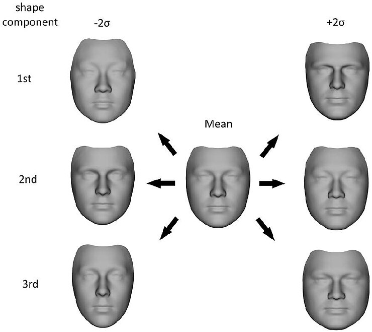

# 目录

## 第一章 3D数字人生成
- [1.3DMM (3D Morphable Model)是什么?](#1.3DMM)
- [2.3DMM有什么实际应用?](#2.3DMM有什么实际应用?)
- [3.目前有哪些开源的3D人脸重建方案?](#3.目前有哪些开源的3D人脸重建方案?)
- [4.3D人脸重建的技术难点有哪些?](#4.3D人脸重建的技术难点有哪些?)

<h2 id="1.3DMM">1. 3DMM (3D Morphable Model)是什么?</h2>
3DMM是一种基于统计模型的三维人脸重建方法，最早由Blanz等人在1999年提出。该方法通过扫描大量人脸数据，构建出一个包含形状和纹理信息的三维人脸模型库。通过线性组合这些模型库中的基础模型，可以生成任意新的人脸模型。

  
1. 优点：

- 模型精度高：能够重建出较为精细的人脸细节。
- 灵活性强：可以通过调整模型参数来适应不同角度和表情的人脸。
- 易于实现：算法相对简单，易于在移动端实现实时重建。
2. 缺点：

- 数据依赖性强：需要大量的人脸数据来训练模型。
- 模型细节受限：由于模型特点所致，可能无法生成非常细微的皱纹等特征。

<h2 id="2.3DMM有什么实际应用?">2. 3DMM有什么实际应用?</h2>

- 三维人脸重建：通过输入一张二维人脸图像，利用3DMM方法可以快速重建出该人脸的三维模型。这一技术在虚拟现实、增强现实等领域有着广泛的应用。

- 表情驱动动画：结合blendshape技术，可以将重建出的人脸模型与表情参数相结合，实现表情驱动动画。

- 人脸美化与特效：基于三维人脸模型，可以方便地添加各种人脸特效，如胡子、彩绘、面具等。同时，还可以根据用户的脸型特征进行个性化美化。

<h2 id="3.目前有哪些开源的3D人脸重建方案?">3. 目前有哪些开源的3D人脸重建方案?</h2>

|Rank|Method|Median(mm)    | Mean(mm) | Std(mm) |
|:----:|:-----------:|:-----------:|:-----------:|:-----------:|
| 1. | [DECA\[Feng et al., SIGGRAPH 2021\]](https://github.com/YadiraF/DECA)|1.09|1.38|1.18|
| 2. | [Deep3DFace PyTorch](https://github.com/sicxu/Deep3DFaceRecon_pytorch)|1.11|1.41|1.21|
| 3. | 	[RingNet [Sanyal et al., CVPR 2019]](https://github.com/soubhiksanyal/RingNet) | 1.21 | 1.53 | 1.31 |
| 4. | [Deep3DFace [Deng et al., CVPRW 2019]](https://github.com/microsoft/Deep3DFaceReconstruction) | 1.23 | 1.54 | 1.29 |
| 5. | [3DDFA-V2 [Guo et al., ECCV 2020]](https://github.com/cleardusk/3DDFA_V2) | 1.23 | 1.57 | 1.39 |
| 6. | [MGCNet [Shang et al., ECCV 2020]](https://github.com/jiaxiangshang/MGCNet) | 1.31 | 1.87 | 2.63 |
| 7. | [PRNet [Feng et al., ECCV 2018]](https://github.com/YadiraF/PRNet) | 1.50 | 1.98 | 1.88 |
| 8. | [3DMM-CNN [Tran et al., CVPR 2017]](https://github.com/anhttran/3dmm_cnn) | 1.84 | 2.33 | 2.05 |

<h2 id="4.目前有哪些开源的3D人脸重建方案?">3. 目前有哪些开源的3D人脸重建方案?</h2>

3D人脸重建是一个复杂且具有挑战性的领域，它涉及到从二维图像或视频中提取并重建出人脸的三维模型，其中面临着一些问题：

1. 遮挡和光照问题
在不同的光照条件下和部分遮挡的情况下准确重建人脸是一个挑战。例如，眼镜、头发或手部遮挡面部时，如何准确重建被遮挡区域是一个难题。
2. 表情和姿态变化
人脸在不同表情和姿态下的变化复杂多变，捕捉和重建这些变化需要高度精确的算法。表情和姿态的变化会影响人脸的形状和纹理，这增加了重建的复杂性。
3. 纹理和细节的捕捉
高精度地重建人脸的纹理和细节，如皮肤的毛孔和皱纹，需要非常精细的技术。这些细节对于实现逼真的3D人脸模型至关重要。