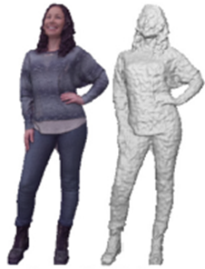
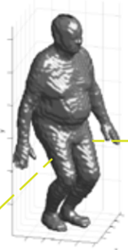
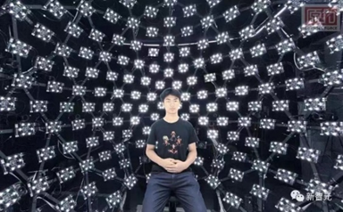
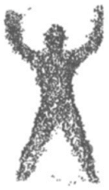
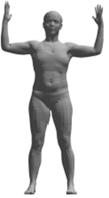
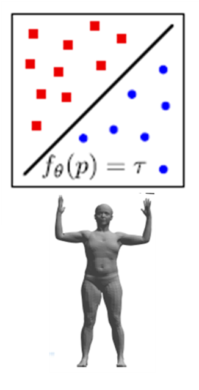

# 目录

- [1.3D数据的表示](#user-content-13D数据的表示)

<h2 id="1.3D数据的表示">1.3D数据的表示</h2>

1. 基于欧氏几何结构的表示
这类表示具有网格结构，允许全局参数化和通用坐标系。

1.1 表面描述子

描述三维形状的几何或拓扑特征，例如三维形状上下文，形状直方图等。

1.2 3D数据投影

将三维数据投影到具有特定特征的二维网格中，例如将三维数据投影到球形和圆柱形区域。

1.3 RGB-D数据

提供深度图（D）以及2D颜色信息（RGB）。

1.4 体素表示

三维空间中的规则网格表示，类似于RGB图像这个二维空间中的像素。

1.5 多视角表示

多个2D图像的组合，从不同的视点捕获3D对象。

2. 非欧几何结构的表示
没有网格结构，没有全局参数化。

2.1 点云

具有坐标（x、y、z）的三维顶点的集合。

2.2 网格mesh

一组有相互连接的顶点，这些连接形成三角形（或四边形）的集合。三角形集在三维空间中形成二维曲面。

3. 其他表示

3.1 有符号距离函数

将3D点P=（x，y，z）作为有符号距离函数SDF的输入，输出P到3D曲面上最近点的距离。函数SDF（x，y，z）在曲面上为零，在曲面内部为负，在曲面外部为正。满足SDF（x，y，z）= 0的点（x，y，z）的集合就是曲面。

3.2 占有函数

理想的占有函数O可以将曲面上的点映射为0，将曲面外的点映射为1：$O:p=(x,y,z) \rightarrow \left \{0,1 \right \}$ ，这可以看作是一个理想的二值分类器。
实际上，一个近似的占有函数就足够了，它将每个可能的3D点映射为0和1之间的占用概率，得到一个二值分类器$f$，这个二值分类器$f$的决策边界就表示物体的表面。

3.3 NeRF

3.4 X-Ray

3.5 Mosaic-SDF

