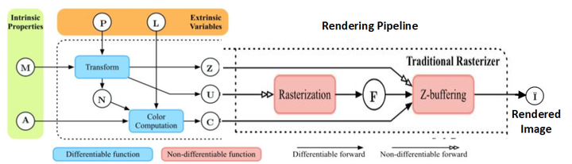
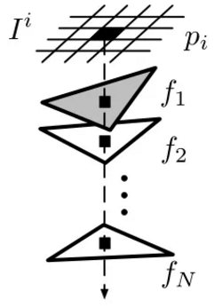

# 目录

- [1.传统渲染管线](#user-content-1传统渲染管线)
- [2.可微渲染](#user-content-2可微渲染)

<h2 id="1.传统渲染管线">1.传统渲染管线</h2>

渲染是从三维场景得到二维图像的过程, 它在动画、游戏、电影和虚拟现实中有丰富的应用。在计算机图形学中, 一般用三角网格表示三维模型, 所以一般的渲染方法都是针对三角网格模型提出的。除了一般的渲染方法之外, 还有许多专门针对某些特殊应用的特殊渲染方法, 比如对体素、点云、毛发和流体等的渲染。只讨论针对三角网格模型的渲染。

传统的渲染模型分为局部光照模型和全局光照模型, 局部光照模型只考虑光源到物体表面的照射效果, 全局光照模型不仅考虑光源到物体的照射效果, 还考虑物体之间的相互影响。 最简单的局部光照模型是兰伯特(Lambert) 模型, 它只考虑环境光和漫反射, 并假设物体朝着各个方向均匀地漫反射。全局光照模型一般是基于物理的方法, 使用物理世界的规律来模拟计算光在各处的传播和强度, 经典的算法有辐射度法、光线跟踪和光子映射。全局光照模型的结果有非常高的真实感, 但时间花费高。

传统渲染管线被抽象为几个固定的步骤, 每个步骤有着固定且单一的任务。

如图所示，传统rendering将初始的变量分为：内部变量与外部变量。内部变量包括：几何图形（M）与顶点外观属性（A）。外部变量包括：相机信息（P）与光照条件（L）。通过标准图形渲染管道，我们可以通过 {P, M} 得到网格法线（N）、目标的屏幕空间坐标（U）和深度值（Z）。同时给定{A, N, L}的情况下，我们利用光照模型也可以计算出三角片元的颜色（C）。这些计算都是可微的，因为他们都是连续空间的计算，而且都是能够找到相关数学公式。然而由于离散化采样操作，后续的光栅化与Z-buffering对于U、Z都是不可微分的。

我们可以将光栅化看做是像素与三角形之间的相对位置决定的二进制掩码。具体含义就是：在三角形内部则为三角形颜色，在三角形外部则无该三角形的颜色，这种关系可以用0与1两个值来表达。Z-buffering则可以看做是单热合并光栅化的结果，只选择离我们最近的三角形进行渲染。

<h2 id="2.可微渲染">2.可微渲染</h2>

可微渲染是可以微分求导的渲染过程, 分为正向和逆向的过程, 正向过程和传统渲染相同, 输入模型和参数得到一张图片, 逆向是像素对场景参数求导数, 可微渲染需要兼具这两个过程, 不仅需要得到渲染结果, 还要得到渲染结果对输入的导数。可微渲染不能离开传统的渲染模型, 但传统的渲染方法不可微, 所以可微渲染往往是基于某种传统渲染模型, 通过引入新的技术, 使得我们可以得到渲染结果对输入的导数。 主流的可微渲染方法往往基于以下两类思想, 一类是使用近似的方法, 求得近似导数用于反向传播; 另一类是改编传统渲染模型, 让像素对顶点可导。

上述第1 类方法不改变传统渲染的正向过程, 虽然传统渲染方法天然不可微, 但使用近似的方法, 能求得近似导数用于反向传播。 这类方法的核心在于如何更好地近似渲染过程的导数, 使得导数在某种观点下是一种有效的近似, 或是使得导数对优化输入有着指导意义。 为了使得导数对优化输入有着指导意义, 有时导数会和应用相关, 会根据损失函数的不同而不同。

对于上述第2 类方法, 由于传统渲染方法天然不可微, 需要对其进行改编, 使得改编后的渲染方法依然拥有渲染的能力, 渲染结果不发生较大变化, 但其过程完全可微, 可以求得精确导数. 这类方法通常改编其中光栅化的步骤, 因为这一步从连续空间映射到离散空间, 是导致传统渲染不可微的原因。