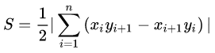
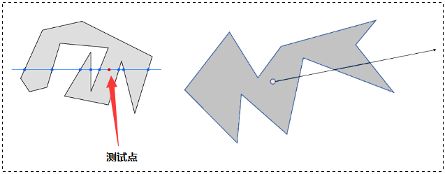

# 目录

- [1.常用数据结构的相关知识](#1.常用数据结构的相关知识)
- [2.二叉树遍历（递归）模版](#2.二叉树遍历（递归）模版)
- [3.不同排序算法的异同？](#3.不同排序算法的异同？)
- [4.树有哪些遍历模式？](#4.树有哪些遍历模式？)
- [5.二分查找中所蕴含的算法思想？](#5.二分查找中所蕴含的算法思想？)
- [6.归并排序的思想与实现方式？](#6.归并排序的思想与实现方式？)
- [7.堆的操作与堆排序的实现？](#7.堆的操作与堆排序的实现？)
- [8.链表的中间节点？](#8.链表的中间节点？)
- [9.单调栈的作用？](#9.单调栈的作用？)
- [10.回溯算法的思想？](#10.回溯算法的思想？)
- [11.图的拓扑排序？](#11.图的拓扑排序？)
- [12.二分图的判断方法？](#12.二分图的判断方法？)
- [13.求解x的平方根？](#13.求解x的平方根？)
- [14.求解线性方程组？](#14.求解线性方程组？)
- [15.任意多边形面积计算？](#15.任意多边形面积计算？)
- [16.判断点是否在多边形内？](#16.判断点是否在多边形内？)
- [17.极角排序的实现方式？](#17.极角排序的实现方式？)
- [18.凸包的实现方式？](#18.凸包的实现方式？)


<h2 id="1.常用数据结构的相关知识">1.常用数据结构的相关知识</h2>
## 【一】常用数据结构的相关知识
  
1. 数组：最基本的数据结构，用连续内存存储数字。创建数组时，我们需要首先指定数组的容量大小，然后根据大小分配内存。即使我们只在数组中存储一个数字，也需要为所有的数据预先分配内存。因此数组的空间效率不是很好，经常会有空闲的区域没有得到充分的利用。<font color=DeepSkyBlue>(可动态分配内存来解决上述问题)</font>由于数组中的内存是连续的，于是可以根据数组下标O(1)时间读/写任何元素，因此它的时间效率是很高的。

2. 字符串：最基本的数据结构，用连续内存存储字符。<font color=DeepSkyBlue>C/C++中每个字符串都以字符’\0’作为结尾</font>，这样我们就能很方便地找到字符串的最后尾部。

3. 链表：链表的结构很简单，由指针把若干个节点连接成链状结构，并且链表是一种动态的数据结构，其需要对指针进行操作，因此链表很灵活。在创建链表时，我们无须知到链表的长度。当插入一个节点时，我们只需要为新节点分配内存，然后调整指针的指向来确保新节点被链接到链表中。内存分配不是在创建链表时一次性完成的，而是每添加一个节点分配一次内存。<font color=DeepSkyBlue>由于没有闲置的内存，链表的空间效率比数组高</font>。

4. 树：除根节点之外每个节点只有一个父节点，根节点没有父节点;除叶节点之外所有节点都有一个或多个子节点，叶节点没有子节点。<font color=DeepSkyBlue>父节点和子节点之间用指针链接</font>。<font color=DeepSkyBlue>二叉树</font>：是树的一种特殊结构，在二叉树中每个节点最多只能有两个子节点。<font color=DeepSkyBlue>二叉搜索树</font>：左子节点总是小于或者等于根节点，而右子节点总是大于或者等于根节点。我么可以平均在O(logn)的时间内根据数值在二叉搜索树中找到一个结点。<font color=DeepSkyBlue>堆</font>：分为最大堆和最小堆。在最大堆中根节点的值最大，在最小堆中根节点的值最小。

5. 栈：栈是一个与递归紧密相关的数据结构，它在计算机领域被广泛应用，比如操作系统会给每个线程创建一个栈用来存储函数调用时各个函数的参数、返回地址及临时变量等。栈的特点是<font color=DeepSkyBlue>先进后出</font>，即最后被压入(push)栈的元素会第一个被弹出(pop)。通常栈是一个不考虑排序的数据结构，我们需要O(n)时间才能找到栈中的最大值或最小值。

6. 队列：队列与广度优先遍历算法紧密相关，队列的特点是<font color=DeepSkyBlue>先进先出</font>。

<h2 id="2.二叉树遍历（递归）模版">2.二叉树遍历（递归）模版</h2>
  
我们在调用递归函数的时候，把递归函数当作普通函数（黑箱）来调用，即明白该函数的输入输出是什么，而不用管此函数的内部运行机制。

前序遍历：

```
def dfs(root):
    if not root:
        return
    执行操作
    dfs(root.left)
    dfs(root.right)
```
  
中序遍历：

```
def dfs(root):
    if not root:
        return
    dfs(root.left)
    执行操作
    dfs(root.right)
```
后序遍历：

```
def dfs(root):
    if not root:
        return
    dfs(root.left)
    dfs(root.right)
    执行操作
```
<h2 id="3.不同排序算法的异同？">3.不同排序算法的异同？</h2>


<h2 id="4.树有哪些遍历模式？">4.树有哪些遍历模式？</h2>
  
树的遍历模式:

1. <font color=DeepSkyBlue>前序遍历</font>:先访问根节点，再访问左子节点，最后访问右子节点。

2. <font color=DeepSkyBlue>中序遍历</font>:先访问左子节点，再访问根节点，最后访问右子节点。

3. <font color=DeepSkyBlue>后序遍历</font>:先访问左子节点，再访问右子节点，最后访问根节点。

4. <font color=DeepSkyBlue>宽度优先遍历</font>:先访问树的第一层节点，再访问树的第二层节点，一直到最后一层节点。


<h2 id="5.二分查找中所蕴含的算法思想？">5.二分查找中所蕴含的算法思想？</h2>
二分查找中所蕴含的算法思想是减治思想：就是在循环体中排除目标元素一定不存在区间。根据这个思想，设定一个判别条件，每次都能排除一半的元素，从而达到以$log(n)$的时间复杂度解决问题。

伪代码：

```
left, right = 0, len(nums) - 1 #设定左右边界为数组两端
        
# 在区间 [left, right] 内查找 target
while left < right: #left == right时退出循环
      # 取区间中间节点
      mid = left + (right - left) // 2 #取到区间的中间靠左边元素的下标位置
      # nums[mid] 小于目标值，排除掉不可能区间 [left, mid]，在 [mid + 1, right] 中继续搜索
      if nums[mid] < target:
               left = mid + 1
      # nums[mid] 大于等于目标值，目标元素可能在 [left, mid] 中，在 [left, mid] 中继续搜索
      else:
               right = mid

# 判断区间剩余元素是否为目标元素，不是则返回 -1
return left if nums[left] == target else -1
```


<h2 id="6.归并排序的思想与实现方式？">6.归并排序的思想与实现方式？</h2>
归并排序的思想是分治策略，先递归地将当前数组平均分成两半，直到子数组长度为 1，然后将有序数组两两合并，最终合并成一个有序数组。

伪代码：
```
# 合并过程
def merge(left_nums, right_nums):
        nums = []
        left_i, right_i = 0, 0
        while left_i < len(left_nums) and right_i < len(right_nums):
            # 将两个有序子数组中较小元素依次插入到结果数组中
            if left_nums[left_i] < right_nums[right_i]:
                nums.append(left_nums[left_i])
                left_i += 1
            else:
                nums.append(right_nums[right_i])
                right_i += 1
        
        # 如果左子数组有剩余元素，则将其插入到结果数组中
        while left_i < len(left_nums):
            nums.append(left_nums[left_i])
            left_i += 1
        
        # 如果右子数组有剩余元素，则将其插入到结果数组中
        while right_i < len(right_nums):
            nums.append(right_nums[right_i])
            right_i += 1
        
        # 返回合并后的结果数组
        return nums

# 分解过程
def mergeSort(nums):
        # 数组元素个数小于等于 1 时，直接返回原数组
        if len(nums) <= 1:
            return nums
        
        mid = len(nums) // 2                        # 将数组从中间位置分为左右两个数组
        left_nums = mergeSort(nums[0: mid])    # 递归将左子数组进行分解和排序
        right_nums =  mergeSort(nums[mid:])    # 递归将右子数组进行分解和排序
        return merge(left_nums, right_nums)    # 把当前数组组中有序子数组逐层向上，进行两两合并
```
- **时间复杂度**：$O(n \times \log n)$ 。
    
- **空间复杂度**：O(n)。
    
-  **稳定排序算法**。

<h2 id="7.堆的操作与堆排序的实现？">7.堆的操作与堆排序的实现？</h2>
堆中元素的节点编号与数组的索引关系为：

- 如果某二叉树节点（非叶子节点）的下标为 i，那么其左孩子节点下标为 2×i+1，右孩子节点下标为 2×i+2。
    
- 如果某二叉树节点（非根结点）的下标为 i，那么其根节点下标为 $\lfloor \frac{i - 1}{2} \rfloor$ （向下取整）。
    

大顶堆的两种操作：

### **1）向堆中插入元素**`sift_up`

`新节点加入到堆尾，如果新加入的节点<父节点就一直上浮，堆尾元素上浮log(k)`

````
```
def sift_up(arr, child):
        """
        child: 要上浮的节点的编号
        堆尾元素上浮log(k),如果新加入的节点<父节点就一直上浮
        """
        val = arr[child]
        #child>>1表示child节点的父节点编号
        while child>>1 > 0 and val < arr[child>>1]:
            arr[child] = arr[child>>1] #上浮
            child >>= 1
        arr[child] = val
```
#sift_up(heap, len(heap)-1)
````

2)**删除堆顶元素**`sift_down`

堆顶元素（即根节点）与堆尾元素交换。移除堆尾的元素（之前的堆顶）。从新的堆顶元素开始，`如果新的根节点>子节点就一直下沉，下沉log(k)`

```
def sift_down(arr, root, k):
    """
    k:堆的大小
    下沉log(k),如果新的根节点<子节点就一直下沉
    """
    val = arr[root] 
    #root<<1：root节点的左子节点
    while root<<1 < k:
        child = root << 1 #左孩子节点
        
        # 选取左右孩子中较大的节点
        #child|1：右孩子节点
        if child|1 < k and arr[child|1]> arr[child]:
            child |= 1 #右孩子节点
        
        # 如果子节点>新节点,交换,如果已经有序break
        if arr[child] > val:
            arr[root] = arr[child]
            root = child
        else:
            break
    arr[root] = val

#sift_down(arr, 0, k) 
```

## 堆排序

```
arr = [0] + arr
k = len(arr)
#从后往前非叶子节点下沉，依次向上保证每一个子树都是大顶堆，构造大顶锥
for i in range((k-1)>>1, 0, -1):
    sift_down(arr, i, k) 

#依次把大顶堆根节点（最大值）与尾部节点交换(不再维护，堆规模 -1)，新根节点下沉，堆排序（最大节点在堆尾）
for i in range(k-1, 0, -1):
    arr[1], arr[i] = arr[i], arr[1]
    sift_down(arr, 1, i)

return arr[1:]
```

- **时间复杂度**：$O(n \times \log n)$ 。
    
- **空间复杂度**：O(1)。
    
- **不稳定排序算法**。


<h2 id="8.链表的中间节点？">8.链表的中间节点？</h2>
采用快慢指针的方法，快慢指针都指向头节点，快指针每次比慢指针多走一步。

代码：
```
def middleNode(head):
        fast = head
        slow = head
        while fast and fast.next:
            slow = slow.next
            fast = fast.next.next
        return slow
```

<h2 id="9.单调栈的作用？">9.单调栈的作用？</h2>
在时间复杂度为 O(n) 的情况下，求解出某个元素左边或者右边第一个比它大或者小的元素

- 从左到右遍历元素。
    
- 查找 **「比当前元素大的元素」** 就用 **单调递增栈**，查找 **「比当前元素小的元素」** 就用 **单调递减栈**。
    
- 从 **「左侧」** 查找就看 **「插入栈」** 时的栈顶元素，从 **「右侧」** 查找就看 **「弹出栈」** 时即将插入的元素。
    

```
#栈顶 到 栈底 的元素是单调递增
def monotoneIncreasingStack(nums):
    stack = []
    for num in nums:
        while stack and num >= stack[-1]:
            stack.pop()
        stack.append(num)
```

```
def monotoneDecreasingStack(nums):
    stack = []
    for num in nums:
        while stack and num <= stack[-1]:
            stack.pop()
        stack.append(num)
```

<h2 id="10.回溯算法的思想？">10.回溯算法的思想？</h2>
回溯算法是一种 **「走不通就回退」** 的算法思想。

代码模板为：
````
```
res = []    # 存放所有符合条件结果的集合
path = []   # 存放当前符合条件的结果
def backtracking(nums):             # nums 为选择元素列表
    if 遇到边界条件:                  # 说明找到了一组符合条件的结果
        res.append(path[:])         # 将当前符合条件的结果放入集合中
        return

    for i in range(len(nums)):      # 枚举可选元素列表
        path.append(nums[i])        # 选择元素
        backtracking(nums)          # 递归搜索
        path.pop()                  # 撤销选择

backtracking(nums)
```
````

书写回溯算法思想：

1. **明确所有选择**：画出搜索过程的决策树，根据决策树来确定搜索路径。
    
2. **明确终止条件**：推敲出递归的终止条件，以及递归终止时的要执行的处理方法。
    
3. **将决策树和终止条件翻译成代码：**
    
    1. 定义回溯函数（明确函数意义、传入参数、返回结果等）。
        
    2. 书写回溯函数主体（给出约束条件、选择元素、递归搜索、撤销选择部分）。
        
    3. 明确递归终止条件（给出递归终止条件，以及递归终止时的处理方法）。


<h2 id="11.图的拓扑排序？">11.图的拓扑排序？</h2>
图的拓扑排序是一种对有向无环图（DAG）的所有顶点进行线性排序的方法，使得图中任意一点 u 和 v，如果存在有向边 <u,v>，则 u 必须在 v 之前出现。对有向图进行拓扑排序产生的线性序列称为满足拓扑次序的序列，简称拓扑排序。

拓扑排序的实现（Kahn 算法）
> **基本思想**：
> 
> 1. 不断找寻有向图中入度为 0 的顶点，将其输出。
>     
> 2. 然后删除入度为 0 的顶点和从该顶点出发的有向边。
>     
> 3. 重复上述操作直到图为空，或者找不到入度为 0 的节点为止。
>

实现代码：
```
def topologicalSortingKahn(graph):
        indegrees = {u: 0 for u in graph}   # indegrees 用于记录所有顶点入度
        for u in graph:
            for v in graph[u]:
                indegrees[v] += 1           # 统计所有顶点入度
        
        # 将入度为 0 的顶点存入集合 S 中
        S = collections.deque([u for u in indegrees if indegrees[u] == 0])
        order = []                          # order 用于存储拓扑序列
        
        while S:
            u = S.pop()                     # 从集合中选择一个没有前驱的顶点 0
            order.append(u)                 # 将其输出到拓扑序列 order 中
            for v in graph[u]:              # 遍历顶点 u 的邻接顶点 v
                indegrees[v] -= 1           # 删除从顶点 u 出发的有向边
                if indegrees[v] == 0:       # 如果删除该边后顶点 v 的入度变为 0
                    S.append(v)             # 将其放入集合 S 中
        
        if len(indegrees) != len(order):    # 还有顶点未遍历（存在环），无法构成拓扑序列
            return []
        return order                        # 返回拓扑序列
```


<h2 id="12.二分图的判断方法？">12.二分图的判断方法？</h2>

染色法思想：可以任选一个节点开始，给它染成红色。随后我们对整个图进行遍历，将该节点直接相连的所有节点染成绿色，表示这些节点不能与起始节点属于同一个集合。我们再将这些绿色节点直接相连的所有节点染成红色，以此类推，直到无向图中的每个节点均被染色。

如果我们能够成功染色，那么红色和绿色的节点各属于一个集合，这个无向图就是一个二分图；如果我们未能成功染色，即在染色的过程中，某一时刻访问到了一个已经染色的节点，并且它的颜色与我们将要给它染上的颜色不相同，也就说明这个无向图不是一个二分图。

```
#广度优先搜索
def isBipartite(graph):
        n = len(graph)
        UNCOLORED, RED, GREEN = 0, 1, 2
        color = [UNCOLORED] * n
        
        for i in range(n):
            if color[i] == UNCOLORED:
                q = collections.deque([i])
                color[i] = RED
                while q:
                    node = q.popleft()
                    cNei = (GREEN if color[node] == RED else RED)
                    for neighbor in graph[node]:
                        if color[neighbor] == UNCOLORED:
                            q.append(neighbor)
                            color[neighbor] = cNei
                        elif color[neighbor] != cNei:
                            return False

        return True
```
- 时间复杂度：O(n+m)，其中 n 和 m分别是无向图中的点数和边数。

- 空间复杂度：O(n)，存储节点颜色的数组需要 O(n) 的空间，并且在广度优先搜索的过程中，队列中最多有 n−1个节点，需要 O(n) 的空间。

<h2 id="13.求解x的平方根？">13.求解x的平方根？</h2>
牛顿迭代法是一种可以用来快速求解函数零点的方法。

为了叙述方便，我们用 C 表示待求出平方根的那个整数。显然， C的平方根就是函数

$y = f(x) = x^2 - C$

的零点。

牛顿迭代法的本质是借助泰勒级数，从初始值开始快速向零点逼近。我们任取一个 x0 作为初始值，在每一步的迭代中，我们找到函数图像上的点 (xi,f(xi))，过该点作一条斜率为该点导数 f′(xi)的直线，与横轴的交点记为$x_{i+1}$。$x_{i+1}$相较于 xi而言距离零点更近。在经过多次迭代后，我们就可以得到一个距离零点非常接近的交点。

**算法**

我们选择 $x_0 = C$ 作为初始值。


在进行 $k$ 次迭代后，$x_k​$ 的值与真实的零点 $\sqrt{C}​$ 足够接近，即可作为答案。

代码：
```
def mySqrt(x):
    if x == 0:
        return 0
        
    C, x0 = float(x), float(x)
    while True:
        xi = 0.5 * (x0 + C / x0)
        if abs(x0 - xi) < 1e-7:
            break
        x0 = xi
        
    return x0

```
参考：

https://leetcode.cn/problems/jJ0w9p/solutions/1398892/qiu-ping-fang-gen-by-leetcode-solution-ybnw/

<h2 id="14.求解线性方程组？">14.求解线性方程组？</h2>
已知 n 元线性一次方程组，求解该方程组。


请根据输入的数据，编程输出方程组的解的情况。

## **输入格式**

第一行输入未知数的个数 *n*。  
接下来 *n* 行，每行 *n*+1 个整数，表示每一个方程的系数及方程右边的值。

## **输出格式**

如果有唯一解，则输出解。你的结果被认为正确，当且仅当对于每一个 *xi* ​ 而言结果值与标准答案值的绝对误差或者相对误差不超过 0.01。

如果方程组无解输出 −1； 如果有无穷多实数解，输出 0；

## **输入输出样例**

**输入 #1**

```
3
2 -1 1 1
4 1 -1 5
1 1 1 0
```

**输出 #1**

```
x1=1.00
x2=0.00
x3=-1.00
```

## **说明/提示**

【数据范围】  
对于 100%的数据，1≤*n*≤50。对于 ∀1≤*i*,*j*≤*n*，有 ∣*ai*,*j*​∣≤100，∣*bi*​∣≤300。

使用高斯-约旦消元法。完整的步骤大概是：

  初始化curi = 0, 记录当前要消元的行数，也是消元的次数，即统计非0行的数量。

1. 枚举第 j 列：
    
    1. 从第 curi   行开始，往下找一个非0数
        
        1. 如果没找到：
            
            1. 开始枚举下一列
                
        2. 如果找到了，设它在第 k 行：
            
            1. 交换第 curi    行和第 k 行（如果存在全为0的行，最终会把这样的行交换到矩阵的最后几行上）
                
            2. 第 curi    行除以 $A_{curi，j}$ ，使 $A_{curi,j}$ \=1
                
            3. 消掉第 j 列的其他元素
                
            4. curi 加 1
                
2. curi 即为矩阵的秩，然后判断解的情况
    
3. 如果有唯一解，剩下的第n+1 列即为答案。

代码：

```
#高斯消元，把m行n列的矩阵化为行最简矩阵

def gauss_elim(A):
    m = len(A)
    n = m+1
    curi = 0 #记录消元的次数，即非0行的数量（矩阵的秩）
    for j in range(n): # 枚举列
        for i in range(curi , m): # 从第 curi  行开始消元，找到非0元素所在行i
            if (A[i][j]):
                break
        if (A[i][j] == 0): # 无解的情形 或 无穷多解
                continue

        for k in range(n): # 把非0元素所在行交换到当前行
            A[i][k], A[curi][k] = A[curi][k], A[i][k]

        for k in range(n-1,j-1,-1): # 把当前行除以A[curi][j]，令A[curi][j]归一，注意循环顺序
            A[curi][k] /= A[curi][j]

        for i in range(m): # 对其他行消掉第 j 列的其他元素
            if (i != curi):
                for k in range(n-1,j-1,-1): # 注意循环顺序
                    A[i][k] -= A[curi][k] * A[i][j]
        curi += 1
        if curi == min(m,n):
            break

    #判断线性方程组解的情况
    if(curi < m): # 存在找不到主元（无法消元）的情况
        while(curi < m):#判断增广矩阵A的最后1列的curi 行到n 行是否为0
            curi += 1
            if(abs(A[curi][n])>1e-10): #不等于0
                return -1
            return 0
        
    else:
        return [ai[n-1] for ai in A ] #最后一列

if __name__ == '__main__':
    A = [[2,23,5,1],[2,5,9,12],[4,2,34,2],[1,5,3,61]]
    B = [[59],[-16],[126],[-284]]
    C = []
    for i in range(len(A)):
        C.append(A[i] + B[i])
    X = gauss_elim(C)
    print(X)

    import numpy as np
    print(((np.array(A)@np.array(X) - np.array(B).reshape(-1))**2).sum())
```


<h2 id="15.任意多边形面积计算？">15.任意多边形面积计算？</h2>
对于任意一个多边形，如果已知其各个顶点的坐标


，那么这个多边形的面积为：



其中， $x_{n+1}=x_1,y_{n+1}=y_1$。

代码：
```
import numpy as np

def Area(points):
    area = 0
    points = points + [points[0]]
    n = len(points)
    for i in range(n-1):
        area = area + points[i][0]*points[i+1][1] - points[i+1][0]*points[i][1]
        
    area = abs(area)/2
    return area

def main():
    points = np.array([[0,0],[1,0],[1,1],[0,1]])
    area = Area(points)
    print(area)
    
main()
```

<h2 id="16.判断点是否在多边形内？">16.判断点是否在多边形内？</h2>
如何检查平面上的一个点（point）是否在多边形内部？

从目标点出发引一条射线，观察这条射线和多边形所有边的交点数目。如果有奇数个交点，则说明在内部，如果有偶数个交点，则说明在外部。


解决方案：将多边形的每一边与测试点的  （垂直）坐标进行比较，并编译一个结点列表，其中每个节点是一个边与测试点的  阈值相交的点。在此示例中的多边形的 8 条边越过  阈值，而其他 6 条边则没有。那么，如果有奇数测试点每边的节点数，那就说明它在多边形内。如果测试点的每一侧都有偶数个节点，那么它在多边形之外。

代码：
```
def check(sp, ep, p): #多边形一条边(sp, ep)与点p的关系
    '''
    从点p出发引一条水平向右的射线，判断射线与边(sp, ep)的相交情况：点在线段的左侧 且 点的垂直坐标在线段范围内
    '''
    iscross = False
    if p[1] > min(sp[1],ep[1]) and p[1] < max(sp[1],ep[1]):
        if sp[0] == ep[0]: #竖直线
            if p[0] <  sp[0]:
                iscross = True
            
        else:
            klv = (sp[1]-ep[1])/(sp[0]-ep[0]) #斜率
            bv = ep[1]  #截距
            if klv > 0 and p[1] > klv * (p[0] - ep[0]) + bv:
                iscross = True
            elif klv < 0 and p[1] < klv * (p[0] - ep[0]) + bv:
                iscross = True
    
    return iscross
def inpoly(p, poly_points):
    cnt = 0
    i = 0
    sz = len(poly_points)
    for i in range(sz):
        p1, p2 = poly_points[i], poly_points[(i + 1) % sz] #多边形一条边
        if check(p1, p2, p):
            cnt += 1
    if cnt % 2 == 1:
        return True
    else:
        return False
```


<h2 id="17.极角排序的实现方式？">17.极角排序的实现方式？</h2>
极角排序，就是平面上有若干点，选一点作为极点，那么每个点有极坐标 ($\rho$ ,$\theta$ ) ，将它们关于极角 $\theta$ 排序。

**直接计算极角**，我们知道极坐标和直角坐标转换公式中有 $tan \theta=\frac{y}{x}$ ，所以可以用 arctan 来计算。然而， arctan 的值域只有 $(-\frac{\pi}{2},\frac{\pi}{2})$ ，而且当 x=0 时无定义，所以需要复杂的分类讨论。所幸，`math`中有一个`atan2(y,x)`函数，可以直接计算`(x,y)`的极角，值域是 (−$\pi$ ,$\pi$] ，所以可以直接用，只不过需要留心第四象限的极角会比第一象限小。

这是原点与极点重合的情况。对于选定的极点，对它到每个点的向量进行极角排序即可。

如果想减少常数，可以提前算出每个点的极角。

代码：
```
from math import atan2

def get_rad(px, py):#py是极点
    a = px[0] - py[0]
    b = px[1] - py[1]

    return atan2(float(b), float(a))

def sort_points_tan(p, pk):
    '''
    points = [[x,y],...]
    pk: polar point
    '''
    sz = len(p)
    L = [{"index": i, "rad": get_rad(p[i], pk)} for i in range(sz)]
    L.sort(key=lambda k: (k.get('rad')))
    resL = [p[L[i]["index"]] for i in range(sz)]
    
    return resL

if __name__ == '__main__':
    points = [[0,1],[1,1],[2,1],[1,0]]
    sort_points = sort_points_tan(points)
    print(sort_points)
```


<h2 id="18.凸包的实现方式？">18.凸包的实现方式？</h2>

平面上给定若干点，则它们的凸包被定义为所有能包含所有点的凸多边形的交集。

在一切包含所有点的凸多边形中，凸包的**面积**是最小的*（显然）*，**周长**也是最小的*（因为每个包含所有点的凸多边形，总可以通过下面这样的过程，不断缩小周长，最终得到凸包。类似地可以证明，凸包的每个顶点都是**原有的点**。

介绍Graham扫描法求凸包。最左下角的一个点（这里指以横坐标为第一关键词、纵坐标为第二关键词排序后最小的点）是必然在凸包上的。我们以这个点为极点进行极角排序。显然，将极角排序后的点依次相连即可得到一个包围所有点的多边形。但是这个多边形不一定是凸的，我们需要做出调整。我们维护一个**栈**，按照极角排序后的顺序遍历每个点：如果栈中点数小于3，就直接进栈（三角形一定是凸的）；否则，检查栈顶2个点与要进栈的点组成的两个向量的旋转方向是否为**逆时针**（叉乘判断），若是则进栈，若不是则弹出栈顶，重复检查直到栈中点数小于3或者满足逆时针条件为止。弹出栈顶的过程，相当于把三角形的两条边用第三边代替了，同时又能保证包含原来的顶点。

在极角排序的情况下，如果想要组成凸多边形，向量就肯定应该不断逆时针旋转。

代码：
```
def sort_points_tan(p, pk):
    '''
    points = [[x,y],...]
    pk: polar point
    '''
    sz = len(p)
    L = [{"index": i, "rad": get_rad(p[i], pk)} for i in range(sz)]
    L.sort(key=lambda k: (k.get('rad')))
    resL = [p[L[i]["index"]] for i in range(sz)]
    
    return resL


def convex_hull(p):
    p = list(set(p))
   
    k = 0
    sz = len(p)
    for i in range(1, sz): #最左下角的一个点，起始点
        if p[i][0] < p[k][0]: #最左
            k = i
        if (p[i][1] < p[k][1]) and (p[i][0] == p[k][0]):#最下
            k = i
    
    pk = p[k]
    p.remove(p[k])
    p_sort = sort_points_tan(p, pk)#起始点为极点进行极角排序

    L = [pk] #凸包栈
    sz = len(p_sort)
    for i in range(sz): #按照极角排序后的顺序遍历每个点
        while len(L) >= 3 and (( (L[-2][0] - L[-1][0]) * (p_sort[i][1] - L[-1][1]) - (p_sort[i][0] - L[-1][0]) * (L[-2][1] - L[-1][1]) ) > 0):
            L.pop()
        L.append(p_sort[i])
    return L
```

