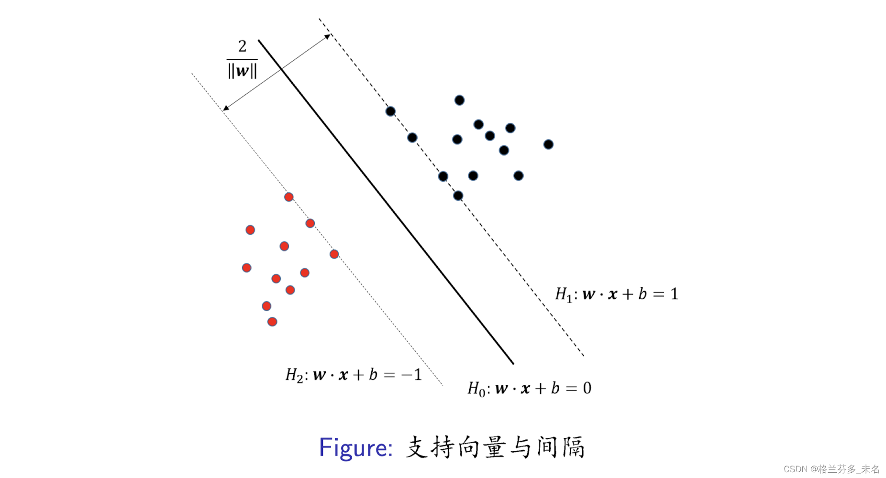
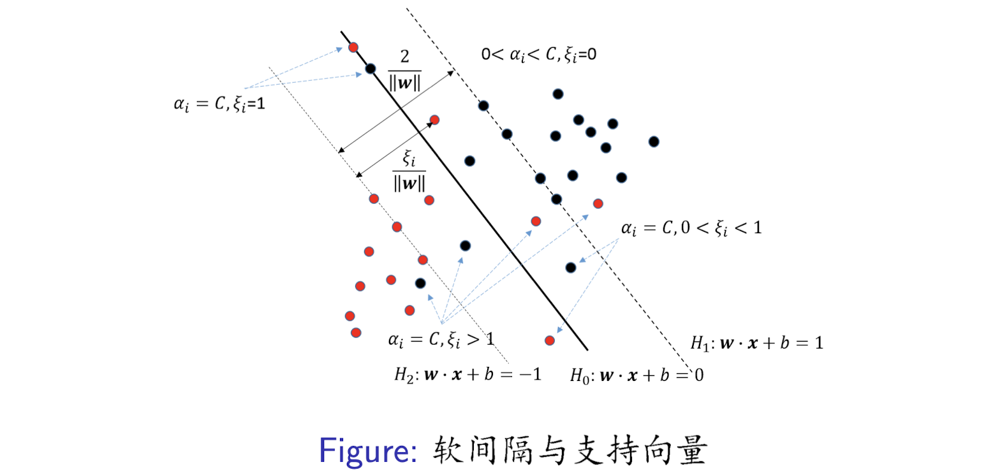

### 1.支持向量机（Support vector machine）  
支持向量机(Support Vector Machine, SVM)是一种有监督的机器学习算法,主要用于分类和回归分析。它的基本思想是在高维空间中构建一个超平面，将不同类别的数据点分开,使得两类数据点到超平面的距离最大化。  

- **超平面**  
	 超平面是指 $n$ 维线性空间中维度为 $n-1$ 的子空间。该子空间可以把线性空间分割成不相交的两个部分，例如：二维空间的线和三维空间的面。其描述方程为 $w^Tx+b=0$ ，记为超平面 $(w,b)$ ；而由于方程的乘法性质，对于任意的 $k$ 值， $(w,b)$ 和 $(kw,kb)$ 为同一超平面，因此下述用$(w,b)$表示。其中， $w=(w_1,w_2,...,w_{n})$ 为超平面的法向量； $b$ 为位移项，决定超平面与原点的距离。    
  
- **函数间隔与支持向量**  
	 函数间隔 $y_i\times(wx_i+b)$ 表示样本点距离超平面的距离，其值越大，距离越远。而支持向量则表示满足函数 $y_i\times(wx_i+b)=k$ 的样本点。  

- **工作原理**   
  **线性可分情况（硬间隔SVM）**：对于线性可分的数据,SVM试图找到一个能将两类数据完全分开的超平面,并使两类数据点到超平面的距离最大化(即最大间隔)。这个最大间隔超平面由最靠近它的几个支持向量决定。 
  **线性不可分情况（软间隔SVM）**：对于线性不可分的数据,SVM引入了软间隔,允许一些数据点位于间隔区域内或错分,从而使分类更加鲁棒。通过引入松弛变量和惩罚参数,SVM在最大化间隔和最小化误分类之间寻求平衡。 
  **非线性情况**：对于非线性数据,SVM使用核技巧将数据映射到高维特征空间,使得在高维空间中线性可分,从而实现非线性分类。常用的核函数包括线性核、多项式核、高斯核等。  

### 2.模型推导   
- **线性可分**   
  （1）**函数间隔和支持向量**  
	 已知超平面 $(w,b)$ ，对于任一样本 $(x_i,y_i)$ $\in$ 样本集 $D$ ，都满足函数间隔 $y_i\times(wx_i+b)>0$ 。若定义最小函数间隔 $\gamma$ 为 $\underset {i} {min} {(y_i\times (wx_i+b))}$ ，则所有正样本一定满足 ${y_i\times (wx_i+b )} \geq \gamma >0$ 。为了保证分类的鲁棒性，一定存在合适的超平面 $(w,b)$ ，使得任一正样本 $(x_i,y_i)\in{D}$ 都满足函数间隔 ${y_i\times (wx_i+b )} \geq 1$ 。其中，函数间隔 ${y_i\times (wx_i+b )} = 1$ 对应的样本点，称为支持向量。若 $y_i=+1$ ，则 $x_i$ 落在超平面 $H_1:wx+b=1$ 上；若 $y_i=-1$ ，则 $x_i$ 落在超平面 $H_1:wx+b=-1$ 上。如图所示，超平面 $H_1$ 和 $H_2$ 均与超平面 $H_0$ 平行，且等距分布在两侧。其中，支持向量（超平面 $H_1$ ）到超平面 $H_0$ 的距离 $\frac{1}{\Vert w \Vert_2}$ 为最短间隔，而超平面 $H_1$ 到的超平面 $H_2$ 的距离 $\frac{2}{\Vert w \Vert_2}$ 为几何间隔。
  
  
    
  （2）**硬间隔最大化**   
	 支持向量机通过最大化最短间隔和集合间隔，完成对训练样本的最佳线性分类，即**硬间隔最大化**。公式表达为 $\underset {(w,b)} {max}{\frac {1}{{\Vert w \Vert_2}}},s.t. {{y_i\times (wx_i+b )} \geq 1}$ 。而最大化 $\frac{1}{\Vert w \Vert_2}$ 和最小化 $\frac{1}{2}{\Vert w \Vert_2}$ 等价，因此硬间隔最大化可以重写成一个凸二次规划函数，即 $\underset {(w,b)} {min}{\frac {1}{2}{{\Vert w \Vert_2}}},s.t. {{y_i\times (wx_i+b )} \geq 1}$ 。若样本集线性可分，则该凸二次规划函数的解一定存在且唯一。
  
  （3）**对偶求解**   
	  引入拉格朗日算子，即可写出凸二次规划函数的拉格朗日函数，如下：   
  $$L(w,b,\alpha) = \frac {1}{2}{\Vert w \Vert_2}- \sum_{i=1}^{n}{\alpha_i y_i(wx_i+b)+\sum_{i=1}^{n}\alpha_i}$$
  其中，$\alpha=(\alpha_1,\alpha_2,...\alpha_n)$是拉格朗日乘子。 
  根据朗格朗日的对偶性，将求解问题转化为一个极大极小问题$\underset {\alpha} {max} \underset {(w,b)} {min} L(w,b,\alpha)$。解法如下： 
  Step 1： 将拉格朗日函数其$L(w,b,\alpha)$分别对$w,b$求偏导可得： 
$$\frac {\partial L}{\partial w} = w - \sum_{i=1}^{n}\alpha_iy_ix_i=0$$
$$\frac {\partial L}{\partial b} = - \sum_{i=1}^{n}\alpha_ix_i=0$$
  Step 2： 将拉格朗日函数化简为：  
$$L(w,b,\alpha) = -\frac{1}{2} \sum_{i=1}^{n}\sum_{j=1}^{n}{\alpha_i\alpha_jy_iy_j(x_ix_j)}+\sum_{i=1}^{n}\alpha_i$$
  Step 3: 将极大极小问题化简为：  
$$\underset {\alpha} {min} \frac {1}{2} \sum_{i=1}^{n}\sum_{j=1}^{n}{\alpha_i\alpha_jy_iy_j(x_ix_j)} -\sum_{i=1}^{n}\alpha_i,$$
$$s.t. \sum_{i=1}^{n}\alpha_iy_i=0$$
  Step 4：求解出最佳的超平面$(w,b)$：  
$$w=\sum_{i=1}^{n}\alpha_iy_ix_i$$
$$b=y_i-x_j\sum_{i=1}^{n}\alpha_iy_ix_i$$
$$s.t.  y_j(wx_j+b)=1$$

- **线性不可分**    
	线性可分问题的支持向量机对线性不可分是不适用的，因此本节采用软间隔将支持向量机推广到线性不可分的情况。  
（1）**软间隔最大化**  
	**假设条件**：样本集 $D$ 不是线性可分的，但剔除特异点之后，剩下的大部分样本 $(x_i,y_i)$ 是线性可分的。  
	线性不可分意味着某些样本点 $(x_i,y_i)$ 不能满足函数间隔 ${y_i\times (wx_i+b )} \geq 1$ 的约束条件。因此，引入一个松弛变量 $\xi_i \geq0$ ，使得函数间隔更加宽松 ${y_i\times (wx_i+b )} \geq 1-\xi_i$ 。同时，对每个松弛变量 $\xi_i$ ，引入一个代价变量 $\xi_i$ 和惩罚参数 $C$ 。软间隔最大化的凸二次规划函数则可以转化为：  
$${\frac {1}{2}{{\Vert w \Vert_2}}} + C \sum_{i=1}^{n}{\xi_i}$$
$$s.t. 	{y_i(wx_i+b) \geq 1-\xi_i},({ \xi_i\geq 0})$$
（2）**对偶求解**  
	引入拉格朗日乘子$\alpha,\beta$，写出凸二次规划函数的对偶问题，如下：  
$$\underset {\alpha, \beta}{max}{- \frac{1}{2} \sum_{i=1}^{n}\sum_{j=1}^{n}\alpha_i \alpha_j y_i y_j (x_ix_j)}+\sum_{i=1}^{n}\alpha_i$$
$$s.t. \sum_{i=1}^{n}\alpha_iy_i=0$$
$$C-\alpha_i-\beta_i=0$$
$$\alpha_i \geq 0, \beta_i \geq 0$$
如果 $0 < \alpha_i < C$ ，则 $C − \alpha_i = \beta_i > 0$ ，可以求得对应的 $\xi_i=0$ 。因此，该条件下最终求解的最优超平面 $(w,b)$ 同线性可分类似，为
$$w=\sum_{i=1}^{n}\alpha_iy_ix_i$$
$$b=y_j-x_j\sum_{i=1}^{n}\alpha_iy_ix_i$$
$$s.t.  y_j(wx_j+b)=1$$
在线性不可分的情况下，最优超平面 $(w,b)$ 的法向量 $w$ 是唯一的，但是偏置 $b$ 不一定是唯一的。因此，采用多次求解后的均值作为偏置 $b$ 。
对于 $\alpha_i =C$ 来说，满足 $\xi_i >0$ 都是特异点。特异点到所属边界超平面的距离为 $\frac {\xi_i}{\Vert w \Vert_2}$ 。如果 $0<\xi_i<1$ ，则位于超平面 $H_1,H_2$ 和 $H_0$ 之间，仍被分类成功：如果 $\xi_i=1$ ，在超平面 $H_0$ 上，无法分类； $\xi_i>1$ ，则被分类错误。

  
  
- **非线性**
在非线性情况下，SVM通过某种事先选择的非线性映射（核函数）将输入变量映到一个高维特征空间，将其变成在高维空间线性可分，在这个高维空间中构造最优分类超平面。
参考：[支持向量机原理之线性SVM与非线性SVM](https://blog.csdn.net/qq_45823424/article/details/113420320)

### 3.Python代码
`from sklearn.svm import SVC`

参考：[【ML】支持向量机SVM及Python实现（详细）_支持向量机代码（鸢尾花为案例）](https://blog.csdn.net/weixin_66845445/article/details/137054240)

### 4.优缺点

- **优点**：线性/非线性分类，小样本，高维数据。
-  **缺点**： 对核函数和惩罚参数的选择十分敏感。
