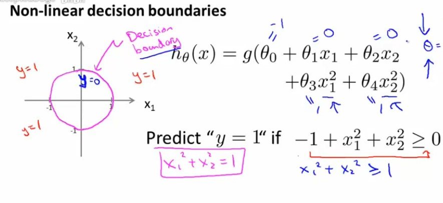

### 1.核心思想
对样本集$X$中的样本$x=(x_1,x_2...x_i)$的特征进行线性拟合，并采用Sigmoid函数将拟合的预测结果值映射到值域为(0，1)的概率空间。其中，当线性回归的输出值大于0，Sigmoid函数将输出大于0.5的值；当线性回归的输出值等于0，Sigmoid函数将输出等于0.5的值；当线性回归的输出值小于0，Sigmoid函数将输出小于0.5的值。因此，可以将大于等于0.5的情况视为正分类（$y_1$），而小于0.5的情况视为负分类（$y_0$）。

- **Sigmoid函数**
由于线性回归的结果范围为正负无穷，因此通过**对数几率**将线性回归的**预测结果**非线性映射到固定区间(0~1)之间，数学表达式为:
$$S(x)=\frac{1}{1+e^{-x}}$$
>

### 2.逻辑回归

- **数学表达**
$$P(y=1|x,\theta)=\frac{1}{1+e^{-\theta^Tx}}$$
$P(y=1|x,\theta)$表示给定样本$x$，其预测标签为正分类的概率。$\theta$表示样本特征$x_i$的权重参数。这个表达式的核心思想可以通过2步来分解和理解：**第一步：回归假设**：$z = h_\theta(x)=\theta^Tx$；**第二步：Sigmoid函数**：$y =g(z)=\frac{1}{1+e^{-z}}$。当$\theta^Tx≥0, h_\theta(x)≥0,g(z)≥0.5$为正分类，反之$g(z)<0.5$为负分类，因此逻辑回归算法的核心就在于求解权重$\theta$和回归假设的函数，即确定决策边界。

- **决策边界的定义**
逻辑回归算法通常不拟合样本分布，而且通过权重$\theta$和回归函数确定决策边界，将样本划分为2类。其中，决策边界包括线性决策边界和非线性决策边界。
	**线性决策边界**：即第一步**线性回归**：$h_\theta(x)=\theta_0+\theta_1x_1+\theta_2x_2...+\theta_ix_i$$，线性边界的图示为：
	>

	**非线性决策边界**：即将线性回归拓展成**多项式回归**：$h_\theta(x)=\theta_0+\theta_1x_1+\theta_2x_2^2...+\theta_ix_i^i$$，平方项边界的图示为：
	>
 
- **决策边界的确定**
决策边界通过梯度下降法最小化损失函数得到。
**损失函数**： 损失函数通过衡量训练样本标签与预测标签之间的差异，确定最优的决策边界。其中，损失函数越小，决策边界越好。损失函数包括：**均方误差损失(MSE)**和**对数损失函数**。
均方差误差：
$$MSE=\frac{1}{m}\sum_{x\in{X}}({f(x)-y_{1/2})}$$
对数损失函数：
$$J(\theta)=-\frac{1}{m}[\sum_{x\in{X}}(y_{1/2}\log{h_\theta(x)+(1-y_{1/2})\log(1-h_\theta(x))}]$$
**梯度下降**：梯度下降法通过向函数上当前点对应梯度（或者是近似梯度）的反方向的规定步长距离点进行迭代搜索，找到一个函数的局部极小值。该局部极小值对应的参数$\theta$即为最佳的参数$\theta$。其公式为：
$$J(\theta_1)=\theta_1-\alpha\frac{dJ(\theta_1)}{d\theta_1}$$

### 3.算法正则化
在训练数据不够多，或者模型复杂又过度训练时，模型会陷入过拟合（Overfitting）状态。通过对损失函数添加正则化项，可以约束参数的搜索空间，从而缓解过拟合现象，以下是对对数损失函数添加L2正则化项的公式。其中，$m$为样本集$X$的个数；$\lambda$为正则化系数，$\lambda$值越大，$J(\theta)$越大，越不容易发生过拟合现象。
$$J(\theta)=\frac{1}{m}[\sum_{x\in{X}}(y_{1/2}\log{h_\theta(x)+(1-y_{1/2})\log(1-h_\theta(x))}]+\frac{\lambda}{2m}\sum_{j=1}^i{\theta_j^2}$$

### 4.Python代码
参见厦门大学数据实验室
<smaller>[Python实现逻辑回归(Logistic Regression in Python)_厦大数据库实验室博客 (xmu.edu.cn)](https://dblab.xmu.edu.cn/blog/84/)
