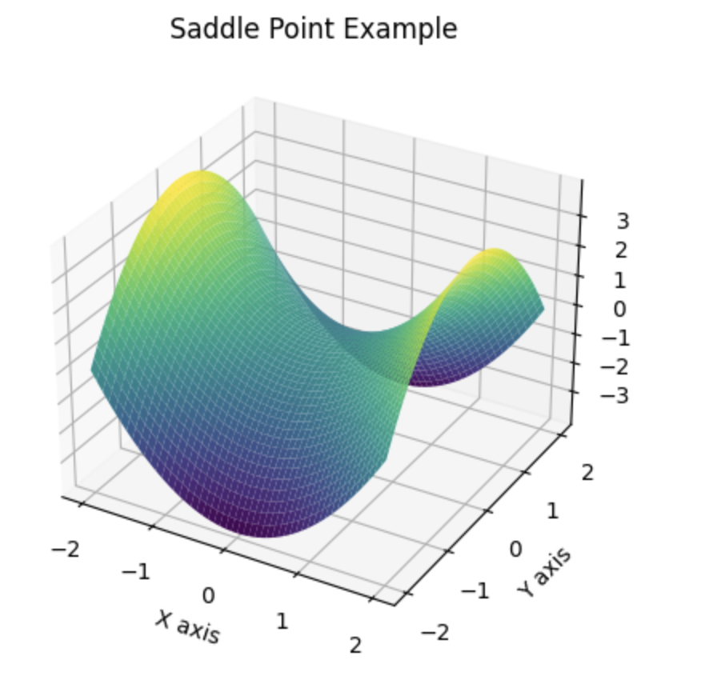

# 目录

- [1.数据类别不平衡怎么处理？](#user-content-1.数据类别不平衡怎么处理？)
- [2.什么是过拟合，解决过拟合的方法有哪些？](#user-content-2.什么是过拟合，解决过拟合的方法有哪些？)
- [3.什么是欠拟合，解决欠拟合的方法有哪些？](#user-content-3.什么是欠拟合，解决欠拟合的方法有哪些？)
- [4.正则化的本质以及常用正则化手段？](#user-content-4.正则化的本质以及常用正则化手段？)
- [5.L范数的作用？](#user-content-5.l范数的作用？)
- [6.Dropout的作用？](#user-content-6.dropout的作用？)
- [7.如何找到让F1最高的分类阈值？](#user-content-7.如何找到让f1最高的分类阈值？)
- [8.L1正则为什么比L2正则更容易产生稀疏解?](#user-content-8.l1正则为什么比l2正则更容易产生稀疏解)
- [9.梯度爆炸和梯度消失产生的原因及解决方法?](#user-content-9.梯度爆炸和梯度消失产生的原因及解决方法)
- [10.数据EDA逻辑（Exploratory Data Analysis）？](#user-content-10.数据eda逻辑（exploratory-data-analysis）？)
- [11.什么是PEFT技术？](#user-content-11.什么是PEFT技术？)
- [12.什么是哈达玛积，在AI领域有哪些典型应用？](#user-content-12.什么是哈达玛积，在AI领域有哪些典型应用？)
- [13.什么是机器学习中的鞍点？](#user-content-13.什么是机器学习中的鞍点？)
- [14.正则化为什么可以防止过拟合？](#user-content-14.正则化为什么可以防止过拟合？)
- [15.深度学习中正则化作用是什么？方法都有哪些？](#user-content-15.深度学习中正则化作用是什么？方法都有哪些？)
- [16.介绍一下深度学习正则化中的 L1 正则化和 L2 正则化的区别？](#user-content-16.介绍一下深度学习正则化中的L1正则化和L2正则化的区别？)
- [17.如何在AI模型中加入先验知识？](#user-content-17.如何在AI模型中加入先验知识？)


<h2 id="1.数据类别不平衡怎么处理？">1.数据类别不平衡怎么处理？</h2>
  
1. 数据增强。

2. 对少数类别数据做过采样，多数类别数据做欠采样。

3. 损失函数的权重均衡。（不同类别的loss权重不一样，最佳参数需要手动调节）

4. 采集更多少数类别的数据。

5. 转化问题定义，将问题转化为异常点检测或变化趋势检测问题。 异常点检测即是对那些罕见事件进行识别，变化趋势检测区别于异常点检测，其通过检测不寻常的变化趋势来进行识别。

6. 使用新的评价指标。

7. 阈值调整，将原本默认为0.5的阈值调整到：较少类别/（较少类别+较多类别）。

<h2 id="2.什么是过拟合，解决过拟合的方法有哪些？">2.什么是过拟合，解决过拟合的方法有哪些？</h2>
  
<font color=DeepSkyBlue>过拟合</font>：模型在训练集上拟合的很好，但是模型连噪声数据的特征都学习了，丧失了对测试集的泛化能力。

<font color=DeepSkyBlue>解决过拟合的方法</font>：

1. 重新清洗数据，数据不纯会导致过拟合，此类情况需要重新清洗数据或重新选择数据。
  
2. 增加训练样本数量。使用更多的训练数据是解决过拟合最有效的手段。我们可以通过一定的规则来扩充训练数据，比如在图像分类问题上，可以通过图像的平移、旋转、缩放、加噪声等方式扩充数据;也可以用GAN网络来合成大量的新训练数据。
3. 降低模型复杂程度。适当降低模型复杂度可以避免模型拟合过多的噪声数据。在神经网络中减少网络层数、神经元个数等。
4. 加入正则化方法，增大正则项系数。给模型的参数加上一定的正则约束，比如将权值的大小加入到损失函数中。
5. 采用dropout方法，dropout方法就是在训练的时候让神经元以一定的概率失活。
6. 提前截断（early stopping），减少迭代次数。
7. 增大学习率。
8. 集成学习方法。集成学习是把多个模型集成在一起，来降低单一模型的过拟合风险，如Bagging方法。

<h2 id="3.什么是欠拟合，解决欠拟合的方法有哪些？">3.什么是欠拟合，解决欠拟合的方法有哪些？</h2>
  
<font color=DeepSkyBlue>欠拟合</font>：模型在训练集和测试集上效果均不好，其根本原因是模型没有学习好数据集的特征。

<font color=DeepSkyBlue>解决欠拟合的方法</font>：

1. 可以增加模型复杂度。对于神经网络可以增加网络层数或者神经元数量。

2. 减小正则化系数。正则化的目的是用来防止过拟合的，但是现在模型出现了欠拟合，则需要有针对性地减小正则化系数。

3. Boosting。

<h2 id="4.正则化的本质以及常用正则化手段？">4.正则化的本质以及常用正则化手段？</h2>
  
正则化是机器学习的核心主题之一。<font color=DeepSkyBlue>正则化本质是对某一问题加以先验的限制或约束以达到某种特定目的的一种操作</font>。在机器学习中我们通过使用正则化方法，防止其过拟合，降低其泛化误差。

常用的正则化手段：

1. 数据增强
  
2. 使用L范数约束
3. dropout
4. early stopping
5. 对抗训练

<h2 id="5.l范数的作用？">5.L范数的作用？</h2>
  
L范数主要起到了正则化（<font color=DeepSkyBlue>即用一些先验知识约束或者限制某一抽象问题</font>）的作用，而正则化主要是防止模型过拟合。

范数主要用来表征高维空间中的距离，故在一些生成任务中也直接用L范数来度量生成图像与原图像之间的差别。

下面列出深度学习中的范数：
  


<h2 id="6.dropout的作用？">6.Dropout的作用？</h2>

Dropout是在训练过程中以一定的概率使神经元失活，也就是输出等于0。从而提高模型的泛化能力，减少过拟合。
  


我们可以从<font color=DeepSkyBlue>两个方面去直观地理解Dropout的正则化效果</font>：1）在Dropout每一轮训练过程中随机丢失神经元的操作相当于多个模型进行取平均，因此用于预测时具有vote的效果。2）减少神经元之间复杂的共适应性。当隐藏层神经元被随机删除之后，使得全连接网络具有了一定的稀疏化，从而有效地减轻了不同特征的协同效应。也就是说，有些特征可能会依赖于固定关系的隐含节点的共同作用，而通过Dropout的话，就有效地避免了某些特征在其他特征存在下才有效果的情况，增加了神经网络的鲁棒性。

<font color=DeepSkyBlue>Dropout在训练和测试时的区别</font>：Dropout只在训练时产生作用，是为了减少神经元对部分上层神经元的依赖，类似将多个不同网络结构的模型集成起来，减少过拟合风险。而在测试时，应该用整个训练好的模型，因此不需要Dropout。

<h2 id="7.如何找到让f1最高的分类阈值？">7.如何找到让F1最高的分类阈值？</h2>
  
首先，这个问题只存在于二分类问题中，对于多分类问题，只需要概率最高的那个预测标签作为输出结果即可。

F1值是综合了精准率和召回率两个指标对模型进行评价：
  


一般设0.5作为二分类的默认阈值，但一般不是最优阈值。想要精准率高，一般使用高阈值，而想要召回率高，一般使用低阈值。在这种情况下，我们通常可以通过P-R曲线去寻找最优的阈值点或者阈值范围。

<h2 id="8.l1正则为什么比l2正则更容易产生稀疏解">8.L1正则为什么比L2正则更容易产生稀疏解?</h2>

我们首先可以设目标函数为 $L$ ，目标函数中的权值参数为 $w$ ，那么目标函数和权值参数的关系如下所示：


如上图所示，最优的 $w$ 在绿色的点处，而且 $w$ 非零。

我们首先可以使用L2正则进行优化，新的目标函数： $L + CW^{2}$ ，示意图如下蓝线所示：


我们可以看到，最优的 $w$ 出现在黄点处， $w$ 的绝对值减小了，更靠近横坐标轴，但是依然是非零的。

<font color=DeepSkyBlue>为什么是非零的呢？</font>

我们可以对L2正则下的目标函数求导：


我们发现，权重 $w$ 每次乘上的是小于1的倍数进行收敛，而且其导数在 $w=0$ 时没有办法做到左右两边导数异号，所以L2正则使得整个训练过程稳定平滑，但是没有产生稀疏性。

接下来我们使用L1正则，新的目标函数： $L + C|w|$ ，示意图如下粉线所示：


这里最优的 $w$ 就变成了0。因为保证使用L1正则后 $x=0$ 处左右两个导数异号，就能满足极小值点形成的条件。

我们来看看这次目标函数求导的式子：


可以看出L1正则的惩罚很大， $w$ 每次都是减去一个常数的线性收敛，所以L1比L2更容易收敛到比较小的值，而如果 $C > |f^{'}(0)|$ ，就能保证 $w = 0$ 处取得极小值。

上面只是一个权值参数 $w$ 。在深层网路中，L1会使得大量的 $w$ 最优值变成0，从而使得整个模型有了稀疏性。

<h2 id="9.梯度爆炸和梯度消失产生的原因及解决方法">9.梯度爆炸和梯度消失产生的原因及解决方法?</h2>

### 梯度爆炸和梯度消失问题

一般在深层神经网络中，我们需要预防梯度爆炸和梯度消失的情况。

梯度消失（gradient vanishing problem）和梯度爆炸（gradient exploding problem）一般随着网络层数的增加会变得越来越明显。

例如下面所示的含有三个隐藏层的神经网络，梯度消失问题发生时，接近输出层的hiden layer3的权重更新比较正常，但是前面的hidden layer1的权重更新会变得很慢，导致前面的权重几乎不变，仍然接近初始化的权重，<font color=DeepSkyBlue>这相当于hidden layer1没有学到任何东西，此时深层网络只有后面的几层网络在学习，而且网络在实际上也等价变成了浅层网络</font>。


### 产生梯度爆炸和梯度消失问题的原因

我们来看看看反向传播的过程：

（假设网络每一层只有一个神经元，并且对于每一层 $y_{i} = \sigma(z_{i}) = \sigma(w_{i}x_{i} + b_{i})$ ）


可以推导出：


而sigmoid的导数 $\sigma^{'}(x)$ 如下图所示：


可以知道， $\sigma^{'}(x)$的最大值是$\frac{1}{4}$ ，而我们初始化的权重 $|w|$ 通常都小于1，因此 $\sigma^{'}(x)|w| <= \frac{1}{4}$ ，而且链式求导层数非常多，不断相乘的话，最后的结果越来越小，趋向于0，就会出现梯度消失的情况。

梯度爆炸则相反， $\sigma^{'}(x)|w| > 1$ 时，不断相乘结果变得很大。

<font color=DeepSkyBlue>梯度爆炸和梯度消失问题都是因为网络太深，网络权重更新不稳定造成的，本质上是梯度方向传播的连乘效应。</font>

### 梯度爆炸和梯度消失的解决方法

1. 使用预训练加微调策略。
2. 进行梯度截断。
3. 使用ReLU、LeakyReLU等激活函数。
4. 引入BN层。
5. 使用残差结构。
6. 使用LSTM思想。

<h2 id="10.数据eda逻辑（exploratory-data-analysis）？">10.数据EDA逻辑（Exploratory Data Analysis）？</h2>

1. 导入相应的Modules（numpy，pandas，matplotlib，PIL等）
2. 阅读了解所有的数据文件（图片数据，类别文件，辅助文件等）
3. 数据类别特征分析（数据类别总数，数据类别的平衡度，数据尺寸，噪声数据等）
4. 数据可视化二次分析（直观了解不同类别的区别）


<h2 id="11.什么是PEFT技术？">11.什么是PEFT技术？</h2>

PEFT（Parameter-Efficient Fine-Tuning，参数高效微调）是一种在AI模型上进行微调的技术，旨在提高模型在小样本数据上的性能，同时减少训练和推理的计算资源消耗。PEFT技术通过仅更新模型的一部分参数或通过使用更高效的参数更新策略来达到这些目标。以下是Rocky对PEFT技术的详细讲解：

### 我们为什么需要PEFT技术

在实际应用中，深度学习模型往往需要针对特定任务或数据集进行微调。然而，微调整个模型的所有参数不仅计算成本高，而且容易导致过拟合，特别是在训练数据有限的情况下。PEFT 通过优化参数更新策略，可以在保持高性能的同时显著减少计算资源需求。

### PEFT的主要方法

PEFT包括多种具体的方法和策略，以下是一些常见的PEFT技术：

#### 1. 微调部分层（Layer-wise Fine-Tuning）

**概述**：仅微调模型的某些特定层，而保持其他层的参数不变。

**方法**：
- 冻结部分层：在训练过程中保持某些层的参数固定，只更新特定层的参数。
- 选择性微调：根据任务的需求和模型的特性，选择重要或高层次的层进行微调。

**优点**：减少计算量和过拟合风险，同时保留模型的预训练知识。

#### 2. 低秩分解（Low-Rank Factorization）

**概述**：将模型参数矩阵分解为几个低秩矩阵，只更新低秩矩阵的参数。

**方法**：
- 使用奇异值分解（SVD）等分解技术，将高维参数矩阵分解为低秩矩阵。
- 在训练过程中，只更新这些低秩矩阵的参数。

**优点**：减少参数数量和计算复杂度，提高训练效率。

#### 3. 子网络选择（Subnetwork Selection）

**概述**：从预训练模型中选择一个子网络进行微调，而不改变整个模型。

**方法**：
- Lottery Ticket Hypothesis：通过训练，发现预训练模型中存在一个子网络（Lottery Ticket），能够在小样本情况下表现良好。
- 激活特定子网络：在训练和推理过程中，仅激活并微调模型的某些子网络。

**优点**：充分利用预训练模型的潜力，减少计算资源需求。

#### 4. 权重共享和参数重用（Weight Sharing and Parameter Reuse）

**概述**：在模型中共享权重或重用参数，以减少训练和推理的计算量。

**方法**：
- 在多任务学习中，多个任务共享部分模型参数。
- 使用权重共享技术，如Transformer中的共享注意力头。

**优点**：提高参数利用率，减少模型参数数量。

### PEFT的应用场景
1. AIGC
2. 传统深度学习
3. 自动驾驶

### PEFT 的优势和挑战

#### 优势

1. **减少计算资源需求**：通过只更新一部分参数，显著减少训练和推理的计算资源需求。
2. **提高训练效率**：通过参数高效更新策略，加快模型的训练速度。
3. **减少过拟合风险**：在小样本数据上训练时，减少过拟合的风险，提高模型的泛化能力。

#### 挑战

1. **选择合适的策略**：需要根据具体任务和数据特点，选择合适的PEFT策略。
2. **模型复杂性**：某些PEFT方法可能会增加模型的实现复杂性，需要更多的工程实践。
3. **参数调优**：需要精细调优模型参数和训练超参数，以达到最佳效果。

### PEFT技术实际案例

以下是一个简单的示例，展示我们如何应用PEFT技术进行模型微调：

```python
import torch
import torch.nn as nn
import torch.optim as optim
from torchvision import datasets, transforms, models

# 加载预训练模型
model = models.resnet50(pretrained=True)

# 冻结所有层的参数
for param in model.parameters():
    param.requires_grad = False

# 替换最后的全连接层
model.fc = nn.Linear(model.fc.in_features, 10)  # 假设有10个分类

# 仅微调最后的全连接层
optimizer = optim.Adam(model.fc.parameters(), lr=0.001)
criterion = nn.CrossEntropyLoss()

# 加载数据
transform = transforms.Compose([transforms.Resize(256), transforms.CenterCrop(224), transforms.ToTensor()])
train_dataset = datasets.CIFAR10(root='./data', train=True, download=True, transform=transform)
train_loader = torch.utils.data.DataLoader(train_dataset, batch_size=32, shuffle=True)

# 训练模型
model.train()
for epoch in range(10):  # 假设训练10个epoch
    for inputs, labels in train_loader:
        optimizer.zero_grad()
        outputs = model(inputs)
        loss = criterion(outputs, labels)
        loss.backward()
        optimizer.step()

print("微调完成")
```

在这个示例中，我们加载了一个预训练的ResNet 50模型，仅微调了最后的全连接层以适应新的分类任务（CIFAR-10数据集）。通过冻结其他层的参数，我们实现了PEFT，提高了训练效率并减少了过拟合风险。

### 总结

PEFT（参数高效微调）技术通过优化参数更新策略，在保持模型性能的同时，显著减少了计算资源需求和过拟合风险。PEFT在AIGC、传统深度学习、自动驾驶等领域具有广泛应用前景。选择合适的PEFT策略并进行精细调优，可以让我们在小样本数据上实现高效且高性能的模型微调。


<h2 id="12.什么是哈达玛积，在AI领域有哪些典型应用？">12.什么是哈达玛积，在AI领域有哪些典型应用？</h2>

### 哈达玛积（Hadamard Product）

哈达玛积（Hadamard Product），又称逐元素乘积（element-wise product），是线性代数中的一种矩阵运算。它与标准矩阵乘法不同，哈达玛积是对两个相同大小的矩阵的对应元素进行乘积运算。

哈达玛积通过逐元素乘积，它能够有效地进行特征组合、权重计算和信息传播，增强模型的表达能力和计算效率。

### 数学定义

给定两个相同大小的矩阵 $ A $ 和 $ B $，它们的哈达玛积 $ C $ 定义如下：

$$ C = A \circ B $$

其中 $ C $ 的每个元素 $ c_{ij} $ 计算为：

$$ c_{ij} = a_{ij} \times b_{ij} $$

例如，假设有以下两个矩阵 $ A $ 和 $ B $：

$$ A = \begin{bmatrix} 1 & 2 \\ 3 & 4 \end{bmatrix}, \quad B = \begin{bmatrix} 5 & 6 \\ 7 & 8 \end{bmatrix} $$

它们的哈达玛积 $ C $ 为：

$$ C = A \circ B = \begin{bmatrix} 1 \times 5 & 2 \times 6 \\ 3 \times 7 & 4 \times 8 \end{bmatrix} = \begin{bmatrix} 5 & 12 \\ 21 & 32 \end{bmatrix} $$

### 哈达玛积在深度学习中的应用

在AI行业中，哈达玛积有多种重要的应用，特别是在AIGC、传统深度学习、自动驾驶领域中。下面是一些典型的应用和作用：

1. **注意力机制**：
   在注意力机制（Attention Mechanism）中，哈达玛积被用来计算注意力权重。例如，在自注意力（Self-Attention）机制中，通过计算输入向量之间的相似度，利用哈达玛积对这些相似度进行加权，从而突出输入序列中重要的部分。

2. **门控机制**：
   在循环神经网络（RNN）和长短期记忆网络（LSTM）中，哈达玛积用于门控机制。例如，LSTM中的输入门、遗忘门和输出门的计算都涉及到哈达玛积，这些门控制了信息的流动。

3. **卷积神经网络（CNN）**：
   在CNN中，哈达玛积用于元素级别的操作，例如在深度可分离卷积（Depthwise Separable Convolutions）中，通过对每个通道进行逐元素乘积来实现卷积操作，减少了计算量和参数量。

4. **图神经网络（GNN）**：
   在图神经网络中，哈达玛积用于节点特征的组合。例如，在图卷积网络（GCN）中，通过逐元素乘积来聚合邻居节点的特征，从而更新节点的表示。


<h2 id="13.什么是机器学习中的鞍点？">13.什么是机器学习中的鞍点？</h2>

在机器学习的算法优化中，鞍点（saddle point）是一个非常重要的概念，特别是在训练深度学习模型时。理解鞍点对于理解优化过程的困难性和改进优化算法至关重要。

### 鞍点的定义

在数学和优化领域，**鞍点是一个既不是局部最小值也不是局部最大值的点，但在某些方向上表现为最小值，而在其他方向上表现为最大值**。

鞍点正式的定义如下：
- 对于函数 $f(x)$ ，点 $x^*$ 是鞍点，如果在 $x^*$ 点，函数在某些方向上的二次导数为正（表示该方向上的局部最小值），而在其他方向上的二次导数为负（表示该方向上的局部最大值）。

### 鞍点的几何解释

从几何角度上看，鞍点类似于马鞍的形状。在二维空间中，**可以将鞍点想象为一个山谷和山脊交汇的地方**。沿着一个方向，它是山谷（局部最小值），沿着另一个方向，它是山脊（局部最大值）。

### 鞍点对机器学习模型的影响

在训练机器学习模型时，损失函数往往是高维非凸函数，具有许多局部最小值、鞍点和平坦区域。鞍点对优化算法（如梯度下降）造成了以下几个影响：

1. **训练困难**：
   - 梯度下降法在鞍点附近的收敛速度会变得非常慢，因为梯度在鞍点处为零，导致更新步长变小，优化过程停滞。

2. **鞍点数量众多**：
   - 高维空间中的鞍点数量比局部最小值多得多，因此优化算法更容易遇到鞍点而非局部最小值。

3. **逃离鞍点**：
   - 使用优化算法如随机梯度下降（SGD），通过引入随机噪声，能够帮助算法逃离鞍点。这是因为噪声可以帮助突破平坦区域，继续朝着下降方向前进。

### 鞍点与局部最小值的区别

局部最小值是指在一个小范围内，函数值小于或等于该范围内其他点的值。鞍点虽然在某些方向上是最小值，但在其他方向上是最大值，因此既不是纯粹的最小值也不是最大值。

### 实例与图示

#### 简单的二维示例

以函数 $f(x, y) = x^2 - y^2$ 为例。

- 函数在原点 $(0, 0)$ 处有一个鞍点。
- 沿 $x$ 方向，函数表现为 $x^2$ ，在 $x=0$ 时是最小值。
- 沿 $y$ 方向，函数表现为 $-y^2$ ，在 $y=0$ 时是最大值。

#### 三维图示

在三维空间中，函数 $f(x, y) = x^2 - y^2$ 的图形如下所示：

```python
import numpy as np
import matplotlib.pyplot as plt
from mpl_toolkits.mplot3d import Axes3D

x = np.linspace(-2, 2, 400)
y = np.linspace(-2, 2, 400)
X, Y = np.meshgrid(x, y)
Z = X**2 - Y**2

fig = plt.figure()
ax = fig.add_subplot(111, projection='3d')
ax.plot_surface(X, Y, Z, cmap='viridis')

ax.set_xlabel('X axis')
ax.set_ylabel('Y axis')
ax.set_zlabel('Z axis')
ax.set_title('Saddle Point Example')

plt.show()
```



在这个图中，$(0, 0)$ 处的点即为鞍点。我们可以看到，在 $x$ 方向是一个上凸的曲线（局部最小值），在 $y$ 方向是一个下凸的曲线（局部最大值）。


<h2 id="14.正则化为什么可以防止过拟合？">14.正则化为什么可以防止过拟合？</h2>

正则化可以防止过拟合主要有以下几个原因：

**一、限制模型复杂度**

1. 过拟合通常是由于模型过于复杂，以至于它不仅学习到了数据中的真实模式，还学习到了噪声和异常值。正则化通过在损失函数中添加一个惩罚项，对模型的复杂度进行限制。
2. 例如，L1 和 L2 正则化分别对模型参数的绝对值之和和平方和进行惩罚。这使得模型在优化过程中，不能随意地让参数变得很大，从而限制了模型的表达能力，使其不会过度拟合训练数据。

**二、促进参数稀疏性（以 L1 正则化为例）**

1. L1 正则化具有使参数稀疏的特性，即它会促使很多参数变为零。这意味着模型自动选择了一些重要的特征，而忽略了那些不太重要的特征。
2. 当模型的参数变得稀疏时，它实际上是在进行特征选择，只依赖于少数关键特征进行预测。这样可以减少模型对噪声和无关特征的依赖，从而降低过拟合的风险。

**三、增加模型稳定性**

1. 正则化使得模型参数更加稳定，不会因为数据的微小变化而发生剧烈波动。当模型对数据的变化不那么敏感时，它就不太容易过拟合到特定的训练数据样本。
2. 例如，在没有正则化的情况下，模型可能会过度适应训练数据中的一些异常值，导致参数调整过大。而正则化可以约束参数的变化范围，使模型更加稳健。

**四、提高泛化能力**

1. 过拟合的模型往往在训练集上表现很好，但在新的、未见过的数据上表现不佳。正则化通过限制模型复杂度和增加稳定性，提高了模型的泛化能力。
2. 它迫使模型学习到更加通用的模式，而不是仅仅记住训练数据的特定细节。这样，当面对新的数据时，模型能够更好地进行预测，而不会出现严重的性能下降。

<h1 id="15.深度学习中正则化作用是什么？方法都有哪些？">15.深度学习中正则化作用是什么？正则化方法都有哪些？</h1>

在深度学习中，正则化的作用主要有以下几点：
一、防止过拟合
过拟合是指模型在训练数据上表现很好，但在新的、未见过的数据上表现不佳。正则化通过对模型的复杂度进行限制，使得模型不能过度拟合训练数据，从而提高模型的泛化能力，即在新数据上的预测性能。
二、提高模型稳定性
正则化可以使模型的参数更加稳定，不会因为数据的微小变化而发生剧烈波动。这有助于提高模型的鲁棒性，降低对噪声和异常值的敏感性。
三、促进特征选择
某些正则化方法可以促使模型自动选择重要的特征，忽略不重要的特征。例如，L1 正则化可以使一些参数变为零，从而实现特征选择。
深度学习中的正则化方法主要有以下几种：

**一、L1 正则化**

L1 正则化也称为 Lasso 正则化。它在损失函数中加入了模型参数的绝对值之和作为惩罚项。即对于一个模型的损失函数\(L\)，加入 L1 正则化后的损失函数变为\(L+\lambda\sum_{i}|w_{i}|\)，其中\(\lambda\)是正则化参数，\(w_{i}\)是模型的参数。L1 正则化的作用是使部分参数变为零，从而实现特征选择，使模型更加稀疏。

**二、L2 正则化**

L2 正则化也称为 Ridge 正则化。它在损失函数中加入了模型参数的平方和作为惩罚项。即损失函数变为\(L+\lambda\sum_{i}w_{i}^{2}\)。L2 正则化可以防止模型过拟合，使模型参数更加稳定，不会出现太大的值。

**三、Dropout**

在训练过程中，随机地将神经网络中的一些神经元的输出设置为零，以防止神经元之间的共适应。这样可以使模型更加鲁棒，减少过拟合的风险。Dropout 通常在训练时使用，在测试时不使用。

**四、数据增强**

通过对原始数据进行随机变换，如翻转、旋转、裁剪、缩放等操作，生成更多的训练数据。这样可以增加数据的多样性，使模型学习到更加通用的特征，减少过拟合。

**五、早停法（Early Stopping）**

在训练过程中，监控模型在验证集上的性能。当模型在验证集上的性能开始下降时，停止训练。这样可以防止模型在训练集上过拟合，同时也可以减少训练时间。

**六、批归一化（Batch Normalization）**

对每一批数据进行归一化处理，使得数据的均值为零，方差为一。这样可以加速模型的训练，提高模型的泛化能力。批归一化可以看作是一种隐式的正则化方法，它可以减少内部协变量偏移，使模型更加稳定。


<h1 id="16.介绍一下深度学习正则化中的L1正则化和L2正则化的区别？">16.介绍一下深度学习正则化中的L1正则化和L2正则化的区别？</h1>

在深度学习中，L1 正则化和 L2 正则化都是常用的正则化方法，它们的主要区别如下：

**一、数学表达式**

1. L1 正则化：在损失函数中加入模型参数的绝对值之和作为惩罚项。对于一个模型的损失函数\(L\)，加入 L1 正则化后的损失函数变为\(L+\lambda\sum_{i}|w_{i}|\)，其中\(\lambda\)是正则化参数，\(w_{i}\)是模型的参数。
2. L2 正则化：在损失函数中加入模型参数的平方和作为惩罚项。损失函数变为\(L+\lambda\sum_{i}w_{i}^{2}\)。

**二、作用效果**

1. 稀疏性：
   - L1 正则化倾向于使部分参数变为零，从而产生稀疏的模型。这意味着它可以自动进行特征选择，将不重要的特征对应的参数置为零，只保留对模型贡献较大的特征。
   - L2 正则化则不会产生完全为零的参数，它只是使参数的值变小，更倾向于使参数分布更加均匀地接近零，但不会达到零值。

2. 稳定性：
   - L2 正则化通常会使模型参数更加稳定，因为它对大的参数值施加的惩罚更大，从而防止参数变得过大。
   - L1 正则化可能会导致参数的值在零附近波动较大，相对来说稳定性稍差一些。

**三、求解方法**

1. 优化算法：
   - 在使用优化算法求解模型参数时，L1 正则化的优化问题相对较难求解，因为绝对值函数在零点处不可导。通常需要使用一些特殊的优化算法，如近端梯度下降法等。
   - L2 正则化的优化问题相对容易求解，因为平方函数是光滑的，大多数优化算法都可以直接应用。

2. 几何解释：
   - L1 正则化的解通常位于坐标轴上，因为绝对值函数在坐标轴上有明显的棱角，优化过程会趋向于使参数在坐标轴上取值，从而产生稀疏解。
   - L2 正则化的解通常位于一个圆形区域内，因为平方函数是一个二次曲面，优化过程会使参数在一个圆形范围内取值，不会产生稀疏解。

**四、应用场景**

1. 特征选择：
   - 当需要进行特征选择，即确定哪些特征对模型最重要时，L1 正则化更适合。它可以自动识别出不重要的特征并将其对应的参数置为零。
   - 如果不需要进行严格的特征选择，而只是希望控制模型的复杂度和稳定性，L2 正则化可能更合适。

2. 模型复杂度：
   - L1 正则化通常会使模型更加简单和稀疏，适用于特征数量较多但可能只有一部分特征真正重要的情况。
   - L2 正则化适用于特征数量不是特别多，且希望模型参数更加稳定的情况。


<h1 id="17.如何在AI模型中加入先验知识？">17.如何在AI模型中加入先验知识？</h1>

在AI模型中加入**先验知识**可以帮助模型更快收敛、减少数据需求、增强模型的泛化能力。先验知识是一种基于已知的经验、规则或领域知识，可以作为模型的指导原则。以下是几种常用的方法来将先验知识融入AI模型中：

### 1. **通过特征工程引入先验知识**

在训练模型之前，特征工程是一个重要步骤，通过提取、转换和组合数据特征，能够将有用的先验知识注入模型。具体方法包括：

- **构造新特征**：根据领域知识提取相关特征。例如，在气象预测中可以利用“湿度”和“温度”的组合特征，而在金融领域，可以构造基于历史价格变化的移动平均值。
  
- **特征选择**：从已有的特征中筛选出更重要的特征，减少无用或冗余信息的干扰，从而使模型更加专注于重要信息。

- **特征编码**：对于分类特征，可以使用标签编码、独热编码等方法，将领域知识中的分类信息转换为模型可以理解的形式。例如，在医学数据中，将“严重程度”级别转换为数值型编码。

### 2. **设计损失函数来反映先验知识**

损失函数是模型优化的核心，通过修改损失函数可以将先验知识整合到模型的学习目标中。具体方法包括：

- **加权损失**：为特定的样本或特征添加权重，以突出具有重要意义的部分。例如，在疾病预测中，对更严重的病例赋予更大的权重，使得模型更加重视这些样本。
  
- **正则化项**：加入正则化项，以鼓励模型学习符合先验知识的解。例如，L2 正则化可以防止模型参数过大，避免过拟合。

- **特定目标的损失函数**：设计特定损失函数来反映业务需求或领域知识。例如，在排序任务中，可以加入排名损失，以保证预测结果符合期望的排序关系。

### 3. **通过规则嵌入模型来引入先验知识**

在模型中直接嵌入领域规则可以帮助模型对特定条件或场景有更明确的反应：

- **约束优化**：在模型优化过程中引入约束条件，使模型满足特定要求。例如，在路径规划中，可以为模型设置必须避开特定区域的约束条件。
  
- **决策规则**：将基于经验的规则或公式作为辅助信息加入模型中。例如，在信用评分模型中，加入“高负债率降低信用评分”的规则，使模型能够根据具体条件作出合理的决策。

- **知识图谱**：将知识图谱整合到模型中，使模型能够利用结构化的关系信息来推理或生成内容。知识图谱包含大量实体、关系和属性，可以帮助模型更好地理解复杂的语义。

### 4. **利用预训练模型和迁移学习引入先验知识**

使用预训练模型和迁移学习是一种有效的方式，可以从外部数据或相关任务中获取先验知识：

- **预训练模型**：利用在大规模数据集（如ImageNet、GPT-3）上训练的模型，进行微调以适应特定任务。预训练模型已经学习了丰富的特征，包含广泛的知识，可直接应用于新的任务中。
  
- **迁移学习**：将先验知识从一个任务迁移到另一个任务。例如，在情感分析中使用预训练的语言模型，然后在新的领域数据上微调，这样可以加快收敛速度，减少对大量数据的需求。

- **多任务学习**：通过在多个相关任务上同时训练模型，使得模型能够学习到各个任务之间的共性知识。多任务学习可以帮助模型在多个任务上共享先验知识，增强泛化能力。

### 5. **通过数据增强加入先验知识**

数据增强技术可以在训练数据中加入先验知识，帮助模型更好地学习特定的特征或模式：

- **数据合成**：基于领域知识生成新样本。例如，在医学影像中，利用原有影像数据生成新的病变图像，以增加模型对不同病变类型的识别能力。
  
- **不变性数据增强**：在图像或语音识别中，通过旋转、缩放、翻转等操作增强数据，注入数据的几何先验知识，使模型能够学习到特征的不变性。

- **生成对抗网络（GAN）**：利用GAN生成与实际数据相似的样本，以增强模型的鲁棒性。GAN的生成结果可以为模型提供多样化的先验知识，尤其适合在数据匮乏的场景中使用。

### 6. **使用启发式学习和专家标注**

启发式学习和专家标注是结合人类知识和经验的方式，能够直接影响模型的训练过程：

- **标签生成**：根据先验知识和专家经验标注样本，特别是在监督学习中，可以通过引入专家标签提升数据质量。
  
- **启发式规则生成标签**：例如在文本分类中，利用关键字匹配、模式识别等方法，生成初始标签，帮助模型快速学习。

- **教师网络与知识蒸馏**：通过训练教师网络，将其作为知识来源，指导学生网络的训练。在教师网络中可以引入大量先验知识，通过知识蒸馏的方式使学生网络在不增加复杂度的情况下学习到更丰富的知识。

### 7. **通过贝叶斯学习和概率模型引入先验知识**

贝叶斯学习和概率模型可以利用先验概率进行推断，使模型能够结合数据和先验知识共同决策：

- **贝叶斯先验**：在贝叶斯推理中，先验知识可以作为先验概率加入模型。根据先验知识和数据的观测结果，更新后验概率，使模型更合理地输出预测。
  
- **隐变量模型**：在主题建模等任务中，可以利用隐变量表示先验知识。例如在LDA主题模型中，可以将特定主题设定为先验，使模型在训练过程中向这些主题倾斜。

### 总结

在AI模型中引入先验知识的方法多种多样，具体选择应基于任务需求、数据特性和先验知识的可获得性。通过特征工程、定制损失函数、直接嵌入规则、迁移学习、数据增强、专家标注和贝叶斯方法等途径，先验知识可以有效指导模型的训练，使模型在数据量有限或场景复杂时依然表现良好。
