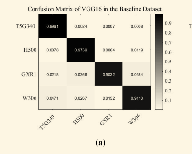

# 目录

- [1.Accuracy、Precision、Recall、F1 Scores的相关概念？](#user-content-1.accuracy、precision、recall、f1-scores的相关概念？)
- [2.K折交叉验证逻辑？](#user-content-2.k折交叉验证逻辑？)
- [3.介绍一下机器学习中的信噪比（SNR）](#user-content-3.介绍一下机器学习中的信噪比（SNR）)
- [4.混淆矩阵是什么？](#4.混淆矩阵是什么？)
- [5.什么是机器学习中的AUC和ROC的概念？](#5.什么是机器学习中的AUC和ROC的概念？)

<h2 id="1.accuracy、precision、recall、f1-scores的相关概念？">1.Accuracy、Precision、Recall、F1 Scores的相关概念？</h2>

首先Rocky介绍一下相关名词：

1. TP（True Positive）: 预测为正，实际为正
2. FP（False Positive）: 预测为正，实际为负
3. TN（True Negative）：预测为负，实际为负
4. FN（false negative）: 预测为负，实际为正

Accuracy、Precision、Recall、F1 Scores的公式如下所示：


Accuracy（准确率）：分类正确的样本数占样本总数的比例。

Precision（精准度/查准率）：当前预测为正样本类别中被正确分类的样本比例。

Recall（召回率/查全率）：预测出来的正样本占正样本总数的比例。

F1-score是Precision和Recall的综合。F1-score越高，说明分类模型越稳健。

<h2 id="2.k折交叉验证逻辑？">2.K折交叉验证逻辑？</h2>

### k折交叉验证的作用

当有多个不同的模型（结构不同、超参数不同等）可以选择时，我们通过K折交叉验证来选取对于特定数据集最好的模型。

### k折交叉验证的流程

1. 将含有 $N$ 个样本的数据集，分成 $K$ 份，每份含有 $\frac{N}{K}$ 个样本。选择其中一份作为验证集，另外 $K-1$ 份作为训练集，验证集集就有 $K$ 种情况。
2. 在每种情况中，用训练集训练模型，用验证集测试模型，计算模型的泛化误差。
3. 交叉验证重复 $K$ 次，平均 $K$ 次的结果作为模型最终的泛化误差。
4. $K$ 的取值一般在 $[2，10]$ 之间。 $K$ 折交叉验证的优势在于，同时重复运用随机产生的子样本进行训练和验证， $10$ 折交叉验证是最常用的。
5. 训练集中样本数量要足够多，一般至少大于总样本数的50%。
6. 训练集和验证集必须从完整的数据集中均匀采样。均匀采样的目的是希望减少训练集、验证集与原数据集之间的偏差。当样本数量足够多时，通过随机采样，便可以实现均匀采样的效果。

### 5折交叉验证举例

5折交叉验证(5-fold cross-validation)用来验证从不同的模型中选取最优的模型（最合适的模型）。将数据集分成5份，轮流将其中4份作为训练数据，1份作为验证数据，进行试验。每次试验都会得出相应的正确率。**5次的结果的正确率的平均值作为对算法精度的估计**。同时对不同的模型（如CNN、SVM、LR等）做上述相同的操作，得出每个模型在特定数据集上的平均能力，从中选优。

**例子：**

假设我们有一个特定数据集，我们想从YOLOv4、Mask R-CNN、SSD、Faster R-CNN、RetinaNet这五个模型中选取在这个特定数据集中有最好效果的一个模型作为baseline，我们可以进行交叉验证来进行判断：

**步骤：**

1. 将数据集分成5份。
2. 对于每一个模型，for i = 1， 2， 3， 4，5，每个for循环里将除了第i份的所有数据作为训练集用于训练，得到参数；再将参数在第i份数据上进行验证，得到评价结果。
3. 最后我们可以得到5个模型的结果，每个模型有5个验证结果。将每个模型的结果取平均值，得到该模型的平均结果。
4. 5个模型中平均结果最好的模型就是我们想要的最优模型。


<h2 id="3.介绍一下机器学习中的信噪比（SNR）">3.介绍一下机器学习中的信噪比（SNR）</h2>

信噪比（Signal-to-Noise Ratio, SNR）在机器学习和数据科学中是一个非常重要的概念，它用于衡量数据中有用信号和噪声的相对大小。通过提高信噪比，数据科学家可以提升数据集的质量，从而优化模型的训练和性能表现。在特征选择、数据预处理、降噪和模型优化等各个环节，信噪比的应用都可以为机器学习过程提供更精确的指导。

### 1. 信噪比的定义

信噪比通常用于表示信号（有用信息）与噪声（不需要的信息）的比例。在数学上，信噪比可以表示为：

$$\text{SNR} = \frac{P_{\text{signal}}}{P_{\text{noise}}}$$

其中：
- $P_{\text{signal}}$ 是信号的功率（或强度），表示有用信息的大小。
- $P_{\text{noise}}$ 是噪声的功率，表示噪声干扰的大小。

信噪比通常以对数形式表示，单位是分贝（dB）：

$$\text{SNR(dB)} = 10 \cdot \log_{10} \left(\frac{P_{\text{signal}}}{P_{\text{noise}}}\right)$$

### 2. 信噪比在机器学习中的应用

在机器学习领域，信噪比的概念通常用于衡量数据中有用信息的多少，判断模型训练时是否容易受到噪声的影响。常见应用包括：

#### 2.1 特征选择
信噪比可以帮助我们评估特征是否具有区分能力。高信噪比的特征能够更好地表达数据中的有用信息，而低信噪比的特征则可能受到噪声的干扰，从而影响模型的准确性。

- **信号**：特征与目标变量之间的相关性或信息量。
- **噪声**：特征中随机的或无关的波动，可能干扰模型的学习。

通过计算特征的信噪比，可以选择有用的特征，去除噪声较大的特征，优化模型性能。

#### 2.2 模型训练与优化
在模型训练过程中，数据中的噪声会影响模型的泛化能力。如果数据中的噪声过多，模型可能会过拟合噪声而非学习有用的信号。因此，信噪比高的数据集更容易训练出鲁棒性更高的模型。反之，信噪比低的数据集则可能导致模型性能不稳定。

#### 2.3 数据预处理
在进行数据预处理时，可以通过增强信号或减少噪声的方式来提高信噪比。例如：
- **降噪**：通过滤波器或噪声消除技术降低数据中的随机噪声。
- **平滑处理**：通过平滑技术减少噪声对数据的影响，突出信号。

#### 2.4 图像处理与计算机视觉
在图像处理领域，信噪比常用于评价图像质量。高信噪比的图像具有较清晰的纹理和细节，适合进行图像分类、目标检测等任务；而低信噪比的图像则可能受到噪声干扰，导致模型提取不到关键的特征。

### 3. 如何提高信噪比

在机器学习任务中，我们可以通过多种方法来提高数据的信噪比，从而提升模型性能：

#### 3.1 数据清洗
通过去除异常值、缺失值、重复数据等方式，可以减少噪声，提高数据集的信噪比。

#### 3.2 特征工程
通过选择最具代表性的特征，去除冗余或噪声较大的特征，可以有效提升信噪比。此外，特征缩放、归一化等技术也有助于提高信噪比。

#### 3.3 数据增强
在某些任务中（如图像处理），可以通过生成合成数据（如图像增强技术），来提高信号部分的多样性，从而提升信噪比。

#### 3.4 降噪技术
在处理音频、图像或其他信号数据时，降噪技术（如维纳滤波、小波去噪等）可以有效去除数据中的随机噪声，提升信噪比。

### 4. 信噪比的计算

在实际应用中，信噪比的计算方法可能依赖于具体的领域和任务。以下是几种常见的信噪比计算方法：

#### 4.1 经典信噪比（图像、音频）

对于图像或音频信号，信噪比可以通过原始信号和噪声之间的差异来计算。例如，在图像处理任务中，可以通过比较降噪前后的图像质量来计算：

$$\text{SNR} = 10 \cdot \log_{10} \left(\frac{\sum_{i=1}^N (x_i^2)}{\sum_{i=1}^N (x_i - \hat{x}_i)^2}\right)$$

其中：
- $x_i$ 是原始信号的值，
- $\hat{x}_i$ 是噪声处理后的信号值。

#### 4.2 基于特征的信噪比
在特征选择中，信噪比可以通过特征值的方差来计算。有用信号会导致较大的方差，而噪声则通常会表现为低方差。常用公式为：

$$\text{SNR} = \frac{\sigma_{\text{signal}}^2}{\sigma_{\text{noise}}^2}$$

其中， $\sigma_{\text{signal}}^2$ 是信号部分的方差， $\sigma_{\text{noise}}^2$ 是噪声部分的方差。

### 5. 信噪比的局限性

尽管信噪比是衡量数据质量的一个有效指标，但它也有一些局限性：
- **仅衡量相对比例**：信噪比只能反映信号与噪声的比例，不能单独衡量信号或噪声的绝对值。
- **假设噪声为高斯分布**：很多信噪比的计算方法假设噪声服从高斯分布，但在实际中，噪声的分布可能更加复杂。


<h2 id="4.混淆矩阵是什么？">4.混淆矩阵是什么？</h2>

混淆矩阵是评估分类模型性能的一个重要工具。它以表格的形式展示了模型预测结果与实际情况的对比,让我们能够直观地看到模型在各个类别上的表现。

最基本的混淆矩阵是针对二分类问题的:

1. 真正例(True Positive, TP): 模型正确地将正例预测为正例。
2. 真负例(True Negative, TN): 模型正确地将负例预测为负例。
3. 假正例(False Positive, FP): 模型错误地将负例预测为正例。
4. 假负例(False Negative, FN): 模型错误地将正例预测为负例。

这四个值组成了2x2的表格,即二分类问题的混淆矩阵。

通过混淆矩阵,我们可以计算出多个重要的评估指标:

- 准确率(Accuracy) = (TP + TN) / (TP + TN + FP + FN)
- 精确率(Precision) = TP / (TP + FP)
- 召回率(Recall) = TP / (TP + FN)
- F1分数 = 2 * (Precision * Recall) / (Precision + Recall)

对于多分类问题,混淆矩阵会相应扩大,变成 n x n 的矩阵,其中n是类别数。

下图显示了一个在基线数据集上使用 VGG16 模型生成的混淆矩阵。这个混淆矩阵用于分析模型在四个类别 (`T5G340`, `H500`, `GXR1`, `W306`) 上的分类性能。混淆矩阵中每个元素的值代表模型在预测某一类时的正确或错误的比例。

- **对角线上的值**（如 `0.9981`, `0.9739`, `0.9032`, `0.9110`）代表模型对这些类别的正确预测比例。例如，对于 `T5G340` 类，模型有 `99.81%` 的样本被正确分类；对于 `H500` 类，正确分类率为 `97.39%`，依此类推。
- **非对角线上的值**表示错误分类的比例。例如，在 `H500` 类的行和 `T5G340` 列中，值为 `0.0078`，这表示有 `0.78%` 的 `H500` 类样本被错误地分类为 `T5G340` 类。类似地，`0.0366` 表示有 `3.66%` 的 `GXR1` 类样本被错误分类为 `H500` 类。




<h2 id="5.什么是机器学习中的AUC和ROC的概念？">5.什么是机器学习中的AUC和ROC的概念？</h2>

### **1. 基本概念**
- **ROC曲线（Receiver Operating Characteristic Curve）**：  
  用于评估二分类模型在不同分类阈值下的性能，横轴为**假正率（FPR）**，纵轴为**真正率（TPR）**。  
  - **TPR（召回率）**： $\text{TPR} = \frac{\text{TP}}{\text{TP} + \text{FN}}$
  - **FPR**： $\text{FPR} = \frac{\text{FP}}{\text{FP} + \text{TN}}$

- **AUC（Area Under Curve）**：  
  ROC曲线下的面积，值域为[0, 1]，表示模型整体分类能力：  
  - **AUC=1**：完美分类器；  
  - **AUC=0.5**：随机猜测；  
  - **AUC>0.8**：模型性能较好。
 
**一句话总结**：AUC是衡量分类模型区分能力的核心指标，ROC曲线是其可视化工具，广泛应用于需平衡敏感度与误判率的场景。

### **2. ROC曲线绘制步骤**
1. **准备数据**：模型对样本的预测概率（如逻辑回归输出的概率值）。  
2. **排序样本**：按预测概率从高到低排序。  
3. **遍历阈值**：从1到0逐步调整阈值，计算每个阈值下的TPR和FPR。  
4. **绘制曲线**：将各阈值对应的（FPR, TPR）点连接成ROC曲线。  

**示例**：  
若样本预测概率为[0.9, 0.8, 0.7, 0.6]，真实标签为[1, 1, 0, 0]，则：  
- 阈值=0.9时，预测标签为[1, 0, 0, 0] → TPR=0.5, FPR=0.0；  
- 阈值=0.7时，预测标签为[1, 1, 1, 0] → TPR=1.0, FPR=0.5；  
- 连接所有点即可绘制ROC曲线。  

### **3. AUC的物理意义**
- **AUC值**反映模型将正样本排在负样本前面的能力。  
- **AUC=0.8**表示：随机选一个正样本和一个负样本，模型对正样本的预测概率高于负样本的概率为80%。  

### **4. 手撕AUC计算代码（Python）**
```python
import numpy as np

def compute_auc(y_true, y_score):
    # 按预测概率降序排序
    sorted_indices = np.argsort(y_score)[::-1]
    y_true_sorted = y_true[sorted_indices]
    y_score_sorted = y_score[sorted_indices]
    
    # 初始化变量
    num_pos = np.sum(y_true == 1)
    num_neg = len(y_true) - num_pos
    tpr = 0
    fpr = 0
    prev_score = None
    area = 0
    
    # 遍历样本，计算TPR和FPR的变化
    for i in range(len(y_true_sorted)):
        if y_score_sorted[i] != prev_score:
            area += (tpr / num_pos) * (fpr / num_neg)  # 梯形面积累加
            prev_score = y_score_sorted[i]
        if y_true_sorted[i] == 1:
            tpr += 1
        else:
            fpr += 1
    area += (tpr / num_pos) * (fpr / num_neg)  # 最后一个点
    return 1 - area  # 根据排序方向调整

# 示例数据
y_true = np.array([1, 1, 0, 0])
y_score = np.array([0.9, 0.8, 0.7, 0.6])
print("AUC:", compute_auc(y_true, y_score))  # 输出：0.75
```

### **5. 通俗案例：垃圾邮件分类**
- **场景**：模型预测邮件是否为垃圾邮件（1=垃圾，0=正常）。  
- **ROC曲线绘制**：  
  - 阈值=0.9时，模型只标记高概率邮件为垃圾，漏检多（TPR低），但误判少（FPR低）；  
  - 阈值=0.5时，TPR和FPR均升高；  
  - 阈值=0.1时，几乎所有邮件被标记为垃圾，TPR高但FPR也高。  
- **AUC=0.85**：模型区分垃圾邮件的能力较强。  

### **6. 三大领域应用**

#### **AIGC**  
**应用场景**：检测生成内容是否真实（如Deepfake识别）。  
- **ROC作用**：评估模型区分真实图片与生成图片的能力。  
- **AUC意义**：AUC越高，模型越能准确识别生成内容，防止虚假信息传播。  

#### **传统深度学习**  
**应用场景**：医学影像分类（如肺炎X光片诊断）。  
- **ROC作用**：平衡敏感度（TPR）与误诊率（FPR）。  
- **AUC意义**：AUC>0.9表示模型在疾病筛查中可靠性高。  

#### **自动驾驶**  
**应用场景**：行人检测系统。  
- **ROC作用**：调整检测阈值以平衡漏检（TPR低）与误报（FPR高）。  
- **AUC意义**：AUC越高，系统在复杂场景下（如夜间、遮挡）的鲁棒性越强。  

### **7. 总结**  
- **ROC曲线**：可视化模型在不同阈值下的权衡（TPR vs FPR）。  
- **AUC**：量化模型整体分类性能，适合类别不平衡问题。  
- **核心价值**：在AIGC、传统深度学习、自动驾驶等领域中，AUC是评估模型可靠性的“黄金标准”。  
