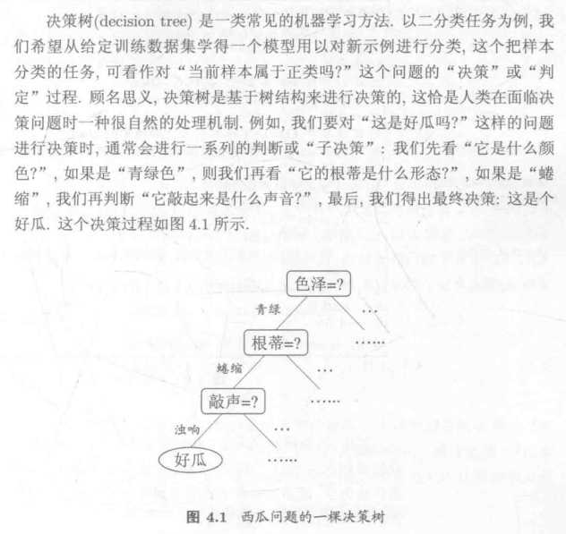
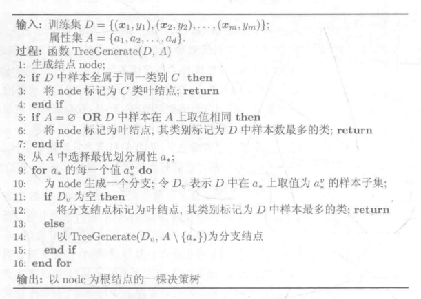
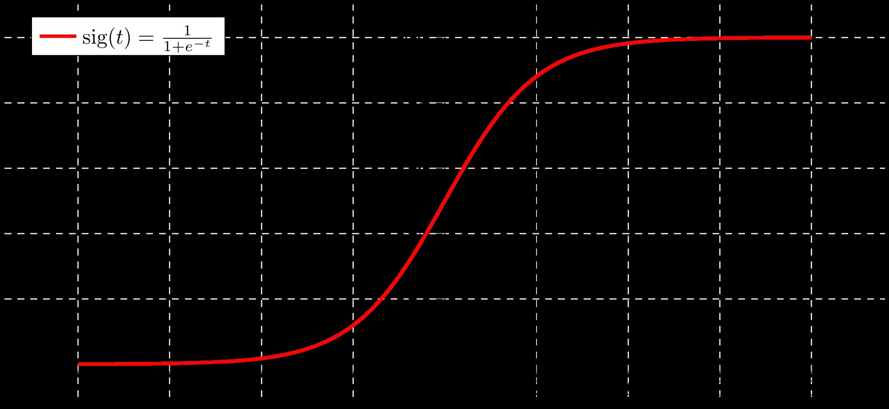

# 目录

- [1.K-means算法逻辑？](#user-content-1.k-means算法逻辑？)
- [2.K近邻算法逻辑？](#user-content-2.k近邻算法逻辑？)
- [3.什么是NeRF（Neural-Radiance-Fields）技术？](#user-content-3.什么是NeRF（Neural-Radiance-Fields）技术？)
- [4.介绍一下自回归模型的概念](#user-content-4.介绍一下自回归模型的概念)
- [5.什么是K最近邻算法？](#user-content-5.什么是K最近邻算法？)
- [6.什么是朴素贝叶斯？](#user-content-6.什么是朴素贝叶斯？)
- [7.什么是决策树？](#user-content-7.什么是决策树？)
- [8.什么是支持向量机？](#user-content-8.什么是支持向量机？)
- [9.什么是逻辑回归？](#user-content-9.什么是逻辑回归？)
- [10.介绍一下机器学习中的Nucleus采样原理](#user-content-10.介绍一下机器学习中的Nucleus采样原理)
- [11.介绍一下机器学习中不同聚类算法的性能特点](#user-content-11.介绍一下机器学习中不同聚类算法的性能特点)
- [12.介绍一下机器学习中的SVD（Singular Value Decomposition）技术](#user-content-12.介绍一下机器学习中的SVD（Singular-Value-Decomposition）技术)
- [13.介绍一下机器学习中的聚类算法原理](#user-content-13.介绍一下机器学习中的聚类算法原理)
- [14.介绍一下颜色量化算法的原理](#user-content-14.介绍一下颜色量化算法的原理)
- [15.介绍一下K-Means++算法的原理](#user-content-15.介绍一下K-Means++算法的原理)
- [16.优化聚类算法效果和性能的方法有哪些？](#user-content-16.优化聚类算法效果和性能的方法有哪些？)


<h2 id="1.k-means算法逻辑？">1.K-means算法逻辑？</h2>

K-means算法是<font color=DeepSkyBlue>一个实用的无监督聚类算法，其聚类逻辑依托欧式距离，当两个目标的距离越近，相似度越大</font>。对于给定的样本集，按照样本之间的距离大小，将样本集划分为 $K$ 个簇。让簇内的点尽量紧密的连在一起，而让簇间的距离尽量的大。

**K-means的主要算法步骤**：

1. 选择初始化的 $k$ 个样本作为初始聚类中心 $D = \{ D_{1}, D_{2}, D_{3}, ..., D_{k} \}$ 。
2. 针对数据集中每个样本 $x_{i}$ ，计算它到 $k$ 个聚类中心的距离并将其分到距离最小的聚类中心所对应的类中.
3. 针对每个类别 $D_{j}$ ，重新计算它的聚类中心 $D_{j} = \frac{1}{|c_{j}|}\sum_{x\in c_{j}}x$ 。（即属于该类的所有样本的质心）；
4. 重复上面2和3两步的操作，直到达到设定的中止条件（迭代次数、最小误差变化等）。

**K-Means的主要优点**：

1. 原理简单，实现容易，收敛速度快。
2. 聚类效果较优。
3. 算法的可解释度比较强。
4. 主要需要调参的参数仅仅是簇数k。

**K-Means的主要缺点**：

1. K值需要人为设定，不好把握。
2. 对初始的簇中心敏感，不同选取方式会得到不同结果。
3. 对于不是凸的数据集比较难收敛。
4. 如果各隐含类别的数据不平衡，比如各隐含类别的数据量严重失衡，或者各隐含类别的方差不同，则聚类效果不佳。
5. 迭代结果只是局部最优。
6. 对噪音和异常点比较的敏感。

<h2 id="2.k近邻算法逻辑？">2.K近邻算法逻辑？</h2>

K近邻（K-NN）算法<font color=DeepSkyBlue>计算不同数据特征值之间的距离进行分类</font>。存在一个样本数据集合，也称作训练数据集，并且数据集中每个数据都存在标签，即我们知道每一个数据与所属分类的映射关系。接着输入没有标签的新数据后，在训练数据集中找到与该新数据最邻近的K个数据，然后提取这K个数据中占多数的标签作为新数据的标签<font color=DeepSkyBlue>（少数服从多数逻辑）</font>。

**K近邻算法的主要步骤**：

1. 计算新数据与各个训练数据之间的距离。
2. 按照距离的递增关系进行排序。
3. 选取距离最小的K个点。
4. 确定前K个点所在类别的出现频率。
5. 返回前K个点中出现频率最高的类别作为新数据的预测分类。


K近邻算法的结果很大程度取决于K的选择。其距离计算一般使用欧氏距离或曼哈顿距离等经典距离度量。

**K近邻算法的主要优点**：

1. 理论成熟，思想简单，既可以用来做分类又可以做回归。
2. 可以用于非线性分类。
3. 对数据没有假设，准确度高，对异常点不敏感。
4. 比较适用于数据量比较大的场景，而那些数据量比较小的场景采用K近邻算法算法比较容易产生误分类情况。

**K近邻算法的主要缺点**：

1. 计算复杂性高；空间复杂性高。
2. 样本不平衡的时候，对稀有类别的预测准确率低。
3. 是慵懒散学习方法，基本上不学习，导致预测时速度比起逻辑回归之类的算法慢。
4. 可解释性不强。


<h2 id="3.什么是NeRF（Neural-Radiance-Fields）技术？">3.什么是NeRF（Neural-Radiance-Fields）技术？</h2>

**NeRF（Neural Radiance Fields）技术主要用于生成高质量的三维场景渲染**。NeRF技术通过使用神经网络来表示场景中的颜色和密度分布，从而能够生成从不同视角看到的高质量图像，在三维重建和新视图合成领域取得了显著的进展。以下是对 NeRF 技术的详细讲解：

### 基本概念

1. **辐射场（Radiance Field）**：
   - NeRF 表示场景的辐射场，这是一种三维空间中每个点的颜色和密度的函数。具体来说，辐射场定义了从某个点在某个方向上发出的光的颜色和强度。

2. **核心模型**：
   - NeRF 使用一个多层感知器（MLP）作为神经网络。这个网络接受三维空间中的位置（x, y, z）和视角方向（θ, φ）作为输入，并输出该位置的颜色（RGB）和密度（σ）。

3. **体积渲染**：
   - 通过体积渲染算法，从神经网络中采样不同位置的颜色和密度，合成最终的图像。体积渲染过程模拟了光线在三维场景中的传输和散射。

### 工作原理

NeRF 的工作原理可以分为以下几个步骤：

1. **输入编码**：
   - NeRF 使用傅里叶特征编码（Fourier Feature Encoding）来对输入的三维坐标和视角方向进行高频特征变换，从而提高模型的表示能力。这种编码将低频的空间信息转换为高频特征，使得神经网络可以更好地学习到细节。

2. **核心模型训练**：
   - 神经网络接受编码后的三维坐标和视角方向，输出该位置的颜色和密度。通过对比生成图像与实际图像之间的误差（如均方误差损失），调整神经网络的参数。
   - 训练数据通常是从多个视角拍摄的二维图像，这些图像包含了场景的不同视角信息。

3. **体积渲染**：
   - 对每条光线，从神经网络中采样多个点的颜色和密度，并通过体积渲染公式将这些值组合起来，生成光线上的像素颜色。
   - 具体的体积渲染公式计算光线在经过场景中的每个点时的颜色贡献，并将这些贡献累加起来，形成最终的像素值。

### 应用场景

1. **新视图合成**：
   - NeRF 可以从给定的几张二维图像生成新的视图，非常适合用于虚拟现实（VR）和增强现实（AR）应用。

2. **3D 重建**：
   - NeRF 可以用于从二维图像重建高质量的三维模型，应用于影视、游戏和数字文化遗产保护等领域。

3. **计算机图形学**：
   - 由于其生成高质量图像的能力，NeRF 在计算机图形学中也具有重要的应用价值。

### 优缺点

#### 优点
- **高质量渲染**：NeRF 可以生成非常逼真的图像，捕捉到细节和复杂的光照效果。
- **少量数据需求**：与传统的3D重建方法相比，NeRF只需要较少的输入图像即可生成高质量的三维场景。

#### 缺点
- **计算成本高**：训练NeRF模型需要大量的计算资源和时间，尤其是对于高分辨率的场景。
- **实时性问题**：目前，NeRF的实时渲染仍然是一个挑战，需要更多的优化和硬件支持。


<h2 id="4.介绍一下自回归模型的概念">4.介绍一下自回归模型的概念</h2>

**自回归模型思想很早就被提出，在AIGC时代因为应用于ChatGPT系列中而再次成为机器学习领域的“明星”**。接下来我们就详细介绍一下自回归模型。

自回归模型（Autoregressive Model, AR）是时间序列分析中的一种经典模型，用于表示当前值是过去若干值的线性组合。自回归模型假设时间序列的数据点可以用其自身的历史数据来解释，即通过过去的观测值预测当前和未来的观测值。以下是详细讲解自回归模型的原理、公式、假设、应用以及示例。

### 1. 原理

自回归模型通过回归分析的方法，利用时间序列的过去值对当前值进行预测。其核心思想是，时间序列的当前值与其前几个时间点的值之间存在某种线性关系。

### 2. 公式

自回归模型的数学表达式为：

$$ y_t = c + \phi_1 y_{t-1} + \phi_2 y_{t-2} + \cdots + \phi_p y_{t-p} + \epsilon_t $$

其中：
-  $y_t$ 是时间 $t$ 的观测值。
-  $c$ 是常数项。
-  $\phi_1, \phi_2, \ldots, \phi_p$ 是模型的系数。
-  $p$ 是模型的阶数，表示回顾的时间步数。
-  $\epsilon_t$ 是误差项，假设其为白噪声（即期望为零、方差为 $\sigma^2$ 的独立同分布随机变量）。

### 3. 模型的假设

- **线性关系**：时间序列的当前值与过去 $p$ 个时间点的值之间存在线性关系。
- **平稳性**：时间序列应是平稳的，即其统计特性（如均值和方差）随时间不变。
- **白噪声误差**：误差项 $\epsilon_t$ 是白噪声。

### 4. 应用

自回归模型广泛应用于经济学、金融学、气象学、工程学等领域，用于预测和分析时间序列数据。例如：
- 经济数据中的 GDP 增长率、失业率等的预测。
- 金融市场中的股票价格、利率等的预测。
- 气象学中的气温、降雨量等的预测。

### 5. 自回归模型的阶数选择

选择自回归模型的阶数 $p$ 是一个重要步骤。常用的方法包括：
- **AIC（Akaike 信息准则）**：通过最小化 AIC 选择最佳阶数。
- **BIC（贝叶斯信息准则）**：通过最小化 BIC 选择最佳阶数。

### 6. 示例

下面是一个使用 Python 及 `statsmodels` 库来拟合和预测自回归模型的示例：

```python
import numpy as np
import matplotlib.pyplot as plt
from statsmodels.tsa.ar_model import AutoReg

# 生成一个模拟的自回归时间序列数据
np.random.seed(42)
n = 100
phi = [0.5, -0.3, 0.2]  # AR(3) 模型的系数
y = np.zeros(n)
y[0], y[1], y[2] = np.random.normal(size=3)  # 初始化前3个值
for t in range(3, n):
    y[t] = phi[0] * y[t-1] + phi[1] * y[t-2] + phi[2] * y[t-3] + np.random.normal()

# 拟合 AR 模型
model = AutoReg(y, lags=3)
model_fit = model.fit()

# 模型系数
print("模型系数:", model_fit.params)

# 预测未来10个时间点的值
y_forecast = model_fit.predict(start=n, end=n+9)
print("预测值:", y_forecast)

# 绘制原始数据与预测值
plt.figure(figsize=(10, 6))
plt.plot(y, label='原始数据')
plt.plot(range(n, n+10), y_forecast, label='预测值', color='red')
plt.legend()
plt.show()
```

### 解释

1. **数据生成**：
   - 使用一个已知的 AR(3) 模型生成模拟数据，其中系数为 $[0.5, -0.3, 0.2]$。

2. **拟合 AR 模型**：
   - 使用 `AutoReg` 类拟合 AR 模型，并指定滞后阶数为 3。

3. **输出模型系数**：
   - 使用 `model_fit.params` 获取拟合模型的系数。

4. **预测未来值**：
   - 使用 `model_fit.predict` 方法预测未来 10 个时间点的值。

5. **绘制图形**：
   - 使用 `matplotlib` 库绘制原始数据和预测值的图形，以可视化效果展示预测结果。


<h2 id="5.什么是K最近邻算法？">5.什么是K最近邻算法？（K-nearest neighbor， KNN）</h2>

### （1）K最近邻算法介绍（K-nearest neighbor， KNN）
KNN算法是一种用于分类任务的非参数统计方法。
- 核心思想：当预测一个新样本的标签时，**根据它距离最近的 $k$ 个样本点是什么标签来判断该新样本属于哪个标签**（多数投票）。
- 输入输出：输入为特征空间中的一个点，输出为该点所对应的类别标签。

### （2）KNN的算法流程
 假设一个样本数据集 ${(x_i, y_i)}$ ,  $x_i$ 是一个多维向量，$y_i$ 是该向量的标签，对于未知向量 $x_j$，预测其对应的标签 $y_j$
 - 计算 $x_j$ 到每一个 $x_i$ 的距离；
 - 对距离进行排序；
 - 选择最接近 $x_j$ 的 $k$ 个样本（也可通过kd树搜索）；
 - 根据多数投票原则，预测 $x_j$ 的标签。
 
### （3）核心参数
#### 距离度量
两个向量 $x_i= (x_i^1,x_i^2,x_i^3...x_i^n)$，$x_j=(x_j^1,x_j^2,x_j^3...x_j^n)$ 的距离 → 两个向量的相似程度，其公式为：
$$L_p(x_i,x_j)=(\sum_{j=1}^{n}{|x_{i}^{l}-x_{j}^{l}|^p})^{\frac{1}{p}}$$
当p=1，为曼哈顿距离；
当p=2，为欧氏距离；
当p= $\infty$ ，为向量分量的最大距离差。

#### $k$值选取
- 过小的 $k$ 值分类器：未知样本对邻近的样本十分敏感，易受到噪声干扰；
- 过大的 $k$ 值分类器：未知样本易被预测为占比较大的标签类型。

**常用的方法**：  
（1）从 $k=1$ 开始，使用交叉验证法从样本数据集中分出检验集估计分类器的误差率。  
（2）重复该过程，每次 $k$ 增值1，允许增加一个近邻。  
（3）选取产生最小误差率的 $k$ 。
（4）一般 $k$ 值不超过20，上限为 $n$ 的开方。

####  分类决策规则
- **KNN的分类决策规则**：对未知样本的最邻近 $k$ 个样本进行标签统计，采用多数投票进行分类预测。

### （4）Python实现
使用**sklearn.neighbors.KNeighborsClassifier**即可创建KNN分类器，参数包括：
- **n_neighbors**：设定k值，默认为5；
- **weights**：设定k个邻近样本对型统计的权重，默认为平均权重；
- **algorithm**：设定搜索邻近样本的方法，包括ball tree， kd tree和 brute。

### （5）算法优劣
- **优点**：简单易用，无需训练；对异常值不敏感。
- **缺点**：惰性算法，计算量大。

### （6）算法应用场景
- 人脸识别，文字识别，医学图像处理等。 （毋雪雁,王水花,张煜东.K最近邻算法理论与应用综述[J].计算机工程与应用,2017,53(21):1-7.）

### （7）KNN用于回归问题
- 对于k个邻近样本的标签，采用平均值作为未知样本标签的预测值。


<h2 id="6.什么是朴素贝叶斯？">6.什么是朴素贝叶斯？</h2>

### （1） 贝叶斯定理
**先验概率** - Prior probability
- **定义**：在观测数据前，表达不确定量的不确定性的概率分布，记为 $P(A)$ 。
- **释义**：根据已知的经验和分析得到的概率，即由因求果。

**后验概率** - Posterior probability
- **定义**： 考虑和给出相关证据或数据后所得到的条件概率，记为 $P(B|A)$ 。
- **释义**：依据得到的结果所计算出的事件发生的概率，即由果溯因。

**联合概率** - Joint probability
- **定义**：两个事件共同发生的概率，记为 $P(AB)$ 。

**条件概率** - Conditional probability
- **定义**：事件 $A$ 在事件 $B$ 发生的条件下发生的概率。
- **公式**：
$$P(A|B)=\frac{P(AB)}{P(B)}$$

**全概率公式** - Law of total probability
- **定义**：将一复杂事件$A$的概率求解问题转化为不同独立条件（ $P({B_1}\bigcap{B_2}...)=0$ & $P({B_1}\bigcup{B_2}...)=1$ ）下发生的事件概率的求和问题。
- **公式**：
$$P(A)=\sum_{i=1}^n{{P(A|B_i)}\times{P(B_i)}} $$

**贝叶斯定理** - Bayes' theorem
- **定义**：描述条件概率和后验概率的乘法关系。
- **公式**:
$$P(B_j|A)=\frac{{P(A|B_j)}\times{P(B_j)}}{P(A)} $$
$$P(B_j|A)=\frac{{P(A|B_j)}\times{P(B_j)}}{\sum_{i=1}^n{{P(A|B_i)}\times{P(B_i)}}} （独立事件）$$

**后验概率与条件概率的联系**
- 后验概率是一种条件概率，用于描述在给定观测结果的情况下，因变量取某个值的概率。

### （2）案例释义（以信号发射为例）
**案例**：有一个信号的发射端和接收端。发射端只发射A、B两种信号，其中发射信号A的概率为0.6，发射信号B的概率为0.4。当发射信号A时，接收端接收到信号A的概率是0.9，接收到信号B的概率是0.1。当发射信号B时，接收端接收到信号B的概率为0.8，接收到信号A的概率为0.2。求当接收到信号A时，发射信号为A的概率。

**概率**
- **先验概率**：
- $P(sendA)$ = 0.6， $P(sendB)$ = 0.4
- **条件概率**：
- $P(receiveA|sendA)$ = 0.9， $P(receiveB|sendB)$ = 0.8， $P(receiveA|sendB)$ = 0.2
- **后验概率**：
 $P(sendA|receiveA)$ = ? 

### （3）朴素贝叶斯 - Naive bayes
**基本假设**
 - 给定数据样本的每个特征相互独立。

**简要推导**
给定训练数据集，其中每个样本 $x$ 都包含 $n$ 维特征，即 $x=(x_1, x_2 ..., x_n)$ ，标签集合 有$k$ 种标签，即 $y=(y_1, y_2 ..., y_k)$ 。对于新样本 $x$ ，判断其标签 $y$ ，根据贝叶斯定理，可以到 $x$ 属于 $y_k$ 标签的概率为：
$$P(y_k|x)=\frac{{P(x|y_k)}\times{P(y_k)}}{\sum_{i=1}^k{{P(x|y_i)}\times{P(y_i)}}}$$
- 后验概率最大的标签则为对新样本 $x$ 的预测标签。

由于朴素贝叶斯的基本假设，所以条件概率 $P(x|y_k)$ 可以转化为：
$$P(x|y_k)=P(x_1,x_2 ..., x_n|y_k)=\prod_{j=1}^n{P(x_j|y_k)}$$
整合上式，朴素贝叶斯算法可以表示为：
$$f(x)={\mathop{argmax}\limits_{y_1, y_2 ..., y_k}}{\frac{\prod_{j=1}^n{P(x_j|y_k)}{P(y_k)}}{\sum_{i=1}^k{{\prod_{j=1}^n{P(x_j|y_i)}}\times{P(y_i)}}}}$$
 由于对于所有的标签，分母一样，因此忽略分母部分，将朴素贝叶斯化简为：
 $$f(x)={\mathop{argmax}\limits_{y_1, y_2 ..., y_k}}{\prod_{j=1}^n{P(x_j|y_k)}{P(y_k)}}$$
 
### （4）细分模型（以文本分类为例）
**高斯模型**
- **连续型变量特征**
- **条件概率**
$$P(x_i|y_k) = \frac{1}{\sqrt{2\pi\sigma_{y_k,i}^2}}\times{e^{-\frac{(x_i-u_{y_k,i})^2}{2\sigma_{y_k,i}^2}}}$$

<smaller> $u_{y_k,i}$ - $y_k$ 类中，第i维特征的均值；
 $\sigma_{y_k,i}^2$ - $y_k$ 类中，第i维特征的方差。

在文本分类场景下，样本 $x$ 就是文档，特征 $x_i$ 就是单词，标签就 $y$ 就是文档类别，对于新样本 $x$ 判断其类别。

**多项式模型**
- 以**单词的频次**参与统计计算。
- **先验概率**：
$$P(y_k)=\frac{y_k类文档的所有单词}{所有文档的所有单词}$$
- **条件概率**
$$P(x_i|y_k)=\frac{单词x_i在y_k类文档中出现的次数之和+1}{y_k类文档的所有单词+所有文档的单词种类}$$

**伯努利模型**
- 以**是否出现**参与统计计算。
- **先验概率**：
$$P(y_k)=\frac{y_k类文档的个数}{所有文档的个数}$$
- **条件概率**
$$P(x_i|y_k)=\frac{y_k类文档中包含单词x_i的文档个数+1}{y_k类文档的个数+2}$$

### （5）拉普拉斯平滑

由于 $P(y_k)\times{\prod_{j=1}^n{P(x_j|y_k)}{P(y_k)}}$ 为多项连乘，其中一项为0，则整个公式为0(**零概率事件**)。因此，假定训练样本很大时，每个特征 $x_i$ 和样本 $x$ 的计数加1造成的估计概率变化可以忽略不计，但可以方便有效的避免零概率问题。

### （6）Python代码
	sklearn.naive_bayes.MultinomialNB()


### （7）算法优劣

**优点**
- 分类稳定，可以处理多分类任务；
-  对确实数据不敏感，且可以进行增量训练。

**缺点**
- 需要知道事件发生的先验概率。


<h2 id="7.什么是决策树？">7.什么是决策树？</h2>

### （1）决策树（Decision Tree）
决策树是一种树形结构模型，由一个根节点，若干个内部节点和叶节点组成。其中，根节点和内部结点表示一个特征或属性，叶结点表示一个类别。西瓜分类的一颗决策树如下所示：

>

### （2）基本流程
 决策树一个由根到叶的递归过程，通过根节点和内部节点划分属性，直到只剩单一类型/无可用属性后停止。其伪代码如下所示：
>

**具体停止条件**
 - 当前节点包含的样本属于同一类别，视为叶节点，无需划分；
 - 无可用属性进行后续划分，视为同一类别（叶节点），无需划分；
 - 当点节点不包含样本，删除该节点，回退至父节点重新划分。
 
### （3）算法分类
- **ID3**： 在决策树的内部节点和根节点上，使用信息增益方法作为划分属性的选择标准，信息增益越大越好。
- **C4.5**：使用信息增益率来选择节点属性，增益率越高越好。
-  **CART**：使用基尼指数选择划分属性，基尼指数越小越好。

### （4）划分属性的选择标准
#### 信息增益
假定离散属性 $a$ 有 $V$ 个可能的取值 ${a^1, a^2, ..., a^n}$ ，若使用 $a$ 来对样本集 $D$ 进行划分，则会产生 $V$ 个内部节点，其中第 $v$ 个内部节点包含了 $D$ 中所有在属性 $a$ 上取值为 ${a^n}$ 的样本，记为 $D_v$ ，根据式（1）计算出 $D_v$ 的信息熵，并给予该节点权重 $\frac{|D^v|}{|D|}$ 。再考虑到其他内部节点，计算出属性 $a$ 对样本集进行划分所获得的“信息增益”，如式（2）所示。
$$Ent(D) = - \sum_1^n{p_klog_2p_k}$$
 - <smaller> $Ent(D)$ - 信息熵；
 - $n$ - 类别数目；
 - $p_k$ - 样本集中第$k$类样本所占的比例
 $$Gain(D,a) = Ent(D) - \sum_1^V\frac{|D^v|}{|D|}Ent(D^v)$$
 - $Gain(D, a)$ - 信息增益。
 - 
#### 信息增益率
$$Gain_ratio(D) =\frac{Gain(D,a)}{-\sum_1^V\frac{|D^v|}{|D|}log_2\frac{|D^v|}{|D|}}$$

#### 基尼指数
$$Gini(D) = - \sum_{k_1=1}^n\sum_{k_2!=k_1}{p_{k_1}}{p_{k_2}}$$
$$Gini_index(D,a) =  \sum_{1}^V\frac{|D^v|}{|D|}Gini(D^v)$$

### （5）Python代码
	from sklearn import tree #导入需要的模块
	clf = tree.DecisionTreeClassifier() #实例化模型对象
	class sklearn.tree.DecisionTreeClassifier (criterion=’gini’/'entropy', splitter=’best’, max_depth=None,min_samples_split=2, min_samples_leaf=1, min_weight_fraction_leaf=0.0, max_features=None,random_state=None, max_leaf_nodes=None, min_impurity_decrease=0.0, min_impurity_split=None,class_weight=None, presort=False)

### （6）算法优劣
**优点**

- 易于理解和实现；
-   数据准备简单；

**缺点**
- 类别过多时，分类困难且时间较长。


<h2 id="8.什么是支持向量机？">8.什么是支持向量机？</h2>

### （1）支持向量机（Support vector machine）  
支持向量机(Support Vector Machine, SVM)是一种有监督的机器学习算法,主要用于分类和回归分析。它的基本思想是在高维空间中构建一个超平面，将不同类别的数据点分开,使得两类数据点到超平面的距离最大化。  

- **超平面**  
	 超平面是指 $n$ 维线性空间中维度为 $n-1$ 的子空间。该子空间可以把线性空间分割成不相交的两个部分，例如：二维空间的线和三维空间的面。其描述方程为 $w^Tx+b=0$ ，记为超平面 $(w,b)$ ；而由于方程的乘法性质，对于任意的 $k$ 值， $(w,b)$ 和 $(kw,kb)$ 为同一超平面，因此下述用$(w,b)$表示。其中， $w=(w_1,w_2,...,w_{n})$ 为超平面的法向量； $b$ 为位移项，决定超平面与原点的距离。    
  
- **函数间隔与支持向量**  
	 函数间隔 $y_i\times(wx_i+b)$ 表示样本点距离超平面的距离，其值越大，距离越远。而支持向量则表示满足函数 $y_i\times(wx_i+b)=k$ 的样本点。  

- **工作原理**   
  **线性可分情况（硬间隔SVM）**：对于线性可分的数据,SVM试图找到一个能将两类数据完全分开的超平面,并使两类数据点到超平面的距离最大化(即最大间隔)。这个最大间隔超平面由最靠近它的几个支持向量决定。 
  **线性不可分情况（软间隔SVM）**：对于线性不可分的数据,SVM引入了软间隔,允许一些数据点位于间隔区域内或错分,从而使分类更加鲁棒。通过引入松弛变量和惩罚参数,SVM在最大化间隔和最小化误分类之间寻求平衡。 
  **非线性情况**：对于非线性数据,SVM使用核技巧将数据映射到高维特征空间,使得在高维空间中线性可分,从而实现非线性分类。常用的核函数包括线性核、多项式核、高斯核等。  

### （2）模型推导   
- **线性可分**   
  （a）**函数间隔和支持向量**  
	 已知超平面 $(w,b)$ ，对于任一样本 $(x_i,y_i)$ $\in$ 样本集 $D$ ，都满足函数间隔 $y_i\times(wx_i+b)>0$ 。若定义最小函数间隔 $\gamma$ 为 $\underset {i} {min} {(y_i\times (wx_i+b))}$ ，则所有正样本一定满足 ${y_i\times (wx_i+b )} \geq \gamma >0$ 。为了保证分类的鲁棒性，一定存在合适的超平面 $(w,b)$ ，使得任一正样本 $(x_i,y_i)\in{D}$ 都满足函数间隔 ${y_i\times (wx_i+b )} \geq 1$ 。其中，函数间隔 ${y_i\times (wx_i+b )} = 1$ 对应的样本点，称为支持向量。若 $y_i=+1$ ，则 $x_i$ 落在超平面 $H_1:wx+b=1$ 上；若 $y_i=-1$ ，则 $x_i$ 落在超平面 $H_1:wx+b=-1$ 上。如图所示，超平面 $H_1$ 和 $H_2$ 均与超平面 $H_0$ 平行，且等距分布在两侧。其中，支持向量（超平面 $H_1$ ）到超平面 $H_0$ 的距离 $\frac{1}{\Vert w \Vert_2}$ 为最短间隔，而超平面 $H_1$ 到的超平面 $H_2$ 的距离 $\frac{2}{\Vert w \Vert_2}$ 为几何间隔。
  
  
    
  （b）**硬间隔最大化**   
	 支持向量机通过最大化最短间隔和集合间隔，完成对训练样本的最佳线性分类，即**硬间隔最大化**。公式表达为 $\underset {(w,b)} {max}{\frac {1}{{\Vert w \Vert_2}}},s.t. {{y_i\times (wx_i+b )} \geq 1}$ 。而最大化 $\frac{1}{\Vert w \Vert_2}$ 和最小化 $\frac{1}{2}{\Vert w \Vert_2}$ 等价，因此硬间隔最大化可以重写成一个凸二次规划函数，即 $\underset {(w,b)} {min}{\frac {1}{2}{{\Vert w \Vert_2}}},s.t. {{y_i\times (wx_i+b )} \geq 1}$ 。若样本集线性可分，则该凸二次规划函数的解一定存在且唯一。
  
  （c）**对偶求解**   
	  引入拉格朗日算子，即可写出凸二次规划函数的拉格朗日函数，如下：   
  $$L(w,b,\alpha) = \frac {1}{2}{\Vert w \Vert_2}- \sum_{i=1}^{n}{\alpha_i y_i(wx_i+b)+\sum_{i=1}^{n}\alpha_i}$$
  其中，$\alpha=(\alpha_1,\alpha_2,...\alpha_n)$ 是拉格朗日乘子。 
  根据朗格朗日的对偶性，将求解问题转化为一个极大极小问题 $\underset {\alpha} {max} \underset {(w,b)} {min} L(w,b,\alpha)$ 。解法如下： 
  Step 1： 将拉格朗日函数其 $L(w,b,\alpha)$ 分别对 $w,b$ 求偏导可得： 
$$\frac {\partial L}{\partial w} = w - \sum_{i=1}^{n}\alpha_iy_ix_i=0$$
$$\frac {\partial L}{\partial b} = - \sum_{i=1}^{n}\alpha_ix_i=0$$
  Step 2： 将拉格朗日函数化简为：  
$$L(w,b,\alpha) = -\frac{1}{2} \sum_{i=1}^{n}\sum_{j=1}^{n}{\alpha_i\alpha_jy_iy_j(x_ix_j)}+\sum_{i=1}^{n}\alpha_i$$
  Step 3: 将极大极小问题化简为：  
$$\underset {\alpha} {min} \frac {1}{2} \sum_{i=1}^{n}\sum_{j=1}^{n}{\alpha_i\alpha_jy_iy_j(x_ix_j)} -\sum_{i=1}^{n}\alpha_i,$$
$$s.t. \sum_{i=1}^{n}\alpha_iy_i=0$$
  Step 4：求解出最佳的超平面 $(w,b)$：  
$$w=\sum_{i=1}^{n}\alpha_iy_ix_i$$
$$b=y_i-x_j\sum_{i=1}^{n}\alpha_iy_ix_i$$
$$s.t.  y_j(wx_j+b)=1$$

- **线性不可分**    
	线性可分问题的支持向量机对线性不可分是不适用的，因此本节采用软间隔将支持向量机推广到线性不可分的情况。  
（a）**软间隔最大化**  
	**假设条件**：样本集 $D$ 不是线性可分的，但剔除特异点之后，剩下的大部分样本 $(x_i,y_i)$ 是线性可分的。  
	线性不可分意味着某些样本点 $(x_i,y_i)$ 不能满足函数间隔 ${y_i\times (wx_i+b )} \geq 1$ 的约束条件。因此，引入一个松弛变量 $\xi_i \geq0$ ，使得函数间隔更加宽松 ${y_i\times (wx_i+b )} \geq 1-\xi_i$ 。同时，对每个松弛变量 $\xi_i$ ，引入一个代价变量 $\xi_i$ 和惩罚参数 $C$ 。软间隔最大化的凸二次规划函数则可以转化为：  
$${\frac {1}{2}{{\Vert w \Vert_2}}} + C \sum_{i=1}^{n}{\xi_i}$$
$$s.t. 	{y_i(wx_i+b) \geq 1-\xi_i},({ \xi_i\geq 0})$$
（2）**对偶求解**  
	引入拉格朗日乘子 $\alpha,\beta$ ，写出凸二次规划函数的对偶问题，如下：  
$$\underset {\alpha, \beta}{max}{- \frac{1}{2} \sum_{i=1}^{n}\sum_{j=1}^{n}\alpha_i \alpha_j y_i y_j (x_ix_j)}+\sum_{i=1}^{n}\alpha_i$$
$$s.t. \sum_{i=1}^{n}\alpha_iy_i=0$$
$$C-\alpha_i-\beta_i=0$$
$$\alpha_i \geq 0, \beta_i \geq 0$$
如果 $0 < \alpha_i < C$ ，则 $C − \alpha_i = \beta_i > 0$ ，可以求得对应的 $\xi_i=0$ 。因此，该条件下最终求解的最优超平面 $(w,b)$ 同线性可分类似，为
$$w=\sum_{i=1}^{n}\alpha_iy_ix_i$$
$$b=y_j-x_j\sum_{i=1}^{n}\alpha_iy_ix_i$$
$$s.t.  y_j(wx_j+b)=1$$
在线性不可分的情况下，最优超平面 $(w,b)$ 的法向量 $w$ 是唯一的，但是偏置 $b$ 不一定是唯一的。因此，采用多次求解后的均值作为偏置 $b$ 。
对于 $\alpha_i =C$ 来说，满足 $\xi_i >0$ 都是特异点。特异点到所属边界超平面的距离为 $\frac {\xi_i}{\Vert w \Vert_2}$ 。如果 $0<\xi_i<1$ ，则位于超平面 $H_1,H_2$ 和 $H_0$ 之间，仍被分类成功：如果 $\xi_i=1$ ，在超平面 $H_0$ 上，无法分类； $\xi_i>1$ ，则被分类错误。

  
  
- **非线性**
在非线性情况下，SVM通过某种事先选择的非线性映射（核函数）将输入变量映到一个高维特征空间，将其变成在高维空间线性可分，在这个高维空间中构造最优分类超平面。
参考：[支持向量机原理之线性SVM与非线性SVM](https://blog.csdn.net/qq_45823424/article/details/113420320)

### （3）Python代码
`from sklearn.svm import SVC`

参考：[【ML】支持向量机SVM及Python实现（详细）_支持向量机代码（鸢尾花为案例）](https://blog.csdn.net/weixin_66845445/article/details/137054240)

### （4）优缺点

- **优点**：线性/非线性分类，小样本，高维数据。
-  **缺点**： 对核函数和惩罚参数的选择十分敏感。


<h2 id="9.什么是逻辑回归？">9.什么是逻辑回归？</h2>

### （1）核心思想
对样本集$X$中的样本 $x=(x_1,x_2...x_i)$ 的特征进行线性拟合，并采用Sigmoid函数将拟合的预测结果值映射到值域为(0，1)的概率空间。其中，当线性回归的输出值大于0，Sigmoid函数将输出大于0.5的值；当线性回归的输出值等于0，Sigmoid函数将输出等于0.5的值；当线性回归的输出值小于0，Sigmoid函数将输出小于0.5的值。因此，可以将大于等于0.5的情况视为正分类（ $y_1$ ），而小于0.5的情况视为负分类（ $y_0$ ）。

- **Sigmoid函数**
由于线性回归的结果范围为正负无穷，因此通过**对数几率**将线性回归的**预测结果**非线性映射到固定区间(0~1)之间，数学表达式为:
$$S(x)=\frac{1}{1+e^{-x}}$$
>

### （2）逻辑回归

- **数学表达**
$$P(y=1|x,\theta)=\frac{1}{1+e^{-\theta^Tx}}$$
$P(y=1|x,\theta)$ 表示给定样本 $x$ ，其预测标签为正分类的概率。 $\theta$ 表示样本特征 $x_i$ 的权重参数。这个表达式的核心思想可以通过2步来分解和理解：**第一步：回归假设**： $z = h_\theta(x)=\theta^Tx$ ；**第二步：Sigmoid函数**： $y =g(z)=\frac{1}{1+e^{-z}}$ 。当 $\theta^Tx≥0, h_\theta(x)≥0,g(z)≥0.5$ 为正分类，反之 $g(z)<0.5$ 为负分类，因此逻辑回归算法的核心就在于求解权重 $\theta$ 和回归假设的函数，即确定决策边界。

- **决策边界的定义**
逻辑回归算法通常不拟合样本分布，而且通过权重 $\theta$ 和回归函数确定决策边界，将样本划分为2类。其中，决策边界包括线性决策边界和非线性决策边界。
	**线性决策边界**：即第一步**线性回归**： $h_\theta(x)=\theta_0+\theta_1x_1+\theta_2x_2...+\theta_ix_i$ 。

	**非线性决策边界**：即将线性回归拓展成**多项式回归**： $h_\theta(x)=\theta_0+\theta_1x_1+\theta_2x_2^2...+\theta_ix_i^i$ 。

 
- **决策边界的确定**
决策边界通过梯度下降法最小化损失函数得到。
**损失函数**： 损失函数通过衡量训练样本标签与预测标签之间的差异，确定最优的决策边界。其中，损失函数越小，决策边界越好。损失函数包括：**均方误差损失(MSE)**和**对数损失函数**。
均方差误差：
$$MSE=\frac{1}{m}\sum_{x\in{X}}({f(x)-y_{1/2})}$$
对数损失函数：
$$J(\theta)=-\frac{1}{m}[\sum_{x\in{X}}(y_{1/2}\log{h_\theta(x)+(1-y_{1/2})\log(1-h_\theta(x))}]$$
**梯度下降**：梯度下降法通过向函数上当前点对应梯度（或者是近似梯度）的反方向的规定步长距离点进行迭代搜索，找到一个函数的局部极小值。该局部极小值对应的参数 $\theta$ 即为最佳的参数 $\theta$ 。其公式为：
$$J(\theta_1)=\theta_1-\alpha\frac{dJ(\theta_1)}{d\theta_1}$$

### （3）算法正则化
在训练数据不够多，或者模型复杂又过度训练时，模型会陷入过拟合（Overfitting）状态。通过对损失函数添加正则化项，可以约束参数的搜索空间，从而缓解过拟合现象，以下是对对数损失函数添加L2正则化项的公式。其中， $m$ 为样本集 $X$ 的个数； $\lambda$ 为正则化系数， $\lambda$ 值越大， $J(\theta)$ 越大，越不容易发生过拟合现象。
$$J(\theta)=\frac{1}{m}[\sum_{x\in{X}}(y_{1/2}\log{h_\theta(x)+(1-y_{1/2})\log(1-h_\theta(x))}]+\frac{\lambda}{2m}\sum_{j=1}^i{\theta_j^2}$$

### （4）Python代码
参见厦门大学数据实验室
<smaller>[Python实现逻辑回归(Logistic Regression in Python)_厦大数据库实验室博客 (xmu.edu.cn)](https://dblab.xmu.edu.cn/blog/84/)


<h2 id="10.介绍一下机器学习中的Nucleus采样原理">10.介绍一下机器学习中的Nucleus采样原理</h2>

**Nucleus 采样**（Nucleus Sampling），也称为 **Top-p 采样**，是一种用于文本生成模型（如 GPT 系列模型）的采样策略，特别用于生成质量更高、更具多样性的文本。它通过动态调整生成候选集的大小，控制输出的质量和随机性。

### 1. **采样问题背景**

在生成式任务中，如文本生成或对话系统，模型通常会在每个生成步骤从概率分布中选择一个单词。常见的策略有：
- **贪婪搜索**：每一步选择概率最高的单词，容易导致重复和缺乏多样性。
- **随机采样**：完全根据模型输出的概率分布随机选取，可能会导致生成无意义或语法不通的内容。
- **Top-k 采样**：仅从概率分布前 k 个最有可能的词中选择，而忽略剩下的候选词。这增加了一定的随机性，但 k 的值固定，可能忽略了一些罕见但有意义的词。

为了在 **质量** 和 **多样性** 之间取得更好的平衡，**Nucleus 采样** 应运而生。

### 2. **Nucleus 采样原理**

Nucleus 采样并不是简单地选择前 k 个最可能的词，而是根据一个动态的概率阈值 $p$ 来决定候选集的大小。它的具体操作如下：

1. **计算概率分布**：给定模型在当前时间步的输出概率分布。
   
2. **排序并累加概率**：将词按照模型给出的概率从高到低排序，然后从最高概率开始累积这些概率值，直到累积的概率达到设定的阈值 $p$ 。

3. **采样候选集**：生成的候选集是累积概率超过 $p$ 的那一部分词。接下来，从这个候选集中根据概率分布随机采样。

因此，Nucleus 采样是基于累积概率的动态调整策略，它确保候选词集合足够灵活，包含那些对生成质量至关重要的高概率词，同时也保留了低概率但可能有创意的词。

### 3. **与 Top-k 采样的区别**
- **Top-k 采样**：Top-k 采样是从前 k 个最有可能的词中采样，忽略了剩下的词。而无论总概率分布如何，k 是一个固定的整数。它的局限性在于，k 的选择可能过小，限制了生成的多样性，或者过大，导致生成质量下降。
  
- **Nucleus 采样（Top-p 采样）**：Nucleus 采样动态选择候选词的数量，通过一个累积概率阈值 p。随着 p 的变化，候选词集合可以根据上下文自动扩展或收缩，因此比 Top-k 更灵活、更适应不同的生成情境。

### 4. **p 值的影响**
- **较小的 p**：如果设定的 $p$ 很小（接近 0.1 或 0.2），模型将只会从极少数的高概率词中选择，输出将趋于确定，类似贪婪搜索的效果。这会提高文本的连贯性和语法正确性，但可能缺乏多样性和创意。
  
- **较大的 p**：如果设定的 $p$ 较大（如 0.9），候选词集合会更大，包含更多低概率词，增加生成的随机性和多样性。这可能使文本生成更具创意和新颖性，但也可能会增加生成不连贯或无意义内容的风险。

### 5. **Nucleus 采样的优势**
- **灵活性**：Nucleus 采样能够根据不同上下文动态调整候选集的大小，在保证生成质量的同时，增加文本的多样性。
  
- **避免冗余或无意义的选择**：与 Top-k 不同，Nucleus 采样不会固定从 k 个词中采样，它会在保证语义连贯的前提下，选择最有意义的词进行采样。

- **平衡性**：它提供了灵活的平衡机制，既能控制生成的连贯性和语法正确性，又能通过随机性保持生成内容的丰富性。

### 6. **实际应用场景**
Nucleus 采样常用于生成式语言模型中，如 GPT-3、GPT-4 等，它可以生成对话、文本扩展等任务。通过调整 p 值，开发者可以控制模型输出的创造性和连贯性。比如：
- 在**写作辅助**场景中，可以设置较大的 p 值，鼓励模型生成具有创意的内容。
- 在**对话系统**中，较小的 p 值可能更适合，让模型的回答更加精确和连贯。

### 7. **示例代码**

以下是一个使用 PyTorch 的简单示例，展示如何实现 Nucleus 采样。

```python
import torch

def nucleus_sampling(logits, p):
    sorted_logits, sorted_indices = torch.sort(logits, descending=True)
    cumulative_probs = torch.cumsum(torch.softmax(sorted_logits, dim=-1), dim=-1)
    
    # 选出累积概率大于 p 的部分
    cutoff_index = torch.where(cumulative_probs > p)[0][0]
    filtered_logits = sorted_logits[:cutoff_index + 1]
    filtered_indices = sorted_indices[:cutoff_index + 1]
    
    # 在这些候选集中进行采样
    sampled_index = torch.multinomial(torch.softmax(filtered_logits, dim=-1), 1)
    return filtered_indices[sampled_index]

# 假设 logits 是一个表示词的概率的张量，下面的代码会从中进行 Nucleus 采样
logits = torch.tensor([0.1, 0.2, 0.05, 0.4, 0.15, 0.1])
p = 0.85  # 累积概率阈值
selected_word_index = nucleus_sampling(logits, p)
print(selected_word_index)
```


<h2 id="11.介绍一下机器学习中不同聚类算法的性能特点">11.介绍一下机器学习中不同聚类算法的性能特点</h2>

|   算法名称   | 可伸缩性 | 适合的数据类型 | 高维性 | 异常数据抗干扰性 | 聚类形状 | 算法效率 |
| :----------: | :------: | :------------: | :----: | :--------------: | :------: | :------: |
| WAVECLUSTER  |   很高   |     数值型     |  很高  |       较高       | 任意形状 |   很高   |
|     ROCK     |   很高   |     混合型     |  很高  |       很高       | 任意形状 |   一般   |
|    BIRCH     |   较高   |     数值型     |  较低  |       较低       |   球形   |   很高   |
|     CURE     |   较高   |     数值型     |  一般  |       很高       | 任意形状 |   较高   |
| K-PROTOTYPES |   一般   |     混合型     |  较低  |       较低       | 任意形状 |   一般   |
|   DENCLUE    |   较低   |     数值型     |  较高  |       一般       | 任意形状 |   较高   |
|   OPTIGRID   |   一般   |     数值型     |  较高  |       一般       | 任意形状 |   一般   |
|    CLIQUE    |   较高   |     数值型     |  较高  |       较高       | 任意形状 |   较低   |
|    DBSCAN    |   一般   |     数值型     |  较低  |       较高       | 任意形状 |   一般   |
|   CLARANS    |   较低   |     数值型     |  较低  |       较高       |   球形   |   较低   |


<h2 id="12.介绍一下机器学习中的SVD（Singular-Value-Decomposition）技术">12.介绍一下机器学习中的SVD（Singular Value Decomposition）技术</h2>

**SVD（Singular Value Decomposition，奇异值分解）** 是一种常用的矩阵分解技术，在AIGC、传统深度学习以及自动驾驶中都有广泛的应用。SVD 提供了一种将一个矩阵分解成多个分量的方法，有助于数据降维、特征提取、数据去噪、AI模型轻量化等任务。

## **1. SVD 的数学原理**

对于一个任意矩阵 $A$ （大小为 $m \times n$ ），SVD 将其分解为三个矩阵的乘积：

$$
A = U \Sigma V^T
$$

其中：
- $U$ （大小 $m \times m$ ）：左奇异向量矩阵，列向量是 $A A^T$ 的特征向量。
- $\Sigma$ （大小 $m \times n$ ）：对角矩阵，包含 $A$ 的**奇异值**，按降序排列。奇异值是 $A$ 的特征值的平方根。
- $V^T$ （大小 $n \times n$ ）：右奇异向量矩阵，行向量是 $A^T A$ 的特征向量的转置。

**几何解释**：
- SVD 将一个矩阵 $A$ 分解成三个部分：先通过 $V$ 进行旋转，再通过 $\Sigma$ 进行缩放，最后通过 $U$ 进行另一个旋转。
- $\Sigma$ 中的奇异值反映了矩阵 $A$ 在不同方向上的重要性。

## **2. SVD 的应用场景**

### **2.1 数据降维与 PCA**
- **PCA（主成分分析）**：PCA 可以通过 SVD 实现，它将高维数据映射到一个低维空间，同时保留尽可能多的数据方差。
- **方法**：
   1. 对数据矩阵 $A$ 进行中心化处理（减去均值）。
   2. 对中心化矩阵执行 SVD 分解 $A = U \Sigma V^T$ 。
   3. 选取 $\Sigma$ 中最大的 $k$ 个奇异值及对应的 $U$ 和 $V$ 向量，得到降维后的数据。

### **2.2 推荐系统**
- 在推荐系统中，用户-物品评分矩阵通常是稀疏的。SVD 可以分解评分矩阵，提取出用户和物品的隐含特征表示。
- **步骤**：
  1. 对评分矩阵 $R$ 进行 SVD 分解。
  2. 使用分解后的矩阵 $U$ , $\Sigma$ , $V^T$ 预测缺失的评分。

**优势**：SVD 可以有效提取用户和物品的特征，解决稀疏矩阵的问题。

### **2.3 去噪与数据压缩**
- **图像去噪**：SVD 可用于图像的压缩和去噪，通过保留主要的奇异值，丢弃次要的奇异值，实现信息的压缩和噪声的滤除。
- **原理**：
   - 图像通常被表示为矩阵形式，通过 SVD 分解后，保留前 $k$ 个奇异值及对应向量，重构近似图像。
   - 较小的奇异值通常对应噪声。

### **2.4 解决线性系统与伪逆计算**
- SVD 可以用于求解奇异或非方矩阵的线性系统。
- **矩阵伪逆**：
   - 对矩阵 $A$ 的伪逆可以通过 SVD 求解：
     $$
     A^+ = V \Sigma^+ U^T
     $$
     其中 $\Sigma^+ $ 是 $\Sigma$ 的伪逆。

## **3. SVD 的优点与缺点**

### **优点**：
1. **适用性广**：适用于任意形状的矩阵（非方矩阵也适用）。
2. **数值稳定性**：SVD 是一种数值稳定的分解方法。
3. **特征提取**：可用于数据降维、压缩、去噪等任务。
4. **适用于稀疏矩阵**：在推荐系统等任务中表现优秀。

### **缺点**：
1. **计算复杂度高**：SVD 的时间复杂度为 $O(n^3)$ （对于 $n \times n$ 的矩阵），在大规模数据上计算成本较高。
2. **不易解释**：分解后的奇异值和奇异向量可能缺乏直观的物理意义。

## **4. SVD 与其他分解方法的对比**

| 分解方法            | 适用矩阵类型          | 主要应用                   | 是否适用于降维      |
|-------------------|--------------------|-------------------------|-----------------|
| **SVD**          | 任意矩阵            | 降维、去噪、推荐系统       | 是               |
| **PCA**          | 数据协方差矩阵        | 主成分分析、特征提取       | 是（基于 SVD）     |
| **LU 分解**       | 方阵                | 线性方程求解             | 否               |
| **QR 分解**       | 方阵                | 正交化与回归分析         | 否               |
| **Eigen 分解**     | 方阵，且对称正定      | 计算特征值、特征向量       | 否               |


<h2 id="13.介绍一下机器学习中的聚类算法原理">13.介绍一下机器学习中的聚类算法原理</h2>

#### **什么是聚类？**
- 聚类是一种**无监督学习**技术，它的目标是将数据集划分为若干个组（簇，clusters），使得：
  - 同一簇中的数据点彼此之间的相似度尽可能高。
  - 不同簇之间的数据点相似度尽可能低。
- 聚类广泛应用于AIGC、传统深度学习以及自动驾驶等AI核心领域。

### **聚类算法的主要类别**
根据聚类方法的不同，可以将聚类算法分为以下几类：

1. **划分式聚类（Partitioning Clustering）**
2. **层次聚类（Hierarchical Clustering）**
3. **基于密度的聚类（Density-Based Clustering）**
4. **基于网格的聚类（Grid-Based Clustering）**
5. **基于模型的聚类（Model-Based Clustering）**

下面Rocky详细介绍每种类别的代表算法。

### **1. 划分式聚类**

#### **概念**
- 将数据集划分为 $K$ 个簇，直接对簇进行优化。
- 每个簇由一个中心点（质心）表示，数据点根据距离最近的质心分配到对应的簇。

#### **代表算法：K-Means**
- **K-Means** 是最常用的划分式聚类算法。
- **工作原理**：
  1. 随机选择 $K$ 个点作为初始质心。
  2. 将每个数据点分配到最近的质心。
  3. 重新计算每个簇的质心。
  4. 重复步骤 2 和 3，直到质心不再变化或达到最大迭代次数。

- **优点**：
  - 简单易实现。
  - 计算效率高，适合大规模数据。

- **缺点**：
  - 需要预先指定 $K$ 。
  - 对初始值敏感，容易陷入局部最优。
  - 不能处理非球形数据和不同大小的簇。

- **改进算法**：
  - **K-Means++**：改进初始化步骤，使质心的选择更加合理。
  - **MiniBatch K-Means**：用于大规模数据集，采用小批量数据优化。

### **2. 层次聚类**

#### **概念**
- 通过构建层次树状结构（dendrogram）实现聚类。
- 可以分为两种方法：
  1. **凝聚层次聚类（Agglomerative Clustering）**：
     - 自底向上，每个数据点开始是一个单独的簇，逐步合并簇。
  2. **分裂层次聚类（Divisive Clustering）**：
     - 自顶向下，所有数据点开始是一个大簇，逐步分裂成多个簇。

#### **代表算法：凝聚层次聚类**
- **步骤**：
  1. 计算所有数据点之间的距离矩阵。
  2. 找到最近的两个簇，合并它们。
  3. 更新距离矩阵。
  4. 重复步骤 2 和 3，直到所有数据点合并为一个簇或达到停止条件。

- **链接方法（距离度量方式）**：
  - **单链（Single Linkage）**：两簇中最近的数据点之间的距离。
  - **全链（Complete Linkage）**：两簇中最远的数据点之间的距离。
  - **平均链（Average Linkage）**：两簇之间所有点的平均距离。

- **优点**：
  - 不需要预定义簇的数量。
  - 适合小数据集，能够生成数据的层次结构。

- **缺点**：
  - 计算复杂度较高，无法处理大规模数据。
  - 对噪声和异常值敏感。

### **3. 基于密度的聚类**

#### **概念**
- 通过数据点的密度来定义簇，高密度区域的点归为一个簇，低密度区域被认为是噪声或边界点。

#### **代表算法：DBSCAN**
- **工作原理**：
  1. 选择一个点，确定其 $\epsilon$ -邻域内的点。
  2. 如果邻域内的点数大于某个阈值（MinPts），则将这些点归为一个簇。
  3. 对邻域内的点重复步骤 2，直到没有新的点可以加入。
  4. 标记低密度区域的点为噪声点。

- **优点**：
  - 能够自动确定簇的数量。
  - 能处理任意形状的簇。
  - 对噪声点具有鲁棒性。

- **缺点**：
  - 对 $\epsilon$ 和 MinPts 参数敏感。
  - 在高维数据中效果较差。

#### **改进算法**
- **HDBSCAN**：
  - 在 DBSCAN 基础上，自动选择合适的密度阈值，适合更多场景。

### **4. 基于网格的聚类**

#### **概念**
- 将数据空间划分为固定大小的网格单元，每个单元根据数据密度分配到簇。

#### **代表算法：CLIQUE**
- **工作原理**：
  1. 将数据划分为固定网格。
  2. 识别高密度网格单元。
  3. 将相邻的高密度单元合并为一个簇。

- **优点**：
  - 高效，适合大规模数据。
  - 对高维数据有效。

- **缺点**：
  - 依赖网格划分的大小。
  - 可能丢失簇的边界细节。

### **5. 基于模型的聚类**

#### **概念**
- 通过假设数据点服从某种分布（例如高斯分布），用概率模型来拟合数据。

#### **代表算法：GMM（Gaussian Mixture Model）**
- **工作原理**：
  1. 假设数据点服从多个高斯分布。
  2. 使用期望最大化算法（EM）优化每个高斯分布的参数（均值、协方差）。
  3. 根据每个数据点属于各高斯分布的概率分配簇。

- **优点**：
  - 能够生成概率输出，适合软聚类。
  - 能处理不同形状和大小的簇。

- **缺点**：
  - 对初始值敏感。
  - 计算复杂度较高。

### **聚类算法比较**

| **算法**     | **适用场景**                      | **优点**                                  | **缺点**                                |
|--------------|----------------------------------|------------------------------------------|----------------------------------------|
| K-Means      | 球形数据、规模较大的数据集        | 简单高效，易实现                         | 对初始值敏感，无法处理非球形簇          |
| 层次聚类      | 小规模数据、生成层次结构          | 不需要预定义簇数量，结果直观             | 计算复杂度高，敏感于噪声                |
| DBSCAN       | 任意形状的簇，含噪声的数据         | 自动确定簇数，对噪声鲁棒                | 参数敏感，高维数据效果差                |
| GMM          | 不同形状和大小的簇               | 能处理软聚类，适合概率建模              | 对初始值敏感，计算复杂度高              |
| CLIQUE       | 大规模高维数据                   | 高效，适合网格划分的场景                | 依赖网格划分，可能丢失细节              |

### **如何选择聚类算法？**

1. **数据规模**：
   - 小数据集：层次聚类。
   - 大规模数据集：K-Means 或 DBSCAN。

2. **数据分布**：
   - 球形数据：K-Means。
   - 非球形数据：DBSCAN 或 GMM。

3. **是否包含噪声**：
   - 包含噪声：DBSCAN。
   - 不包含噪声：K-Means 或层次聚类。

4. **结果要求**：
   - 精确分组：GMM。
   - 快速近似：K-Means。


<h2 id="14.介绍一下颜色量化算法的原理">14.介绍一下颜色量化算法的原理</h2>

**颜色量化（Color Quantization）** 是一种减少图像中颜色数量的技术，通常用于图像压缩、减少存储空间或简化图像处理。颜色量化的目标是将图像中的颜色从数百万种减少到较少的几种（通常是2到256种），同时尽量保持图像的视觉质量。

其核心思想是通过聚类算法将颜色空间划分为若干个区域，并用每个区域的代表性颜色替换该区域中的所有颜色。常用的算法包括K-Means、K-Means++、中值切割和八叉树量化等。

### 颜色量化的基本原理

颜色量化的核心思想是将图像中的颜色空间划分为若干个区域（称为“聚类”或“颜色桶”），然后用每个区域中的代表性颜色（通常是该区域的平均颜色）替换该区域中的所有颜色。这样，图像中的颜色数量就被减少到与聚类数量相同的数量。

### 颜色量化的步骤

1. **选择颜色空间**：
   - 颜色量化通常在RGB颜色空间中进行，因为RGB是图像处理中最常用的颜色表示方式。每个像素的颜色由三个分量（R、G、B）表示，每个分量的取值范围是0到255。

2. **确定聚类数量（k）**：
   - 用户指定要减少到的颜色数量（k）。例如，如果k=16，图像将被量化为16种颜色。

3. **初始化聚类中心**：
   - 选择k个初始聚类中心。这些中心可以是随机选择的像素颜色，也可以通过其他方法（如K-Means++）选择。

4. **分配像素到聚类**：
   - 对于图像中的每个像素，计算它与每个聚类中心的距离（通常是欧几里得距离），并将其分配到距离最近的聚类中心。

5. **更新聚类中心**：
   - 对于每个聚类，计算该聚类中所有像素的平均颜色，并将该平均颜色作为新的聚类中心。

6. **迭代**：
   - 重复步骤4和步骤5，直到聚类中心不再显著变化（即误差小于某个阈值），或者达到最大迭代次数。

7. **生成量化图像**：
   - 将每个像素的颜色替换为其所属聚类的中心颜色，生成量化后的图像。

### 颜色量化的数学原理

颜色量化可以看作是一个**聚类问题**，其中每个像素的颜色是一个三维向量（R, G, B），聚类的目标是将这些向量划分为k个组，使得组内的颜色尽可能相似，组间的颜色尽可能不同。

#### 1. **距离度量**：
   - 通常使用欧几里得距离来度量两个颜色之间的相似性。对于两个颜色向量 $C_1 = (R_1, G_1, B_1)$ 和 $C_2 = (R_2, G_2, B_2)$ ，它们之间的距离为：

$$
d(C_1, C_2) = \sqrt{(R_1 - R_2)^2 + (G_1 - G_2)^2 + (B_1 - B_2)^2}
$$

#### 2. **聚类中心的更新**：
   - 对于每个聚类，新的聚类中心是该聚类中所有像素颜色的平均值。假设聚类 $C_j$ 包含 $n_j$ 个像素，其颜色向量为 $C_{j1}, C_{j2}, \dots, C_{jn_j}$ ，则新的聚类中心 $\mu_j$ 为：

$$
\mu_j = \frac{1}{n_j} \sum_{i=1}^{n_j} C_{ji}
$$

#### 3. **误差计算**：
   - 误差通常定义为所有像素与其所属聚类中心的距离之和。误差越小，表示聚类效果越好。误差的计算公式为：

$$
E = \sum_{j=1}^{k} \sum_{i=1}^{n_j} d(C_{ji}, \mu_j)
$$
     
   - 当误差不再显著减少时，算法停止。

### 颜色量化的改进方法

1. **K-Means++**：
   - K-Means++是一种改进的K-Means算法，它在选择初始聚类中心时，倾向于选择距离较远的点，从而避免陷入局部最优解。

2. **中值切割（Median Cut）**：
   - 中值切割算法通过递归地将颜色空间划分为更小的区域，直到达到所需的颜色数量。每个区域的颜色取该区域的中值或平均值。

3. **八叉树量化（Octree Quantization）**：
   - 八叉树量化通过构建一个八叉树数据结构来表示颜色空间，并在树中进行颜色合并，从而实现颜色量化。

### 颜色量化的应用

1. **图像压缩**：
   - 颜色量化可以显著减少图像的文件大小，特别是在GIF和PNG等格式中，这些格式支持有限的颜色数量。

2. **图像处理**：
   - 在图像处理中，颜色量化可以简化图像，使其更容易处理和分析。

3. **艺术效果**：
   - 颜色量化可以用于生成具有艺术效果的图像，例如将照片转换为类似海报或卡通的效果。


<h2 id="15.介绍一下K-Means++算法的原理">15.介绍一下K-Means++算法的原理</h2>

**K-Means++** 是 K-Means 聚类算法的一种改进版本，主要用于解决 K-Means 算法对初始聚类中心敏感的问题。K-Means++ 通过一种更智能的方式选择初始聚类中心，从而减少算法陷入局部最优解的可能性，并提高聚类效果。

其核心思想是选择距离较远的点作为初始聚类中心，从而使得初始聚类中心更加分散。

### K-Means++ 的核心思想

K-Means++ 的核心思想是：**初始聚类中心的选择应该尽可能分散**，即选择的初始中心点之间的距离应该尽可能大。这样可以避免初始中心点过于集中，导致聚类结果不理想。

### K-Means++ 的步骤

K-Means++ 的初始化过程分为以下几个步骤：

1. **随机选择第一个聚类中心**：
   - 从数据集中随机选择一个点作为第一个聚类中心。

2. **计算每个点到最近聚类中心的距离**：
   - 对于数据集中的每个点，计算它与当前已选聚类中心的最短距离 $D(x)$ 。

3. **根据距离选择下一个聚类中心**：
   - 按照与已选聚类中心的距离的平方成比例的概率，选择下一个聚类中心。具体来说，每个点被选中的概率为：

$$
P(x) = \frac{D(x)^2}{\sum_{x' \in X} D(x')^2}
$$

   - 这意味着距离已选聚类中心越远的点，被选中的概率越大。

4. **重复步骤2和步骤3**：
   - 重复上述过程，直到选择出 k 个初始聚类中心。

5. **运行标准的 K-Means 算法**：
   - 使用 K-Means++ 选择的初始聚类中心，运行标准的 K-Means 算法进行聚类。

### K-Means++ 的数学原理

K-Means++ 的数学原理主要基于概率选择和距离度量。

#### 1. **距离度量**：
   - 对于数据集中的每个点 $x$ ，计算它与当前已选聚类中心的最短距离 $D(x)$ ：

$$
D(x) = \min_{c \in C} d(x, c)
$$

   - 其中， $C$ 是当前已选的聚类中心集合， $d(x, c)$ 是点 $x$ 与聚类中心 $c$ 之间的距离（通常是欧几里得距离）。

#### 2. **概率选择**：
   - 根据每个点的 $D(x)^2$ 计算其被选为下一个聚类中心的概率：

$$
P(x) = \frac{D(x)^2}{\sum_{x' \in X} D(x')^2}
$$

   - 这意味着距离已选聚类中心越远的点，被选中的概率越大。

#### 3. **选择下一个聚类中心**：
   - 根据计算出的概率分布，随机选择一个点作为下一个聚类中心。

### K-Means++ 的优势

1. **更好的初始聚类中心**：
   - K-Means++ 通过选择距离较远的点作为初始聚类中心，避免了初始中心点过于集中的问题，从而提高了聚类效果。

2. **减少陷入局部最优解的可能性**：
   - 由于初始聚类中心的选择更加分散，K-Means++ 减少了算法陷入局部最优解的可能性，通常能够得到更好的聚类结果。

3. **计算效率**：
   - 虽然 K-Means++ 的初始化过程比随机选择初始中心点更复杂，但其计算复杂度仍然是可接受的，并且在大多数情况下，K-Means++ 能够显著减少 K-Means 算法的迭代次数。

### K-Means++ 的应用

K-Means++ 广泛应用于各种需要聚类的场景，特别是在以下领域：

1. **图像处理**：
   - 用于图像分割、颜色量化等任务。

2. **数据挖掘**：
   - 用于客户细分、市场分析等。

3. **机器学习**：
   - 用于特征提取、降维等。


<h2 id="16.优化聚类算法效果和性能的方法有哪些？">16.优化聚类算法效果和性能的方法有哪些？</h2>

### **一、优化聚类效果的常用方法**

#### **1. 数据预处理**
- **标准化与归一化**：消除特征量纲差异，避免某些特征因数值范围大而主导距离计算（如使用Z-Score或Min-Max标准化）。
- **降维处理**：通过PCA（主成分分析）、t-SNE或UMAP降低数据维度，去除冗余特征，提升计算效率。例如，在图像聚类中，PCA可提取关键像素特征。
- **离群值检测**：使用LOF（局部离群因子）或Isolation Forest识别并剔除噪声点，避免干扰聚类中心计算。

#### **2. 特征工程**
- **领域知识嵌入**：根据业务需求构造新特征。例如，在电商用户分群中，结合“购买频率”和“客单价”构造“用户价值指数”。
- **非线性特征提取**：使用核方法（如核PCA）或深度学习（如Autoencoder）捕捉复杂关系。

#### **3. 算法选择与调参**
- **距离度量优化**：  
  - 数值数据：欧氏距离、曼哈顿距离。  
  - 文本数据：余弦相似度、Jaccard系数。  
  - 时序数据：动态时间规整（DTW）。
- **参数调优**：  
  - K-means：通过肘部法（Elbow Method）或轮廓系数（Silhouette Score）选择最佳簇数K。  
  - DBSCAN：调整邻域半径（eps）和最小样本数（min_samples）以平衡噪声容忍度与簇密度。

#### **4. 集成聚类**
- **共识聚类（Consensus Clustering，串行）**：多次运行不同算法（如K-means、层次聚类）并聚合结果，提升鲁棒性。
- **聚类融合（Cluster Ensemble，并行）**：对多个基聚类结果进行投票或加权，减少单一模型偏差。

#### **5. 结合深度学习聚类**
- **深度聚类（Deep Clustering）**：使用自编码器（Autoencoder）或变分自编码器（VAE）提取低维特征后再聚类。例如，在图像数据中，VAE可生成潜在空间特征，再通过K-means分群。

#### **6. 构建针对性的完整算法解决方案**
- **预处理策略**：针对实际长期现金流业务，设计针对性的预处理策略，持续提升完整算法解决方案的效果。
- **后处理策略**：针对实际长期现金流业务，设计针对性的后处理策略，持续提升完整算法解决方案的效果。
- **聚类算法架构升级**：针对工业界实际长期现金流业务、学术界研究课题、竞赛界顶级竞赛场景，研究升级聚类算法架构，从而从本质上提升聚类算法效果。

### **二、优化聚类性能的常用方法**

#### **1. 计算加速**
- **并行化处理**：使用多线程或分布式计算框架（如Spark MLlib）加速距离计算。
- **近似算法**：如MiniBatch K-means通过随机小批量数据更新质心，牺牲少量精度换取计算效率。
- **使用GPU**：通过启用GPU来进行加速。

#### **2. 索引优化**
- **空间索引结构**：对高维数据构建KD-Tree或Ball-Tree，加速近邻搜索（如DBSCAN的核心点查找）。

#### **3. 增量学习**
- **在线聚类**：对数据流实时更新簇中心（如Streaming K-means），适用于物联网实时数据。

### **三、通俗案例：电商用户分群优化**

#### **场景描述**
某电商平台需将用户分为“高价值”“潜在流失”“价格敏感”等群体，原始数据包含用户ID、购买次数、最近购买时间、平均消费金额。

#### **优化步骤**
1. **数据预处理**：  
   - 标准化：将“购买次数”和“平均消费金额”进行Min-Max归一化。  
   - 构造特征：计算“最近购买时间”与当前时间的差值作为“活跃度衰减指数”。

2. **降维与可视化**：  
   - 使用PCA将特征从4维降至2维，生成散点图观察分布。

3. **算法选择**：  
   - 尝试K-means（K=3）和DBSCAN（eps=0.5，min_samples=10），对比轮廓系数。

4. **结果优化**：  
   - K-means轮廓系数为0.62，DBSCAN为0.68，后者分离出噪声点（潜在流失用户）。  
   - 通过调整DBSCAN的eps=0.6，将“价格敏感用户”进一步细分。

#### **最终效果**
- 聚类准确率提升15%，服务器计算时间从12秒缩短至3秒（使用MiniBatch K-means）。

### **四、行业应用案例**

#### **1. AIGC（生成式人工智能）**
- **应用场景**：生成图像/文本的多样性控制。  
- **技术方案**：  
  - 对Stable Diffusion生成的图像提取CLIP特征向量，通过K-means聚类筛选多样性不足的样本，反向调整生成提示词。  
  - 例如，生成100张“森林风景”图片后，聚类发现80%集中于“针叶林”，可添加“热带雨林”“沙漠绿洲”等提示词优化多样性。

#### **2. 传统深度学习**
- **应用场景**：无监督预训练的特征学习。  
- **技术方案**：  
  - 在自监督学习中，使用SimCLR框架对图像增广（裁剪、旋转）后，通过对比损失拉近同类样本特征，再对特征进行聚类（如DeepCluster），替代人工标注。  
  - 案例：在医学影像中，对未标注的X光片聚类，自动识别“正常”“肺炎”“结核”等类别。

#### **3. 自动驾驶**
- **应用场景**：激光雷达点云物体检测。  
- **技术方案**：  
  - 对点云数据使用DBSCAN聚类，分割出车辆、行人、障碍物。优化方法包括：  
    - 体素降采样：将点云划分为3D网格，减少计算量。  
    - 距离自适应eps：近处物体使用较小eps以捕捉细节，远处使用较大eps避免过分割。  
  - 案例：Waymo通过改进的欧氏聚类算法，实时检测百米内的行人，误检率降低20%。

### **总结**
优化聚类算法需从数据、特征、算法、算力四方面入手，结合实际应用场景的领域知识调整算法解决方案的整体策略。在AIGC中，聚类帮助控制生成质量；在深度学习中，它是无监督学习的核心工具；在自动驾驶中，它是实时感知的基石。随着边缘计算与硬件加速的发展，聚类算法将在更多场景中实现低延迟、高精度的落地应用。

