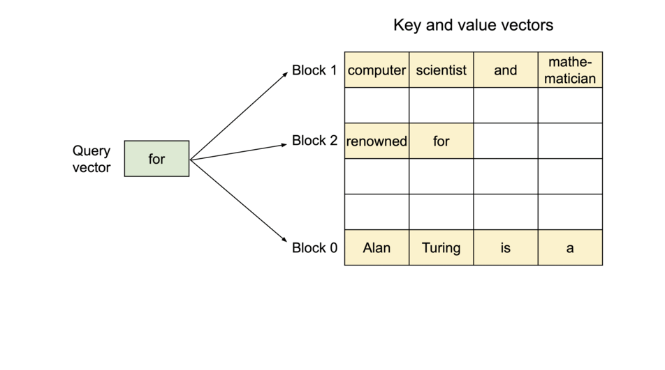
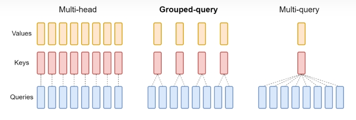
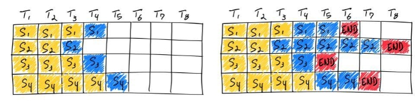
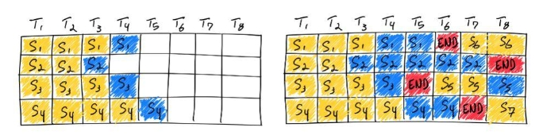
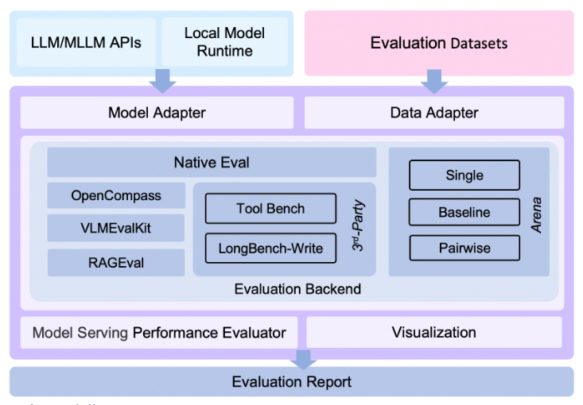

# 目录

- [1.什么是Page-Attention？](#user-content-1.什么是Page-Attention？)
- [2.什么是Flash-Attention？](#user-content-2.什么是Flash-Attention？)
- [3.大模型的流式输出介绍](#user-content-3.大模型的流式输出介绍)
- [4.MQA和GQA介绍](#user-content-4.MQA和GQA介绍)
- [5.vLLM部署示例以及相关参数介绍](#user-content-5.vLLM部署示例以及相关参数介绍)
- [6.AWQ量化介绍](#user-content-6.AWQ量化介绍)
- [7.GPTQ量化介绍](#user-content-7.GPTQ量化介绍)
- [8.介绍一下xformers技术](#user-content-8.介绍一下xformers技术)
- [9.介绍一下sdpa_flash技术](#user-content-9.介绍一下sdpa_flash技术)
- [10.介绍一下sdpa_mem_eff技术](#user-content-10.介绍一下sdpa_mem_eff技术)
- [11.介绍一下sdpa_math技术](#user-content-11.介绍一下sdpa_math技术)
- [12.介绍一下batching技术](#user-content-12.介绍一下batching技术)
- [13.大模型服务部署评测指标有哪些？](#user-content-13.大模型服务部署评测指标有哪些？)
- [14.大模型服务部署评测工具evalscope介绍](#user-content-14.大模型服务部署评测工具evalscope介绍)
- [15.大模型服务部署评测工具evalscope使用](#user-content-15.大模型服务部署评测工具evalscope使用)
- [16.什么是AIGC模型的Model Offloading策略？](#user-content-16.什么是AIGC模型的Model-Offloading策略？)
- [17.大模型服务接口调用示例](#user-content-17.大模型服务接口调用示例)
- [18.VLLM部署多lora模型](#user-content-18.VLLM部署多lora模型)
- [19.Ollama、vLLM、LMDeploy、TensorRT-LLM、SGLang之间有什么区别？](#user-content-19.Ollama、vLLM、LMDeploy、TensorRT-LLM、SGLang之间有什么区别？)
- [20.什么是MCP（Model Context Protocol）大模型服务框架？](#user-content-20.什么是MCP（Model-Context-Protocol）大模型服务框架？)

<h2 id="1.什么是Page-Attention？">1.什么是Page-Attention？</h2>

### 为什么要使用Page-Attention
LLM推理过程通常分为两个阶段：prefill和decode。通常会使用KV cache技术加速推理。

1) 预填充阶段。在这个阶段中，整段prompt喂给模型做forward计算。如果采用KV cache技术，在这个阶段中我们会把prompt过后得到的保存在cache k和cache v中。这样在对后面的token计算attention时，无需对前面的token重复计算了，可以节省推理时间。

在上面的图例中，假设prompt中含有3个token，prefill阶段结束后，这三个token相关的KV值都被装进了cache。
2) decode阶段，在这个阶段中，根据prompt的prefill结果，一个token一个token地生成response。
同样，如果采用了KV cache，则每走完一个decode过程，就把对应response token的KV值存入cache中，以便能加速计算。例如对于图中的t4，它与cache中t0~t3的KV值计算完attention后，就把自己的KV值也装进cache中。对t6也是同理。

由于Decode阶段的是逐一生成token的，因此它不能像prefill阶段那样能做大段prompt的并行计算，所以在LLM推理过程中，Decode阶段的耗时一般是更大的。
从上述过程中，我们可以发现使用KV cache做推理时的一些特点：

- 随着prompt数量变多和序列变长，KV cache也变大，对gpu显存造成压力
- 由于输出的序列长度无法预先知道，所以很难提前为KV cache量身定制存储空间
### Page-Attention原理
虚拟内存的分页管理技术
- 将物理内存划分为固定大小的块，称每一块为页（page）。从物理内存中模拟出来的虚拟内存也按相同的方式做划分
- 对于1个进程，不需要静态加载它的全部代码、数据等内容。想用哪部分，或者它当前跑到哪部分，就动态加载这部分到虚拟内存上，然后由虚拟内存做物理内存的映射。
- 对于1个进程，虽然它在物理内存上的存储不连续（可能分布在不同的page中），但它在自己的虚拟内存上是连续的。通过模拟连续内存的方式，既解决了物理内存上的碎片问题，也方便了进程的开发和运行。

Page-Attention可在不连续的显存空间存储连续的 key 和 value。用于将每个序列的 KV cache 分块（blocks），每块包含固定数量的 token 的 key 和 value 张量。

可以看到for的attention计算，KV cache 被划分为多个块，块在内存空间中不必连续
因为 blocks 在显存中不必连续，所以可以像虚拟内存分页一样，以更灵活的方式管理键和值：
- 将 block 视为 page
- 将 token 视为 bytes
- 将序列视为进程
序列的连续逻辑块通过 block table 映射到非连续物理块。物理块可在生成新 token 时按需分配。因此只有最后一个block会发生显存浪费，小于4%。

通过 block table 将逻辑块映射到物理块

在并行采样时，同一个 prompt 生成多个输出序列，这些序列生成时可以共享 prompt 的 attention 计算和显存。
与 OS 中进程共享物理 page 的方式类似，不同序列可以通过将其逻辑块映射到同一物理块来共享块。为了确保共享安全，Paged Attention 跟踪物理块的引用计数，并实现 “写时复制”（Copy-on-Write）机制，即需要修改时才复制块副本。内存共享使得显存占用减少 55%，吞吐量提升 2.2x。

注：写时复制（Copy-on-write，简称COW）是一种计算机程序设计领域的优化策略。其核心思想是，如果有多个调用者（callers）同时请求相同资源（如内存或磁盘上的数据存储），他们会共同获取相同的指针指向相同的资源，直到某个调用者试图修改资源的内容时，系统才会真正复制一份专用副本（private copy）给该调用者，而其他调用者所见到的最初的资源仍然保持不变。


<h2 id="2.什么是Flash-Attention？">2.什么是Flash-Attention？</h2>

GPU的内存由多个不同大小和不同读写速度的内存组成。内存越小，读写速度越快。对于A100-40GB来说，内存分级图如下所示

- SRAM内存分布在108个流式多处理器上，每个处理器的大小为192K，合计为192*108KB=20.25MB
相当于计算块，但内存小
- 高带宽内存HBM（High Bandwidth Memory），也就是我们常说的显存，大小为40GB。SRAM的读写速度为19TB/s，而HBM的读写速度只有1.5TB/s，不到SRAM的1/10
相当于计算慢，但内存大

在标准注意力实现中，注意力的性能主要受限于内存带宽，是内存受限的，频繁地从HBM中读写N * N 的矩阵是影响性能的主要瓶颈。稀疏近似和低秩近似等近似注意力方法虽然减少了计算量FLOPs，但对于内存受限的操作，运行时间的瓶颈是从HBM中读写数据的耗时，减少计算量并不能有效地减少运行时间(wall-clock time)。

针对内存受限的标准注意力，Flash Attention是IO感知的，目标是避免频繁地从HBM中读写数据，减少对HBM的读写次数，有效利用更高速的SRAM来进行计算是非常重要的，而对于性能受限于内存带宽的操作，进行加速的常用方式就是kernel融合，该操作的典型方式分为三步：
1) 每个kernel将输入数据从低速的HBM中加载到高速的SRAM中
2) 在SRAM中，进行计算
3) 计算完毕后，将计算结果从SRAM中写入到HBM中

但SRAM的内存大小有限，不可能一次性计算完整的注意力，因此必须进行分块计算，使得分块计算需要的内存不超过SRAM的大小。
分块计算的难点在于softmax的分块计算，softmax与矩阵K的列是耦合的，通过引入了两个额外的统计量m(x),l(x)来进行解耦，实现了分块计算。需要注意的是，可以利用GPU多线程同时并行计算多个block的softmax。为了充分利用硬件性能，多个block的计算不是串行（sequential）的,而是并行的。

总的来说，Flash Attention通过调整注意力的计算顺序，引入两个额外的统计量进行分块计算，避免了实例化完整的N×N 的注意力矩阵S,P，将显存复杂度从$O(N^2)$降低到了$O(N)$


<h2 id="3.大模型的流式输出介绍">3.大模型的流式输出介绍</h2>

### 什么是流式输出SSE

指的是在与用户进行对话时，大模型能够实时地、连续地输出文本内容，而不是等待整个回答完全生成后再一次性输出。这种流式输出的方式，使得大模型的响应更加迅速，用户体验更加流畅。

### SSE原理

SSE，全称Server-Sent Events，是一种基于HTTP协议的服务器推送技术。它允许服务器主动向客户端发送数据和信息，实现了服务器到客户端的单向通信。

大模型采用SSE技术实现流式输出，其原理如下：

1) 建立连接：当用户与大模型进行对话时，客户端与服务器之间会建立一个基于HTTP的长连接。这个连接通过SSE机制保持打开状态，允许服务器随时向客户端发送数据。
2) 分步生成与实时推送：大模型根据用户的输入和当前的上下文信息，逐步生成回答的一部分。每当有新的内容生成时，服务器就会通过SSE连接将这些内容作为事件推送给客户端。
3) 客户端接收与展示：客户端通过JavaScript的EventSource对象监听SSE连接上的事件。一旦接收到服务器推送的数据，客户端会立即将其展示给用户，实现流式输出的效果。

### SSE的优点

1) 实时性：SSE技术使得服务器能够实时地将数据推送给客户端，无需客户端频繁发起请求，提高了数据的实时性。
2) 效率：通过保持长连接的方式，SSE技术避免了频繁建立和断开连接的开销，提高了数据传输的效率。
3) 轻量级：SSE技术基于HTTP协议，无需额外的协议支持，使得实现更加轻量级和简单。

### SSE的使用注意事项

1) 服务器性能：由于流式输出需要服务器实时推送数据，因此对服务器的性能要求较高。确保服务器具备足够的处理能力和带宽，以应对大量并发连接和数据传输的需求。
2) 数据安全性：在传输过程中，要确保数据的安全性，防止敏感信息泄露或被恶意利用。可以采用加密传输、身份验证等措施来增强数据安全性。
3) 用户体验：流式输出功能应关注用户体验，确保数据的实时性和准确性。同时，也要注意避免过度推送数据，以免给用户造成困扰或疲劳。


<h2 id="4.MQA和GQA介绍">4.MQA和GQA介绍</h2>

### MHA、MQA、GQA

MHA即Multi-Head Attention，QKV 三部分有相同数量的头，且一一对应。每次做 Attention，head1 的 QKV 就做好自己运算就可以，输出时各个头加起来就行。

MQA，全称 Multi Query Attention，让 Q 仍然保持原来的头数，但 K 和 V 只有一个头，相当于所有的 Q 头共享一组 K 和 V 头。实现改变了会不会影响效果呢？确实会影响但相对它能带来的收益，性能的些微降低是可以接受的。
收益：实验发现一般能提高 30%-40% 的吞吐。
收益主要就是由降低KV cache 带来的。实际上 MQA 运算量和 MHA 是差不多，可理解为读取一组 KV 头之后，给所有 Q 头用，但因为之前提到的内存和计算的不对称，所以是有利的。



GQA，全称 Group-Query Attention，是 MHA 和 MQA 的折衷方案，既不想损失性能太多，又想获得 MQA 带来的推理加速好处。具体思想是，不是所有Q 头共享一组 KV，而是分组一定头数 Q 共享一组 KV，比如上面图片就是两组 Q 共享一组 KV。

这两种技术的加速原理:
1) 降低了从内存中读取的数据量，所以也就减少了计算单元等待时间，提高了计算利用率
2) KV cache 变小了 head_num 倍，也就是显存中需要保存的 tensor 变小了，空出来空间就可以加大 batch size，从而又能提高利用率。

需要注意的是GQA和MQA需要在模型训练的时候开启，按照相应的模式生成模型。


<h2 id="5.vLLM部署示例以及相关参数介绍">5.vLLM部署示例以及相关参数介绍</h2>

### 部署Qwen为例

```
from vllm import LLM, SamplingParams

prompts = [
    "Hello, my name is",
    "The president of the United States is",
    "The capital of France is",
    "The future of AI is",
]
sampling_params = SamplingParams(temperature=0.8, top_p=0.95)

llm = LLM(model="qwen/Qwen-7B-Chat", revision="v1.1.8", trust_remote_code=True)

outputs = llm.generate(prompts, sampling_params)

for output in outputs:
    prompt = output.prompt
    generated_text = output.outputs[0].text
    print(f"Prompt: {prompt!r}, Generated text: {generated_text!r}")

```
### 参数介绍
SamplingParams有关参数
- temperature：Temperature 参数是文本生成模型中用于控制生成文本的随机性和创造性的一个重要的超参数。Temperature参数通常设置为 0.1 到 1.0 之间。
- top_k:模型预测的前k个最可能的下一个词。
- max_tokens:模型生成的最大长度。
- stop:生成模型停止生成的符号。

LLM有关参数
- model:LLM模型路径。
- tensor_parallel_size:并行处理的大小。
- gpu_memory_utilization:默认为0.9， cpu_swap_space默认4个G。若gpu_memory_utilization参数过小(分配的内存大小低于模型使用内存)或者过大(接近1.0)时，代码会崩溃。
- request_rate:请求速率

<h2 id="6.AWQ量化介绍">6.AWQ量化介绍</h2>

### AWQ量化是什么

AWQ（Activation-aware Weight Quantization）量化是一种基于激活值分布(activation distribution)挑选显著权重(salient weight)进行量化的方法，其不依赖于任何反向传播或重建，因此可以很好地保持LLM在不同领域和模式上的泛化能力，而不会过拟合到校准集，属训练后量化(Post-Training Quantization, PTQ)大类。

### AWQ量化原理

计算一个scale系数tensor，shape为[k]，k为矩阵乘的权重reduce的维度大小。对激活除以该tensor，并对矩阵乘的权重乘以该tensor，这降低了权重量化的难度，使得权重可以采用常规的group量化(直接根据最大最小值计算scale, zero point)。AWQ的核心技术一是这个对激活和权重应用scale的方法，另外就是如何计算这个scale tensor。因为激活是fp16不量化，对激活进行scale一般不会牺牲精度，因此可以对权重进行一些处理降低量化的难度。

<h2 id="7.GPTQ量化介绍">7.GPTQ量化介绍</h2>

### GPTQ量化的特点

1) 高效率： GPTQ是一种一次性量化方法，无需进行模型重新训练，因此在时间上非常高效。它能够在相对较短的时间内将大规模GPT模型（如GPT-3-175B）的参数量化为较低的位宽，减小了模型的存储需求。
2) 高准确性： 尽管GPTQ采用了量化技术，但它能够在几乎不影响模型准确性的情况下，将参数位宽减小到3或4位。这意味着压缩后的模型仍然能够保持与未压缩基线相近的性能水平，对于许多应用而言，这是非常重要的。
3) 扩展性： GPTQ的方法可以扩展到处理具有数百亿参数的GPT模型，如OPT-175B和BLOOM-176B。这种扩展性使得它在处理大规模模型时非常有用。
4) 极端量化： GPTQ还能够在极端的量化情况下表现出色，如将权重量化为2位甚至三值（ternary）量化水平。这意味着它不仅适用于相对较低的位宽，还适用于极度的位宽减小，而仍能够保持合理的准确性。
5) 快速执行： 为了支持压缩模型的高效执行，研究人员还开发了执行工具，使得压缩后的模型能够在GPU上高效运行。这包括对GPU内存加载的优化，从而在高端GPU（如NVIDIA A100）上实现约3.25倍的性能提升，在更经济的GPU（如NVIDIA A6000）上实现4.5倍的性能提升。

### GPTQ量化的优点

1) 减小了GPU内存需求： GPTQ使用了一种称为"Lazy Batch-Updates"的方法，将模型分成块并逐块压缩。这种方法允许在GPU内存较小的情况下执行模型量化，而不需要一次性加载整个模型。这样，GPTQ可以在资源受限的环境中执行大型模型的量化，这对于之前的一次性量化方法来说可能是不可行的。
2) 提高了GPU利用率： GPTQ采用批量化更新操作，这意味着多个权重可以同时进行量化操作，从而提高了GPU的利用率。这种效率提升对于执行175亿参数模型的生成推断至关重要，因为生成推断通常需要大量的计算资源。


<h2 id="8.介绍一下xformers技术">8.介绍一下xformers技术</h2>

### Xformers 技术原理概述

**Xformers** 是 Meta 开发的一个高效、模块化的深度学习库，专注于优化 **Transformer** 架构的性能。Xformers 提供了对 Transformer 组件的多种加速技术，当模型规模庞大时，它能够显著提高训练速度和降低显存占用，特别是在资源受限的环境下（如嵌入式设备、移动设备）。随着 Transformer 架构的不断普及，Xformers 将继续在 AIGC 、传统深度学习以及自动驾驶领域中扮演重要角色。

### 1. **Xformers 的背景与目标**

Transformer 模型在自然语言处理（NLP）和计算机视觉（CV）任务中已经取得了巨大的成功，但随着模型规模的扩大，其巨大的计算开销和显存需求成为了模型部署中的瓶颈。Xformers的核心目标是：

- **降低显存消耗**：通过高效的注意力机制和其他模块优化来减少计算资源的占用。
- **提高计算效率**：在不损失性能的前提下，加速模型训练和推理的过程。
- **模块化与可扩展性**：提供易于集成的模块，便于用户按需组合和优化模型。

### 2. **Xformers 的技术原理**

#### 2.1 **Sparse Attention**（稀疏注意力）

Transformer 模型的主要瓶颈之一是自注意力机制的计算复杂度，标准的全连接注意力（Full Attention）在序列长度为 $N$ 的情况下，其计算复杂度为 $O(N^2)$ 。这对于长序列任务，如机器翻译或长文本生成任务，代价非常高。

**Xformers 提供了稀疏注意力机制**，即通过减少不必要的查询-键值对（Query-Key pairs）的计算来降低复杂度，通常可以将计算复杂度降至 $O(N \log N)$ 或 $O(N)$ ：

- **局部注意力（Local Attention）**：仅计算局部范围内的注意力权重，而忽略远程依赖关系。
- **因式分解注意力（Factorized Attention）**：将注意力计算分解为更小的矩阵运算，降低计算需求。

#### 2.2 **Memory-Efficient Attention**（显存高效的注意力机制）

Transformer 模型的另一个重要问题是其显著的显存占用。标准的注意力机制需要为整个输入序列保留注意力矩阵（即 Query-Key 和 Value 之间的所有匹配），这会占用大量显存。

**Xformers 引入了内存高效注意力（Memory-Efficient Attention）机制**，即只在需要时计算注意力权重和中间值，而不保留整个矩阵。这可以通过逐步计算的方式实现，将显存占用从原先的 $O(N^2)$ 降低到 $O(N)$ ，在不影响准确率的情况下大幅减少显存开销。

#### 2.3 **Block-Sparse Attention**

在一些应用中（例如图像生成任务），并不需要全局范围的注意力，某些位置的交互作用可以忽略。因此，Xformers 提供了 **Block-Sparse Attention**，它通过在稀疏矩阵中定义固定的稀疏模式来降低计算复杂度。这种方法特别适用于图像处理任务，例如使用块级操作来计算注意力。

- **局部窗口**：例如在图像生成任务中，注意力只在局部窗口内进行计算，可以跳过与远距离像素的注意力交互，从而减少计算负担。
- **灵活性与可定制性**：Block-Sparse Attention 的稀疏模式可以根据具体任务灵活定义，提供了更多的自定义选项。

#### 2.4 **Flash Attention**

Xformers 引入了 **Flash Attention** 技术，进一步优化了注意力机制的性能。Flash Attention 通过将注意力的计算与显存优化结合，允许在 GPU 上高效执行注意力操作。它可以通过在低精度硬件（如混合精度训练）中使用时，进一步提升计算效率。

### 3. **Xformers 在实际应用中的优势**

#### 3.1 **更快的训练速度**

通过使用稀疏注意力和内存高效注意力，Xformers 可以显著减少训练时间。在处理长序列任务时，Xformers 的优化能将训练时间减少 50% 以上，同时保持相似的性能。这对于需要快速迭代的大规模模型训练尤其重要。

#### 3.2 **显存占用大幅减少**

Xformers 的稀疏注意力机制和内存优化技术，使得显存占用可以减少一半以上。特别是在使用大型模型时，显存的节省能够使得相同的硬件资源可以训练更大的模型或处理更长的输入序列。

#### 3.3 **广泛的应用领域**

Xformers 不仅适用于 NLP 任务，也被广泛应用于计算机视觉、图像生成、时间序列预测等多种任务中。它的灵活性使其能够适配多种 Transformer 架构（如 Vision Transformers、BERT、GPT 等）。


<h2 id="9.介绍一下sdpa_flash技术">9.介绍一下sdpa_flash技术</h2>

**sdpa_flash：FlashAttention** 是一种**快速且内存高效的精确注意力计算方法**，全称为 **"FlashAttention: Fast and Memory-Efficient Exact Attention with IO-Awareness"**。它通过优化内存访问模式和计算顺序，实现了在 GPU 上对注意力机制的加速和内存优化。

传统注意力机制的瓶颈：

- **计算复杂度**：传统的注意力机制在计算 $QK^\top$ 矩阵时，复杂度为 $O(N^2)$ ，当序列长度 $N$ 较大时，计算量巨大。
- **内存占用**：需要存储大小为 $N \times N$ 的注意力矩阵，导致内存消耗过高。
- **IO 瓶颈**：GPU 的计算能力强大，但受限于内存带宽和缓存大小，内存访问成为性能瓶颈。

### 1、sdpa_flash原理与实现

**FlashAttention** 的核心思想是：

- **计算-通信融合（Compute-Communication Fusion）**：将计算和内存访问紧密结合，减少对全局内存的读写。
- **块状处理（Block-wise Processing）**：将序列划分为小块（blocks），在寄存器或共享内存中完成计算，避免中间结果的全局存储。
- **重新排序计算步骤**：调整计算顺序，使得在一次遍历中完成必要的计算，减少内存访问次数。

**具体实现步骤**：

1. **块划分**：

   - 将输入序列划分为大小为 $B$ 的小块，通常 $B$ 的大小取决于 GPU 的寄存器和共享内存容量。

2. **逐块计算注意力**：

   - 对于每个块，加载对应的 $Q$ 、 $K$ 、 $V$ 到高速缓存（如寄存器或共享内存）中。

3. **计算局部注意力**：

   - 在块内计算缩放点积注意力：
     
     $$\text{Attention}(Q_{\text{block}}, K_{\text{block}}, V_{\text{block}})$$
    

4. **累积结果**：

   - 将块的输出累积到最终结果中，避免中间结果的全局存储。

5. **避免数值不稳定性**：

   - 采用数值稳定的算法，如在计算 softmax 时使用减去最大值的方法，防止指数函数导致的数值溢出。

### 2. 优势

- **内存高效**：减少了全局内存的读写，降低了内存占用。
- **计算加速**：通过优化内存访问模式，充分利用 GPU 的计算能力，提升了计算速度。
- **可扩展性**：能够处理更长的序列，适用于大型模型和数据集。

### 3. 应用场景

- **Transformer 模型加速**：在训练和推理大型 Transformer 模型时，使用 FlashAttention 可显著提升性能。
- **长序列处理**：在处理长文本或时间序列数据时，FlashAttention 提供了高效的解决方案。


<h2 id="10.介绍一下sdpa_mem_eff技术">10.介绍一下sdpa_mem_eff技术</h2>

**sdpa_mem_eff：Memory-Efficient Attention**（内存高效注意力）是一种旨在降低注意力机制内存消耗的方法。其核心思想是通过重新计算部分中间结果，来节省内存，占用更少的资源。

传统注意力机制的瓶颈：

- **内存瓶颈**：在训练深度神经网络时，显存或内存的限制常常成为瓶颈。
- **激活值的存储**：传统的注意力计算需要存储中间激活值，消耗大量内存。
- **计算与内存的权衡**：通过增加计算量来换取内存的节省，是一种可行的优化策略。

### 1. sdpa_mem_eff原理与实现

**Memory-Efficient Attention** 的主要策略是：

- **不存储中间激活值**：在前向传播中，不保存中间的激活值或注意力矩阵。
- **反向传播中重新计算**：在反向传播中，重新计算必要的中间值，以获得梯度。

**具体实现**：

1. **正向传播**：

   - 计算输出结果，但不保存中间的注意力权重或激活值。

2. **反向传播**：

   - 需要计算梯度时，重新执行前向传播过程，计算所需的中间值。

3. **数值稳定性**：

   - 在重新计算过程中，注意采用数值稳定的算法，防止梯度计算中的数值误差。

### 2. 优势

- **内存节省**：通过减少中间值的存储，大幅降低内存消耗。
- **适用于大型模型**：在训练大型模型或处理长序列时，能够在有限的硬件资源下完成任务。

### 3. 代价与权衡

- **计算开销增加**：由于需要在反向传播中重新计算前向过程，增加了计算时间。
- **适用场景**：在内存资源极为有限的情况下，可接受一定的计算时间增加，换取内存的节省。


<h2 id="11.介绍一下sdpa_math技术">11.介绍一下sdpa_math技术</h2>

**sdpa_math：sdpa_math** 是指在 PyTorch 中使用 C++ 实现的 Scaled Dot-Product Attention，利用 PyTorch 的自定义 C++ 扩展（即 **PyTorch C++ Extensions**）来优化计算性能。

### 1. 背景与动机

- **Python 的性能限制**：Python 虽然易于使用，但在执行密集计算任务时，性能不如底层语言。
- **高效计算需求**：为提升注意力机制的计算效率，使用 C++ 等底层语言实现核心计算部分。

### 2. sdpa_math原理与实现

**PyTorch C++ Extensions** 允许开发者用 C++/CUDA 编写自定义的算子，并在 PyTorch 中调用。

**实现步骤**：

1. **编写 C++ 代码**：

   - 实现 Scaled Dot-Product Attention 的核心计算，包括矩阵乘法、缩放、softmax 等操作。

2. **CUDA 优化**：

   - 对于需要在 GPU 上加速的部分，使用 CUDA 编写，并进行线程优化。

3. **编译扩展模块**：

   - 使用 PyTorch 提供的编译工具，将 C++/CUDA 代码编译为可加载的 Python 模块。

4. **在 PyTorch 中调用**：

   - 在 Python 代码中，直接调用自定义的 C++ 实现，实现高性能的注意力计算。

### 3. 优势

- **性能提升**：C++ 和 CUDA 的底层实现，能够充分利用硬件性能，提升计算速度。
- **灵活性**：开发者可以根据需求，定制优化策略和实现细节。

### 4. 注意事项

- **开发复杂度**：需要具备 C++ 和 CUDA 的编程能力，增加了开发难度。
- **兼容性**：需要确保自定义扩展与 PyTorch 的版本兼容，避免因 API 变动导致的问题。

<h2 id="12.介绍一下batching技术">12.介绍一下batching技术</h2>

### batching的原理

batching的原理：不再对每次输入都加载一遍模型参数，而是攒起来、加载一遍模型参数用于多个输入。vllm使用了continuous batching技术从而获得了吞吐量23倍的提升，continuous batching的效果可以优于naive batching八倍。

### naive batching/static batching
naive batching非常简单粗暴，一个batch的输入加载进来，一直到最后一个输入的输出结束，batch size都是不变的，如下图自始至终这里所处理的batch数都是4，这也就是static的由来。然而，因为不同输入的输出长度差别可以很大，比如下图中的第二个输入，生成了5个token才终止，而第3个输入生成了1个token就终止了。除非所有的输入长度都一致、且输出长度也一致（比如分类问题），那么下图右侧空白格的这些空间都是浪费了。


### continuous batching/in-flight batching

不同于naive batching，当一个输入的生成结束了，就将新的输入插进来，所以batch size是动态的。还是以刚才的例子，第三个输入先生成完，新的输入S5就插入进来了，一直到输出最长的S2的输出结束的时候，batch size由4变成了7。这样一来，等待时间就变少了。


<h2 id="13.大模型服务部署评测指标有哪些？">13.大模型服务部署评测指标有哪些？</h2>

在部署大模型服务接口时，对其性能进行评估是至关重要的，由于目前LLM推理都需要比较高级的GPU，使得LLM推理成本高，因此在不同使用场景下优化推理就很有必要。对于提供公共推理服务，比如openai等来说，提高吞吐率优先级比较高，而在一些专用的业务场景，则对首包延迟和整体请求延迟有着较高要求。
-   **Throughput**：总的吞吐（output tokens/seconds），对于LLM Serving重要，可以提高总的服务能力。
-   **Time to First Token(TTFT)**：在prefill阶段后返回的第一个token的时间，在stream输出模式下，对体验影响大，越小用户等待返回第一个token时间越小，体验越好。
-   **Time per output token**：生成每个token的时间，影响体验。
-   **Latency**：处理完整请求用时。
-   **QPS**：每秒处理完成的请求数，对于服务端来说，QPS越高越好。

<h2 id="14.大模型服务部署评测工具evalscope介绍">14.大模型服务部署评测工具evalscope介绍</h2>

EvalScope是魔搭社区官方推出的模型评估与性能基准测试框架，内置多个常用测试基准和评估指标，如MMLU、CMMLU、C-Eval、GSM8K、ARC、HellaSwag、TruthfulQA、MATH和HumanEval等；支持多种类型的模型评测，包括LLM、多模态LLM、embedding模型和reranker模型。EvalScope还适用于多种评测场景，如端到端RAG评测、竞技场模式和模型推理性能压测等。此外，通过ms-swift训练框架的无缝集成，可一键发起评测，实现了模型训练到评测的全链路支持。



### 架构

- **Model Adapter**: 模型适配器，用于将特定模型的输出转换为框架所需的格式，支持API调用的模型和本地运行的模型。

- **Data Adapter**: 数据适配器，负责转换和处理输入数据，以便适应不同的评估需求和格式。

- **Evaluation Backend**:

   - Native：EvalScope自身的默认评测框架，支持多种评估模式，包括单模型评估、竞技场模式、Baseline模型对比模式等。

   - OpenCompass：支持OpenCompass作为评测后端，对其进行了高级封装和任务简化，您可以更轻松地提交任务进行评估。

   - VLMEvalKit：支持VLMEvalKit作为评测后端，轻松发起多模态评测任务，支持多种多模态模型和数据集。

   - ThirdParty：其他第三方评估任务，如ToolBench。

   - RAGEval：支持RAG评估，支持使用MTEB/CMTEB进行embedding模型和reranker的独立评测，以及使用RAGAS进行端到端评测。

- **Performance Evaluator**: 模型性能评测，负责具体衡量模型推理服务性能，包括性能评测、压力测试、性能评测报告生成、可视化。

- **Evaluation Report**: 最终生成的评估报告，总结模型的性能表现，报告可以用于决策和进一步的模型优化。

- **Visualization**: 可视化结果，帮助用户更直观地理解评估结果，便于分析和比较不同模型的表现。

### 特点

- **基准数据集**：预置了多个常用测试基准，包括：MMLU、CMMLU、C-Eval、GSM8K、ARC、HellaSwag、TruthfulQA、MATH、HumanEval等。

- **评估指标**：实现了多种常用评估指标。

- **模型接入**：统一的模型接入机制，兼容多个系列模型的Generate、Chat接口。

- **自动评估**：包括客观题自动评估和使用专家模型进行的复杂任务评估。

- **评估报告**：自动生成评估报告。

- **竞技场(Arena)模式**：用于模型间的比较以及模型的客观评估，支持多种评估模式，包括：

   - **Single mode**：对单个模型进行评分。

   - **Pairwise-baseline mode**：与基线模型进行对比。

   - **Pairwise (all) mode**：所有模型间的两两对比。

- **可视化工具**：提供直观的评估结果展示。

- **模型性能评估**：提供模型推理服务压测工具和详细统计，详见模型性能评估文档。

- **OpenCompass集成**：支持OpenCompass作为评测后端，对其进行了高级封装和任务简化，您可以更轻松地提交任务进行评估。

- **VLMEvalKit集成**：支持VLMEvalKit作为评测后端，轻松发起多模态评测任务，支持多种多模态模型和数据集。

- **全链路支持**：通过与ms-swift训练框架的无缝集成，实现模型训练、模型部署、模型评测、评测报告查看的一站式开发流程，提升用户的开发效率。

<h2 id="15.大模型服务部署评测工具evalscope使用">15.大模型服务部署评测工具evalscope使用</h2>

### 安装

```shell
pip install evalscope[all]
```

### 使用

简单评估：
```shell
python -m evalscope.run \
 --model qwen/Qwen2-0.5B-Instruct \
 --template-type qwen \
 --datasets arc 
```
基本参数说明
- --model: 指定了模型在ModelScope中的model_id，可自动下载，例如Qwen2-0.5B-Instruct模型链接；也可使用模型的本地路径，例如/path/to/model

- --template-type: 指定了模型对应的模板类型，参考[模板表格](https://swift.readthedocs.io/zh-cn/latest/Instruction/支持的模型和数据集.html#id4)中的Default Template字段填写.

- --datasets: 数据集名称，支持输入多个数据集，使用空格分开，[数据集](https://evalscope.readthedocs.io/zh-cn/latest/get_started/supported_dataset.html#id1)将自动下载

带参数评估：
```shell
python evalscope/run.py \
 --model qwen/Qwen2-0.5B-Instruct \
 --template-type qwen \
 --model-args revision=master,precision=torch.float16,device_map=auto \
 --datasets gsm8k ceval \
 --use-cache true \
 --limit 10
 ```

- --model-args: 模型加载参数，以逗号分隔，key=value形式

- --generation-config: 生成参数，以逗号分隔，key=value形式

   - do_sample: 是否使用采样，默认为false

   - max_new_tokens: 生成最大长度，默认为1024

   - temperature: 采样温度

   - top_p: 采样阈值

   - top_k: 采样阈值

- --use-cache: 是否使用本地缓存，默认为false；如果为true，则已经评估过的模型和数据集组合将不会再次评估，直接从本地缓存读取

- --dataset-args: 评估数据集的设置参数，以json格式传入，key为数据集名称，value为参数，注意需要跟--datasets参数中的值一一对应

   - --few_shot_num: few-shot的数量

   - --few_shot_random: 是否随机采样few-shot数据，如果不设置，则默认为true

- --limit: 每个数据集最大评估数据量，不填写则默认为全部评估，可用于快速验证

评测展示：
```
Benchmarking summary: 
+----------------------------------------------+------------------------------------------------+
| key                                          | Value                                          |
+==============================================+================================================+
| Time taken for tests (senconds)              | 7.539                                          |
+----------------------------------------------+------------------------------------------------+
| Number of concurrency                        | 1                                              |
+----------------------------------------------+------------------------------------------------+
| Total requests                               | 15                                             |
+----------------------------------------------+------------------------------------------------+
| Succeed requests                             | 15                                             |
+----------------------------------------------+------------------------------------------------+
| Failed requests                              | 0                                              |
+----------------------------------------------+------------------------------------------------+
| Average QPS                                  | 1.99                                           |
+----------------------------------------------+------------------------------------------------+
| Average latency                              | 0.492                                          |
+----------------------------------------------+------------------------------------------------+
| Average time to first token                  | 0.026                                          |
+----------------------------------------------+------------------------------------------------+
| Throughput(average output tokens per second) | 334.006                                        |
+----------------------------------------------+------------------------------------------------+
| Average time per output token                | 0.00299                                        |
+----------------------------------------------+------------------------------------------------+
| Average package per request                  | 167.867                                        |
+----------------------------------------------+------------------------------------------------+
| Average package latency                      | 0.003                                          |
+----------------------------------------------+------------------------------------------------+
| Average input tokens per request             | 40.133                                         |
+----------------------------------------------+------------------------------------------------+
| Average output tokens per request            | 167.867                                        |
+----------------------------------------------+------------------------------------------------+
| Expected number of requests                  | 15                                             |
+----------------------------------------------+------------------------------------------------+
| Result DB path                               | ./outputs/qwen2.5_benchmark_20241107_201413.db |
+----------------------------------------------+------------------------------------------------+

Percentile results: 
+------------+---------------------+---------+
| Percentile | First Chunk Latency | Latency |
+------------+---------------------+---------+
|    10%     |       0.0178        | 0.1577  |
|    25%     |       0.0183        | 0.2358  |
|    50%     |       0.0199        | 0.4311  |
|    66%     |       0.0218        | 0.6317  |
|    75%     |       0.0429        | 0.7121  |
|    80%     |       0.0432        | 0.7957  |
|    90%     |       0.0432        | 0.9153  |
|    95%     |       0.0433        | 0.9897  |
|    98%     |       0.0433        | 0.9897  |
|    99%     |       0.0433        | 0.9897  |
+------------+---------------------+---------+
```

| 指标 | 说明|
| :----: | :----: |
| Total requests | 总请求数 |
| Succeed requests | 成功请求数 |
| Failed requests | 失败的请求数量 |
| Average QPS | 平均每秒请求数 |
| Average latency | 平均延迟 |
| Throughput(average output tokens per second) | 平均每秒输出token的数量 |
| Average time to first token | 平均首次输出token的时间 |
| Average input tokens per request | 每个请求的平均输入token数 |
| Average output tokens per request | 每个请求的平均输出token数 |
| Average time per output token | 平均每个输出token的时间 |
| Average package per request | 每个请求的平均包数 |
| Average package latency | 平均包延迟 |
| Percentile of time to first token (p10, ..., p99) | 首token延时百分位 |
| Percentile of time to first token (p10, ..., p99) | 首token延时百分位 | | 请求延迟的百分位 |


<h2 id="16.什么是AIGC模型的Model-Offloading策略？">16.什么是AIGC模型的Model Offloading策略？</h2>

**AIGC（AI Generated Content）模型的 Model Offloading 策略**主要是为了优化资源利用率，尤其是在计算资源（如 GPU 显存）有限的情况下，通过分阶段或分模块地加载和卸载模型的部分参数，以平衡性能和硬件限制。Rocky下面将详细讲解 Model Offloading 的策略及其在 AIGC 模型中的应用。

### **1. Model Offloading 的背景和目的**

#### **背景**
- AIGC 模型（如 GPT、Stable Diffusion、DALL-E 等）往往参数规模巨大（数十亿到数千亿），需要大量的显存（VRAM）和计算资源。
- 在资源受限的设备上（如单 GPU 或多任务场景），显存可能不足以一次性加载整个模型。

#### **目的**
- **减少显存占用**：通过动态加载模型的部分权重，将不需要的部分卸载到 CPU 或磁盘，减少 GPU 显存压力。
- **支持大模型推理**：即便硬件资源不足，也能通过优化数据流完成大模型的推理和训练。
- **性能优化**：在保证推理速度的情况下，合理分配硬件资源以提高利用率。

### **2. Model Offloading 的核心策略**

Model Offloading 的策略可以大致分为以下几类：

#### **2.1. 分阶段加载与卸载（Layer-by-Layer Offloading）**
- **方法**：
  - 在推理过程中，仅将当前需要计算的模型层加载到 GPU 中。
  - 计算完成后，立即将这部分权重卸载到 CPU 或磁盘，释放 GPU 显存。
  - 对于下一层的计算，重复上述过程。
- **优点**：
  - 显存使用峰值仅与单层计算的资源需求相关。
  - 对计算顺序较强的模型（如 Transformer）特别有效。
- **缺点**：
  - CPU/GPU 之间频繁的数据传输可能成为瓶颈。

#### **2.2. 静态分配（Static Partitioning Offloading）**
- **方法**：
  - 根据硬件配置，将模型权重按固定规则分配到 CPU 和 GPU。例如：
    - 经常使用的权重存储在 GPU 中。
    - 不常用的权重（如首尾层或低频模块）存储在 CPU 或磁盘中。
- **优点**：
  - 减少频繁的数据传输，适合推理任务。
- **缺点**：
  - 对训练不友好，因为训练阶段需要频繁访问所有权重。

#### **2.3. 动态迁移（Dynamic Offloading）**
- **方法**：
  - 根据当前的硬件利用率、任务需求或显存状态，动态决定哪些模块需要迁移到 GPU 或 CPU。
  - 结合运行时监控工具（如 NVIDIA's PyTorch Profiler）优化决策。
- **优点**：
  - 更智能，适应性强，可以根据任务负载动态调整。
- **缺点**：
  - 实现复杂度高，性能不确定性较大。

#### **2.4. 磁盘缓存 Offloading**
- **方法**：
  - 将极少使用的模型权重存储在磁盘中，仅在需要时加载到内存。
  - 通过异步预加载机制减少磁盘 I/O 的延迟。
- **优点**：
  - 最大限度减少对内存和显存的需求。
- **缺点**：
  - 磁盘 I/O 延迟较大，可能严重影响推理性能。

### **3. 具体实现与优化技术**

#### **3.1. 在推理中的应用**
在推理阶段，模型通常是冻结的（不更新权重），可以采用以下策略：
1. **权重分块**：
   - 将模型分为多个小模块（如 Transformer 的每一层）。
   - 每次仅加载一个模块进行计算。

2. **分布式推理**：
   - 使用多个设备分担权重存储和计算负载。
   - 示例：在 GPU1 上运行模型的前几层，GPU2 上运行后几层。

3. **流水线并行**：
   - 将模型切分为多个部分，每部分运行在不同设备上，同时处理不同批次的数据。

#### **3.2. 在训练中的应用**
训练阶段需要额外存储优化器状态和梯度值，Offloading 的实现更加复杂：
1. **参数 Offloading**：
   - 使用 Offloading 将模型的部分参数放在 CPU，按需加载到 GPU。
   - 示例：DeepSpeed 的 ZeRO Stage 3。

2. **梯度和激活值 Offloading**：
   - 在反向传播中，将中间激活值存储到 CPU，减少 GPU 显存占用。
   - 用于梯度累积和计算时再加载回 GPU。

3. **分布式存储**：
   - 使用 NVMe 存储快速保存和加载权重。

### **4. AIGC 模型中常用的 Model Offloading 案例**

#### **4.1. GPT 模型**
- **策略**：
  - 将冷门权重（如 Embedding 层）放置在 CPU。
  - 对 Transformer 层按需加载。
  - 使用流水线并行处理。

#### **4.2. Stable Diffusion**
- **策略**：
  - UNet 和 VAE 的权重按层级分块，仅加载当前需要计算的部分。
  - 使用 `torch.cuda.amp` 进行混合精度计算。
  - 在内存不足时，将生成的中间特征图存储在 CPU。

### **5. 优化 Offloading 的性能**

#### **5.1. 减少传输延迟**
- 使用高带宽设备（如 NVLink 或 PCIe 4.0）连接 CPU 和 GPU。
- 优化 CPU 和 GPU 之间的数据预取。

#### **5.2. 使用混合精度**
- 将模型部分权重（如 FP32）转换为 FP16 或 BF16，以减少存储需求和传输开销。

#### **5.3. 异步加载**
- 通过异步 I/O，在 GPU 空闲时预加载下一步所需的权重。

#### **5.4. 合理规划模型分割**
- 分割模型时，尽量将高计算密度部分优先加载到 GPU，以最大化利用率。

<h2 id="17.大模型服务接口调用示例">17.大模型服务接口调用示例</h2>

在用vllm框架部署完大模型后，可以通过openai的接口调用。

### 同步调用

```
from openai import OpenAI

openai_api_base = "http://127.0.0.1:8000/v1"
openai_api_key = "EMPTY"
client = OpenAI(api_key=openai_api_key, base_url=openai_api_base)

def api_predict(conversation):
    response = client.chat.completions.create(
        model="Qwen",
        messages=conversation
    )
    for chunk in response:
        content = chunk.choices[0].delta.content
        if content:
            yield content

```

### 异步调用

```
from openai import AsyncOpenAI

openai_api_base = "http://127.0.0.1:8000/v1"
openai_api_key = "EMPTY"
client = AsyncOpenAI(api_key=openai_api_key, base_url=openai_api_base)

async def api_predict(conversation):
    response = await client.chat.completions.create(
        model="Qwen",
        messages=conversation,
        stream=True
    )
    async for chunk in response:
        content = chunk.choices[0].delta.content
        if content:
            yield content
```

使用AsyncOpenAI进行异步调用可以提高性能和效率，特别是在处理大量I/O操作时。异步编程允许程序在等待API响应的同时，执行其他任务，从而避免了线程阻塞。

<h2 id="18.VLLM部署多lora模型">18.VLLM部署多lora模型</h2>

在VLLM框架中，可以动态的部署多个lora模型，来减少计算资源的消耗。
多lora模型部署命令如下：

```bash
python3 -m vllm.entrypoints.openai.api_server \
                            --model /workspace/code/qwen2.5/7B \
                            --tensor_parallel_size 1 --enable_lora \
                            --lora-modules lora_1=/workspace/code/qwen2.5-7b/lora_1 lora_2=/workspace/code/qwen2.5-7b/lora2 
```

其中，`--lora-modules`参数指定了多个lora模型的路径，每个路径之间用空格分隔。
调用服务接口时，可以通过`model`参数指定需要调用的lora模型，例如：model="lora_1"。
相比较于部署一个完整的模型，部署多个lora模型可以减少计算资源的消耗，但是在推理速度和并发效果上会慢于将lora模型合并到完整模型中，因为模型在同一时刻只能进行一种任务的推理，在当前推理未结束，有其他任务需要推理，则会等待当前任务推理完成加载其他任务lora才能进行推理；该部署方式适用于一些简单的任务，例如文本分类、实体抽取、情感分析等。


<h2 id="19.Ollama、vLLM、LMDeploy、TensorRT-LLM、SGLang之间有什么区别？">19.Ollama、vLLM、LMDeploy、TensorRT-LLM、SGLang之间有什么区别？</h2>

在AIGC时代中，对大模型进行部署是不可缺少的一环，在DeepSeek系列火爆全球后，我们需要掌握Ollama、vLLM、LMDeploy、TensorRT-LLM、SGLang五个主流大模型部署工具的异同。

我们只有了解不同部署工具在易用性、性能和适用场景上的差异化优势，才能结合实际需求中的响应速度、硬件资源和部署复杂度进行权衡选择。

### 一、核心特性对比
| 工具名称          | 核心定位                  | 优势                                                                 | 局限性                                 | 典型适用场景                     |
|-------------------|---------------------------|----------------------------------------------------------------------|----------------------------------------|----------------------------------|
| **Ollama**        | 轻量级LLM本地部署框架     | 安装简单、跨平台支持、内存占用低、支持多模态模型                     | 并发能力弱、国内下载速度慢             | 个人开发、本地测试、原型验证     |
| **vLLM**          | 高性能LLM推理引擎         | 高吞吐量、支持多GPU并行、内存优化（PagedAttention）                  | 配置复杂、显存占用高                   | 企业级高并发服务、在线问答平台   |
| **LMDeploy**      | 端到端LLM服务优化工具链   | 支持模型压缩（KV Cache量化）、长上下文优化、多框架兼容               | 生态相对较小、文档资源有限             | 移动端部署、边缘计算场景         |
| **TensorRT-LLM**  | NVIDIA GPU专用推理加速框架 | 极致低延迟（TTFT优化）、支持混合精度、与TensorRT深度集成             | 模型转换复杂、依赖NVIDIA生态           | 自动驾驶实时决策、金融高频交易   |
| **SGLang**        | 流式交互优化框架          | 支持复杂逻辑链式调用、异步流式响应、自定义语法扩展                   | 学习成本较高、社区活跃度较低           | AIGC多轮对话、游戏NPC交互系统    |

### 二、实际案例解析
#### 1. **Ollama案例：个人开发者本地调试**
- **场景**：开发者需要在笔记本电脑上快速测试DeepSeek-R1模型的代码生成能力。
- **操作**：通过`ollama run DeepSeek-R1`一键启动模型，结合Zed AI编辑器实现代码补全。
- **优势**：5分钟内完成环境搭建，内存占用仅4GB，支持离线运行保障代码隐私。

#### 2. **vLLM案例：电商大促智能客服**
- **场景**：双十一期间需处理每秒上千次的用户咨询。
- **配置**：使用4台A100 GPU部署vLLM集群，通过`vllm --tensor-parallel-size 4`启动分布式推理。
- **效果**：吞吐量提升3倍，响应延迟稳定在200ms内，支撑日均千万级查询。

#### 3. **TensorRT-LLM案例：自动驾驶路径规划**
- **场景**：车辆需在10ms内完成障碍物轨迹预测。
- **优化**：将LSTM模型转换为TensorRT-LLM引擎，启用FP16精度和动态批处理。
- **结果**：首包延迟（TTFT）降低至5ms，较原始PyTorch实现提速8倍。

### 三、领域应用分析
#### **AIGC领域**
- **Ollama**：本地运行Stable Diffusion文本生成图像流水线，避免云服务API调用成本。
- **vLLM**：支撑AI直播带货脚本批量生成，单GPU可并行处理50个主播的个性化文案需求。
- **SGLang**：构建多模态创作工作流（如「文本→分镜→配乐」链式生成），通过语法规则控制创作逻辑。

#### **传统深度学习**
- **LMDeploy**：将70B参数的模型量化至4-bit后部署至手机端，实现离线翻译APP。
- **TensorRT-LLM**：在医疗影像分析中，将ResNet-50推理速度提升至每秒3000帧，满足实时诊断需求。

#### **自动驾驶**
- **vLLM**：用于车载语音助手，支持20路并发语音指令解析（如「导航到最近的充电站并播放新闻」）。
- **TensorRT-LLM**：在百度Apollo系统中实现毫秒级车道线预测，较传统MPC控制器响应速度提升5倍。

### 四、选型建议
| 考量维度       | 推荐工具                          | 理由                                                                 |
|----------------|-----------------------------------|----------------------------------------------------------------------|
| **快速原型开发** | Ollama                            | 无需复杂配置，支持即时模型切换与本地调试                             |
| **高并发生产环境** | vLLM                             | PagedAttention技术显著降低显存碎片，支撑千级QPS                     |
| **边缘设备部署** | LMDeploy + TensorRT-LLM          | 量化与硬件加速结合，实现大模型在Jetson设备上的实时运行               |
| **复杂交互逻辑** | SGLang                           | 支持状态保持与条件分支，适合多轮对话和流程控制场景                   |


<h2 id="20.什么是MCP（Model-Context-Protocol）大模型服务框架？">20.什么是MCP（Model Context Protocol）大模型服务框架？</h2>

### **一、技术定义与核心价值**
MCP（Model Context Protocol）是由Anthropic提出的AI系统与外部环境交互的标准化协议，其本质是建立 **"大模型与真实世界的通信管道"** 。通过三大核心机制实现价值突破：
1. **统一接口层**：将各类API/工具抽象为标准化操作指令（类似HTTP协议统一网络通信）
2. **动态上下文管理**：实时感知环境状态变化并同步到模型（如传感器数据流）
3. **安全沙箱机制**：限制工具调用的权限边界（防止越权操作）

### **二、通俗案例解析：智能旅行规划系统**
假设用户输入："帮我规划北京三日游，要包含故宫和环球影城，预算5000元"

**传统方式**需要工程师编写：
- 高德API调用（路线规划）
- 美团API接入（餐饮推荐）
- 天气预报接口（行程调整）
- 预算计算逻辑

**基于MCP的实现**：
```python
# MCP服务注册（伪代码）
register_tool("高德地图", type="navigation", params={"city": "北京"})
register_tool("美团餐饮", type="poi", params={"budget": 5000})
register_tool("天气预报", type="environment")

# LLM直接生成指令链
plan = llm.generate(
   "用户需求：北京三日游，故宫+环球影城，预算5000",
   allowed_tools=["高德地图", "美团餐饮", "天气预报"] 
)

# 输出结构化指令
{
  "day1": [
    {"tool": "高德地图", "action": "path_plan", 
     "params": {"start": "故宫", "end": "酒店"}},
    {"tool": "美团餐饮", "action": "recommend",
     "params": {"location": "故宫周边", "price_range": "人均100-150"}}
  ]
}
```
开发效率从**3人周**降至**2小时**，且后续可无缝替换同类服务（如将高德替换为百度地图）

### **三、三大领域应用详解**

#### **1. AIGC领域应用**
**典型场景：短视频自动生成**
- **传统痛点**：需要人工串联文案生成→素材搜索→视频剪辑工具链
- **MCP解决方案**：
  - 集成Stable Diffusion MCP（文生图）
  - 接入GettyImages MCP（版权素材库）
  - 对接Premiere Pro MCP（自动化剪辑）
  
**工作流示例**：
```
用户输入 → 剧本生成 → [分镜指令] → 调用SD生成画面 → 
[选取素材] → 调用GettyImages搜索 → [时间线编排] → Premiere渲染输出
```
效率提升：单条视频制作从2小时缩短至8分钟

#### **2. 传统深度学习应用**
**典型场景：工业质检模型迭代**
- **传统痛点**：数据标注→模型训练→部署验证形成数据孤岛
- **MCP解决方案**：
  - 连接LabelStudio MCP（自动化标注）
  - 对接MLFlow MCP（实验追踪）
  - 集成EdgeDeploy MCP（端侧部署）

**数据流闭环**：
```
产线相机 → 异常检测 → [标注指令] → LabelStudio标注 → 
[训练任务] → PyTorch MCP训练 → [部署指令] → EdgeDeploy更新模型
```
迭代周期从2周缩短至12小时，缺陷检出率提升9.3%

#### **3. 自动驾驶应用**
**典型场景：复杂路况决策**
- **传统痛点**：各传感器数据与规控系统耦合度过高
- **MCP解决方案**：
  - 激光雷达MCP（点云数据标准化）
  - 高精地图MCP（实时路况更新）
  - V2X MCP（车路协同）

**决策流程优化**：
```
激光雷达 → 障碍物检测 → [定位指令] → 高精地图匹配 → 
[路径规划] → 结合V2X信号灯信息 → 生成控制指令
```
在北京亦庄实测中，十字路口急刹率降低67%


### **四、技术对比分析**
| 维度            | 传统API调用                     | MCP协议方案                  |
|-----------------|--------------------------------|-----------------------------|
| 开发成本         | 每个API需单独适配（平均3人日/个） | 一次接入永久复用（0.5人日/个）|
| 异常处理         | 需手动编写fallback逻辑          | 内置自动服务降级机制          |
| 多工具协同       | 需开发中间件协调                | 原生支持管道式调用            |
| 安全审计         | 分散在各服务                    | 统一权限控制与日志追踪        |

