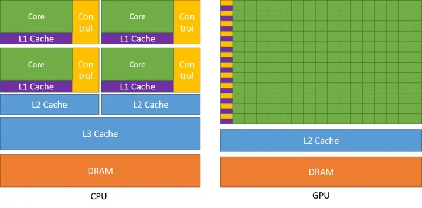

# 目录
- [1.模型压缩的必要性与可行性？](#user-content-1.模型压缩的必要性与可行性？)
- [2.X86和ARM架构在深度学习侧的区别？](#user-content-2.x86和arm架构在深度学习侧的区别？)
- [3.FP32，FP16以及Int8的区别？](#user-content-3.fp32，fp16以及int8的区别？)
- [4.GPU显存占用和GPU利用率的定义](#user-content-4.gpu显存占用和gpu利用率的定义)
- [5.神经网络的显存占用分析](#user-content-5.神经网络的显存占用分析)
- [6.算法模型部署逻辑？](#user-content-6.算法模型部署逻辑？)
- [7.影响模型inference速度的因素？](#user-content-7.影响模型inference速度的因素？)
- [8.为何在AI端侧设备一般不使用传统图像算法？](#user-content-8.为何在ai端侧设备一般不使用传统图像算法？)
- [9.减小模型内存占用有哪些办法？](#user-content-9.减小模型内存占用有哪些办法？)
- [10.有哪些经典的轻量化网络？](#user-content-10.有哪些经典的轻量化网络？)
- [11.模型参数计算？](#user-content-11.模型参数计算？)
- [12.模型FLOPs怎么算？](#user-content-12.模型flops怎么算？)
- [13.什么是异构计算？](#user-content-13.什么是异构计算？)
- [14.端侧部署时整个解决方案的核心指标？](#user-content-14.端侧部署时整个解决方案的核心指标？)
- [15.什么是模型量化？](#user-content-15.什么是模型量化？)
- [16.什么是模型剪枝？](#user-content-16.什么是模型剪枝？)
- [17.主流AI端侧硬件平台有哪些？](#user-content-17.主流ai端侧硬件平台有哪些？)
- [18.主流AI端侧硬件平台一般包含哪些模块？](#user-content-18.主流ai端侧硬件平台一般包含哪些模块？)
- [19.算法工程师该如何看待硬件侧知识？](#user-content-19.算法工程师该如何看待硬件侧知识？)
- [20.现有的一些移动端开源框架？](#user-content-20.现有的一些移动端开源框架？)
- [21.端侧静态多Batch和动态多Batch的区别](#user-content-21.端侧静态多batch和动态多batch的区别)
- [22.优化模型端侧性能的一些方法](#user-content-22.优化模型端侧性能的一些方法)
- [23.ONNX的相关知识](#user-content-23.onnx的相关知识)
- [24.TensorRT的相关知识](#user-content-24.tensorrt的相关知识)
- [25.什么是模型蒸馏？](#user-content-25.什么是模型蒸馏？)
- [26.bfloat16精度和float16精度的区别？](#user-content-26.bfloat16精度和float16精度的区别？)
- [27.AI推理系统介绍](#user-content-27.AI推理系统介绍)
- [28.Nvidia 相关容器镜像使用](#user-content-28.Nvidia相关容器镜像使用)
- [29.常见推理框架介绍](#user-content-29.常见推理框架介绍)
- [30.大模型推理框架介绍](#user-content-30.大模型推理框架介绍)
- [31.TensorRT之trtexec的简单使用介绍](#user-content-31.TensorRT之trtexec的简单使用介绍)
- [32.TensorRT-llm简单介绍](#user-content-32.TensorRT-llm简单介绍)
- [33.PytorchJIT和TorchScript介绍](#user-content-33.PytorchJIT和TorchScript介绍)
- [34.ONNX模型转换及优化](#user-content-34.ONNX模型转换及优化)
- [35.onnxsim的介绍](#user-content-35.onnxsim的介绍)
- [36.TensorRT模型转换](#user-content-36.TensorRT模型转换)
- [37.什么是前端压缩技术和后端压缩技术？](#user-content-37.什么是前端压缩技术和后端压缩技术？)
- [38.在AI领域中模型一共有多少种主流部署形式？](#user-content-38.在AI领域中模型一共有多少种主流部署形式？)
- [39.Jenkins的介绍](#user-content-39.Jenkins的介绍)
- [40.DeepStream的介绍](#user-content-40.DeepStream的介绍)
- [41.介绍一下模型性能优化与模型部署之间的关系](#user-content-41.介绍一下模型性能优化与模型部署之间的关系)
- [42.介绍一下MoE技术](#user-content-42.介绍一下MoE技术)
- [43.目前主流的端侧算力芯片有哪些种类？](#user-content-43.目前主流的端侧算力芯片有哪些种类？)
- [44.什么是GPU内存带宽？](#user-content-44.什么是GPU内存带宽？)
- [45.什么是Page-Attention？](#user-content-45.什么是Page-Attention？)
- [46.什么是Flash-Attention？](#user-content-46.什么是Flash-Attention？)
- [47.如何将AI模型缓存到内存中，这么做有什么好处？](#user-content-47.如何将AI模型缓存到内存中，这么做有什么好处？)
- [48.什么是AI领域的延迟和吞吐量？](#user-content-48.什么是AI领域的延迟和吞吐量？)
- [49.英伟达显卡中Volatile-GPU-Util代表什么含义？](#user-content-49.英伟达显卡中Volatile-GPU-Util代表什么含义？)
- [50.有哪些设计高效CNN架构的方法与经验？](#user-content-50.有哪些设计高效CNN架构的方法与经验？)
- [51.英伟达的GPU架构是什么样的？](#user-content-51.英伟达的GPU架构是什么样的？)
- [52.轻量级模型部署经验分享](#user-content-52.轻量级模型部署经验分享)
- [53.什么是稀疏模型？](#user-content-53.什么是稀疏模型？)
- [54.模型量化有哪些主流的方法？](#user-content-54.模型量化有哪些主流的方法？)


<h2 id="1.模型压缩的必要性与可行性？">1.模型压缩的必要性与可行性？</h2>

模型压缩是指对算法模型进行精简，进而得到一个轻量且性能相当的小模型，压缩后的模型具有更小的结构和更少的参数，可以有效降低计算和存储开销，便于部署在端侧设备中。

随着AI技术的飞速发展，不管是移动端产品还是线上产品，进行AI赋能都成为了趋势。这种情况下，AI算法的实时性与减少内存占用都显得极为重要。AI模型的参数在一定程度上能够表达其复杂性，<font color=DeepSkyBlue>但并不是所有的参数都在模型中发挥作用</font>，部分参数作用有限，表达冗余，甚至会降低模型的性能。

<h2 id="2.x86和arm架构在深度学习侧的区别？">2.X86和ARM架构在深度学习侧的区别？</h2>
  
AI服务器与PC端一般都是使用X86架构，因为其<font color=DeepSkyBlue>高性能</font>；AI端侧设备（手机/端侧盒子等）一般使用ARM架构，因为需要<font color=DeepSkyBlue>低功耗</font>。

X86指令集中的指令是复杂的，一条很长指令就可以很多功能；而ARM指令集的指令是很精简的，需要几条精简的短指令完成很多功能。

X86的方向是高性能方向，因为它追求一条指令完成很多功能；而ARM的方向是面向低功耗，要求指令尽可能精简。

<h2 id="3.fp32，fp16以及int8的区别？">3.FP32，FP16以及Int8的区别？</h2>

常规精度一般使用<font color=OrangeRed>FP32</font>（32位浮点，单精度）占用4个字节，共32位；低精度则使用<font color=OrangeRed>FP16</font>（半精度浮点）占用2个字节，共16位，<font color=OrangeRed>INT8</font>（8位的定点整数）八位整型，占用1个字节等。

混合精度（Mixed precision）指使用FP32和FP16。 使用FP16 可以减少模型一半内存，但有些参数必须采用FP32才能保持模型性能。

虽然INT8精度低，但是数据量小、能耗低，计算速度相对更快，更符合端侧运算的特点。

<font color=DeepSkyBlue>不同精度进行量化的归程中，量化误差不可避免</font>。

在模型训练阶段，梯度的更新往往是很微小的，需要相对较高的精度，一般要用到FP32以上。在inference的阶段，精度要求没有那么高，一般F16或者INT8就足够了，精度影响不会很大。同时低精度的模型占用空间更小了，有利于部署在端侧设备中。

<h2 id="4.gpu显存占用和gpu利用率的定义">4.GPU显存占用和GPU利用率的定义</h2>
  
GPU在训练时有两个重要指标可以查看，即显存占用和GPU利用率。

显存指的是GPU的空间，即内存大小。显存可以用来放模型，数据等。

GPU 利用率主要的统计方式为：在采样周期内，GPU 上有 kernel 执行的时间百分比。可以简单理解为GPU计算单元的使用率。

<h2 id="5.神经网络的显存占用分析">5.神经网络的显存占用分析</h2>
  
Float32 是在深度学习中最常用的数值类型，称为单精度浮点数，每一个单精度浮点数占用4Byte的显存。

在整个神经网络训练周期中，在GPU上的显存占用主要包括：数据，模型参数，模型输出等。

数据侧：举个🌰，一个32*3*128*128的四维矩阵，其占用的显存 = 32*3*128*128*4 /1000 / 1000 = 6.3M

模型侧：占用显存的层包括卷积层，全连接层，BN层，梯度，优化器的参数等。

输出侧：占用的显存包括网络每一层计算出来的feature map以及对应的梯度等。

<h2 id="6.算法模型部署逻辑？">6.算法模型部署逻辑？</h2>

我在之前专门沉淀了一篇关于算法模型部署逻辑的文章，大家可以直接进行阅读取用：
  
[【CV算法上下游】系列之浅谈算法模型部署逻辑](https://mp.weixin.qq.com/s?__biz=Mzg4NDYwOTUwNA==&mid=2247483832&idx=1&sn=3eecfbd284fd9baa7215a7b152416ba8&chksm=cfb4d937f8c350219ecf5d91a95aaf717df77d80aa1c9ad923d59063b92a851abb1ad886df13&scene=21#wechat_redirect)

<h2 id="7.影响模型inference速度的因素？">7.影响模型inference速度的因素？</h2>

1. FLOPs（模型总的加乘运算）
2. MAC（内存访问成本）
3. 并行度（模型inference时操作的并行度越高，速度越快）
4. 计算平台（GPU，AI协处理器，CPU等）

<h2 id="8.为何在ai端侧设备一般不使用传统图像算法？">8.为何在AI端侧设备一般不使用传统图像算法？</h2>
  
AI端侧设备多聚焦于深度学习算法模型的加速与赋能，而传统图像算法在没有加速算子赋能的情况下，在AI端侧设备无法发挥最优的性能。

<h2 id="9.减小模型内存占用有哪些办法？">9.减小模型内存占用有哪些办法？</h2>

1. 模型剪枝
2. 模型蒸馏
3. 模型量化
4. 模型结构调整

<h2 id="10.有哪些经典的轻量化网络？">10.有哪些经典的轻量化网络？</h2>

1. SqueezeNet
2. MobileNet
3. ShuffleNet
4. Xception
5. GhostNet

<h2 id="11.模型参数计算？">11.模型参数计算？</h2>

首先，假设卷积核的尺寸是$K \times K$，有$C$个特征图作为输入，每个输出的特征图大小为$H \times W$，输出为$M$个特征图。

由于模型参数量主要由卷积，全连接层，BatchNorm层等部分组成，我们以卷积的参数量为例进行参数量的计算分析：
  
卷积核参数量：

$$M\times C\times K\times K$$

偏置参数量：

$$M$$

总体参数量：

$$M\times C\times K\times K + M$$

<h2 id="12.模型flops怎么算？">12.模型FLOPs怎么算？</h2>

同样，我们假设卷积核的尺寸是$K\times K$，有$C$个特征图作为输入，每个输出的特征图大小为$H \times W$，输出为$M$个特征图。

由于在模型中卷积一般占计算量的比重是最高的，我们依旧以卷积的计算量为例进行分析：

<font color=DeepSkyBlue>FLOPS（全大写）</font>：是floating point operations per second的缩写，意指每秒浮点运算次数，理解为计算速度。是一个衡量硬件性能的指标。

<font color=DeepSkyBlue>FLOPs（s小写）</font>：是floating point operations的缩写（s表示复数），意指浮点运算数，理解为计算量。可以用来衡量算法/模型的复杂度。

针对模型的计算量应该指的是FLOPs。

在上述情况下，卷积神经网络一次前向传播需要的乘法运算次数为：

$$H\times W\times M\times C\times K\times K$$

同时，所要进行的加法计算次数分为考虑偏置和不考虑偏置：

(1)考虑偏置的情况：

为了得到输出的特征图的一个未知的像素，我们需要进行
$$(C\times K\times K - 1) + (C - 1) + 1 = C \times K \times K$$
次加法操作，其中$K\times K$大小的卷积操作需要$K\times K - 1$次加法，由于有C个通道，所以需要将结果乘以C，每个通道间的数要相加，所以需要C - 1次加法，最后再加上偏置的1次加法。

所以总的加法计算量如下：

$$H\times W\times M\times C\times K\times K$$

所以总的卷积运算计算量（乘法+加法）：

$$2 \times H\times W\times M\times C\times K\times K$$

(2)不考虑偏置的情况：

总的卷积计算量：

$$H\times W\times M\times (2\times C\times K\times K - 1)$$


<h2 id="13.什么是异构计算？">13.什么是异构计算？</h2>

首先，<font color=DeepSkyBlue>异构现象</font>是指不同计算平台之间，由于硬件结构(包括计算核心和内存)，指令集和底层软件实现等方面的不同而有着不同的特性。

<font color=DeepSkyBlue>异构计算是指联合使用两个或者多个不同的计算平台，并进行协同运算</font>。比如CPU和GPU的异构计算，TPU和GPU的异构计算以及TPU/GPU/CPU的异构计算等等。

<h2 id="14.端侧部署时整个解决方案的核心指标？">14.端侧部署时整个解决方案的核心指标？</h2>

1. 精度
2. 耗时
3. 内存占用
4. 功耗

<h2 id="15.什么是模型量化？">15.什么是模型量化？</h2>

通常的深度学习模型参数是FP32浮点型的，而<font color=DeepSkyBlue>模型量化主要是使用FP16，INT8以及INT4等低精度类型来保存模型参数，从而有效的降低模型计算量和内存占用，并将精度损失限制在一个可接受的范围内</font>。

模型量化主要分在线量化和离线量化。在线量化在模型训练阶段采用量化方法进行量化。离线量化主要在模型离线工具（模型转换阶段）中采用量化方法进行量化。

<font color=DeepSkyBlue>工业界中主要使用离线量化作为通用模型量化的解决方案。</font>

<h2 id="16.什么是模型剪枝？">16.什么是模型剪枝？</h2>

<font color=DeepSkyBlue>模型剪枝按照剪枝粒度可分为突触剪枝、神经元剪枝、权重矩阵剪枝等，主要是将权重矩阵中不重要的参数设置为0，结合稀疏矩阵来进行存储和计算</font>。通常为了保证性能，需要逐步进行迭代剪枝，让精度损失限制在一个可接受的范围。

突触剪枝剪掉神经元之间的不重要的连接。对应到权重矩阵中，相当于将某个参数设置为0。

神经元剪枝则直接将某个节点直接裁剪。对应到权重矩阵中，相当于某一行和某一列置零。

除此之外，也可以将整个权重矩阵裁剪，每一层中只保留最重要的部分，这就是权重矩阵剪枝。相比突触剪枝和神经元剪枝，权重矩阵剪枝压缩率要大很多。

<h2 id="17.主流ai端侧硬件平台有哪些？">17.主流AI端侧硬件平台有哪些？</h2>

1. 英伟达
2. 海思
3. 寒武纪
4. 比特大陆
5. 昇腾
6. 登临
7. 联咏
8. 安霸
9. 耐能
10. 爱芯
11. 瑞芯

<h2 id="18.主流ai端侧硬件平台一般包含哪些模块？">18.主流AI端侧硬件平台一般包含哪些模块？</h2>

1. 视频编解码模块
2. CPU核心处理模块
3. AI协处理器模块
4. GPU模块
5. DSP模块
6. DDR内存模块
7. 数字图像处理模块

<h2 id="19.算法工程师该如何看待硬件侧知识？">19.算法工程师该如何看待硬件侧知识？</h2>

GPU乃至硬件侧的整体逻辑，是CV算法工作中必不可少的组成部分，也是算法模型所依赖的重要物理载体。

<h3 id="gpu的相关知识">GPU的相关知识</h3>

现在AI行业有个共识，认为是数据的爆发和算力的突破开启了深度学习在计算机视觉领域的“乘风破浪”，而其中的算力，主要就是指以GPU为首的计算平台。

GPU（Graphical Processing Unit）从最初用来进行图形处理和渲染（玩游戏），到通过CUDA/OpenCL库以及相应的工程开发之后，成为深度学习模型在学术界和工业界的底层计算工具，其有以下的一些特征：

1. 异构计算：GPU能作为CPU的协处理器与CPU协同运算。
2. 单指令流多数据流（SIMD）架构：使得同一个指令（比如对图像数据的一些操作），可以同时在多个像素点上<font color=DeepSkyBlue>并行计算</font>，从而得到比较大的吞吐量，深度学习中大量的矩阵操作，让GPU成为一个非常适合的计算平台。
3. 多计算核心。比如Nvidia的GTX980GPU中，在和i7-5960CPU差不多的芯片面积上，有其128倍的运算速度。GTX980中有16个流处理单元，每个流处理单元中包含着128个CUDA计算核心，共有2048个GPU运算单元，与此同时i7-5960CPU只有16个类似的计算单元。
4. CUDA模块。作为GPU架构中的最小单元，它的设计和CPU有着非常类似的结构，其中包括了一个浮点运算单元，整型运算单元以及控制单元。一个流处理单元中的CUDA模块将执行同一个指令，但是会作用在不同的数据上。多CUDA模块意味着GPU有更加高的计算性能，但<font color=DeepSkyBlue>更重要的是在算法侧有没有高效地调度和使用</font>。
5. 计算核心频率。即时钟频率，代表每一秒内能进行同步脉冲次数。就核心频率而言，CPU要高于GPU。由于GPU采用了多核逻辑，即使提高一些频率，其实对于总体性能影响不会特别大。
6. 内存架构。GPU的多层内存架构包括全局内存，2级缓存，和芯片上的存储（包括寄存器，和1级缓存共用的共享内存，只读/纹理缓存和常量缓存）。


在使用GPU时，在命令行输入nvidia-smi命令时会打印出一张表格，其中包含了GPU当时状态的所有参数信息。


CUDA/cuDNN/OpenCL科普小知识：

1. CUDA是NVIDIA推出的用于GPU的并行计算框架。
2. cuDNN是NVIDIA打造的针对深度神经网络的加速库，是一个用于深层神经网络的GPU加速库。
3. OpenCL是由苹果（Apple）公司发起，业界众多著名厂商共同制作的面向异构系统通用目的并行编程的开放式、免费标准，也是一个统一的编程环境。

<h3 id="深度学习的端侧设备">深度学习的端侧设备</h3>

深度学习的端侧设备，又可以叫做边缘计算设备，深度学习特别是CV领域中，<font color=DeepSkyBlue>模型+端侧设备的组合能够加快业务的即时计算，决策和反馈能力，极大释放AI可能性</font>。


深度学习的端侧设备主要由ARM架构的CPU+ GPU/TPU/NPU等协处理器 + 整体功耗 + 外围接口 + 工具链等部分组成，也是算法侧对端侧设备进行选型要考虑的维度。

在实际业务中，根据公司的不同，算法工程师涉及到的硬件侧范围也会不一样。如果公司里硬件和算法由两个部门分别负责，那么算法工程师最多接触到的硬件侧知识就是<font color=DeepSkyBlue>硬件性能评估，模型转换与模型硬件侧验证，一些硬件高层API接口的开发与使用</font>；如果公司里没有这么细分的部门，那么算法工程师可能就会接触到端侧的视频编解码，模型推理加速，Opencv，FFmpeg，Tensor RT，工具链开发等角度的知识。


<h3 id="算法工程师该如何看待硬件侧">算法工程师该如何看待硬件侧</h3>

首先，整体上还是要将<font color=DeepSkyBlue>硬件侧工具化，把端侧设备当做算法模型的一个下游载体，会熟练的选型与性能评估更加重要</font>。

端侧设备是算法产品整体解决方案中一个非常重要的模块，<font color=DeepSkyBlue>算法+硬件</font>的范式将在未来的边缘计算与万物智能场景中持续发力。

在日常业务中，<font color=DeepSkyBlue>算法模型与端侧设备的适配性与兼容性</font>是必须要考虑的问题，端侧设备是否兼容一些特殊的网络结构？算法模型转化并部署后，精度是否下降？功耗与耗时能否达标？等等都让算法工程师的模型设计逻辑有更多的抓手。

<h2 id="20.现有的一些移动端开源框架？">20.现有的一些移动端开源框架？</h2>

1. NCNN，其GitHub地址：https://github.com/Tencent/ncnn
2. Paddle Lite，其GitHub地址：https://github.com/PaddlePaddle/paddle-mobile
3. MACE（ Mobile AI Compute Engine），其GitHub地址：https://github.com/XiaoMi/mace
4. TensorFlow Lite，其官网地址：https://www.tensorflow.org/lite?hl=zh-cn
5. PocketFlow，其GitHub地址：https://github.com/Tencent/PocketFlow
6. 等等。。。

<h2 id="21.端侧静态多batch和动态多batch的区别">21.端侧静态多Batch和动态多Batch的区别</h2>

当设置静态多Batch后，如Batch=6，那么之后不管是输入2Batch还是4Batch，都会按照6Batch的预设开始申请资源。

而动态多Batch不用预设Batch数，会根据实际场景中的真实输入Batch数来优化资源的申请，提高端侧实际效率。

由于动态多Batch的高性能，通常Inference耗时和内存占用会比静态多Batch时要大。

<h2 id="22.优化模型端侧性能的一些方法">22.优化模型端侧性能的一些方法</h2>

1. 设计能最大限度挖掘AI协处理器性能的模型结构。
2. 多模型共享计算内存。
3. 减少模型分支结构，减少模型元素级操作。
4. 卷积层的输入和输出特征通道数相等时MAC最小，以提升模型Inference速度。

<h2 id="23.onnx的相关知识">23.ONNX的相关知识</h2>

ONNX是一种神经网络模型的框架，其最经典的作用是作为不同框架之间的中间件，成为模型表达的一个通用架构，来增加不同框架之间的交互性。
  
<font color=DeepSkyBlue>ONNX的优势</font>：
1. ONNX的模型格式有极佳的细粒度。
2. ONNX是模型表达的一个通用架构，主流框架都可以兼容。
3. ONNX可以实现不同框架之间的互相转化。

<h2 id="24.tensorrt的相关知识">24.TensorRT的相关知识</h2>
  
TensorRT是一个高性能的深度学习前向Inference的优化器和运行的引擎。
  
<font color=DeepSkyBlue>TensorRT的核心</font>：将现有的模型编译成一个engine，类似于C++的编译过程。在编译engine过程中，会为每一层的计算操作找寻最优的算子方法，将模型结构和参数以及相应kernel计算方法都编译成一个二进制engine，因此在部署之后大大加快了推理速度。

我们需要给TensorRT填充模型结构和参数，也就是解析我们自己的模型结构和参数文件，获取数据放到其中。官方给了三种主流框架模型格式的解析器（parser），分别是：ONNX，Caffe以及TensorFlow。
  
<font color=DeepSkyBlue>TensorRT的优势</font>：

1. 把一些网络层进行了合并。具体🌰如下图所示。
2. 取消一些不必要的操作。比如不用专门做concat的操作等。
3. TensorRT会针对不同的硬件都相应的优化，得到优化后的engine。
4. TensorRT支持INT8和FP16的计算，通过在减少计算量和保持精度之间达到一个理想的trade-off。
  


<h2 id="25.什么是模型蒸馏？">25.什么是模型蒸馏？</h2>

模型蒸馏（Model Distillation）是一种模型压缩技术，旨在将一个**大型复杂模型（通常称为“教师模型”）**的知识转移到一个**小型简单模型（称为“学生模型”）**中。

模型蒸馏技术最开始由Hinton等人于2015年提出，主要用于改进小型模型的性能，使其在保持较低计算成本的同时，能够逼近大型模型的性能。

### 模型蒸馏的基本原理

模型蒸馏的基本思想是使用大型模型的输出（软标签）来训练小型模型。

大型模型的输出通常包含了关于类别概率的更多信息，这些信息比硬标签（即实际的类别标签）更能表达不同类别之间的相对关系。通过训练小型模型去学习逼近这些软标签，小型模型可以学习到更细致的决策边界。

### 模型蒸馏的步骤

1. **训练教师模型**：
   教师模型通常是一个大型深度网络，能够在AI细分任务上达到SOTA精度。

2. **生成软标签**：
   使用教师模型对训练数据集进行预测，记录输出的类别概率（软标签）。这些概率不仅表示最可能的类别，还提供了对其他类别的预测概率，包含了更丰富的信息。

3. **训练学生模型**：
   学生模型的结构比教师模型简单，其训练过程不仅使用真实的标签（硬标签），还使用教师模型生成的软标签。通常，训练过程中会使用一个**温度参数（T）**来调整软标签的"软化"程度。损失函数是硬标签的损失和软标签的损失的加权和。

4. **评估学生模型**：
   在独立的测试数据上评估学生模型的性能，验证其是否成功学习到了教师模型的知识。

### 温度调整（Temperature Scaling）

在蒸馏过程中，温度参数`T`用于控制软标签的平滑程度。较高的温度会使得概率分布更加平滑，使得学生模型能够从教师模型的预测中学到更细微的差别。损失函数通常是交叉熵损失，计算学生模型预测和软标签之间的差异。

### 模型蒸馏的优势

- **效率提升**：学生模型通常比教师模型更小、更快，适合部署在资源受限的环境中。
- **泛化能力**：学生模型通过学习教师模型的软标签，通常可以获得比直接训练更好的泛化能力。

### 实际应用

模型蒸馏已被广泛应用于多种任务，如AI绘画、图像分类、图像分割、目标检测、语音识别和自然语言处理等，特别是在需要模型部署到移动设备或需要实时处理的场景中。

总之，模型蒸馏是提高模型部署效率的有效技术，特别适合于需要在保持模型性能的同时减小模型大小和提升计算速度的应用场景。

<h2 id="26.bfloat16精度和float16精度的区别？">26.bfloat16精度和float16精度的区别？</h2>

### BFLOAT16

**定义与结构**：
BFLOAT16是一种16位宽的浮点数格式，由Google针对Tensor Processing Units (TPUs)开发，特别适用于AI算法应用。它的结构如下：
- 1位符号位
- 8位指数
- 7位尾数

这种格式与标准的32位浮点数（FP32）共享相同的指数范围，但尾数精度较低。这意味着BFLOAT16在表示大范围数值时与FP32相近，但在表示精度上有所折衷。

**优点**：
- **较大的动态范围**：与Float16相比，BFLOAT16能够表示更大范围的数值，这归功于它更大的指数范围。这对于深度学习中的梯度和归一化运算非常重要，因为这些操作可能涉及广泛的数值范围。
- **与FP32兼容性好**：由于指数位与FP32相同，BFLOAT16可以无损地转换为FP32，这简化了混合精度训练的实现，同时减少了转换过程中的精度损失。

**缺点**：
- **较低的数值精度**：因为尾数位只有7位，相比于Float16的10位尾数，BFLOAT16在表示精确数值时的能力较弱。

### Float16(FP16)

**定义与结构**：
Float16是IEEE定义的16位浮点数标准，结构如下：
- 1位符号位
- 5位指数
- 10位尾数

Float16提供了较FP32更低的精度和较小的数值范围，但在存储和计算效率上具有优势。

**优点**：
- **较高的数值精度**：Float16的10位尾数提供了比BFLOAT16更高的精度，适合需要高精度计算的应用。
- **计算加速**：在支持Float16运算的硬件上（如GPU），使用Float16可以显著加速计算过程，尤其是在AI模型训练和推理中。

**缺点**：
- **较小的动态范围**：Float16的5位指数提供的动态范围较小，可能导致在一些AI训练场景中出现梯度消失或爆炸问题。
- **兼容性问题**：Float16到FP32的转换可能会涉及更复杂的数值调整，可能导致精度损失。

### 应用场景

- **BFLOAT16**：由于其较大的动态范围和与FP32的良好兼容性，非常适合用于AI模型的训练和推理，尤其是在Google的TPU上。
- **Float16**：适用于对计算精度要求较高的场景，并且在NVIDIA及其他厂商的GPU上得到了广泛支持，尤其适合于需要加速的AI算法任务。
<h2 id="27.AI推理系统介绍">27.AI推理系统介绍</h2>

### 推理系统简述
推理系统是用于部署人工智能模型，执行推理预测任务的人工智能系统，类似传统 Web 服务或移动端应用系统的作用。通过推理系统，可以将深度学习模型部署到云端或者边缘端，并服务和处理用户的请求。模型训练过程好比是传统软件工程中的代码开发的过程，而开发完的代码势必要打包，部署给用户使用，那么推理系统就负责应对模型部署和服务生命周期中遇到的挑战和问题。<br>
当推理系统将完成训练的模型进行部署和服务时，需要考虑设计和提供模型压缩（轻量化，剪枝、量化、蒸馏），负载均衡，请求调度，加速优化，多副本和生命周期管理等支持。相比深度学习框架等为训练而设计的系统，推理系统不仅关注低延迟，高吞吐，可靠性等设计目标，同时受到资源，服务等级协议，功耗等约束。
推理阶段不同于训练阶段，只需要执行前向传播过程，将输入样本计算为输出标签。<br>
### 推理系统的特点
1) 模型被部署为长期运行的服务
服务有明确对请求的低延迟（Low Latency）和高吞吐（High Throughput）需求。例如，互联网服务一般都有明确的响应时间延迟约束，保证用户体验，同时需要应对爆发增长的用户产生的高吞吐请求的响应需求。
2) 推理有更苛刻的资源约束
更小的内存，更低的功耗等。例如，手机的资源要远小于数据中心的商用服务器。
3) 推理不需要反向传播梯度下降
可以牺牲一定的数据精度。例如，模型本身不再被更新，可以通过量化，稀疏性等手段牺牲一定精度换取一定的性能提升。
4) 部署的设备型号更加多样
需要多样的定制化的优化。例如，相比服务器端可以通过 Docker 等手段解决环境问题。移动端显得更为棘手，手机有多种多样的平台与操作系统，IOT 设备有不同的芯片和上层软件栈，需要工具与系统提供编译以减少用户适配代价。
<h2 id="28.Nvidia相关容器镜像使用">28.Nvidia相关容器镜像使用</h2>

通过拉取镜像创建容器，可以免去繁琐的繁琐的环境安装步骤，只需要宿主机上安装Nvidia驱动即可，拉取的镜像中已经配置好cuda，tensorrt，tritonserver等相关需要的环境。以tritonserver为例介绍如何使用镜像，以及介绍triton框架的使用
## 环境搭建
1) 镜像拉取
```sh
docker pull nvcr.io/nvidia/tritonserver:23.01-py3
```
在拉取镜像的时候，需要检查镜像版本和NVIDIA驱动是否匹配，镜像的版本号和驱动版本存在对应关系,参考文档：<https://docs.nvidia.com/deeplearning/triton-inference-server/release-notes/index.html>

2) 启动镜像
```sh
docker run -dt --gpus=all -p 1237:22 --name triton -v /home/xxiao/code:/workspace/code nvcr.io/nvidia/tritonserver:23.01-py3
```
--gpus该参数在下文config中详细讲解
报错解决：

运行docker的时候添加参数：
```sh
--cap-add=SYS_ADMIN --security-opt seccomp=unconfined
```

3) 进去docker镜像后，执行
```sh
tritonserver --model-repository=./model_repository
```
--model-repository：该参数指定模型路径，必须要有
--help：查看其他参数
日志相关：--log-verbose=1 --log-info=true
目录结构如下

triton server会加载该目录下的所有模型，在资源足够的情况下，可以通过一个triton server启动所有的推理服务
config.pbtxt内容如下
```
name: "sam_embedding_onnx"
platform: "onnxruntime_onnx"
max_batch_size : 0
input [
  {
    name: "images"
    data_type: TYPE_FP32
    dims: [ 1, 3, 1024, 1024 ]
  }
]
output [
  {
    name: "image_embeddings"
    data_type: TYPE_FP32
    dims: [ 1, 256, 64, 64 ]
  },
  {
    name: "interm_embeddings"
    data_type: TYPE_FP32
    dims: [ 1, 32, 256, 256 ]
  }
]
instance_group [
    {
      count: 1
      kind: KIND_GPU
      gpus: [1]
    }
  ]
```
各个字段含义
```txt
name：model-repository目录下的模型名称，需要保持一致
platform：推理框架选择，实例选择的是onnx模型，对应的为onnxruntime_onnx
常见平台有以下：
    1、tensorflow_savedmodel: TensorFlow SavedModel 格式。
    2、tensorflow_graphdef: TensorFlow GraphDef 格式。
    3、tensorflow_cc: TensorFlow C++ 库。
    4、pytorch_libtorch: PyTorch 的 LibTorch C++ 库。
    5、onnxruntime_onnx: ONNX 运行时（ONNX Runtime）。
    6、tensorrt_plan: NVIDIA TensorRT 的计划模型（plan file）。
    7、custom: 自定义平台，允许用户自行实现推理后端。
max_batch_size：当定义为0时，动态输入
input：定义模型的输入节点，（目前看来必须满足NCHW和NHWC格式），
    name：输入节点名称
    data_type：根据实际数据精度填写
    dims：输入shape
output：模型输出节点，同输入信息定义
instance_group：设备信息定义
    count：启动实例个数
    kind：设备类型（CPU、GPU，可能NPU）
    gpus：模型运行在那个GPU上。
triton server服务是以多进程的方式运行，--gpus指定了多少块GPU就会启动多少个进程，模型会运行在instance_group/gpus指定的gpu上，若不指定gpu，则在所有的gpu上运行
```
启动triton server服务成功后，会开启三个端口供访问，

8000：HTTPService
8001：GRPCInferenceService
8002：Metrics Service

客户端访问实例：
```python
import numpy as np
import tritonclient.http as httpclient
triton_client = httpclient.InferenceServerClient(url="localhost:8000", verbose=False)
model_name = "sam_embedding_onnx"
inputs = []
inputs.append(httpclient.InferInput('images',[1, 3, 1024, 1024], "FP32"))
inputs[0].set_data_from_numpy(np.random.randn(1, 3, 1024, 1024).astype(np.float32),binary_data=False)

outputs = []
outputs.append(httpclient.InferRequestedOutput('image_embeddings'))
outputs.append(httpclient.InferRequestedOutput('interm_embeddings'))
results = triton_client.infer(model_name,inputs, outputs=outputs)
print(results.as_numpy('interm_embeddings').shape)
print(results.as_numpy('image_embeddings').shape)
```
triton server只负责模型加载和推理，有关具体模型的前后处理，需要在客户端代码中实现
### 参考项目
https://github.com/yuxiaoranyu/stable_diffusion_trt_triton
该项目使用tensorrt和triton部署stable_diffusion 图生图模块

<h2 id="29.常见推理框架介绍">29.常见推理框架介绍</h2>

### onnxruntime
onnxruntime是微软推出的一款推理框架，用户可以非常便利的用其运行一个onnx模型。onnxruntime支持多种运行后端，包括CPU、GPU、TensorRT、DML等。
### TensorRT
TensorRT是一个高性能的深度学习推理优化器，可以为深度学习应用提供低延迟、高吞吐率的模型部署。TensorRT可用于对超大规模数据中心、嵌入式平台或自动驾驶平台进行推理加速。TensorRT现在已经能支持TensorFlow、caffe、mxnet、pytorch等几乎所有的深度学习框架，将TensorRT和Nvidia的GPU结合起来，能在几乎所有的框架中进行快速和高效的部署推理。
### OpenVino
OpenVino是英特尔针对自家硬件平台开发的一套深度学习工具库，包含推理库、模型优化等一些列与深度学习模型部署相关的功能。OpenVino是一个比较成熟且仍在快速发展的推理库，提供的demo和sample都很充足，上手比较容易，可以用来快速部署开发，尤其是Intel的硬件平台上性能超过了大部分的开源库。
### Tengine
Tengine是OPEN AI LAB（开放智能）推理的AI推理框架，致力于解决AIoT应用场景下多厂家多种类的边缘AI芯片与多样的训练框架、算法模型之间的相互兼容适配，同时提升算法在芯片上的运行性能，将从云端完成训练后的算法高效迁移到异构的边缘智能芯片上执行，缩短AI应用开发与部署周期，助力加速AI产业化落地。
### NCNN
NCNN是一个为手机端极致优化的高性能神经网络前向计算框架。NCNN从设计之初深刻考虑手机端的部署和应用。无第三方依赖、跨平台，手机端cpu的速度快于目前所有已知的开源框架。目前已在腾讯多款应用中使用，如QQ、Qzone、微信等。
### MNN
MNN是一个高效、轻量的深度学习框架。它支持深度模型推理与训练，尤其在端侧的推理与训练性能在业界处于领先地位。目前MNN已经在阿里巴巴的手机淘宝、天猫、优酷、钉钉、闲鱼等20多个app中使用，覆盖直播、短视频、搜多推荐、商品图像搜索、互动营销、券已发放、安全风控等70多个场景。
### TFLite
TensorFlowLite是Google在2017年5月推出的轻量级机器学习解决方案，主要针对移动端设备和嵌入式设备。针对移动端设备特点，TensorFlow Lite是用来诸多技术对内核进行了定制优化，预熔激活，量子化内核。
<h2 id="30.大模型推理框架介绍">30.大模型推理框架介绍</h2>

### vLLM
vLLM全称Virtual Large Language Model，由Nvidia开源，旨在降低大模型推理的显存占用。其核心思想是将模型的一部分保存在CPU内存或硬盘上，只将当前计算所需的部分加载到GPU显存中，从而打破GPU显存限制。<br>
vLLM支持PyTorch和FasterTransformer后端，可无缝适配现有模型。使用vLLM，在配备96GB内存+440GB A100的服务器上可运行1750亿参数模型，在配备1.5TB内存+880GB A100的服务器上可运行6万亿参数模型。
### TensorRT-LLM
Tensorrt-LLM是Nvidia在TensorRT推理引擎基础上，针对Transformer类大模型推理优化的框架。主要特性包括：
1) 支持多种优化技术，如kernel融合、矩阵乘优化、量化感知训练等，可提升推理性能
2) 支持多GPU多节点部署，可扩展到万亿规模参数
3) 提供Python和C++ API，易于集成和部署
在Nvidia测试中，基于OPT-30B在A100上的推理，Tensorrt-LLM可实现最高32倍加速。
### DeepSpeed
DeepSpeed是微软开源的大模型训练加速库，最新的DeepSpeed-Inference也提供了推理加速能力，主要特点包括：
1) 通过内存优化、计算优化、通信优化，降低推理延迟和提升吞吐
2) 支持多GPU横向扩展，单卡可推理数百亿参数模型
3) 提供Transformer、GPT、BERT等模型的推理示例
4) 集成Hugging Face transformers库，使用简单
在GPT-NeoX测试中，基于DeepSpeed的推理相比原生PyTorch可实现7.7倍加速。
### Text Generation Inference
Text Generation Inference(简称TextGen)是Hugging Face主导的开源推理框架，旨在为自然语言生成模型如GPT、OPT等提供高性能推理。主要特点包括：
1) 高度优化的核心代码，支持FP16、int8等多种精度
2) 支持多GPU多节点扩展，可推理万亿规模参数
3) 良好的用户体验，提供Python高层API，简化开发
4) 支持Hugging Face生态中的模型，如GPT2、GPT-Neo、BLOOM等

在OPT-175B基准测试中，TextGen可实现最高17倍推理加速。

<h2 id="31.TensorRT之trtexec的简单使用介绍">31.TensorRT之trtexec的简单使用介绍</h2>

### 简介
trtexec是一种无需开发自己的应用程序即可快速使用 TensorRT 的工具。trtexec工具有三个主要用途：
1) 它对于在随机或用户提供的输入数据上对网络进行基准测试很有用。
2) 它对于从模型生成序列化引擎很有用。
3) 它对于从构建器生成序列化时序缓存很有用。
### 转换模型（onnx为例）
1) 将ONNX模型转换为静态batchsize的TensorRT模型，启动所有精度以达到最佳性能，工作区大小设置为1024M
```
trtexec --onnx=mnist.onnx --explicitBatch --saveEngine=mnist.trt --workspace=1024 --best
```
2) 将ONNX模型转换为动态batchsize的TensorRT模型，启动所有精度以达到最佳性能，工作区大小设置为1024M
```
trtexec --onnx=mnist.onnx --minShapes=input:<shape_of_min_batch> --optShapes=input:<shape_of_opt_batch> --maxShapes=input:<shape_of_max_batch> --saveEngine=mnist.trt --best --workspace=1024 --best
```
–minShapes，–optShapes ，–maxShapes必须全部设置，设置的形式为：NCHW

### 运行模型
1) 在具有静态输入形状的全维模式下运行 ONNX 模型
```
trtexec --onnx=model.onnx --shapes=input:32x3x224x224
```
2) 使用给定的输入形状在全维模式下运行 ONNX 模型
```
trtexec --onnx=model.onnx --shapes=input:32x3x224x224
```
3) 使用一系列可能的输入形状对 ONNX 模型进行基准测试
```
trtexec --onnx=model.onnx --minShapes=input:1x3x224x224 --optShapes=input:16x3x224x224 --maxShapes=input:32x3x224x224 --shapes=input:5x3x224x224
```
### 网络性能测试
1) 加载转换后的TensorRT模型进行性能测试，指定batch大小
```
trtexec --loadEngine=mnist16.trt --batch=1
```
2) 收集和打印时序跟踪信息
```
trtexec --deploy=data/AlexNet/AlexNet_N2.prototxt --output=prob --exportTimes=trace.json
```
3) 使用多流调整吞吐量<br>调整吞吐量可能需要运行多个并发执行流。例如，当实现的延迟完全在所需阈值内时，我们可以增加吞吐量，即使以一些延迟为代价。例如，为批量大小 1 和 2 保存引擎并假设两者都在 2ms 内执行，延迟阈值：
```
trtexec --deploy=GoogleNet_N2.prototxt --output=prob --batch=1 --saveEngine=g1.trt --int8 --buildOnly
trtexec --deploy=GoogleNet_N2.prototxt --output=prob --batch=2 --saveEngine=g2.trt --int8 --buildOnly
```
保存的引擎可以尝试找到低于 2 ms 的组合批次/流，以最大化吞吐量：
```
trtexec --loadEngine=g1.trt --batch=1 --streams=2
trtexec --loadEngine=g1.trt --batch=1 --streams=3
trtexec --loadEngine=g1.trt --batch=1 --streams=4
trtexec --loadEngine=g2.trt --batch=2 --streams=2
```
### 参考文档
<https://github.com/NVIDIA/TensorRT/tree/main/samples/trtexec>

<h2 id="32.TensorRT-llm简单介绍">32.TensorRT-llm简单介绍</h2>

### 简介
TensorRT-LLM（NVIDIA官方支持）用于在NVIDIA GPU平台做大模型推理部署工作。<br>
TRT-LLM基于TensorRT来将LLM构建为engine模型

TRT-LLM目前支持多种大模型，可以直接使用，在example中，而且还在以非常快的速度支持新的模型

TRT-LLM支持单机单卡、单机多卡（NCCL）、多机多卡，支持量化（8/4bit）

TRT-LLM的runtime支持chat和stream两种模式

TRT-LLM当前支持python和cpp（可以直接使用cpp，也可以使用cpp的bybind接口）两种模式的runtime

通过example下的各个模型的build.py来构建离线模型，通过example下的run.py（不同的业务适配一下run.py中的逻辑即可）来运行模型

TRT-LLM默认支持kv-cache，支持PagedAttention，支持flashattention，支持MHA/MQA/GQA等

### 安装使用
docker编译安装
```
// docker方式编译
step1: 安装操作系统匹配的docker，参考docker安装方式即可
step2: 下载 tensorrt-llm代码

# TensorRT-LLM uses git-lfs, which needs to be installed in advance.
apt-get update && apt-get -y install git git-lfs

git clone https://github.com/NVIDIA/TensorRT-LLM.git
cd TensorRT-LLM
git submodule update --init --recursive
git lfs install
git lfs pull
// 上述每步都需要执行成功，由于网络问题，可能会失败，失败后重复执行，直到成功位置
// git lfs 这两步会将 tensorrt-llm/cpp/tensort-llm/batch_manager 下面的静态库 下载下来，后来编译会用到
batch_manager/
├── aarch64-linux-gnu
│   ├── libtensorrt_llm_batch_manager_static.a
│   ├── libtensorrt_llm_batch_manager_static.pre_cxx11.a
│   └── version.txt
├── x86_64-linux-gnu
│   ├── libtensorrt_llm_batch_manager_static.a
│   └── libtensorrt_llm_batch_manager_static.pre_cxx11.a
└── x86_64-windows-msvc
    └── tensorrt_llm_batch_manager_static.lib

step3：编译llm，提供了两种方式
方式一：一步到位的编译方式，推荐这种
make -C docker release_build  // 编译，此处cuda/tensorrt/cudnn/nccl等版本都是采用编译脚本中默认设置的
                              // 编译成功后，为一个docker镜像，大概有20多G，另外，docker方式编译对磁盘空间大小有要求
                              // 目前估计需要50G左右，如果docker的根目录空间不够，编译也会失败，可以通过给docker根目
                              //  扩容或者修改根目录来实现，保证编译空间的足够

make -C docker release_run // 运行编译成功的镜像, 此处需要有gpu办卡，如果在没有gpu的环境上，可以编译成功，但是执行会失败

方式二：逐步进行编译，编译结果和上述一致
```
编译有2种包，一种是仅包含cpp的代码包，一种是cpp+python的wheel包
```
//  仅cpp的代码包 ： 仅编译 TensorRT-LLM/cpp 下面的c++和cuda代码
// cpp + python的包： 编译 TensorRT-LLM/cpp 和 TensorRT-LLM/tensortrt-llm 下面的c++ cuda python代码
```
### 参考文档
<https://github.com/NVIDIA/TensorRT-LLM/blob/release/0.5.0/docs/source/installation.md>
<h2 id="33.PytorchJIT和TorchScript介绍">33.PytorchJIT和TorchScript介绍</h2>

### 简介
PyTorch支持两种模式：eager模式和script模式。eager模式主要用于模型的编写、训练和调试，script模式主要是针对部署的，其包含PytorchJIT和TorchScript  <br>
script模式使用torch.jit.trace和torch.jit.script创建一个PyTorch eager module的中间表示（intermediate representation, IR），IR 经过内部优化，并在运行时使用 PyTorch JIT 编译。PyTorch JIT 编译器使用运行时信息来优化 IR。该 IR 与 Python 运行时是解耦的。
PyTorch JIT（Just-In-Time Compilation）是 PyTorch 中的即时编译器。

它允许你将模型转化为 TorchScript 格式，从而提高模型的性能和部署效率。
JIT 允许你在动态图和静态图之间无缝切换。你可以在 Python 中以动态图的方式构建和调试模型，然后将模型编译为 TorchScript 以进行优化和部署。
JIT 允许你在不同的深度学习框架之间进行模型转换，例如将 PyTorch 模型转换为 ONNX 格式，从而可以在其他框架中运行。
TorchScript 是 PyTorch 提供的一种将模型序列化以便在其他环境中运行的机制。它将 PyTorch 模型编译成一种中间表示形式，可以在没有 Python 解释器的环境中运行。这使得模型可以在 C++ 等其他语言中运行，也可以在嵌入式设备等资源受限的环境中实现高效的推理。


TorchScript 的特性和用途：
1) 静态图表示形式：TorchScript 是一种静态图表示形式，它在模型构建阶段对计算图进行编译和优化，而不是在运行时动态构建。这可以提高模型的执行效率。
2) 模型导出：TorchScript 允许将 PyTorch 模型导出到一个独立的文件中，然后可以在没有 Python 环境的设备上运行。
3) 跨平台部署：TorchScript 允许在不同的深度学习框架之间进行模型转换，例如将 PyTorch 模型转换为 ONNX 格式，从而可以在其他框架中运行。
4) 模型优化和量化：通过 TorchScript，你可以使用各种技术（如量化）对模型进行优化，从而减小模型的内存占用和计算资源消耗。
5) 融合和集成：TorchScript 可以帮助你将多个模型整合到一个整体流程中，从而提高系统的整体性能。
6) 嵌入式设备：对于资源受限的嵌入式设备，TorchScript 可以帮助你优化模型以适应这些环境。

为什么要用script模式呢？

1) 可以脱离python GIL以及python runtime的限制来运行模型，比如通过LibTorch通过C++来运行模型。这样方便了模型部署，例如可以在IoT等平台上运行。例如这个tutorial，使用C++来运行pytorch的model。
2) PyTorch JIT是用于pytorch的优化的JIT编译器，它使用运行时信息来优化 TorchScript modules，可以自动进行层融合、量化、稀疏化等优化。因此，相比pytorch model，TorchScript的性能会更高。
### 使用
```
import torch

# 假设已经存在模型model
# 创建模型输入tensor
input_tensor = torch.rand(1, 3, 640, 640)
jit_model = torch.jit.trace(model, input_tensor)
torch.jit.save(jit_model, "model.pt")
```
<h2 id="34.ONNX模型转换及优化">34.ONNX模型转换及优化</h2>

### 转换
```
import torch

# 假设已经存在模型model
# 创建模型输入tensor
input_tensor = torch.rand(1, 3, 640, 640)
input_names = ["input"]
output_names = ["output"]
# 设置动态shape
dynamic_axes = {'input': {0: 'batch_size'}, 
                'output': {0: 'batch_size'}}
onnx_model = "model.onnx"
torch.onnx.export(model, input_tensor, 'model.onnx', input_names=input_names, output_names=output_names, dynamic_axes=dynamic_axes, opset_version=13)
```
当模型较大时，需要进行一定优化，如stable diffusers中的unet模型
### 优化
```
import onnx
import onnx_graphsurgeon as gs
import torch
from onnx import shape_inference
from polygraphy.backend.onnx.loader import fold_constants
from torch.onnx import export

class Optimizer:
    def __init__(self, onnx_graph, verbose=False):
        self.graph = gs.import_onnx(onnx_graph)
        self.verbose = verbose

    def info(self, prefix):
        if self.verbose:
            print(
                f"{prefix} .. {len(self.graph.nodes)} nodes, {len(self.graph.tensors().keys())} tensors, {len(self.graph.inputs)} inputs, {len(self.graph.outputs)} outputs"
            )

    def cleanup(self, return_onnx=False):
        self.graph.cleanup().toposort()
        if return_onnx:
            return gs.export_onnx(self.graph)

    def select_outputs(self, keep, names=None):
        self.graph.outputs = [self.graph.outputs[o] for o in keep]
        if names:
            for i, name in enumerate(names):
                self.graph.outputs[i].name = name

    def fold_constants(self, return_onnx=False):
        onnx_graph = fold_constants(gs.export_onnx(self.graph), allow_onnxruntime_shape_inference=True)
        self.graph = gs.import_onnx(onnx_graph)
        if return_onnx:
            return onnx_graph

    def infer_shapes(self, return_onnx=False):
        onnx_graph = gs.export_onnx(self.graph)
        if onnx_graph.ByteSize() > 2147483648:
            raise TypeError("ERROR: model size exceeds supported 2GB limit")
        else:
            onnx_graph = shape_inference.infer_shapes(onnx_graph)

        self.graph = gs.import_onnx(onnx_graph)
        if return_onnx:
            return onnx_graph

def optimize(onnx_graph, name, verbose):
    opt = Optimizer(onnx_graph, verbose=verbose)
    opt.info(name + ": original")
    opt.cleanup()
    opt.info(name + ": cleanup")
    opt.fold_constants()
    opt.info(name + ": fold constants")
    opt.infer_shapes()
    opt.info(name + ': shape inference')
    onnx_opt_graph = opt.cleanup(return_onnx=True)
    opt.info(name + ": finished")
    return onnx_opt_graph

model_path = "model.onnx"
shape_inference.infer_shapes_path(model_path, model_path)
model_opt_graph = optimize(onnx.load(model_path), name="model", verbose=True)
```

<h2 id="35.onnxsim的介绍">35.onnxsim的介绍</h2>

### 简介
ONNX-Simplifier（简称onnxsim）是一个开源工具，用于简化ONNX（Open Neural Network Exchange）模型。它通过合并模型中的冗余节点和优化操作来减少模型的大小和复杂性，从而提高模型的执行效率。这个工具是由华为诺亚方舟实验室开发的，并且是作为Python包发布的。

onnxsim的主要功能包括：

1) 节点融合：将多个操作融合为一个操作，减少节点数量，从而减少模型的大小和提高推理速度。
2) 冗余操作消除：移除模型中的冗余操作，如恒等操作或对结果没有影响的操作。
3) 常数折叠：在模型中直接计算可导出为常数的表达式，减少推理时的计算量。
4) 优化形状和类型：优化模型中的张量形状和类型，以减少内存使用和提高效率。
### 使用
```
import onnx
from onnxsim import simplify

# 加载ONNX模型
model_path = 'model.onnx'
onnx_model = onnx.load(model_path)
# 简化模型
model_simplified, check = simplify(onnx_model)
# 检查简化是否成功
assert check, "Simplified ONNX model could not be validated"
# 保存简化后的模型
onnx.save(model_simplified, 'path/to/simplified/model.onnx')
```
命令行使用
```
python -m onnxsim model.onnx model_sim.onnx

```
<h2 id="36.TensorRT模型转换">36.TensorRT模型转换</h2>

假设已经存在onnx模型
```
import sys
import tensorrt as trt

def convert_models(onnx_path: str, output_path: str, fp16: bool = False):

    # 初始化配置
    TRT_LOGGER = trt.Logger(trt.Logger.VERBOSE)
    TRT_BUILDER = trt.Builder(TRT_LOGGER)
    TRT_RUNTIME = trt.Runtime(TRT_LOGGER)
    # 创建一个网络定义，并设置EXPLICIT_BATCH标志以支持批处理大小。
    network = TRT_BUILDER.create_network(
        1 << int(trt.NetworkDefinitionCreationFlag.EXPLICIT_BATCH))
    onnx_parser = trt.OnnxParser(network, TRT_LOGGER)
    print("onnx_path: ", onnx_path)
    parse_success = onnx_parser.parse_from_file(onnx_path)
    for idx in range(onnx_parser.num_errors):
        print(onnx_parser.get_error(idx))
    if not parse_success:
        sys.exit("ONNX model parsing failed")
    print("Load Onnx model done")

    # 获取网络的输入和输出信息
    inputs = [network.get_input(i) for i in range(network.num_inputs)]
    outputs = [network.get_output(i) for i in range(network.num_outputs)]
    for inp in inputs:
        print(f'input "{inp.name}" with shape{inp.shape} {inp.dtype}')
    for out in outputs:
        print(f'output "{out.name}" with shape{out.shape} {out.dtype}')
    # 创建一个优化配置文件profile，并设置输入节点的动态形状范围。
    profile = TRT_BUILDER.create_optimization_profile()

    profile.set_shape("input", (1, 3, 224, 224), (1, 3, 640, 640), (1, 3, 640, 640))
    
    # 创建一个构建器配置config，并将优化配置文件添加到其中。如果需要，还可以设置FP16精度模式。
    config = TRT_BUILDER.create_builder_config()
    config.add_optimization_profile(profile)
    config.set_preview_feature(trt.PreviewFeature.DISABLE_EXTERNAL_TACTIC_SOURCES_FOR_CORE_0805, True)
    if fp16:
        config.set_flag(trt.BuilderFlag.FP16)

    # 构建TensorRT engine，并将其序列化
    plan = TRT_BUILDER.build_serialized_network(network, config)
    if plan is None:
        sys.exit("Failed building engine")
    print("Succeeded building engine")
    # 反序列化engine，并保存
    engine = TRT_RUNTIME.deserialize_cuda_engine(plan)

    # save TRT engine
    with open(output_path, "wb") as f:
        f.write(engine.serialize())

if __name__ == "__main__":
    onnx_path = "model.onnx"
    output_path = "model.plan"
    fp16 = True
    convert_models(onnx_path, output_path, fp16)

```

<h2 id="37.什么是前端压缩技术和后端压缩技术？">37.什么是前端压缩技术和后端压缩技术？</h2>

在AI领域，模型压缩技术用于减少模型的大小和计算量，从而使模型更易于部署在资源受限的环境，如移动设备和嵌入式系统中。模型压缩可以在训练的不同阶段实施，通常分为前端压缩（前期压缩）和后端压缩（后期压缩）两种技术。下面Rocky详细介绍这两种技术的特点和应用。

### 模型前端压缩技术（前期压缩）

**前端压缩主要指在模型训练过程中或训练开始前使用的模型压缩技术**。这些技术的目标是减少训练过程中模型的计算和存储需求，或优化模型结构以便更有效地训练。常见的模型前端压缩技术包括：

1. **网络剪枝（Network Pruning）**：在训练初期或训练过程中移除模型中的冗余参数（如权重接近零的神经元）。这可以是结构化剪枝（如移除整个卷积核或神经网络层）或非结构化剪枝（如随机移除单个权重）。

2. **知识蒸馏（Knowledge Distillation）**：在训练过程中，使用一个大的、已训练好的教师模型来指导一个结构更简单的学生模型。通过这种方式，学生模型学习到教师模型的输出行为，而具有更少的参数和计算需求。

3. **低秩分解（Low-Rank Factorization）**：在模型训练之前，将大的权重矩阵分解为几个小的矩阵的乘积，这样可以减少模型参数的数量并降低存储和计算成本。**低秩分解技术在AIGC时代持续繁荣，成为LoRA系列模型的核心思想**。

4. **设计轻量化网络**：从头开始设计轻量级的网络架构，如MobileNet、ShuffleNet等，这些网络结构特别适用于移动和嵌入式系统。

### 模型后端压缩技术（后期压缩）

**后端压缩主要发生在模型训练完成后，目的是减少模型部署时的资源需求**。这些技术使得模型更适合部署在资源受限的设备上。常见的后端压缩技术包括：

1. **量化（Quantization）**：将模型中的浮点数权重转换为低精度的格式（如从32位浮点数转换为8位整数）。这可以显著减少模型的内存占用，并可能加速模型的推理速度。

2. **进一步的网络剪枝**：在模型训练完成后，进行额外的剪枝操作，进一步移除不重要的权重或神经元，以优化模型大小和推理速度。

3. **二值化或三值化（Binarization/Ternarization）**：将权重量化为最极端的低比特形式，即所有权重只有1位（二值）或2位（三值），这极大地减少了模型的大小并提升了运算效率。

4. **编码和压缩**：应用编码技术，如霍夫曼编码，减少模型文件的实际大小，便于存储和传输。

### 结论

前端压缩和后端压缩技术各有优势和应用场景。前端压缩有助于在模型设计和训练阶段建立高效的网络结构，而后端压缩则更专注于模型部署前的优化。结合使用这两种技术可以有效地缩减模型大小，提升运算效率，并使深度学习模型更易于在各种计算场景。

<h2 id="38.在AI领域中模型一共有多少种主流部署形式？">38.在AI领域中模型一共有多少种主流部署形式？</h2>

**AI领域发展至今，Rocky认为目前主要有三大核心方向，包括AIGC、传统深度学习以及自动驾驶**。以下是这些领域中主流的模型部署形式：

### 1. AIGC领域的模型部署

**a. 云端部署**
- **特点**：模型部署在云服务器上，用户通过API调用服务进行内容生成。
- **优势**：可扩展，易于更新和维护，适合处理大量并发请求。
- **应用示例**：OpenAI的GPT-4模型作为API服务提供，用户可以通过互联网调用模型生成文本。

**b. 客户端部署**
- **特点**：模型部署在用户的设备上，如PC或移动设备。
- **优势**：保护用户数据隐私，减少网络延迟。
- **应用示例**：Adobe Photoshop的内容感知工具，可在用户设备上直接运行，不需数据上传到云端。

### 2. 深度学习领域的模型部署

**a. 云端部署**
- **特点**：模型部署在云服务器上，利用云计算的强大计算能力进行数据处理和模型推理。
- **优势**：提供强大的计算资源，易于扩展，便于管理。
- **应用示例**：在图像识别、语音识别等需要大规模数据处理的应用中，云端部署可以快速处理来自全球的请求。

**b. 边缘部署**
- **特点**：模型直接部署在本地设备上，如智能手机、IoT设备或本地服务器。
- **优势**：减少数据传输时间，提高响应速度，增强隐私保护。
- **应用示例**：在移动应用中，如实时语言翻译和增强现实（AR），模型在本地设备上运行，以实现低延迟和离线功能。

### 3. 自动驾驶领域的模型部署

**a. 车载部署**
- **特点**：模型直接部署在车辆的计算平台上，处理来自车载传感器的数据。
- **优势**：实时处理传感器数据，快速做出驾驶决策。
- **应用示例**：自动驾驶汽车中的决策系统，如特斯拉Autopilot，需要在车辆内部快速处理来自摄像头、雷达和其他传感器的数据。

**b. 云端部署**
- **特点**：某些控制功能和监控系统部署在云端控制中心。
- **优势**：可以进行更复杂的数据分析，实时监控和调整车辆行为。
- **应用示例**：远程监控和调度系统，可用于管理自动驾驶车队，例如在无人配送服务中进行调度和监控。

总之，AI模型的部署形式应根据具体的应用需求、数据敏感性、可用资源和所需的响应时间来决定。不同的部署策略具有各自的优势和限制，理解这些可以帮助我们选择最适合特定需求的部署方法。

<h2 id="39.Jenkins的介绍">39.Jenkins的介绍</h2>

### 什么是Jenkins？
Jenkins，原名为Hudson，是一个自由及开源的自动化工具，用于支持软件开发中的持续集成与持续部署。<br>
开源的自动化工具: Jenkins是一个开放源代码软件，意味着任何人都可以查看它的源代码、对其进行修改和贡献。开源使得Jenkins能够免费提供，并确保其长期的发展和维护。<br>
持续集成与持续部署的核心组件: Jenkins为开发团队提供了一个平台，使其能够自动化各种任务，例如代码构建、测试、部署等。这种自动化使得开发流程更为流畅，可以快速地发现和修复问题，从而加快软件的发布速度。

### Jenkins的作用
1) 代码构建:
Jenkins支持多种编程语言和构建工具，从Java的Maven或Gradle，到JavaScript的npm或yarn，再到Python的pip，Jenkins都能轻松应对。这种自动化构建不仅仅是为了编译源代码，它还确保了在每次代码提交后，项目都是可构建的，从而避免了“在我机器上可以运行”的问题。
2) 测试自动化:
仅仅构建代码并不足够。我们还需要确保代码的质量和功能的正确性。通过Jenkins，我们可以轻松地在每次代码提交或定期的基础上运行测试用例，从单元测试到集成测试再到UI测试。
3) 自动部署:
当代码被成功构建并通过所有测试后，下一步就是将其部署到目标环境中。不论是传统的物理服务器、虚拟机，还是现代的容器和云平台，Jenkins都可以与各种部署工具和平台集成，实现代码的自动部署。

在实际开发中，需要考虑如何快速有效部署开发完成的项目，无论是在边端还是云端，这时候就需要自动化工具的配合了

<h2 id="40.DeepStream的介绍">40.DeepStream的介绍</h2>

### 简介

DeepStream 是NVIDIA提供的一个流分析工具包，专为构建AI驱动的多传感器处理、视频、图像分析应用而设计。它利用NVIDIA的GPU加速技术，提供从边缘到云的高性能视频分析能力。DeepStream SDK支持多种数据源，包括摄像头、视频文件和实时流媒体，使其成为智能城市、零售分析、工业自动化和医疗成像等领域的理想选择。

DeepStream的核心在于其能够处理大量数据流，并利用深度学习模型进行实时分析。它不仅支持传统的计算机视觉任务，如物体检测和分类，还支持更复杂的任务，如行为识别和场景理解。

### 支持的平台和操作系统
DeepStream SDK广泛支持多种平台和操作系统，确保开发者可以在他们偏好的环境中工作。

1) NVIDIA Jetson系列：包括Jetson Nano、Jetson TX2、Jetson Xavier NX和Jetson AGX Xavier等，这些设备特别适合边缘计算和嵌入式系统。
2) x86架构的PC和服务器：支持Windows和Linux操作系统，适用于需要高性能GPU加速的桌面和服务器应用。
3) 云平台：如NVIDIA GPU Cloud (NGC)，允许用户在云端部署DeepStream应用，适用于需要大规模扩展的场景。<br>

DeepStream还支持多种Linux发行版，包括Ubuntu和Red Hat Enterprise Linux等，以及Windows 10和Server版本。这种广泛的平台支持使得DeepStream能够适应各种部署环境，从单个设备到分布式系统。

### DeepStream的主要功能和优势
DeepStream提供了一系列强大的功能，使其在视频分析领域中脱颖而出：

1) 高性能处理：利用NVIDIA的GPU加速，DeepStream能够处理高分辨率视频流，实现实时分析，即使在处理多个视频源时也能保持高性能。

2) 灵活的插件架构：DeepStream基于GStreamer框架，允许开发者通过插件扩展其功能。这种模块化的设计使得添加新的数据源、处理步骤或输出方式变得简单。

3) 集成AI模型：DeepStream支持使用NVIDIA的TAO Toolkit和TensorRT优化和部署深度学习模型，确保最佳的推理性能。

4) 端到端解决方案：从数据摄取到结果输出，DeepStream提供了一个完整的工具链，支持从模型训练到部署的全过程。

5) 易于集成和扩展：DeepStream的API设计简洁，易于集成到现有系统中，同时也支持自定义开发，满足特定需求。

DeepStream的优势在于其强大的性能、灵活的架构和广泛的平台支持，使其成为开发实时视频分析应用的首选工具。无论是初创公司还是大型企业，DeepStream都能提供必要的工具和资源，帮助他们快速开发和部署创新的AI应用。

<h2 id="41.介绍一下模型性能优化与模型部署之间的关系">41.介绍一下模型性能优化与模型部署之间的关系</h2>

在AI行业中，模型性能优化与模型部署密切相关，两者相辅相成。**性能优化旨在提高模型的训练效率、推理速度和整体性能**，而**成功的模型部署需要确保模型在实际应用环境中的高效运行**。下面Rocky详细讨论一下模型性能优化和模型部署之间的关系。

### 模型性能优化

**1. 训练阶段的性能优化**
- **数据并行和模型并行**：使用多个GPU或分布式计算来加速训练过程。
- **混合精度训练**：使用16位浮点数（FP16）和32位浮点数（FP32）混合进行训练，减少显存占用并加速计算。
- **高效的优化算法**：使用优化算法如Adam、LAMB等，加速模型的收敛速度。
- **自动化超参数调优**：使用自动化工具（如Optuna、Hyperopt）调优超参数，提高模型性能。

**2. 推理阶段的性能优化**
- **模型剪枝**：移除不重要的神经元或权重，减少模型的计算量。
- **量化**：将模型权重和激活函数从浮点数转换为整数，减少计算和存储需求。
- **蒸馏**：通过一个大模型（教师模型）指导一个小模型（学生模型）进行训练，从而在保持性能的前提下减少模型复杂度。
- **编译优化**：使用深度学习编译器（如TensorRT、TVM）对模型进行底层优化，提高推理速度。

### 模型部署

**1. 部署环境**
- **云端部署**：适用于需要大规模计算资源的应用，能够利用云计算的弹性和高性能。
- **边缘部署**：适用于资源受限的设备，如移动设备、物联网设备等，需要特别的优化以确保高效运行。
- **本地部署**：适用于隐私敏感或需要低延迟的应用，模型需要在本地设备上高效运行。

**2. 部署过程中的挑战**
- **计算资源受限**：边缘设备和嵌入式设备的计算能力和存储资源有限，需要对模型进行优化。
- **实时性要求**：许多应用要求低延迟和高吞吐量，模型必须能够快速响应。
- **能耗限制**：移动设备和物联网设备对能耗有严格要求，模型需要在节能模式下高效运行。
- **兼容性**：模型需要兼容不同的硬件和软件平台，如不同的操作系统、硬件加速器等。

### 模型性能优化与部署的关系

1. **模型性能优化助力部署**：模型性能优化直接影响部署效果。通过剪枝、量化、蒸馏和编译优化等方法，可以大幅减少模型的计算量和存储需求，从而确保模型在边缘设备或嵌入式设备上的高效运行。
  
2. **部署驱动模型性能优化**：部署需求驱动性能优化。在决定部署环境和硬件平台时，需要根据实际应用场景进行针对性的性能优化。例如，在移动设备上部署模型时，需要重点考虑量化和低功耗优化；在云端部署时，则可以更多地利用分布式计算和高性能硬件。

3. **互相迭代改进**：性能优化和部署是一个迭代过程。在实际部署过程中，可能会遇到未预见的问题，如延迟高、内存不足等。这需要不断调整优化策略，重新训练和微调模型，确保部署效果满足应用需求。

4. **硬件加速器的利用**：优化策略应与部署硬件特性相匹配。对于GPU、TPU、FPGA等不同硬件加速器，需要采用相应的编译优化和模型调整策略，以充分利用硬件性能，提高推理效率。

5. **自动化工具的使用**：自动化工具在优化和部署中起到重要作用。自动化超参数调优、自动化编译和部署工具（如TensorFlow Serving、ONNX Runtime）可以显著简化工作流程，提高效率和部署效果。

### 结论

Rocky认为，不管是在AIGC、传统深度学习还是自动驾驶领域，模型性能优化和模型部署之间存在紧密的联系，优化不仅提高了模型在训练和推理阶段的效率，还直接影响模型在实际应用中的部署效果。通过合理的优化策略和部署方法，可以确保AI模型在各种环境中高效、可靠地运行。随着技术的不断进步，模型性能优化和部署将变得更加智能化和自动化，为广泛应用AI技术提供更强有力的支持。

<h2 id="42.介绍一下MoE技术">42.介绍一下MoE技术</h2>

### MoE（Mixture of Experts）概念

在AI领域中，MoE（Mixture of Experts，专家混合模型）是一种集成学习方法，它通过将多个子模型（通常称为“专家模型”）组合在一起，从而提高整体模型的性能。MoE的核心思想是使用一个门控网络（Gating Network）来决定每个输入样本应该由哪些专家模型来处理，或者说设置每个专家模型对输入样本的贡献程度。

### 工作原理

MoE的工作原理可以分为以下几个步骤：

1. **专家模型（Experts）**：这是多个子模型，每个模型擅长于处理某类特定的输入或任务。这些专家模型可以是同一种类型的模型（如多个神经网络）或不同类型的模型（如神经网络、决策树、支持向量机等）。

2. **门控网络（Gating Network）**：这是一个单独的网络，用于根据输入数据来确定每个专家模型的权重。门控网络输出一组权重，这些权重表示每个专家模型对当前输入的贡献。

3. **加权组合**：将门控网络输出的权重与对应的专家模型输出进行加权平均，从而得到最终的预测结果。

### 数学表示

假设我们有 \( K \) 个专家模型 \( E_i \) 和一个门控网络 \( G \)：

- 对于一个输入 \( x \)，每个专家 \( E_i \) 会给出一个预测 \( y_i \)。
- 门控网络 \( G \) 会输出一组权重 \( \alpha_i \)（满足 \( \sum_{i=1}^{K} \alpha_i = 1 \)），这些权重用于加权各专家的输出。
- 最终输出 \( y \) 通过如下方式得到：

\[ y = \sum_{i=1}^{K} \alpha_i \cdot y_i \]

### 优点

1. **灵活性**：MoE允许不同的专家模型专注于不同的输入区域或任务，从而提高模型的泛化能力。
2. **可解释性**：通过分析门控网络的输出权重，可以理解哪些专家模型在不同的情况下起到了主要作用。
3. **高效性**：在计算资源有限的情况下，MoE可以通过启用少数几个专家模型来处理每个输入，从而提高计算效率。

### 应用

1. **AIGC领域**
2. **传统深度学习领域**
3. **自动驾驶领域**

### 例子：Switch Transformer

Switch Transformer是谷歌提出的一种大规模语言模型，它利用了MoE的架构。其核心思想是：

- 每个Transformer层包含多个专家模型（子模型），但每个输入token只会选择少数几个专家进行计算。
- 通过门控网络决定每个token使用哪些专家，从而大幅度减少计算量并提高模型的可扩展性。

### 总结

MoE（Mixture of Experts）是一种强大的机器学习方法，通过组合多个专家模型并利用门控网络动态地分配权重，能够有效提升模型的性能和灵活性。尽管实现复杂，但在处理大规模数据和复杂任务时，MoE展示出了巨大的潜力和优势。


<h2 id="43.目前主流的端侧算力芯片有哪些种类？">43.目前主流的端侧算力芯片有哪些种类？</h2>

AI端侧算力设备（如NPU、TPU、VPU、FPGA等）目前正在快速发展，这些设备专门设计用于加速AIGC、传统深度学习、自动驾驶等领域任务。它们在性能和效率方面大大超过了传统的CPU和GPU。以下是Rocky对这些AI端侧算力的详细介绍：

### 1. NPU（Neural Processing Unit）
NPU，即神经处理单元，是一种专门用于加速神经网络计算的处理器。NPU通常集成在移动设备、物联网设备和其他嵌入式系统中，以提升AI应用的性能。

#### 特点与优势：
- **高效能耗比**：NPU在进行神经网络计算时具有高能效，适用于资源受限的设备。
- **专用硬件设计**：为了优化矩阵运算和卷积操作，NPU设计了专门的硬件加速器。
- **实时处理**：NPU能实现低延迟的实时AI推理，非常适合智能手机、摄像头等需要实时处理的设备。
- **集成性强**：NPU常与其他处理单元（如CPU、GPU）集成在同一个芯片上（如SoC），以提供全面的计算能力。

### 2. TPU（Tensor Processing Unit）
TPU，即张量处理单元，是Google开发的一种专用AI加速器，主要用于加速TensorFlow框架下的机器学习任务。

#### 特点与优势：
- **高性能**：TPU能够提供极高的计算能力，特别是在处理大规模矩阵运算和深度学习模型训练时。
- **定制化设计**：TPU为特定的AI工作负载（如矩阵乘法、卷积运算）进行了优化，显著提升了性能。
- **大规模部署**：TPU被广泛部署在Google的数据中心，用于支持Google的各项AI服务，如搜索、广告、翻译等。

#### 版本和架构：
- **TPU v1**：主要用于推理任务，每秒可执行92万亿次浮点运算（92 TFLOPS）。
- **TPU v2**和**TPU v3**：增强了训练能力，分别具有每秒180 TFLOPS和420 TFLOPS的计算能力。
- **TPU v4**：最新版本，进一步提升了性能和能效，适用于更大规模、更复杂的AI任务。


### 3. VPU（Vision Processing Unit）
VPU，即视觉处理单元，是一种专门设计用于计算机视觉和人工智能任务的处理器。VPUs的主要目标是以高效的能耗比处理复杂的视觉计算任务，适用于各种嵌入式和边缘设备。

####  特点与优势：
  - VPU专注于低功耗的计算机视觉任务，适用于嵌入式系统和边缘设备。
  - 提供高效的图像处理和神经网络推理能力。

### 4. FPGA（Field Programmable Gate Array）
FPGA，即现场可编程门阵列，是一种高度可编程的集成电路，可以根据特定应用的需求重新配置其硬件电路。FPGA在AI和机器学习中广泛应用于需要高灵活性和低延迟的任务。

####  特点与优势：
  - FPGA具有高度灵活性，可根据需求重新配置电路结构。
  - 提供较低的延迟和高效的能耗比，适用于特定AI任务的加速。
  - 能够实现高度并行计算，适用于实时处理应用。

### 5. Huawei Ascend
华为昇腾系列AI处理器包括适用于云端和边缘计算的多种型号，提供高性能的AI计算能力。
#### 特点与优势：
  - 华为的昇腾系列AI芯片，包括适用于云端和边缘计算的不同版本，如Ascend 910（高性能）和Ascend 310（边缘计算）。
  - 提供高度集成的AI计算能力，支持多种AI框架和模型。

### 6. Graphcore IPU（Intelligence Processing Unit）
Graphcore IPU是一种专门设计用于机器智能任务的处理器，采用全新的计算架构，优化了计算和内存访问。
#### 特点与优势：
  - IPU专为机器智能任务设计，采用了全新的计算架构，优化了计算和内存访问。
  - 能够高效处理稀疏计算和动态计算图，适用于复杂的AI模型。

### 总结
这些AI端侧设备显著提升了AIGC、传统深度学习、自动驾驶任务的性能和能效，推动了AI技术的快速发展和应用扩展。不同的加速器在设计上各有侧重，适用于不同的应用场景，满足了多样化的AI计算需求。


<h2 id="44.什么是GPU内存带宽？">44.什么是GPU内存带宽？</h2>

**GPU内存带宽（Memory Bandwidth）是指GPU从其内存 (vRAM)中读取或写入数据的速度，通常以每秒千兆字节（GB/s）为单位。这一指标非常重要，因为它直接影响到GPU在处理复杂计算任务时的数据传输效率，进而影响整体性能。**

### 内存带宽的组成

GPU内存带宽由以下几个部分组成：

1. **时钟频率**：内存的工作频率，通常以MHz或GHz为单位。更高的频率意味着更快的数据传输速度。
2. **内存总线宽度**：内存总线的宽度，通常以位（bits）为单位。常见的总线宽度有256位、384位等。总线越宽，数据传输能力越强。
3. **内存类型**：不同类型的显存（如GDDR5、GDDR6、HBM等）具有不同的性能和效率。新型内存通常具有更高的频率和更宽的总线。

### 计算公式

内存带宽的计算公式为：

$$\text{内存带宽} = \text{内存频率} \times \text{总线宽度} \times \text{数据传输速率}$$

对于双倍数据速率（DDR）的内存，每个时钟周期传输两次数据，因此数据传输速率为2。

举个例子，如果一个GPU使用GDDR6显存，频率为1750 MHz，总线宽度为256位，那么它的内存带宽计算如下：

$$\text{内存带宽} = 1750 \, \text{MHz} \times 256 \, \text{bits} \times 2 / 8 \, \text{(bits to bytes)} = 112 \, \text{GB/s}$$

### 内存带宽的重要性

内存带宽对于GPU的性能至关重要，尤其是在以下应用场景中：

1. **高性能计算（HPC）**：在进行科学计算、金融建模等高性能计算任务时，内存带宽影响数据的快速传输和处理。
2. **图形渲染**：复杂的图形渲染任务，如实时光线追踪（Ray Tracing），需要高带宽来处理大量的纹理和图像数据。
3. **AI领域（AIGC、传统深度学习、自动驾驶）**：训练和推理AI模型需要频繁访问大量数据，高内存带宽可以提高训练速度和推理效率。

Rocky认为我们通过理解和优化GPU内存带宽，可以显著提升计算任务的效率和性能，尤其在高要求的AI模型训练与推理任务中尤为重要。

<h2 id="45.什么是Page-Attention？">45.什么是Page-Attention？</h2>

### 为什么要使用Page-Attention
LLM推理过程通常分为两个阶段：prefill和decode。通常会使用KV cache技术加速推理。

1) 预填充阶段。在这个阶段中，整段prompt喂给模型做forward计算。如果采用KV cache技术，在这个阶段中我们会把prompt过后得到的保存在cache k和cache v中。这样在对后面的token计算attention时，无需对前面的token重复计算了，可以节省推理时间。

在上面的图例中，假设prompt中含有3个token，prefill阶段结束后，这三个token相关的KV值都被装进了cache。
2) decode阶段，在这个阶段中，根据prompt的prefill结果，一个token一个token地生成response。
同样，如果采用了KV cache，则每走完一个decode过程，就把对应response token的KV值存入cache中，以便能加速计算。例如对于图中的t4，它与cache中t0~t3的KV值计算完attention后，就把自己的KV值也装进cache中。对t6也是同理。

由于Decode阶段的是逐一生成token的，因此它不能像prefill阶段那样能做大段prompt的并行计算，所以在LLM推理过程中，Decode阶段的耗时一般是更大的。
从上述过程中，我们可以发现使用KV cache做推理时的一些特点：

- 随着prompt数量变多和序列变长，KV cache也变大，对gpu显存造成压力
- 由于输出的序列长度无法预先知道，所以很难提前为KV cache量身定制存储空间
### Page-Attention原理
虚拟内存的分页管理技术
- 将物理内存划分为固定大小的块，称每一块为页（page）。从物理内存中模拟出来的虚拟内存也按相同的方式做划分
- 对于1个进程，不需要静态加载它的全部代码、数据等内容。想用哪部分，或者它当前跑到哪部分，就动态加载这部分到虚拟内存上，然后由虚拟内存做物理内存的映射。
- 对于1个进程，虽然它在物理内存上的存储不连续（可能分布在不同的page中），但它在自己的虚拟内存上是连续的。通过模拟连续内存的方式，既解决了物理内存上的碎片问题，也方便了进程的开发和运行。

Page-Attention可在不连续的显存空间存储连续的 key 和 value。用于将每个序列的 KV cache 分块（blocks），每块包含固定数量的 token 的 key 和 value 张量。

可以看到for的attention计算，KV cache 被划分为多个块，块在内存空间中不必连续
因为 blocks 在显存中不必连续，所以可以像虚拟内存分页一样，以更灵活的方式管理键和值：
- 将 block 视为 page
- 将 token 视为 bytes
- 将序列视为进程
序列的连续逻辑块通过 block table 映射到非连续物理块。物理块可在生成新 token 时按需分配。因此只有最后一个block会发生显存浪费，小于4%。

通过 block table 将逻辑块映射到物理块

在并行采样时，同一个 prompt 生成多个输出序列，这些序列生成时可以共享 prompt 的 attention 计算和显存。
与 OS 中进程共享物理 page 的方式类似，不同序列可以通过将其逻辑块映射到同一物理块来共享块。为了确保共享安全，Paged Attention 跟踪物理块的引用计数，并实现 “写时复制”（Copy-on-Write）机制，即需要修改时才复制块副本。内存共享使得显存占用减少 55%，吞吐量提升 2.2x。

注：写时复制（Copy-on-write，简称COW）是一种计算机程序设计领域的优化策略。其核心思想是，如果有多个调用者（callers）同时请求相同资源（如内存或磁盘上的数据存储），他们会共同获取相同的指针指向相同的资源，直到某个调用者试图修改资源的内容时，系统才会真正复制一份专用副本（private copy）给该调用者，而其他调用者所见到的最初的资源仍然保持不变。

<h2 id="46.什么是Flash-Attention？">46.什么是Flash-Attention？</h2>

GPU的内存由多个不同大小和不同读写速度的内存组成。内存越小，读写速度越快。对于A100-40GB来说，内存分级图如下所示

- SRAM内存分布在108个流式多处理器上，每个处理器的大小为192K，合计为192*108KB=20.25MB
相当于计算块，但内存小
- 高带宽内存HBM（High Bandwidth Memory），也就是我们常说的显存，大小为40GB。SRAM的读写速度为19TB/s，而HBM的读写速度只有1.5TB/s，不到SRAM的1/10
相当于计算慢，但内存大

在标准注意力实现中，注意力的性能主要受限于内存带宽，是内存受限的，频繁地从HBM中读写N * N 的矩阵是影响性能的主要瓶颈。稀疏近似和低秩近似等近似注意力方法虽然减少了计算量FLOPs，但对于内存受限的操作，运行时间的瓶颈是从HBM中读写数据的耗时，减少计算量并不能有效地减少运行时间(wall-clock time)。

针对内存受限的标准注意力，Flash Attention是IO感知的，目标是避免频繁地从HBM中读写数据，减少对HBM的读写次数，有效利用更高速的SRAM来进行计算是非常重要的，而对于性能受限于内存带宽的操作，进行加速的常用方式就是kernel融合，该操作的典型方式分为三步：
1) 每个kernel将输入数据从低速的HBM中加载到高速的SRAM中
2) 在SRAM中，进行计算
3) 计算完毕后，将计算结果从SRAM中写入到HBM中

但SRAM的内存大小有限，不可能一次性计算完整的注意力，因此必须进行分块计算，使得分块计算需要的内存不超过SRAM的大小。
分块计算的难点在于softmax的分块计算，softmax与矩阵K的列是耦合的，通过引入了两个额外的统计量m(x),l(x)来进行解耦，实现了分块计算。需要注意的是，可以利用GPU多线程同时并行计算多个block的softmax。为了充分利用硬件性能，多个block的计算不是串行（sequential）的,而是并行的。

总的来说，Flash Attention通过调整注意力的计算顺序，引入两个额外的统计量进行分块计算，避免了实例化完整的N×N 的注意力矩阵S,P，将显存复杂度从$O(N^2)$降低到了$O(N)$


<h2 id="47.如何将AI模型缓存到内存中，这么做有什么好处？">47.如何将AI模型缓存到内存中，这么做有什么好处？</h2>

**在AI领域应用中，将AI模型缓存到内存中是一种提高模型推理性能的常见做法**。缓存模型可以减少每次推理时模型加载的时间，尤其是在模型需要频繁访问或调用的场景中。下面Rocky将为大家演示如何将模型缓存到内存中，并在需要时加载到GPU进行推理，完成推理后再将其移回内存中的完整流程。

### 步骤 1: 初始化并缓存模型

首先，我们需要将预训练的AI模型加载到CPU的内存中。这可以确保在不使用GPU推理时，AI模型不会占用宝贵的GPU显存资源。

```python
import torch

# 假设模型已经保存为 WeThinkIn.pth
model = torch.load('WeThinkIn.pth', map_location=torch.device('cpu'))
model.eval()  # 设置模型为评估模式
```

### 步骤 2: 按需加载AI模型到GPU

当需要进行推理或计算时，可以将AI模型从CPU内存临时移动到GPU显存中来。这样做可以利用GPU的强大计算能力，提高AI模型的推理速度。

```python
def load_model_to_gpu(model):
    device = torch.device("cuda" if torch.cuda.is_available() else "cpu")
    model.to(device)  # 将模型加载到GPU
    return model
```

### 步骤 3: 进行推理计算

在GPU上进行模型的推理计算。

```python
def perform_inference(model, input_data):
    input_data = input_data.to(model.device)  # 确保输入数据也在同一设备
    with torch.no_grad():  # 确保在推理模式下不计算梯度
        output = model(input_data)
    return output
```

### 步骤 4: 将AI模型移回CPU内存

推理计算完成后，可以选择将AI模型从GPU移回CP 内存，以释放GPU资源供其他任务使用。

```python
def unload_model_from_gpu(model):
    model.to('cpu')  # 将模型移回 CPU
    torch.cuda.empty_cache()  # 清理 CUDA 缓存
```

### 完整的使用流程

将上述功能整合到一起，形成一个可以按需动态管理AI模型资源的流程。

```python
model = torch.load('WeThinkIn.pth', map_location='cpu')
model.eval()

# 当需要使用模型时
model = load_model_to_gpu(model)
input_data = torch.randn(1, 3, 224, 224)  # 示例输入
output = perform_inference(model, input_data)
model = unload_model_from_gpu(model)
```

### 注意事项

- **内存管理**: 这种动态加载和卸载模型需要仔细管理内存，避免内存泄露。
- **性能考虑**: 频繁地在CPU和GPU之间移动模型可能会影响任务整体性能。如果模型使用频率非常高，我们需要重新考虑是否每次都将AI模型移回CPU。
- **资源共享**: 在多任务并行处理的环境下，合理分配GPU资源尤为重要。

通过这样的策略，我们可以有效地利用有限的GPU显存资源，在保证性能的同时，也确保了显存资源的最大化利用。


<h2 id="48.什么是AI领域的延迟和吞吐量？">48.什么是AI领域的延迟和吞吐量？</h2>

在AI领域中，延迟（Latency）和吞吐量（Throughput）是两个关键的性能指标，它们在评估系统的效率和响应能力方面起着至关重要的作用。理解并优化这两个指标对于提升AI系统的响应速度和处理能力至关重要。通过在不同应用场景中合理平衡延迟和吞吐量，可以实现更高效和更可靠的AI系统。以下是Rocky对这两个概念的详细解释及其在AI领域中的应用。

### 延迟 (Latency)

#### 定义
延迟指的是从输入到输出所需的时间，通常表示为处理单个任务或请求所花费的时间。延迟可以分为以下几种类型：

1. **网络延迟**：数据在网络中传输的时间。
2. **处理延迟**：数据在系统中被处理所需的时间。
3. **总延迟**：包括所有类型延迟的总和，从请求发出到收到响应的总时间。

#### 测量
延迟通常以毫秒（ms）为单位测量。测量延迟的方法包括：
- **Ping 测试**：测量数据包在网络中的往返时间。
- **Benchmarking**：使用基准测试工具测量系统处理特定任务的时间。

#### 在AI领域中的应用
在AI领域中，延迟主要用于评估AI模型的推理耗时，尤其是在实时应用中，如AIGC、传统深度学习、自动驾驶等方向中。低延迟对于用户体验和AI系统性能至关重要。

### 吞吐量 (Throughput)

#### 定义
吞吐量指的是AI系统在单位时间内处理的任务或请求的数量，通常表示为每秒处理的任务数（tasks per second 或 queries per second）。吞吐量反映了AI系统的整体处理能力。

#### 测量
吞吐量通常以每秒处理的请求数量（RPS）或每秒处理的数据量（bps, MB/s）来表示。测量吞吐量的方法包括：
- **Load Testing**：在高负载下测试系统的最大处理能力。
- **Stress Testing**：测试系统在极限条件下的处理能力。

#### 在AI领域中的应用
在AI领域中，吞吐量主要用于评估AI模型的训练和推理能力。高吞吐量意味着AI系统可以在单位时间内处理更多的数据或请求，这对于大规模数据处理和高并发请求的应用非常重要。

### 延迟和吞吐量的关系

1. **平衡**：在AI系统设计中，延迟和吞吐量往往需要平衡。例如，在一些实时应用中，优先考虑低延迟可能会降低吞吐量，而在批处理任务中，优先考虑高吞吐量可能会增加延迟。

2. **资源利用**：高吞吐量通常意味着更高的资源利用率，但也可能导致资源争用，从而增加延迟。相反，低延迟系统可能会有较低的资源利用率，但能提供更快速的响应。

3. **优化策略**：根据具体应用的需求，AI系统可以通过优化硬件配置、调整算法、并行处理等方法来降低延迟和提高吞吐量。例如，使用更快的处理器和更高效的算法可以同时改善延迟和吞吐量。

### 实际示例

1. **图像分类模型**：
   - **延迟**：测量单张图像从输入到分类结果输出的时间。
   - **吞吐量**：测量每秒钟可以处理的图像数量。

2. **视频流处理**：
   - **延迟**：测量每帧视频从捕获到显示所需的时间。
   - **吞吐量**：测量每秒可以处理的帧数。

3. **自然语言处理（NLP）**：
   - **延迟**：测量从文本输入到生成翻译结果的时间。
   - **吞吐量**：测量每秒可以处理的句子数量。


<h2 id="49.英伟达显卡中Volatile-GPU-Util代表什么含义？">49.英伟达显卡中Volatile-GPU-Util代表什么含义？</h2>

在英伟达的显卡监控工具中，**Volatile GPU Util** 是一个重要的指标，用于显示GPU利用率的波动情况。**它反映了在一个采样周期内GPU的使用百分比，这个百分比指示了GPU在这段时间内忙于执行计算任务的时间占比**。

这个指标在AIGC、传统深度学习、自动驾驶领域都很重要，能够方便我们查看GPU的使用情况，测试排查GPU问题，筛选出高性能GPU来提升AI模型的训练推理效率，增强AI系统的整体性能。下面Rocky再给大家讲解一下Volatile GPU Util详细含义和用途：

### 含义

1. **瞬时利用率**：
   - Volatile GPU Util表示的是在特定采样周期内GPU的利用率，这个采样周期通常是非常短的（例如几秒钟），因此这个值是瞬时的而非累积的。**GPU的利用率不等于GPU内计算单元干活的比例，GPU Util本质上只是反应了在采样时间段内，一个或多个内核（kernel）在GPU上执行的时间百分比，采样时间段取值1/6s~1s**。

2. **活动时间百分比**：
   - 这个值表示GPU在采样周期内有多少时间在执行计算任务。例如，**50%的Volatile GPU Util表示在采样周期的一半时间里GPU是忙于计算任务的**。

3. **动态变化**：
   - 因为这个指标是瞬时的，它会随着时间的变化而波动，反映GPU利用率的动态变化情况。这对于实时监控GPU负载非常有帮助。

### 用途

1. **性能监控**：
   - AI行业开发者可以使用Volatile GPU Util来监控GPU的实时负载情况，以确定当前的计算任务是否充分利用了GPU资源。

2. **瓶颈识别**：
   - 通过观察Volatile GPU Util，我们可以识别出是否存在GPU资源不足的问题。例如，如果利用率一直接近100%，说明GPU可能成为AI系统的瓶颈，任务可能受限于GPU的计算能力。

3. **资源分配**：
   - 管理多个AI任务和资源的调度时，Volatile GPU Util可以帮助确定哪个AI任务在消耗大量GPU资源，从而更好地分配计算资源和优化性能。

4. **优化和调试**：
   - AI行业开发者可以根据这个指标来优化代码和算法，以提高GPU的利用率。低利用率可能表明存在性能瓶颈或资源浪费的情况，需要进行优化。

### 示例

在使用英伟达提供的 `nvidia-smi` 命令工具后，我们可以看到Volatile GPU Util的输出。例如：

```bash
$ nvidia-smi
+-----------------------------------------------------------------------------+
| NVIDIA-SMI 470.57.02    Driver Version: 470.57.02    CUDA Version: 11.4     |
|-------------------------------+----------------------+----------------------+
| GPU  Name        Persistence-M| Bus-Id        Disp.A | Volatile Uncorr. ECC |
| Fan  Temp  Perf  Pwr:Usage/Cap|         Memory-Usage | GPU-Util  Compute M. |
|                               |                      |            MIG M.    |
|===============================+======================+======================|
|   0  GeForce GTX 1080    Off  | 00000000:01:00.0 Off |                  N/A |
| 30%   58C    P2    42W / 180W |   0MiB /  8119MiB |      28%      Default |
+-------------------------------+----------------------+----------------------+
```

在这个示例中，`GPU-Util` 一栏显示 `28%`，这表示在当前采样周期内，这个GPU的利用率是28%。通过理解和监控Volatile GPU Util，我们可以更好地管理和优化GPU资源，确保AI系统的高效运行。


<h2 id="50.有哪些设计高效CNN架构的方法与经验？">50.有哪些设计高效CNN架构的方法与经验？</h2>

首先，我们在设计高效CNN架构之前，需要对CNN架构本身有一定的理解：

1. CNN主要有网络深度和通道宽度两个核心参数，**通常来说，网络越深越宽，性能越好**。宽度代表通道(channel)的数量；网络深度代表layer的层数，比如resnet52 有52层网络。
2. 网络深度的意义：CNN的网络层能够对输入图像数据进行逐层抽象，比如第一层学习到了图像边缘特征，第二层学习到了简单形状特征，第三层学习到了目标形状的特征，**网络深度增加也提高了模型的特征提取和抽象的能力**。
3. 网络宽度的意义：网络的宽度（通道数）代表了滤波器（3 维）的数量，滤波器越多，对目标特征的提取能力越强，即让每一层网络学习到更加丰富的特征，比如不同方向、不同频率的纹理特征等。

了解了CNN的一些概念，我们可以开始设计高效CNN架构了，下面是一些设计经验与建议，也欢迎大家一起来补充：

1. 分析模型的推理性能需要结合具体的推理平台（比如GPU、ARM CPU、NPU以及端侧芯片等）。
2. 目前已知影响CNN模型推理性能的因素包括: 算子计算量FLOPs（参数量 Params）、卷积block的内存访问代价（访存带宽）、网络并行度等。在相同硬件平台、相同网络架构条件下， FLOPs加速比与推理时间加速比成正比。
3. 建议对于轻量级网络设计应该评估直接metric（例如速度speed），而不是间接metric（例如FLOPs）。
4. FLOPs低不等于latency低，尤其是在有加速功能的硬体(GPU、DSP与TPU)上不成立，得结合具硬件架构具体分析。
5. 不同网络架构的CNN模型，即使是FLOPs相同，但其MAC也可能差异巨大。
6. 在GPU上，Depthwise卷积算子实际上是使用了大量的低FLOPs、高数据读写量的操作。这些具有高数据读写量的操作，加上多数时候GPU芯片算力的瓶颈在于访存带宽，使得模型把大量的时间浪费在了从显存中读写数据上，导致GPU的算力没有得到“充分利用”。
7. 在大多数的AI端侧硬件上，channel数为16的倍数比较有利高效计算。如海思351x系列芯片，当输入通道为4倍数和输出通道数为16倍数时，时间加速比会近似等于 FLOPs 加速比，有利于提供 NNIE 硬件计算利用率。
8. 在低channel数的情况下 (如网络的前几层)，在有加速功能的硬件（NPU芯片）上使用普通convolution通常会比separable convolution有效率。
9. shufflenetv2论文提出的四个高效网络设计的实用指导思想: （1）同样大小的通道数可以最小化MAC（2）分组数太多的卷积会增加MAC（3）网络碎片化会降低并行度（4）逐元素的操作不可忽视。
10. RepVGG论文指出GPU芯片上 $3\times 3$ 卷积非常快，其计算密度（理论运算量除以所用时间）可达 $1\times 1$ 和 $5\times 5$ 卷积的四倍。
11. 如果想从解决梯度信息冗余问题入手，来提高模型推理效率，可参考CSPNet网络的构建思路。
12. 如果想从解决DenseNet的密集连接带来的高内存访问成本和能耗问题入手，可参考VoVNet网络，其由OSA（One-Shot Aggregation，一次聚合）模块组成。


<h2 id="51.英伟达的GPU架构是什么样的？">51.英伟达的GPU架构是什么样的？</h2>

英伟达（NVIDIA）的GPU架构在计算机图形学、AI模型训练与推理、高性能计算等领域有广泛的应用。NVIDIA的GPU架构在计算性能、能效和功能性方面不断进化，每一代架构都带来了显著的改进和新特性。从最早的Tesla到最新的Ampere，并通过优化CUDA核心、引入Tensor核心和RT核心，同时采用先进的内存和互连技术，NVIDIA GPU提供了强大的计算能力和灵活的应用支持。

### 1. GPU架构的基本组成

一个典型的NVIDIA GPU由多个基本组件组成，这些组件协同工作来执行高效的并行计算任务。主要组件包括：

#### 1.1 流处理器（Streaming Multiprocessors, SMs）

SM是GPU的核心计算单元。每个SM包含多个CUDA核心（CUDA Cores），它们负责执行大多数计算任务。一个SM通常还包括以下单元：
- CUDA核心：用于执行整数和浮点数运算。
- 特殊功能单元（SFU）：用于执行特殊函数，如三角函数和平方根。
- 纹理单元（Texture Units）：用于纹理采样和过滤。
- 共享内存和寄存器文件：用于快速存储和访问中间计算结果。

#### 1.2 全局内存（Global Memory）

全局内存是GPU上所有线程都可以访问的内存空间。它的访问速度相对较慢，但容量较大，通常用于存储输入数据和计算结果。

#### 1.3 统一内存（Unified Memory）

统一内存允许CPU和GPU共享相同的内存空间，简化了数据管理和传输。

#### 1.4 L2 缓存（L2 Cache）

L2缓存是一个共享缓存，位于全局内存和SM之间，用于加速数据访问，减少全局内存访问的延迟。

#### 1.5 其他单元

- **指令调度单元（Instruction Scheduler）**：负责将指令分发给CUDA核心和其他单元。
- **数据路径（Data Path）**：用于在不同的内存层次和计算单元之间传输数据。

下面是GPU和CPU架构的直观对比：



### 2. GPU主要架构演进

#### 2.1 Tesla 架构

Tesla 架构是NVIDIA推出的首个大规模并行计算架构，标志着GPU从固定功能图形处理器向通用并行计算设备的转变。Tesla架构引入了CUDA核心，使得编程模型更加灵活。

#### 2.2 Fermi 架构

Fermi 架构引入了许多关键改进，包括支持ECC内存、更大的寄存器文件、L1和L2 缓存、以及双精度浮点运算的增强。它还改进了并行计算能力，使得GPU更适合科学计算和工程应用。

#### 2.3 Kepler 架构

Kepler 架构进一步提升了性能和能效，引入了动态并行性和 Hyper-Q 技术。动态并行性允许 GPU 在运行时生成新任务，Hyper-Q 则通过增加硬件工作队列的数量，显著提高了并行计算效率。

#### 2.4 Maxwell 架构

Maxwell 架构专注于能效的提升和性能优化，引入了统一内存和 NVLink 技术。统一内存简化了内存管理，NVLink 提供了高带宽的 CPU-GPU 以及 GPU-GPU 连接。

#### 2.5 Pascal 架构

Pascal 架构是 Maxwell 架构的改进版，增加了对混合精度计算的支持，并引入了基于 HBM2 高带宽内存的新型 GPU。Pascal 架构显著提高了深度学习的计算效率。

#### 2.6 Volta 架构

Volta 架构引入了 Tensor 核心，这是一种专为深度学习设计的硬件单元，显著提升了训练和推理的性能。Volta 还改进了 CUDA 核心和 NVLink 技术，进一步增强了 GPU 的计算能力和数据传输性能。

#### 2.7 Turing 架构

Turing 架构引入了实时光线追踪（Ray Tracing）技术和专用的 RT 核心，以及用于 AI 加速的 Tensor 核心。这使得 Turing 架构在图形处理和深度学习应用中表现出色。

#### 2.8 Ampere 架构

Ampere 架构是 NVIDIA 最新一代 GPU 架构，进一步提升了 Tensor 核心和 RT 核心的性能，并引入了第三代 NVLink 和 PCIe 4.0 支持。Ampere 架构在图形处理、深度学习和高性能计算方面均有显著提升。

### 3. GPU架构的细节

以 Ampere 架构为例，详细介绍其关键特性和改进。

#### 3.1 CUDA 核心

Ampere 架构中的 CUDA 核心经过优化，支持更高效的整数和浮点数运算。每个 SM 中包含更多的 CUDA 核心，提升了并行计算能力。

#### 3.2 Tensor 核心

Ampere 架构中的第三代 Tensor 核心支持稀疏矩阵运算，进一步提升了深度学习训练和推理的效率。Tensor 核心能够高效处理混合精度计算，提供更高的计算吞吐量。

#### 3.3 RT 核心

Ampere 架构中的第二代 RT 核心改进了光线追踪的性能，支持更加逼真的图像渲染和实时光影效果。RT 核心能够高效处理复杂的光线追踪计算，显著提升图形处理能力。

#### 3.4 NVLink 和 PCIe 4.0

Ampere 架构支持第三代 NVLink 和 PCIe 4.0，提供更高的带宽和更低的延迟。NVLink 允许多个 GPU 之间高速互联，PCIe 4.0 提供更快的 CPU-GPU 数据传输速度。

#### 3.5 新型内存技术

Ampere 架构使用 GDDR6X 高带宽显存，提供更高的内存带宽和更低的延迟。这种新型显存能够支持更大规模的数据集和更高效的计算。

### 4. GPU应用场景

NVIDIA GPU 在多个领域有广泛的应用，包括但不限于：

- **深度学习**：训练和推理深度神经网络，加速 AI 模型的开发和部署。
- **高性能计算（HPC）**：科学计算、气候模拟、金融建模等需要大规模并行计算的应用。
- **图形处理**：实时渲染、图像处理、视频编码和解码。
- **游戏**：高性能图形渲染、物理模拟和 AI 驱动的游戏功能。
- **数据中心**：加速数据分析、数据库查询和大数据处理。


<h2 id="52.轻量级模型部署经验分享">52.轻量级模型部署经验分享</h2>

经典的轻量级模型包括mobilenet系列、MobileDets系列、shufflenet系列、cspnet系列、vovnet系列以及repvgg系列等，以下是一些部署经验：

1. 低算力设备：比如手机移动端 cpu 硬件，可以考虑使用mobilenetv1(深度可分离卷机架构低 FLOPs)、低 FLOPs 和 低MAC的shuffletnetv2（channel_shuffle 算子在推理框架上可能不支持）。
2. 专用 asic 硬件设备：比如npu 芯片（地平线 x3/x4 等、海思 3519、安霸cv22 等），目标检测问题可以考虑使用 cspnet 网络(减少重复梯度信息)、repvgg（直连架构部署简单，网络并行度高有利于发挥 GPU 算力，但量化后有精度下降的风险） 。
3. 英伟达 gpu 硬件：比如 t4 芯片，可以考虑使用 repvgg 网络（类 vgg 卷积架构高并行度能带来高速度、单路架构省显存/内存）。
4. MobileNet block (深度可分离卷积 block, depthwise separable convolution block)在有加速功能的硬件（比如 NPU 芯片）上比较没有效率。除非芯片厂商做了定制优化来提高深度可分离卷积 block 的计算效率，比如地平线机器人 x3 芯片对深度可分离卷积 block 做了定制优化。


<h2 id="53.什么是稀疏模型？">53.什么是稀疏模型？</h2>

### 稀疏模型（Sparse Model）的概念

稀疏模型（Sparse Model）是AI领域的一类模型，它通过减少模型的计算需求和存储需求来提高整体效率和可扩展性。这与传统的密集模型（Dense Model）形成对比，后者通常会使用所有可用的参数和计算资源。稀疏模型利用了一些关键的技术和策略，使得模型在保持或接近原有性能的情况下，大幅减少计算开销。

稀疏模型是深度学习领域的一种重要技术，通过减少模型的计算和存储需求，可以提高模型的效率和可扩展性。稀疏模型的方法多种多样，包括参数剪枝、激活稀疏化、结构化稀疏性以及专家混合模型等。尽管存在实现上的挑战，稀疏模型在处理超大规模数据和模型时具有重要的应用前景，是推动深度学习技术发展的重要方向之一。

### 为什么需要稀疏模型？

随着AI模型的规模越来越大，尤其是在像 GPT-3 或者基于Transformer架构的大模型的AI任务中，模型的计算和存储需求也急剧增加。这种情况带来了以下挑战：

- **计算资源的高需求**：训练和推理大型模型需要大量的计算资源，通常超出了许多实际应用场景的承受能力。
- **高能耗**：密集模型的计算过程通常伴随着高能耗，尤其在需要频繁推理的场景中（如实时系统）。
- **模型部署的困难**：在内存和计算能力有限的设备上（如移动终端、手机或嵌入式系统），部署大型密集模型可能不切实际。

稀疏模型通过减少激活的参数数量或简化计算过程，能够在满足性能需求的同时减少计算负担。

### 稀疏模型的主要类型和技术

1. **参数稀疏化（Parameter Sparsity）**：
   - **剪枝（Pruning）**：剪枝是一种常见的稀疏化技术，指的是在训练过程中或训练结束后，移除那些对模型输出影响较小的参数（如权重接近零的连接）。通过剪枝，可以减少网络中参数的数量，使模型更加高效。
     - **静态剪枝**：在模型训练后进行剪枝，生成稀疏的参数矩阵。
     - **动态剪枝**：在训练过程中动态地调整网络结构，根据损失函数和梯度信息剪除或重连神经元。
   - **量化（Quantization）**：量化是将模型的浮点数参数转换为低精度的表示形式（如8位整数），从而减少存储需求并加速计算。尽管参数被稀疏化，但量化后的模型仍能保持较好的性能。

2. **激活稀疏化（Activation Sparsity）**：
   - **ReLU 和稀疏激活函数**：一些激活函数如 ReLU（Rectified Linear Unit）会将负数输入置为零，导致激活的输出值变为零。这种情况下，只有部分神经元被激活（即非零输出），这种稀疏性可以用于优化计算。
   - **稀疏编码（Sparse Coding）**：稀疏编码是指通过将输入数据表示为稀疏向量来进行特征提取或分类。这种技术在自然图像处理中广泛使用，通过稀疏的特征表示来提高模型的效率。

3. **结构稀疏化（Structured Sparsity）**：
   - **通道剪枝（Channel Pruning）**：这是剪枝的一种形式，针对卷积神经网络（CNN）的通道进行稀疏化。它通过删除整组卷积滤波器的输出通道来减少计算量。
   - **分组卷积（Grouped Convolution）**：分组卷积将卷积操作分成多个组，每组操作仅使用部分输入通道。这减少了计算复杂度并在一定程度上引入了稀疏性。

4. **专家混合模型（Mixture of Experts, MoE）**：
   - **专家混合（MoE）**：MoE 是一种高效的稀疏模型结构，其中模型由多个专家（子模型）组成，但在每个推理步骤中，只激活一部分专家来处理给定的输入。这样可以极大地减少每次推理的计算需求。
     - **路由机制（Routing Mechanism）**：MoE 模型使用路由器（Router）来决定哪些专家需要被激活。路由器根据输入数据选择合适的专家，而非所有专家同时工作。

### 稀疏模型的优势

- **高效计算**：稀疏模型通过减少不必要的计算步骤来提高计算效率。由于稀疏性，计算资源可以集中在对最终结果最重要的部分上。
- **显存节省**：由于参数和激活值的稀疏性，模型需要的显存更少，尤其在需要大量推理的应用中，这一点尤为重要。
- **模型可扩展性**：稀疏模型通常更容易扩展，因为随着模型规模的增长，增加的计算需求不会像密集模型那样线性增长。通过稀疏化，超大规模模型也可以在资源受限的环境中运行。

### 稀疏模型的面临的挑战

- **稀疏性实现的复杂性**：尽管稀疏模型理论上可以提高效率，但实现高效的稀疏计算（特别是在硬件层面）并不容易。GPU 等硬件通常对稠密计算进行了优化，稀疏计算的硬件加速还在不断发展中。
- **稀疏性的引入可能影响性能**：在某些情况下，过度稀疏化可能导致模型性能的下降。例如，如果剪枝过程中删除了重要的参数连接，模型的表现可能会受到负面影响。
- **训练的复杂性**：稀疏模型的训练往往比密集模型更复杂，需要额外的策略来保持稀疏性，同时保持模型的泛化能力。


<h2 id="54.模型量化有哪些主流的方法？">54.模型量化有哪些主流的方法？</h2>

目前主要的量化方法包括后训练量化、量化感知训练、混合精度量化、训练时量化等。每种方法都有其独特的优点和适用场景，AI开发者可以根据具体的应用需求和硬件环境选择合适的量化策略。

### 1. **后训练量化（Post-Training Quantization, PTQ）**

后训练量化是一种在模型训练完成后，对模型参数和激活进行量化的方法。它不需要在训练期间进行特殊处理，可以直接对已经训练好的模型进行量化。PTQ的方法通常包括以下几种：

#### a. **静态量化（Static Quantization）**
- **原理**：静态量化将模型的权重和激活值都量化为低精度格式（如8位整数）。在量化时，首先对模型的输入数据进行统计，以确定激活值的量化范围。然后，根据这个范围将模型中的参数和激活值进行量化。
- **过程**：
  1. 采样一小部分代表性的数据，通过这些数据估计出模型每一层的激活值范围（最小值和最大值）。
  2. 将模型权重和激活值量化到整数范围（如 int8）。
  3. 在推理时使用量化后的模型进行推理。
- **优点**：由于激活值范围在量化前已知，因此可以实现更高的量化精度。
- **缺点**：需要通过代表性数据进行校准，量化后的模型在某些情况下可能会出现精度下降。

#### b. **动态量化（Dynamic Quantization）**
- **原理**：动态量化仅在推理过程中对激活值进行量化，而权重在模型加载时就已经量化。推理时，激活值会根据当前的最小值和最大值动态地进行量化。
- **过程**：
  1. 模型权重在加载时被量化。
  2. 推理过程中，激活值根据实时的最小值和最大值动态量化到整数范围。
  3. 量化后的激活值参与推理，完成推理后再转换回浮点值。
- **优点**：不需要进行数据校准，适用于需要低延迟推理的场景。
- **缺点**：由于激活值在每次推理时动态量化，推理的计算开销会略高于静态量化。

#### c. **权重量化（Weight Quantization）**
- **原理**：仅对模型的权重进行量化，而激活值仍然保持高精度。这个方法简单直接，只需在模型推理过程中使用量化后的权重即可。
- **优点**：实现简单，适合快速降低模型的存储需求。
- **缺点**：相比同时量化激活值的模型，推理加速效果较小。

### 2. **量化感知训练（Quantization-Aware Training, QAT）**

量化感知训练是指在模型训练的过程中，模拟量化操作以避免量化误差，从而提升最终量化模型的精度。QAT 通常在模型精度要求较高的场景中使用。

- **原理**：在训练过程中，模型的前向传播阶段会插入量化操作，模拟推理时的量化效果，反向传播则基于量化的误差来更新模型参数。这种方式可以让模型在训练时逐渐适应量化带来的精度损失，从而在量化后的推理阶段仍能保持较高的精度。

- **过程**：
  1. 在训练过程中，模型的每一层都会进行模拟量化。虽然权重和激活值在训练时仍然是浮点数表示，但它们的值会被模拟量化。
  2. 前向传播使用量化后的值进行计算，反向传播则通过浮点数计算误差，更新模型参数。
  3. 训练结束后，模型权重被量化为低精度格式（如int8），生成量化模型。
  
- **优点**：QAT可以显著减少量化带来的精度损失，特别适合精度要求高的任务。
- **缺点**：训练时间较长，计算资源消耗较高，因为每次前向传播和反向传播都需要进行量化模拟。

### 3. **混合精度量化（Mixed Precision Quantization）**

混合精度量化是一种在模型中不同部分使用不同精度表示的方法。一般来说，对于计算敏感的层使用较高精度，而对于计算量大的部分使用较低精度。

- **原理**：模型的不同层根据其对最终结果的影响程度，采用不同的量化精度。例如，模型的关键层（如首层卷积、最后的全连接层）可以使用高精度（如浮点数），而其他层使用低精度（如int8）。
  
- **优点**：在保证模型精度的同时，尽量减少计算和存储需求。
- **缺点**：实现复杂，需要针对不同模型和任务手动设计或自动搜索最佳的混合精度配置。

### 4. **训练时量化（Quantization during Training）**

训练时量化是一种在训练过程中同时进行权重量化和激活量化的方法。这种方法有些类似于量化感知训练，但更加激进，因为它直接在训练过程中对浮点值进行量化。

- **原理**：在训练时，模型参数和激活值都会被量化为低精度表示。整个训练过程就像在低精度硬件上运行一样。这样训练出的模型天然地适应了量化的硬件环境。

- **优点**：可以直接得到高精度的量化模型，适合嵌入式设备或其他对资源有严格限制的场景。
- **缺点**：训练过程更加复杂，训练稳定性可能较差，需要对量化和反量化的过程进行特别优化。
