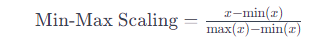

# 目录

- [1.标准化/归一化（Normalization）](#user-content-1标准化/归一化（Normalization）)
- [2.图像数据预处理方法总结](#user-content-2图像数据预处理方法总结)
- [3.Mixup](#3.Mixup)
- [4.CutMix和Cutout](#4.CutMix和Cutout)
- [5.Mosaic](#5.Mosaic)
- [6.Copy-Paste](#6.Copy-Paste)
- [7.AutoAugment](#7.AutoAugment)
- [8.RandAugment](#8.RandAugment)

在深度学习中，数据预处理是非常重要的，它能够帮助模型更好地学习特征并提高模型的性能。是深度学习模型训练中很关键的一部分。以下是一些常见的深度学习数据预处理方法：

#### 标准化/归一化（Normalization）：

数据标准化是一个常用的数据预处理操作，目的是处理不同规模和量纲的数据，使其缩放到相同的数据区间和范围，以减少规模、特征、分布差异等对模型的影响。
将数据按特征进行缩放，使其均值为0，方差为1，有助于加速模型收敛并提高模型性能。

##### 以下是一些常见的标准化/归一化方法：

###### 1、Min-Max归一化介绍（Min-Max Normalization）

描述：将数据映射到指定的范围，如：把数据映射到0～1或-1~1的范围之内处理。)
计算公式为：

作用：
    1、数据映射到指定的范围内进行处理，更加便捷快速。2、把有量纲表达式变成无量纲表达式，便于不同单位或量级的指标能够进行比较和加权。经过归一化后，将有量纲的数据集变成纯量，还可以达到简化计算的作用。

【注意】：不要“中心化”稀疏数据！

在稀疏特征上执行min-max缩放和标准化时一定要慎重，它们都会从原始特征值中减去一个量。对于min-max缩放，这个平移量是当前特征所有值中的最小值；对于标准化，这个量是均值。如果平移量不是0，那么这两种变换会将一个多数元素为0的稀疏特征向量变成密集特征向量。根据实现方式的不同，这种改变会给分类器带来巨大的计算负担。

###### 2、Z-Score 标准化介绍（Z-Score Normalization）

数据标准化方法多种多样，主要分为直线型方法(如极值法、标准差法)、折线型方法(如三折线法)、曲线型方法(如半正态性分布)。不同的标准化方法，对系统的评价结果会产生不同的影响。每种方法对系统评价结果的影响各不相同。

在这些方法中，Z-Score 标准化是应用最广泛的一种。该方法将数据转换为均值为0、标准差为1的标准正态分布，使得数据分布更符合统计学上的正态分布特性。不同的标准化方法选择可以根据数据分布、预期效果以及具体问题的需要来进行，因为不同的方法可能会对评价结果产生不同的影响。

计算公式：
其中 x 是原始数据，μ 是均值，σ 是标准差。

作用：

    1、提升模型的收敛速度（加快梯度下降的求解速度）
    2、提升模型的精度（消除量级和量纲的影响）
    3、简化计算（与归一化的简化原理相同）

###### 3、使用归一化/标准化会改变数据原来的规律吗？

归一化/标准化实质是一种线性变换，线性变换有很多良好的性质，这些性质决定了对数据改变后不会造成“失效”，反而能提高数据的表现，这些性质是归一化/标准化的前提。比如有一个很重要的性质：线性变换不会改变原始数据的数值排序。

###### 4、如果是单纯想实现消除量级和量纲的影响，用Min-Max还是用Z-Score？

1、数据的分布本身就服从正态分布，使用Z-Score。
2、有离群值的情况：使用Z-Score。
这里不是说有离群值时使用Z-Score不受影响，而是，Min-Max对于离群值十分敏感，因为离群值的出现，会影响数据中max或min值，从而使Min-Max的效果很差。相比之下，虽然使用Z-Score计算方差和均值的时候仍然会受到离群值的影响，但是相比于Min-Max法，影响会小一点。

###### 5、当数据出现离群点时，用什么方法？

当数据中有离群点时，我们可以使用Z-Score进行标准化，但是标准化后的数据并不理想，因为异常点的特征往往在标准化后容易失去离群特征，此时就可以用RobustScaler 针对离群点做标准化处理。

###### 6、Robust标准化（RobustScaler）介绍？

Robust即鲁棒性，健壮性
训练模型时向算法内添加噪声（如对抗训练），以便测试算法的「鲁棒性」。可以将此处的鲁棒性理解述算法对数据变化的容忍度有多高。鲁棒性并不同于稳定性，稳定性通常意味着「特性随时间不变化的能力」，鲁棒性则常被用来描述可以面对复杂适应系统的能力，需要更全面的对系统进行考虑。
即使用中位数和四分位数范围进行缩放，能够更好地处理异常值的影响。

#### 图像数据预处理方法总结：

图像数据的预处理包括裁剪、缩放、旋转、翻转等操作，以及色彩空间转换（如灰度化、彩色通道变换等），有助于增强模型的鲁棒性和泛化能力。

##### 数据增强（Data Augmentation）：

在训练过程中，通过对原始数据进行随机变换、旋转、平移、缩放、翻转、随机色调(H)、饱和度(S)、明度(V)调整、等操作，生成新的训练样本，扩充数据集，有助于减少过拟合，提高模型泛化能力。
缺失值处理：

处理数据中的缺失值，常见方法包括删除缺失值、填充缺失值（均值、中位数、众数填充等）、插值填充等。

##### 特征选择（Feature Selection）：

根据特征的相关性、重要性等进行特征选择，排除不重要或冗余的特征，提高模型效率并减少过拟合的风险。

##### One-Hot 编码：
独热编码可以将分类变量转换为二进制变量从而被深度学习模型进行有效处理，适用于某些机器学习模型和深度学习模型的输入。
于每一个特征,如果它有m个可能值,那么经过独热编码后,就变成了m个二元特征.并且,这些特征互斥,每次只有一个激活.因此,数据会变成稀疏的.

稀疏数据相比密集数据而言,对于计算机加载处理也更为有优势.
这样做的好处主要有：

    解决了分类器不好处理属性数据的问题
    在一定程度上也起到了扩充特征的作用

##### 处理类别不平衡数据

当数据集中的类别分布不平衡时，模型可能倾向于偏向数量较多的类别，导致对于少数类别的识别或预测性能较差。可以考虑用以下方法来降低数据类别不平衡产生的影响:

1. 过采样： 通过复制少数类别样本或生成合成样本来增加少数类别的样本数量。常见的过采样方法包括随机过采样(从少数类别中随机选择样本，之后复制多次来达到与多数类别的样本量的平衡，其中复制的次数选择不当有可能引入过拟合问题)、SMOTE方法(在少数类别样本中进行插值来生成新的合成样本，但是该方法可能会引入一定程度的噪声)
2. 欠采样: 通过减少多数类别样本的数量来平衡类别分布。但是删除样本会导致丢失一些信息。
3. 集成方法:集成方法可以用来处理不平衡数据、提高模型的泛化能力以及增强预测的稳定性。Voting和Stacking是两种常见的集成方法。
4. 类别权重：通过给予少数类别更高的权重，可以在模型训练中引入偏重，以平衡不同类别的重要性。这样可以使模型更加关注少数类别的样本，从而提高对少数类别的分类性能。
5. 特征工程：根据领域知识或数据特点，设计并生成与少数类别相关的新特征。这些特征可以帮助模型更好地区分不同类别，提高少数类别的分类性能。
6. 阈值调整:调整分类器的预测阈值，使得模型更倾向于少数类别。通常，降低阈值可以增加对少数类别的预测，但同时也可能增加误分类率。
需要注意的是：处理不平衡数据时，需要在训练集和测试集上保持类别分布的一致性，以确保模型在真实场景中的性能。

##### 序列数据处理：

对于时间序列数据或文本数据，常见的预处理方法包括分词、词嵌入、标记化、截断、填充等操作。
这些预处理方法通常根据具体的数据类型和问题领域进行选择和组合，以提高模型的性能、鲁棒性和泛化能力。

##### 主成分分析（PCA、Principal Component Analysis）

这是一种使用广泛的数据降维算法，是一种无监督学习方法，主要是用来将特征的主要分成找出，并去掉基本无关的成分，从而达到降维的目的。

总结一下PCA的算法步骤：
设有n条m维数据。

    将原始数据按列组成m行n列矩阵X
    将X的每一行(代表一个属性字段）进行零均值化
    求出协方差矩阵
    求出协方差矩阵的特征值及对应的特征向量
    将特征向量按对应特征值大小从上到下按行排列成矩阵，取前k行组成矩阵P
    Y=P×X即为降维到k维后的数据
#####  白化（whitening）

就是把各个特征轴上的数据除以对应特征值，从而达到在每个特征轴上都归一化幅度的结果。也就是在PCA的基础上再除以每一个特征的标准差，以使其normalization，其标准差就是奇异值的平方根：Xwhite = Xrot / np.sqrt(S + 1e-5)

但是白化因为将数据都处理到同一个范围内了，所以如果原始数据有原本影响不大的噪声，它原本小幅的噪声也会放大到与全局相同的范围内了。
另外我们为了防止出现除以0的情况在分母处多加了0.00001，如果增大他会使噪声减小。
白化之后得到是一个多元高斯分布，如下图whitened所示：

注意事项：

以上只是总结数据预处理的方法而已，并不是说每次都会用这么多方法，相反，在图像数据处理或者CNN中，一般只需要进行去均值和归一化，不需要PCA和白化

常见陷阱：在进行数据的预处理时（比如计算数据均值），我们只能在训练数据上进行，然后应用到验证/测试数据上。如果我们对整个数据集-整个数据集的均值，然后再进行训练/验证/测试数据的分割的话，这样是不对的。正确做法是计算训练数据的均值，然后分别把它从训练/验证/测试数据中减去。

<h3 id="3.Mixup">3.Mixup </h3>

论文链接：https://arxiv.org/pdf/1710.09412.pdf

mixup的效果如上图所示。

实现方法：随机选择两个训练样本的向量，以及其对应的label，使用线性插值的方法生成一个新的向量和对应的label，作为增强的数据。

用在图像分类中就是将随机的两张样本按比例混合，分类的结果按比例分配。

<h3 id="4.CutMix和Cutout">4.CutMix和Cutout </h3>

论文链接：CutMix	 https://arxiv.org/pdf/1905.04899v2.pdf

​					Cutout 	https://arxiv.org/pdf/1708.04552.pdf

cutmix的公式如下：

第一条式子是图像结合，第二条式子是标签结合。

cutmix和cutout的效果如上图所示。

实现方法：

Cutout:随机的将样本中的部分区域cut掉，并且填充0像素值，分类的结果不变；

CutMix:直接在图像的像素级别对两个样本进行混合。对于一个图像随机选择一个要mask的区域，使用另一个图像对应的区域进行填充，得到一个新的输入图片。

<h3 id="5.Mosaic">5.Mosaic </h3>

论文链接：https://arxiv.org/pdf/2004.10934.pdf（YOLOv4提出的数据增强方法）

Mosaic实现效果如上图所示。

实现方法：Mosaic将4张不同的训练图像混合成一张大的合成图像。这4张图像通常被随机选取，每张图像的位置和尺寸也可能会随机变化。这种混合过程包括将4张图像拼接在一起，通常以某种方式重叠，从而创建一个大的合成图像。

<h3 id="6.Copy-Paste">6.Copy-Paste </h3>

论文链接：https://arxiv.org/pdf/2012.07177.pdf

copy-paste的效果如上图所示。

实现方法：随机选择两张图像并对它们进行尺度扭曲和水平翻转，然后从其中一张图像中选择一组随机对象并将它们粘贴到另一张图像上。

<h3 id="7.AutoAugment">7.AutoAugment </h3>

论文链接：https://arxiv.org/pdf/1805.09501.pdf

AutoAugment定义了一个包含16种图像处理操作以及相关超参数的数据增强搜索空间,将数据增强策略表示为多个子策略的序列,每个子策略包含两种随机选择的操作及其应用概率和幅度;然后使用强化学习在该搜索空间中搜索能最大化模型在验证集上准确率的最优策略序列,并将其应用于训练数据进行增强

autoaugment效果如上图所示。

<h3 id="8.RandAugment">8.RandAugment </h3>

论文链接：https://arxiv.org/pdf/1909.13719.pdf

RandAugment方法的主要步骤如下：

1. 设定一个操作集，例如14种操作。
2. RandAugment只需要两个参数：N和M。其中N表示每次增强时使用的操作次数，每次随机从操作集中选择操作，并将其应用到图像上。M表示所有操作的幅度都相同。
3. 使用网格搜索或其他方法，在完整数据集和网络上实验，找到最适合的N和M值。这样一来，搜索空间大幅缩减，简化了超参数选择的过程。

通过调整N和M的值，可以控制训练时的正则化强度。较大的N和M值意味着更强的正则化效果。

randaugment效果如上图所示。

RandAugment通过随机应用一系列预定义的图像增强操作（如旋转、缩放、翻转、颜色变换等），来生成多样化的训练数据。该方法无需搜索最佳策略，简化了增强流程。
