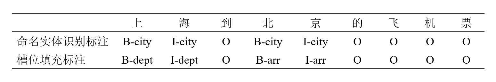
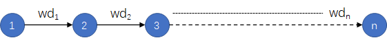

<h1 id="目录">目录</h1>

- [1.反向传播算法（BP）的概念及简单推导](#user-content-1反向传播算法（bp）的概念及简单推导)
- [2.滑动平均的相关概念](#user-content-2滑动平均的相关概念)
- [3.什么是模型微调(fine-tuning)?](#user-content-3什么是模型微调(fine-tuning)?)
- [4.简要介绍一下FLOPs](#user-content-4简要介绍一下FLOPs)
- [5.简要介绍一下FPS](#user-content-5简要介绍一下FPS)
- [6.介绍一下CNN模型和Transformer模型有哪些异同？](#user-content-6介绍一下CNN模型和Transformer模型有哪些异同？)
- [7.什么是PyTorch计算图？](#7.什么是PyTorch计算图？)
- [8.如何解决CNN的过拟合问题？](#如何解决CNN的过拟合问题？)
- [9.什么是感受野（ReceptiveField）？](#9.什么是感受野（ReceptiveField）？)
- [10.人工智能、机器学习以及深度学习这三者是什么样的关系？](#10.人工智能、机器学习以及深度学习这三者是什么样的关系？)
- [11.有哪些常见的深度学习问题类型？](#11.有哪些常见的深度学习问题类型？)
- [12.解释卷积神经网络中的权重共享机制](#12.解释卷积神经网络中的权重共享机制)
- [13.如何理解卷积操作的空间不变性（Spatial_Invariance）？](#13.如何理解卷积操作的空间不变性（Spatial_Invariance）？)
- [14.解释Data-Normalization](#14.解释Data-Normalization)
- [15.训练模型时，为什么会出现loss逐渐增大的情况?](#15.训练模型时，为什么会出现loss逐渐增大的情况?)
- [16.深度学习中图像数据和文本数据的本质区别是什么?](#16.深度学习中图像数据和文本数据的本质区别是什么?)
- [17.混合精度训练的优缺点是什么？](#17.混合精度训练的优缺点是什么？)
- [18.深度学习中add、concat、stack操作的区别是什么？](#18.深度学习中add、concat、stack操作的区别是什么？)
- [19.什么是意图识别？](#19.什么是意图识别？)
- [20.什么是槽位填充？](#20.什么是槽位填充？)
- [21.什么是多轮对话？](#21.什么是多轮对话？)
- [22.文本特征提取的方法](#22.文本特征提取的方法)
- [23.文本标准化的方法](#23.文本标准化的方法)
- [24.文本分词的方法](#24.文本分词的方法)
- [25.停用词去除的方法](#25.停用词去除的方法)
- [26.词形还原的方法](#26.词形还原的方法)
- [27.解释一下梯度消失和爆炸问题，简单阐述如何缓解该现象？](#27.解释一下梯度消失和爆炸问题，简单阐述如何缓解该现象？)
- [28.描述L1和L2正则化之间的区别，并且描述这二者的使用场景？](#28.描述L1和L2正则化之间的区别，并且描述这二者的使用场景？)
- [29.卷积和BN如何融合提升推理速度？](#29.卷积和BN如何融合提升推理速度？)
- [30.dropout作为一种正则化技术是如何执行的？](#30.dropout作为一种正则化技术是如何执行的？)
- [31.解释批量归一化的概念，它解决了什么问题？](#31.解释批量归一化的概念，它解决了什么问题？)
- [32.解释一下如何在深度学习模型训练中实现迁移学习。](#32.解释一下如何在深度学习模型训练中实现迁移学习。)
- [33.如何设置随机种子让AI模型的推理结果可以复现？](#33.如何设置随机种子让AI模型的推理结果可以复现？)


<h1 id="1反向传播算法（bp）的概念及简单推导">1.反向传播算法（BP）的概念及简单推导</h1>

<font color=DeepSkyBlue>反向传播（Backpropagation，BP）算法是一种与最优化方法（如梯度下降法）结合使用的，用来训练人工神经网络的常见算法</font>。BP算法对网络中所有权重计算损失函数的梯度，并将梯度反馈给最优化方法，用来更新权值以最小化损失函数。<font color=DeepSkyBlue>该算法会先按前向传播方式计算（并缓存）每个节点的输出值，然后再按反向传播遍历图的方式计算损失函数值相对于每个参数的偏导数</font>。

接下来我们以全连接层，使用sigmoid激活函数，Softmax+MSE作为损失函数的神经网络为例，推导BP算法逻辑。由于篇幅限制，这里只进行简单推导，后续Rocky将专门写一篇PB算法完整推导流程，大家敬请期待。

首先，我们看看sigmoid激活函数的表达式及其导数：

$$sigmoid表达式：\sigma(x) = \frac{1}{1+e^{-x}}$$
$$sigmoid导数：\frac{d}{dx}\sigma(x) = \sigma(x) - \sigma(x)^2 = \sigma(1- \sigma)$$

可以看到sigmoid激活函数的导数最终可以表达为输出值的简单运算。

我们再看MSE损失函数的表达式及其导数：

$$MSE损失函数的表达式：L = \frac{1}{2}\sum^{K}_{k=1}(y_k - o_k)^2$$

其中 $y_k$ 代表ground truth（gt）值， $o_k$ 代表网络输出值。

$$MSE损失函数的偏导：\frac{\partial L}{\partial o_i} = (o_i - y_i)$$

由于偏导数中单且仅当 $k = i$ 时才会起作用，故进行了简化。

接下来我们看看全连接层输出的梯度：


$$MSE损失函数的表达式：L = \frac{1}{2}\sum^{K}_{i=1}(o_i^1 - t_i)^2$$

$$MSE损失函数的偏导：\frac{\partial L}{\partial w_{jk}} = (o_k - t_k)o_k(1-o_k)x_j$$

我们用 $\delta_k = (o_k - t_k)o_k(1-o_k)$ ，则能再次简化：

$$MSE损失函数的偏导：\frac{dL}{dw_{jk}} = \delta_kx_j$$

最后，我们看看那PB算法中每一层的偏导数：


输出层：
$$\frac{\partial L}{\partial w_{jk}} = \delta_k^K o_j$$
$$\delta_k^K = (o_k - t_k)o_k(1-o_k)$$

倒数第二层：
$$\frac{\partial L}{\partial w_{ij}} = \delta_j^J o_i$$
$$\delta_j^J = o_j(1 - o_j) \sum_{k}\delta_k^Kw_{jk}$$

倒数第三层：
$$\frac{\partial L}{\partial w_{ni}} = \delta_i^I o_n$$
$$\delta_i^I = o_i(1 - o_i) \sum_{j}\delta_j^Jw_{ij}$$

像这样依次往回推导，再通过梯度下降算法迭代优化网络参数，即可走完PB算法逻辑。

<h1 id="2滑动平均的相关概念">2.滑动平均的相关概念</h1>

滑动平均（exponential moving average），或者叫做指数加权平均（exponentially weighted moving avergae），可以用来估计变量的局部均值，<font color=DeepSkyBlue>使得变量的更新与一段时间内的历史取值有关</font>。

变量 $v$ 在 $t$ 时刻记为 $v_{t}$ ， $\theta_{t}$ 为变量 $v$ 在 $t$ 时刻训练后的取值，当不使用滑动平均模型时 $v_{t} = \theta_{t}$ ，在使用滑动平均模型后， $v_{t}$ 的更新公式如下：


上式中， $\beta\epsilon[0,1)$ 。 $\beta = 0$ 相当于没有使用滑动平均。

$t$ 时刻变量 $v$ 的滑动平均值大致等于过去 $1/(1-\beta)$ 个时刻 $\theta$ 值的平均。并使用bias correction将 $v_{t}$ 除以 $(1 - \beta^{t})$ 修正对均值的估计。

加入Bias correction后， $v_{t}$ 和 $v_{biased_{t}}$ 的更新公式如下：


当 $t$ 越大， $1 - \beta^{t}$ 越接近1，则公式（1）和（2）得到的结果（ $v_{t}$ 和 $v_{biased_{1}}$ ）将越来越接近。

当 $\beta$ 越大时，滑动平均得到的值越和 $\theta$ 的历史值相关。如果 $\beta = 0.9$ ，则大致等于过去10个 $\theta$ 值的平均；如果 $\beta = 0.99$ ，则大致等于过去100个 $\theta$ 值的平均。

下图代表不同方式计算权重的结果：


如上图所示，滑动平均可以看作是变量的过去一段时间取值的均值，<font color=DeepSkyBlue>相比对变量直接赋值而言，滑动平均得到的值在图像上更加平缓光滑，抖动性更小，不会因为某种次的异常取值而使得滑动平均值波动很大</font>。

**滑动平均的优势：** 占用内存少，不需要保存过去10个或者100个历史 $\theta$ 值，就能够估计其均值。滑动平均虽然不如将历史值全保存下来计算均值准确，但后者占用更多内存，并且计算成本更高。

**为什么滑动平均在测试过程中被使用？**

<font color=DeepSkyBlue>滑动平均可以使模型在测试数据上更鲁棒（robust）</font>。

采用随机梯度下降算法训练神经网络时，使用滑动平均在很多应用中都可以在一定程度上提高最终模型在测试数据上的表现。

训练中对神经网络的权重 $weights$ 使用滑动平均，之后在测试过程中使用滑动平均后的 $weights$ 作为测试时的权重，这样在测试数据上效果更好。因为滑动平均后的 $weights$ 的更新更加平滑，对于随机梯度下降而言，更平滑的更新说明不会偏离最优点很远。比如假设decay=0.999，一个更直观的理解，在最后的1000次训练过程中，模型早已经训练完成，正处于抖动阶段，而滑动平均相当于将最后的1000次抖动进行了平均，这样得到的权重会更加鲁棒。

<h1 id="3什么是模型微调(fine-tuning)?">3.什么是模型微调(fine-tuning)?</h1>

在AI行业中，模型微调（Fine-tuning）是一种基础有效的技术，特别适用于迁移学习场景，其中预训练模型的参数被稍作训练调整以适应新的、但与原始训练任务相似的任务。这种方法非常适合于数据量有限的情况，可以显著提高模型的性能和泛化能力。

### 模型微调的基本步骤：

1. **选择预训练模型**：
   - 开始微调之前，首先需要一个已经在相关任务上预训练好的模型，通常这些模型在大规模数据集（如ImageNet、Laion等）上进行预训练。因为这些模型已经学习到了丰富的特征表示，可以作为新任务的起点。

2. **初始化**：
   - 微调时，通常保留预训练模型的大部分或所有权重，作为新任务训练的初始化点。

3. **修改模型结构**：
   - 根据新任务的需求，可能需要对模型的最后几层进行修改。例如，在图像分类任务中，最后的全连接层（输出层）可能需要根据新任务的类别数进行调整。

4. **重新训练**：
   - 在新的数据集上继续训练模型。通常只需重新训练模型的一部分，特别是那些针对特定任务调整过的层，而其他层可以保持原始预训练时的参数或者以较小的学习率进行微调，以避免过度拟合。

5. **调整学习率**：
   - 微调时通常使用比原始预训练时更小的学习率，这有助于保持已经学习到的有用特征，并仅对它们进行精细的调整。

### 模型微调的应用场景：

- **AIGC**：AI绘画、AI视频、大模型、AI多模态、数字人、AI音频等。
- **传统深度学习**：图像分类、图像分割、目标检测、目标跟踪等。
- **自动驾驶**：车载图像分类、车载图像分割、车载目标检测等。

### 微调的好处：

- **加速训练**：由于模型从有效的初始状态开始学习，微调通常比从头开始训练快得多。
- **需要更少的数据**：微调可以在相对较少的数据上进行，因为模型已经从预训练中获得了大量的通用知识。
- **提高性能**：通过利用预训练模型的知识，可以提高模型在新任务上的表现，特别是当新任务的数据不足以从头开始训练复杂模型时。

总的来说，模型微调是一种高效利用已有知识以适应新任务的方法，特别适用于数据资源有限的场景。


<h1 id='4简要介绍一下FLOPs'>4.简要介绍一下FLOPs</h1>

首先注意FLOPs和FLOPS是有区别的：

FLOPS是指**每秒浮点运算次数**(Floating Point Operations per Second)，常用于评估硬件性能。

FLOPs是指**浮点运算次数**(Floating Point Operations)，常用于描述模型/算法的总计算量(复杂度)。

以矩阵乘法运算为例，矩阵$W \in \mathbb{R}^{M \times N}$，矩阵$A \in \mathbb{R}^{N \times K}$，二者相乘时，矩阵中每个元素会发生$N$次乘法运算和$N-1$次加法运算，那么FLOPs计算方式为：

$$FLOPs = M \times K \times N + M \times K \times (N-1)$$

计算FLOPs的工具有torchstat，ptflops等。


<h1 id='5简要介绍一下FPS'>5.简要介绍一下FPS</h1>

FPS，每秒帧数(Frame Per Second)，用于评估图像处理或模型推断速度的指标。

FPS表示在一秒内处理的图像帧数，其计算公式为：

$$FPS = \frac{1}{每帧数据所需处理时间}$$


<h1 id='6介绍一下CNN模型和Transformer模型有哪些异同？'>6.介绍一下CNN模型和Transformer模型有哪些异同？</h1>

CNN模型（Convolutional Neural Network）和Transformer模型是AI领域中两种常见的神经网络结构，广泛应用于AIGC、传统深度学习、自动驾驶等领域。下面Rocky为大家详细讲解它们的异同：

### CNN模型

#### 主要特点：
1. **局部连接（Local Connectivity）：** CNN利用卷积层中的滤波器（或称卷积核）在输入图像上进行滑动，以提取局部特征。每个滤波器只与输入的一小部分连接，这称为局部感受野。
   
2. **权重共享（Weight Sharing）：** 同一个滤波器在整个输入图像上滑动，并应用相同的权重。这减少了参数的数量，提高了模型的训练效率。

3. **平移不变性（Translation Invariance）：** 由于滤波器在图像上滑动，CNN能够很好地捕捉图像中的局部特征，并对平移变换具有鲁棒性。

4. **层次化特征表示（Hierarchical Feature Representation）：** CNN通过多个卷积层和池化层的叠加，逐步提取图像的低级特征（如边缘、角点）和高级特征（如复杂形状和对象）。

#### 应用：
- AIGC领域、传统深度学习领域、自动驾驶领域等。

### Transformer模型

#### 主要特点：
1. **自注意力机制（Self-Attention Mechanism）：** Transformer通过自注意力机制，可以对输入序列中的每个元素进行加权求和，从而捕捉全局依赖关系。注意力机制可以动态调整各个元素之间的权重。
   
2. **并行处理（Parallel Processing）：** 与RNN不同，Transformer不需要逐步处理序列数据，可以同时处理整个序列，利用并行计算加速训练。

3. **位置编码（Positional Encoding）：** 由于Transformer不具有序列的内在顺序信息，它通过位置编码将序列的位置信息显式地加入到输入中。

4. **层次化结构（Layered Architecture）：** Transformer通常由多个编码器层和解码器层堆叠而成，每一层包含多头自注意力机制和前馈神经网络。

#### 应用：
- AIGC领域、传统深度学习领域、自动驾驶领域等。

### 异同点对比

#### 相同点：
1. **深度学习框架：** 都是基于深度学习的神经网络模型。
2. **非线性激活函数：** 都使用非线性激活函数（如ReLU）来引入非线性特性。
3. **梯度下降优化：** 都使用反向传播和梯度下降方法来优化模型参数。

#### 不同点：
1. **结构设计：**
   - **CNN**：主要依靠卷积层和池化层，局部连接和权重共享是其核心特性。
   - **Transformer**：主要依靠自注意力机制和前馈神经网络，全局依赖关系和并行处理是其核心特性。
   
2. **处理类型：**
   - **CNN**：擅长捕捉局部和层次化的空间特征。
   - **Transformer**：擅长捕捉全局的序列依赖关系。
   
3. **计算效率：**
   - **CNN**：卷积操作计算高效。
   - **Transformer**：使用自注意力机制，计算复杂度较高。

4. **参数数量：**
   - **CNN**：由于权重共享，参数数量相对较少。
   - **Transformer**：由于自注意力机制的存在，参数数量较多。

### 总结
上面Rocky已经分析了CNN模型和Transformer模型的异同，我们还是需要根据实际场景，选择合适的模型架构作为AI产品和AI算法解决方案的技术工具。

<h1 id='7.什么是PyTorch计算图？'>7.什么是PyTorch计算图？</h1>

计算图是深度学习中的一个核心概念，它用于表示和跟踪数据在多个数学操作中的流动。在PyTorch中，这种结构被称为动态计算图，它与传统的静态计算图相区别，后者需要在执行任何计算前完全定义整个图的结构。

PyTorch的计算图是在运行时动态构建的。这意味着可以直接在代码中插入标准的Python控制流结构，如循环和条件语句，这些控制流可以无缝地融入到计算图中。这种方法提供了极大的灵活性，使得模型的实验和调试过程变得更简单和直观。

动态计算图的工作方式简述如下：当执行操作，如加法或乘法时，PyTorch会即时创建节点（代表操作）和边（代表数据流向），从而构建计算图。这种即时构建方式允许图结构随着代码执行而动态改变，非常适合于需要条件执行和循环迭代的复杂模型。

此外，动态计算图极大地简化了自动求导的实现。在PyTorch中，当执行例如反向传播的操作时，框架会自动计算所需的梯度，并通过已构建的计算图追踪每个操作的影响，从而精确地更新模型参数。

使用PyTorch的动态计算图时，需要注意一些关键的实践：

- **梯度清零**：在每个训练步骤开始前，使用`optimizer.zero_grad()`清除之前步骤中累积的梯度。
- **避免in-place操作**：如`x += 1`这样的操作可能会在不经意间修改数据，这可以破坏梯度流并导致错误。
- **使用`torch.no_grad()`**：在进行推理或评估模型时，应使用`torch.no_grad()`上下文管理器，以避免进行不必要的计算梯度操作，从而节省计算资源和内存。

通过掌握PyTorch的计算图，可以更有效地构建、调试和优化深度学习模型，充分利用其提供的灵活性和强大功能。


<h1 id="8.如何解决CNN的过拟合问题？">8.如何解决CNN的过拟合问题？</h1>
过拟合是机器学习中常见的问题，尤其是在深度学习模型，如CNN中。过拟合发生时，模型在训练数据上表现良好，但在未见过的数据上表现较差。为了减少过拟合，
可以采取以下策略：

- **数据增强（Data Augmentation）** ：通过旋转、平移、缩放、翻转等方法人为增加训练数据的多样性，帮助模型学习到更加泛化的特征。
- **Dropout**：在训练过程中随机“丢弃”（即设置为零）某些神经元的输出，这种方法能够有效减少模型对特定训练样本的依赖，增强模型的泛化能力。
- **正则化（Regularization）** ：向损失函数中添加正则项，如L1或L2正则化，限制模型权重的大小，防止模型过于复杂。
- **早停（Early Stopping）** ：在验证集上监控模型的性能，当模型的验证误差开始增加时停止训练，以避免过拟合。
- **使用预训练模型（Transfer Learning）** ：利用在大型数据集上预训练的模型作为初始模型，对特定任务进行微调，可以有效利用预训练模型的泛化能力，
减少过拟合风险。

<h1 id="9.什么是感受野（ReceptiveField）？">9.什么是感受野（ReceptiveField）？</h1>

在CNN中，**感受野（Receptive Field）** 是指卷积神经网络中某一层输出特征图上的一个元素对原始输入图像中区域的映射大小。
换句话说，它描述了输出特征图中单个元素视野范围内包含的输入图像的区域大小。

感受野的大小由网络中所有前面层的滤波器（卷积核）大小、步长和池化操作共同决定。**感受野越大**，网络能够捕获的输入图像的全局信息越多，
但同时可能会丢失一些细节信息；反之，**感受野较小**则能够捕获更多的局部细节信息。


<h1 id="10.人工智能、机器学习以及深度学习这三者是什么样的关系？">10.人工智能、机器学习以及深度学习这三者是什么样的关系？</h1>

深度学习（Deep Learning）、机器学习（Machine Learning）和人工智能（Artificial Intelligence, AI）是三个相关但不同的概念。它们之间的关系可以理解为递进关系，**人工智能是一个广义的概念，机器学习是实现人工智能的一种方法，而深度学习是机器学习的一个子集**。

### 1. 人工智能（Artificial Intelligence）

**定义**：人工智能是指通过计算机模拟和实现人类智能的技术和方法。它涉及使计算机系统能够执行需要人类智能的任务，如感知、推理、学习、规划和决策等。

**目标**：开发能够自动执行复杂任务的系统，从而在不需要人类干预的情况下完成这些任务。

### 2. 机器学习（Machine Learning）

**定义**：机器学习是人工智能的一个分支，涉及机器学习算法和模型，使计算机能够通过经验（数据）进行学习和预测，而无需明确编程。

**核心概念**：通过数据驱动的方法，机器学习算法能够自动调整和优化模型，以提高在特定机器学习任务上的性能。

### 3. 深度学习（Deep Learning）

**定义**：深度学习是机器学习的一个子集，使用多层神经网络模型来模拟人脑的结构和功能，从数据中自动学习和提取特征。

**特点**：
- **深层结构**：使用多个隐藏层的神经网络来捕捉数据的复杂模式和特征。
- **自动特征提取**：能够从原始数据中自动提取特征，而无需手工特征工程。
- **大规模数据和计算**：需要大量数据和计算资源进行训练，通常依赖于GPU加速。

**主要架构**：
- **卷积神经网络（CNN）**
- **循环神经网络（RNN）**
- **生成对抗网络（GAN）**
- **自编码器（Autoencoder）**
- **Transformers**

### 4. 人工智能（Artificial Intelligence）、机器学习（Machine Learning）、深度学习（Deep Learning）三者之间的关系

**层级关系**：
- **人工智能（AI）**：是一个广义的领域，涵盖了所有使机器表现出智能行为的技术。
  - **机器学习（ML）**：是实现人工智能的一种方法，通过数据驱动的方式让机器学习和预测。
    - **深度学习（DL）**：是机器学习的一个子集，通过使用多层神经网络来自动学习和提取数据特征。

**图示关系**：

```
人工智能（AI）
├── 机器学习（ML）
│   ├── 监督学习
│   ├── 无监督学习
│   ├── 强化学习
│   └── 深度学习（DL）
│       ├── 卷积神经网络（CNN）
│       ├── 循环神经网络（RNN）
│       ├── 生成对抗网络（GAN）
        ├── Transformers
│       └── 自编码器（Autoencoder）
```


<h1 id="11.有哪些常见的深度学习问题类型？">11.有哪些常见的深度学习问题类型？</h1>

### 深度学习的常见问题类型
- **分类（Classification）**
  将输入数据划分到预定义的有限标签中。其输出是预测的类别标签， 常用评价指标是二元对错（准确率，精确率，召回率和F1分数等）。 
  >例：花卉图像分类，垃圾邮件拦截等。
  
- **回归（Regression）**
  建立数值型随机自变量的模型并进行连续的因变量预测。 其输出是数值，常用评价指标是误差大小（均方误差，R2分数等）。 
  >例：股票价格预测，房价预测等。
  
- **聚类（Clustering）**
  将无标签的数据分成多个类（簇），确保类内样本相似，类间样本相异。其输出是聚类结果（簇划分，簇标签，簇中心等），常用评价指标是样本距离（紧密度，分隔度等）。
  >例：用户分群，异常检测等。
  
- **决策（Decision making）**
  通过神经网络理解给定目标，约束条件和可用信息，预测出最佳或满意的动作决策。其输出是一连串的动作，常用评价指标是最终收益（回报，平均奖励等）。
 >例：游戏AI，自动驾驶等。

- **概率密度估计（Probability density estimation）**
  使用深度神经网络来估计一个随机变量或一组随机变量的概率密度函数。其输出是数据的概率分布，常用评价指标是分布差异（对数似然损失，KL散度等）。 
  >例：数据生成，样本采样等。


<h1 id="12.解释卷积神经网络中的权重共享机制">12.解释卷积神经网络中的权重共享机制</h1>
在CNN中，**权重共享**是指同一个卷积核（滤波器）在整个输入特征图上滑动时，使用相同的权重和偏置参数。这种机制是CNN能够有效处理图像数据的关键因素之一。

**权重共享的主要优点包括：**

- **参数数量减少** ：相比于全连接层需要为每个连接学习一个独立参数，卷积层通过权重共享显著减少了模型的参数数量。这不仅降低了模型的计算复杂度，
也减轻了过拟合的风险。
- **特征提取能力** ：权重共享使得卷积神经网络能够在整个图像上学习到通用的特征检测器（例如，边缘或纹理检测器）。无论这些特征出现在图像的哪个位置，
共享权重的卷积核都能够识别它们，增强了模型对图像平移的不变性。
- **提高学习效率** ：由于参数数量的减少和模型复杂度的降低，权重共享还有助于提高模型的学习效率，使得训练过程更快收敛。

<h1 id="13.如何理解卷积操作的空间不变性（Spatial_Invariance）？">13.如何理解卷积操作的空间不变性（Spatial_Invariance）？</h1>
**空间不变性（Spatial Invariance）** ，又称平移不变性，是指卷积神经网络能够识别图像中的特征，而不受这些特征在图像中位置的影响。
这是通过卷积层的权重共享机制实现的，因为同一卷积核在整个输入图像上滑动进行卷积操作，使得网络能够在图像的不同位置检测到相同的特征。

**空间不变性是CNN在图像识别、分类和检测等任务中表现出色的重要原因之一。** 例如，不管一只猫出现在图像的左上角还是右下角，
通过卷积操作提取的特征都能帮助网络正确识别出“猫”的存在。


<h1 id="14.解释Data-Normalization">14.解释Data-Normalization</h1>
**数据归一化（Data Normalization）** 是一种预处理技术，用于将数据缩放到一个特定的范围，通常是0到1之间。
其主要目的是消除数据中的量纲影响，使得不同特征之间的数值差异不会对模型的训练产生过大的影响。

**数据归一化的主要优点包括：**

- **加速模型训练** ：归一化后的数据具有较小的数值范围，可以加快梯度下降等优化算法的收敛速度。
- **提高模型稳定性** ：归一化可以减少不同特征之间的数值差异，使得模型在训练过程中更加稳定。
- **增强模型泛化能力** ：归一化可以使得模型对数据中的噪声和异常值更加鲁棒，提高模型的泛化能力。

**常见的归一化方法包括：**

- **最小-最大归一化（Min-Max Normalization）** ：将数据缩放到0到1之间，公式为： $x' = \frac{x - x_{min}}{x_{max} - x_{min}}$ 。
- **Z-score标准化（Z-score Normalization）** ：将数据标准化为均值为0，标准差为1的正态分布，公式为： $x' = \frac{x - \mu}{\sigma}$ ，
其中 $\mu$ 和 $\sigma$ 分别是数据的均值和标准差。
- **L2归一化（L2 Normalization）** ：将数据归一化为单位范数，公式为： $x' = \frac{x}{\|x\|_2}$ ，其中 $\|x\|_2$ 是数据的L2范数。

**数据归一化在深度学习模型中非常重要，是数据预处理的重要步骤之一。**


<h1 id="15.训练模型时，为什么会出现loss逐渐增大的情况?">15.训练模型时，为什么会出现loss逐渐增大的情况?</h1>
在训练深度学习模型时，loss逐渐增大的情况可能由以下几种原因导致：

- **学习率过高**：如果学习率设置得过高，模型可能会在优化过程中跳过最优解，导致loss增大。可以通过减小学习率或使用学习率衰减策略来解决这个问题。
- **梯度爆炸**：在某些情况下，梯度可能会变得非常大，导致参数更新过大，从而使得loss增大。可以通过梯度裁剪（Gradient Clipping）来防止梯度爆炸。
- **模型过拟合**：如果模型在训练数据上过拟合，可能会在验证数据上表现较差，导致loss增大。可以通过正则化、数据增强、早停等方法来防止过拟合。
- **优化器选择不当**：不同的优化器在训练过程中可能表现出不同的行为。例如，Adam优化器在训练初期可能会出现loss增大，然后逐渐下降。
选择合适的优化器并调整其参数可以帮助解决这个问题。
- **数据问题**：如果训练数据中存在噪声或异常值，可能会导致loss在训练过程中波动。可以通过数据清洗、数据预处理等方法来解决这个问题。
- **其他外部因素**：例如，硬件问题、软件错误等也可能导致loss在训练过程中波动。需要检查系统日志和硬件状态，以排除这些因素。
- **网络结构问题**：如果网络结构设计不合理，例如，网络层数过多、网络结构过于复杂等，可能会导致loss在训练过程中波动。需要根据具体问题调整网络结构。


<h1 id="16.深度学习中图像数据和文本数据的本质区别是什么?">16.深度学习中图像数据和文本数据的本质区别是什么?</h1>

从深度学习的角度来看，图像数据和文本数据有许多本质上的区别。这些区别源于图像和文本的不同性质，以及它们在实际应用中的不同处理方式。

### 1. 数据表示方式

**图像数据**：
- **像素表示**：图像是通过像素网格表示的，每个像素通常包含颜色信息。对于灰度图像，一个像素表示一个亮度值；对于彩色图像（如RGB图像），每个像素由三个通道（红、绿、蓝）组成。
- **高维度**：图像数据是二维的（宽度×高度），或者在彩色图像中是三维的（宽度×高度×颜色通道）。

**文本数据**：
- **字符/单词表示**：文本是由字符或单词序列组成的，具有一维结构。文本的数据表示通常是一个序列，这个序列可以是字符序列（如 "hello"）或者单词序列（如 "hello world"）。
- **离散性**：文本是**离散**的，单词与单词之间的关联性在序列中体现，但单词本身并不具有连续性（不像图像中的像素）。

### 2. 数据的结构

**图像数据**：
- **空间结构**：图像具有明确的空间结构，邻近像素之间通常有很强的相关性。例如，一张人脸图像中，眼睛和鼻子的像素往往靠得很近，且颜色和纹理上也会有一定的连续性。
- **局部性**：图像的局部区域通常包含有用的信息，某个特定区域的特征可以代表整个图像的一部分内容（如眼睛可以代表人脸）。

**文本数据**：
- **顺序结构**：文本是由顺序结构决定的，单词的顺序非常重要，不同的顺序可能表达完全不同的含义（如 "I love you" 和 "You love I"）。
- **依赖性**：文本中的单词或字符之间具有长距离依赖性。例如，在一句话中，句首的主语可能与句尾的动词或宾语紧密相关。

### 3. 数据处理方式

**图像数据**：
- **卷积操作**：图像通常通过卷积操作来处理，卷积神经网络（CNN）是处理图像的主要模型结构。CNN利用了图像的局部性，通过共享权重的卷积核提取图像的特征。
- **数据增强**：为了增加数据的多样性，图像通常会进行数据增强，如旋转、裁剪、翻转、颜色调整等。这些操作不会改变图像的标签，但会丰富训练数据。

**文本数据**：
- **嵌入表示**：文本数据通常先转化为嵌入表示（如词嵌入或字符嵌入），即**将离散的单词或字符映射到连续的向量空间中**。这些向量可以捕捉单词之间的语义关系。
- **序列建模**：处理文本时，序列模型（如Transformer、RNN、LSTM等）常用于捕捉文本的顺序依赖性。模型需要记住前面的上下文来正确理解后面的内容。

### 4. 应用场景

**图像数据**：
- **图像生成**：AIGC时代的图像生成任务等。
- **图像分类**：识别图像中的主体物体并分类，如识别猫、狗等。
- **目标检测**：在图像中检测出目标物体的位置和类别，如自动驾驶中的行人检测。
- **图像分割**：将图像划分为不同的区域，每个区域代表不同的类别，如医学图像中的器官分割。

**文本数据**：
- **文本对话**：AIGC时代的文本对话、问答等任务。
- **自然语言处理（NLP）**：涵盖了文本分类、情感分析、机器翻译、自动摘要、问答系统等任务。
- **文本生成**：基于给定的上下文生成自然语言文本，如聊天机器人或写作辅助工具。
- **语义分析**：理解文本的深层含义，如分析文章的主题或情感倾向。

<h1 id="17.混合精度训练的优缺点是什么?">17.混合精度训练的优缺点是什么?</h1>

混合精度训练（Mixed-precision Training）在深度学习领域中具有显著的优势，同时也面临一些挑战。以下是它的主要优缺点：

### 优点：

1. **减少内存占用**：
   - 由于FP16的位宽仅为FP32的一半，因此使用FP16可以显著减少模型训练过程中所需的内存。这种减少内存的优势尤其在大型模型和大数据集的训练中表现突出，使得更复杂的模型在有限的硬件资源上也能得以训练。

2. **加快训练速度**：
   - 混合精度训练能够加快模型的训练速度。许多现代的硬件加速器（如NVIDIA的Tensor Core）在处理FP16时的速度要快于处理FP32。这使得使用FP16可以在保持精度的同时提高训练效率。

3. **提高计算效率**：
   - 在某些硬件架构上，FP16的计算效率更高。混合精度训练可以充分利用这些硬件优势，进一步提升计算效率，减少训练时间。

4. **提升通讯效率**：
   - 使用FP16表示的数据量更小，因而在分布式训练环境中，可以减少数据传输的带宽需求，提高整体通讯效率。

### 缺点：

1. **数据溢出（Overflow/Underflow）**：
   - 由于FP16的数值表示范围远小于FP32，在模型训练过程中可能会出现数据溢出问题。这种情况可能导致模型训练不稳定或训练失败。尤其是在反向传播过程中，梯度的数值可能会超出FP16的表示范围，导致精度损失。

2. **舍入误差**：
   - 在使用FP16进行计算时，由于精度较低，可能会发生舍入误差。当模型的梯度值非常小时，这些舍入误差会更加显著，进而影响模型的最终表现。这种误差在长期的累积下，可能导致模型无法达到预期的精度。

### 总结：

混合精度训练通过结合使用FP16和FP32，能够在不显著影响模型精度的前提下，降低内存使用，提升训练速度和计算效率。然而，它也带来了数据溢出和舍入误差等挑战。因此，在使用混合精度训练时，往往需要结合权重备份、损失缩放和精度累加等技术来应对这些问题，从而充分发挥混合精度训练的优势。


<h1 id="18.深度学习中add、concat、stack操作的区别是什么？">18.深度学习中add、concat、stack操作的区别是什么？</h1>

在AI领域的AIGC、传统深度学习、自动驾驶方向中，我们经常会看到AI模型中进行 `add`、`concatenate`（通常简写为 `concat`）和 `stack` 这三种常见的张量操作。它们虽然都可以用来处理多维数组（张量），但它们的作用和结果是不同的。下面Rocky带着大家详细讲解其中的不同：

### 1. `add` 操作

- **作用**：`add` 是一种逐元素相加的操作。它将两个形状相同的张量中的对应元素相加，得到一个新的张量。
- **维度变化**：在 `add` 操作中，两个张量的形状必须相同，结果的张量形状也和输入的形状相同。

**示例**：

假设有两个形状相同的张量 A 和 B：

```python
A = [[1, 2],     B = [[5, 6],
     [3, 4]]          [7, 8]]
```

使用 `add` 操作将 A 和 B 相加：

```python
C = A + B = [[1+5, 2+6],   # 对应元素相加
             [3+7, 4+8]]

C = [[6, 8],
     [10, 12]]
```

可以看到，每个位置上的值都是由 A 和 B 对应位置的元素相加得到的。

### 2. `concatenate` 操作

- **作用**：`concatenate` 操作是将两个或多个张量在指定的轴（维度）上连接起来，形成一个新的张量。
- **维度变化**：在 `concat` 操作中，张量的形状在非连接轴上必须相同，而在连接轴上则会增加。连接后的张量在连接轴上的长度是所有输入张量在该轴上长度的总和。

**示例**：
假设有两个张量 A 和 B，它们的形状是 `(2, 2)`：

```python
A = [[1, 2],     B = [[5, 6],
     [3, 4]]          [7, 8]]
```

如果我们沿着轴 0（行的方向）进行 `concat` 操作：

```python
C = concat([A, B], axis=0)

C = [[1, 2],
     [3, 4],
     [5, 6],
     [7, 8]]
```

如果沿着轴 1（列的方向）进行 `concat` 操作：

```python
C = concat([A, B], axis=1)

C = [[1, 2, 5, 6],
     [3, 4, 7, 8]]
```

可以看到 `concat` 操作是把 A 和 B 在指定轴上“拼接”起来。沿着行拼接就是增加行数，沿着列拼接就是增加列数。

### 3. `stack` 操作

- **作用**：`stack` 操作是将多个相同形状的张量“堆叠”在一个新的维度上。与 `concat` 不同，`stack` 操作会创建一个新的轴。
- **维度变化**：`stack` 操作会增加一个新的维度，输出张量的形状会比输入张量多一维。每个输入张量将成为新维度上的一个切片。

**示例**：
假设有两个形状为 `(2, 2)` 的张量 A 和 B：

```python
A = [[1, 2],     B = [[5, 6],
     [3, 4]]          [7, 8]]
```

如果我们对 A 和 B 进行 `stack` 操作，并沿着新的轴（通常是轴 0）进行堆叠：

```python
C = stack([A, B], axis=0)

C = [[[1, 2],   # A 在新轴上的第一个切片
      [3, 4]],

     [[5, 6],   # B 在新轴上的第二个切片
      [7, 8]]]
```

此时，C 的形状是 `(2, 2, 2)`。

可以看到 `stack` 操作是把 A 和 B 堆叠起来，形成一个更高维度的张量。可以理解为在原有的张量基础上“新增”了一个维度。


<h1 id="19.什么是意图识别？">19.什么是意图识别？</h1>

### 定义
意图识别，是判断用户要做什么，比如一个用户向机器人问了一个问题，于是机器人就需要判断这个用户他问的是天气、是旅游还是问某部电影的信息。说到底意图识别就是一个文本分类的问题。既然对应文本分类，那么首先就需要将明确有哪几类意图，也就是说我们需要预先定义好意图的类别然后才能考虑意图识别的问题。那么如何定义意图类别呢，它不像情感分类任务那样，不管什么场景，都能划分成积极、消极和中立情感三分类；意图分类需要将其置于特定的场景中来考虑，不同应用场景就有不同的意图分类。

### 意图识别的办法
1) 规则模版：通过人工分析每个意图下的有代表性的例句总结出规则模板，然后将用户的输入语句进行分词、词性标注、命名实体识别、依存句法分析、语义分析等操作后套用已有的模板，当与之匹对的某个意图模板达到一定的阈值之后就认为该输入就属于该意图类别。以订机票意图为例，我们可以事先收集一些用户的相关query，然后再进行总结归纳制定模板。

2) 统计机器学习：使用统计机器学习算法做文本分类，需要人工提取文本特征，比如ngram、词性特征、实体类型特征；提完特征后进行tf-idf向量化表示，然后使用支持向量机、逻辑回归、随机森林等算法进行训练。该方法显然也需要大量人工操作设计领域相关的特征，且用统计机器学习算法做文本分类效果是不怎么理想的。

3) 深度学习：使用神经网络来建模做文本分类，它省略了人工设计特征、提取特征的过程，还能借助预训练好的具有语义知识的词向量进行训练；但是该方法需要很多训练数据，这就需要依赖很多人工标注数据了，相比之下规则模板方法则不需要标注数据。

### 意图识别的难点
- 输入不规范：错别字、堆砌关键词、非标准自然语言
- 多意图：输入的语句信息量太少造成意图不明确，且有歧义。比如输入仙剑奇侠传，那么是想获得游戏下载、电视剧、电影、音乐还是小说下载
- 意图强度：输入的语句好像即属于A意图，又属于B意图，每个意图的的得分都不高
- 时效性：用户的意图是有较强时效性的，用户在不同时间节点的相同的query可能是属于不同意图的，比如query为“战狼”，在当前时间节点可能是想在线观看战狼1或者战狼2，而如果是在战狼3开拍的时间节点搜的话，可能很大概率是想了解战狼3的一些相关新闻了


<h1 id="20.什么是槽位填充？">20.什么是槽位填充？</h1>

### 定义
在进行意图识别后，会对意图进行思考和用户互动，系统通过命名实体识别和槽位预测来填空。首先对用户的输入（订电影票为例），订一张今天下午场次的战狼电影票 识别出电影名是“战狼”，时间是“今天下午”；没有识别到影院名称，系统根据用户当前的位置，将其预测为XX影院或YY影院，数量和座位位置无法预测。针对无法预测的槽位，系统向用户发问或者提供选择来确认 您可以选择电影票张数和座位号完成预定 ；对于预测到槽位值不唯一的情况，比如XX影院或YY影院，系统让用户自己进行二选一；对于识别到的槽位存在歧义的问题，系统会进行“澄清”，比如战狼实体不是很明确，需要澄清是战狼1还是战狼2，系统根据现在正上映的是战狼2这一情况来进行自动澄清，但如果此时两部电影都在上映的话，系统就得向用户发问澄清了，比如问 您是想要看战狼1还是战狼2？ 。

可以看到系统的思考过程完全是按照语义槽来进行的，有什么槽位它就思考什么。当语义槽完全填充且消除了歧义之后，也就完成了整个自然语言理解任务，开始利用知识库回答用户问题或者完成某种操作。

语义槽示例
```
"订电影票": {
			"电影名":__________,
			"电影院名称":__________,
			"时间":__________,
			"数量":__________,
			"座位位置":__________,
			}

```

### 槽位填充的办法

槽位填充包括命名实体识别和槽位预测，其实说命名实体识别是不严谨的，比如在“订机票”意图下的语义槽中，应该有“出发地”和“目的地”，虽然他们都是地名，但是有区别，他们的顺序不能变，也就是不能用“地名”来统一代替，而命名实体识别的做法就是将他们都当做“地名”了。我们只能称槽位填充是一个序列标注任务，但绝不能说序列标注任务就是命名实体识别，且我们在标注数据的时候也不能一样标注，下图表明了两者的区别：


可以看到槽位填充标注中，针对订机票意图的城市实体的标注，我们使用dept和arr来区分出发地和目的地实体，所以我们应该使用上图中第二种标注方式来标注数据，然后训练序列标注模型，最后用该模型去做槽位值识别

槽位预测是指当在用户的query中识别不到某些槽位值时，系统首先需要去做一个较为靠谱的预测，而不是凡事都去跟用户互动来获取这些槽位值。从上文的订电影票例子中我们可以看到针对不同槽位，张三调用了用户的地理位置、当前时间的数据来辅助预测（这就是某些APP要获取你手机的地理位置权限的原因），当然做槽位预测还有更多的操作

<h1 id="21.什么是多轮对话？">21.什么是多轮对话？</h1>

### 定义
多轮对话的目的是将初步用户意图转化为明确用户指令。

多轮对话是一种，在人机对话中，初步明确用户意图之后，获取必要信息以最终得到明确用户指令的方式。多轮对话与一件事情的处理相对应。

将“识别用户意图之后，为了获取必要信息，与用户进行的有目的的多轮对话”称为封闭域多轮对话，区别于识别用户意图之前，为了利用上文信息，所采用的『上下文替换』、『主体补全』等技术，也即开放域多轮对话。

封闭域对话有很明显的两个特征:

- 输入和输出是可枚举的
即对于用户的某特定意图，必须填充指定数量的槽位后，才能完成回答。
- 对话有明确的目的，且有流程
当有槽位缺失时，需要使用澄清话术。即当用户的需求中缺乏一些「必要信息」时，需要对话系统主动发问，引导用户将「必要信息」填充完整。

<h1 id="22.文本特征提取的方法">22.文本特征提取的方法</h1>

### 词袋模型
建立一个词典库，该词典库包含训练语料库的所有词语，每个词语对应一个唯一识别的编号，利用one-hot文本表示。
文档的词向量维度与单词向量的维度相同，每个位置的值是对应位置词语在文档中出现的次数，即词袋模型（BOW））

问题：
- 容易引起维度灾难问题，语料库太大，字典的大小为每个词的维度，高维度导致计算困难，每个文档包含的词语数少于词典的总词语数，导致文档稀疏。
- 仅仅考虑词语出现的次数，没有考虑句子词语之间的顺序信息，即语义信息未考虑

### TF-IDF文本特征提取

利用TF和IDF两个参数来表示词语在文本中的重要程度。
TF是词频：指的是一个词语在一个文档中出现的频率，一般情况下，每一个文档中出现的词语的次数越多词语的重要性更大，例如BOW模型一样用出现次数来表示特征值，即出现文档中的词语次数越多，其权重就越大，问题就是在长文档中 的词语次数普遍比短文档中的次数多，导致特征值偏向差异情况。

TF体现的是词语在文档内部的重要性。

IDF是体现词语在文档间的重要性

即如果某个词语出现在极少数的文档中，说明该词语对于文档的区别性强，对应的特征值高，IDF值高，IDFi=log（|D|/Ni），D指的是文档总数，Ni指的是出现词语i的文档个数，很明显Ni越小，IDF的值越大。
最终TF-IDF的特征值的表达式为：TF-IDF（i，j）=TFij*IDFi

### 基于词向量的特征提取模型

想基于大量的文本语料库，通过类似神经网络模型训练，将每个词语映射成一个定维度的向量，维度在几十到化百维之间，每个向量就代表着这个词语，词语的语义和语法相似性和通过向量之间的相似度来判断。

常用的word2vec主要是CBOW和skip-gram两种模型，由于这两个模型实际上就是一个三层的深度神经网络，其实NNLM的升级，去掉了隐藏层，由输入层、投影层、输出层三层构成，简化了模型和提升了模型的训练速度，其在时间效率上、语法语义表达上效果明显都变好。word2vec通过训练大量的语料最终用定维度的向量来表示每个词语，词语之间语义和语法相似度都可以通过向量的相似度来表示。


<h1 id="23.文本标准化的方法">23.文本标准化的方法</h1>

1) 字符编码标准化（全角英文字符转半角)
在计算机中，所有中文字符都是全角字符，而英文字母、阿拉伯数字及符号有全角和半角两种unicode编码方式。它们的全角字符unicode编码从65281~65374 (十六进制 0xFF01 ~ 0xFF5E)，半角字符unicode编码从33~126 (十六进制 0x21~ 0x7E)；而空格符比较特殊，全角unicode编码为12288 (0x3000)，半角为32 (0x20)。
可见除空格符外，每个全角字符的unicode编码等于其半角字符的unicode编码加65248，因此字符unicode编码标准化实现代码如下
```python
#全角转半角
def full_to_half(text:str):      #输入为一个句子
    _text = ""
    for char in text:
        inside_code = ord(char)#以一个字符（长度为1的字符串）作为参数，返回对应的 ASCII 数值
        if inside_code == 12288:    #全角空格直接转换
            inside_code = 32
        elif 65281 <= inside_code <= 65374:  #全角字符（除空格）根据关系转化
            inside_code -= 65248
        _text += chr(inside_code)
    return _text 
```

2) 英文大小写字母统一化
英文字母大小写的统一化可直接借助python内置字符串方法实现
```python
#大写字母转为小写字母
def upper2lower(text:str):
    return text.lower()
```
3) 中文繁简字统一化
中文繁体字与简体字的统一化借助opencc包的OpenCC类实现，该类通过不同的转换功能代码实现不同的文字转化功能

|功能代码|功能说明|
|:--:|:--:|
|s2t|简体中文转繁体中文|
|t2s|繁体中文转简体中文|
|s2tw|简体中文转台湾正体|
|tw2s|台湾正体转简体中文|
|s2twp|简体中文转繁体中文（台湾正体）|

```python
from opencc import OpenCC

# 简繁体转换
def chinese_standard(text:str, conversion='t2s'):
	cc = OpenCC(conversion)
    return cc.convert(text)
```

4) 文本清洗
文本清洗中，常通过Unicode码过滤来去除非文本内容。Unicode码表中，中日韩统一表意文字字符区间为 4E00~9FA5，半角英文字母、阿拉伯数字及符号的字符区间为 0x21~0x7E，所以标准文本字符范围为 
$$
[ 4E00 , 9FA5 ] \cup [ 0x21 , 0x7E ]
$$

非文本内容过滤与标点符号过滤一同借助正则表达式实现
```python
import re
def clear_character(text):	
	#只取合法字符
	pattern = [
		"[^\u4e00-\u9fa5^a-z^A-Z^0-9^\u0020^\u0027^\u002e]",  # save_standing_character
		"\.$"  # remove_full_stop
	]
    return re.sub('|'.join(pattern), '', text)
```


<h1 id="24.文本分词的方法">24.文本分词的方法</h1>

### 分词任务
根据语言特点，分词任务主要可分类两大类。一类是英文等拉丁语系文本的分词，英文单字成词，且词与词之间由空格隔开，该类任务较为简单，直接按空格分开即可。

另一类是中文文本分词，中文多字成词，且词与词之间没有明显区分标志，因此中文分词较为复杂，需借助词表和算法等工具实现分词需求。而幸运的是，目前分词技术已相对成熟，实际工作中可使用Jieba分词等开源工具直接完成分词需求。

### 分词算法
中文分词都是基于词库匹配实现的，分词方法主要分为不考虑句子语义，直接基于词库匹配规则的分词方法，和考虑句子语义，基于概率统计的分词方法两大类。其中，按匹配规则分词常使用最大匹配算法。

而考虑语义的概率统计分词方法，要先基于词库获取所有可能的分词组合结果，然后将所有结果输入语言模型，计算出概率最大的组合作为最终的分词结果。针对分词任务实时性的需求，出于效率考虑，常用unigram语言模型 + 维特比算法快速得到考虑语义的分词结果。

（更近一步说，HMM、CRF等时间序列模型可以得到更好的概率统计分词效果，它们在成熟开源工具中被广泛使用）

1) 最大匹配算法
最大匹配是一种基于匹配单词长度最大化的贪心算法，它分为前向最大匹配、后向最大匹配和双向最大匹配三种分词方式。

前向最大匹配算法按从前向后顺序，将文本子字符串与词库中单词进行匹配，匹配时词库单词按长度从大到小排列依次参与匹配（文本子字符串切片长度与匹配词库单词长度相同），匹配成功则将字符子串划分为一个独立的单词并继续匹配后续文本。后向最大匹配算法则是将文本按从后向前顺序完成上述过程。

小贴士：将词典中同长度单词编制成一哈希表，然后将文本子字符串进行哈希查找有无匹配项，可最大匹配算法的时间复杂度从$$o(n^2)$$降低至$$O(n)$$


2) unigram模型 + 维特比算法
unigram模型假设词与词之间相互独立，即多个词语共同出现的概率等于它们各自单独出现的概率的乘积。

维特比算法将文本改造成一个具有n+1个节点的有向图（n等于文本字数），然后将文本中的每一个字依次放到初始节点到终止节点的连线上（每条连接仅放一个字），如下图所示。


然后连接自始向终方向的所有可能连线，每条连线所包含的单字组成此连线所代表的词，每条从始至终的路径代表一种可能的分词结果。在寻找最大概率分词结果前，还应遍历每条表所代表的词是否在词库中出现，若未在词库中出现应删除这条边。

维特比算法是一种基于贪心策略的动态规划算法，可用它找出从初始节点到终止节点的最短路径，为概率最大的分词结果。

<h1 id="25.停用词去除的方法">25.停用词去除的方法</h1>

### 停用词
停用词指在自然语言文本中非常常见的单词，它们通常不携带特定含义，例如“the”、“a”、“an”、“in”等。在文本分析中，这些词语可能会干扰模型的训练效果，因此需要将它们从文本中移除。在中文文本中，一些通用的停用词包括：“的”、“了”、“和”、“是”、“在”、“有”、“不”、“我”、“他”、“你”等。这些词出现的频率很高，但在文本分析中通常没有什么意义。
可以使用nltk去除停用词，nltk中包含了一些常用的停用词列表，可以直接使用。也可以自定义停用词列表，将需要去除的词添加到列表中。
```python
import nltk
nltk.download('stopwords')
from nltk.corpus import stopwords

stop_words = set(stopwords.words('english'))
```
中文停用词去除
```python
import jieba

# 加载中文停用词表
stopwords_path = 'path/to/stopwords.txt'
with open(stopwords_path, 'r', encoding='utf-8') as f:
    stopwords = [line.strip() for line in f.readlines()]

# 分词并去除停用词
text = '今天天气真好，适合出去玩。'
words = jieba.cut(text)
clean_words = [word for word in words if word not in stopwords]

print(clean_words)
```

<h1 id="26.词形还原的方法">26.词形还原的方法</h1>

### 词形还原
词形还原是将单词还原为其基本形式的过程，例如将“running”还原为“run”，将“ate”还原为“eat”。词形还原对于文本分析非常重要，因为它可以帮助我们更好地理解文本的含义。

词形还原可以使用nltk库中的WordNetLemmatizer类实现，该类可以接受一个单词和一个词性标签作为输入，然后返回该单词的基本形式。词性标签可以是nltk库中的词性标签，也可以是自定义的词性标签。

### 步骤
- 利用分词技术将文本转换为单词列表。
- 利用词性标注技术为每个单词标注词性。
- 根据每个单词的词性和上下文语境，将单词还原为它们的原始形式。

使用nltk库中的WordNetLemmatizer类实现词形还原
```python
import nltk
from nltk.stem import WordNetLemmatizer

nltk.download('wordnet')

wordnet_lemmatizer = WordNetLemmatizer()
text = "My cat is walking on the carpet"
tokens = nltk.word_tokenize(text)
result = []
for token in tokens:
    result.append(wordnet_lemmatizer.lemmatize(token, pos='v'))
print(result)
```
在上述代码中，我们首先使用nltk库的word_tokenize()函数将文本转换为单词列表。然后，我们创建了一个WordNetLemmatizer对象，并使用它的lemmatize()方法将单词还原为它们的原始形式。在这个例子中，我们将单词还原为它们的动词原形。输出结果为：[‘My’, ‘cat’, ‘be’, ‘walk’, ‘on’, ‘the’, ‘carpet’]。

在实际应用中，词形还原通常与停用词去除、词干提取等技术结合使用，以提高文本预处理的效果。

在中文中，词形变化相对英文单词较少，但是词语之间的组合方式比较灵活，同一个词可能会有多种不同的形态。中文的词形还原与英文略有不同，它通常指的是将词语的不同形态转换为它的原始形态。例如，将“吃饭了”和“吃了饭”都还原为“吃饭”。

中文词形还原的实现通常需要借助中文分词技术和词性标注技术。中文分词是将一段文本分解成词语的过程，而词性标注是对每个词语进行词性标记的过程。通过这两个步骤，我们可以识别出每个词语的原始形态，并将其还原。

使用中文分词库jieba和词性标注库pynlpir进行中文词形还原
```python
import jieba
import pynlpir

# 加载停用词表
stopwords = []
with open('stopwords.txt', 'r', encoding='utf-8') as f:
    for line in f:
        stopwords.append(line.strip())

# 初始化分词库和词性标注库
jieba.initialize()
pynlpir.open()

def lemmatize_chinese(text):
    """
    中文词形还原函数，输入为一段中文文本，输出为还原后的文本。
    """
    words = jieba.cut(text)
    lemmatized_words = []
    for word in words:
        if word not in stopwords:  # 去除停用词
            pos = pynlpir.segment(word)[0][1]  # 获取词性
            if pos.startswith('n'):  # 名词
                lemmatized_words.append(pynlpir.noun_lemmatize(word))
            elif pos.startswith('v'):  # 动词
                lemmatized_words.append(pynlpir.verb_lemmatize(word))
            else:
                lemmatized_words.append(word)
    return ''.join(lemmatized_words)

# 测试
text = "今天天气不错，适合去散步。"
lemmatized_text = lemmatize_chinese(text)
print(lemmatized_text)
```
在上述代码中，我们首先加载了停用词表，然后初始化了分词库jieba和词性标注库pynlpir。接下来，我们定义了一个lemmatize_chinese()函数，该函数接受一段中文文本作为输入，并返回还原后的文本。在函数中，我们首先使用jieba库对文本进行分词，然后去除停用词。接着，我们使用pynlpir库对每个词语进行词性标注，并根据词性将词语还原为它们的原始形态。最后，我们将还原后的词语连接起来，形成还原后的文本。

<h1 id="27.解释一下梯度消失和爆炸问题，简单阐述如何缓解该现象？">27.解释一下梯度消失和爆炸问题，简单阐述如何缓解该现象？</h1>

梯度消失：在训练神经网络时，有时权重的更新会变得太小。这使得学习变得非常缓慢或完全停止学习。
梯度爆炸：与前者相反，梯度值可能会变得非常大，超出网络处理范围，导致模型运行不稳定。
解决方法：使用权重初始化和梯度裁剪等技术。此外，某些类型的层（如 LSTM 或 GRU）旨在解决这些问题。

1. **梯度消失和爆炸问题的解释**
   - **梯度消失**
     - 在深度神经网络中，反向传播算法用于计算损失函数对网络中各参数（权重和偏置）的梯度，以更新参数来优化网络。当梯度随着网络层数的增加而趋近于0时，就发生了梯度消失问题。
     - 例如，在使用激活函数为Sigmoid函数的多层神经网络中，Sigmoid函数的导数取值范围是(0,0.25]。假设一个神经网络有很多层，在反向传播计算梯度时，每一层的梯度都要乘以该层激活函数的导数。随着层数的增加，这些小于1的导数连乘会使得梯度越来越小，最终趋近于0。这意味着靠近输入层的参数更新会非常缓慢，网络难以训练。
   - **梯度爆炸**
     - 与梯度消失相反，当梯度随着网络层数的增加而变得非常大时，就出现了梯度爆炸问题。
     - 比如，在某些递归神经网络（RNN）中，如果权重矩阵的范数大于1，随着时间步（相当于网络的层数）的增加，梯度在反向传播过程中会呈指数级增长。这种情况下，参数更新的步长会过大，导致模型无法收敛，甚至会出现数值溢出的情况。
2. **缓解梯度消失和爆炸现象的方法**
   - **梯度裁剪（Gradient Clipping）**
     - 这是一种简单有效的缓解梯度爆炸的方法。其原理是设定一个梯度的阈值，当计算得到的梯度范数大于这个阈值时，就对梯度进行缩放，使其范数等于阈值。
  
   - **使用合适的激活函数**
     - 避免使用容易导致梯度消失的激活函数，如Sigmoid函数。可以使用ReLU（Rectified Linear Unit）激活函数，其表达式为f(x) = max(0,x)。
   - **权重初始化（Weight Initialization）**
     - 合理的权重初始化可以帮助缓解梯度问题。例如，Xavier初始化方法适用于使用Sigmoid或tanh等激活函数的网络。它根据输入和输出神经元的数量来初始化权重，使得每层的输入和输出的方差大致相同，从而避免梯度消失或爆炸。
   - **残差网络（Residual Network，ResNet）**
     - 残差网络的核心是残差块（Residual Block）。在残差块中，除了正常的层间传递外，还添加了一个从输入直接到输出的短路连接（shortcut connection）。
     - 假设一个普通的神经网络层的输出为y = F(x)（x为输入），在残差网络中，输出变为y = F(x)+x。这样，即使在某些层出现了梯度消失的情况，梯度也可以通过短路连接直接传播到前面的层，使得网络更容易训练，缓解了梯度消失问题。因为梯度可以通过捷径更容易地反向传播，而不是仅仅依赖于经过多层的微小梯度乘积。
     - 
<h1 id="28.描述L1和L2正则化之间的区别，并且描述这二者的使用场景？">28.描述L1和L2正则化之间的区别，并且描述这二者的使用场景？</h1>
L1 正则化：添加等于权重绝对值之和的惩罚。这可以使某些权重为零，从而有效地删除不太重要的特征。
L2 正则化：将权重的平方和相加作为惩罚。这将保留所有功能，但如果它们不重要，则会降低其影响。

1. **L1和L2正则化的区别**
   - **定义公式**
     - **L1正则化**：也称为Lasso（Least Absolute Shrinkage and Selection Operator）正则化。其正则化项是模型参数绝对值之和，对于一个包含$n$个参数$\theta = (\theta_1,\theta_2,\cdots,\theta_n)$的模型，损失函数$J(\theta)$加上L1正则化项后的形式为：$J_{L1}(\theta)=J(\theta)+\lambda\sum_{i = 1}^{n}|\theta_i|$，其中$\lambda$是正则化强度系数，用于控制正则化的程度。
     - **L2正则化**：也称为岭（Ridge）正则化。其正则化项是模型参数的平方和，损失函数$J(\theta)$加上L2正则化项后的形式为：$J_{L2}(\theta)=J(\theta)+\lambda\sum_{i = 1}^{n}\theta_i^2$。
   - **对参数的影响**
     - **L1正则化**：倾向于使模型的参数变得稀疏。因为L1正则化项是绝对值之和，在优化过程中，它会使得一些不重要的参数变为0。例如，假设有一个线性回归模型的参数向量$\theta = (\theta_1,\theta_2,\theta_3)$，在L1正则化的作用下，随着优化的进行，可能会出现$\theta_2 = 0$的情况，这样就实现了特征选择的效果，即自动选择了与目标变量更相关的特征对应的非零参数。
     - **L2正则化**：会使模型的参数值变小，但不会像L1正则化那样使参数变为0。它对所有参数进行同等程度的惩罚，使得参数分布更加均匀。例如，在一个神经网络中，使用L2正则化会使权重参数的值整体变小，防止过拟合，同时保持模型的复杂度相对稳定。
   - **几何解释**
     - **L1正则化**：在二维参数空间（假设只有两个参数$\theta_1$和$\theta_2$）中，L1正则化的约束区域是一个菱形。当最小化损失函数和正则化项的组合时，最优解往往出现在菱形的顶点上，这就导致了参数的稀疏性。
     - **L2正则化**：在同样的二维参数空间中，L2正则化的约束区域是一个圆形。最小化损失函数和正则化项的组合时，最优解更可能出现在圆周上，参数会平滑地减小，而不是像L1正则化那样产生稀疏性。
2. **L1和L2正则化的使用场景**
   - **L1正则化使用场景**
     - **特征选择**：当数据集中存在大量特征，并且希望自动筛选出对模型有重要贡献的特征时，L1正则化是一个很好的选择。例如，在基因数据分析中，可能有成千上万个基因特征，使用L1正则化可以帮助识别出与疾病相关的关键基因，因为它会将不重要基因对应的系数收缩为0。
     - **模型解释性**：由于L1正则化可以产生稀疏模型，使得模型更容易解释。在一个线性回归模型中，非零系数对应的特征可以被认为是对预测结果有重要影响的因素，从而帮助用户理解模型的决策过程。
   - **L2正则化使用场景**
     - **防止过拟合**：在大多数情况下，L2正则化都可以有效地防止模型过拟合。例如，在训练神经网络时，由于网络结构复杂，很容易出现过拟合现象。添加L2正则化项可以使权重参数不会变得过大，从而使模型更加平滑，对训练数据中的噪声不那么敏感。
     - **多特征且特征相互关联的情况**：当数据集中的特征之间存在一定的相关性，并且不希望进行特征选择（即所有特征都可能对模型有一定的贡献）时，L2正则化更合适。比如，在图像识别任务中，图像的像素之间是相互关联的，使用L2正则化可以防止模型过度依赖某些局部特征，同时保持对整体图像特征的学习能力。


<h1 id="29.卷积和BN如何融合提升推理速度？">29.卷积和BN如何融合提升推理速度？</h1>

   - 卷积操作是用一个小的卷积核在输入数据上滑动，通过计算卷积核与输入数据对应位置元素的乘积之和来提取特征。就好像用一个小的滤网在数据中过滤出想要的模式。
   - BN操作是对输入数据进行归一化。它先计算一批数据的均值和方差，把数据变成均值为0、方差为1的分布，然后再用可学习的参数（缩放因子和偏移因子）对数据进行变换，让数据的分布更符合模型学习的需要。
Conv和BN的融合：在网络的推理阶段，可以将BN层的运算融合到Conv层中，减少运算量，加速推理。本质上是修改了卷积核的参数，在不增加Conv层计算量的同时，略去了BN层的计算量。

```python
def fuse_conv_bn(conv, bn):

    std = (bn.running_var + bn.eps).sqrt()
    bias = bn.bias - bn.running_mean * bn.weight / std

    t = (bn.weight / std).reshape(-1, 1, 1, 1)
    weights = conv.weight * t

    conv = nn.Conv2d(3，128，3)
    conv.weight = torch.nn.Parameter(weights)
    conv.bias = torch.nn.Parameter(bias)
    return conv
```


<h1 id="30.dropout作为一种正则化技术是如何执行的？">30.dropout作为一种正则化技术是如何执行的？</h1>

1. **基本原理**
   - Dropout是一种在神经网络训练过程中使用的正则化技术，其基本思想是在每次训练迭代时，随机地“丢弃”（即设置为0）一部分神经元。
   - 例如，在一个全连接的神经网络层中，假设该层有100个神经元，给定一个dropout率（比如0.5），在每次前向传播过程中，会随机地选择50个神经元并将它们的输出设置为0。这就相当于在每次训练时使用了一个不同的“子网络”，因为被丢弃的神经元不同。

2. **训练阶段执行过程**
   - **前向传播**
     - 在神经网络的每一层进行前向传播时，对于每个神经元，都会根据设定的dropout率（通常用$p$表示）生成一个随机数。如果这个随机数小于$p$，那么该神经元就会被丢弃，其输出被设置为0；如果随机数大于等于$p$，则神经元正常工作，其输出乘以$\frac{1}{1 - p}$。例如，若$p = 0.2$，则正常工作的神经元输出要乘以$\frac{1}{1 - 0.2}=\frac{1}{0.8}=1.25$。这样做是为了保持该层神经元输出的期望值不变。
   - **反向传播**
     - 由于在前向传播过程中部分神经元被丢弃，反向传播时只对没有被丢弃的神经元进行梯度更新。例如，在计算损失函数关于某一层权重的梯度时，只考虑那些在当前迭代中没有被丢弃的神经元的贡献。这就使得网络不能过度依赖某些特定的神经元，因为在每次训练迭代中，这些神经元可能被丢弃，从而迫使网络学习到更鲁棒的特征表示。

3. **测试阶段执行过程**
   - 在测试阶段（或者说模型评估阶段），通常不会进行dropout操作。因为我们希望模型以一个固定的结构来进行评估。
   - 而是将所有神经元都保留，并且将神经元的输出乘以训练阶段使用的dropout率（比如$p = 0.5$，则神经元输出乘以0.5）。这样可以保证测试阶段的输出期望与训练阶段的输出期望相同。例如，在训练阶段，由于有一半的神经元可能被丢弃，所以输出期望是完整网络输出期望的一半；在测试阶段将所有神经元输出乘以0.5，就可以达到相同的输出期望。

<h1 id="31.解释批量归一化的概念，它解决了什么问题？">31.解释批量归一化的概念，它解决了什么问题？</h1>

1. **批量归一化（Batch Normalization）的概念**
   - **定义**：批量归一化是一种深度学习中的技术，用于对神经网络中每层的输入数据进行归一化处理。具体来说，对于一个小批量（mini - batch）的数据，在每一层的激活函数之前，它会计算这个小批量数据的均值和方差，然后将数据归一化到均值为0、方差为1的标准正态分布。之后，再通过一个可学习的缩放参数（$\gamma$）和偏移参数（$\beta$）来恢复数据的原始表示能力。
   - **计算过程示例**：假设在一个神经网络的某一层，输入的小批量数据为$\{x_1,x_2,\cdots,x_m\}$（$m$是小批量数据的大小）。首先，计算这个小批量数据的均值$\mu=\frac{1}{m}\sum_{i = 1}^{m}x_i$和方差$\sigma^2=\frac{1}{m}\sum_{i = 1}^{m}(x_i - \mu)^2$。然后，对每个数据点$x_i$进行归一化，得到$\hat{x}_i=\frac{x_i - \mu}{\sqrt{\sigma^2+\epsilon}}$，其中$\epsilon$是一个很小的数（例如$10^{-8}$），用于防止方差为0的情况。最后，通过可学习的参数进行变换，得到输出$y_i = \gamma\hat{x}_i+\beta$。

2. **解决的问题**
   - **加速训练过程**
     - 在深度神经网络中，数据分布在经过每层网络时会发生变化，这种现象被称为内部协变量偏移（Internal Covariate Shift）。例如，在一个多层感知机中，随着网络层数的增加，每层输入数据的分布可能会逐渐偏移，导致后面的层需要不断地适应新的数据分布来进行学习。这使得训练过程变得缓慢，因为网络难以收敛。批量归一化通过将每层输入数据归一化到标准正态分布，使得每层的输入数据分布相对稳定，从而加速了训练过程。就好像为每层的学习提供了一个相对稳定的“环境”，让网络能够更快地学习到有用的特征。
   - **提高模型的泛化能力**
     - 批量归一化可以起到一定的正则化作用。由于在训练过程中是基于小批量数据进行归一化的，不同小批量之间的数据分布会有一些差异。这种差异类似于在数据中添加了一些噪声，使得模型不能过度依赖于某一个特定的小批量数据的分布，从而提高了模型对不同数据分布的适应性，即提高了模型的泛化能力。例如，在图像分类任务中，批量归一化后的模型能够更好地处理不同光照、角度等变化的图像，因为它对数据分布的变化更加鲁棒。
   - **缓解梯度消失和爆炸问题**
     - 当数据分布稳定后，在反向传播过程中，梯度的计算也会更加稳定。因为每层输入数据的尺度相对固定，不会出现因数据尺度变化过大而导致的梯度消失或爆炸问题。例如，在使用激活函数（如Sigmoid或Tanh）时，如果输入数据的绝对值过大，其导数会趋近于0，容易导致梯度消失。批量归一化使得输入数据的分布在合理范围内，减少了这种情况的发生。


<h1 id="32.解释一下如何在深度学习模型训练中实现迁移学习。">32.解释一下如何在深度学习模型训练中实现迁移学习。</h1>

1. **迁移学习的概念**
   - 迁移学习是一种机器学习策略，它利用在一个任务（源任务）上训练好的模型，来帮助另一个相关任务（目标任务）的学习。在深度学习中，这通常意味着利用源模型的部分或全部知识来加速和改进目标模型的训练。

2. **实现迁移学习的步骤和方法**
   - **确定源模型和目标任务**
     - **选择合适的源模型**：源模型应该是在与目标任务相关的领域中训练得到的。例如，如果目标任务是对某种罕见疾病的医学图像进行分类，那么可以选择在一般医学图像分类任务（如正常组织和病变组织分类）上训练好的模型作为源模型。这个源模型可以是在大规模数据集上训练的深度卷积神经网络（如VGG、ResNet等）。
     - **分析目标任务的特点**：明确目标任务的类型（如分类、回归等）、数据分布、数据量等。比如，目标任务是对不同品种的花卉图像进行分类，数据量相对较小，并且和自然图像分类领域相关。
   - **模型选择和调整**
     - **冻结部分层（Feature Extractor）**：一种常见的方法是冻结源模型的前面几层（通常是卷积层部分），这些层可以看作是特征提取器。例如，在使用预训练的VGG16模型进行花卉图像分类时，冻结前面的卷积层。因为这些卷积层学习到的是通用的图像特征（如边缘、纹理等），对于新的花卉图像分类任务仍然有用，并且它们已经在大规模数据集上训练好了，冻结可以避免在小数据集上过度训练这些层而导致过拟合。
     - **修改输出层（Output Layer）**：根据目标任务的类别数量修改源模型的输出层。例如，如果源模型是用于1000类图像分类的预训练模型，而目标任务是10类花卉图像分类，那么需要将源模型的最后一层（通常是全连接层）替换为一个新的全连接层，其输出神经元数量为10。
   - **训练过程**
     - **小数据集微调（Fine - Tuning）**：在冻结部分层后，使用目标任务的数据集对模型的剩余可训练层（包括修改后的输出层和可能未冻结的部分层）进行训练。这个过程称为微调。训练时可以使用较小的学习率，因为预训练模型的参数已经比较合理，只需要在目标任务数据集上进行适度的调整。例如，在花卉图像分类任务中，将冻结部分层后的模型在花卉图像数据集上进行训练，学习率可以设置为源模型最初训练时学习率的十分之一左右。
     - **数据增强（Data Augmentation）配合使用**：由于目标任务的数据量可能较小，为了更好地利用数据和防止过拟合，通常会结合数据增强技术。例如，在花卉图像分类任务中，可以对花卉图像进行旋转、翻转、缩放等操作来增加训练数据的多样性。这些增强后的数据和原始数据一起用于微调模型，进一步提高模型在目标任务上的性能。


<h1 id="33.如何设置随机种子让AI模型的推理结果可以复现？">33.如何设置随机种子让AI模型的推理结果可以复现？</h1>

为了让AI模型的推理结果可以复现，需要设置随机种子来控制随机过程的行为。

1. **设置随机种子**是确保 AI 模型推理结果可复现的关键步骤，能够控制所有随机性来源。
2. 在 **PyTorch、TensorFlow 等框架**中，可以通过设置随机种子、固定随机数生成器的状态来保证一致性。
3. 对于分布式环境或 GPU 推理，需要额外注意 GPU 随机性的控制。
4. 在AIGC模型或需要用户控制结果的场景中，暴露随机种子作为参数是一个常见AI产品做法。

### **1. PyTorch 中设置随机种子**

PyTorch 提供了多个方法来设置随机种子，以控制随机性来源。

#### **关键来源**
- **CPU 随机性**：`torch.manual_seed(seed)`
- **GPU 随机性**：`torch.cuda.manual_seed(seed)` 和 `torch.cuda.manual_seed_all(seed)`
- **NumPy 随机性**：`np.random.seed(seed)`
- **Python 随机性**：`random.seed(seed)`

#### **完整代码示例**
```python
import torch
import numpy as np
import random

def set_seed(seed):
    torch.manual_seed(seed)  # 控制 PyTorch 的随机性
    torch.cuda.manual_seed(seed)  # 控制单个 GPU 的随机性
    torch.cuda.manual_seed_all(seed)  # 控制所有 GPU 的随机性（如果使用多 GPU）
    np.random.seed(seed)  # 控制 NumPy 的随机性
    random.seed(seed)  # 控制 Python 的随机性
    torch.backends.cudnn.deterministic = True  # 确保计算结果的确定性
    torch.backends.cudnn.benchmark = False  # 禁用动态优化（可能会降低性能）

# 示例：设置随机种子
set_seed(1024)

# 加载模型并进行推理
model = torch.load("WeThinkIn.pth")
model.eval()

# 输入数据
input_data = torch.randn(1, 3, 224, 224)  # 示例输入
output = model(input_data)  # 推理
print(output)
```

#### **注意事项**
1. **CuDNN 性能优化**：
   - 设置 `torch.backends.cudnn.deterministic = True` 会确保结果的一致性，但可能会牺牲性能。
   - 如果对性能要求较高，可不设置该参数，但推理结果可能不完全可复现。

2. **分布式环境**：
   - 如果使用分布式训练或推理，还需要在各节点上设置相同的随机种子。

### **2. NumPy 随机性控制**

如果模型依赖 NumPy 的随机性，可以单独控制 NumPy 的随机种子。

#### **示例**
```python
import numpy as np

# 设置随机种子
np.random.seed(1024)

# 生成随机数
random_numbers = np.random.rand(5)
print(random_numbers)
```

### **3. Scikit-learn 中设置随机种子**

Scikit-learn 中许多算法（如 K-Means、Random Forest 等）依赖随机性，可以通过设置 `random_state` 参数来控制随机性。

#### **示例**
```python
from sklearn.cluster import KMeans

# 设置随机种子
kmeans = KMeans(n_clusters=3, random_state=42)
kmeans.fit(data)
```

### **4. AIGC通用场景：提供随机种子作为参数**

在AIGC模型（如 GPT、DALL-E、Stable Diffusion、Midjourney）中，可以通过显式提供随机种子来控制生成结果。

