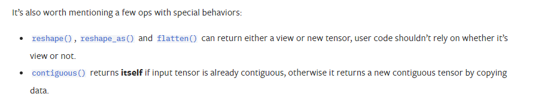

# 目录

- [1.Pytorch中的view、reshape方法的异同](#user-content-1Pytorch中的view、reshape方法的异同)

<h1 id="1CNN中池化的作用">1.CNN中池化的作用</h1>

## Pytorch官方文档的描述

## 深入探究
要想深入理解view和reshape方法的区别，我们需要先知道Pytorch中的Tensor是如何储存的。
### Pytorch中Tensor的储存形式
Pytorch中tensor采用分开储存的形式，分为头信息区（Tensor）和存储区（Storage）。tensor的形状（size）、步长（stride）、数据类型（type）等信息储存在头部信息区，而真正的数据则存储在存储区。

举个例子
```python
import torch
a = torch.arange(5) # 初始化张量 a 为 [0, 1, 2, 3, 4]
b = a[2:] # 截取张量a的部分值并赋值给b，b其实只是改变了a对数据的索引方式
print('a:', a)
print('b:', b)
print('ptr of storage of a:', a.storage().data_ptr()) # 打印a的存储区地址
print('ptr of storage of b:', b.storage().data_ptr()) # 打印b的存储区地址,可以发现两者是共用存储区
    
print('==================================================================')
    
b[1] = 0 # 修改b中索引为1，即a中索引为3的数据为0
print('a:', a)
print('b:', b)
print('ptr of storage of a:', a.storage().data_ptr()) # 打印a的存储区地址
print('ptr of storage of b:', b.storage().data_ptr()) # 打印b的存储区地址，可以发现两者是共用存储区
    
    
''' 运行结果 '''
a: tensor([0, 1, 2, 3, 4])
b: tensor([2, 3, 4])
ptr of storage of a: 2862826251264
ptr of storage of b: 2862826251264
==================================================================
a: tensor([0, 1, 2, 0, 4])
b: tensor([2, 0, 4])
ptr of storage of a: 2862826251264
ptr of storage of b: 2862826251264
```
以发现a、b这两个tensor的Storage都是一样的，但它们的头信息区不同。
### Pytorch中Tensor的stride属性
官方文档描述：stride是在指定维度dim中从一个元素跳到下一个元素所必需的步长。
举个例子
```python
import torch
x = torch.tensor([[1, 3, 5, 7], [7, 7, 7, 7]])
print(x)
print(x.stride(0))  # 打印第0维度中第一个元素到下一个元素的步长
print(x.stride(1))   # 打印第1维度中第一个元素到下一个元素的步长

''' 运行结果 '''
tensor([[1, 3, 5, 7],
        [7, 7, 7, 7]])
4
1
```

### view方法的限制
view方法能够将tensor转换为指定的shape，且原始的data不改变。返回的tensor与原始的tensor共享存储区。但view方法需要满足以下连续条件：
$\operatorname{stride}[i]=\text { stride }[i+1] \times \operatorname{size}[i+1]$
### 连续条件的理解
举个例子，我们初始化一个tensor a与b
```python
import torch
a = torch.arange(9).reshape(3, 3)  # 初始化张量a
b = a.permute(1, 0)  # 令b等于a的转置
print(a)   # 打印a
print(a.size())  # 查看a的shape
print(a.stride())  # 查看a的stride
print('==================================================================')
print(b)  # 打印b
print(b.size())  # 查看b的shape
print(b.stride())  # 查看b的stride

''' 运行结果 '''
tensor([[0, 1, 2],
        [3, 4, 5],
        [6, 7, 8]])
torch.Size([3, 3])
(3, 1)
==================================================================
tensor([[0, 3, 6],
        [1, 4, 7],
        [2, 5, 8]])
torch.Size([3, 3])
(1, 3)
```
我们将tensor a与b分别带入连续性条件公式进行验证，发现a可以满足而b不满足，下面我们尝试对tensor a与b进行view操作
```python
import torch
a = torch.arange(9).reshape(3, 3)  # 初始化张量a
b = a.permute(1, 0)  # 令b等于a的转置
print(a.view(-1))

''' 运行结果 '''
tensor([0, 1, 2, 3, 4, 5, 6, 7, 8])
```
```python
import torch
a = torch.arange(9).reshape(3, 3)  # 初始化张量a
b = a.permute(1, 0)  # 令b等于a的转置
print(b.view(-1))

''' 运行结果 '''
Traceback (most recent call last):
  File "C:/Users/97987/PycharmProjects/pytorch/test.py", line 4, in <module>
    print(b.view(-1))
RuntimeError: view size is not compatible with input tensor's size and stride (at least one dimension spans across two contiguous subspaces). Use .reshape(...) instead.
```
果然只有在满足连续性条件下才可以使用view方法。
如果不满足此条件，则需要先使用contiguous方法将原始tensor转换为满足连续条件的tensor，然后再使用view方法进行shape变换。但是经过contiguous方法变换后的tensor将重新开辟一个储存空间，不再与原始tensor共享内存。
```python
import torch
a = torch.arange(9).reshape(3, 3)  # 初始化张量a
b = a.permute(1, 0)  # 令b等于a的转置
c = b.contiguous()  # 使用contiguous方法
print(c.view(-1))
print(a.storage().data_ptr())
print(b.storage().data_ptr())
print(c.storage().data_ptr())

''' 运行结果 '''
tensor([0, 3, 6, 1, 4, 7, 2, 5, 8])
2610092185792
2610092185792
2610092184704
```
从以上结果可以看到，tensor a与c是属于不同存储区的张量，也就是说经过contiguous方法变换后的tensor将重新开辟一个储存空间，不再与原始tensor共享内存。
### reshape方法
与view方法类似，将输入tensor转换为新的shape格式，但是reshape方法是view方法与contiguous方法的综合。
也就是说当tensor满足连续性条件时，reshape方法返回的结果与view方法相同，否则返回的结果与先经过contiguous方法在进行view方法的结果相同。
## 结论
view方法和reshape方法都可以用来更改tensor的shape，但view只适合对满足连续性条件的tensor进行操作，而reshape同时还可以对不满足连续性条件的tensor进行操作，兼容性更好，而view方法可以节省内存，如果不满足连续性条件使用reshape方法则会重新开辟储存空间。


