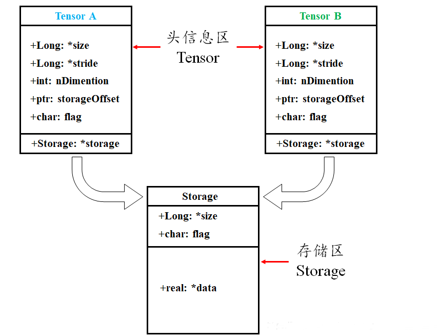
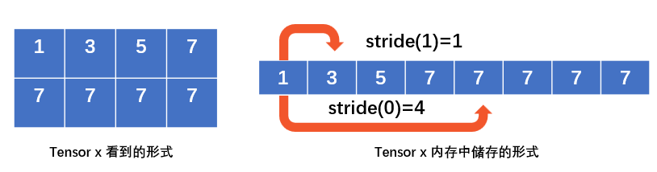

# 目录

- [1.Pytorch中的view、reshape方法的异同](#user-content-1.Pytorch中的view、reshape方法的异同)
- [2.PyTorch矩阵乘法详解](#2.PyTorch矩阵乘法详解)
- [3.PyTorch维度变化操作详解](#3.PyTorch维度变化操作详解)
- [4.PyTorch模型构建详解](#4.PyTorch模型构建详解)
- [5.PyTorch中的Module](#5.PyTorch中的Module)
- [6.PyTorch中常用的随机采样](#6.PyTorch中常用的随机采样)
- [7.PyTorch中对梯度计算的控制](#7.PyTorch中对梯度计算的控制)

<h1 id="1.Pytorch中的view、reshape方法的异同">1.Pytorch中的view、reshape方法的异同</h1>

## Pytorch官方文档的描述

## 深入探究
要想深入理解view和reshape方法的区别，我们需要先知道Pytorch中的Tensor是如何储存的。
### Pytorch中Tensor的储存形式
Pytorch中tensor采用分开储存的形式，分为头信息区（Tensor）和存储区（Storage）。tensor的形状（size）、步长（stride）、数据类型（type）等信息储存在头部信息区，而真正的数据则存储在存储区。

举个例子

```python
import torch
a = torch.arange(5) # 初始化张量 a 为 [0, 1, 2, 3, 4]
b = a[2:] # 截取张量a的部分值并赋值给b，b其实只是改变了a对数据的索引方式
print('a:', a)
print('b:', b)
print('ptr of storage of a:', a.storage().data_ptr()) # 打印a的存储区地址
print('ptr of storage of b:', b.storage().data_ptr()) # 打印b的存储区地址,可以发现两者是共用存储区
    
print('==================================================================')
    
b[1] = 0 # 修改b中索引为1，即a中索引为3的数据为0
print('a:', a)
print('b:', b)
print('ptr of storage of a:', a.storage().data_ptr()) # 打印a的存储区地址
print('ptr of storage of b:', b.storage().data_ptr()) # 打印b的存储区地址，可以发现两者是共用存储区
    
    
''' 运行结果 '''
a: tensor([0, 1, 2, 3, 4])
b: tensor([2, 3, 4])
ptr of storage of a: 2862826251264
ptr of storage of b: 2862826251264
==================================================================
a: tensor([0, 1, 2, 0, 4])
b: tensor([2, 0, 4])
ptr of storage of a: 2862826251264
ptr of storage of b: 2862826251264
```
以发现a、b这两个tensor的Storage都是一样的，但它们的头信息区不同。
### Pytorch中Tensor的stride属性
官方文档描述：stride是在指定维度dim中从一个元素跳到下一个元素所必需的步长。
举个例子
```python
import torch
x = torch.tensor([[1, 3, 5, 7], [7, 7, 7, 7]])
print(x)
print(x.stride(0))  # 打印第0维度中第一个元素到下一个元素的步长
print(x.stride(1))   # 打印第1维度中第一个元素到下一个元素的步长

''' 运行结果 '''
tensor([[1, 3, 5, 7],
        [7, 7, 7, 7]])
4
1
```

### view方法的限制
view方法能够将tensor转换为指定的shape，且原始的data不改变。返回的tensor与原始的tensor共享存储区。但view方法需要满足以下连续条件：
$\operatorname{stride}[i]=\text { stride }[i+1] \times \operatorname{size}[i+1]$
### 连续条件的理解
举个例子，我们初始化一个tensor a与b
```python
import torch
a = torch.arange(9).reshape(3, 3)  # 初始化张量a
b = a.permute(1, 0)  # 令b等于a的转置
print(a)   # 打印a
print(a.size())  # 查看a的shape
print(a.stride())  # 查看a的stride
print('==================================================================')
print(b)  # 打印b
print(b.size())  # 查看b的shape
print(b.stride())  # 查看b的stride

''' 运行结果 '''
tensor([[0, 1, 2],
        [3, 4, 5],
        [6, 7, 8]])
torch.Size([3, 3])
(3, 1)
==================================================================
tensor([[0, 3, 6],
        [1, 4, 7],
        [2, 5, 8]])
torch.Size([3, 3])
(1, 3)
```
我们将tensor a与b分别带入连续性条件公式进行验证，发现a可以满足而b不满足，下面我们尝试对tensor a与b进行view操作
```python
import torch
a = torch.arange(9).reshape(3, 3)  # 初始化张量a
b = a.permute(1, 0)  # 令b等于a的转置
print(a.view(-1))

''' 运行结果 '''
tensor([0, 1, 2, 3, 4, 5, 6, 7, 8])
```
```python
import torch
a = torch.arange(9).reshape(3, 3)  # 初始化张量a
b = a.permute(1, 0)  # 令b等于a的转置
print(b.view(-1))

''' 运行结果 '''
Traceback (most recent call last):
  File "C:/Users/97987/PycharmProjects/pytorch/test.py", line 4, in <module>
    print(b.view(-1))
RuntimeError: view size is not compatible with input tensor's size and stride (at least one dimension spans across two contiguous subspaces). Use .reshape(...) instead.
```
果然只有在满足连续性条件下才可以使用view方法。
如果不满足此条件，则需要先使用contiguous方法将原始tensor转换为满足连续条件的tensor，然后再使用view方法进行shape变换。但是经过contiguous方法变换后的tensor将重新开辟一个储存空间，不再与原始tensor共享内存。
```python
import torch
a = torch.arange(9).reshape(3, 3)  # 初始化张量a
b = a.permute(1, 0)  # 令b等于a的转置
c = b.contiguous()  # 使用contiguous方法
print(c.view(-1))
print(a.storage().data_ptr())
print(b.storage().data_ptr())
print(c.storage().data_ptr())

''' 运行结果 '''
tensor([0, 3, 6, 1, 4, 7, 2, 5, 8])
2610092185792
2610092185792
2610092184704
```
从以上结果可以看到，tensor a与c是属于不同存储区的张量，也就是说经过contiguous方法变换后的tensor将重新开辟一个储存空间，不再与原始tensor共享内存。
### reshape方法
与view方法类似，将输入tensor转换为新的shape格式，但是reshape方法是view方法与contiguous方法的综合。
也就是说当tensor满足连续性条件时，reshape方法返回的结果与view方法相同，否则返回的结果与先经过contiguous方法在进行view方法的结果相同。
## 结论
view方法和reshape方法都可以用来更改tensor的shape，但view只适合对满足连续性条件的tensor进行操作，而reshape同时还可以对不满足连续性条件的tensor进行操作，兼容性更好，而view方法可以节省内存，如果不满足连续性条件使用reshape方法则会重新开辟储存空间。


<h1 id="2.PyTorch矩阵乘法详解">2.PyTorch矩阵乘法详解</h1>

PyTorch作为深度学习领域的主流框架之一,提供了多种矩阵乘法操作。本文将详细介绍PyTorch中的各种矩阵乘法函数,帮助您在不同场景下选择最适合的方法。

## 1. torch.matmul()

`torch.matmul()`是PyTorch中最通用的矩阵乘法函数,可以处理多维张量。

### 特点:
- 支持广播机制
- 可以处理1维到4维的张量
- 根据输入张量的维度自动选择适当的乘法操作

### 示例:
```python
import torch

a = torch.randn(2, 3)
b = torch.randn(3, 4)
c = torch.matmul(a, b)  # 结果形状为 (2, 4)

# 也可以用@运算符
c = a @ b
```

## 2. torch.mm()

`torch.mm()`专门用于2维矩阵相乘。

### 特点:
- 只能处理2维矩阵
- 比`torch.matmul()`在某些情况下更快

### 示例:
```python
a = torch.randn(2, 3)
b = torch.randn(3, 4)
c = torch.mm(a, b)  # 结果形状为 (2, 4)
```

## 3. torch.bmm()

`torch.bmm()`用于批量矩阵乘法,处理3维张量。

### 特点:
- 输入必须是3维张量
- 用于同时计算多个矩阵乘法

### 示例:
```python
a = torch.randn(10, 3, 4)
b = torch.randn(10, 4, 5)
c = torch.bmm(a, b)  # 结果形状为 (10, 3, 5)
```

## 4. @运算符

Python 3.5+引入的矩阵乘法运算符,在PyTorch中也可使用。

### 特点:
- 语法简洁
- 功能等同于`torch.matmul()`

### 示例:
```python
a = torch.randn(2, 3)
b = torch.randn(3, 4)
c = a @ b  # 结果形状为 (2, 4)
```

## 5. torch.dot()

`torch.dot()`计算两个一维张量的点积。

### 特点:
- 只能用于1维张量
- 返回一个标量

### 示例:
```python
a = torch.randn(5)
b = torch.randn(5)
c = torch.dot(a, b)  # 结果是一个标量
```

## 6. torch.mv()

`torch.mv()`用于矩阵与向量相乘。

### 特点:
- 第一个参数必须是2维矩阵
- 第二个参数必须是1维向量

### 示例:
```python
matrix = torch.randn(3, 4)
vector = torch.randn(4)
result = torch.mv(matrix, vector)  # 结果形状为 (3,)
```

## 7. torch.einsum()

`torch.einsum()`使用爱因斯坦求和约定,可以执行更复杂的张量运算,包括矩阵乘法。

### 特点:
- 非常灵活,可以表达复杂的张量运算
- 语法简洁但可能难以理解

### 示例:
```python
a = torch.randn(2, 3)
b = torch.randn(3, 4)
c = torch.einsum('ij,jk->ik', a, b)  # 等同于矩阵乘法,结果形状为 (2, 4)
```

## 总结

PyTorch提供了多种矩阵乘法操作,适用于不同的场景:
- 对于一般情况,使用`torch.matmul()`或`@`运算符
- 对于2维矩阵乘法,可以使用`torch.mm()`
- 对于批量矩阵乘法,使用`torch.bmm()`
- 对于向量点积,使用`torch.dot()`
- 对于矩阵与向量相乘,使用`torch.mv()`
- 对于更复杂的张量运算,可以考虑`torch.einsum()`

选择合适的函数可以提高代码的可读性和运行效率。在实际应用中,建议根据具体情况选择最合适的方法。

<h1 id="3.PyTorch维度变化操作详解">3.PyTorch维度变化操作详解</h1>

PyTorch作为深度学习领域的主流框架，提供了丰富的维度变化操作。这些操作在数据预处理、模型构建和结果处理中都扮演着重要角色。本文将详细介绍PyTorch中的各种维度变化操作，帮助您更好地理解和使用这些功能。

## 1. view() 和 reshape()

这两个函数用于改变张量的形状，但不改变其数据。

### view()
- 要求张量在内存中是连续的
- 不会复制数据，只是改变视图

```python
import torch

x = torch.randn(4, 4)
y = x.view(16)
z = x.view(-1, 8)  # -1表示这个维度的大小将被自动计算
```

### reshape()
- 类似于view()，但可以处理非连续的张量
- 如果可能，不会复制数据

```python
a = torch.randn(4, 4)
b = a.reshape(2, 8)
```

## 2. squeeze() 和 unsqueeze()

这对函数用于移除或添加维度。

### squeeze()
移除大小为1的维度

```python
x = torch.zeros(2, 1, 3, 1, 4)
y = x.squeeze()  # y.shape: (2, 3, 4)
z = x.squeeze(1)  # z.shape: (2, 3, 1, 4)
```

### unsqueeze()
在指定位置添加大小为1的维度

```python
x = torch.tensor([1, 2, 3])
y = x.unsqueeze(0)  # y.shape: (1, 3)
z = x.unsqueeze(1)  # z.shape: (3, 1)
```

## 3. transpose() 和 permute()

这两个函数用于交换维度。

### transpose()
交换两个指定的维度

```python
x = torch.randn(2, 3, 5)
y = x.transpose(0, 2)  # y.shape: (5, 3, 2)
```

### permute()
可以对任意维度进行重新排列

```python
x = torch.randn(2, 3, 5)
y = x.permute(2, 0, 1)  # y.shape: (5, 2, 3)
```

## 4. expand() 和 repeat()

这两个函数用于扩展tensor的大小。

### expand()
- 不会分配新内存，只是创建一个新的视图
- 只能扩展大小为1的维度

```python
x = torch.tensor([[1], [2], [3]])
y = x.expand(3, 4)  # y: [[1, 1, 1, 1], [2, 2, 2, 2], [3, 3, 3, 3]]
```

### repeat()
- 会分配新内存，复制数据
- 可以沿着任意维度重复tensor

```python
x = torch.tensor([1, 2, 3])
y = x.repeat(2, 3)  # y: [[1, 2, 3, 1, 2, 3, 1, 2, 3], [1, 2, 3, 1, 2, 3, 1, 2, 3]]
```

## 5. flatten() 和 ravel()

这两个函数用于将多维张量展平成一维。

### flatten()
将张量展平成一维

```python
x = torch.randn(2, 3, 4)
y = x.flatten()  # y.shape: (24,)
z = x.flatten(start_dim=1)  # z.shape: (2, 12)
```

### ravel()
功能类似于flatten()，但返回的可能是一个视图

```python
x = torch.randn(2, 3, 4)
y = x.ravel()  # y.shape: (24,)
```

## 6. stack() 和 cat()

这两个函数用于连接张量。

### stack()
沿着新维度连接张量

```python
x = torch.randn(3, 4)
y = torch.randn(3, 4)
z = torch.stack([x, y])  # z.shape: (2, 3, 4)
```

### cat()
沿着已存在的维度连接张量

```python
x = torch.randn(2, 3)
y = torch.randn(2, 5)
z = torch.cat([x, y], dim=1)  # z.shape: (2, 8)
```

## 7. split() 和 chunk()

这两个函数用于将张量分割成多个部分。

### split()
将张量分割成指定大小的块

```python
x = torch.randn(5, 10)
y = torch.split(x, 2, dim=0)  # 返回一个元组，包含3个tensor，形状分别为(2, 10), (2, 10), (1, 10)
```

### chunk()
将张量均匀分割成指定数量的块

```python
x = torch.randn(5, 10)
y = torch.chunk(x, 3, dim=1)  # 返回一个元组，包含3个tensor，形状分别为(5, 4), (5, 3), (5, 3)
```

## 8. broadcast_to()

将张量广播到指定的形状。

```python
x = torch.randn(3, 1)
y = torch.broadcast_to(x, (3, 5))  # y.shape: (3, 5)
```

## 9. narrow()

可以用来缩小张量的某个维度。

```python
x = torch.randn(3, 5)
y = x.narrow(1, 1, 2)  # 在第1维（列）上，从索引1开始，选择2个元素
```

## 10. unfold()

将张量的某个维度展开。

```python
x = torch.arange(1, 8)
y = x.unfold(0, 3, 1)  # 步长为1的滑动窗口操作，窗口大小为3
```

## 总结

PyTorch提供了丰富的维度变化操作，可以满足各种数据处理和模型构建的需求：
- 改变形状：view(), reshape()
- 添加/删除维度：squeeze(), unsqueeze()
- 交换维度：transpose(), permute()
- 扩展大小：expand(), repeat()
- 展平：flatten(), ravel()
- 连接：stack(), cat()
- 分割：split(), chunk()
- 广播：broadcast_to()
- 裁剪和展开：narrow(), unfold()

熟练掌握这些操作可以帮助你更高效地处理张量数据，构建复杂的神经网络模型。

<h1 id="4.PyTorch模型构建详解">4.PyTorch模型构建详解</h1>

PyTorch是一个强大的深度学习框架，提供了丰富的工具和组件用于构建各种类型的神经网络模型。本文将全面介绍PyTorch中用于模型构建的主要操作和组件。

## 1. nn.Module

`nn.Module`是PyTorch中所有神经网络模块的基类。自定义模型通常继承自这个类。

```python
import torch.nn as nn

class MyModel(nn.Module):
    def __init__(self):
        super(MyModel, self).__init__()
        self.layer1 = nn.Linear(10, 20)
        self.layer2 = nn.Linear(20, 2)

    def forward(self, x):
        x = torch.relu(self.layer1(x))
        return self.layer2(x)

model = MyModel()
```

## 2. nn.Sequential

`nn.Sequential`是一个有序的模块容器，用于快速构建线性结构的网络。

```python
model = nn.Sequential(
    nn.Linear(10, 20),
    nn.ReLU(),
    nn.Linear(20, 2)
)
```

## 3. 常用层类型

### 3.1 全连接层 (nn.Linear)

```python
linear_layer = nn.Linear(in_features=10, out_features=20)
```

### 3.2 卷积层 (nn.Conv2d)

```python
conv_layer = nn.Conv2d(in_channels=3, out_channels=16, kernel_size=3, stride=1, padding=1)
```

### 3.3 循环神经网络层 (nn.RNN, nn.LSTM, nn.GRU)

```python
rnn_layer = nn.RNN(input_size=10, hidden_size=20, num_layers=2)
lstm_layer = nn.LSTM(input_size=10, hidden_size=20, num_layers=2)
gru_layer = nn.GRU(input_size=10, hidden_size=20, num_layers=2)
```

### 3.4 Transformer (nn.Transformer)

```python
transformer_layer = nn.Transformer(d_model=512, nhead=8, num_encoder_layers=6, num_decoder_layers=6)
```

## 4. 激活函数

PyTorch提供了多种激活函数：

```python
relu = nn.ReLU()
sigmoid = nn.Sigmoid()
tanh = nn.Tanh()
leaky_relu = nn.LeakyReLU(negative_slope=0.01)
```

## 5. 池化层

常用的池化层包括最大池化和平均池化：

```python
max_pool = nn.MaxPool2d(kernel_size=2, stride=2)
avg_pool = nn.AvgPool2d(kernel_size=2, stride=2)
```

## 6. 归一化层

归一化层有助于稳定训练过程：

```python
batch_norm = nn.BatchNorm2d(num_features=16)
layer_norm = nn.LayerNorm(normalized_shape=[20, 30])
```

## 7. 损失函数

PyTorch提供了多种损失函数：

```python
mse_loss = nn.MSELoss()
cross_entropy_loss = nn.CrossEntropyLoss()
bce_loss = nn.BCELoss()
```

## 8. 优化器

优化器用于更新模型参数：

```python
import torch.optim as optim

model = MyModel()
sgd_optimizer = optim.SGD(model.parameters(), lr=0.01, momentum=0.9)
adam_optimizer = optim.Adam(model.parameters(), lr=0.001)
```

## 9. 参数初始化

正确的参数初始化对模型训练很重要：

```python
def init_weights(m):
    if isinstance(m, nn.Linear):
        nn.init.xavier_uniform_(m.weight)
        nn.init.zeros_(m.bias)

model = MyModel()
model.apply(init_weights)
```

## 10. 模型保存和加载

保存和加载模型是很常见的操作：

```python
# 保存模型
torch.save(model.state_dict(), 'model.pth')

# 加载模型
model = MyModel()
model.load_state_dict(torch.load('model.pth'))
model.eval()
```

## 11. 数据并行处理

对于多GPU训练，可以使用`DataParallel`：

```python
model = nn.DataParallel(model)
```

## 12. 自定义层

可以通过继承`nn.Module`来创建自定义层：

```python
class MyCustomLayer(nn.Module):
    def __init__(self, in_features, out_features):
        super(MyCustomLayer, self).__init__()
        self.linear = nn.Linear(in_features, out_features)
    
    def forward(self, x):
        return torch.sigmoid(self.linear(x))

custom_layer = MyCustomLayer(10, 5)
```

## 13. 模型训练循环

这里是一个基本的训练循环示例：

```python
model = MyModel()
criterion = nn.CrossEntropyLoss()
optimizer = optim.Adam(model.parameters(), lr=0.001)

for epoch in range(num_epochs):
    for inputs, labels in dataloader:
        optimizer.zero_grad()
        outputs = model(inputs)
        loss = criterion(outputs, labels)
        loss.backward()
        optimizer.step()
```

## 14. 模型评估

在训练后评估模型性能：

```python
model.eval()
with torch.no_grad():
    for inputs, labels in test_dataloader:
        outputs = model(inputs)
        # 计算准确率或其他指标
```

## 结论

PyTorch提供了丰富的工具和组件用于构建各种类型的神经网络模型。从基本的层和激活函数，到高级的优化器和并行处理，PyTorch都提供了强大的支持。熟练掌握这些组件和操作可以帮助你更高效地设计和实现复杂的深度学习模型。


<h1 id="5.PyTorch中的Module">5.PyTorch中的Module</h1>

PyTorch 使用模块（modules）来表示神经网络。模块具有以下特性：

- **构建状态计算的基石**。PyTorch 提供了一个强大的模块库，并且简化了定义新自定义模块的过程，从而轻松构建复杂的多层神经网络。

- **与 PyTorch 的自动微分系统紧密集成**。模块使得指定 PyTorch 优化器要更新的可学习参数变得简单。

- **易于操作和转换**。模块可以方便地保存和恢复，且可以在 CPU / GPU / TPU 设备之间转换、剪枝、量化等。

## 一个简单的自定义模块

首先，让我们看一个简单的自定义版本的 PyTorch 的 `Linear` 模块。这个模块对其输入应用仿射变换。

```python
import torch
from torch import nn

class MyLinear(nn.Module):
  def __init__(self, in_features, out_features):
    super().__init__()
    self.weight = nn.Parameter(torch.randn(in_features, out_features))
    self.bias = nn.Parameter(torch.randn(out_features))

  def forward(self, input):
    return (input @ self.weight) + self.bias
```

这个简单模块具备了模块的基本特征：

- **继承自 `Module` 基类**。所有模块应该继承自 `Module` 以便与其他模块组合。

- **定义了一些在计算中使用的“状态”**。这里，状态由随机初始化的权重和偏置张量组成，这些张量定义了仿射变换。因为每个都是 `Parameter`，所以它们会自动注册为模块的参数，并且在调用 `parameters()` 时会返回。参数可以看作是模块计算的“可学习”方面（更多内容在后面）。请注意，模块不是必须有状态的，也可以是无状态的。

- **定义了一个执行计算的 `forward()` 函数**。对于这个仿射变换模块，输入与权重参数进行矩阵相乘（使用 `@` 符号）并加上偏置参数以生成输出。更一般地，模块的 `forward()` 实现可以执行涉及任意数量输入和输出的任意计算。

这个简单模块演示了模块如何将状态和计算打包在一起。可以构建和调用此模块的实例：

```python
m = MyLinear(4, 3)
sample_input = torch.randn(4)
m(sample_input)
# tensor([-0.3037, -1.0413, -4.2057], grad_fn=<AddBackward0>)
```

注意模块本身是可调用的，调用它会触发其 `forward()` 函数。这个名字是参考“前向传递”和“反向传递”的概念，适用于每个模块。前向传递负责将模块表示的计算应用于给定输入（如上所示）。反向传递计算模块输出相对于其输入的梯度，可以用于通过梯度下降方法“训练”参数。PyTorch 的自动微分系统会自动处理这个反向传递计算，因此不需要为每个模块手动实现 `backward()` 函数。通过连续的前向/反向传递来训练模块参数的过程将在“使用模块进行神经网络训练”一节中详细介绍。

可以通过调用 `parameters()` 或 `named_parameters()` 迭代模块注册的所有参数，后者包括每个参数的名称：

```python
for parameter in m.named_parameters():
  print(parameter)
# ('weight', Parameter containing:
# tensor([[ 1.0597,  1.1796,  0.8247],
#        [-0.5080, -1.2635, -1.1045],
#        [ 0.0593,  0.2469, -1.4299],
#        [-0.4926, -0.5457,  0.4793]], requires_grad=True))
# ('bias', Parameter containing:
# tensor([ 0.3634,  0.2015, -0.8525], requires_grad=True))
```

通常，模块注册的参数是模块计算中应该“学习”的方面。本文后面的部分将展示如何使用 PyTorch 的优化器更新这些参数。在此之前，让我们先看看模块如何相互组合。

## 模块作为构建块

模块可以包含其他模块，使其成为开发更复杂功能的有用构建块。最简单的方法是使用 `Sequential` 模块。它允许我们将多个模块串联在一起：

```python
net = nn.Sequential(
  MyLinear(4, 3),
  nn.ReLU(),
  MyLinear(3, 1)
)

sample_input = torch.randn(4)
net(sample_input)
# tensor([-0.6749], grad_fn=<AddBackward0>)
```

注意 `Sequential` 自动将第一个 `MyLinear` 模块的输出作为输入传递给 `ReLU`，然后将其输出作为输入传递给第二个 `MyLinear` 模块。如所示，它仅限于具有单一输入和输出的模块的按顺序链接。

一般来说，建议为简单用例之外的任何情况定义自定义模块，因为这提供了对子模块用于模块计算的完全灵活性。

例如，下面是一个简单神经网络实现为自定义模块：

```python
import torch.nn.functional as F

class Net(nn.Module):
  def __init__(self):
    super().__init__()
    self.l0 = MyLinear(4, 3)
    self.l1 = MyLinear(3, 1)
  def forward(self, x):
    x = self.l0(x)
    x = F.relu(x)
    x = self.l1(x)
    return x
```

该模块由定义神经网络层的两个“子模块”（`l0` 和 `l1`）组成，并在模块的 `forward()` 方法中用于计算。可以通过调用 `children()` 或 `named_children()` 迭代模块的直接子模块：

```python
net = Net()
for child in net.named_children():
  print(child)
# ('l0', MyLinear())
# ('l1', MyLinear())
```

要深入到直接子模块，可以递归调用 `modules()` 和 `named_modules()` 迭代一个模块及其子模块：

```python
class BigNet(nn.Module):
  def __init__(self):
    super().__init__()
    self.l1 = MyLinear(5, 4)
    self.net = Net()
  def forward(self, x):
    return self.net(self.l1(x))

big_net = BigNet()
for module in big_net.named_modules():
  print(module)
# ('', BigNet(
#   (l1): MyLinear()
#   (net): Net(
#     (l0): MyLinear()
#     (l1): MyLinear()
#   )
# ))
# ('l1', MyLinear())
# ('net', Net(
#   (l0): MyLinear()
#   (l1): MyLinear()
# ))
# ('net.l0', MyLinear())
# ('net.l1', MyLinear())
```

有时，模块需要动态定义子模块。这时 `ModuleList` 和 `ModuleDict` 模块很有用，它们从列表或字典中注册子模块：

```python
class DynamicNet(nn.Module):
  def __init__(self, num_layers):
    super().__init__()
    self.linears = nn.ModuleList(
      [MyLinear(4, 4) for _ in range(num_layers)])
    self.activations = nn.ModuleDict({
      'relu': nn.ReLU(),
      'lrelu': nn.LeakyReLU()
    })
    self.final = MyLinear(4, 1)
  def forward(self, x, act):
    for linear in self.linears:
      x = linear(x)
    x = self.activations[act](x)
    x = self.final(x)
    return x

dynamic_net = DynamicNet(3)
sample_input = torch.randn(4)
output = dynamic_net(sample_input, 'relu')
```

对于任何给定的模块，它的参数包括其直接参数以及所有子模块的参数。这意味着调用 `parameters()` 和 `named_parameters()` 会递归包含子参数，从而方便地优化网络内的所有参数：

```python
for parameter in dynamic_net.named_parameters():
  print(parameter)
# ('linears.0.weight', Parameter containing:
# tensor([[-1.2051,  0.7601,  1.1065,  0.1963],
#         [ 3.0592,  0.4354,  1.6598,  0.9828],
#         [-0.4446,  0.4628,  0.8774,  1.6848],
#         [-0.1222,  1.5458,  1.1729,  1.4647]], requires_grad=True))
# ('linears.0.bias', Parameter containing:
# tensor([ 1.5310,  1.0609, -2.0940,  1.126

9], requires_grad=True))
# ...
# ('final.weight', Parameter containing:
# tensor([[-0.0570,  0.4325,  0.4118, -1.6617]], requires_grad=True))
# ('final.bias', Parameter containing:
# tensor([-0.6704], requires_grad=True))
```

### 用模块训练神经网络

到目前为止，我们只定义了模块并调用了它们的 `forward()` 方法来生成计算输出。为了训练模块，需要使用样本数据并根据该数据调整参数以优化目标函数的结果。

#### 1. 准备样本数据

对于以下示例，将使用 PyTorch 的数据加载器接口从随机生成的 `DataLoader` 中加载样本数据。

```python
from torch.utils.data import DataLoader, TensorDataset

num_samples = 2000
num_features = 10

x = torch.randn(num_samples, num_features)
y = torch.randn(num_samples, 1)

dataset = TensorDataset(x, y)
dataloader = DataLoader(dataset, batch_size=64, shuffle=True)
```

#### 2. 定义模型

接下来，定义一个简单的神经网络模块。

```python
class SimpleNet(nn.Module):
  def __init__(self):
    super(SimpleNet, self).__init__()
    self.linear1 = nn.Linear(num_features, 5)
    self.relu = nn.ReLU()
    self.linear2 = nn.Linear(5, 1)

  def forward(self, x):
    x = self.linear1(x)
    x = self.relu(x)
    x = self.linear2(x)
    return x
```

#### 3. 定义损失函数和优化器

```python
model = SimpleNet()
criterion = nn.MSELoss()
optimizer = torch.optim.SGD(model.parameters(), lr=0.01)
```

#### 4. 训练模型

```python
for epoch in range(20):
  for batch_x, batch_y in dataloader:
    optimizer.zero_grad()
    output = model(batch_x)
    loss = criterion(output, batch_y)
    loss.backward()
    optimizer.step()
  print(f'Epoch [{epoch+1}/20], Loss: {loss.item():.4f}')
```

这个示例展示了如何构建一个简单的模块并使用 PyTorch 的优化器和损失函数进行训练。通过训练，模型参数将逐渐调整以最小化损失函数的值，从而实现模型对样本数据的最佳拟合。

这样，通过模块和 PyTorch 的各种工具，可以构建、训练和优化复杂的神经网络模型，进而实现各种深度学习任务。


<h1 id="6.PyTorch中常用的随机采样">6.PyTorch中常用的随机采样</h1>

## 设置随机种子

### `seed`
```python
torch.seed()
```
在所有设备上设置用于生成随机数的种子为一个非确定性的随机数。

### `manual_seed`
```python
torch.manual_seed(seed)
```
在所有设备上设置用于生成随机数的种子。

### `initial_seed`
```python
torch.initial_seed()
```
返回用于生成随机数的初始种子。

### `get_rng_state`
```python
torch.get_rng_state()
```
返回随机数生成器的状态，类型为`torch.ByteTensor`。

### `set_rng_state`
```python
torch.set_rng_state(state)
```
设置随机数生成器的状态。

### `torch.default_generator`
```python
torch.default_generator
```
返回默认的CPU `torch.Generator`。

## 常用的随机采样方法

### `rand`
```python
torch.rand(size)
```
返回一个张量，其中包含从区间 [0, 1) 的均匀分布中生成的随机数。

### `randint`
```python
torch.randint(low, high, size)
```
返回一个张量，其中包含在 [low, high) 区间内均匀生成的随机整数。

### `randn`
```python
torch.randn(size)
```
返回一个张量，其中包含从均值为0、方差为1的正态分布（标准正态分布）中生成的随机数。

### `randperm`
```python
torch.randperm(n)
```
返回从0到n-1的随机排列。

### `bernoulli`
```python
torch.bernoulli(input)
```
从伯努利分布中抽取二元随机数（0或1），概率由输入张量的值指定。

### `multinomial`
```python
torch.multinomial(input, num_samples)
```
返回一个张量，其中每行包含从多项分布（严格定义为多变量分布）中采样的`num_samples`个索引。

### `normal`
```python
torch.normal(mean, std)
```
返回一个张量，其中包含从均值和标准差指定的正态分布中生成的随机数。

### `poisson`
```python
torch.poisson(input)
```
返回一个与输入张量大小相同的张量，其中每个元素是从泊松分布中采样的，速率参数由对应的输入元素指定。

## 使用示例

### 设置随机种子
```python
import torch
torch.manual_seed(42)
```

### 生成随机数
```python
# 生成一个3x3的均匀分布随机张量
rand_tensor = torch.rand(3, 3)
print(rand_tensor)

# 生成一个3x3的标准正态分布随机张量
randn_tensor = torch.randn(3, 3)
print(randn_tensor)

# 生成从0到9的随机排列
randperm_tensor = torch.randperm(10)
print(randperm_tensor)
```

以上列举了在PyTorch中常用的随机采样方法和设置随机数生成器种子的方法。通过合理使用这些方法，可以确保模型训练的可重复性和随机过程的控制。


<h1 id="7.PyTorch中对梯度计算的控制">7.PyTorch中对梯度计算的控制</h1>

在PyTorch中，可以使用一些上下文管理器（context managers）来局部禁用或启用梯度计算。这些管理器包括`torch.no_grad()`、`torch.enable_grad()`和`torch.set_grad_enabled()`。这些管理器在本地线程中起作用，因此如果使用`threading`模块将工作发送到另一个线程，它们将不起作用。

## 常见上下文管理器及其用法

### `torch.no_grad`
禁用梯度计算的上下文管理器。

### `torch.enable_grad`
启用梯度计算的上下文管理器。

### `torch.set_grad_enabled`
设置梯度计算状态的上下文管理器。

### `autograd.grad_mode.set_grad_enabled`
设置梯度计算状态的上下文管理器。

### `is_grad_enabled`
返回当前是否启用了梯度计算。

### `autograd.grad_mode.inference_mode`
启用或禁用推理模式的上下文管理器。

### `is_inference_mode_enabled`
返回当前是否启用了推理模式。

## 用法示例

### 使用`torch.no_grad`禁用梯度计算
```python
import torch

x = torch.zeros(1, requires_grad=True)
with torch.no_grad():
    y = x * 2
print(y.requires_grad)  # 输出: False
```

### 使用`torch.set_grad_enabled`动态设置梯度计算状态
```python
import torch

x = torch.zeros(1, requires_grad=True)

# 禁用梯度计算
is_train = False
with torch.set_grad_enabled(is_train):
    y = x * 2
print(y.requires_grad)  # 输出: False

# 启用梯度计算
torch.set_grad_enabled(True)  # 也可以作为一个函数来使用
y = x * 2
print(y.requires_grad)  # 输出: True

# 再次禁用梯度计算
torch.set_grad_enabled(False)
y = x * 2
print(y.requires_grad)  # 输出: False
```

### 使用`is_grad_enabled`检查当前梯度计算状态
```python
import torch

torch.set_grad_enabled(True)
print(torch.is_grad_enabled())  # 输出: True

torch.set_grad_enabled(False)
print(torch.is_grad_enabled())  # 输出: False
```

### 使用`autograd.grad_mode.inference_mode`启用或禁用推理模式
```python
import torch

with torch.autograd.grad_mode.inference_mode():
    x = torch.randn(3, 3)
    y = x * 2
print(torch.is_inference_mode_enabled())  # 输出: False (因为推理模式只在上下文管理器内有效)
```

以上示例展示了如何使用这些上下文管理器来控制PyTorch中的梯度计算。这些工具对于在训练和推理过程中优化计算资源非常有用。
