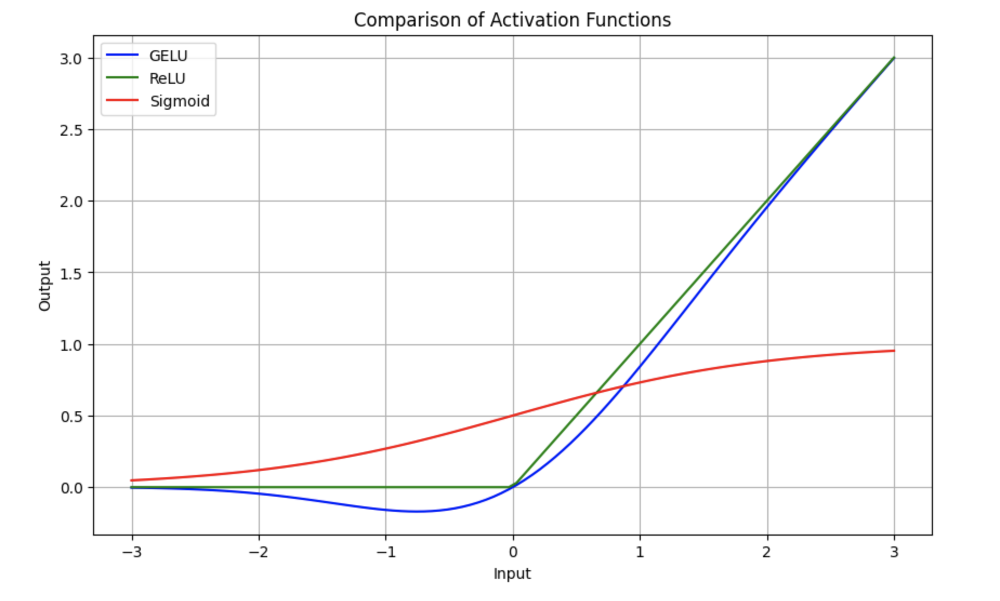
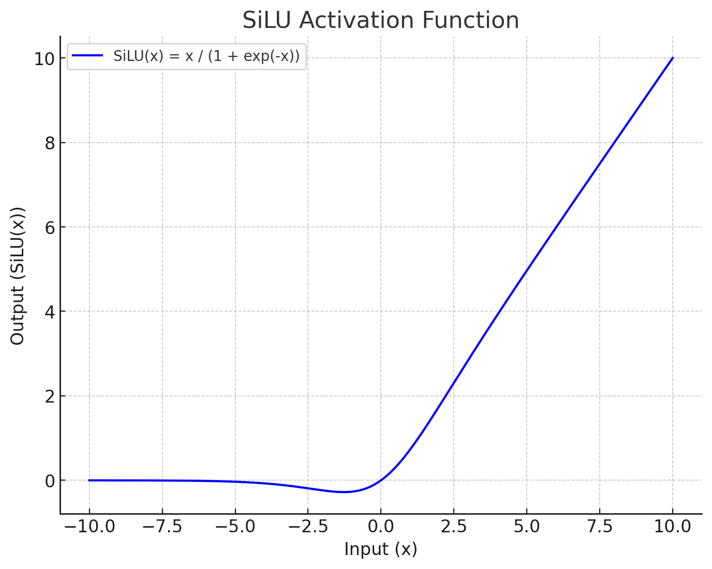

# 目录
- [1.激活函数的作用，常用的激活函数有哪些](#user-content-1激活函数的作用，常用的激活函数有哪些)
- [2.什么是GELU激活函数？](#user-content-2什么是GELU激活函数？)
- [3.什么是SiLU激活函数？](#user-content-3什么是SiLU激活函数？)
- [4.什么是NewGELU激活函数？](#user-content-4什么是NewGELU激活函数？)

<h1 id="1激活函数的作用，常用的激活函数有哪些">1.激活函数的作用，常用的激活函数有哪些</h1>

### 激活函数的作用

激活函数可以引入非线性因素，提升网络的学习表达能力。

### 常用的激活函数

**Sigmoid 激活函数**

 函数的定义为：
 
 $$f(x) = \frac{1}{1 + e^{-x}}$$

如下图所示，其值域为 $(0,1)$ 。也就是说，输入的每个神经元、节点都会被缩放到一个介于 $0$ 和 $1$ 之间的值。

当 $x$ 大于零时输出结果会趋近于 $1$ ，而当 $x$ 小于零时，输出结果趋向于 $0$ ，由于函数的特性，经常被用作二分类的输出端激活函数。

Sigmoid的导数:

$$f^{'}(x)=(\frac{1}{1+e^{-x}})^{'}=\frac{1}{1+e^{-x}}\left( 1- \frac{1}{1+e^{-x}} \right)=f(x)(1-f(x))$$

当 $x=0$ 时， $f(x)'=0.25$ 。

Sigmoid的优点:
1. 平滑
2. 易于求导
3. 可以作为概率，辅助解释模型的输出结果

Sigmoid的缺陷:

1. 当输入数据很大或者很小时，函数的梯度几乎接近于0，这对神经网络在反向传播中的学习非常不利。
2. Sigmoid函数的均值不是0，这使得神经网络的训练过程中只会产生全正或全负的反馈。
3. 导数值恒小于1，反向传播易导致梯度消失。

**Tanh激活函数**

Tanh函数的定义为：

$$f(x) = Tanh(x) = \frac{e^x - e^{-x}}{e^x + e^{-x}}$$

如下图所示，值域为 $(-1,1)$ 。

Tanh的优势：

1. Tanh函数把数据压缩到-1到1的范围，解决了Sigmoid函数均值不为0的问题，所以在实践中通常Tanh函数比Sigmoid函数更容易收敛。在数学形式上其实Tanh只是对Sigmoid的一个缩放形式，公式为 $tanh(x) = 2f(2x) -1$（ $f(x)$ 是Sigmoid的函数）。
2. 平滑
3. 易于求导

Tanh的导数:

$$f^{'}(x)=(\frac{e^x - e^{-x}}{e^x + e^{-x}})^{'}=1-(tanh(x))^2$$

当 $x=0$ 时，$f(x)'=1$ 。

由Tanh和Sigmoid的导数也可以看出Tanh导数更陡，收敛速度比Sigmoid快。

Tanh的缺点：

导数值恒小于1，反向传播易导致梯度消失。

**Relu激活函数**

Relu激活函数的定义为：

$$f(x) = max(0, x)$$  

如下图所示，值域为 $[0,+∞)$ 。

ReLU的优势：

1. 计算公式非常简单，不像上面介绍的两个激活函数那样涉及成本更高的指数运算，大量节约了计算时间。
2. 在随机梯度下降中比Sigmoid和Tanh更加容易使得网络收敛。
3. ReLU进入负半区的时候，梯度为0，神经元此时会训练形成单侧抑制，产生稀疏性，能更好更快地提取稀疏特征。
4. Sigmoid和Tanh激活函数的导数在正负饱和区的梯度都会接近于0，这会造成梯度消失，而ReLU函数大于0部分都为常数保持梯度不衰减，不会产生梯度消失现象。

稀疏：在神经网络中，这意味着激活的矩阵含有许多0。这种稀疏性能让我们得到什么？这能提升时间和空间复杂度方面的效率，常数值所需空间更少，计算成本也更低。

ReLU的导数：

$$c(u)=\begin{cases} 0,x<0 \\ 1,x>0 \\ undefined,x=0\end{cases}$$

通常 $x=0$ 时，给定其导数为 $1$ 和 $0$ 。

ReLU的不足:

1. 训练中可能会导致出现某些神经元永远无法更新的情况。其中一种对ReLU函数的改进方式是LeakyReLU。
2. ReLU不能避免梯度爆炸问题。

**LeakyReLU激活函数** 

LeakyReLU激活函数定义为： 

$$f(x) =  \left\{
   \begin{aligned}
   ax, \quad x<0 \\
   x, \quad x\ge0
   \end{aligned}
   \right.$$

如下图所示（ $a = 0.5$ ），值域为 $(-∞,+∞)$ 。 

LeakyReLU的优势:

该方法与ReLU不同的是在$x$小于0的时候取 $f(x) = ax$ ，其中$a$是一个非常小的斜率（比如0.01）。这样的改进可以使得当 $x$ 小于0的时候也不会导致反向传播时的梯度消失现象。

LeakyReLU的不足:

1. 无法避免梯度爆炸的问题。
2. 神经网络不学习 $\alpha$ 值。
3. 在求导的时候，两部分都是线性的。

**SoftPlus激活函数**

SoftPlus激活函数的定义为：

$$f(x) = ln( 1 + e^x)$$

值域为 $(0,+∞)$ 。

函数图像如下:

可以把SoftPlus看作是ReLU的平滑。

**ELU激活函数**

ELU激活函数解决了ReLU的一些问题，同时也保留了一些好的方面。这种激活函数要选取一个 $\alpha$ 值，其常见的取值是在0.1到0.3之间。

函数定义如下所示：

$$f(x) =  \left\{
   \begin{aligned}
   a(e^x -1), \quad x<0 \\
   x, \quad x\ge0
   \end{aligned}
   \right.$$

如果我们输入的 $x$ 值大于 $0$ ，则结果与ReLU一样，即 $y$ 值等于 $x$ 值；但如果输入的 $x$ 值小于 $0$ ，则我们会得到一个稍微小于 $0$ 的值，所得到的 $y$ 值取决于输入的 $x$ 值，但还要兼顾参数 $\alpha$ ——可以根据需要来调整这个参数。公式进一步引入了指数运算 $e^x$ ，因此ELU的计算成本比ReLU高。

下面给出了 $\alpha$ 值为0.2时的ELU函数图：

ELU的导数：

导数图如下所示：

ELU的优势：

1. 能避免ReLU中一些神经元无法更新的情况。
2. 能得到负值输出。

ELU的不足：

1. 包含指数运算，计算时间长。
2. 无法避免梯度爆炸问题。
3. 神经网络无法学习 $\alpha$ 值。

<h1 id="2什么是GELU激活函数？">2.什么是GELU激活函数？</h1>

首先我们看一下GELU激活函数的公式：

$$GELU(x) = 0.5 \times x \times \left(1 + \tanh\left(\sqrt{\frac{2}{\pi}} \times \left(x + 0.044715 \times x^3\right)\right)\right)$$

了解了GELU激活函数的计算机制后，我们再将其与经典的ReLU激活函数、Sigmoid激活函数进行比较，能够更好的理解GELU激活函数的优势，下面是三者的对比图：

其中 x 代表输入的网络权重参数。

假设我们设置输入值为 x=1.0，最终可以得到GELU激活函数的输出值为： 

$$GELU(1.0) = 0.5 \times 1.0 \times (1 + 0.683675) = 0.5 \times 1.0 \times 1.683675 \approx 0.8418375$$

了解了GELU激活函数的计算机制后，我们再将其与经典的ReLU激活函数、Sigmoid激活函数进行比较，能够更好的理解GELU激活函数的优势，下面是三者的对比图：

从上图可以看出：

1. ReLU激活函数在输入为正数时，输出与输入相同；在输入为负数时，输出为0。它非常简单但会完全忽略负值的输入。
2. Sigmoid激活函数输出在 0 到 1 之间平滑过渡，适合在某些分类任务中使用，但可能会导致梯度消失问题。
3. GELU激活函数比 ReLU 更平滑，并且在负值附近不会直接剪切到 0。它让负值小幅保留，避免了完全忽略负输入，同时保留了 ReLU 在正值区间的主要优点。

总的来说，**GELU是一种更平滑的激活函数，能更好地保留输入的细微信息，尤其是在处理负值时。通过结合多种非线性运算（如 tanh 和多项式），GELU 提供了比 ReLU 更平滑和复杂的输出，有助于AI模型在训练过程中更好地捕捉数据中的复杂特征与模式**。

<h1 id="3什么是SiLU激活函数？">3.什么是SiLU激活函数？</h1>

SiLU激活函数全称为 Sigmoid Linear Unit，是一种结合了线性和非线性特性的激活函数，也是Swish激活函数的一种特殊形式。**它是一种非线性激活函数，用于神经网络的各层之间，以引入非线性，从而使神经网络能够学习更复杂的模式和特征**。

### SiLU 激活函数的定义

SiLU 函数的数学定义如下：

$$\text{SiLU}(x) = x \cdot \sigma(x)$$

其中：
- $x$ 是输入张量。
- $\sigma(x)$ 是输入的 Sigmoid 函数，即：

$$\sigma(x) = \frac{1}{1 + e^{-x}}$$

因此，SiLU 函数可以被表达为：

$$\text{SiLU}(x) = \frac{x}{1 + e^{-x}}$$

下面是SiLU激活函数的示意图：

### SiLU 函数的特性

1. **平滑性**：SiLU 是一个平滑的函数，它不像 ReLU 那样在原点处有一个“拐角”，而是具有光滑的过渡，这对优化过程可能更有利。

2. **非线性**：SiLU 是非线性的，允许模型学习复杂的模式。这也是所有激活函数的核心属性。

3. **无界性**：SiLU 是无界的（即它的输出可以任意大），这与 ReLU 类似，但不同于 Sigmoid 或 Tanh 这类函数（它们的输出是有界的）。

4. **有梯度消失的风险**：虽然 SiLU 的输出范围是无界的，但对于负值输入，其输出接近零，因此在深度网络的训练中可能存在类似于 ReLU 的梯度消失问题，但通常比 ReLU 要好一些，因为它的负值部分并不是完全归零，而是有少量的负梯度。

### SiLU 与其他激活函数相比的优势

- **与 ReLU 的比较**：ReLU 函数（即 $\text{ReLU}(x) = \max(0, x)$ ）在负值时输出为零，而 SiLU 在负值时输出为负，但仍保留了一定的梯度，这在某些情况下可以改进梯度流动的问题。
  
- **与 Sigmoid 的比较**：Sigmoid 函数输出值在 0 到 1 之间，而 SiLU 保持了输入的线性部分，因此在正值范围内表现出更大的动态范围。

- **与 Swish 的关系**：SiLU 实际上就是 Swish 函数的一个特殊形式。Swish 函数通常被定义为 $\text{Swish}(x) = x \cdot \sigma(\beta x)$ ，其中 $\beta$ 是一个可调参数。当 $\beta = 1$ 时，Swish 就变成了 SiLU。

<h1 id="4什么是NewGELU激活函数？">4.什么是NewGELU激活函数？</h1>

**NewGELU** 是对传统 **GELU (Gaussian Error Linear Unit)** 的一种改进。GELU 本身在许多AI模型中表现优异（如 Transformer 系列模型），而 NewGELU 在保留 GELU 平滑特性的同时，进一步优化了计算效率和非线性特性，从而可以在一些AI任务中获得更好的表现。

## 一、GELU 激活函数的回顾

在了解 NewGELU 之前，我们先回顾一下 GELU 激活函数的定义和特点，以便更好地理解 NewGELU 的改进之处。

### 1. **GELU 的数学定义**

GELU 激活函数的数学表达式为：

$$
\text{GELU}(x) = x \cdot \Phi(x)
$$

其中， $\Phi(x)$ 是标准正态分布的累积分布函数（CDF），定义为：

$$
\Phi(x) = \frac{1}{2} \left(1 + \text{erf}\left(\frac{x}{\sqrt{2}}\right)\right)
$$

由于累积分布函数的计算较为复杂，GELU 常使用以下近似表达式来加速计算：

$$
\text{GELU}(x) \approx 0.5 \cdot x \cdot \left(1 + \tanh\left(\sqrt{\frac{2}{\pi}} \left( x + 0.044715 \cdot x^3 \right)\right)\right)
$$

### 2. **GELU 的特点**

- **平滑性**：GELU 是连续可导的函数，使得梯度流动更加顺畅。
- **概率性**：GELU 基于输入值的大小概率性地保留或抑制输入，从而实现了平滑的门控效果。
- **性能**：在许多AI模型中，如 BERT、GPT 等，GELU 显著优于 ReLU、Tanh 等传统激活函数。

## 二、NewGELU 的引入

**NewGELU** 是一种对 GELU 的改进，其目标是：

1. **优化计算效率**：通过更简洁的公式减少计算量。
2. **改善模型性能**：在保持 GELU 平滑特性的同时，进一步提升深度学习模型的表现。

## 三、NewGELU 激活函数的定义

### 1. **数学表达式**

NewGELU 激活函数的近似表达式为：

$$
\text{NewGELU}(x) = 0.5 \cdot x \cdot \left(1 + \tanh\left(\sqrt{\frac{2}{\pi}} \cdot (x + 0.0356774 \cdot x^3)\right)\right)
$$

与 GELU 的近似表达式对比：

$$
\text{GELU}(x) \approx 0.5 \cdot x \cdot \left(1 + \tanh\left(\sqrt{\frac{2}{\pi}} \left( x + 0.044715 \cdot x^3 \right)\right)\right)
$$

### 2. **公式的简化**

NewGELU 的公式与 GELU 非常相似，但将常数 `0.044715` 改为 `0.0356774`。这一小小的改动，使得 NewGELU 在计算上更加高效，且在某些任务中表现略优于标准 GELU。

## 四、NewGELU 的特性

### 1. **更高的计算效率**

- NewGELU 通过调整公式中的系数，减少了计算复杂度，特别是在模型推理时表现出色。
- 虽然调整系数的幅度很小，但这对计算量较大的深度学习模型来说可以带来实际的性能提升。

### 2. **平滑的非线性**

- 与 GELU 一样，NewGELU 也是连续可导的，并且具有平滑的曲线。这样的非线性特性对深层网络中的梯度流动非常友好。
- **负值区域**：在负值区域，NewGELU 的输出逐渐接近于零，但并不会像 ReLU 那样直接截断为零，因此可以保留一部分负值信息。

### 3. **自适应性**

- NewGELU 的自适应性体现在它对不同大小的输入值可以进行“自门控”。大输入值的激活值接近于输入值，而小输入值的激活值则接近于零。
- 这种特性类似于“概率门控”，能够在保持输入特征完整性的同时，抑制噪声和无关信息。

## 五、总结

- **NewGELU** 是对 GELU 激活函数的改进，通过简化公式并优化常数项，使得计算效率更高。
- **特点**：具有平滑过渡、负值信息保留、自门控等特性，适用于各种深度学习模型。
- **应用场景**：Transformer、CNN、强化学习等任务中，NewGELU 提供了更好的梯度流动和模型收敛性能。
- **实验结果**：在 NLP 和图像任务中，新型模型往往采用 NewGELU，以提升模型的训练速度和准确率。
