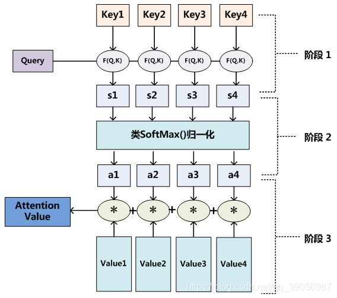
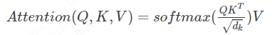
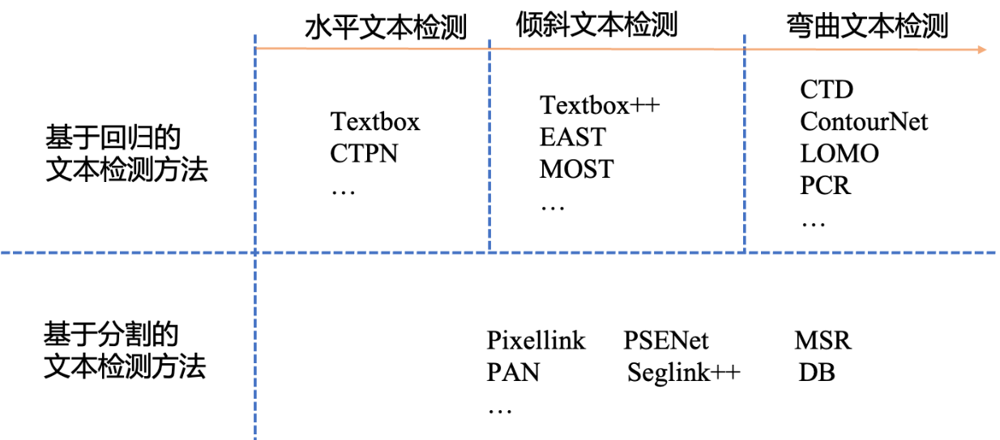

# 目录

- [1.简要介绍下OCR文字识别的一般流程？](#1.简要介绍下OCR文字识别的一般流程？)
- [2.请介绍下CRNN算法原理？](#2.请介绍下CRNN算法原理？)
- [3.请概括介绍下CRNN的网络结构？](#3.请概括介绍下CRNN的网络结构？)
- [4.端到端OCR识别中主要难点是什么？](#4.端到端OCR识别中主要难点是什么？)
- [5.CTC主要解决的问题是什么？](#5.CTC主要解决的问题是什么？)
- [6.端到端OCR识别主流的技术路径有哪些，有什么区别？](#6.端到端OCR识别主流的技术路径有哪些，有什么区别？)
- [7.介绍一下Attention机制的原理?](#7.介绍一下Attention机制的原理?)
- [8.对于中文行文本识别，CTC和Attention哪种更优？](#8.对于中文行文本识别，CTC和Attention哪种更优？)
- [9.文本检测算法一般包括哪些方法？](#9.文本检测算法一般包括哪些方法？)
- [10.对于图片中的密集文字，有什么好的处理办法吗？](#10.对于图片中的密集文字，有什么好的处理办法吗？)
- [11.有哪些文本行纠正方案？](#11.有哪些文本行纠正方案？)
- [12.弯曲形变的文字识别时需要怎么处理？](#12.弯曲形变的文字识别时需要怎么处理？)
- [13.介绍一下TPS和它的应用场景](#13.介绍一下TPS和它的应用场景)
- [14.OCR领域常用的评估指标是什么？](#14.OCR领域常用的评估指标是什么？)
- [15.单张图上多语种并存识别（如单张图印刷和手写文字并存），应该如何处理？](#15.单张图上多语种并存识别（如单张图印刷和手写文字并存），应该如何处理？)

<h2 id="1.简要介绍下OCR文字识别的一般流程？">1.简要介绍下OCR文字识别的一般流程？</h2>

OCR（Optical Character Recognition），即光学字符识别，是一种利用计算机自动识别和解析图像中的文字信息的技术。
它能够将纸质文档、图片、照片等载体上的文字信息转化为计算机可编辑和处理的文本数据。

文字识别过程一般由图像输入、预处理、文本检测、文本识别、结果输出等环节组成。其中文本检测、文本识别是最核心的环节。

<h2 id="2.请介绍下CRNN算法原理？">2.请介绍下CRNN算法原理？</h2>

CRNN模型，即将CNN与RNN网络结合，共同训练。主要用于在一定程度上实现端到端（end-to-end）地对不定长的文本序列进行识别，不用先对单个文字进行切割，
而是将文本识别转化为时序依赖的序列学习问题，就是基于图像的序列识别。

<h2 id="3.请概括介绍下CRNN的网络结构？">3.请概括介绍下CRNN的网络结构？</h2>

整个CRNN网络结构包含三部分，从下到上依次为：
- CNN（卷积层）：使用深度 CNN，对输入图像提取特征，得到特征图；
- RNN（循环层）：使用 双向RNN（BLSTM）对特征序列进行预测，对序列中的每个特征向量进行学习，并输出预测标签（真实值）分布；
- CTC loss（转录层）：使用CTC损失，把从循环层获取的一系列标签分布转换成最终的标签序列。

<h2 id="4.端到端OCR识别中主要难点是什么？">4.端到端OCR识别中主要难点是什么？</h2>

端到端OCR识别的难点在于怎么处理不定长序列对齐的问题。OCR可建模为时序依赖的文本图像问题，
然后使用 CTC（Connectionist Temporal Classification, CTC）的损失函数来对CNN和RNN进行端到端的联合训练。

CTC是一种损失函数，它允许模型在训练期间不需要显式地对齐输入和输出序列，从而优化序列对齐问题。
这意味着模型可以自动学习如何将输入序列（如图像中的像素）与输出序列（如识别出的文本）对应起来。

<h2 id="5.CTC主要解决的问题是什么？">5.CTC主要解决的问题是什么？</h2>

CTC主要解决的是**输出序列和标签对应不上的问题**，RNN进行时序分类时，不可避免地会出现很多冗余信息，比如一个字母被连续识别两次，这时候就需要一个去冗余机制。
举个例子，当一个标签为ab的图像输入到CRNN中，经过RNN后得到了长度为5的序列向量， 前面三个序列向量都映射为“a”，后面两个映射为“b”，即得到输出为aaabb，
如果直接将重复的字符合并去除的话得到的结果就为ab，但是当如果标签之间也存在连续字符时，例如aab，将连续a去除后就得到了ab，这显然是不对的，
所以**CTC引入了blank机制**，以“-”符号代表blank，若标签为aaaaaabb，则结果为ab，若标签为aaa-aaaabb，则结果为aab。

<h2 id="6.端到端OCR识别主流的技术路径有哪些，有什么区别？">6.端到端OCR识别主流的技术路径有哪些，有什么区别？</h2>

基于深度学习的端到端OCR技术有两大主流技术：**CRNN OCR和attention OCR**。其实这两大方法主要区别**在于最后的输出层（翻译层）**，
即怎么将网络学习到的序列特征信息转化为最终的识别结果。这两大主流技术在其特征学习阶段都采用了CNN+RNN的网络结构，**CRNN OCR在对齐时采取的方式是CTC算法**，
而**attention OCR采取的方式则是attention机制**。

<h2 id="7.介绍一下Attention机制的原理?">7.介绍一下Attention机制的原理?</h2>

Attention机制本质是从人类视觉注意力机制获得的灵感，简单来说就是从大量信息中快速筛选出高价值的东西。
总的来说Attention机制就是一系列注意力分配系数，也就是一系列的权重参数，注意力模型就是要从序列中学习到每一个元素的重要程度， 然后按重要程度将元素合并。

Attention里有三个重要的参数，**Q（查询向量）、K（键向量）、V（值向量）**，计算主要分为三步：

1. 将Q和每个K进行相似度计算得到权重，常用的相似度函数有点积、拼接、感知机等；
2. 使用一个softmax函数对这些权重进行归一化；
3. 用归一化的权值与V加权求和，最后得出的结果就是注意力值。

对于query Q 、key K 、value V，可以用一个公式来总结：

<h2 id="8.对于中文行文本识别，CTC和Attention哪种更优？">8.对于中文行文本识别，CTC和Attention哪种更优？</h2>

首先，从效果上来看，通用OCR场景CTC的识别效果优于Attention，因为带识别的字典中的字符比较多，常用中文汉字三千字以上，如果训练样本不足的情况下，
对于这些字符的序列关系挖掘比较困难。中文场景下Attention模型的优势无法体现。而且Attention适合短语句识别，对长句子识别比较差。

其次，从训练和预测速度上，Attention的串行解码结构限制了预测速度，而CTC网络结构更高效，预测速度上更有优势。

<h2 id="9.文本检测算法一般包括哪些方法？">9.文本检测算法一般包括哪些方法？</h2>

文本检测算法‌是指通过图像处理技术识别和定位图像中的文字区域。这些算法广泛应用于OCR（Optical Character Recognition，光学字符识别）系统中，
帮助从图像中提取文字信息。文本检测算法可以分为基于回归和基于分割的两大类。

**基于回归的文本检测方法：**
基于回归的文本检测方法类似于目标检测算法，将图像中的文本视为待检测的目标，其余部分视为背景。这类方法包括：

- EAST‌：EAST（Efficient and Accurate Scene Text Detector）提出了一种端到端的文本检测方法，通过直接回归文本框的位置来实现文本检测‌。
- MOST‌：MOST（Multi-Oriented Scene Text Detection）通过TFAM模块和PA-NMS等技术，提高了对极端长宽比和不同尺度文本的检测效果‌。

**基于分割的文本检测方法：**
基于分割的文本检测方法将图像分割成多个区域，然后识别这些区域中包含文字的部分。这类方法包括：

- PSENet‌：PSENet（Progressive Scale Expansion Network）通过逐步扩展的方式，逐步确定文本区域的范围‌。
- PANNet‌：PANNet（Point Anchored Network）利用点锚定机制，通过预测文本点的位置来检测文本区域‌。
- DBNet‌：DBNet（Deep Band Network）通过深度学习模型，直接预测文本区域的边界框‌。

<h2 id="10.对于图片中的密集文字，有什么好的处理办法吗？">10.对于图片中的密集文字，有什么好的处理办法吗？</h2>

可以先试用预训练模型测试一下，例如DB+CRNN，判断下密集文字图片中是检测还是识别的问题，然后针对性的改善。还有一种是如果图象中密集文字较小，
可以尝试增大图像分辨率，对图像进行一定范围内的拉伸，将文字稀疏化，提高识别效果。

<h2 id="11.有哪些文本行纠正方案？">11.有哪些文本行纠正方案？</h2>

- 基于霍夫变换检测直线角度后进行纠正；
- 在检测文本的同时检测四个顶点，例如车牌等，然后根据四个顶点做仿射变换;
- 如果是一些多边形的检测背景，可以使用关键点回归检测出背景的多个顶点，然后在进行透视变换后再进行文本检测；

<h2 id="12.弯曲形变的文字识别时需要怎么处理？">12.弯曲形变的文字识别时需要怎么处理？</h2>

在通常情况下，如果是场景弯曲形变不是太严重，可以检测四个点，然后直接经过**仿射变换、透视变换纠正识别**即可；

如果弯曲形变得比较厉害，可以尝试使用**TPS，即薄板样条插值**。

还可以结合场景进行分析，例如如果是检测公章文字，可以先将公章用特定算法拉平后在进行检测识别也是可以的。

<h2 id="13.介绍一下TPS和它的应用场景">13.介绍一下TPS和它的应用场景</h2>

TPS（Thin PlateSpline），薄板样条插值，是一种插值算法，经常用于图像变形等，通过少量的控制点就可以驱动图像进行变化。一般用于有弯曲的形变文本识别中，
当检测到不规则的文本区域，往往先使用TPS算法对文本区域纠正成矩形再进行识别，如STAR-Net、RARE等识别算法中皆引入了TPS模块。

<h2 id="14.OCR领域常用的评估指标是什么？">14.OCR领域常用的评估指标是什么？</h2>

OCR任务通常分为两个阶段，检测和识别：

- 检测阶段：先按照检测框和标注框的IOU评估，IOU大于某个阈值判断为检测准确。这里检测框和标注框不同于一般的通用目标检测框，是采用多边形进行表示。
检测准确率：正确的检测框个数在全部检测框的占比，主要是判断检测指标。检测召回率：正确的检测框个数在全部标注框的占比，主要是判断漏检的指标。
- 识别阶段： 字符识别准确率，即正确识别的文本行占标注的文本行数量的比例，只有整行文本识别对才算正确识别。

<h2 id="15.单张图上多语种并存识别（如单张图印刷和手写文字并存），应该如何处理？">15.单张图上多语种并存识别（如单张图印刷和手写文字并存），应该如何处理？</h2>

单张图像中存在多种类型文本的情况很常见，典型的以学生的试卷为代表，一张图像同时存在手写体和印刷体两种文本，这类情况下，
可以尝试”1个检测模型+1个N分类模型+N个识别模型”的解决方案。
