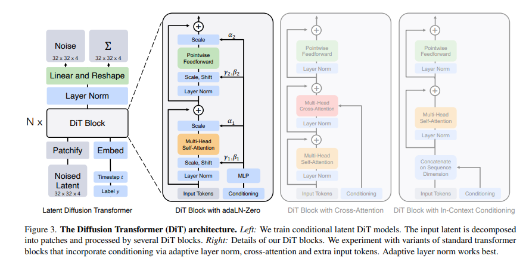

# 目录

- [1.什么是图像分类？](#user-content-1.什么是图像分类？)
- [2.常用的图像分类模型有哪些？](#user-content-2.常用的图像分类模型有哪些？)
- [3.CNN如何进行图像分类？](#user-content-3.CNN如何进行图像分类？)
- [4.介绍一下图像分类的挑战和未来发展方向？](#user-content-4.介绍一下图像分类的挑战和未来发展方向？)
- [5.图像分类任务中类别不平衡怎么解决？](#user-content-5.图像分类任务中类别不平衡怎么解决？)
- [6.介绍一下分类任务中的标签噪声？](#user-content-6.介绍一下分类任务中的标签噪声？)
- [7.ResNet模型的特点以及解决的问题？](#user-content-7.resnet模型的特点以及解决的问题？)
- [8.ResNeXt模型的结构和特点？](#user-content-8.resnext模型的结构和特点？)
- [9.MobileNet系列模型的结构和特点？](#user-content-9.mobilenet系列模型的结构和特点？)
- [10.MobileNet系列模型的结构和特点？（二）](#user-content-10.mobilenet系列模型的结构和特点？（二）)
- [11.ViT（Vision Transformer）模型的结构和特点？](#user-content-11.vit（vision-transformer）模型的结构和特点？)
- [12.EfficientNet系列模型的结构和特点？](#user-content-12.efficientnet系列模型的结构和特点？)
- [13.面试常问的经典模型？](#user-content-13.面试常问的经典模型？)
- [14.RepVGG模型的结构和特点？](#user-content-14.repvgg模型的结构和特点？)
- [15.DiT模型](#15.DiT模型)

<h1 id='1.什么是图像分类？'>1.什么是图像分类？</h1>

图像分类是一种计算机视觉技术，它指的是使用算法对图像中的内容进行识别和分类，将图像分配到预定义的类别中。简而言之，图像分类的任务是给定一个图像，判断这个图像属于哪一个类别。
以下是图像分类的几个关键点：
1. **输入**：图像分类算法的输入通常是一个或多个图像，这些图像以数字格式表示，如RGB（红绿蓝）颜色通道。
2. **输出**：算法的输出是图像所属类别的标签或概率分布。例如，如果有一个动物分类的任务，输出可能是“猫”、“狗”、“鸟”等类别中的一个。
3. **训练过程**：图像分类模型通常需要通过监督学习的方式进行训练。这意味着需要有一个包含成千上万甚至更多带有标签的图像的训练集。模型通过学习这些图像的特征与其标签之间的关系来提高分类的准确性。
4. **特征提取**：在训练过程中，模型会学习如何从图像中提取有助于分类的特征。在深度学习出现之前，这些特征通常需要手动设计。而现代的深度学习模型，尤其是卷积神经网络（CNNs），能够自动学习图像的层次化特征。
5. **应用领域**：图像分类技术在许多领域都有应用，包括但不限于医疗影像分析、交通监控、内容审核、卫星图像解析、农业监测和日常生活中的智能手机应用。
6. **挑战**：图像分类面临的挑战包括但不限于光照变化、图像的视角变化、类内差异（同一类别的不同外观）和类间差异（不同类别的相似外观）。
图像分类技术的发展极大地推动了机器视觉领域，使得计算机能够以接近甚至超过人类的表现来完成图像识别任务。随着深度学习技术的进步，图像分类的准确性和效率都得到了显著提升。

<h1 id='2.常用的图像分类模型有哪些？'>2.常用的图像分类模型有哪些？</h1>

图像分类是计算机视觉中的一个基本任务，旨在将图像分配到预定义的类别中。以下是一些常用的图像分类网络，它们在学术界和工业界都有广泛的应用：
1. **LeNet**：
   - 创始人：Yann LeCun
   - 特点：是较早的卷积神经网络之一，主要用于手写数字识别。
2. **AlexNet**：
   - 创始人：Alex Krizhevsky, Ilya Sutskever, Geoffrey Hinton
   - 特点：2012年ImageNet竞赛的获胜者，引入了ReLU激活函数和Dropout防止过拟合。
3. **VGGNet**：
   - 创始人：Karen Simonyan 和 Andrew Zisserman
   - 特点：使用了一系列重复的卷积层，证明了通过增加网络深度可以提升性能。
4. **GoogLeNet/Inception**：
   - 创始人：Google Research
   - 特点：引入了Inception模块，通过不同尺寸的卷积和池化层并行捕获信息。
5. **ResNet**（残差网络）：
   - 创始人：Kaiming He, Xiangyu Zhang, Shaoqing Ren, Jian Sun
   - 特点：引入了残差学习，允许网络学习恒等映射，可以训练非常深的网络（超过100层）。
6. **DenseNet**：
   - 创始人：Gao Huang, Zhang Liu, Laurens van der Maaten, Kilian Q. Weinberger
   - 特点：每个层都与前面所有层连接，实现了特征复用，减少了参数数量。
7. **MobileNets**：
   - 创始人：Google Research
   - 特点：专为移动和边缘设备设计，使用深度可分离卷积来减少计算量和模型大小。
8. **EfficientNet**：
   - 创始人：Mingxing Tan 和 Quoc V. Le
   - 特点：通过复合缩放方法（同时调整网络的宽度、深度和分辨率）来优化效率和准确性。
9. **RegNet**：
   - 创始人：Facebook AI Research
   - 特点：提出了一种网络设计搜索方法，旨在找到在计算资源限制下最优化的网络架构。
10. **Vision Transformer (ViT)**：
    - 创始人：Google Research
    - 特点：将Transformer架构应用于图像分类任务，不需要卷积层，使用自注意力机制处理图像块。
这些网络代表了从传统的卷积神经网络到最近的基于Transformer的架构的演变。每个网络都有其独特的优势，适应不同的应用场景和计算资源限制。随着研究的进展，还有更多的网络被提出来，旨在提高分类性能、减少参数数量、加快推理速度或适应特定的任务需求。

<h1 id='3.CNN如何进行图像分类？'>3.CNN如何进行图像分类？</h1>

卷积神经网络（CNN）是进行图像分类任务的一种非常有效的深度学习模型。以下是CNN进行图像分类的基本步骤：
### 1. 数据预处理
在将图像输入到CNN之前，通常需要进行以下预处理步骤：
- **归一化**：将图像像素值缩放到一个小的区间（如0到1）。
- **裁剪/缩放**：调整图像大小，使其符合网络输入层的尺寸要求。
- **数据增强**：通过旋转、翻转、缩放、裁剪等操作增加数据的多样性，提高模型的泛化能力。
### 2. 构建CNN模型
一个典型的CNN模型包含以下几种类型的层：
- **卷积层（Convolutional Layer）**：
  - 使用一组可学习的过滤器（或称为内核）来提取图像中的特征。
  - 每个过滤器都负责检测图像中的某种特定的特征，如边缘、角点或纹理。
- **激活函数**：
  - 常用的激活函数如ReLU（Rectified Linear Unit），用于引入非线性因素，使得网络能够学习和模拟更复杂的函数。
- **池化层（Pooling Layer）**：
  - 通常在卷积层之后，用于降低特征的空间维度，同时保留重要信息。
  - 最常用的是最大池化（Max Pooling），它选择每个局部区域内的最大值作为该区域的代表。
- **全连接层（Fully Connected Layer）**：
  - 在网络的最后几层，将前一层的所有激活值连接到每一个神经元。
  - 这些层负责基于卷积层和池化层提取的特征进行分类。
- **归一化层和Dropout层**：
  - 归一化层有助于加速训练过程。
  - Dropout层用于减少过拟合，通过在训练过程中随机“丢弃”一部分神经元的输出来实现。
### 3. 训练过程
- **前向传播**：输入图像通过网络，各层计算并传递激活值。
- **损失函数**：计算网络输出与真实标签之间的差异，常用的损失函数有交叉熵损失。
- **反向传播**：根据损失函数的梯度，更新网络的权重。
- **优化算法**：如SGD（随机梯度下降）、Adam等，用于在网络训练过程中调整权重。
### 4. 评估和优化
- **评估**：使用验证集评估模型的性能。
- **超参数调优**：调整学习率、批次大小、层数、过滤器数量等，以优化模型性能。
- **防止过拟合**：使用正则化技术、数据增强或提前停止训练等方法。
### 5. 预测
- 使用训练好的模型对新的图像进行分类。
- 对于一张新图像，通过前向传播得到输出层的结果，这个结果通常是一个概率分布，表示图像属于每个类别的概率。
- 根据概率分布选择最可能的类别作为预测结果。
通过上述步骤，CNN能够有效地从图像中提取特征并进行分类。随着深度学习框架的发展，如TensorFlow和PyTorch，构建和训练CNN变得更加容易和高效。

<h1 id='4.介绍一下图像分类的挑战和未来发展方向？'>4.介绍一下图像分类的挑战和未来发展方向？</h1>

图像分类是计算机视觉领域的一个基本任务，尽管已经取得了显著的进展，但仍然面临多种挑战，并且有着广阔的未来发展方向。以下是一些主要的挑战和潜在的发展方向：
### 挑战：
1. **数据集偏差**：
   - 现实世界的数据集可能包含各种偏差，如类不平衡、样本偏差等，这会影响模型的泛化能力。
2. **标注问题**：
   - 大规模准确标注的数据集获取成本高昂，且标注质量难以保证。
3. **多标签和多任务学习**：
   - 图像可能包含多个标签或需要同时解决多个任务，这对模型的设计和训练提出了更高的要求。
4. **小样本学习**：
   - 在某些领域，获取大量标注样本是不现实的，因此如何从少量样本中学习是一个挑战。
5. **开放集分类**：
   - 在开放集分类中，模型需要识别出未见过的类别，这是一个极具挑战性的任务。
6. **域自适应**：
   - 模型需要在源域训练后，直接在具有不同分布的目标域上表现良好。
7. **对抗性攻击**：
   - 对抗性样本可以轻易地欺骗图像分类模型，这要求模型具有更强的鲁棒性。
8. **可解释性和透明度**：
   - 模型的决策过程往往缺乏透明度，这对于需要解释性的应用来说是一个问题。
### 未来发展方向：
1. **无监督和自监督学习**：
   - 开发无需标注数据的训练方法，利用未标注数据或伪标签进行学习。
2. **元学习和迁移学习**：
   - 通过元学习快速适应新任务，以及通过迁移学习将知识从源域转移到目标域。
3. **增强现实和小样本学习**：
   - 结合增强现实技术，开发能够从少量样本中快速学习的算法。
4. **对抗性鲁棒性**：
   - 设计能够抵抗对抗性攻击的模型和训练策略。
5. **可解释性AI**：
   - 提高模型的解释能力，使其决策过程更加透明和可理解。
6. **多模态学习**：
   - 结合图像与其他模态（如文本、音频）的数据，进行更丰富的信息融合。
7. **持续学习和终身学习**：
   - 模型能够持续学习新知识，而不会忘记之前学到的信息。
8. **数据隐私和安全性**：
   - 在保护用户隐私的同时进行图像分类，例如通过联邦学习或差分隐私技术。
9. **自动化机器学习（AutoML）**：
   - 自动化模型设计、超参数优化和数据处理流程，减少人工干预。
10. **跨域和多任务学习**：
    - 同时在多个域或任务上进行学习，提高模型的泛化和适应性。
随着技术的进步和研究的深入，图像分类领域有望克服这些挑战，并朝着更加高效、鲁棒和可解释的方向发展。

<h1 id='5.图像分类任务中类别不平衡怎么解决？'>5.图像分类任务中类别不平衡怎么解决？</h1>

类别不平衡是指分类任务中不同类别的训练样本数目相差较大的情况，通常是由于样本较难采集或样本示例较少而引起的，经常出现在疾病类别诊断、欺诈类型判别等任务中。
类别不平衡的问题可以从数据层面、算法层面、数据和算法混合层面三个方面进行解决。

1、基于数据层面的方法
基于数据层面的方法主要对参与训练的数据集进行相应的处理，以减少类别不平衡带来的影响。

Hensman等[2]提出了提升样本（over sampling）的方法，即对于类别数目较少的类别，从中随机选择一些图片进行复制并添加至该类别包含的图像内，直到这个类别的图片数目和最大数目类的个数相等为止。通过实验发现，这一方法对最终的分类结果有了非常大的提升。

Lee等[3]提出了一种两阶段（two-phase）训练法。首先根据数据集分布情况设置一个阈值N，通常为最少类别所包含样例个数。随后对样例个数大于阈值的类别进行随机抽取，直到达到阈值。此时根据阈值抽取的数据集作为第一阶段的训练样本进行训练，并保存模型参数。最后采用第一阶段的模型作为预训练数据，再在整个数据集上进行训练，对最终的分类结果有了一定的提升.

Pouyanfar等[4]则提出了一种动态采样（dynamic sampling）的方法。该方法借鉴了提升样本的思想，将根据训练结果对数据集进行动态调整，对结果较好的类别进行随机删除样本操作，对结果较差的类别进行随机复制操作，以保证分类模型每次学习都能学到相关的信息。

论文名称：
[2] Hensman P, Masko D. The impact of imbalanced training data for convolutional neural networks. 2015.
[3] Lee H, Park M, Kim J. Plankton classification on imbalanced large scale database via convolutional neural networks with transfer learning. In: 2016 IEEE international conference on image processing (ICIP). 2016. p. 3713–7.
[4] Pouyanfar S, Tao Y, Mohan A, Tian H, Kaseb AS, Gauen K, Dailey R, Aghajanzadeh S, Lu Y, Chen S, Shyu M. Dynamic sampling in convolutional neural networks for imbalanced data classification. In: 2018 IEEE conference on multimedia information processing and retrieval (MIPR). 2018. p. 112–7.

2、基于算法层面的方法

基于算法层面的方法主要对现有的深度学习算法进行改进，通过修改损失函数或学习方式的方法来消除类别不平衡带来的影响。
Wang等[5]提出mean squared false error (MSFE) loss。这一新的损失函数是在mean false error (MFE) loss的基础上进行改进，具体公式如下图所示：

MSFE loss能够很好地平衡正反例之间的关系，从而实现更好的优化结果。
Buda等[6]提出输出阈值（output thresholding）的方法，通过调整网络结果的输出阈值来改善类别不平衡的问题。模型设计者根据数据集的构成和输出的概率值，人工设计一个合理的阈值，以降低样本数目较少的类别的输出要求，使得其预测结果更加合理。

论文名称：
[6] Buda M, Maki A, Mazurowski MA. A systematic study of the class imbalance problem in convolutional neural
networks. Neural Netw. 2018;106:249–59.

3、基于数据和算法的混合方法

Huang等[7]提出Large Margin Local Embedding (LMLE)的方法，采用五倍抽样法（quintuplet sampling ）和tripleheader hinge loss函数，可以更好地提取样本特征，随后将特征送入改进的K-NN分类模型，能够实现更好的聚类效果。除此之外，Dong等[8]则融合了难例挖掘和类别修正损失函数的思想，同样是在数据和损失函数进行改进。

论文名称：
[7] Huang C, Li Y, Loy CC, Tang X. Learning deep representation for imbalanced classification. In: 2016 IEEE conference on computer vision and pattern recognition (CVPR). 2016. p. 5375–84.
[8] Dong Q, Gong S, Zhu X. Imbalanced deep learning by minority class incremental rectification. In: IEEE transactions on pattern analysis and machine intelligence. 2018. p. 1–1

<h1 id='6.介绍一下分类任务中的标签噪声？'>6.介绍一下分类任务中的标签噪声？</h1>

在构建数据集时，主客观因素可能导致标签错误，这些错误会影响模型的性能。因此，对数据集进行净化，以减轻标签错误的影响，是必要的步骤。
标签错误通常分为两类：跨类别错误和随机错误。跨类别错误指的是图像被错误地归类到数据集中的另一个类别。而随机错误则是指一些图像虽然被标记为某一类别，但实际上与该类别不相关，且不属于任何已知类别。

<h2 id="7.resnet模型的特点以及解决的问题？">7.ResNet模型的特点以及解决的问题？</h2>

每次回答这个问题的时候，都会包含我的私心，我喜欢从电气自动化的角度去阐述，而非计算机角度，因为这会让我想起大学时代的青葱岁月。

ResNet就是一个差分放大器。ResNet的结构设计，思想逻辑，就是在机器学习中抽象出了一个差分放大器，其能让深层网络的梯度的相关性增强，在进行梯度反传时突出微小的变化。

模型的特点则是设计了残差结构，其对模型输出的微小变化非常敏感。

为什么加入残差模块会有效果呢？

假设：如果不使用残差模块，输出为$F_{1} (x)= 5.1$，期望输出为$H_{1} (x)= 5$，如果想要学习H函数，使得$F_{1} (x) = H_{1} (x) = 5$，这个变化率比较低，学习起来是比较困难的。

但是如果设计为 $H_{1} (x) = F_{1} (x) + 5 = 5.1$，进行一种拆分，使得$F_{1} (x)= 0.1$，那么学习目标就变为让$F_{1} (x)= 0$，一个映射函数学习使得它输出由0.1变为0，这个是比较简单的。也就是说引入残差模块后的映射对输出变化更加敏感了。

进一步理解：如果$F_{1} (x)= 5.1$，现在继续训练模型，使得映射函数$F_{1} (x)= 5$。变化率为：$(5.1 - 5) / 5.1 = 0.02$，如果不用残差模块的话可能要把学习率从0.01设置为0.0000001。层数少还能对付，一旦层数加深的话可能就不太好使了。

这时如果使用残差模块，也就是$F_{1} (x)= 0.1$变化为$F_{1} (x)= 0$。这个变化率增加了100%。明显这样的话对参数权重的调整作用更大。

<h2 id="8.resnext模型的结构和特点？">8.ResNeXt模型的结构和特点？</h2>

ResNeXt模型是在ResNet模型的基础上进行优化。其主要是在ResNeXt中引入Inception思想。如下图所示，左侧是ResNet经典结构，右侧是ResNeXt结构，其将单路卷积转化成多支路的多路卷积，进行分组卷积。

作者进一步提出了ResNeXt的三种等价结构，其中c结构中的分组卷积思想就跃然纸上了。

最后我们看一下ResNeXt50和ResNet50结构上差异的对比图：

ResNeXt论文：《Aggregated Residual Transformations for Deep Neural Networks》

<h2 id="9.mobilenet系列模型的结构和特点？">9.MobileNet系列模型的结构和特点？</h2>

MobileNet是一种轻量级的网络结构，主要针对手机等嵌入式设备而设计。MobileNetv1网络结构在VGG的基础上使用depthwise Separable卷积，在保证不损失太大精度的同时，大幅降低模型参数量。

Depthwise separable卷积是由Depthwise卷积和Pointwise卷积构成。
Depthwise卷积(DW)能有效减少参数数量并提升运算速度。但是由于每个特征图只被一个卷积核卷积，因此经过DW输出的特征图只包含输入特征图的全部信息，而且特征之间的信息不能进行交流，导致“信息流通不畅”。Pointwise卷积(PW)实现通道特征信息交流，解决DW卷积导致“信息流通不畅”的问题。

Depthwise Separable卷积和标准卷积的计算量对比：

相比标准卷积，Depthwise Separable卷积可以大幅减小计算量。并且随着卷积通道数的增加，效果更加明显。

并且Mobilenetv1使用stride=2的卷积替换池化操作，直接在卷积时利用stride=2完成了下采样，从而节省了卷积后再去用池化操作去进行一次下采样的时间，可以提升运算速度。

MobileNetv1论文:《MobileNets: Efficient Convolutional Neural Networks for Mobile Vision Applications》

<h2 id="10.mobilenet系列模型的结构和特点？（二）">10.MobileNet系列模型的结构和特点？（二）</h2>

MobileNetV2在MobileNetV1的基础上引入了Linear Bottleneck 和 Inverted Residuals。

MobileNetV2使用Linear Bottleneck(线性变换)来代替原本的非线性激活函数，来捕获感兴趣的流形。实验证明，使用Linear Bottleneck可以在小网络中较好地保留有用特征信息。

Inverted Residuals与经典ResNet残差模块的通道间操作正好相反。由于MobileNetV2使用了Linear Bottleneck结构，使其提取的特征维度整体偏低，如果只是使用低维的feature map效果并不会好。如果卷积层都是使用低维的feature map来提取特征的话，那么就没有办法提取到整体的足够多的信息。如果想要提取全面的特征信息的话，我们就需要有高维的feature map来进行补充，从而达到平衡。

MobileNetV2的论文：《MobileNetV2: Inverted Residuals and Linear Bottlenecks》

MobileNetV3在整体上有两大创新：

1.互补搜索技术组合：由资源受限的NAS执行模块级搜索；由NetAdapt执行局部搜索，对各个模块确定之后网络层的微调。

2.网络结构改进：进一步减少网络层数，并引入h-swish激活函数。

作者发现swish激活函数能够有效提高网络的精度。然而，swish的计算量太大了。作者提出**h-swish**（hard version of swish）如下所示：

这种非线性在保持精度的情况下带了了很多优势，首先ReLU6在众多软硬件框架中都可以实现，其次量化时避免了数值精度的损失，运行快。

MobileNetV3模型结构的优化：

MobileNetV3的论文：《Searching for MobileNetV3》

<h2 id="11.vit（vision-transformer）模型的结构和特点？">11.ViT（Vision Transformer）模型的结构和特点？</h2>

ViT模型特点：
1.ViT直接将标准的Transformer结构直接用于图像分类，其模型结构中不含CNN。
2.为了满足Transformer输入结构要求，输入端将整个图像拆分成小图像块，然后将这些小图像块的线性嵌入序列输入网络中。在最后的输出端，使用了Class Token形式进行分类预测。
3.Transformer比CNN结构少了一定的平移不变性和局部感知性，在数据量较少的情况下，效果可能不如CNN模型，但是在大规模数据集上预训练过后，再进行迁移学习，可以在特定任务上达到SOTA性能。

ViT的整体模型结构：

其可以具体分成如下几个部分：
1. 图像分块嵌入
  
2. 多头注意力结构
  
3. 多层感知机结构（MLP）
  
4. 使用DropPath，Class Token，Positional Encoding等操作。

<h2 id="12.efficientnet系列模型的结构和特点？">12.EfficientNet系列模型的结构和特点？</h2>

Efficientnet系列模型是通过grid search从深度（depth）、宽度（width）、输入图片分辨率（resolution）三个角度共同调节搜索得来的模型。其从EfficientNet-B0到EfficientNet-L2版本，模型的精度越来越高，同样，参数量和对内存的需求也会随之变大。

深度模型的规模主要是由宽度、深度、分辨率这三个维度的缩放参数决定的。这三个维度并不是相互独立的，对于输入的图片分辨率更高的情况，需要有更深的网络来获得更大的感受视野。同样的，对于更高分辨率的图片，需要有更多的通道来获取更精确的特征。

EfficientNet模型的内部是通过多个MBConv卷积模块实现的，每个MBConv卷积模块的具体结构如下图所示。其用实验证明Depthwise Separable卷积在大模型中依旧非常有效；Depthwise Separable卷积较于标准卷积有更好的特征提取表达能力。

另外论文中使用了Drop_Connect方法来代替传统的Dropout方法来防止模型过拟合。DropConnect与Dropout不同的地方是在训练神经网络模型过程中，它不是对隐层节点的输出进行随机的丢弃，而是对隐层节点的输入进行随机的丢弃。

EfficientNet论文：《EfficientNet: Rethinking Model Scaling for Convolutional Neural Networks》

说点题外话，隔着paper都能看到作者那窒息的调参过程。。。

<h2 id="13.面试常问的经典模型？">13.面试常问的经典模型？</h2>

面试中经常会问一些关于模型方面的问题，这也是不太好量化定位的问题，因为模型繁杂多样，面试官问哪个都有可能，下面的逻辑图里我抛砖引玉列出了一些不管是在学术界还是工业界都是高价值的模型，供大家参考。

最好还是多用项目，竞赛，科研等工作润色简历，并在面试过程中将模型方面的问题引向这些工作中用到的熟悉模型里。

<h2 id="14.repvgg模型的结构和特点？">14.RepVGG模型的结构和特点？</h2>

RepVGG模型的基本架构由20多层$3\times3$卷积组成，分成5个stage，每个stage的第一层是stride=2的降采样，每个卷积层用ReLU作为激活函数。

RepVGG的主要特点：

1. $3\times3$卷积在GPU上的计算密度（理论运算量除以所用时间）可达1x1和5x5卷积的四倍.
2. 直筒型单路结构的计算效率比多路结构高。
3. 直筒型单路结构比起多路结构内存占用少。
4. 单路架构灵活性更好，容易进一步进行模型压缩等操作。
5. RepVGG中只含有一种算子，方便芯片厂商设计专用芯片来提高端侧AI效率。

那么是什么让RepVGG能在上述情形下达到SOTA效果呢？

答案就是结构重参数化（structural re-parameterization）。

在训练阶段，训练一个多分支模型，并将多分支模型等价转换为单路模型。在部署阶段，部署单路模型即可。这样就可以同时利用多分支模型训练时的优势（性能高）和单路模型推理时的好处（速度快、省内存）。

更多结构重参数化细节知识将在后续的篇章中展开介绍，大家尽情期待！

<h2 id="15.DiT模型">15.DiT模型 </h2>

论文链接：https://arxiv.org/pdf/2212.09748.pdf

DiT（Diffusion Transformers）是Meta提出的一种完全基于Transformer架构的扩散模型。传统的扩散模型多采用U-Net架构，因为U-Net能够自然地实现输入输出维度一致，并且混合了卷积模块和self-attention。然而，随着Vision Transformers（ViT）的发展，Transformer架构在图像任务中变得越来越普遍。DiT将这种架构成功应用于扩散模型中，并探索了其在扩散模型中的可扩展性。

在DiT模型中，图像首先被编码器转换为潜在表示（latent representation），然后这些潜在表示被分割成较小的补丁（patches），每个补丁被线性嵌入到一个固定维度的序列中。

#### DiT的核心结构

1. **Patch Embedding**：将输入图像分割成小块，并将每个小块线性嵌入到一个固定维度的序列中。这个过程生成了一系列嵌入标记（tokens），每个标记代表图像的一个补丁。

2. **Transformer Blocks**：这些嵌入标记通过多个Transformer块进行处理。每个Transformer块包含多头自注意力（Multi-Head Self-Attention）和前馈神经网络（Feedforward Neural Network），并且使用层归一化（Layer Norm）。

3. **条件嵌入**：在扩散模型中，需要嵌入额外的条件信息，如时间步（timesteps）和类别标签（class labels）。DiT设计了四种嵌入方案：

   - **In-context Conditioning**：将条件信息作为额外的标记加入输入序列。

   - **Cross-Attention Block**：在Transformer块中加入一个多头交叉注意力层，条件embeddings作为cross attention的key和value。

   - **Adaptive Layer Norm (adaLN) Block**：使用自适应层归一化，条件信息用于调整归一化参数。

   - **adaLN-Zero Block**：在adaLN的基础上，零初始化残差块，使其初始为恒等函数。

     最终发现采用**adaLN-Zero**效果是最好的。

4. **线性解码器**：在最后一个Transformer块之后，使用linear层将处理后的标记解码为原始图像的维度。这个过程生成的输出包括预测的噪音和方差。

