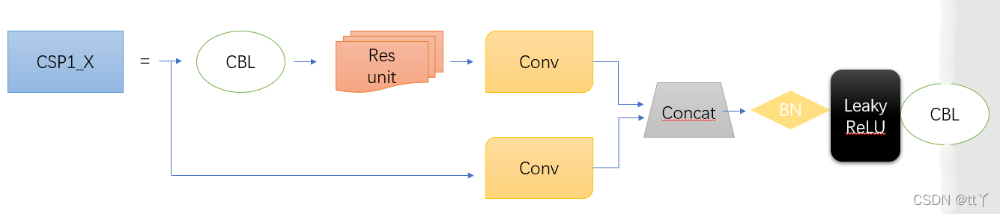
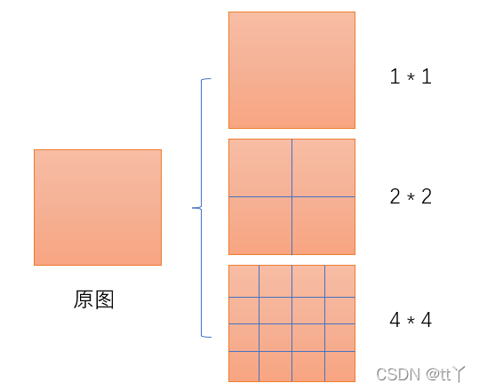
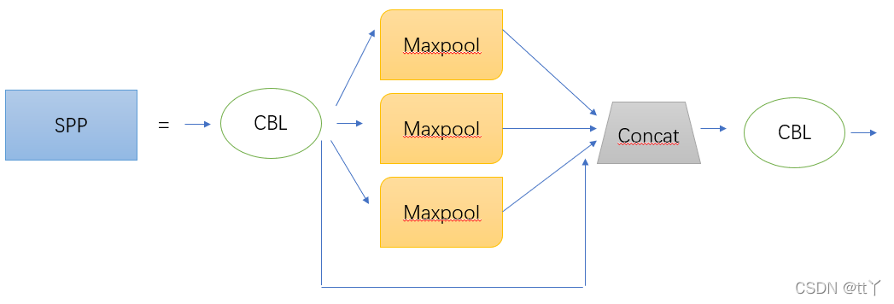

# 目录

- [1.目标检测中IOU的相关概念与计算](#user-content-1.目标检测中iou的相关概念与计算)
- [2.目标检测中NMS的相关概念与计算](#user-content-2.目标检测中nms的相关概念与计算)
- [3.One-stage目标检测与Two-stage目标检测的区别？](#user-content-3.one-stage目标检测与two-stage目标检测的区别？)
- [4.哪些方法可以提升小目标检测的效果？](#user-content-4.哪些方法可以提升小目标检测的效果？)
- [5.Focal Loss的作用？](#user-content-5.focal-loss的作用？)
- [6.YOLO系列的面试问题](#user-content-6.yolo系列的面试问题)
- [7.有哪些经典的轻量型人脸检测模型？](#user-content-7.有哪些经典的轻量型人脸检测模型？)
- [8.LFFD人脸检测模型的结构和特点？](#user-content-8.lffd人脸检测模型的结构和特点？)
- [9.目标检测中AP，AP50，AP75，mAP等指标的含义](#user-content-9.目标检测中ap，ap50，ap75，map等指标的含义)
- [10.YOLOv2中的anchor如何生成？](#user-content-10.yolov2中的anchor如何生成？)
- [11.介绍下YOLOv5中的CSP结构？](#11.介绍下YOLOv5中的CSP结构？)
- [12.介绍下YOLOv5中的SPP结构?](#12.介绍下YOLOv5中的SPP结构?)
- [13.FPN(Feature Pyramid Network)的相关知识](#user-content-13.fpnfeature-pyramid-network的相关知识)
- [14.SPP(Spatial Pyramid Pooling)的相关知识](#user-content-14.sppspatial-pyramid-pooling的相关知识)
- [15.FPN网络的主要作用是什么？](#1.FPN网络的主要作用是什么？)
- [16.请介绍下YOLOv5中的Focus操作？](#2.请介绍下YOLOv5中的Focus操作？)
- [17.请介绍下目标检测算法中基于Anchor based和Anchor free方法的区别？](#3.请介绍下目标检测算法中基于Anchor-based和Anchor-free方法的区别？)


<h2 id="1.目标检测中iou的相关概念与计算">1.目标检测中IOU的相关概念与计算</h2>

IoU（Intersection over Union）即交并比，是目标检测任务中一个重要的模块，其是<font color=DeepSkyBlue>GT bbox与pred bbox交集的面积 / 二者并集的面积</font>。


下面我们用坐标（top，left，bottom，right），即左上角坐标，右下角坐标。从而可以在给定的两个矩形中计算IOU值。

```
def compute_iou(rect1,rect2):
  # (y0,x0,y1,x1) = (top,left,bottom,right)
  S_rect1 = (rect1[2] - rect1[0]) * (rect1[3] - rect1[1])
  S_rect2 = (rect2[2] - rect2[0]) * (rect2[3] - rect1[1])

  sum_all = S_rect1 + S_rect2
  left_line = max(rect1[1],rect2[1])
  right_line = min(rect1[3],rect2[3])
  top_line = max(rect1[0],rect2[0])
  bottom_line = min(rect1[2],rect2[2])

  if left_line >= right_line or top_line >= bottom_line:
    return 0
  else:
    intersect = (right_line - left_line) * (bottom_line - top_line)
    return (intersect / (sum_area - intersect)) * 1.0
```


<h2 id="2.目标检测中nms的相关概念与计算">2.目标检测中NMS的相关概念与计算</h2>

在目标检测中，我们可以利用非极大值抑制（NMS）对生成的大量候选框进行后处理，去除冗余的候选框，得到最具代表性的结果，以加快目标检测的效率。

如下图所示，消除多余的候选框，找到最佳的bbox：


<font color=DeepSkyBlue>非极大值抑制（NMS）流程：</font>

1. 首先我们需要设置两个值：一个Score的阈值，一个IOU的阈值。

2. 对于每类对象，遍历该类的所有候选框，过滤掉Score值低于Score阈值的候选框，并根据候选框的类别分类概率进行排序：$A < B < C < D < E < F$。

3. 先标记最大概率矩形框F是我们要保留下来的候选框。

4. 从最大概率矩形框F开始，分别判断A～E与F的交并比（IOU）是否大于IOU的阈值，假设B、D与F的重叠度超过IOU阈值，那么就去除B、D。

5. 从剩下的矩形框A、C、E中，选择概率最大的E，标记为要保留下来的候选框，然后判断E与A、C的重叠度，去除重叠度超过设定阈值的矩形框。

6. 就这样重复下去，直到剩下的矩形框没有了，并标记所有要保留下来的矩形框。

7. 每一类处理完毕后，返回步骤二重新处理下一类对象。

```
import numpy as np

def py_cpu_nms(dets, thresh):
  #x1、y1（左下角坐标）、x2、y2（右上角坐标）以及score的值
  x1 = dets[:, 0]
  y1 = dets[:, 1]
  x2 = dets[:, 2]
  y2 = dets[:, 3]
  scores = dets[:, 4]

  #每一个候选框的面积
  areas = (x2 - x1 + 1) * (y2 - y1 + 1)
  #按照score降序排序（保存的是索引）
  order = scores.argsort()[::-1]

  keep = []
  while order.size > 0:
    i = order[0]
    keep.append(i)
    #计算当前概率最大矩形框与其他矩形框的相交框的坐标，会用到numpy的broadcast机制，得到向量
    xx1 = np.maximum(x1[i], x1[order[1:]])
    yy1 = np.maximum(y1[i], y1[order[1:]])
    xx2 = np.minimum(x2[i], x2[order[1:]])
    yy2 = np.minimum(y2[i], y2[order[1:]])

    #计算相交框的面积，注意矩形框不相交时w或h算出来会是负数，用0代替
    w = np.maximum(0.0, xx2 - xx1 + 1)
    h = np.maximum(0.0, yy2 - yy1 + 1)
    inter = w * h
    #计算重叠度IOU：重叠面积 / （面积1 + 面积2 - 重叠面积）
    ovr = inter / (areas[i] + areas[order[1:]] - inter)

    #找到重叠度不高于阈值的矩形框索引
    inds = np.where(ovr < thresh)[0]
    # 将order序列更新，由于前面得到的矩形框索引要比矩形框在原order序列中的索引小1，所以要加1操作
    order = order[inds + 1]

  return keep
```


<h2 id="3.one-stage目标检测与two-stage目标检测的区别？">3.One-stage目标检测与Two-stage目标检测的区别？</h2>

<font color=DeepSkyBlue>Two-stage目标检测算法</font>：先进行区域生成（region proposal，RP）（一个有可能包含待检物体的预选框），再通过卷积神经网络进行样本分类。其精度较高，速度较慢。

主要逻辑：特征提取—>生成RP—>分类/定位回归。

常见的Two-stage目标检测算法有：Faster R-CNN系列和R-FCN等。

<font color=DeepSkyBlue>One-stage目标检测算法</font>：不用RP，直接在网络中提取特征来预测物体分类和位置。其速度较快，精度比起Two-stage算法稍低。

主要逻辑：特征提取—>分类/定位回归。

常见的One-stage目标检测算法有：YOLO系列、SSD和RetinaNet等。


<h2 id="4.哪些方法可以提升小目标检测的效果？">4.哪些方法可以提升小目标检测的效果？</h2>

1. 提高图像分辨率。小目标在边界框中可能只包含几个像素，那么能通过提高图像的分辨率以增加小目标的特征的丰富度。
  
2. 提高模型的输入分辨率。这是一个效果较好的通用方法，但是会带来模型inference速度变慢的问题。
  
3. 平铺图像。


4. 数据增强。小目标检测增强包括随机裁剪、随机旋转和镶嵌增强等。
  
5. 自动学习anchor。
  
6. 类别优化。


<h2 id="5.focal-loss的作用？">5.Focal Loss的作用？</h2>

<font color=DeepSkyBlue>Focal Loss是解决了分类问题中类别不均衡、分类难度差异的一个损失函数，使得模型在训练过程中更加聚焦在困难样本上。</font>

Focal Loss是从二分类问题出发，同样的思想可以迁移到多分类问题上。

我们知道二分类问题的标准loss是**交叉熵**：


对于二分类问题我们也几乎适用sigmoid激活函数$\hat{y} = \sigma(x)$，所以上面的式子可以转化成：


这里有$1 - \sigma(x) = \sigma(-x)$。

Focal Loss论文中给出的式子如下：


其中$y\in \{ 1,-1\}$是真实标签，$p\in[0,1]$是预测概率。

我们再定义$p_{t}:$


那么，上面的交叉熵的式子可以转换成：


有了上面的铺垫，最初Focal Loss论文中接着引入了**均衡交叉熵函数**：


针对类别不均衡问题，在Loss里加入一个控制权重，对于属于少数类别的样本，增大$\alpha_{t}$即可。<font color=DeepSkyBlue>但这样有一个问题，它仅仅解决了正负样本之间的平衡问题，并没有区分易分/难分样本</font>。

**为什么上述公式只解决正负样本不均衡问题呢？**

因为增加了一个系数$\alpha_{t}$，跟$p_{t}$的定义类似，当$label=1$的时候$\alpha_{t}=\alpha$ ;当$label=-1$的时候，$\alpha_{t}= 1 - \alpha$，$\alpha$的范围也是$[0,1]$。因此可以通过设定$\alpha$的值（如果$1$这个类别的样本数比$-1$这个类别的样本数少很多，那么$\alpha$可以取$0.5$到$1$来增加$1$这个类的样本的权重）来控制正负样本对整体Loss的贡献。

<h3 id="focal-loss">Focal Loss</h3>

为了可以区分难/易样本，Focal Loss雏形就出现了：


$(1 - p_{t})^{\gamma}$用于平衡难易样本的比例不均，$\gamma >0$起到了对$(1 - p_{t})$的放大作用。$\gamma >0$减少易分样本的损失，使模型更关注于困难易错分的样本。例如当$\gamma =2$时，模型对于某正样本预测置信度$p_{t}$为$0.9$，这时$(1 - 0.9)^{\gamma} = 0.01$，也就是FL值变得很小；而当模型对于某正样本预测置信度$p_{t}$为0.3时，$(1 - 0.3)^{\gamma} = 0.49$，此时它对Loss的贡献就变大了。当$\gamma = 0$时变成交叉熵损失。

为了应对正负样本不均衡的问题，在上面的式子中再加入平衡交叉熵的$\alpha_{t}$因子，用来平衡正负样本的比例不均，最终得到Focal Loss：


Focal Loss论文中给出的实验最佳取值为$a_{t}= 0.25$，$\gamma = 2$。


<h2 id="6.yolo系列的面试问题">6.YOLO系列的面试问题</h2>

Rocky之前总结了YOLOv1-v7全系列的解析文章，帮助大家应对可能出现的与YOLO相关的面试问题，大家可按需取用：

[【Make YOLO Great Again】YOLOv1-v7全系列大解析（汇总篇）](https://mp.weixin.qq.com/s?__biz=Mzg4NDYwOTUwNA==&mid=2247486017&idx=1&sn=ff028fa235f384fe74576ef346849600&chksm=cfb4d2cef8c35bd8726cdd3bc9664f2bc5edd1eaf3876e6ff60e523277461b43a57389621bc8&token=1199271157&lang=zh_CN#rd)


<h2 id="7.有哪些经典的轻量型人脸检测模型？">7.有哪些经典的轻量型人脸检测模型？</h2>

人脸检测相对于通用目标检测来说，算是一个子任务。比起通用目标检测任务动辄检测1000个类别，人脸检测任务主要聚焦于人脸的单类目标检测，<font color=DeepSkyBlue>使用通用目标检测模型太过奢侈，有点“杀鸡用牛刀”的感觉，并且大量的参数冗余，会影响部署侧的实用性</font>，故针对人脸检测任务，学术界提出了很多轻量型的人脸检测模型，Rocky在这里给大家介绍一些比较有代表性的：

1. libfacedetection
2. Ultra-Light-Fast-Generic-Face-Detector-1MB
3. A-Light-and-Fast-Face-Detector-for-Edge-Devices
4. CenterFace
5. DBFace
6. RetinaFace
7. MTCNN


<h2 id="8.lffd人脸检测模型的结构和特点？">8.LFFD人脸检测模型的结构和特点？</h2>

<font color=DeepSkyBlue>Rocky在实习/校招面试中被多次问到LFFD模型以及面试官想套取LFFD相关算法方案的情况，说明LFFD模型在工业界还是比较有价值的</font>，下面Rocky就带着大家学习一下LFFD模型的知识：

LFFD（A-Light-and-Fast-Face-Detector-for-Edge-Devices）适用于人脸、行人、车辆等单目标检测任务，具有速度快，模型小，效果好的特点。<font color=DeepSkyBlue>LFFD是Anchor-free的方法，使用感受野替代Anchors，并在主干结构上抽取8路特征图对从小到大的人脸进行检测，检测模块分为类别二分类与边界框回归</font>。

**LFFD模型结构**


我们可以看到，LFFD模型主要由四部分组成：tiny part、small part、medium part、large part。

模型中并没有采用BN层，因为BN层会减慢17%的推理速度。其主要采用尽可能快的下采样来保持100%的人脸覆盖。

**LFFD主要特点：**

1. 结构简单直接，易于在主流AI端侧设备中进行部署。

2. 检测小目标能力突出，在极高分辨率（比如8K或更大）画面，可以检测其间10个像素大小的目标；

**LFFD损失函数**

LFFD损失函数是由regression loss和classification loss的加权和。

分类损失使用了交叉熵损失。

回归损失使用了L2损失函数。

LFFD论文地址：[LFFD: A Light and Fast Face Detector for Edge Devices论文地址](https://arxiv.org/pdf/1904.10633.pdf)


<h2 id="9.目标检测中ap，ap50，ap75，map等指标的含义">9.目标检测中AP，AP50，AP75，mAP等指标的含义</h2>

AP：PR曲线下的面积。


AP50: 固定IoU为50%时的AP值。

AP75:固定IoU为75%时的AP值。

AP@[0.5:0.95]:把IoU的值从50%到95%每隔5%进行了一次划分，并对这10组AP值取平均。

mAP：对所有的类别进行AP的计算，然后取均值。

mAP@[.5:.95]（即mAP@[.5,.95]）：表示在不同IoU阈值（从0.5到0.95，步长0.05）（0.5、0.55、0.6、0.65、0.7、0.75、0.8、0.85、0.9、0.95）上的平均mAP。


<h2 id="10.yolov2中的anchor如何生成？">10.YOLOv2中的anchor如何生成？</h2>

YOLOv2中<font color=DeepSkyBlue>引入K-means算法进行anchor的生成</font>，可以自动找到更好的anchor宽高的值用于模型训练的初始化。

但如果使用经典K-means中的欧氏距离作为度量，意味着较大的Anchor会比较小的Anchor产生更大的误差，聚类结果可能会偏离。

由于目标检测中主要关心anchor与ground true box（gt box）的IOU，不关心两者的大小。因此，使用IOU作为度量更加合适，即提高IOU值。因此YOLOv2采用IOU值为评判标准：

$$d(gt box,anchor) = 1 - IOU(gt box,anchor)$$

具体anchor生成步骤与经典K-means大致相同，在下一个章节中会详细介绍。主要的不同是使用的度量是$d(gt box,anchor)$，并将anchor作为簇的中心。


<h2 id="11.介绍下YOLOv5中的CSP结构？">11.介绍下YOLOv5中的CSP结构？</h2>
CSP(Cross Stage Parial Network)结构是YOLOv5中Backbone网络中用来提高特征识别能力的技术。
它可以提供更高级别的特征，加快特征提取的速度，减少模型参数量，从而使YOLOv5能够更好地进行目标检测。

CSP结构的主要思想是将输入特征图分成两个分支，每个分支都包含一些卷积层和残差连接，然后通过一个跨阶段的连接将两个分支组合起来。

具体来说，CSP结构包含以下几个主要组成部分:
- **块内部残差连接(Residual Connection)**：每个块内部都包含一个残差连接，用于提高信息传递和反向梯度流的效果。
具体来说，每个块内部的第一个卷积层输出的特征图会被直接添加到块的最后一个卷积层输出的特征图上。
- **跨阶段连接(Cross-Stage Connection)**：CSP结构通过一个跨阶段的连接将两个分支组合起来。具体来说，将输入特征图分成两个相等的部分， 
其中一部分作为主干部分，另一部分作为侧分支。然后在侧分支上应用一些卷积层，将其输出与主干部分的输出串联起来，得到最终的特征图输出。
- **块内部的卷积层和批归一化(Convolution and Batch Normalization)**：每个块内部包含一些卷积层和批归一化层，用于提取特征和规范化特征图。
具体来说，每个块内部的第一个卷积层通常是一个3x3的卷积层，其后跟一个批归一化层和ReLU激活函数。
然后是一系列1x1的卷积层和3x3的卷积层，每个卷积层后都跟着批归一化层和ReLU激活函数.
- **块之间的下采样(Downsampling)**：CSP结构中的每个块之间都包含一个下采样步骤，用于将特征图分辨率减半。具体来说，下采
样通常通过一个步长为2的卷积层实现，也可以通过池化层来实现。

>

源码分析:
```python
class BottleneckCSP(nn.Module):
    #CSP结构
    def __init__(self, c1, c2, n=1, shortcut=True, g=1, e=0.5):  # ch_in, ch_out, number, shortcut, groups, expansion
        super().__init__()
        c_ = int(c2 * e)  # hidden channels
        self.cv1 = Conv(c1, c_, 1, 1)#对应上面网络结构图的上面的分支的第一个CBL
        self.cv2 = nn.Conv2d(c1, c_, 1, 1, bias=False)#对应上面网络结构图的下面的分支的conv
        self.cv3 = nn.Conv2d(c_, c_, 1, 1, bias=False)#对应上面网络结构图的上面的分支的conv
        self.cv4 = Conv(2 * c_, c2, 1, 1)#对应最后的CBL
        self.bn = nn.BatchNorm2d(2 * c_)  # applied to cat(cv2, cv3)
        self.act = nn.SiLU()#对应Concat后的Leaky ReLU
        self.m = nn.Sequential(*(Bottleneck(c_, c_, shortcut, g, e=1.0) for _ in range(n)))
        #nn.Sequential--序贯模型是函数式模型的简略版，为最简单的线性、从头到尾的结构顺序，不分叉，是多个网络层的线性堆叠。
        #self.m对应X个Resunit or 2 * X个CBL（对应的切换是通过Bottleneck类中的True 或 False决定，True为X个Resunit，False为2 * X个CBL）
    def forward(self, x):
        y1 = self.cv3(self.m(self.cv1(x)))#对应上面网络结构图的上面的分支
        y2 = self.cv2(x)#对应上面网络结构图的下面的分支
        return self.cv4(self.act(self.bn(torch.cat((y1, y2), dim=1))))
        #torch.cat对应Concat
        #self.bn对应Concat后的BN
```


<h1 id="12.介绍下YOLOv5中的SPP结构?">12.介绍下YOLOv5中的SPP结构?</h1>

### SPP应用的背景：

在卷积神经网络中我们经常看到固定输入的设计，但是如果输入不能是固定尺寸的该怎么办呢？

通常来说，有以下几种方法：

（1）对输入进行resize操作，让他们统统变成你设计的层的输入规格那样。但是这样过于暴力直接，可能会丢失很多信息或者多出很多不该有的信息（图片变形等），影响最终的结果。

（2）替换网络中的全连接层，对最后的卷积层使用global average pooling，全局平均池化只和通道数有关，而与特征图大小没有关系

（3）最后一个当然是我们要讲的SPP结构啦~

### SPP结构分析

SPP结构又被称为空间金字塔池化，能将任意大小的特征图转换成固定大小的特征向量。

**处理流程：**

- 输入层：首先我们现在有一张任意大小的图片，其大小为w * h。

- 输出层：21个神经元 -- 即我们希望提取到21个特征。

分析如下图所示：分别对1 * 1分块，2 * 2分块和4 * 4子图里分别取每一个框内的max值（即取蓝框框内的最大值），
这一步就是作最大池化，这样最后提取出来的特征值（即取出来的最大值）一共有1 * 1 + 2 * 2 + 4 * 4 = 21个。得出的特征再concat在一起。
>

在YOLOv5中SPP的结构图如下图所示：

>


<h2 id="13.fpnfeature-pyramid-network的相关知识">13.FPN(Feature Pyramid Network)的相关知识</h2>

<h3 id="fpn的创新点">FPN的创新点</h3>

1. 设计特征金字塔的结构
2. 提取多层特征（bottom-up，top-down）
3. 多层特征融合（lateral connection）

设计特征金字塔的结构，用于解决目标检测中的多尺度问题，在基本不增加原有模型计算量的情况下，大幅度提升小物体（small object）的检测性能。

原来很多目标检测算法都是只采用高层特征进行预测，高层的特征语义信息比较丰富，但是分辨率较低，目标位置比较粗略。<font color=DeepSkyBlue>假设在深层网络中，最后的高层特征图中一个像素可能对应着输出图像$20 \times 20$的像素区域，那么小于$20 \times 20$像素的小物体的特征大概率已经丢失</font>。与此同时，低层的特征语义信息比较少，但是目标位置准确,这是对小目标检测有帮助的。<font color=DeepSkyBlue>FPN将高层特征与底层特征进行融合，从而同时利用低层特征的高分辨率和高层特征的丰富语义信息，并进行了多尺度特征的独立预测</font>，对小物体的检测效果有明显的提升。


传统解决这个问题的思路包括:

1. 图像金字塔（image pyramid），即多尺度训练和测试。但该方法计算量大，耗时较久。
2. 特征分层，即每层分别输出对应的scale分辨率的检测结果，如SSD算法。但实际上不同深度对应不同层次的语义特征，浅层网络分辨率高，学到更多是细节特征，深层网络分辨率低，学到更多是语义特征，单单只有不同的特征是不够的。


<h3 id="fpn的主要模块">FPN的主要模块</h3>

1. Bottom-up pathway（自底向上线路）
2. Top-down path（自顶向下线路）
3. Lareral connections（横向链路）


**Bottom-up pathway（自底向上线路）**

自底向上线路是卷积网络的前向传播过程。在前向传播过程中，feature map的大小可以在某些层发生改变。

**Top-down path（自顶向下线路）和Lareral connections（横向链路）**

自顶向下线路是上采样的过程，而横向链路是将自顶向下线路的结果和自底向上线路的结构进行融合。

上采样的feature map与相同大小的下采样的feature map进行逐像素相加融合（element-wise addition），其中自底向上的feature先要经过$1\times 1$卷积层，目的是为了减少通道维度。

<h3 id="fpn应用">FPN应用</h3>

论文中FPN直接在Faster R-CNN上进行改进，其backbone是ResNet101，FPN主要应用在Faster R-CNN中的RPN和Fast R-CNN两个模块中。

**FPN+RPN：**

将FPN和RPN结合起来，那RPN的输入就会变成多尺度的feature map，并且在RPN的输出侧接多个RPN head层用于满足对anchors的分类和回归。

**FPN+Fast R-CNN：**

Fast R-CNN的整体结构逻辑不变，在backbone部分引入FPN思想进行改造。


<h2 id="14.sppspatial-pyramid-pooling的相关知识">14.SPP(Spatial Pyramid Pooling)的相关知识</h2>

在目标检测领域，很多检测算法最后使用了全连接层，导致输入尺寸固定。当遇到尺寸不匹配的图像输入时，就需要使用crop或者warp等操作进行图像尺寸和算法输入的匹配。这两种方式可能出现不同的问题：裁剪的区域可能没法包含物体的整体；变形操作造成目标无用的几何失真等。

<font color=DeepSkyBlue>而SPP的做法是在卷积层后增加一个SPP layer，将features map拉成固定长度的feature vector。然后将feature vector输入到全连接层中</font>。以此来解决上述的尴尬问题。


**SPP的优点：**

1. SPP可以忽略输入尺寸并且产生固定长度的输出。
2. SPP使用多种尺度的滑动核，而不是只用一个尺寸的滑动窗口进行pooling。
3. SPP在不同尺寸feature map上提取特征，增大了提取特征的丰富度。


在YOLOv4中，对SPP进行了创新使用，Rocky已在[【Make YOLO Great Again】YOLOv1-v7全系列大解析（Neck篇）](https://mp.weixin.qq.com/s?__biz=Mzg4NDYwOTUwNA==&mid=2247485146&idx=1&sn=f925d3509585c6cbe094e6a19cea35e2&chksm=cfb4de55f8c357439efb86d9930103614bea0c8e0adf41513cbd53d020e32972ea0a902c96c2&token=1308238350&lang=zh_CN#rd)中详细讲解，大家可按需取用～


<h2 id="15.FPN网络的主要作用是什么？">15.FPN网络的主要作用是什么？</h2>

**FPN（Feature Pyramid Network）**，即特征金字塔网络，是一种用于解决目标检测和语义分割中多尺度问题的深度学习网络结构。

FPN网络是在2017年的CVPR会议上提出的，主要目的是**通过特征融合的方式**，在不显著增加计算量的情况下，提升**多尺度目标的检测性能**，
尤其是对**小目标**的检测能力。 它通过构建多尺度特征金字塔，将**高层特征图的语义信息与低层特征图的空间信息**进行融合，生成具有丰富多尺度信息的特征表示。


<h2 id="16.请介绍下YOLOv5中的Focus操作？">16.请介绍下YOLOv5中的Focus操作？</h2>

**Focus模块**是一种用于特征提取的CNN层，用于将输入特征图中的信息进行压缩和组合，从而提取出更高层次的特征表示，它被用作网络中的第一个卷积层，
用于对输入特征图进行下采样，以减少计算量和参数量。

Focus层在YOLOv5中是图片进入Backbone前，对图片进行切片操作，原理与Yolov2的passthrough层类似，采用切片操作把高分辨率的图片（特征图）
拆分成多个低分辨率的图片或特征图，即隔列采样+拼接。


<h2 id="17.请介绍下目标检测算法中基于Anchor based和Anchor free方法的区别？">17.请介绍下目标检测算法中基于Anchor-based和Anchor-free方法的区别？</h2>

**Anchor的定义：**
Anchor也被称为锚框，即预设的目标大概位置，通过k-means等方法从训练集中聚类得出，用于目标分类和边界框回归的调整。

**Anchor Based方法**需要预设的目标位置框；

**Anchor Free方法**通过关键点检测方法：通过目标物体的几个关键点限定搜索空间，预测中心到边界的距离形成检测框，如CornerNet/CornerNet-lite。

**两者之间的区别：**

- **是否使用预定义的候选框**：Anchor Based使用，而Anchor Free不使用。
- **正负样本选择方式**：Anchor Based通过IoU确定，Anchor Free通过特征图上的点是否落入GT框确定。
- **回归方式**：Anchor Based回归anchor box的偏移量，Anchor Free回归中心点到目标框四条边的距离。
