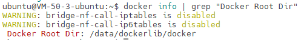

# 目录


- [1.Git，GitLab，SVN的相关知识](#user-content-1.git，gitlab，svn的相关知识)
- [2.POC验证测试的概念](#user-content-2.poc验证测试的概念)
- [3.Docker的相关概念及常用命令](#user-content-3.docker的相关概念及常用命令)
- [4.深度学习中常用的文件格式汇总](#user-content-4.深度学习中常用的文件格式汇总)
- [5.conda创建管理虚拟环境的命令大全](#user-content-5.conda创建管理虚拟环境的命令大全)
- [6.通过Dockerfile构建镜像](#user-content-6.通过Dockerfile构建镜像)
- [7.docker-compose的使用](#user-content-7.docker-compose的使用)
- [8.计算机中同步调用和异步调用有哪些区别？](#user-content-8.计算机中同步调用和异步调用有哪些区别？)
- [9.计算机中串行操作和并行操作有哪些区别？](#user-content-9.计算机中串行操作和并行操作有哪些区别？)
- [10.为什么有符号INT数据类型可表示的负数比正数多1？](#10.为什么有符号INT数据类型可表示的负数比正数多1？)
- [11.介绍一下AI行业中规范的AI服务启动Shell脚本](#11.介绍一下AI行业中规范的AI服务启动Shell脚本)
- [12.如何使用Git将AI项目切换到特定分支？](#12.如何使用Git将AI项目切换到特定分支？)
- [13.docker中如何使用gpu？](#13.docker中如何使用gpu？)
- [14.docker中如何使用摄像头并显示画面？](#14.docker中如何使用摄像头并显示画面？)
- [15.介绍一下AI行业中的API以及具体的作用](#15.介绍一下AI行业中的API以及具体的作用)
- [16.介绍一下Gunicorn的原理，并举例其在AI行业的作用](#16.介绍一下Gunicorn的原理，并举例其在AI行业的作用)
- [17.介绍一下Uvicorn的原理，并举例其在AI行业的作用](#17.介绍一下Uvicorn的原理，并举例其在AI行业的作用)
- [18.常用加密算法介绍](#18.常用加密算法介绍)
- [19.常用编码方法介绍](#19.常用编码方法介绍)
- [20.如何迁移docker服务所在路径？](#20.如何迁移docker服务所在路径？)
- [21.计算机中两个AI服务，一个AI服务调用另外一个AI服务时，该如何设置两者ip地址和端口号？](#21.计算机中两个AI服务，一个AI服务调用另外一个AI服务时，该如何设置两者ip地址和端口号？)
- [22.Nginx的使用介绍](#22.Nginx的使用介绍)

<h2 id="1.git，gitlab，svn的相关知识">1.Git，GitLab，SVN的相关知识</h2>

<h3 id="git">Git</h3>

Git是当前主流的一种<font color=DeepSkyBlue>开源分布式版本控制系统，可以有效、快速的进行项目版本管理</font>。

Git没有中央服务器，不同于SVN这种需要中央服务器的集中式版本控制系统。

Git的功能：版本控制（版本管理，远程仓库，分支协作）

Git的工作流程：


Git的常用命令：

```
git init 创建仓库

git clone 克隆github上的项目到本地

git add  添加文件到缓存区

git commit 将缓存区内容添加到仓库中
```

<h3 id="gitlab">GitLab</h3>

GitLab是一个基于Git实现的在线代码仓库软件，可以基于GitLab搭建一个类似于GitHub的仓库，<font color=DeepSkyBlue>但是GitLab有完善的管理界面和权限控制，有较高的安全性，可用于企业和学校等场景</font>。

<h3 id="svn">SVN</h3>

SVN全名Subversion，是一个开源的版本控制系统。<font color=DeepSkyBlue>不同于Git，SVN是集中式版本控制系统</font>。

SVN只有一个集中管理的服务器，保存所有文件的修订版本，而协同工作的人们都通过客户端连到这台服务器，取出最新的文件或者提交更新。

SVN的特点是<font color=DeepSkyBlue>安全，效率，资源共享</font>。

SVN的常用操作：

```
Checkout 检出代码

Update 更新代码

Commit 提交代码

Add 提交新增文件

Revert to this version + commit 撤销已经提交的代码
```


<h2 id="2.poc验证测试的概念">2.POC验证测试的概念</h2>

**POC（Proof of Concept）**，即概念验证。通常是企业进行产品选型时或开展外部实施项目前，进行的一种产品或供应商能力验证工作。主要验证内容：

1. 产品的功能。产品功能由企业提供，企业可以根据自己的需求提供功能清单，也可以通过与多家供应商交流后，列出自己所需要的功能。
2. 产品的性能。性能指标也是由企业提供，并建议提供具体性能指标所应用的环境及硬件设备等测试环境要求。
3. 产品的API适用性。
4. 产品相关技术文档的规范性、完整性。
5. 涉及到自定义功能研发的，还需要验证API开放性，供应商实施能力。
6. 企业资质规模及企业实施案例等。

<font color=DeepSkyBlue>验证内容归根结底，就是证明企业选择的产品或供应商能够满足企业提出的需求，并且提供的信息准确可靠</font>。

**POC测试工作的前提：**

1. 前期调研充分，并已经对产品或供应商有了比较深入的沟通了解。
2. 企业对自己的产品需求比较清晰。

**POC测试工作参与者：**

使用用户代表、业务负责人、项目负责人、技术架构师、测试工程师、商务经理等。

**POC测试工作准备文档：**

1. POC测试工作说明文档。内容包括测试内容、测试要求（如私有化部署）、测试标准、时间安排等。
2. 功能测试用例。主要确认功能可靠性，准确性。内容包括功能名称、功能描述等。
3. 场景测试用例。主要测试企业团队实施响应速度、实施能力、集成能力。这部分通常按照企业需求而定，不建议太复杂，毕竟需要供应商实施，拖的太久企业耐性受到影响，时间也会被拉长。
4. 技术测评方案。主要验证产品的性能、功能覆盖情况、集成效率、技术文档的质量。
5. 商务测评方案。主要包括企业实力、企业技术人才能力、版权验证、市场背景、产品报价等。

**POC测试工作的主要流程：**

**第一阶段：工作启动**

由商务或者对外代表对供应商发布正式邀请并附POC测试工作说明。

建立POC协同群。以满足快速沟通，应答。

涉及到私有化部署的，需要收集供应商部署环境要求，并与供应商一起进行部署工作，同时企业参与人员对部署工作情况做好记录。

**第二阶段：产品宣讲及现场集中测试**

供应商根据企业提供的POC测试工作说明及相应测试模块的用例或方案进行产品现场测试论证。

企业参与人员参与功能测试，并填写记录和意见。此阶段供应商往往需进行现场操作指导。

**第三阶段：技术测评**

供应商根据企业提供的技术要求给出相关支持技术文档，企业进行现场对比，根据实际情况进行统计记录。并保留供应商提供的资料和对比记录。

涉及到场景demo设计的，建议企业对实施人员能力、实施时长、实施准确性进行对比。

**第四阶段：间歇性测试工作**

该阶段是在第一阶段启动时，就可以开始了。测试功能外，还包括关键用户使用的体验心得、易用性评价。该部分允许企业用户主观评价，建议可以扩大范围组织间歇性测试，并做好测试用户记录。间歇时间1天或者多天根据实际情况安排。

**第五阶段：商务验证**

供应商根据企业提供的商务测评方案，积极配合工作。涉及到客户核实的，还需要企业进行考证。该部分工作也是从第一阶段启动时，就可以开始了。

**第六阶段：背书归档、分析总结**

每个阶段的工作都需要记录好参与人、时间、工作时间，并将测试过程中企业的、供应商的文档分类归档。对每个阶段进行分析对比，总结评价。最后进行整体工作分析总结。

<font color=DeepSkyBlue>POC工作按照不同企业和程度，测试的方式和投入力度不一样。但是目的都是相同的——验证产品或供应商能力是否满足企业需求</font>。


<h2 id="3.docker的相关概念及常用命令">3.Docker的相关概念及常用命令</h2>

<h3 id="docker简介">Docker简介</h3>

Docker是一个开源的应用容器引擎，基于Go语言并遵从Apache2.0协议开源。

Docker可以打包代码以及相关的依赖到一个轻量级、可移植的容器中，然后发布到任何流行的Linux机器上，也可以实现虚拟化。

容器完全使用沙箱机制，相互之间不会有任何接口（类似iPhone的app），更重要的是容器性能开销极低。


Docker的应用场景：
1. Web应用的自动化打包和发布。
2. 自动化测试和持续集成、发布。
3. 在服务器环境中部署/调整数据库或其它的后台应用。

<h3 id="docker架构">Docker架构</h3>

Docker包括三个基本单元:

1. 镜像（Image）：Docker镜像（Image），就相当于是一个root文件系统。比如官方镜像ubuntu:16.04就包含了完整的一套Ubuntu16.04最简系统的root文件系统。
2. 容器（Container）：镜像（Image）和容器（Container）的关系，就像是面向对象程序设计中的类和实例一样，<font color=DeepSkyBlue>镜像是静态的定义，容器是镜像运行时的实体</font>。容器可以被创建、启动、停止、删除、暂停等。
3. 仓库（Repository）：仓库可看成一个代码控制中心，用来保存镜像。

<h3 id="docker容器使用">Docker容器使用</h3>

**Docker客户端**

Docker客户端非常简单，我们可以直接输入docker命令来查看到Docker客户端的所有命令选项。也可以通过命令docker command --help更深入的了解指定的Docker命令使用方法。

```bash
docker
```

**容器使用**

获取本地没有的镜像。如果我们本地没有我们想要的镜像，我们可以使用 docker pull 命令来载入镜像：

```bash
docker pull 镜像
```

启动容器。以下命令使用ubuntu镜像启动一个容器，参数为以命令行模式进入该容器：

```bash
docker run -it 镜像 /bin/bash
```
参数解释：

- -i：允许你对容器内的标准输入 (STDIN) 进行交互。
- -t：在新容器内指定一个伪终端或终端。
- /bin/bash：放在镜像名后的是命令，这里我们希望有个交互式Shell。

我们可以通过 <仓库名>:<标签> 的格式来指定具体是这个软件哪个版本的镜像。如果不给出标签，将以latest作为默认标签。

要退出终端，直接输入exit或者CTRL+D。

启动已经停止运行的容器。查看所有的容器的命令如下：

```bash
docker ps -a
```

我们也可以用docker ps命令查看正在运行的容器。

```bash
docker ps
```

我们可以使用 docker start 启动一个已停止的容器：

```bash
docker start 容器
```

想要后台运行容器，我们可以过 -d 指定容器的运行模式：

```bash
docker run -itd --name 指定创建的容器名 容器 /bin/bash
```

加了 -d 参数默认不会进入容器，想要进入容器需要使用下面的指令进入容器：

- docker attach
- docker exec：推荐大家使用 docker exec 命令，因为使用此命令退出容器终端，不会导致容器的停止。

```bash
docker attach 容器  //如果从这个容器退出，会导致容器的停止。

docker exec -it 容器 /bin/bash   //如果从这个容器退出，不会导致容器的停止。
```

想要停止容器，其命令如下：

```bash
docker stop 容器ID
```

停止的容器重启命令：

```bash
docker restart 容器ID
```

删除容器：

```bash
docker rm -f 容器ID
```

<h3 id="docker镜像使用">Docker镜像使用</h3>

列出镜像列表。我们可以使用 docker images 来列出本地主机上的镜像。

```bash
docker images
```

各个参数解释：

- REPOSITORY：表示镜像的仓库源
- TAG：镜像的标签
- IMAGE ID：镜像ID
- CREATED：镜像创建时间
- SIZE：镜像大小

查找镜像：

```bash
docker search 镜像
```

各个参数解释：

- NAME: 镜像仓库源的名称
- DESCRIPTION: 镜像的描述
- OFFICIAL: 是否 docker 官方发布
- stars: 类似 Github 里面的 star，表示点赞、喜欢的意思。
- AUTOMATED: 自动构建。

删除镜像：

```bash
docker rmi 镜像
```

<h3 id="docker镜像的修改和自定义">Docker镜像的修改和自定义</h3>

**docker镜像的更新**

在启动docker镜像后，写入一些文件、代码、更新软件等等操作后，退出docker镜像，之后在终端输入如下命令：

```bash
docker commit -m="..." -a= "..." 容器ID 指定要创建的目标镜像名称
```

参数解释：

- commit：固定格式
- -m：提交的描述信息
- -a：指定镜像作者

接着可以用docker images查看镜像是否更新成功。（注意：不要创建名称已存在的镜像，这样会使存在的镜像名称为none，从而无法使用）

**镜像名称修改和添加新标签**

更改镜像名称（REPOSITORY）：

```bash
docker tag 容器ID 新名称
```

更改镜像tag，不修改名称：

```bash
docker tag IMAGEID(镜像id) REPOSITORY:TAG（仓库：标签）
```

<h3 id="docker容器和本机之间的文件传输">Docker容器和本机之间的文件传输</h3>

主机和容器之间传输文件的话需要用到容器的ID全称。

从本地传输到容器中：

```bash
docker cp 本地文件路径 容器name：/root/（容器路径）
```

从容器传输到本地上：

```bash
docker cp 容器name：/root/（容器路径） 本地文件路径
```

<h3 id="docker挂载宿主机文件目录">Docker挂载宿主机文件目录</h3>

docker可以支持把一个宿主机上的目录挂载到镜像的目录中。

在启动docker镜像时，输入如下命令：

```bash
docker run -it -v /宿主机绝对路径:/镜像内挂载绝对路径 容器REPOSITORY /bin/bash
```

通过-v参数，冒号前为宿主机目录，冒号后为镜像内挂载的路径，必须为绝对路径。

如果宿主机目录不存在，则会自动生成，镜像里也是同理。

默认挂载的路径权限为读写。如果指定为只读可以用：ro

```bash
docker run -it -v /宿主机绝对路径:/镜像内挂载绝对路径:ro 容器REPOSITORY /bin/bash
```


<h2 id="4.深度学习中常用的文件格式汇总">4.深度学习中常用的文件格式汇总</h2>

1. csv：可用于方便的存储数据与标签。
2. txt：最常见的文件格式，可用于存储数据路径与数据label。
3. Json：是一种轻量级的数据交换格式，常用于保存数据label。
4. Yaml：是一种数据序列化语言，通常用于编写配置文件，比如将网络模型配置参数与训练参数解耦至Yaml文件中，方便训练与优化。
5. Cfg：Darknet中经典的保存网络模型结构的文件格式。
6. Protobuf：是一个高效的结构化数据存储格式，可以存储神经网络的权重信息，在caffe中经常出现它的身影。


<h2 id="5.conda创建管理虚拟环境的命令大全">5.conda创建管理虚拟环境的命令大全</h2>

在AIGC时代，各种AI工作流飞速繁荣，我们要做好每个工作流与算法解决方案的环境配置与隔离，避免冲突，以免导致日常工作中的思维混乱。

Conda是一个主流的包管理器和环境管理器，常用于数据科学、机器学习和科学计算领域。使用Conda可以轻松地创建、管理和共享虚拟环境，下面是Conda在虚拟环境管理方面的一些常用命令：

### 创建虚拟环境

- **创建新的虚拟环境**：
  ```bash
  conda create -n myenv
  ```
  这会创建一个名为 `myenv` 的新虚拟环境。

- **指定Python版本**：
  ```bash
  conda create -n myenv python=3.8
  ```
  创建一个包含特定 Python 版本（例如 Python 3.8）的虚拟环境。

  - **指定环境保存地址**：
  ```bash
  conda create -p /本地路径/myenv python=3.8
  ```
  
### 激活和停用虚拟环境

- **激活虚拟环境**：
  ```bash
  conda activate myenv
  ```
  激活名为 `myenv` 的虚拟环境。

- **停用虚拟环境**：
  ```bash
  conda deactivate
  ```
  停用当前激活的虚拟环境。

### 管理虚拟环境中的包

- **安装包**：
  ```bash
  conda install numpy
  ```
  在当前激活的环境中安装包（例如安装 NumPy）。

- **列出环境中的包**：
  ```bash
  conda list
  ```
  显示当前环境中安装的所有包。

- **更新包**：
  ```bash
  conda update numpy
  ```
  更新当前环境中的特定包（例如 NumPy）。

- **卸载包**：
  ```bash
  conda remove numpy
  ```
  从当前环境中卸载特定的包。

### 管理环境

- **列出所有虚拟环境**：
  ```bash
  conda env list
  或者
  conda info --envs
  ```
  这些命令显示所有已创建的虚拟环境。

- **复制虚拟环境**：
  ```bash
  conda create -n myenv2 --clone myenv
  ```
  创建一个名为 `myenv2` 的新环境，这是 `myenv` 的完整副本。

- **删除虚拟环境**：
  ```bash
  conda remove -n myenv --all
  ```
  删除名为 `myenv` 的虚拟环境。

- **导出环境到文件**：
  ```bash
  conda env export > environment.yml
  ```
  将当前环境的所有包导出到 `environment.yml` 文件中，便于再现环境。

- **从文件创建环境**：
  ```bash
  conda env create -f environment.yml
  ```
  根据 `environment.yml` 文件创建虚拟环境。

这些命令为使用Conda管理虚拟环境提供了全面的控制，使得在不同项目之间隔离依赖关系和环境配置变得简单。这对于确保项目的可重现性和避免依赖冲突非常重要。


<h2 id="6.通过Dockerfile构建镜像">6.通过Dockerfile构建镜像</h2>

### 什么是Dockerfile
dockerfile 是一种用于定义和构建 docker 镜像的文本文件。它包含一系列的指令和参数，用于描述镜像的构建过程，包括基础映像、软件包安装、文件拷贝、环境变量设置等。

通过编写 dockerfile，可以将应用程序、环境和依赖项打包成一个独立的容器镜像，使其可以在不同的环境和平台上运行，实现应用程序的可移植性和可扩展性。
### Dockerfile的基本结构
1) 基础镜像（Base Image）：使用 FROM 指令指定基础映像，作为构建镜像的起点。基础映像通常包含了操作系统和一些预装的软件和工具
2) 构建过程指令：使用一系列指令来描述构建过程，例如 RUN 用于执行命令和安装软件包，COPY 用于拷贝文件和目录，ADD 用于拷贝和提取文件，WORKDIR 用于设置工作目录等
3) 容器启动指令：使用 CMD 或 ENTRYPOINT 指令来定义容器启动时要执行的命令，也就是默认的容器执行命令

通过编写Dockerfile，可以自定义构建过程，选择所需的软件和配置，以及设置环境变量、暴露端口等。Dockerfile 的语法简单且易于理解，使得镜像的构建过程变得可重复和可维护。

Dockerfile 是定义和构建 docker 镜像的文本文件，通过编写指令和参数来描述镜像的构建过程和配置，以实现应用程序的打包和部署。它是使用 docker 进行容器化开发和部署的重要工具。

### 关键字
```
FROM         # 基础镜像，当前新镜像是基于哪个镜像的
MAINTAINER   # 镜像维护者的姓名混合邮箱地址
RUN          # 容器构建时需要运行的命令
EXPOSE       # 当前容器对外保留出的端口
WORKDIR      # 指定在创建容器后，终端默认登录的进来工作目录，一个落脚点
ENV          # 用来在构建镜像过程中设置环境变量
ADD          # 将宿主机目录下的文件拷贝进镜像且ADD命令会自动处理URL和解压tar压缩包
COPY         # 类似ADD，拷贝文件和目录到镜像中！
VOLUME       # 容器数据卷，用于数据保存和持久化工作
CMD          # 指定一个容器启动时要运行的命令，dockerFile中可以有多个CMD指令，但只有最后一个生效！
ENTRYPOINT   # 指定一个容器启动时要运行的命令！和CMD一样
ONBUILD      # 当构建一个被继承的DockerFile时运行命令，父镜像在被子镜像继承后，父镜像的ONBUILD被触发

```
### 示例(构建一个tensorrt镜像)
```

FROM nvcr.io/nvidia/tensorrt:22.10-py3

# install opencv 
RUN apt update && apt install libopencv-dev -y 

# install python essential dependencies
RUN pip3 install torch torchvision torchaudio --index-url https://download.pytorch.org/whl/cu118 
RUN pip3 install numpy pillow matplotlib pycocotools opencv-python onnx onnxruntime -i https://pypi.tuna.tsinghua.edu.cn/simple
```


<h2 id="7.docker-compose的使用">7.docker-compose的使用</h2>

### 介绍
Docker Compose是一个用来定义和运行复杂应用的Docker工具。一个使用Docker容器的应用，通常由多个容器组成。使用Docker Compose不再需要使用shell脚本来启动容器。 

Compose 通过一个配置文件来管理多个Docker容器，在配置文件中，所有的容器通过services来定义，然后使用docker-compose脚本来启动，停止和重启应用，和应用中的服务以及所有依赖服务的容器，非常适合组合使用多个容器进行开发的场景。

### 示例
```
version: '3.7'

services:
  yolov5-service:
    container_name: yolov5
    environment:
      - TZ=Asia/Shanghai
      - NVIDIA_VISIBLE_DEVICES=0
      - NVIDIA_DRIVER_CAPABILITIES=compute,utility
    restart: "no"
    # 指定镜像 
    image: image镜像链接
    deploy:
      resources:
        reservations:
          devices:
            - driver: nvidia
              capabilities: [ gpu ]
    # command: "bash"
    # 服务自启动
    command: >
      bash -c "./start.sh"
    # 端口映射
    ports:
      - 8080:8888
    # 工作目录
    working_dir: /mnt/
    # 与宿主机目录挂载
    volumes:
      - /data/logs:/mnt/logs
    tty: true
    ipc: 'host'  # 使用共享内存的类型
```

### 启动
```
docker-compose up
```
执行命令后可启动一个名为yolov5的容器


<h2 id="8.计算机中同步调用和异步调用有哪些区别？">8.计算机中同步调用和异步调用有哪些区别？</h2>

在计算机编程中，同步调用和异步调用是两种处理任务的方式，它们在处理任务的机制、使用场景和效率上有显著的区别。Rocky认为我们了解这两种调用方式的区别对于编写高效、响应迅速的程序非常重要。

### 同步调用

#### 定义
同步调用是一种阻塞的调用方式。在执行同步调用时，程序会等待调用的任务完成之后再继续执行后续的代码。也就是说，在同步调用中，任务是按顺序执行的，前一个任务完成后才会执行下一个任务。

#### 特点
1. **阻塞**：调用线程会被阻塞，直到任务完成。
2. **简单直观**：代码执行顺序与编写顺序一致，易于理解和调试。
3. **适用于简单任务**：在不需要并发处理的简单任务中，同步调用更直观。

#### 示例
假设我们有一个函数 `do_task`，需要执行两次任务，每次任务耗时2秒。

```python
import time

def do_task(task_name):
    print(f"Starting {task_name}")
    time.sleep(2)  # 模拟任务耗时
    print(f"Finished {task_name}")

# 同步调用
do_task("Task 1")
do_task("Task 2")
```

在上述代码中，`Task 2` 只有在 `Task 1` 完成后才会开始执行。

### 异步调用

#### 定义
异步调用是一种非阻塞的调用方式。在执行异步调用时，程序不必等待任务完成便可以继续执行后续的代码。异步调用通常使用回调函数、Promise（如 JavaScript 中的 Promise）、Future 或 async/await 机制来处理任务完成后的操作。

#### 特点
1. **非阻塞**：调用线程不会被阻塞，可以继续执行其他任务。
2. **并发处理**：可以同时处理多个任务，提高程序的响应速度和效率。
3. **更复杂**：异步编程相对复杂，需要处理回调、事件循环等机制。

#### 示例
使用 Python 中的 `asyncio` 库实现异步调用：

```python
import asyncio

async def do_task(task_name):
    print(f"Starting {task_name}")
    await asyncio.sleep(2)  # 模拟异步任务耗时
    print(f"Finished {task_name}")

# 异步调用
async def main():
    await asyncio.gather(
        do_task("Task 1"),
        do_task("Task 2")
    )

# 运行异步任务
asyncio.run(main())
```

在上述代码中，`Task 1` 和 `Task 2` 是同时启动的，并且在2秒后几乎同时完成。

### 同步与异步的区别总结

1. **执行顺序**：
   - **同步调用**：任务按顺序执行，前一个任务完成后才会执行下一个任务。
   - **异步调用**：任务可以同时启动，程序可以在等待任务完成期间执行其他操作。

2. **阻塞行为**：
   - **同步调用**：调用线程被阻塞，直到任务完成。
   - **异步调用**：调用线程不会被阻塞，可以继续执行其他任务。

3. **效率和响应速度**：
   - **同步调用**：适用于简单、顺序的任务，易于理解和调试。
   - **异步调用**：适用于需要并发处理的任务，提高程序的效率和响应速度，但编程复杂度较高。

4. **复杂度**：
   - **同步调用**：代码逻辑直观，容易调试和维护。
   - **异步调用**：需要处理回调、事件循环等机制，复杂度较高，但能显著提高性能。

### 使用场景

- **同步调用**：
  - 适用于简单的任务顺序执行，如读取本地文件、顺序执行的计算任务等。
  - 当程序不需要处理并发任务，且性能要求不高时，使用同步调用更为合适。

- **异步调用**：
  - 适用于需要高并发处理的场景，如网络请求、I/O 操作、并行计算等。
  - 当程序需要在等待某些任务（如网络请求、数据库查询）时继续执行其他任务，异步调用能够显著提高效率和响应速度。

理解同步调用和异步调用的区别，有助于我们在合适的场景下选择合适的编程模式，编写出高效、可靠的程序。


<h2 id="9.计算机中串行操作和并行操作有哪些区别？">9.计算机中串行操作和并行操作有哪些区别？</h2>

计算机中的串行和并行操作是两种处理任务的方式，它们在任务执行的顺序、效率和应用场景上有显著的区别。Rocky认为我们理解这两种操作模式有助于设计和优化计算机程序，以提高性能和效率。

### 串行操作

#### 定义
串行操作是一种按顺序执行任务的方式。每个任务必须在前一个任务完成之后才能开始执行，这意味着任务是一个接一个地进行，没有重叠。

#### 特点
1. **顺序执行**：任务按先后顺序逐一执行。
2. **简单直观**：代码逻辑清晰，容易编写和调试。
3. **无竞争条件**：因为只有一个任务在运行，不会发生资源竞争或冲突。

#### 示例
假设我们有三个任务：Task 1、Task 2 和 Task 3，它们必须按顺序执行。

```python
def task1():
    print("Executing Task 1")

def task2():
    print("Executing Task 2")

def task3():
    print("Executing Task 3")

# 串行执行
task1()
task2()
task3()
```

在上述代码中，Task 1 完成后才会开始 Task 2，然后是 Task 3。

#### 优缺点
- **优点**：
  - 实现简单，逻辑清晰。
  - 易于调试和维护。

- **缺点**：
  - 处理大量任务时效率低。
  - 不能充分利用多核处理器的计算能力。

### 并行操作

#### 定义
并行操作是一种同时执行多个任务的方式，通常利用多核处理器或多台计算机来同时处理多个任务，从而提高效率。

#### 特点
1. **同时执行**：多个任务可以同时开始并执行。
2. **复杂性**：代码逻辑复杂，需要处理同步、资源共享和竞争条件等问题。
3. **高效利用资源**：能够充分利用多核处理器和分布式计算资源。

#### 示例
假设我们有三个任务：Task 1、Task 2 和 Task 3，它们可以同时执行。我们可以使用 Python 的 `concurrent.futures` 模块来实现并行操作。

```python
import concurrent.futures

def task1():
    print("Executing Task 1")

def task2():
    print("Executing Task 2")

def task3():
    print("Executing Task 3")

# 并行执行
with concurrent.futures.ThreadPoolExecutor() as executor:
    futures = [executor.submit(task) for task in [task1, task2, task3]]
    for future in concurrent.futures.as_completed(futures):
        future.result()
```

在上述代码中，Task 1、Task 2 和 Task 3 会同时开始执行，利用线程池实现并行处理。

#### 优缺点
- **优点**：
  - 高效处理大量任务。
  - 能充分利用多核处理器和分布式计算资源，提高整体性能。

- **缺点**：
  - 实现复杂，需要处理同步和资源共享问题。
  - 存在资源竞争和死锁风险。

### 比较和应用场景

#### 1. 执行顺序
- **串行操作**：任务按顺序逐一执行。
- **并行操作**：多个任务可以同时执行。

#### 2. 适用场景
- **串行操作**：适用于简单的、无需高并发的任务，如顺序文件处理、简单的计算任务等。
- **并行操作**：适用于需要高并发处理的任务，如大规模数据处理、图像处理、网络请求等。

#### 3. 资源利用
- **串行操作**：通常只能利用单个处理器核，无法充分利用多核处理器的优势。
- **并行操作**：能够利用多核处理器或多台计算机，提高资源利用率和任务处理效率。

#### 4. 代码复杂度
- **串行操作**：实现简单，代码逻辑直观。
- **并行操作**：实现复杂，需要处理任务同步、资源共享和竞争条件等问题。

### 总结

串行操作和并行操作在计算机科学中不仅代表了两种不同的技术实现方式，更深层次上反映了不同的哲学思想：
- **时间观念**：线性 vs 非线性。
- **资源利用**：单任务专注 vs 多任务并行。
- **复杂性**：秩序和简单 vs 复杂性管理。
- **任务关系**：协作和依赖 vs 竞争和协同。


<h1 id='10.为什么有符号INT数据类型可表示的负数比正数多1？'>10.为什么有符号INT数据类型可表示的负数比正数多1？</h1>

#### 一句话总结

在有符号的整型数据类型中，用'0 00...0' 表示正负0； '1 00...0' 表示最小负数。

#### 原理解释

整型数据类型通常使用有符号表示法，其中最高有效位用作符号位。以INT8为例，符号位占据了第一位，而剩下的7位用于表示数值。因此，正数范围是从00 000000（二进制）到01111111（二进制），转换为十进制即为0到127。负数范围是从10000000（二进制）到11111111（二进制），转换为十进制即为-128到-1。这种表示方式称为二进制补码。

#### 二进制补码

**正数**：

- 1 $\rightarrow$ '0 0000001'

-  '0 0000001' $\rightarrow$ 判断为正数直接转化为1。

**负数**：

- -127 $\rightarrow$ 127原码， '0 1111111' $\rightarrow$ 取反，'1 0000000' $\rightarrow$ +1， '1 0000001' 

- '1 0000001'  $\rightarrow$ 判断为负数 $\rightarrow$取反， '0 1111110'  $\rightarrow$ +1，‘0 1111111'  $\rightarrow$ 结合判断得出值为-127


<h1 id='11.介绍一下AI行业中规范的AI服务启动Shell脚本'>11.介绍一下AI行业中规范的AI服务启动Shell脚本</h1>

**在AI行业中，AIGC、传统深度学习、自动驾驶等核心领域一般都使用Shell脚本启动AI程序服务**。Shell脚本可以自动化AI程序的启动、停止和监控过程，使得对AI服务管理变得更加高效和可靠。以下是Rocky总结的编写规范Shell脚本的详细步骤，并对每个步骤进行深入浅出的讲解。

### 1. 先配置Shebang行和脚本说明

#### Shebang行
```sh
#!/bin/bash
```
- **解释**：`#!/bin/bash` 指定了脚本使用 `/bin/bash` 解释器执行。**Shebang行必须是脚本的第一行**。

#### 脚本说明
```sh
# This script is used to start the AI service.
# Author: WeTHinkIn
# Date: 2024-08-12
```
- **解释**：脚本头部的注释部分提供了脚本的基本信息，包括用途、作者和创建日期。这有助于后续的AI服务维护和扩展。

### 2. 设置环境变量

```sh
# 定义环境变量
export MODEL_DIR="/path/to/model"
export DATA_DIR="/path/to/data"
export LOG_DIR="/path/to/logs"
export CONFIG_FILE="/path/to/config.yaml"
export PYTHON_ENV="/path/to/virtualenv/bin/python"
```
- **解释**：环境变量用于存储配置文件、数据目录、日志目录等路径。使用 `export` 命令将这些变量导出，**使其在当前Shell脚本的所有子进程中都可见和可访问，这意味着当前脚本启动的任何其他脚本或命令中都能访问到这些变量**。

### 3. AI服务代码构建

#### 通过git相关命令获取最新AI服务代码
```sh
# 首先确定要获取的AI服务代码的分支：检查启动Shell脚本时是否提供了第一个命令行参数，如果没有提供，则将变量branch设置为默认值"master"；如果提供了第一个命令行参数，则将变量branch设置为该参数的值。
if [ -z "$1" ]; then
  branch="master"
else
  branch="$1"
fi

# 清理当前工作目录，获取制定分支的最新AI服务代码
cd /path/to/code_path
git pull
git reset
git checkout .
git clean -f
git checkout $branch
git pull

# 下面两个命令可以停止特定端口（比如8888）上的已有程序，为即将启动的AI程序服务提供空闲端口
lsof -i :8888 | grep LISTEN | awk '{print $2}' | xargs kill -9
# 或者
pkill -f 'python.*8888'

```
- **解释**：上面的AI服务代码构建命令中主要分成三步，分别是确定AI服务代码的分支；清理当前工作目录，获取最新AI服务代码；为AI服务代码提供空闲端口。

#### 启动AI程序服务
```sh
echo "Starting WeThinkIn AI service..."
nohup python /path/to/WeThinkIn.py --model_dir ${MODEL_DIR} --data_dir ${DATA_DIR} --config ${CONFIG_FILE} > ${LOG_DIR}/service.log 2>&1 &
echo "WeThinkIn AI service started. Logs are available at ${LOG_DIR}/service.log"
```
- **解释**：正式启动AI程序服务，**使用 `nohup` 和 `&` 将服务放入后台运行，并将输出和错误重定向到日志文件**。

### 4. 错误捕获和错误处理

#### 错误处理函数
```sh
handle_error() {
    echo "Error occurred in script at line: $1."
    exit 1
}
```
- **解释**：`handle_error` 函数打印错误信息并退出脚本。`$1` 是错误发生的行号。

#### 设置错误捕获
```sh
trap 'handle_error $LINENO' ERR
```
- **解释**：`trap` 命令捕获错误信号（ERR），并调用 `handle_error` 函数，传递错误发生的行号 `$LINENO`。

### 完整示例脚本

```sh
#!/bin/bash
# This script is used to start the AI service.
# Author: WeTHinkIn
# Date: 2024-08-12

# 如果出现报错，及时结束程序
set -e

# 定义环境变量
export MODEL_DIR="/path/to/model"
export DATA_DIR="/path/to/data"
export LOG_DIR="/path/to/logs"
export CONFIG_FILE="/path/to/config.yaml"
export PYTHON_ENV="/path/to/virtualenv/bin/python"

# 首先确定要获取的AI服务代码的分支：检查启动Shell脚本时是否提供了第一个命令行参数，如果没有提供，则将变量branch设置为默认值"master"；如果提供了第一个命令行参数，则将变量branch设置为该参数的值。
if [ -z "$1" ]; then
  branch="master"
else
  branch="$1"
fi

# 清理当前工作目录，获取制定分支的最新AI服务代码
cd /path/to/code_path
git pull
git reset
git checkout .
git clean -f
git checkout $branch
git pull

# 下面两个命令可以停止特定端口（比如8888）上的已有程序，为即将启动的AI程序服务提供空闲端口
lsof -i :8888 | grep LISTEN | awk '{print $2}' | xargs kill -9
# 或者
pkill -f 'python.*8888'

# 启动AI程序服务
echo "Starting WeThinkIn AI service..."
nohup python /path/to/WeThinkIn.py --model_dir ${MODEL_DIR} --data_dir ${DATA_DIR} --config ${CONFIG_FILE} > ${LOG_DIR}/service.log 2>&1 &
echo "WeThinkIn AI service started. Logs are available at ${LOG_DIR}/service.log"

# 错误捕获与错误处理
handle_error() {
    echo "Error occurred in script at line: $1."
    exit 1
}

trap 'handle_error $LINENO' ERR
```

通过以上步骤，我们就可以编写出一个结构清晰、功能完整的Shell脚本，用于启动AI程序服务。Shell脚本中要包括环境变量设置、AI服务代码获取、服务启动和错误处理等功能，来保证Shell脚本的可维护性和鲁棒性。


<h1 id='12.如何使用Git将AI项目切换到特定分支？'>12.如何使用Git将AI项目切换到特定分支？</h1>

在Git中，我们可以使用以下命令查看AI项目中有多少分支，并切换到特定的分支。以下是详细的步骤和命令解析：

### 1. 查看项目中的所有分支

要查看本地和远程的所有分支，我们可以使用以下命令：

#### 查看本地分支

```bash
git branch
```

这会列出所有本地分支，当前所在的分支会用 `*` 标记。

#### 查看远程分支

```bash
git branch -r
```

这会列出所有远程分支。

#### 查看本地和远程分支

```bash
git branch -a
```

这会列出所有本地和远程分支。

### 2. 切换到特定分支

要切换到特定的分支，我们可以使用 `git checkout` 或 `git switch` 命令。

#### 使用 `git checkout` 切换分支

```bash
git checkout <branch-name>
```

例如，切换到名为 `WeThinkIn` 的分支：

```bash
git checkout WeThinkIn
```

#### 使用 `git switch` 切换分支

```bash
git switch <branch-name>
```

例如，切换到名为 `WeThinkIn` 的分支：

```bash
git switch WeThinkIn
```

### 操作示例详解

假设我们在一个AI项目中，想要查看所有分支并切换到一个名为 `WeThinkIn` 的分支，以下是具体的操作步骤：

1. **查看本地分支**：

```bash
git branch
```

输出示例：

```bash
* master
  WeThinkIn
  feature-1
```

2. **查看远程分支**：

```bash
git branch -r
```

输出示例：

```bash
  origin/HEAD -> origin/master
  origin/WeThinkIn
  origin/feature-1
  origin/master
```

3. **查看所有分支**：

```bash
git branch -a
```

输出示例：

```bash
* master
  WeThinkIn
  feature-1
  remotes/origin/HEAD -> origin/master
  remotes/origin/develop
  remotes/origin/feature-1
  remotes/origin/master
```

4. **切换到 `WeThinkIn` 分支**：

```bash
git checkout WeThinkIn
```

或者使用 `git switch`：

```bash
git switch WeThinkIn
```


<h1 id='13.docker中如何使用gpu？'>13.docker中如何使用gpu？</h1>

在启动容器的时候，使用--gpus参数时，需要安装nvidia-container-toolkit，才能在容器中使用显卡

官方安装命令：
```
curl -fsSL https://nvidia.github.io/libnvidia-container/gpgkey | sudo gpg --dearmor -o /usr/share/keyrings/nvidia-container-toolkit-keyring.gpg \
  && curl -s -L https://nvidia.github.io/libnvidia-container/stable/deb/nvidia-container-toolkit.list | \
    sed 's#deb https://#deb [signed-by=/usr/share/keyrings/nvidia-container-toolkit-keyring.gpg] https://#g' | \
    sudo tee /etc/apt/sources.list.d/nvidia-container-toolkit.list
sed -i -e '/experimental/ s/^#//g' /etc/apt/sources.list.d/nvidia-container-toolkit.list
sudo apt-get update
sudo apt-get install -y nvidia-container-toolkit
```
一般在搜索该问题的时候，大部分都是如下命令：
```
curl -s -L https://nvidia.github.io/nvidia-container-runtime/gpgkey | \
  sudo apt-key add -
distribution=$(. /etc/os-release;echo $ID$VERSION_ID)
curl -s -L https://nvidia.github.io/nvidia-container-runtime/$distribution/nvidia-container-runtime.list | \
  sudo tee /etc/apt/sources.list.d/nvidia-container-runtime.list
sudo apt-get update
apt-get install nvidia-container-runtime
```
或者
```
curl -s -L https://nvidia.github.io/nvidia-docker/gpgkey | \
  sudo apt-key add -
distribution=$(. /etc/os-release;echo $ID$VERSION_ID)
curl -s -L https://nvidia.github.io/nvidia-docker/$distribution/nvidia-docker.list | \
  sudo tee /etc/apt/sources.list.d/nvidia-docker.list
sudo apt-get update
sudo apt-get install -y nvidia-docker2
```
在ubuntu版本较高时，使用上述两种方法，会存在
E: 无法定位软件包 nvidia-container-runtime/ E: 无法定位软件包 nvidia-docker2这个问题，原因在添加的源里面没有对应的版本
建议使用英伟达官方安装命令
参考链接:https://docs.nvidia.com/datacenter/cloud-native/container-toolkit/latest/install-guide.html


<h1 id='14.docker中如何使用摄像头并显示画面？'>14.docker中如何使用摄像头并显示画面？</h1>

在docker中想要使用宿主机的摄像头时，需要在docker创建之初挂载宿主机的摄像头设备
使用--device参数进行挂载，--device=/dev/video0:/dev/video0，可挂载多个摄像头

显示画面
linux系统目前的主流图像界面服务X11支持 客户端/服务端（C/S）的工作模式，需要在容器启动的时候，将unix:端口或主机名:端口共享给docker，docker 就可以通过端口找到显示输出的地方，和linux系统共用显示接口。
1、安装xserver
```
sudo apt install x11-xserver-utils
```
2、设置权限
```
# 允许所有用户访问显示接口
xhost +
# 只允许Docker用户访问显示接口 (两者选其一即可)
xhost +local:docker 
```
3、运行docker镜像的时候，设置环境变量
```
#共享本地unix端口
-v /tmp/.X11-unix:/tmp/.X11-unix           
#修改环境变量DISPLAY
-e DISPLAY=unix$DISPLAY 
```
示例：
```
docker run -it -v /tmp/.X11-unix:/tmp/.X11-unix -e DISPLAY=unix$DISPLAY <image_name>
```


<h1 id='15.介绍一下AI行业中的API以及具体的作用'>15.介绍一下AI行业中的API以及具体的作用</h1>

API（Application Programming Interface，应用程序编程接口）是一组定义和协议，用于构建和集成软件应用程序。它允许不同的软件系统相互通信和数据交换，提供了标准化的接口，简化了开发过程。

在人工智能（AI）行业中，API通常指AI服务提供商向开发者开放的接口，允许他们调用预训练的AI模型和算法，例如：

- **AIGC**：图像生成、视频生成、文本对话、音频生成等。
- **传统深度学习**：图像识别、物体检测、面部识别、文本分析、情感分析、机器翻译。
- **自动驾驶**：车载智能服务、车载娱乐服务等。

这些API使开发者无需从头开始训练复杂的AI模型，就能将先进的AI功能集成到自己的应用程序或服务中。

**API的具体作用**：

1. **简化开发流程**
   - **降低技术门槛**：开发者无需具备深厚的AI专业知识即可使用先进的AI功能。
   - **节省时间和资源**：避免了从零开始训练和部署模型的繁琐过程。

2. **加速产品上市**
   - **快速集成**：通过API，AI功能可以迅速集成到现有产品中。
   - **抢占市场先机**：更快地推出具备AI功能的产品，提升竞争力。

3. **促进创新**
   - **丰富功能组合**：API提供多样化的AI能力，鼓励开发者探索新应用场景。
   - **协同合作**：标准化的接口促进了不同团队和组织之间的协作。

4. **可扩展性和灵活性**
   - **按需调用**：根据需求灵活调用不同的AI服务，支持业务的可扩展性。
   - **资源优化**：按使用量付费，优化成本。

5. **持续更新和维护**
   - **技术迭代**：API提供商负责模型的更新和优化，开发者可持续受益于最新技术。
   - **降低维护成本**：减少了对模型维护和基础设施管理的需求。

6. **数据安全和合规性**
   - **安全保障**：许多AI API内置了安全机制，确保数据传输和处理的安全性。
   - **法规遵从**：帮助企业满足数据隐私和合规要求。


**实例举例**：

- **OpenAI API**
  - **功能**：提供GPT-4等大型语言模型的访问接口。
  - **应用**：文本生成、对话机器人、内容总结等。

- **Google Cloud AI APIs**
  - **功能**：包括视觉分析、语言处理、语音识别等多种AI服务。
  - **应用**：图像标签、情感分析、语音转文字等。

- **Amazon Web Services（AWS）AI服务**
  - **功能**：提供个性化推荐、欺诈检测、预测分析等。
  - **应用**：电商推荐系统、金融风险评估、库存预测等。


<h1 id='16.介绍一下Gunicorn的原理，并举例其在AI行业的作用'>16.介绍一下Gunicorn的原理，并举例其在AI行业的作用</h1>

**Gunicorn（Green Unicorn）** 是一个被广泛应用的 Python Web 服务器网关接口（WSGI）HTTP 服务器，适用于 UNIX 系统。它以简单、高效、轻量级著称，能够兼容多种 Web 框架，如 Django、Flask、Pyramid 等。

在 AI 行业，模型的部署和服务化是关键环节之一。Gunicorn 作为成熟的 Python WSGI 服务器，为 AI 模型的服务化部署提供了稳健、高性能的解决方案。通过与各种 Web 框架和异步工作类的结合，Gunicorn 能够满足 AI 应用对高并发、低延迟和稳定性的要求。在 AI 行业的实际应用中，合理地配置和使用 Gunicorn，可以有效提升模型服务的性能和可靠性。

### 一、Gunicorn 的原理详解

#### 1. WSGI 概述

- **WSGI（Web Server Gateway Interface）** 是 Python 应用程序或框架与 Web 服务器之间的标准接口。
- 它定义了一套简单的调用约定，使得不同的 Web 服务器和应用框架可以互相兼容。

#### 2. Gunicorn 的架构

Gunicorn 采用了 **预分叉（Pre-fork）** 的工作模式，其架构主要包括：

- **Master（主进程）**：负责管理 Worker（工作进程），包括创建、监控和销毁。
- **Worker（工作进程）**：处理实际的客户端请求，每个进程独立运行。

#### 3. Gunicorn 的工作原理

1. **启动阶段**：

   - Gunicorn 被启动后，创建一个 Master 进程。
   - Master 根据配置，预先 Fork 出多个 Worker 进程。

2. **请求处理**：

   - 客户端请求到达服务器后，由 Master 进程通过监听套接字（Socket）接受连接。
   - Master 将连接分配给空闲的 Worker 进程。

3. **响应阶段**：

   - Worker 进程根据 WSGI 应用程序处理请求，生成响应。
   - 响应通过套接字返回给客户端。

4. **进程管理**：

   - Master 监控 Worker 的状态，必要时重启或增减 Worker 数量。
   - 支持平滑重启和代码更新，确保服务的高可用性。

#### 4. Worker 类型

Gunicorn 支持多种 Worker 类型，以满足不同的并发需求：

- **同步（sync）**：默认的 Worker 类型，每个请求占用一个线程，适用于 I/O 密集型应用。
- **异步（async）**：基于事件循环，如 **gevent**、**eventlet**，适用于高并发场景。
- **基于线程（threads）**：每个 Worker 可以处理多个线程，提高并发能力。

#### 5. 配置与定制

- **配置文件**：Gunicorn 支持使用配置文件或命令行参数，灵活定制服务器行为。
- **中间件与插件**：支持自定义中间件，扩展功能，如日志、监控等。

### 二、Gunicorn 的优势

1. **高性能**：采用预分叉模型，减少进程创建和销毁的开销，提供稳定的性能表现。

2. **简单易用**：配置简洁，易于与各种 Python Web 框架集成。

3. **可扩展性**：支持多种 Worker 类型，适应不同的应用场景和并发需求。

4. **稳健性**：具备良好的错误处理和进程管理机制，确保服务的可靠运行。

### 三、Gunicorn 在 AI 行业的作用

#### 1. AI 模型的服务化部署

在 AI 应用中，将训练好的模型部署为 Web 服务，供客户端调用是常见需求。Gunicorn 在这一过程中提供了可靠的服务器环境。

- **与 Flask 或 FastAPI 集成**：通过 WSGI 或 ASGI 接口，将模型封装为 API 服务。
- **处理高并发请求**：Gunicorn 的多 Worker 模型能够有效处理来自不同客户端的并发请求。
- **稳定性和可靠性**：确保模型服务在长时间运行下的稳定性。

#### 2. 实例：使用 Flask 部署预测服务

```python
# app.py
from flask import Flask, request, jsonify
import joblib

app = Flask(__name__)
model = joblib.load('model.pkl')

@app.route('/predict', methods=['POST'])
def predict():
    data = request.json
    prediction = model.predict([data['features']])
    return jsonify({'prediction': prediction.tolist()})

if __name__ == '__main__':
    app.run()
```

**使用 Gunicorn 启动服务：**

```bash
gunicorn app:app --workers 4
```

- **解释**：
  - `app:app`：指定模块和应用实例。
  - `--workers 4`：启动 4 个 Worker 进程，提高并发处理能力。

**使用 Gunicorn 和 UvicornWorker 启动服务：**

```bash
gunicorn main:app --workers 2 --worker-class uvicorn.workers.UvicornWorker
```

- **解释**：
  - `--worker-class uvicorn.workers.UvicornWorker`：使用异步 Worker，支持高并发和异步请求。

### 四、Gunicorn在AI服务部署中的优势

1. **高效利用资源**：通过多进程模型，充分利用多核 CPU，提高吞吐量。

2. **易于扩展**：可以根据需求调整 Worker 数量，灵活应对流量变化。

3. **安全性**：隔离不同的 Worker 进程，防止单点故障。

4. **与容器化技术结合**：常与 Docker 等容器技术配合，构建可移植的部署方案。


<h1 id='17.介绍一下Uvicorn的原理，并举例其在AI行业的作用'>17.介绍一下Uvicorn的原理，并举例其在AI行业的作用</h1>

**Uvicorn** 是一个基于 Python 的高速、轻量级 ASGI（Asynchronous Server Gateway Interface）服务器，采用了基于事件循环的异步编程模型。它以高性能和低资源消耗著称，适用于部署基于异步框架（如 FastAPI、Starlette）的 Python Web 应用。

在 AI 行业，实时性和高并发能力对于模型服务化部署尤为重要。Uvicorn 作为现代化的高性能 ASGI 服务器，在 AI 行业的应用越来越广泛。它的高并发、低延迟和对异步协议的支持，使得 AI 应用能够满足实时性和高吞吐量的要求。通过与异步框架的结合，Uvicorn 为 AI 模型的部署和服务化提供了强大的支持。

### 一、Uvicorn 的原理详解

#### 1. ASGI 概述

- **ASGI（Asynchronous Server Gateway Interface）** 是 WSGI 的异步版本，旨在支持异步通信协议，如 WebSocket，以及高并发的异步应用。
- ASGI 定义了应用程序与服务器之间的接口标准，允许异步框架和服务器之间的互操作。

#### 2. Uvicorn 的架构

Uvicorn 采用了现代化的异步编程技术，基于 **uvloop** 和 **httptools**，提供了高性能的网络 I/O 和 HTTP 处理。

- **uvloop**：一个基于 libuv 的高性能事件循环，比默认的 asyncio 事件循环快很多。
- **httptools**：用于解析 HTTP 协议的高效库。

#### 3. Uvicorn 的工作原理

1. 事件循环机制

- **事件循环（Event Loop）**：核心组件，负责调度和执行异步任务。
- Uvicorn 使用 uvloop 作为事件循环的实现，提供了高效的异步 I/O 操作。

2. 异步请求处理

- **异步任务**：Uvicorn 能够处理异步函数（`async def`），在请求到来时创建协程进行处理。
- **并发性**：通过协程和事件循环，Uvicorn 能够在单个线程中处理大量的并发连接。

3. ASGI 应用接口

- **Scope**：请求的上下文信息，如类型、路径、头信息等。
- **Receive**：异步函数，用于接收客户端发送的消息。
- **Send**：异步函数，用于向客户端发送消息。

Uvicorn 接受客户端请求，创建 Scope，并调用 ASGI 应用的入口点，将 `scope`、`receive`、`send` 传递给应用程序。

4. 协程调度

- **协程（Coroutine）**：Python 中的异步函数，使用 `async def` 定义。
- Uvicorn 在事件循环中调度协程的执行，非阻塞地处理 I/O 操作，实现高效的资源利用。

#### 4. Uvicorn 的特点

- **高性能**：利用 uvloop 和 httptools，提供了极快的请求处理速度。
- **低资源消耗**：异步编程模型减少了线程和进程的开销。
- **支持多种协议**：除了 HTTP，还支持 WebSocket 等异步通信协议。
- **易于集成**：与 FastAPI、Starlette 等异步框架无缝衔接。

### 二、Uvicorn 的优势

1. **高并发处理能力**

   - 通过异步 I/O 和事件循环，能够在单个线程中处理大量并发请求。

2. **低延迟**

   - 减少了上下文切换和线程调度的开销，提高了响应速度。

3. **支持异步特性**

   - 能够处理 WebSocket 等需要保持长连接的协议，适合实时通信场景。

4. **轻量级**

   - 安装和部署简单，启动速度快，占用资源少。

### 三、Uvicorn 在 AI 行业的作用

#### 1. 实时推理服务

AI 应用常常需要提供实时的预测和推理服务，如聊天机器人、语音识别、实时推荐等。Uvicorn 的高并发和低延迟特性使其成为部署此类服务的理想选择。

示例：使用 FastAPI 部署实时预测服务

```python
# main.py
from fastapi import FastAPI
import asyncio
import torch

app = FastAPI()
model = torch.load('model.pt')

@app.post("/predict")
async def predict(data: dict):
    input_tensor = torch.tensor(data['input'])
    result = await asyncio.to_thread(model_predict, input_tensor)
    return {"result": result.tolist()}

def model_predict(input_tensor):
    with torch.no_grad():
        output = model(input_tensor)
    return output
```

**启动命令：**

```bash
uvicorn main:app --host 0.0.0.0 --port 8000
```

- **解释：**
  - 使用 Uvicorn 直接运行 ASGI 应用。
  - `--host` 和 `--port` 指定服务器监听的地址和端口。
 
**1. 使用多进程模式**

- Uvicorn 可以使用 `--workers` 参数启动多个进程，充分利用多核 CPU。

**示例：**

```bash
uvicorn main:app --host 0.0.0.0 --port 8000 --workers 4
```

- **解释：**
  - 启动 4 个进程，提升并发处理能力。

**2. 与 Gunicorn 结合**

- 使用 Gunicorn 管理进程，Uvicorn 作为工作进程，提供更稳健的进程管理。

**示例：**

```bash
gunicorn main:app --workers 4 --worker-class uvicorn.workers.UvicornWorker
```

- **解释：**
  - Gunicorn 负责进程管理，Uvicorn 提供异步处理。

#### 2. 异步数据处理

在一些需要处理高吞吐量数据的 AI 应用中，如日志分析、实时监控等，Uvicorn 可以与异步框架结合，实现高效的数据接收和处理。

示例：实时数据接收与处理

```python
# main.py
from fastapi import FastAPI, WebSocket
from some_async_data_processing_library import process_data

app = FastAPI()

@app.websocket("/ws")
async def websocket_endpoint(websocket: WebSocket):
    await websocket.accept()
    while True:
        data = await websocket.receive_text()
        result = await process_data(data)
        await websocket.send_text(result)
```

**启动命令：**

```bash
uvicorn main:app --host 0.0.0.0 --port 8000
```

- **解释：**
  - 使用 WebSocket 接收实时数据。
  - 异步处理数据，提高吞吐量。

#### 3. 部署异步机器学习服务

一些机器学习任务，如异步训练、在线学习等，需要异步的处理方式。Uvicorn 能够支持这些异步任务的部署。

示例：异步任务队列

```python
# main.py
from fastapi import FastAPI, BackgroundTasks
import asyncio

app = FastAPI()

@app.post("/train")
async def train_model(data: dict, background_tasks: BackgroundTasks):
    background_tasks.add_task(async_train, data)
    return {"message": "Training started"}

async def async_train(data):
    await asyncio.sleep(10)  # 模拟长时间训练任务
    # 执行训练逻辑
```

- **解释：**
  - 使用 `BackgroundTasks` 在后台异步执行训练任务，不阻塞主线程。

#### 4. 与 AI 框架的集成

- **FastAPI**：Uvicorn 是 FastAPI 推荐的 ASGI 服务器，二者结合能够高效地部署 AI 应用。
- **Starlette**：作为一个轻量级的 ASGI 框架，与 Uvicorn 完美配合。

### 四、Uvicorn在AI部署中的优势

1. **高效处理 I/O 密集型任务**

   - AI 应用中，经常需要处理大量的 I/O 操作，如读取数据、网络通信等。

2. **简化代码**

   - 异步编程模型使代码更加简洁，易于维护。

3. **灵活的扩展性**

   - 支持多种协议，方便扩展新的功能，如添加 WebSocket 支持。

4. **适合微服务架构**

   - 轻量级的特性，使其适合在容器化环境中部署微服务。


<h1 id='18.常用加密算法介绍'>18.常用加密算法介绍</h1>

### 加密算法的应用场景
- 用户登录：在用户登录过程中，密码通常会被加密存储在数据库中。当用户尝试登录时，系统会使用加密算法对用户输入的密码进行加密，并与数据库中存储的加密密码进行比对，以验证用户身份。
数字签名：数字签名用于验证文档的真实性和来源。发送方使用私钥对文档进行加密生成数字签名，接收方使用公钥验证数字签名以确保文档未被篡改且来自正确的发送方。
- 数据传输：在数据传输过程中，为了确保数据的机密性和完整性，通常会使用加密算法对数据进行加密。例如，HTTPS协议就是通过使用SSL/TLS协议对传输的数据进行加密，保证数据的安全性。
- 数据存储：在数据存储时，使用加密算法对数据进行加密，确保数据在存储时的安全。许多云服务提供商都提供了数据加密服务，以保护用户数据的隐私。
- 身份认证：通过使用加密算法对用户身份信息进行加密和验证，确保只有经过授权的用户才能访问相应的资源。例如，OAuth协议就是一种基于令牌的身份认证协议，通过使用加密算法保证令牌的安全性

### 对称加密算法
1) AES (Advanced Encryption Standard)：目前最流行的对称加密算法之一。
2) DES (Data Encryption Standard)：较早的加密标准，但由于密钥长度过短，现在不太安全。
3) 3DES (Triple Data Encryption Standard)：DES的改进版本，通过三次加密提高安全性。

Python实现示例（AES）
```
from Crypto.Cipher import AES
import base64

# 需要加密的数据
data = "This is a secret message!"
# 密钥（AES密钥长度为16、24或32字节）
key = b'This is a key123'

# 补齐数据
def pad(data):
    return data + (AES.block_size - len(data) % AES.block_size) * chr(AES.block_size - len(data) % AES.block_size)

# 去除补齐
def unpad(data):
    return data[:-ord(data[len(data) - 1:])]

# 创建加密对象
cipher = AES.new(key, AES.MODE_ECB)
# 加密
encrypted_data = cipher.encrypt(pad(data).encode())
# 解密
decrypted_data = unpad(cipher.decrypt(encrypted_data))

print("Encrypted:", base64.b64encode(encrypted_data))
print("Decrypted:", decrypted_data.decode())

```

### 非对称加密算法
非对称加密算法使用一对密钥，一个用于加密（公钥），另一个用于解密（私钥）。
1) RSA
2) ECC (Elliptic Curve Cryptography)

Python实现示例（RSA）
```
from Crypto.PublicKey import RSA
from Crypto.Cipher import PKCS1_OAEP
import base64

# 生成密钥对
key = RSA.generate(2048)
private_key = key.export_key()
public_key = key.publickey().export_key()

# 加密
def encrypt(message, public_key):
    rsa_public_key = RSA.import_key(public_key)
    cipher = PKCS1_OAEP.new(rsa_public_key)
    encrypted_message = cipher.encrypt(message.encode())
    return base64.b64encode(encrypted_message)

# 解密
def decrypt(encrypted_message, private_key):
    rsa_private_key = RSA.import_key(private_key)
    cipher = PKCS1_OAEP.new(rsa_private_key)
    return cipher.decrypt(base64.b64decode(encrypted_message)).decode()

# 测试加密和解密
encrypted_message = encrypt("This is a secret message!", public_key)
decrypted_message = decrypt(encrypted_message, private_key)

print("Encrypted:", encrypted_message)
print("Decrypted:", decrypted_message)

```
RSA加密算法通常会将公钥和私钥存储为pem格式的文件，可以使用以下代码生成和保存密钥对：
```
# 生成密钥对
key = RSA.generate(2048)
private_key = key.export_key()
public_key = key.publickey().export_key()

# 保存密钥对到文件
with open("private_key.pem", "wb") as f:
    f.write(private_key)
```


<h1 id='19.常用编码方法介绍'>19.常用编码方法介绍</h1>

### 为什么需要编码
编码是将数据从一种形式转换为另一种形式的过程，以便在计算机系统中存储和传输。编码的主要目的是确保数据在传输过程中不会丢失或损坏，并且可以在接收端正确地解码和恢复原始数据。

### 常见编码方法
1. **ASCII编码**：ASCII编码是一种字符编码标准，用于表示英文字母、数字和特殊符号。它使用7位二进制数表示一个字符，最多可以表示128个字符。ASCII编码是最早的字符编码标准之一，至今仍在广泛使用。
```
# Python 3 中默认字符串是 Unicode，需要先转换为 bytes
text = "Hello, World!"
ascii_encoded = text.encode('ascii')
print(ascii_encoded)  # 输出: b'Hello, World!'
```
2. **Unicode编码**：Unicode编码是一种字符编码标准，用于表示世界上大多数语言的字符。它使用16位或32位二进制数表示一个字符，最多可以表示1,114,112个字符。Unicode编码旨在解决ASCII编码无法表示非英文字符的问题，并确保不同语言之间的字符可以正确地表示和传输。
3. **Base64编码**：Base64编码是一种二进制到文本的编码方法，用于将二进制数据转换为可打印的文本字符。它使用64个字符（A-Z、a-z、0-9、+、/）来表示二进制数据。Base64编码常用于在电子邮件中传输二进制数据，以及在Web应用程序中传输数据。
```
import base64

data = b'\x00\xFF\x00\xFF'
base64_encoded = base64.b64encode(data)
print(base64_encoded)  # 输出: b'AP8A/w=='
```
4. **URL编码**：URL编码是一种将特殊字符转换为百分号编码的方法，用于在URL中传输数据。URL编码将非字母数字字符转换为百分号（%）后跟两位十六进制数，以确保URL中的数据可以正确地传输和解析。
```
from urllib.parse import quote

url = "https://www.example.com/测试/"
url_encoded = quote(url, safe=':/')
print(url_encoded)  # 输出: https://www.example.com/%E6%B5%8B%E8%AF%95/
```
### 编码的应用场景
1. **数据存储**：在将数据存储到数据库或文件系统中时，需要将数据转换为特定的编码格式，以便在存储和检索时能够正确地表示和恢复原始数据。例如，将中文字符存储到数据库中时，可以使用UTF-8编码。
2. **数据传输**：在通过网络传输数据时，需要将数据转换为特定的编码格式，以便在传输过程中不会丢失或损坏数据。例如，将二进制数据转换为Base64编码，以便在电子邮件中传输。
3. **数据加密**：在数据加密过程中，需要将明文数据转换为加密后的数据，以便在传输过程中保护数据的机密性。例如，使用AES加密算法将明文数据转换为密文数据。
4. **数据压缩**：在数据压缩过程中，需要将原始数据转换为压缩后的数据，以便减少数据的大小。例如，使用gzip算法将文本数据压缩为较小的文件。


<h1 id='20.如何迁移docker服务所在路径？'>20.如何迁移docker服务所在路径？</h1>

在使用docker过程中，"no space left on device"问题时，可以通过迁移docker服务所在路径来解决。

### 1. 停止 Docker 服务
首先，需要停止正在运行的 Docker 服务。这可以通过以下命令完成：

```bash
sudo systemctl stop docker
```

### 2. 创建新的 Docker 数据目录
在新的磁盘分区或目录中创建一个新的 Docker 数据目录。例如，在 `/data/docker` 目录中创建 Docker 数据目录：

```bash
sudo mkdir -p /data/dockerlib
```

### 3. 复制旧数据到新目录
将旧 Docker 数据目录中的所有内容复制到新的 Docker 数据目录中，可通过docker info命令查看旧数据目录路径：

```bash
sudo rsync -aP /var/lib/docker /data/dockerlib
```

### 4. 更新 Docker 配置文件
编辑 Docker 的配置文件 `/etc/docker/daemon.json`，将 `data-root` 选项指向新的 Docker 数据目录：

```json
{
  "data-root": "/data/dockerlib/docker"
}
```
保存并退出编辑器。

### 5. 启动 Docker 服务
启动 Docker 服务，并检查 Docker 是否正常运行：

```bash
sudo systemctl start docker
``` 

### 6. 验证迁移是否成功
通过 `docker info` 命令查看 Docker 服务的状态，确认 `Docker Root Dir` 是否指向新的数据目录：

```bash
docker info | grep "Docker Root Dir"
```



<h1 id='21.计算机中两个AI服务，一个AI服务调用另外一个AI服务时，该如何设置两者ip地址和端口号？'>21.计算机中两个AI服务，一个AI服务调用另外一个AI服务时，该如何设置两者ip地址和端口号？</h1>

在AIGC、传统深度学习以及自动驾驶领域，进行AI服务的互相调用与支持，是非常常见的一种AI算法服务构建形式。

在计算机中运行两个 AI 服务，并使用一个服务调用另一个服务，设置 IP 地址和端口号的方式取决于服务的运行环境和通信模式。

我们需要根据AI业务的实际情况，进行灵活的IP 地址和端口号设置，来增强AI服务的鲁棒性与稳定性，特别是在网络存在波动的情况下。

### **1. 场景假设**

- **服务 A**：被调用的服务（提供 API 或接口）。
- **服务 B**：调用服务 A 的服务。

### **2. 设置 IP 地址和端口号**

#### **2.1 确定通信方式**

- **本地通信（单机部署）**：
  - 服务 A 和服务 B 在同一台计算机上运行。
  - 可使用 `localhost`（或 `127.0.0.1`）作为 IP 地址。
- **跨网络通信（多机部署）**：
  - 服务 A 和服务 B 分别运行在不同的计算机上。
  - 服务 A 需要绑定其计算机的实际 IP 地址（如局域网 IP `192.168.x.x` 或公网 IP）。

#### **2.2 服务 A 的配置**
- **绑定 IP 和端口**：
  - 如果服务 A 是一个 Web 服务（如 Flask、FastAPI、Django），在启动时需要设置 `host` 和 `port` 参数。
  - 示例（以 Flask 为例）：
    ```python
    from flask import Flask

    app = Flask(__name__)

    @app.route('/')
    def home():
        return "Hello from Service A!"

    if __name__ == '__main__':
        # 绑定到 0.0.0.0，监听所有网络接口，端口为 5000
        app.run(host='0.0.0.0', port=5000)
    ```
  - 这里设置的 `host='0.0.0.0'` 意味着服务 A 可被其他设备访问（本地或远程）。端口号设置为 `5000`。

#### **2.3 服务 B 的配置**
- **调用服务 A**：
  - 服务 B 调用服务 A 的 API 时，需要知道服务 A 的 IP 和端口。
  - 根据通信方式：
    - **本地通信**：服务 A 的地址为 `http://127.0.0.1:5000` 或 `http://localhost:5000`。
    - **跨网络通信**：服务 A 的地址为 `http://<服务A的实际IP>:5000`（如 `http://192.168.1.100:5000`）。

  - 示例（服务 B 使用 Python 调用服务 A 的 API）：
    ```python
    import requests

    # 服务 A 的地址
    SERVICE_A_URL = "http://127.0.0.1:5000"

    def call_service_a():
        try:
            response = requests.get(SERVICE_A_URL)
            print("Response from Service A:", response.text)
        except Exception as e:
            print("Failed to call Service A:", e)

    if __name__ == '__main__':
        call_service_a()
    ```

#### **2.4 确保网络配置无冲突**
- 如果两个服务运行在同一台计算机上：
  - 确保每个服务绑定的端口号不同（例如，服务 A 使用 `5000`，服务 B 使用 `6000`）。
  - 示例启动服务 B：
    ```python
    app.run(host='0.0.0.0', port=6000)
    ```
    
- 如果两个服务运行在不同计算机上：
  - 服务 A 和服务 B 的端口号可以相同，但绑定的 IP 地址需要分别对应各自所在的计算机。
  - 确保服务 A 所在计算机的防火墙或网络配置允许服务 B 访问。

### **3. 示例：完整的本地通信配置**
#### **服务 A：提供 API**
```python
from flask import Flask, jsonify

app = Flask(__name__)

@app.route('/api', methods=['GET'])
def api():
    return jsonify({"message": "Hello from Service A!"})

if __name__ == '__main__':
    app.run(host='127.0.0.1', port=5000)
```

#### **服务 B：调用服务 A**
```python
import requests

SERVICE_A_URL = "http://127.0.0.1:5000/api"

def call_service_a():
    response = requests.get(SERVICE_A_URL)
    print("Response from Service A:", response.json())

if __name__ == '__main__':
    call_service_a()
```

- 启动服务 A 后，运行服务 B。
- 服务 B 会通过 `http://127.0.0.1:5000/api` 调用服务 A。

### **5. 跨网络通信配置示例**
#### **服务 A：绑定到局域网 IP**
```python
app.run(host='192.168.1.100', port=5000)
```

#### **服务 B：调用局域网的服务 A**
```python
SERVICE_A_URL = "http://192.168.1.100:5000/api"
```

- 确保两台计算机在同一个局域网，服务 B 可以通过 `192.168.1.100` 访问服务 A。


<h1 id='22.Nginx的使用介绍'>22.Nginx的使用介绍</h1>

### 为什么使用 Nginx？
在实际工程部署服务的时候，处于安全性的考虑，服务器往往只会开设一个端口，如8080端口，但是我们会在服务器部署多个服务，这时候就需要Nginx来帮我们做反向代理，将请求分发到不同的服务上。

### Nginx 的安装
Nginx 的安装非常简单，只需要在命令行中输入以下命令即可：
```bash
sudo apt-get update
sudo apt-get install nginx
```
安装完成后，可以通过以下命令来启动 Nginx：
```bash
sudo service nginx start
```
启动完成后，可以通过在浏览器中输入服务器的 IP 地址来访问 Nginx 的默认页面。
```bash
http://<服务器IP地址>
```

### Nginx 的配置
Nginx 的配置文件位于 `/etc/nginx/nginx.conf`，可以通过编辑该文件来配置 Nginx 的行为。以下是一个简单的 Nginx 配置示例：
```bash
server {
    listen 8080;
    server_name example.com;

    location /ai_api/ {
        proxy_pass http://localhost:8000;
    }
}
```
这个配置文件定义了一个服务器块，监听 8080 端口，并将所有以 `/ai_api/` 开头的请求转发到本地的 8000 端口。
配置完成后，测试是否配置成功：
```bash
nginx -t
```
如果出现 `nginx: configuration file /etc/nginx/nginx.conf test is successful`，则表示配置成功。

Nginx 的配置文件修改后，需要重新加载配置文件：
```
nginx -s reload
```